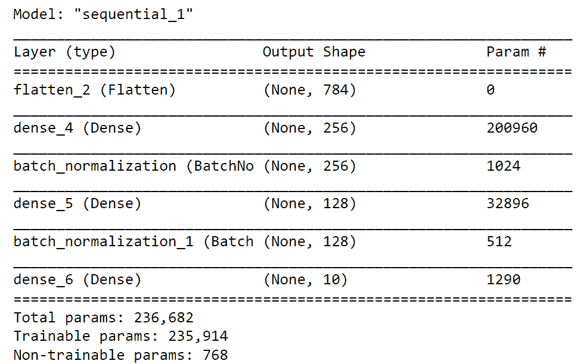
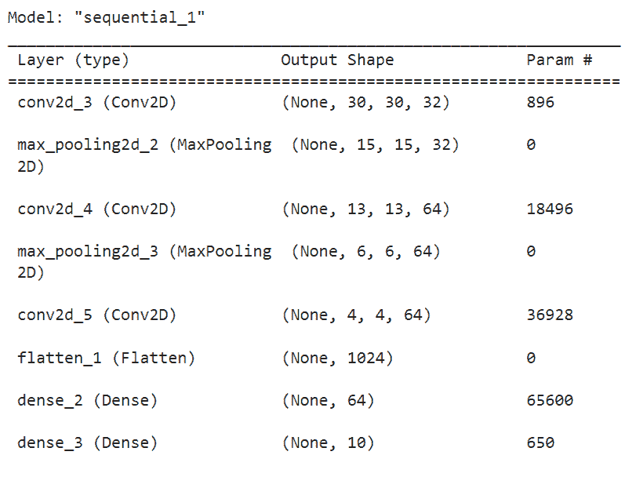
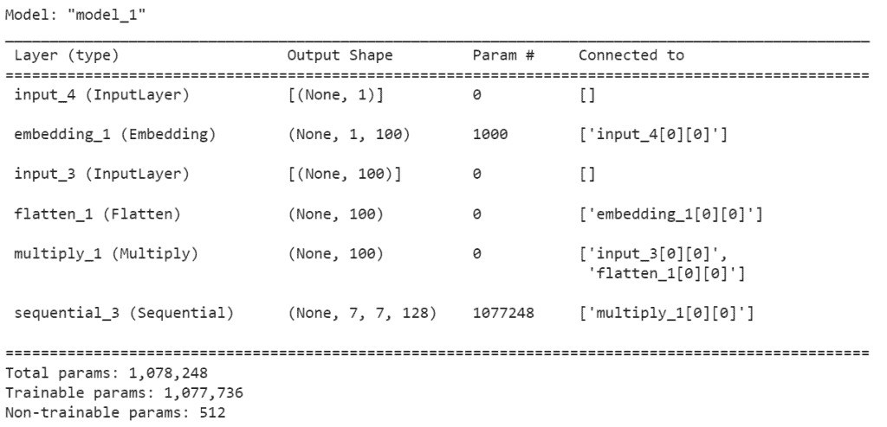
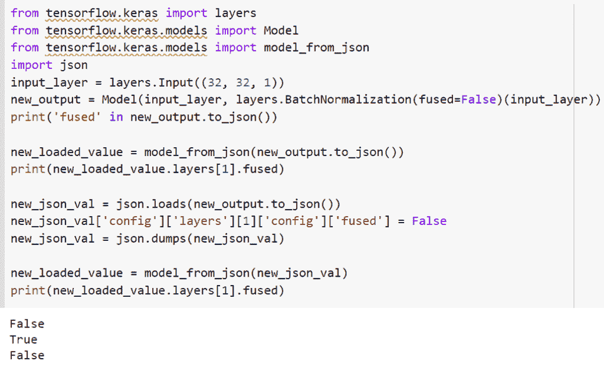
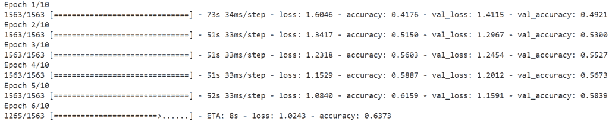
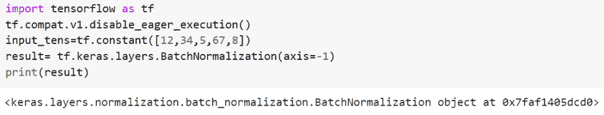
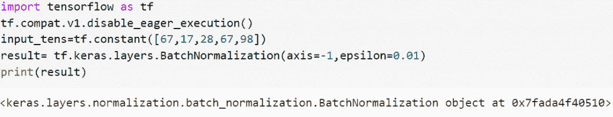
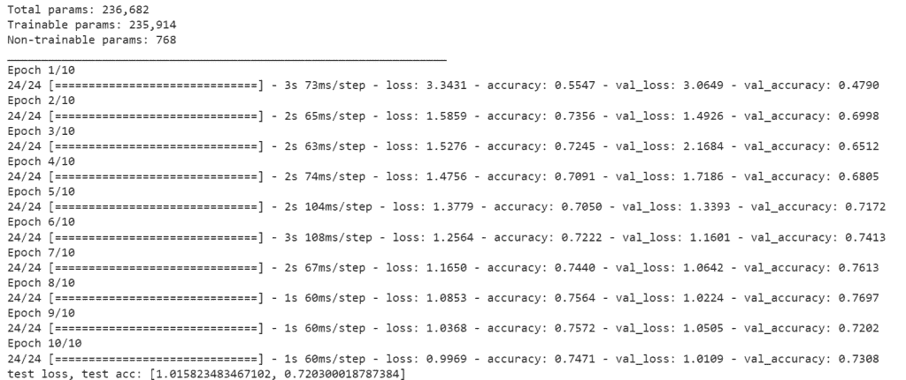
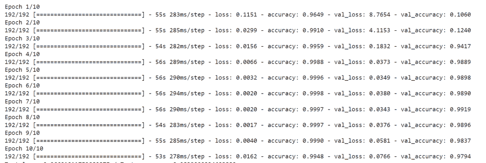
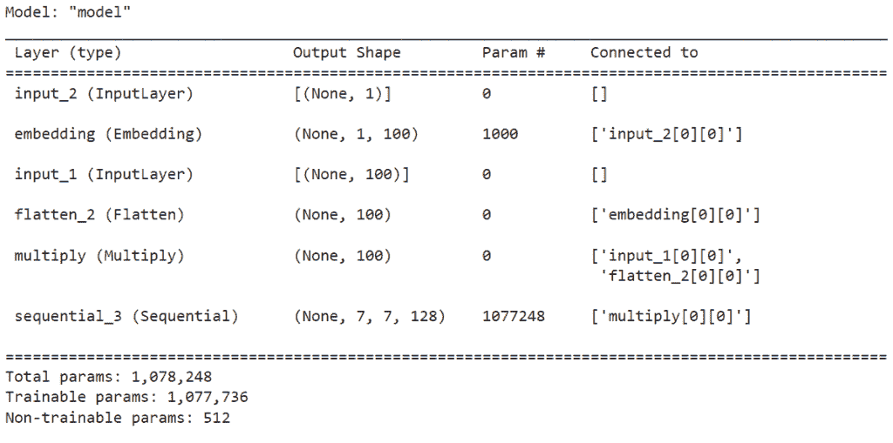

# 批量归一化 tensor flow【10 个惊人的例子】

> 原文：<https://pythonguides.com/batch-normalization-tensorflow/>

[](https://sharepointsky.teachable.com/p/python-and-machine-learning-training-course)

在这个 [Python 教程](https://pythonguides.com/learn-python/)中，我们将重点关注在我们的模型中定制*，并且我们还将看一些如何在 *`TensorFlow`* 中规范化的例子。我们将讨论这些话题。*

 **   Batch normalization TensorFlow Keras
*   批量归一化张量流 CNN 示例
*   条件批量归一化张量流
*   融合批处理归一化张量流
*   TensorFlow 批量归一化权重
*   TensorFlow 批处理规范化不起作用
*   张量流批量归一化ε
*   TensorFlow 批量标准化激活
*   张量流顺序批处理归一化
*   张量流密集批处理规范化

目录

[](#)

*   [批量归一化张量流](#Batch_Normalization_TensorFlow "Batch Normalization TensorFlow")
*   [批量归一化张量流 CNN 示例](#Batch_normalization_TensorFlow_CNN_example "Batch normalization TensorFlow CNN example")
*   [条件批量归一化张量流](#Conditional_batch_normalization_TensorFlow "Conditional batch normalization TensorFlow")
*   [融合批量归一化张量流](#Fused_batch_normalization_TensorFlow "Fused batch normalization TensorFlow")
*   [TensorFlow 批量归一化权重](#TensorFlow_batch_normalization_weights "TensorFlow batch normalization weights ")
*   [张量流批量归一化不起作用](#TensorFlow_batch_normalization_not_working "TensorFlow batch normalization not working")
*   [张量流批量归一化ε](#TensorFlow_batch_normalization_epsilon "TensorFlow batch normalization epsilon")
*   [TensorFlow 批量归一化激活](#TensorFlow_batch_normalization_activation "TensorFlow batch normalization activation")
*   [TensorFlow 顺序批量标准化](#TensorFlow_sequential_batch_normalization "TensorFlow sequential batch normalization")
*   [TensorFlow 密集批量归一化](#TensorFlow_dense_batch_normalization "TensorFlow dense batch normalization")

## 批量归一化张量流

*   在训练神经网络时，我们希望以某种方式提前规范化或标准化我们的数据，作为预处理步骤的一部分。
*   这是我们准备数据以便为训练做好准备的步骤标准化和规范化都有相同的目标，即转换数据以将所有数据点放在相同的范围内。典型的标准化过程包括将数字数据缩小到从 0 到 1 的范围内。
*   批规范化应用于您选择在网络中应用的图层。将批规范化应用于图层时，批规范化首先要做的是对激活函数的输出进行规范化。
*   批处理规范化是向深度神经网络添加附加层以加速和稳定神经网络的过程。在源自前一层的层的输入上，新的层应用标准化和规范化过程。

现在我们已经清楚了批处理规范化的要求，让我们检查它的操作并讨论步骤

示例:

```py
import tensorflow as tf
import numpy as np
from tensorflow.keras.models import Sequential
from tensorflow.keras.layers import Flatten
from tensorflow.keras.layers import Dense
from tensorflow.keras.layers import Activation
import matplotlib.pyplot as plt
from tensorflow.keras.layers import Dense, BatchNormalization
(x_train, y_train), (x_test, y_test) = tf.keras.datasets.mnist.load_data()
x_train = x_train.astype('float32')
x_test = x_test.astype('float32')

new_scale_val = 255.0
x_train /= 255.0
x_test /= 255.0
print("Feature matrix:", x_train.shape)
print("Target matrix:", x_test.shape)
print("Feature matrix:", y_train.shape)
print("Target matrix:", y_test.shape)
model = Sequential([

	# reshape 28 row * 28 column data to 28*28 rows
	Flatten(input_shape=(28, 28)),

	# dense layer 1
	Dense(256, activation='sigmoid'),
    # Batch normalization
    BatchNormalization(),

	# dense layer 2
	Dense(128, activation='sigmoid'),
    BatchNormalization(),

	# output layer
	Dense(10, activation='sigmoid'),
])
model.summary()
model.compile(optimizer='adam',
			loss='sparse_categorical_crossentropy',
			metrics=['accuracy'])
model.fit(x_train, y_train, epochs=10,
		batch_size=2000,
		validation_split=0.2)
results = model.evaluate(x_test, y_test, verbose = 0)
print('test loss, test acc:', results)
```

*   在本例中，我们将使用数据集，为此，我将使用 `tf.keras.datasets` 下的 mnist 数据集，然后我将训练和测试数据加载为 `(x_train y_train)` 。因为输入特征在 0 到 255 之间。我会把它除以 255 来归一化。
*   之后，我将创建一个新的序列模型，其中有一个单独的图层，名为 model =`TF . keras . models . sequential`，因此在第一个图层中，我创建了一个扁平化的图层，它将获取 shape (28，28)的输入图像。在第二层中，我创建了一个具有 512 个神经元的密集层，激活函数为 relu，它被具有 `drop_out rate =0.2` 的层丢弃，最终输出层创建了一个具有 10 个神经元的密集层，激活函数为 SoftMax。
*   现在我们将使用 `model.summary()` 来显示摘要。现在我将编译模型。所以在 TensorFlow 中批量归一化可以作为一个图层添加到模型中。
*   这个特殊的层负责带来所有的激活功能，我们也可以将这个层应用到第二个致密层

下面是以下代码的截图



Batch Normalization TensorFlow

正如您在摘要中看到的那样，添加了批次归一化层。

阅读:[张量流自定义损失函数](https://pythonguides.com/tensorflow-custom-loss-function/)

## 批量归一化张量流 CNN 示例

*   让我们看看如何在卷积神经网络中使用批量归一化。
*   卷积神经网络，也称为 CNN，用于计算机视觉应用，是一类用于分析视觉图像的深度神经网络。

示例:

```py
import tensorflow as tf 

from tensorflow.keras.layers import Dense, BatchNormalization 
from tensorflow.keras import datasets, layers, models 

import matplotlib.pyplot as plt 

(new_train_images, new_train_labels), (new_test_images, new_test_labels) = datasets.cifar10.load_data() 

new_train_images, new_test_images = new_train_images / 255.0, new_test_images / 255.0 

class_names = ['airplane', 'automobile', 'bird', 'cat', 'deer', 

               'dog', 'frog', 'horse', 'ship', 'truck'] 

plt.figure(figsize=(10,10)) 

for i in range(25): 

    plt.subplot(5,5,i+1) 

    plt.xticks([]) 

    plt.yticks([]) 

    plt.grid(False) 

    plt.imshow(new_train_images[i]) 

    plt.xlabel(class_names[new_train_labels[i][0]]) 

plt.show() 

model = models.Sequential() 

model.add(layers.Conv2D(32, (3, 3), activation='relu', input_shape=(32, 32, 3))) 

model.add(layers.MaxPooling2D((2, 2))) 
model.add(layers.Conv2D(64, (3, 3), activation='relu')) 

model.add(layers.MaxPooling2D((2, 2))) 

model.add(layers.Conv2D(64, (3, 3), activation='relu')) 

model.add(layers.Flatten()) 
BatchNormalization(),
model.add(layers.Dense(64, activation='relu')) 
BatchNormalization(),
model.add(layers.Dense(10)) 
model.summary()

model.compile(optimizer='adam', 

              loss=tf.keras.losses.SparseCategoricalCrossentropy(from_logits=True), 

              metrics=['accuracy']) 

history = model.fit(new_train_images, new_train_labels, epochs=10,  

                    validation_data=(new_test_images, new_test_labels)) 

plt.plot(history.history['accuracy'], label='accuracy') 

plt.plot(history.history['val_accuracy'], label = 'val_accuracy') 

plt.xlabel('Epoch') 

plt.ylabel('Accuracy') 

plt.ylim([0.5, 1]) 

plt.legend(loc='lower right') 

test_loss, test_acc = model.evaluate(new_test_images,  new_test_labels, verbose=2) 
```

在下面的代码中，我们导入了 TensorFlow 库，然后加载了数据集。我将使用 `tf.keras.datasets` 下的 cifar10 数据集，然后将训练和测试数据加载为 `(x_train y_train)` 。因为输入特征在 0 到 255 之间。我会把它除以 255 来归一化。

在那之后，我将创建一个新的序列模型，其中有一个单独的退出层，如 model =`TF . keras . models . sequential`所以在第一层中，我创建了一个展平层，它将接受形状为 **input_shape=(32，32，3)** 的输入图像。

你可以参考下面的截图



Batch normalization TensorFlow CNN example

这就是我们如何通过 TensorFlow 在批量归一化中使用卷积神经网络。

阅读:[tensor flow next _ batch+Examples](https://pythonguides.com/tensorflow-next_batch/)

## 条件批量归一化张量流

*   批处理规范化有一个类条件形式，称为条件批处理规范化(CBN)。主要概念是从一个嵌入中推断出批处理规范化的 and，比如 VQA 的一个语言嵌入。语言嵌入可以通过 CBN 通过缩放、取消或关闭单个特征来改变整个特征地图。为了使类别信息能够影响批量标准化参数，在 GANs 中也采用了 CBN。
*   最近，开发了条件批处理规范化，最近的一些研究似乎表明，它具有一些有趣的品质，并且在特定的工作负载中表现良好。

示例:

我们举个例子，了解一下如何在 TensorFlow 中添加条件批量规范化。

```py
from tensorflow.keras.layers import Dense, BatchNormalization 
from tensorflow.keras import datasets, layers, models 
from tensorflow.keras.layers import UpSampling2D, Reshape, Activation, Conv2D, BatchNormalization, LeakyReLU, Input, Flatten, multiply
from tensorflow.keras.layers import Dense, Embedding
from tensorflow.keras.layers import Dropout, Concatenate
from tensorflow.keras.models import Sequential, Model
from tensorflow.keras.datasets import mnist

import matplotlib.pyplot as plt
import numpy as np

(X_train,y_train),(X_test,y_test) = mnist.load_data()

new_image_width, new_image_height =(28,28)
new_image_channel = 1
img_shape = (new_image_width, new_image_height, new_image_channel)
number_of_outputs = 10
dimensions = 100

X_train.shape
def build_generator():
    model = Sequential()
    model.add(Dense(128*7*7, activation = 'relu', input_shape = (dimensions, )))
    model.add(Reshape((7,7,128)))
    model.add(UpSampling2D())
    model.add(Conv2D(128, 3, 2, padding = 'same'))
    model.add(BatchNormalization())
    model.add(LeakyReLU(alpha = 0.02))
    model.add(UpSampling2D())
    model.add(Conv2D(128, 3, 2, padding = 'same'))
    model.add(BatchNormalization())
    model.add(LeakyReLU(alpha = 0.02))
    model.add(UpSampling2D())
    model.add(Conv2D(128, 3, 2, padding = 'same'))
    model.add(Activation('tanh'))

    new_output = Input(shape= (dimensions,))
    label = Input(shape=(1,), dtype = 'int32')

    label_embedding = Embedding(number_of_outputs, dimensions, input_length = 1)(label)
    label_embedding = Flatten()(label_embedding)
    joined = multiply([new_output, label_embedding])

    img = model(joined)
    return Model([new_output, label], img)

generator = build_generator()
generator.summary()
```

*   让我们从导入构建条件 GAN (CGAN)架构所需的所有库和模块开始。
*   大多数层将用于构建 CGAN 模型网络。通过添加标签来训练模型，大部分 CGAN 架构将基于基本的 GAN 框架。
*   我们将使用嵌入层将标签转换成矢量表示。深度学习框架 TensorFlow 和 Keras 将用于加载所有层。n
*   接下来，我们将使用 mnist 数据集，并将数据加载到训练和测试部分。之后，我们提到了图像宽度，图像高度和通道的数量。MNIST 数据集中的每幅图像都是单通道、灰度图像，大小为 28 x 28。
*   总共十个类将作为我们的 CGAN 模型学习时的标签。定义的 z 维空间的默认值为 100。

下面是以下代码的截图



Conditional batch normalization TensorFlow

在给定的示例中，我们在 TensorFlow 中使用了条件批处理规范化。

阅读:[二元交叉熵张量流](https://pythonguides.com/binary-cross-entropy-tensorflow/)

## 融合批量归一化张量流

*   让我们举一个例子，了解如何在批处理规范化中添加融合参数。
*   在本例中，我们将使用`TF . keras . layers . Batch normalization()`函数的概念批处理规范化采用一种变换，使输出平均值和标准偏差分别接近于 **0 和 1** 。
*   在源自前一层的层的输入上，新的层应用标准化和规范化过程。

语法:

下面是 Python TensorFlow 中`TF . keras . layers . batch normalization()`函数的语法

```py
tf.keras.layers.BatchNormalization(
    axis=-1,
    momentum=0.99,
    epsilon=0.001,
    center=True,
    scale=True,
    beta_initializer='zeros',
    gamma_initializer='ones',
    moving_mean_initializer='zeros',
    moving_variance_initializer='ones',
    beta_regularizer=None,
    gamma_regularizer=None,
    beta_constraint=None,
    gamma_constraint=None,
    **kwargs
)
```

*   它由几个参数组成
    *   **轴**:需要归一化的轴是一个整数(一般是特征轴)。例如，在**数据格式=“通道优先”**的 Conv2D 图层后，在 BatchNormalization 中设置 `axis=1` 。默认情况下，它采用-1 值。
    *   **动量**:该参数用于定义移动平均线的动量。
    *   **ε**:默认情况下，值为 `0.001` ，方差中增加了一个小浮点数，以防止被零除。
    *   **中心**:检查条件是否成立，然后将β的偏移量归一化为张量。如果它是假的，那么β将被忽略。
    *   `scale` :检查条件，如果为真则乘以 gamma，如果为假则不使用 gamma。如果下一层是线性的**(例如 nn.relu)，**可以禁用，因为下一层将处理缩放。
    *   `beta_initializer` :该参数定义了 beta 权重的初始值。
    *   `gamma_initializer` :该参数指定 gamma 权重的初始值。
    *   **移动均值初始化器**:默认情况下，值为**【零】**，初始化为移动均值。
    *   `moving _ variance _ Initializer`:该参数定义了移动方差的初始化器，默认取**‘一’**值。

示例:

让我们举个例子，了解一下`TF . keras . layers . batchnormalization()`函数的工作原理。

```py
from tensorflow.keras import layers
from tensorflow.keras.models import Model
from tensorflow.keras.models import model_from_json
import json
input_layer = layers.Input((32, 32, 1))
new_output = Model(input_layer, layers.BatchNormalization(fused=False)(input_layer))
print('fused' in new_output.to_json())

new_loaded_value = model_from_json(new_output.to_json())
print(new_loaded_value.layers[1].fused)

new_json_val = json.loads(new_output.to_json())
new_json_val['config']['layers'][1]['config']['fused'] = False
new_json_val = json.dumps(new_json_val)

new_loaded_value = model_from_json(new_json_val)
print(new_loaded_value.layers[1].fused)
```

在下面给定的代码中，我们导入了 TensorFlow 模型包，然后将输入形状设置为 **((32，32，1))** 。接下来，我们将使用**层。BatchNormalization()** 函数，在这个函数中，我们将 fused= false 指定为参数。

你可以参考下面的截图。



fused batch normalization TensorFlow

这就是我们如何通过 TensorFlow 在批量标准化中使用融合参数。

阅读: [Tensorflow 嵌入 _ 查找](https://pythonguides.com/tensorflow-embedding_lookup/)

## TensorFlow 批量归一化权重

*   这种重新参数化权重的方法增强了优化问题的条件性，并且具有 tens 随机梯度下降收敛性。
*   虽然批次标准化是我们重新参数化的灵感来源，但是在小批次中的样本之间没有相关性。
*   我们可以采用大得多的学习速率，并允许用户批量标准化，从而进一步加速网络的训练。

**举例**:

```py
import tensorflow as tf
import tensorflow_addons as tfa
import numpy as np
from matplotlib import pyplot as plt
new_batch_size_val = 32
new_epochs_val = 10
number_classes=10
new_regression_model = tf.keras.Sequential([
    tf.keras.layers.Conv2D(6, 5, activation='relu'),
    tf.keras.layers.MaxPooling2D(2, 2),
    tf.keras.layers.Conv2D(16, 5, activation='relu'),
    tf.keras.layers.MaxPooling2D(2, 2),
    tf.keras.layers.Flatten(),
    tf.keras.layers.Dense(120, activation='relu'),
    tf.keras.layers.Dense(84, activation='relu'),
    tf.keras.layers.Dense(number_classes, activation='softmax'),
])
new_weight_model = tf.keras.Sequential([
    tfa.layers.WeightNormalization(tf.keras.layers.Conv2D(6, 5, activation='relu')),
    tf.keras.layers.MaxPooling2D(2, 2),
    tfa.layers.WeightNormalization(tf.keras.layers.Conv2D(16, 5, activation='relu')),
    tf.keras.layers.MaxPooling2D(2, 2),
    tf.keras.layers.Flatten(),
    tfa.layers.WeightNormalization(tf.keras.layers.Dense(120, activation='relu')),
    tfa.layers.WeightNormalization(tf.keras.layers.Dense(84, activation='relu')),
    tfa.layers.WeightNormalization(tf.keras.layers.Dense(number_classes, activation='softmax')),
])
(x_train, y_train), (x_test, y_test) = tf.keras.datasets.cifar10.load_data()

y_train = tf.keras.utils.to_categorical(y_train, number_classes)
y_test = tf.keras.utils.to_categorical(y_test, number_classes)

x_train = x_train.astype('float32')
x_test = x_test.astype('float32')
x_train /= 255
x_test /= 255
new_regression_model.compile(optimizer='adam', 
                  loss='categorical_crossentropy',
                  metrics=['accuracy'])

regression_history = new_regression_model.fit(x_train, y_train,
                            batch_size=new_batch_size_val,
                            epochs=new_epochs_val,
                            validation_data=(x_test, y_test),
                            shuffle=True)
new_weight_model.compile(optimizer='adam', 
                 loss='categorical_crossentropy',
                 metrics=['accuracy'])

new_weight_history = new_weight_model.fit(x_train, y_train,
                          batch_size=new_batch_size_val,
                          epochs=new_epochs_val,
                          validation_data=(x_test, y_test),
                          shuffle=True)
```

你可以参考下面的截图



TensorFlow-batch-normalization-weights

如您在摘要中所见，批量归一化图层是使用 TensorFlow 在历元中添加的。

阅读:[张量流 clip_by_value](https://pythonguides.com/tensorflow-clip_by_value/)

## 张量流批量归一化不起作用

*   在本节中，我们将讨论批处理规范化在 TensorFlow 中不起作用。
*   为了执行这个任务，我们将使用函数的概念
*   批量标准化采用一种变换，使输出平均值和标准偏差分别接近于 **0 和 1** ，在这个函数中，我们将设置**轴=-1** 。

**语法**:

我们先来看看语法，了解一下`TF . keras . layers . batch normalization()`函数的工作原理。

```py
tf.keras.layers.BatchNormalization(
    axis=-1,
    momentum=0.99,
    epsilon=0.001,
    center=True,
    scale=True,
    beta_initializer='zeros',
    gamma_initializer='ones',
    moving_mean_initializer='zeros',
    moving_variance_initializer='ones',
    beta_regularizer=None,
    gamma_regularizer=None,
    beta_constraint=None,
    gamma_constraint=None,
    **kwargs
)
```

**举例**:

```py
import tensorflow as tf
tf.compat.v1.disable_eager_execution()
input_tens=tf.constant([12,34,5,67,8])
result= tf.compat.v1.keras.layers.BatchNormalization(axis=-1)
print(result)
```

在本例中，我们使用了`TF . compat . v1 . keras . layers . batch normalization()`函数的概念，该函数将在 tensorflow 2.x 和 1.x 版本中工作。

下面是下面给出的代码的截图。



TensorFlow batch normalization not working

在这里，我们得到了批量标准化的解决方案是在 TensorFlow 中工作。

阅读:[张量流图-详细指南](https://pythonguides.com/tensorflow-graph/)

## 张量流批量归一化ε

*   在本例中，我们将在 TensorFlow 的批处理规范化函数中使用 epsilon 参数。
*   默认情况下，epsilon 的值为 `0.001` ，Variance 中添加了一个小的浮点数，以防止被零除。

示例:

```py
import tensorflow as tf
tf.compat.v1.disable_eager_execution()
input_tens=tf.constant([67,17,28,67,98])
result= tf.keras.layers.BatchNormalization(axis=-1,epsilon=0.01)
print(result)
```

下面是以下给定代码的实现



TensorFlow batch normalization epsilon

这就是我们如何通过 TensorFlow 在批量标准化中使用 epsilon 参数。

阅读:[张量流均方误差](https://pythonguides.com/tensorflow-mean-squared-error/)

## TensorFlow 批量归一化激活

*   在这一节中，我们将讨论如何通过 TensorFlow 在批处理规范化中使用激活函数。
*   激活功能有助于标准化任何输入值在 **1 和-1** 之间的输出。因为神经网络偶尔在数百万个数据点上被训练，所以激活函数需要是有效的并且应该缩短计算时间。
*   在本例中，我们将使用“relu”激活功能。整流线性单位，或 ReLU，是现在最流行的激活函数，范围从 0 到无穷大。由于其转换速度很快，既不能映射也不能充分适应数据，这带来了挑战。然而，哪里有问题，哪里就有解决办法。

示例:

让我们举一个例子，检查如何在批处理规范化中使用激活函数

```py
import tensorflow as tf
import numpy as np
from tensorflow.keras.models import Sequential
from tensorflow.keras.layers import Flatten
from tensorflow.keras.layers import Dense
from tensorflow.keras.layers import Activation
import matplotlib.pyplot as plt
from tensorflow.keras.layers import Dense, BatchNormalization
(x_train, y_train), (x_test, y_test) = tf.keras.datasets.mnist.load_data()
x_train = x_train.astype('float32')
x_test = x_test.astype('float32')

new_scale_val = 255.0
x_train /= 255.0
x_test /= 255.0
print("Feature matrix:", x_train.shape)
print("Target matrix:", x_test.shape)
print("Feature matrix:", y_train.shape)
print("Target matrix:", y_test.shape)
model = Sequential([

	# reshape 28 row * 28 column data to 28*28 rows
	Flatten(input_shape=(28, 28)),

	# dense layer 1
	Dense(256, activation='relu'),
    # Batch normalization
    BatchNormalization(),

	# dense layer 2
	Dense(128, activation='relu'),
    BatchNormalization(),

	# output layer
	Dense(10, activation='relu'),
])
model.summary()
model.compile(optimizer='adam',
			loss='sparse_categorical_crossentropy',
			metrics=['accuracy'])
model.fit(x_train, y_train, epochs=10,
		batch_size=2000,
		validation_split=0.2)
results = model.evaluate(x_test, y_test, verbose = 0)
print('test loss, test acc:', results)
```

在本例中，我们将使用数据集，为此，我将使用 `tf.keras.datasets` 下的 mnist 数据集，然后我将训练和测试数据加载为 **(x_train y_train)。**因为输入特性在 **0 到 255** 之间。我会把它除以 255 来归一化。

在给定的例子中，我们已经将激活函数用作 relu，并将纪元值设置为 10。

下面是下面给出的代码的截图。



TensorFlow batch normalization activation

正如您在摘要中看到的，批量标准化激活是使用 TensorFlow 在 epochs 中添加的。

阅读: [Tensorflow 迭代张量](https://pythonguides.com/tensorflow-iterate-over-tensor/)

## TensorFlow 顺序批量标准化

*   在这里，我们通过 TensorFlow 在批量标准化中使用顺序模型。
*   简单地按顺序放置 Keras 层是顺序 API 背后的基本概念，因此得名。
*   大多数人工神经网络也有按顺序排列的层，数据按指定的顺序从一层流向下一层，直到最终到达输出层。

示例:

```py
import tensorflow as tf
from tensorflow.keras.models import Sequential
from tensorflow.keras.layers import Dense, Flatten
from tensorflow.keras.layers import Conv2D, MaxPooling2D
from tensorflow.keras.layers import BatchNormalization

# Model configuration
new_batch_size = 250
number_of_epochs = 10
number_of_classes = 10
new_validation_split = 0.2
new_verbosity = 1

# Load mnist dataset
(input_train, target_train), (input_test, target_test) = tf.keras.datasets.mnist.load_data()

input_train_shape = input_train.shape
input_test_shape = input_test.shape 

new_shape_val = (input_train_shape[1], input_train_shape[2], 1)

# Reshape the training data to include channels
input_train = input_train.reshape(input_train_shape[0], input_train_shape[1], input_train_shape[2], 1)
input_test = input_test.reshape(input_test_shape[0], input_test_shape[1], input_test_shape[2], 1)

# Parse numbers as floats
input_train = input_train.astype('float32')
input_test = input_test.astype('float32')

# Normalize input data
input_train = input_train / 255
input_test = input_test / 255

# Create the model
model = Sequential()
model.add(Conv2D(32, kernel_size=(3, 3), activation='relu', input_shape=new_shape_val))
model.add(BatchNormalization())
model.add(MaxPooling2D(pool_size=(2, 2)))
model.add(BatchNormalization())
model.add(Conv2D(64, kernel_size=(3, 3), activation='relu'))
model.add(BatchNormalization())
model.add(MaxPooling2D(pool_size=(2, 2)))
model.add(BatchNormalization())
model.add(Flatten())
model.add(Dense(256, activation='relu'))
model.add(BatchNormalization())
model.add(Dense(number_of_classes, activation='softmax'))

# Compile the model
model.compile(loss=tf.keras.losses.sparse_categorical_crossentropy,
              optimizer=tf.keras.optimizers.Adam(),
              metrics=['accuracy'])

# Fit data to model
history = model.fit(input_train, target_train,
            batch_size=new_batch_size ,
            epochs=number_of_epochs ,
            verbose=new_verbosity,
            validation_split=new_validation_split)

# Generate generalization metric  s
score = model.evaluate(input_test, target_test, verbose=0)
print(f'Test loss: {score[0]} / Test accuracy: {score[1]}')
```

我将使用 `tf.keras.datasets` 下的 mnist 数据集，然后将训练和测试数据加载为(x_train y_train)。因为输入特征在 0 到 255 之间。我会把它除以 255 来归一化。

在那之后，我将创建一个新的序列模型，其中有一个单独的退出层，如 model =`TF . keras . models . sequential`所以在第一层中，我创建了一个展平层，它将接受形状为 **input_shape=(32，32，3)** 的输入图像。

下面是下面给出的代码的截图。



TensorFlow sequential batch normalization

这就是我们如何通过 TensorFlow 使用顺序批处理规范化。

阅读: [Python TensorFlow 截断法线](https://pythonguides.com/tensorflow-truncated-normal/)

## TensorFlow 密集批量归一化

*   在本节中，我们将讨论如何通过 TensorFlow 在批量规范化中使用密集图层。
*   密集层是具有许多连接的神经网络的典型层。这是最典型和最常用的一层。密集层对输入执行以下操作，并返回输出。

示例:

```py
from tensorflow.keras.layers import Dense, BatchNormalization 
from tensorflow.keras import datasets, layers, models 
from tensorflow.keras.layers import UpSampling2D, Reshape, Activation, Conv2D, BatchNormalization, LeakyReLU, Input, Flatten, multiply
from tensorflow.keras.layers import Dense, Embedding
from tensorflow.keras.layers import Dropout, Concatenate
from tensorflow.keras.models import Sequential, Model
from tensorflow.keras.datasets import mnist

import matplotlib.pyplot as plt
import numpy as np

(X_train,y_train),(X_test,y_test) = mnist.load_data()

new_image_width, new_image_height =(28,28)
new_image_channel = 1
img_shape = (new_image_width, new_image_height, new_image_channel)
number_of_outputs = 10
dimensions = 100

X_train.shape
def build_generator():
    model = Sequential()
    model.add(Dense(128*7*7, activation = 'relu', input_shape = (dimensions, )))
    model.add(Reshape((7,7,128)))
    model.add(UpSampling2D())
    model.add(Conv2D(128, 3, 2, padding = 'same'))
    model.add(BatchNormalization())
    model.add(LeakyReLU(alpha = 0.02))
    model.add(UpSampling2D())
    model.add(Conv2D(128, 3, 2, padding = 'same'))
    model.add(BatchNormalization())
    model.add(LeakyReLU(alpha = 0.02))
    model.add(UpSampling2D())
    model.add(Conv2D(128, 3, 2, padding = 'same'))
    model.add(Activation('tanh'))

    new_output = Input(shape= (dimensions,))
    label = Input(shape=(1,), dtype = 'int32')

    label_embedding = Embedding(number_of_outputs, dimensions, input_length = 1)(label)
    label_embedding = Flatten()(label_embedding)
    joined = multiply([new_output, label_embedding])

    img = model(joined)
    return Model([new_output, label], img)

generator = build_generator()
generator.summary()
```

你可以参考下面的截图。



TensorFlow dense batch normalization

正如你在截图中看到的，我们已经通过 TensorFlow 在批量标准化中使用了密集层。

还有，多看看一些 TensorFlow 教程。

*   [Python tensor flow expand _ dims](https://pythonguides.com/tensorflow-expand_dims/)
*   [Python TensorFlow one_hot](https://pythonguides.com/tensorflow-one_hot/)
*   [TensorFlow 自然语言处理](https://pythonguides.com/tensorflow-natural-language-processing/)
*   [Python tensor flow reduce _ mean](https://pythonguides.com/python-tensorflow-reduce_mean/)
*   [Python tensor flow reduce _ sum](https://pythonguides.com/python-tensorflow-reduce_sum/)

在本教程中，我们学习了如何在我们的模型中自定义批处理规范化，并且我们还查看了如何在 TensorFlow 中进行规范化的一些示例。我们已经讨论了这些主题。

*   Batch normalization TensorFlow Keras
*   批量归一化张量流 CNN 示例
*   条件批量归一化张量流
*   融合批处理归一化张量流
*   TensorFlow 批量归一化权重
*   TensorFlow 批处理规范化不起作用
*   张量流批量归一化ε
*   TensorFlow 批量标准化激活
*   张量流顺序批处理归一化
*   张量流密集批处理规范化

[Bijay Kumar](https://pythonguides.com/author/fewlines4biju/)

Python 是美国最流行的语言之一。我从事 Python 工作已经有很长时间了，我在与 Tkinter、Pandas、NumPy、Turtle、Django、Matplotlib、Tensorflow、Scipy、Scikit-Learn 等各种库合作方面拥有专业知识。我有与美国、加拿大、英国、澳大利亚、新西兰等国家的各种客户合作的经验。查看我的个人资料。

[enjoysharepoint.com/](https://enjoysharepoint.com/)[](https://www.facebook.com/fewlines4biju "Facebook")[](https://www.linkedin.com/in/fewlines4biju/ "Linkedin")[](https://twitter.com/fewlines4biju "Twitter")*