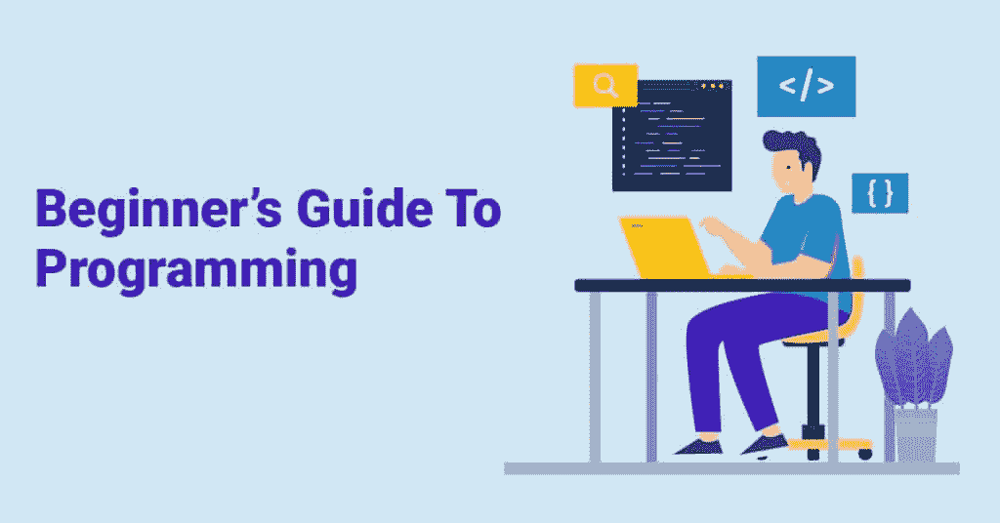
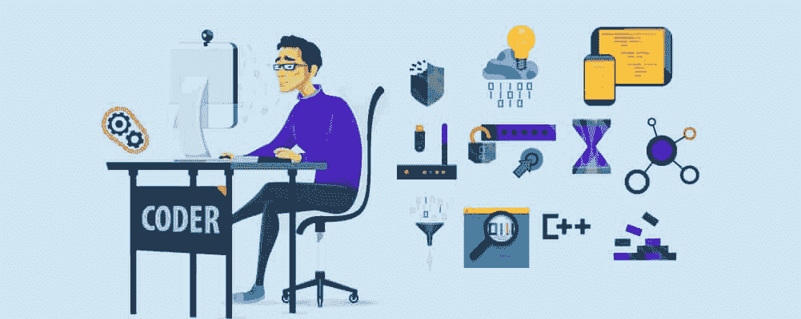
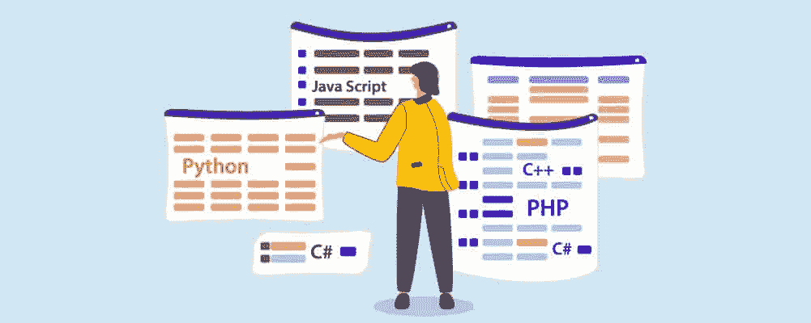

# 编程初学者指南(Python 在列表之首)

> 原文：<https://pythonguides.com/beginners-guide-to-programming/>

对许多人来说，编程就像学习另一种语言一样陌生。撒上一些科幻曼波，你就有了一大堆只有你有学位才能理解的行话，对吗？

虽然编程有很多活动的部分，但是任何人都可以学习如何去做。你只需要开始这个过程。

今天，我们将为您提供开始编程所需的构建模块。一旦你读完了我们的指南，编码和计算机的世界就不会那么令人生畏了。

学习基础知识、编码的重要性和编程基础。我们甚至会提供一些提示来帮助你度过最困难的部分。

目录

*   [基础知识](#The_Basics "The Basics")
    *   [什么是编程？](#What_Is_Programming "What Is Programming?")
    *   [什么是编程语言？](#What_Are_Programming_Languages "What Are Programming Languages?")
*   [为什么要学习编码？](#Why_Learn_To_Code "Why Learn To Code?")
    *   [建立专业技能](#Build_Professional_Skills "Build Professional Skills")
    *   [能够创建自己的网站、应用程序或游戏](#Able_To_Create_Your_Own_Website_App_Or_Game "Able To Create Your Own Website, App, Or Game")
    *   [能够提供自由工作](#Able_To_Offer_Freelance_Work "Able To Offer Freelance Work")
    *   [一大爱好](#A_Great_Hobby "A Great Hobby")
    *   [能够理解数字世界](#Able_To_Understand_The_Digital_World "Able To Understand The Digital World")
*   [编程基础](#Programming_Fundamentals "Programming Fundamentals")
    *   [了解可用的不同语言](#Understand_The_Different_Languages_Available "Understand The Different Languages Available")
        *   [Python](#Python "Python")
        *   [Java](#Java "Java")
        *   [红宝石](#Ruby "Ruby")
        *   [HTML](#HTML "HTML")
        *   [C 语言](#C_Language "C Language")
    *   [了解不同的数据类型](#Understand_Different_Data_Types "Understand Different Data Types")
        *   [INT–整数](#INT_-_Integer "INT – Integer")
        *   [FLOAT–浮点型](#FLOAT_-_Floating-Point "FLOAT – Floating-Point")
        *   [CHAR–字符](#CHAR_-_Character "CHAR – Character")
        *   [STR–字符串](#STR_-_String "STR – String")
        *   [布尔–布尔型](#BOOL_-_Boolean "BOOL – Boolean")
    *   [理解条件句](#Understand_Conditionals "Understand Conditionals")
    *   [理解循环](#Understand_Loops "Understand Loops")
    *   [了解功能](#Understand_Functions "Understand Functions")
*   [给初学者的提示](#Tips_For_Beginners "Tips For Beginners")
    *   [熟悉计算机架构](#Familiarize_Yourself_With_Computer_Architecture "Familiarize Yourself With Computer Architecture")
    *   [熟悉数据基础知识](#Familiarize_Yourself_With_Data_Basics "Familiarize Yourself With Data Basics")
    *   [花时间理解编程语言是如何工作的](#Take_Time_To_Understand_How_Programming_Languages_Work "Take Time To Understand How Programming Languages Work")
        *   [Python](#Python-2 "Python")
        *   [JavaScript](#JavaScript "JavaScript")
        *   [Java](#Java-2 "Java")
        *   [R](#R "R")
        *   [C](#C "C")
    *   [占用 HTML](#Take_Up_HTML "Take Up HTML")
    *   [练习命令行](#Practice_Command_Lines "Practice Command Lines")
    *   [了解互联网如何工作](#Learn_How_The_Internet_Works "Learn How The Internet Works")
    *   [练习 CSS](#Practice_CSS "Practice CSS")
    *   [开始编程！](#Start_Programming "Start Programming!")
*   [总结](#Summary "Summary")

## **基础知识**

从基础开始，你需要学习什么是编程，什么是编程语言。我们将使用您在任何软件中可能会用到的术语来解释这两个元素，但是我们也将解释术语的含义。准备好了吗？让我们开始吧！

### **什么是编程？**

十有八九，你可能每天都在使用电脑。电脑是任何类型的数字电子机器，这意味着你的智能手机就像你的笔记本电脑一样是一台电脑。

计算机的主要功能是处理和储存信息。然而，如果没有一个程序，它就无法做到这一点。想象一个有空间储存货物的工厂。它有潜力组织一个企业，但是没有人(我们对编程的比喻)，什么也做不成。

编程软件将告诉计算机如何摄取数据，处理数据，然后存储数据。[摄取](https://www.techtarget.com/whatis/definition/data-ingestion#:~:text=Data%20ingestion%20is%20the%20process,time%20or%20ingested%20in%20batches.)是获取信息的方法，处理是组织和使用的方法，存储(你可能会猜到)是保持数据的安全。

软件是计算机内部可下载的内容，硬件是你可以触摸的物理方面(如屏幕、鼠标或笔记本电脑本身)。

当你创建一个程序时，你正在创建一个计算机遵循的指令列表。计算机会完全按照你说的去做，这意味着你不能给解释或人类理解留有余地。

这是编程中最大的问题之一，因为我们经常没有意识到我们的语言有多少是基于微妙的文化理解而不是直接的语言。为了确保没有任何东西被计算机误解，你通常必须将一个过程分解到最细微的细节，并多次观察计算机完成程序。

### **什么是编程语言？**

就其核心而言，计算机只理解一件事“开”和“关”。当我们创造一个代码时，我们拨动这些开关来创造一种语言——就像莫尔斯电码。这种语言叫做[二进制](https://www.bbc.co.uk/bitesize/guides/zwsbwmn/revision/1)，用 1 和 0 来表示。

通过多年的创造力研究，技术世界已经创造了允许我们使用自己的语言(通常是美国英语)与计算机对话的软件。它像一个翻译系统，如谷歌翻译。

这意味着你不需要学习二进制来开始编程。只要懂美式英语，就可以编码。

当人们谈论编程语言时，他们正在讨论用于语言转换的软件。最流行的是 Python、JavaScript 和 c。每一种都允许你以不同的方式与计算机交流，通常选择更多的控制或更简单的使用。

例如，Python 允许你用一种更接近人类语言的语言与计算机对话，而 C 是一种更古老的软件，需要更微妙的用词选择。

## **为什么要学编码？**

如果您正在阅读这篇文章，那么您可能已经有了开始学习代码的理由。但是理解编码在你的个人和职业生活中帮助你的许多方式是有帮助的。

在深入基础知识之前，我们想解释一下为什么每个人都应该学习如何编码。

### **打造职业技能**

如果你能在简历中把“编码”添加到你的技能列表中，那么你很可能比一般人多赚 145%(根据英国的一项研究)。随着数字世界越来越重要，会编码会让你成为一个有需求技能的人。

你也不需要转向技术性的角色，因为编码可以用在大多数工作的几乎任何部分。例如，如果你在通信领域工作，成为一名编码员意味着创建一个系统，这个系统将允许一个更精简的通信系统，以适应你的团队结构。不需要使用标准系统或雇人用你的想法创造东西。相反，你可以简单地自己做。

### **能够创建自己的网站、应用或游戏**

当你知道如何编码时，创建在线平台就变得容易多了。你可以用这些信息为你的企业创建一个网站，或者用它为自己创造一些乐趣。

我们很多人都有令人兴奋的想法，关于我们在空闲时间做的有趣的活动。也许你喜欢园艺，也想和其他园艺爱好者分享你的经验？如果你知道如何编码，你可以创建一个应用程序，让人们分享技巧，展示他们的花园，或者讨论保持植物存活的方法。

能够创建自己的数字空间可以让你接触到一个和你一样的人的世界，创建一个你无法接触到的社区。

### **能够提供自由工作的**

如果你喜欢忙碌，想要更多的方法来创造现金流，那么学习如何编码可以为你打开那扇门。在你的空闲时间，你可以完成自由职业者的工作，为其他人创建网站、应用程序或游戏。

您可以享受创造意想不到的数字体验的乐趣，同时赚取额外的金钱。很少有人知道如何编码，然而这是我们社会中最基本的技能之一。这意味着你应该有一个大的客户群可供选择，让你可以选择自己感兴趣的工作。

### **一大爱好**

不管你是为自己和自己的网站想法编码，还是用这个技能带来更多的现金。无论哪种方式，你都会体验到创造一个东西并展示给世界的奇妙感觉。

看着越来越多的人使用你创造的东西，会给你巨大的快乐。看到这些数字越来越高，因为其他人通过你的项目找到了快乐或理解，这会给你一种前所未有的自豪感。

在编码世界的另一边，创造一些东西本身会让人觉得是一项了不起的成就。其他人是否能看到并不重要——当你的代码顺利运行，你的作品如预期的那样运行时，成就感是巨大的。

编码是一种非常有益的体验，因为你可以建立在你的知识之上，看着你自己在你的创作中获得越来越多的信心。很快你将会编码你生活中的所有东西，甚至是购物清单。

### **能够理解数字世界的**

可以说，编码最重要的部分是随着技术的发展你将获得的关于技术的知识。每年都有越来越多的技术被开发出来，这是非常容易落后于时代的。

理解编码将有助于你迈出第一步。你的知识会随着世界知识的增加而增加，让你不再停留在早期的数字时代。

你还将获得对数字世界的全新视角，了解不断增长的数字景观。这意味着当新技术出现时，你会知道它的真正价值。你会自信地说，某样东西是物有所值，还是仅仅是抢钱。

当人们学习如何编码时，他们开始理解他们以前会忽略的项目的价值。你开始理解技术如何让你的生活变得更容易，并开始培养一批不寻常的设备，这些设备是其他程序员喜欢的，也是其他人挠头的。

实际上，学习代码的真正原因是因为你想学。如果你想开始一个副业，想开发一个游戏，或者只是想充实你的简历，都没关系。不管你的理由是什么，你已经找到了正确的起点。

现在是时候学习更多了！

## **编程基础**

编程的基础是这门学科最重要的方面。这些区域是程序语言、数据类型、条件、循环和函数。

理解所有这些是如何工作的，将为你创建一个稳定的代码打下基础。我们将解释每个概念，并举例帮助你理解基础知识。

### **了解不同的语言可用**

你可以使用多种不同的语言。我们将浏览最受欢迎的，所以这个列表将包括新程序员的最佳选择，但它不是一个完整的列表。

#### `Python`

[Python](https://sharepointsky.teachable.com/p/python-and-machine-learning-training-course) 是一个高级工具。新手不应该使用这种语言，但是一旦你掌握了编码的窍门，你应该直接使用这种语言。

Python 非常适合网站和互联网开发。读起来很容易，只要懂基础就很好学。

#### `Java`

Java 是大多数人的起点。它是一种高级编程语言，几乎可以用于任何事情。专业人士倾向于使用 Java 来创建软件。如果你计划创建一个应用程序，你应该使用 Java，因为大多数 Android 应用程序都包含它作为核心基础。

#### **红宝石**

Ruby 是一种开源语言，这意味着它对公众开放。开源程序通常可以免费使用，但任何人都可以修改。这意味着人们可以恶意劫持你的软件。我们建议在开始编程时使用 Ruby，但是要注意它的特性。

#### `HTML`

也称为超文本标记语言，HTML 是人们用来创建网页的标准标记语言。该软件确保您的文本和图像的格式是正确的。

HTML 是最容易学习的语言之一，它是免费的，任何有网络连接的人都可以访问。

#### **C 语言**

c 语言是一种中庸的编程语言。大多数人用它来开发低级别的 app，不需要很多现代的配件。

有人说 C 语言很容易掌握，因为你只需要学习 32 个关键字。然而，使用这么小的单词集合本身就很困难。

### **理解不同的数据类型**

数据类型是数据语言的一部分。它告诉计算机它应该如何解释给定的信息，并按照你的愿望来行动。

确保您了解这些不同的类型将有助于您收集一致的数据并减少错误。

同样，这是最常见数据类型的列表，而不是完整的列表。

#### **INT–整数**

INT 可以说是数字最常见的数据格式。它存储不带小数点的数字。如果你正在处理财务预算，1.99 美元是不会被接受的。它必须是一个整数。

#### **FLOAT–浮点**

FLOAT 是数字的另一种数据格式。这一次，您可以使用小数部分(小数点)。如果您使用浮点数据类型，那么$1.99 的例子是可以接受的。

虽然大多数系统使用 int 和 floats，如果你需要创建一些一致的 int 格式，直接设置数据类型会导致更一致的数据。

#### **CHAR–Character**

每个字母、标点符号、符号或空格都是一个字符。

#### **STR–String**

字符串是一系列字符。例如，电话号码是一个字符串。它可以像“+1-555-888-3333”或“155888333”一样存储，并且仍然被识别为字符串。

#### **布尔–布尔**

现在我们开始研究一些不太为人所知但常用的数据类型。布尔型使用“真”和“假”的数据格式。它们可以帮助过滤数据以创建干净的流。例如，你可以要求程序将你的客户数据组织成美国客户和国际客户——“如果是美国的，那么就是真的”。这种是或否的回答系统可以使归档更简单。

这个列表还可以继续下去，但这些都是您在开始编码时可能会看到的最常用的数据类型。

### **理解条件句**

条件语句是一种帮助计算机做出决策的编码方法。比如[“如果> 95 = ColorValue(绿色)](https://exceljet.net/nested-ifs)。“IF”允许计算机使用布尔数据类型来考虑该语句是真还是假。

在我们的例子中，计算机会考虑这个数字是否大于 95，如果大于 95，单元格就会变成绿色。

你也可以让条件[变得更复杂](https://technovationchallenge.org/curriculum/coding-7/#:~:text=In%20coding%2C%20you%20ask%20your,when%20the%20condition%20is%20true.)，引出一连串的问题，让计算机对你要求的任何数据进行分类、组织或标记。

### **理解循环**

循环是指允许代码运行多次，搜索不同的值。

例如，您可以创建一封加密的电子邮件，向电子邮件列表中的每个人发送相同的信息，但在发送过程中会更改名称。

["Dev_employees = Josh，Jess，Joseph，Jean](https://welearncode.com/beginners-guide-programming/)

[对于开发-员工中的员工:](https://welearncode.com/beginners-guide-programming/)

[打印("嗨"+员工)"](https://welearncode.com/beginners-guide-programming/)

循环将遍历每个人的名字，直到循环完成。它可以在一段时间后完成，也可以在检查完每个值后完成，或者直到个性化 stop 功能被触发。

### **了解功能**

函数是允许你将一件事处理成另一件事的代码块。想象一头牛，这头牛是我们对一个函数的隐喻。当一头牛吃草(输入)，它的身体(功能)把草变成牛奶(输出)。

使用函数的一种常见方式是在某人进入网站时向其打招呼。当你登录到一个网页，你可能会注意到一个小图标弹出说“嗨[你的名字]”。

网站会被你的到来触发(输入)，在你的数据中搜索你的名字(功能)，并直接寻址你(输出)。

您可以命名您的函数，以便更容易触发它们，并允许它们从程序中的其他点被触发。

## **给初学者的提示**

现在你已经掌握了基本知识，我们想提供一些提示和建议。把这些智慧带到船上，当你发现自己在挣扎的时候，回头参考它们。

### **熟悉计算机架构**

随着编程语言的发展，你可以在不了解太多的情况下做更多的编码工作。这个概念被称为抽象，它允许我们通过简化过程来使用复杂或“高级”的工具。

这并不意味着你可以在很少或没有信息的情况下开始编程，这只是意味着你不需要硕士学位来理解基础知识。

当你遇到一些不寻常的事情时，大多数编码人员和程序员会利用他们的基础知识来解决更复杂的问题。正因为如此，你仍然需要了解编码的一般架构。没有这种基本的理解，你很容易迷失在行话中。

首先，你应该了解微芯片。微芯片是需要晶体管才能工作的小硬件。一个微芯片可能有数百万个晶体管。如果一个熔化了，可能会搞乱整个电路。

现代计算机将有一个中央处理器或中央处理器。这是一个更大的微芯片，可以处理困难的任务，如遵循条件指令。

接下来是随机存取存储器。这基本上就像一个短期记忆系统。它将存储输入的数据位，通常由 c 等较老的编程语言使用。

最后一个“必须知道”的是硬盘。这是你电脑的长期记忆。您的数据存储在这里，即使您关闭计算机，这些数据也会保存下来。如果你只有内存，那么当电源关闭时，数据也会随之消失。

### **熟悉数据基础知识**

数据严重依赖数学。虽然大部分工作使用了字符，创建了脚本，但是你仍然需要创建一个公式让计算机遵循。记住，计算机正在读取从你的语言程序翻译过来的 1 和 0。他们只看到数字。

您需要了解的最重要的数据基础是假设检验、正态分布和简单线性回归。现在就来简单解释一下。

[假设检验](https://www.investopedia.com/terms/h/hypothesistesting.asp)是指你使用统计学来决定你收集的数据是否足以支持你的假设。数据与理论相符吗？要做到这一点，你需要有两个假设，你的实际理论和一个“无效”理论，这意味着它不起作用。

只有一个是对的。接下来，创建一个图表来记录数据。之后，你分析数据。最后，你会看到图表是更符合理论还是更符合零假设。

[正态分布](https://www.investopedia.com/terms/n/normaldistribution.asp#:~:text=Normal%20distribution%2C%20also%20known%20as,appear%20as%20a%20bell%20curve.)是一种概率分布。一半的值应低于平均值或均值，另一半应高于平均值或均值。大多数数值都接近平均值。您的数据结果旨在创建一个正态分布，以显示大多数结果遵循一个中心趋势。

[简单线性回归](https://www.scribbr.com/statistics/simple-linear-regression/)是指来自变量的数据以直线返回。你观察两个变量之间的数据，看看它们是如何相互作用的。

所有这些都是统计数学方程或理论。知道如何处理这些数据将有助于你理解如何编码。

### **花时间了解编程语言是如何工作的**

我们已经讨论了您可以使用的多种不同类型的编程语言。但是在您开始了解其中一个之前，您应该考虑它们是如何工作的，以及哪一个最适合您的项目。

让我们简单解释一下每种流行的编程语言的优点。

#### `Python`

Python 擅长机器学习、人工智能和数据分析。它经常被 web 开发人员和应用程序创建者使用。

#### `JavaScript`

JavaScript 在许多设备上使用，比如 web 浏览器、容器、智能手机和云。大多数程序使用 JavaScript。

#### `Java`

Java 和 JavaScript 不一样，虽然出自同一家公司。Java 最适合 Android 开发者、Android 应用程序创建者、电子商务创建者和银行应用程序。

#### `R`

r 是另一种更古老的编程语言。它用于数据科学、机器学习、行为分析、分类和聚类。

#### `C`

c 语言非常适合游戏、云、容器和嵌入式系统。

### **占用 HTML**

学习编程的最好方法是参加一门课程。HTML 课程将涵盖你需要知道的所有基础知识，并将涵盖复杂的算法，让你在游戏中领先。

你不需要去教室开始学习，相反，你可以参加网上课程，你可以用自己的时间学习。因为你不是为了获得学位而学习，只是为了自己而学习，所以你如何将信息输入大脑并不重要。

互联网上到处都有简单免费的在线课程，像 [W3Schools](https://www.w3schools.com/) 、 [edX](https://www.edx.org/course/introduction-computer-science-harvardx-cs50x) 和 [freeCodeCamp](https://www.freecodecamp.org/) 。

一步一步的课堂体验会给你时间和注意力去学习编程的所有细节。

### **练习命令行**

命令行是你给计算机的指令。当我们给出例子时，我们已经使用了上面的命令行，就像这个——“IF > 95 = color value(Green)”。

当您在编程和创建代码时，您会发现有些命令行会比其他命令行使用得更频繁。如果你练习这些台词，你会变得更加熟悉它们，并在它们出现时纠正它们。

编码人员面临的最大问题之一是一个不合适的随机字符。有一个额外的空格，放置一个额外的句号，或者使用英式英语而不是美式英语，都足以毁掉你的命令行。

实践它们将帮助你避免这些错误并快速发现它们。

我们还建议您创建一个包含您所知道的所有命令行的库，并对其进行组织，以便在以后的日子里可以轻松找到。就像你会经常使用的代码一样，也会有你很少考虑的随机命令行。

记住这些可能很难，当你需要再次使用它们时，你可能要花上几个小时来记住这个过程。将命令行保存在某个安全的地方将会阻止你去寻找答案。

### **了解互联网如何运作**

无论你计划做什么类型的编程，你都必须在某个时候与互联网互动。所以花些时间去理解互联网是如何工作的是有意义的。

互联网是计算机的全球连接——一个全球网络。当计算机进入互联网空间时，它们允许自己相互通信，然后开始“交谈”或传输数据。

他们在 1 和 0 中共享这些数据。其中一台计算机(或使用计算机的人)将发起一次对话，他们被称为客户端。接收会话的是服务器。

例如，如果你在搜索栏中输入“www.bing.com ”,你的因特网浏览器就开始与 bing 的计算机对话。浏览器(和你)是客户端，bing 是服务器。

### **练习 CSS**

CSS 代表层叠样式表，是你的网页变得漂亮的原因。它不是一种编程语言，因为你不能用它来执行操作。但是，使用它可以帮助您编辑网页，使其看起来像您想要的样子。

就像任何有创意的东西一样，学习 CSS 的最好方法就是去体验它。一旦你创建了一个样式，你就可以给它命名。一旦命名，你就可以从你的 HTML 文件中调用这个样式，使它更容易添加到你的其他程序中。

你创建的每一个 HTML 页面总是默认一个标准化的样式，使用 CSS 你可以覆盖它并改变页面的所有元素。例如，字体、字体颜色、背景颜色和对齐方式都可以用 CSS 编辑——可能性是无穷无尽的。你可以创建一个特定的样式，可以是一个按钮，提升背景颜色和创建阴影效果，使它看起来像一个实际的按钮，而实际上它只是 CSS。

使用 CSS 的一个重要技巧是覆盖你自己的样式。如果你的网站上有一个旧的风格，并想改变它，不要删除它——它以后可能会派上用场。相反，添加“！“重要”在你的样式的末尾，这意味着这是你的网页的首选样式。

### **开始编程！**

现在你知道了基本知识，你可以开始了。大多数人脑子里有一个新的令人兴奋的机会的想法，然后他们在第一个障碍时失败了——实际上是在尝试。不要成为那样的人。相反，跳进你的兴趣，开始学习编程。

这篇文章是你前进的第一步。现在不要停下来。[注册一门免费课程](https://sharepointsky.teachable.com/p/python-and-machine-learning-training-course)，开始使用开源语言程序。那就乱来，好好玩。

你对编程世界的了解已经足够多了。大胆尝试，开始创造。

## **汇总**

学习编程时，你将面临的最大困难来自术语。今天，我们已经分解了编码的重要概念，并把它们分成几个重要的概念，以便你了解更多。

了解什么是数据类型将有助于您学习如何创建条件。有了合适的条件，您可以将一段代码放在一起创建一个循环。

一点一点地建立你的理解会让整个学习过程变得更容易。

记住记下你学到的每一个命令，并将它们存放在一个容易找到的文件夹中。但要记住的最重要的事情是，你将永远在学习。

每当有你弄不明白的命令行时，简单地问一问搜索引擎或者看一段 YouTube 视频。即使是专业人士也需要时不时地查阅一下。

[Bijay Kumar](https://pythonguides.com/author/fewlines4biju/)

Python 是美国最流行的语言之一。我从事 Python 工作已经有很长时间了，我在与 Tkinter、Pandas、NumPy、Turtle、Django、Matplotlib、Tensorflow、Scipy、Scikit-Learn 等各种库合作方面拥有专业知识。我有与美国、加拿大、英国、澳大利亚、新西兰等国家的各种客户合作的经验。查看我的个人资料。

[enjoysharepoint.com/](https://enjoysharepoint.com/)