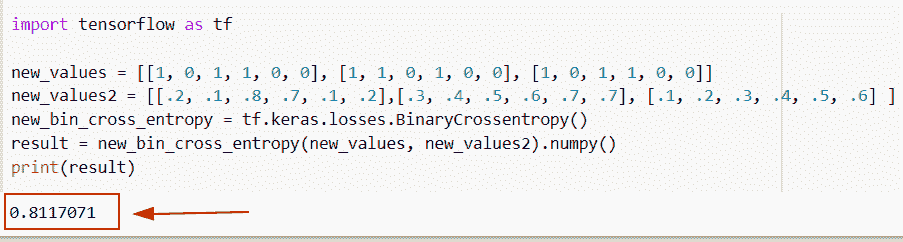
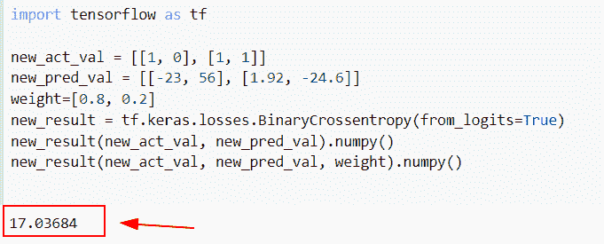
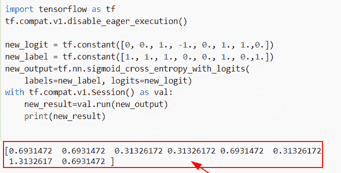
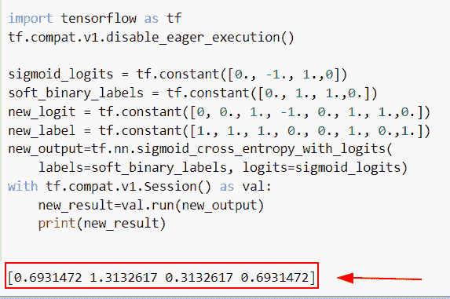
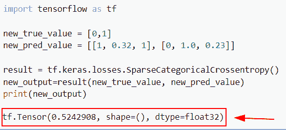
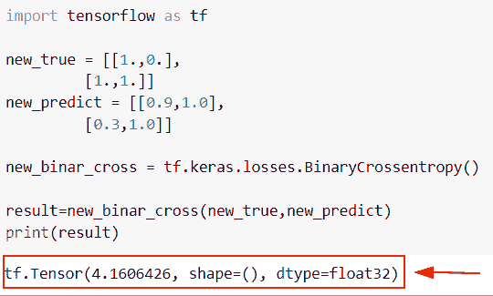

# 二元交叉熵张量流

> 原文：<https://pythonguides.com/binary-cross-entropy-tensorflow/>

[](https://sharepointsky.teachable.com/p/python-and-machine-learning-training-course)

在这个 [Python 教程中，](https://pythonguides.com/learn-python/)我们将学习**如何在 Python TensorFlow** 中计算二元交叉熵损失。此外，我们将涵盖以下主题。

*   二元交叉熵张量流
*   加权二元交叉熵张量流
*   二元交叉熵与逻辑张量流
*   张量流二元交叉熵 sigmoid
*   稀疏二元交叉熵张量流
*   二元交叉熵损失函数张量流

目录

[](#)

*   [二元交叉熵张量流](#Binary_Cross_entropy_TensorFlow "Binary Cross entropy TensorFlow")
*   [加权二元交叉熵张量流](#Weighted_binary_cross_entropy_TensorFlow "Weighted binary cross entropy TensorFlow")
*   [二元交叉熵逻辑张量流](#Binary_cross_entropy_with_logits_TensorFlow "Binary_cross_entropy_with_logits TensorFlow")
*   [TensorFlow 二元交叉熵 sigmoid](#TensorFlow_binary_cross-entropy_sigmoid "TensorFlow binary cross-entropy sigmoid")
*   [稀疏二元交叉熵张量流](#Sparse_binary_cross_entropy_TensorFlow "Sparse binary cross entropy TensorFlow")
*   [二元交叉熵损失函数张量流](#Binary_cross_entropy_loss_function_TensorFlow "Binary cross entropy loss function TensorFlow")

## 二元交叉熵张量流

*   在本节中，我们将讨论如何在 [Python TensorFlow](https://pythonguides.com/tensorflow/) 中计算二进制交叉熵损失。
*   为了执行这个特殊的任务，我们将使用 **tf。keras . loss . binarycrossentropy()**函数，该方法用于生成预测值和实际值之间的交叉熵损失。
*   在 TensorFlow 中，当只有两个标签类别时使用二进制交叉熵损失，并且它还包括实际标签和预测标签。

**语法:**

让我们看看语法，了解一下 **tf 的工作原理。Python TensorFlow 中的 keras . loss . binarycrossentropy()**。

```py
tf.keras.losses.BinaryCrossentropy(
    from_logits=False,
    label_smoothing=0.0,
    axis=-1,
    reduction=losses_utils.ReductionV2.AUTO,
    name='binary_crossentropy'
)
```

*   它由几个参数组成。
    *   **from_logits:** 该参数表示 logit 值，它包含概率值为[0，1]。
    *   **label_smoothing:** 默认取 0.0，大于 0 时检查情况，计算真值间的损失。
    *   **轴:**默认取-1 值和生成交叉熵所沿的轴。
    *   **名称:**默认为 binary_crossentropy 值，指定操作的名称。

**举例:**

```py
import tensorflow as tf

new_values = [[1, 0, 1, 1, 0, 0], [1, 1, 0, 1, 0, 0], [1, 0, 1, 1, 0, 0]]
new_values2 = [[.2, .1, .8, .7, .1, .2],[.3, .4, .5, .6, .7, .7], [.1, .2, .3, .4, .5, .6] ]
new_bin_cross_entropy = tf.keras.losses.BinaryCrossentropy()
result = new_bin_cross_entropy(new_values, new_values2).numpy()
print(result)
```

在下面的代码中，我们导入了 TensorFlow 库，然后创建了实际值和预测值。之后，我们使用了`TF . keras . loss . binarycrossentropy()`函数，并在该函数中分配了预测值和真实值。

下面是以下给定代码的实现。



Binary Cross entropy TensorFlow

阅读:[张量流乘法](https://pythonguides.com/tensorflow-multiplication/)

## 加权二元交叉熵张量流

*   在这一节中，我们将讨论如何在 Python TensorFlow 中的 BinaryCrossentropy 函数中使用权重参数。
*   在这个例子中，我们已经提到了 **tf 中的权重。keras . loss . binarycrossentropy()**函数，该函数用于生成预测值和实际值之间的交叉熵损失。

**语法:**

下面是 **tf 的语法。Python TensorFlow 中的 keras . loss . binarycrossentropy()**

```py
tf.keras.losses.BinaryCrossentropy(
    from_logits=False,
    label_smoothing=0.0,
    axis=-1,
    reduction=losses_utils.ReductionV2.AUTO,
    name='binary_crossentropy'
)
```

**举例:**

让我们举一个例子，检查一下如何在 Python TensorFlow 中使用 BinaryCrossentropy 函数中的权重参数。

**源代码:**

```py
import tensorflow as tf

new_act_val = [[1, 0], [1, 1]]
new_pred_val = [[-23, 56], [1.92, -24.6]]
weight=[0.8, 0.2]
new_result = tf.keras.losses.BinaryCrossentropy(from_logits=True)
new_result(new_act_val, new_pred_val).numpy()
new_result(new_act_val, new_pred_val, weight).numpy()
```

下面是下面给出的代码的截图。



Weighted binary cross entropy TensorFlow

阅读: [TensorFlow 获取变量+示例](https://pythonguides.com/tensorflow-get-variable/)

## 二元交叉熵逻辑张量流

*   在这个程序中，我们将讨论如何在 Python TensorFlow 中使用带有 logits 的二进制交叉熵。
*   为了完成这项任务，我们将使用`TF . nn . sigmoid _ cross _ entropy _ with _ logits()`函数，该函数用于计算给定逻辑的交叉熵。
*   如果你想找到 logits 和 labels 之间的 sigmoid 交叉熵。为了完成这项任务，我们将使用`TF . nn . sigmoid _ cross _ entropy _ with _ logits()`函数。

**举例:**

让我们举一个例子，看看如何在 Python TensorFlow 中将二进制交叉熵与 logits 结合使用。

**源代码:**

```py
import tensorflow as tf
tf.compat.v1.disable_eager_execution()

new_logit = tf.constant([0, 0., 1., -1., 0., 1., 1.,0.])
new_label = tf.constant([1., 1., 1., 0., 0., 1., 0.,1.])
new_output=tf.nn.sigmoid_cross_entropy_with_logits(
    labels=new_label, logits=new_logit)
with tf.compat.v1.Session() as val:
    new_result=val.run(new_output)
    print(new_result)
```

下面是以下给定代码的输出。



binary_cross_entropy_with_logits-TensorFlow

阅读:[模块“张量流”没有属性“日志”](https://pythonguides.com/module-tensorflow-has-no-attribute-log/)

## TensorFlow 二元交叉熵 sigmoid

*   在本节中，我们将讨论如何在 Python TensorFlow 中的二进制交叉熵中使用 sigmoid。
*   为了执行此特定任务，我们将使用`TF . nn . sigmoid _ cross _ entropy _ with _ logits()`函数，在此函数中，我们提到了 sigmoid_logits 值，这将计算带标签的交叉熵。

**语法:**

下面是 Python TensorFlow 中`TF . nn . sigmoid _ cross _ entropy _ with _ logits()`的语法。

```py
tf.nn.sigmoid_cross_entropy_with_logits(
    labels=None, logits=None, name=None
)
```

*   它由几个参数组成
    *   **标签:**该参数表示同类型的张量，取值在 0 到 1 之间。
    *   **logits:** 默认情况下，它不取值，指定实数。
    *   **名称:**该参数表示操作的名称。

**举例:**

我们举个例子，检查一下**如何在 Python TensorFlow 中使用二进制交叉熵中的 sigmoid。**

**源代码:**

```py
import tensorflow as tf
tf.compat.v1.disable_eager_execution()

sigmoid_logits = tf.constant([0., -1., 1.,0])
soft_binary_labels = tf.constant([0., 1., 1.,0.])
new_logit = tf.constant([0, 0., 1., -1., 0., 1., 1.,0.])
new_label = tf.constant([1., 1., 1., 0., 0., 1., 0.,1.])
new_output=tf.nn.sigmoid_cross_entropy_with_logits(
    labels=soft_binary_labels, logits=sigmoid_logits)
with tf.compat.v1.Session() as val:
    new_result=val.run(new_output)
    print(new_result)
```

在下面给定的代码中，我们导入了 TensorFlow 库，然后通过使用 `tf.constant()` 函数创建了一个 sigmoid 值，在这个函数中，我们为 **0 和 1** 赋值。

之后，我们使用了`TF . nn . sigmoid _ cross _ entropy _ with _ logits()`函数，并在该函数中分配了标签和 logits 值。

下面是下面给出的代码的截图。



Binary cross entropy TensorFlow sigmoid

阅读: [Tensorflow 迭代张量](https://pythonguides.com/tensorflow-iterate-over-tensor/)

## 稀疏二元交叉熵张量流

*   在本节中，我们将讨论如何稀疏 Python TensorFlow 中的二进制交叉熵。
*   为了执行这个特殊的任务，我们将使用 **tf。keras . loss . sparsecategoricalcrossentropy()**函数，该函数将计算预测和标签之间的交叉熵损失。

**语法:**

让我们看看语法，了解一下 **tf 的工作原理。Python TensorFlow 中的 keras . loss . sparsecategoricalcrossentropy()**函数。

```py
tf.keras.losses.SparseCategoricalCrossentropy(
    from_logits=False,
    reduction=losses_utils.ReductionV2.AUTO,
    name='sparse_categorical_crossentropy'
)
```

*   它由几个参数组成
    *   **from_logits:** 该参数表示 logit 值，它包含概率值为[0，1]。
    *   **name:** 默认情况下，它采用 sparse _ categorical _ crossentropy 值，并指定操作的名称。

**举例:**

我们举个例子，检查一下如何在 Python TensorFlow 中稀疏二进制交叉熵。

**源代码:**

```py
import tensorflow as tf

new_true_value = [0,1]
new_pred_value = [[1, 0.32, 1], [0, 1.0, 0.23]]

result = tf.keras.losses.SparseCategoricalCrossentropy()
new_output=result(new_true_value, new_pred_value)
print(new_output)
```

你可以参考下面的截图。



sparse binary cross entropy TensorFlow

阅读:[将列表转换为张量张量流](https://pythonguides.com/convert-list-to-tensor-tensorflow/)

## 二元交叉熵损失函数张量流

*   在本节中，我们将通过使用 Python TensorFlow 来讨论如何在二元交叉熵中使用损失函数。
*   通过使用 t`f . keras . loss . binary cross entropy()`函数，我们将在其中分配实际值和预测值。

**举例:**

我们举个例子，用 Python TensorFlow 查一下**如何使用二进制交叉熵中的损失函数。**

**源代码:**

```py
import tensorflow as tf

new_true = [[1.,0.],
         [1.,1.]]
new_predict = [[0.9,1.0],
         [0.3,1.0]]

new_binar_cross = tf.keras.losses.BinaryCrossentropy()

result=new_binar_cross(new_true,new_predict)
print(result)
```

下面是以下给定代码的实现。



binary cross entropy loss function TensorFlow

你可能也喜欢阅读下面的 TensorFlow 教程。

*   [Python tensor flow expand _ dims](https://pythonguides.com/tensorflow-expand_dims/)
*   [TensorFlow 全球平均池](https://pythonguides.com/tensorflow-global-average-pooling/)
*   [批量归一化张量流](https://pythonguides.com/batch-normalization-tensorflow/)
*   [Python TensorFlow 截断法线](https://pythonguides.com/tensorflow-truncated-normal/)
*   [Python TensorFlow 随机均匀](https://pythonguides.com/tensorflow-random-uniform/)
*   [Python tensor flow reduce _ sum](https://pythonguides.com/python-tensorflow-reduce_sum/)
*   【numpy 指针为张量

因此，在本教程中，我们已经学习了**如何在 Python TensorFlow** 中计算二元交叉熵损失。此外，我们还讨论了以下主题。

*   二元交叉熵张量流
*   加权二元交叉熵张量流
*   二元交叉熵与逻辑张量流
*   张量流二元交叉熵 sigmoid
*   稀疏二元交叉熵张量流
*   二元交叉熵损失函数张量流

[Bijay Kumar](https://pythonguides.com/author/fewlines4biju/)

Python 是美国最流行的语言之一。我从事 Python 工作已经有很长时间了，我在与 Tkinter、Pandas、NumPy、Turtle、Django、Matplotlib、Tensorflow、Scipy、Scikit-Learn 等各种库合作方面拥有专业知识。我有与美国、加拿大、英国、澳大利亚、新西兰等国家的各种客户合作的经验。查看我的个人资料。

[enjoysharepoint.com/](https://enjoysharepoint.com/)[](https://www.facebook.com/fewlines4biju "Facebook")[](https://www.linkedin.com/in/fewlines4biju/ "Linkedin")[](https://twitter.com/fewlines4biju "Twitter")