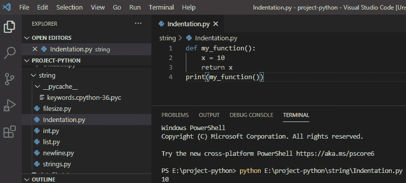
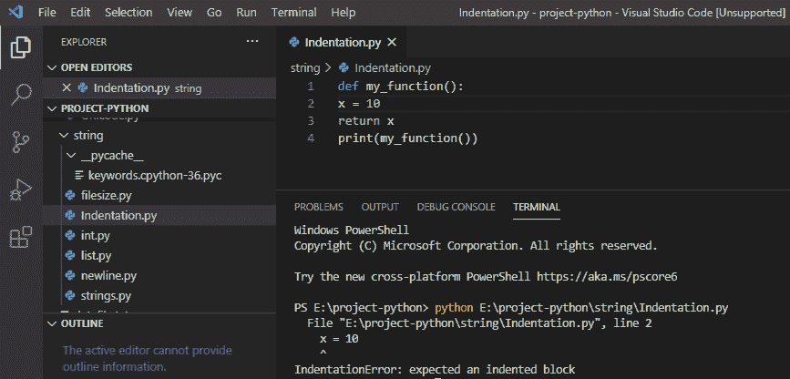
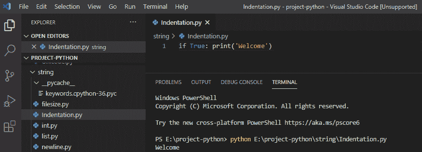
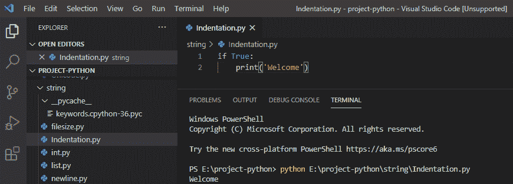
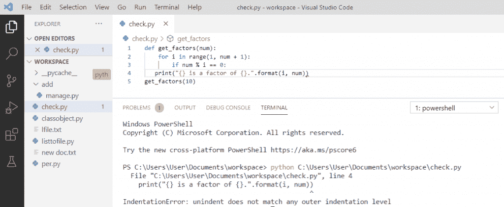
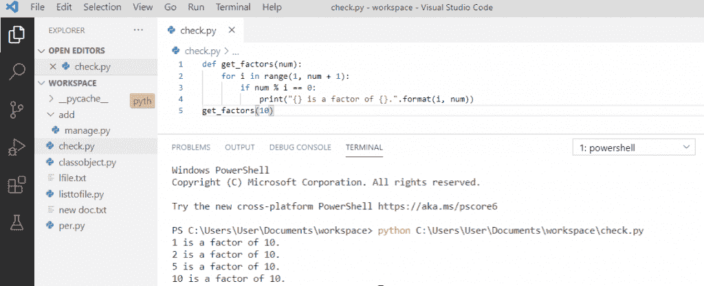

# Python 中的块缩进

> 原文：<https://pythonguides.com/block-indentation-in-python/>

[](https://sharepointsky.teachable.com/p/python-and-machine-learning-training-course)

在这个 [Python 教程](https://pythonguides.com/python-programming-for-the-absolute-beginner/)中，我们将讨论什么是 Python 中的块缩进，我们将看到几个关于如何在 Python 中使用**块缩进以及如何解决**缩进错误:在 python** 中，未缩进与任何外部缩进级别都不匹配的例子。**

目录

[](#)

*   [Python 缩进](#Python_Indentation "Python Indentation")
*   [未缩进与 python 中的任何外部缩进级别都不匹配](#Unindent_does_not_match_any_outer_indentation_level_in_python "Unindent does not match any outer indentation level in python")

## Python 缩进

在 python 中，我们用**缩进**来定义控制和[循环](https://pythonguides.com/python-for-loop/)。Python 使用冒号(:)和缩进来显示代码块的开始和结束位置。缩进使得代码可读性更强，在 python 中，缩进非常重要。

**举例:**

```py
def my_function():
    x = 10
    return x
print(my_function())
```

写完上面的代码(Python 缩进)，你将打印出 `"my_function()"` ，然后输出将显示为 **" 10 "。**在这里，我们看到了用于缩进的空格，它使代码看起来整洁易懂。

可以参考下面截图 Python 缩进



在这里，我们将看到如果在编写时从代码块中跳过缩进，Python 将如何抛出一个**错误。**

**举例:**

```py
def my_function():
x = 10
return x
print(my_function())
```

写完上面的代码(Python Indentation)，你将打印出 `"my_function()"` ，然后输出将显示为**" Indentation error:expected a indented block "。**在这里，我们在编写代码时跳过了第 2 行的缩进，它抛出了一个错误。

可以参考下面 Python 缩进错误截图



**Python 缩进可以被忽略**通过行延续，这意味着我们可以在一行中编写代码，但这会使代码难以阅读和理解，所以缩进很好。

**举例:**

```py
if true:
 print('Welcome')
```

写完上面的代码(Python 块缩进)，你将打印出**“Welcome”**，然后输出将显示为**“Welcome”。**这里，我们忽略了换行的缩进，它也是有效的，因为它做同样的事情。

可以参考下面截图 python 块缩进



但是缩进总是一个好主意，你可以参考下面的截图，因为它使代码更具可读性。

**举例:**

```py
if true:
    print('Welcome')
```



## 未缩进与 python 中的任何外部缩进级别都不匹配

这个**错误**发生在你从网页复制粘贴的时候，它混淆了缩进的制表符和空格。如果您复制到程序中的代码片段使用不同类型的缩进，您可能会在代码中看到这种类型的错误，因为它混合了制表符和空格。

**举例:**

```py
def get_factors(num):
    for i in range(1, num + 1):
        if num % i == 0:
   print("{} is a factor of {}.".format(i, num))
get_factors(10) 
```

在编写了上面的代码(在 python 中，unindent 不匹配任何外部缩进级别)之后，您将打印的代码将显示为**“indentation error:un indent 不匹配任何外部缩进级别”。**在这里，错误是由于混合了空格和制表符而产生的。

你可以参考下面的截图，因为在 python 中，unindent 不匹配任何外部缩进级别



Unindent does not match any outer indentation level in python

*   为了解决这个**缩进错误**，我们可以检查出现错误的那一行。每行代表一个制表符，每个点代表一个空格。
*   在 sublime 文本编辑器中，打开 python 程序并通过单击 ctrl + A 选择整个程序。
*   整个 python 代码和空白将被一起选中。
*   在程序中，tab 键显示为连续的线，空格显示为点。
*   坚持任何格式，无论是在选项卡上还是在空格里，其余的都改，做成统一格式。

**举例:**

```py
def get_factors(num):
    for i in range(1, num + 1):
        if num % i == 0:
            print("{} is a factor of {}.".format(i, num))
get_factors(10) 
```

写完上面的代码，你会得到输出，错误解决**。**在这里，我们纠正了错误，您可以看到带有正确缩进的代码的正确样式。

你可以参考下面的截图 python unindent 不匹配任何外部缩进级别。



Unindent does not match any outer indentation level in python

您可能会喜欢以下 Python 教程:

*   [Python 从路径中获取文件名](https://pythonguides.com/python-get-filename-from-the-path/)
*   [Python 类型错误:“列表”对象不可调用](https://pythonguides.com/python-typeerror-list-object-is-not-callable/)
*   [Python if else with examples](https://pythonguides.com/python-if-else/)
*   [Python 读取 excel 文件并在 Python 中写入 Excel](https://pythonguides.com/python-read-excel-file/)
*   [在 Python 中创建一个元组](https://pythonguides.com/create-a-tuple-in-python/)
*   [Python 创建空集](https://pythonguides.com/python-create-empty-set/)
*   [Python 中的字符串方法及示例](https://pythonguides.com/string-methods-in-python/)
*   [Python While 循环示例](https://pythonguides.com/python-while-loop/)

这就是我们如何使用块缩进和 IndentationError: Unindent 不匹配 python 中的任何外部缩进级别。

[Bijay Kumar](https://pythonguides.com/author/fewlines4biju/)

Python 是美国最流行的语言之一。我从事 Python 工作已经有很长时间了，我在与 Tkinter、Pandas、NumPy、Turtle、Django、Matplotlib、Tensorflow、Scipy、Scikit-Learn 等各种库合作方面拥有专业知识。我有与美国、加拿大、英国、澳大利亚、新西兰等国家的各种客户合作的经验。查看我的个人资料。

[enjoysharepoint.com/](https://enjoysharepoint.com/)[](https://www.facebook.com/fewlines4biju "Facebook")[](https://www.linkedin.com/in/fewlines4biju/ "Linkedin")[](https://twitter.com/fewlines4biju "Twitter")