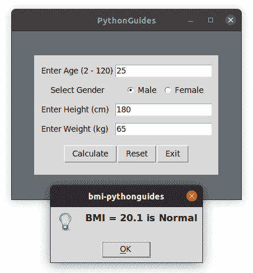

# 使用 Python Tkinter 的身体质量指数计算器[完整示例]

> 原文：<https://pythonguides.com/bmi-calculator-using-python-tkinter/>

[](https://sharepointsky.teachable.com/p/python-and-machine-learning-training-course)

在这个 [Python Tkinter 教程](https://pythonguides.com/python-gui-programming/)中，我们将学习使用 Python Tkinter 创建一个**身体质量指数计算器。**
**体重指数` `【身体质量指数】**是利用一个人的身高和体重进行简单的计算。

## 使用 Python Tkinter 的身体质量指数计算器

公式是**身体质量指数= kg/m2** 其中 kg 是一个人的体重，单位是千克，m2 是身高，单位是平方米。身体质量指数达到或超过 25.0 就是超重，而健康范围是 18.5 到 24.9。

**身体质量指数类别:**

*   体重不足 = < 18.5
*   **正常体重**= 18.5–24.9
*   **超重**= 25–29.9
*   **肥胖**= 30 或更大的身体质量指数

**功能解释:**

有许多方法可以为这个程序创建一个界面，但所有的程序将有相同的功能。在这一节中，我们将看到 main 函数在这个程序中是如何工作的。所以有两个函数用来显示身体质量指数结果。

1.  `calculate_bmi()`
2.  `bmi_index()`

**计算 _bmi()** :

*   ``kg = int(weight_tf.get())``
    这行代码获取用户体重，将其转换为整数，然后将该值存储在变量 kg 中
*   `m = int(height _ TF . get())/100`
*   bmi = kg/(m*m)
    这是求身体质量指数的公式。我们已经将公式存储在变量**身体质量指数中。**
*   **`bmi = round(bmi, 1` )**
    在四舍五入之前结果中出现了多个小数值。但是在使用了 round 函数之后，它看起来简化了&易于阅读。
    没有舍入功能，出现的结果是 `20.061728395061728` ，应用舍入功能后出现的结果是 **20.1。**
*   bmi_index(bmi)
    我们调用了 **bmi_index()函数**来比较身体质量指数值和身体质量指数类别。

```py
def calculate_bmi():
    kg = int(weight_tf.get())
    m = int(height_tf.get())/100
    bmi = kg/(m*m)
    bmi = round(bmi, 1)
    bmi_index(bmi)
```

**身体质量指数()**:

在这个函数中，显示的最终结果取决于它所属的身体质量指数值和身体质量指数类别。

**身体质量指数类别:**

*   体重不足 = < 18.5
*   **正常体重**= 18.5–24.9
*   **超重**= 25–29.9
*   **肥胖**= 30 或更大的身体质量指数

```py
def bmi_index(bmi):

    if bmi < 18.5:
        messagebox.showinfo('bmi-pythonguides', f'BMI = {bmi} is Underweight')
    elif (bmi > 18.5) and (bmi < 24.9):
        messagebox.showinfo('bmi-pythonguides', f'BMI = {bmi} is Normal')
    elif (bmi > 24.9) and (bmi < 29.9):
        messagebox.showinfo('bmi-pythonguides', f'BMI = {bmi} is Overweight')
    elif (bmi > 29.9):
        messagebox.showinfo('bmi-pythonguides', f'BMI = {bmi} is Obesity') 
    else:
        messagebox.showerror('bmi-pythonguides', 'something went wrong!') 
```

**源代码**:

这里是完整的源代码**身体质量指数计算器**。代码可以在 python3 的任何版本上运行，但是必须安装 Tkinter。如有任何疑问或错误，请留下评论。

```py
from tkinter import *
from tkinter import messagebox

def reset_entry():
    age_tf.delete(0,'end')
    height_tf.delete(0,'end')
    weight_tf.delete(0,'end')

def calculate_bmi():
    kg = int(weight_tf.get())
    m = int(height_tf.get())/100
    bmi = kg/(m*m)
    bmi = round(bmi, 1)
    bmi_index(bmi)

def bmi_index(bmi):

    if bmi < 18.5:
        messagebox.showinfo('bmi-pythonguides', f'BMI = {bmi} is Underweight')
    elif (bmi > 18.5) and (bmi < 24.9):
        messagebox.showinfo('bmi-pythonguides', f'BMI = {bmi} is Normal')
    elif (bmi > 24.9) and (bmi < 29.9):
        messagebox.showinfo('bmi-pythonguides', f'BMI = {bmi} is Overweight')
    elif (bmi > 29.9):
        messagebox.showinfo('bmi-pythonguides', f'BMI = {bmi} is Obesity') 
    else:
        messagebox.showerror('bmi-pythonguides', 'something went wrong!')   

ws = Tk()
ws.title('PythonGuides')
ws.geometry('400x300')
ws.config(bg='#686e70')

var = IntVar()

frame = Frame(
    ws,
    padx=10, 
    pady=10
)
frame.pack(expand=True)

age_lb = Label(
    frame,
    text="Enter Age (2 - 120)"
)
age_lb.grid(row=1, column=1)

age_tf = Entry(
    frame, 
)
age_tf.grid(row=1, column=2, pady=5)

gen_lb = Label(
    frame,
    text='Select Gender'
)
gen_lb.grid(row=2, column=1)

frame2 = Frame(
    frame
)
frame2.grid(row=2, column=2, pady=5)

male_rb = Radiobutton(
    frame2,
    text = 'Male',
    variable = var,
    value = 1
)
male_rb.pack(side=LEFT)

female_rb = Radiobutton(
    frame2,
    text = 'Female',
    variable = var,
    value = 2
)
female_rb.pack(side=RIGHT)

height_lb = Label(
    frame,
    text="Enter Height (cm)  "
)
height_lb.grid(row=3, column=1)

weight_lb = Label(
    frame,
    text="Enter Weight (kg)  ",

)
weight_lb.grid(row=4, column=1)

height_tf = Entry(
    frame,
)
height_tf.grid(row=3, column=2, pady=5)

weight_tf = Entry(
    frame,
)
weight_tf.grid(row=4, column=2, pady=5)

frame3 = Frame(
    frame
)
frame3.grid(row=5, columnspan=3, pady=10)

cal_btn = Button(
    frame3,
    text='Calculate',
    command=calculate_bmi
)
cal_btn.pack(side=LEFT)

reset_btn = Button(
    frame3,
    text='Reset',
    command=reset_entry
)
reset_btn.pack(side=LEFT)

exit_btn = Button(
    frame3,
    text='Exit',
    command=lambda:ws.destroy()
)
exit_btn.pack(side=RIGHT)

ws.mainloop()
```

**输出:**

在这个输出中，用户需要填写一些信息，如年龄、性别、身高和体重。根据这些信息，身高和体重被用来计算身体质量指数。然后身体质量指数通过条件。

每种情况都有备注(体重不足、正常、超重等)。使用消息框显示结果。



BMI Calculator Using Python Tkinter

这就是我们如何使用 Python Tkinter 制作身体质量指数计算器。

您可能会喜欢以下 Python TKinter 教程:

*   [Python Tkinter Title](https://pythonguides.com/python-tkinter-title/)
*   [如何在 Python Tkinter 中设置背景为图像](https://pythonguides.com/set-background-to-be-an-image-in-python-tkinter/)
*   [Python Tkinter 在文本框中显示数据](https://pythonguides.com/python-tkinter-to-display-data-in-textboxes/)
*   [如何使用 Python Tkinter 创建倒计时定时器](https://pythonguides.com/create-countdown-timer-using-python-tkinter/)
*   [用 Python Tkinter 上传文件](https://pythonguides.com/upload-a-file-in-python-tkinter/)
*   [Python Tkinter 拖拽](https://pythonguides.com/python-tkinter-drag-and-drop/)
*   [python tkinter auto complete](https://pythonguides.com/python-tkinter-autocomplete/)

在本教程中，我们学习了如何使用 Python Tkinter 制作**身体质量指数计算器。**

[Bijay Kumar](https://pythonguides.com/author/fewlines4biju/)

Python 是美国最流行的语言之一。我从事 Python 工作已经有很长时间了，我在与 Tkinter、Pandas、NumPy、Turtle、Django、Matplotlib、Tensorflow、Scipy、Scikit-Learn 等各种库合作方面拥有专业知识。我有与美国、加拿大、英国、澳大利亚、新西兰等国家的各种客户合作的经验。查看我的个人资料。

[enjoysharepoint.com/](https://enjoysharepoint.com/)[](https://www.facebook.com/fewlines4biju "Facebook")[](https://www.linkedin.com/in/fewlines4biju/ "Linkedin")[](https://twitter.com/fewlines4biju "Twitter")