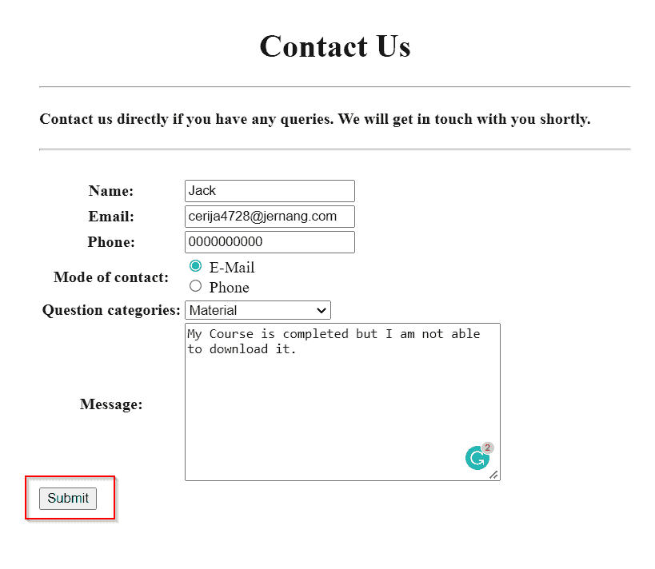

# 用电子邮件建立一个 Django 联系表单

> 原文：<https://pythonguides.com/build-a-django-contact-form-with-email/>

[](https://sharepointsky.teachable.com/p/python-and-machine-learning-training-course)

在本 [Python Django 教程](https://pythonguides.com/what-is-python-django/)中，我将一步步讲解**如何用 email 后端**构建一个 `Django` **联系人表单` `。**

在使用 HTML 处理联系人表单时，我发现创建一个使用 HTML 发送电子邮件的联系人表单需要几十行代码和大量的工作。

所以，我做了调查，发现 Django 提供表格课程。在这里，我们将重点关注使用 ModelForm 类呈现 Django 表单。

在这里我们将看到:

*   何时需要电子邮件后端
*   如何使用电子邮件建立 Django 联系表单，并向您的 Gmail 帐户发送电子邮件。
*   如何将表单数据保存到内置的 Django 数据库中
*   如何在 Django 中查看提交的数据
*   如何在 Django 中使用各种控件，如文本框、文本区、电子邮件和单选按钮
*   如何在 Django 中将表单呈现为表格
*   如何在 Gmail 中设置电子邮件认证

这是我们将在这里建造的。


Contact Form

在本文的最后，你也可以下载代码:**建立一个 Django` **`联系人表单，邮件**** 。

目录

[](#)

*   [用电子邮件建立 Django 联系表单](#Build_a_Django_Contact_Form_with_Email "Build a Django Contact Form with Email")
    *   [电子邮件后端](#Email_Backend "Email Backend")
    *   [设置 Django 项目](#Setup_Django_Project "Setup Django Project")
    *   [创建模型](#Create_Model "Create Model")
    *   [创建具有各种字段的 Django 表单](#Create_Django_Form_with_various_fields "Create Django Form with various fields")
    *   [在 Django 中以表格的形式呈现表单](#Render_the_form_as_a_table_in_Django "Render the form as a table in Django")
    *   [在 Django 中定义视图](#Define_View_in_Django "Define View in Django")
        *   [在 Gmail 中设置电子邮件认证](#Setup_Email_Authentication_in_Gmail "Setup Email Authentication in Gmail")
    *   [Django 电子邮件设置视图](#Views_for_Email_Setup_in_Django "Views for Email Setup in Django")
    *   [在 Django 中执行应用程序](#Execute_Application_in_Django "Execute Application in Django")
    *   [从 Django 管理界面查看提交的数据](#View_submitted_data_from_the_Django_admin_interface "View submitted data from the Django admin interface")
*   [下载 Django 联系表，并附上完整的电子邮件代码](#Download_the_Django_Contact_Form_with_Email_complete_code "Download the Django Contact Form with Email complete code")
*   [结论](#Conclusion "Conclusion")

## 用电子邮件建立 Django 联系表单

现在，让我们一步一步地看看 Django 是如何在提交联系表单时发送电子邮件的。

### 电子邮件后端

有时，您会注意到，当我们提交联系表格时，我们会立即收到来自网站的回复邮件。现在的问题是这件事将如何发生？

基本上，联系表单连接到电子邮件后端，该后端会自动工作，并在每次代表网站工作人员将表单提交给用户时发送一封电子邮件。

简而言之，您可以说通过使用带有联系人表单的电子邮件，自动生成的电子邮件将发送给用户。

阅读:[如何安装 Django](https://pythonguides.com/how-to-install-django/)

### 设置 Django 项目

首先，我们需要使用下面给出的命令在 Django 中建立一个项目。这里的 `TrainingGuides` 是项目的名称。

```py
django-admin startproject TrainingGuides
```

通过在终端键入下面的命令，在 Django 项目中创建一个名为 `Contact` 的 Django 应用程序。

```py
python manage.py startapp Contact
```

将**联系人**应用添加到位于 `settings.py` 文件中的**已安装应用**列表中。


settings.py

Django 在项目目录中自动包含一个名为 `urls.py` 的文件。在它里面，映射了最近创建的应用程序**联系人**，如下所示。

```py
from django.contrib import admin
from django.urls import path,include

urlpatterns = [
    path('admin/', admin.site.urls),
    path('',include('Contact.urls')),
]
```

阅读:[如何在 Python Django 中创建 web 表单](https://pythonguides.com/create-web-form-in-python-django/)

### 创建模型

要在 Django 中创建模型，打开 app 目录中的 `models.py` 文件，并添加下面给出的代码。

```py
from django.db import models

# Create your models here.

class Contact(models.Model):
    name = models.CharField(max_length=250)
    email = models.EmailField()
    phone = models.CharField(max_length=10)
    mode_of_contact = models.CharField('Conatct by', max_length=50)
    question_categories = models.CharField('How can we help you?', max_length=50)
    message = models.TextField(max_length=3000)

    def __str__(self):
        return self.email 
```

在这里，我们创建一个模型类 `Contact` ，它具有以下字段。

1.  **的名字**是姜戈·查菲尔斯。并且该字符字段有 25 个字符的限制。
2.  **电子邮件**是 Django EmailField，允许用户保存电子邮件地址。
3.  电话是 Django CharField。并且该字符字段有 10 个字符的限制。
4.  **联系方式**和**问题类别**是 Django CharField。这些字符字段有 50 个字符的限制。
5.  **消息**字段是 Django 文本字段。并且有 3000 个字符的限制。

并使用 `def __str__(self)` 来更改 Django 模型中对象的显示名称。当我们返回 `self.email` 时，它会将项目名称显示为电子邮件。

要在管理站点注册**联系人**模型，打开 `admin.py` 文件并添加下面给出的代码。

```py
from django.contrib import admin
from .models import Contact

# Register your models here.

admin.site.register(Contact)
```

阅读: [Python Django vs 金字塔](https://pythonguides.com/python-django-vs-pyramid/)

### 创建具有各种字段的 Django 表单

创建 Django 表单，联系人应用程序将使用它来收集用户输入。将以下代码添加到您在 app 目录中创建的 `forms.py` 文件中。

```py
from django import forms
from .models import Contact

select_mode_of_contact = (
    ("email", "E-Mail"),
    ("phone", "Phone"),
)

select_question_categories = (
    ("certification", "Certification"),
    ("interview", "Interview"),
    ("material", "Material"),
    ("access_duration","Access and Duration"),
    ("other", "Others"),
)

class ContactForm(forms.ModelForm):
    phone = forms.CharField(required=False)
    mode_of_contact = forms.CharField(required=False, widget=forms.RadioSelect(choices=select_mode_of_contact))
    question_categories = forms.CharField(required=False, widget=forms.Select(choices=select_question_categories))

    class Meta:
        model = Contact
        fields = '__all__' 
```

*   这里，我们定义了一个名为`ContactForm` 的表单类，它包含了来自 `Contact` 模型的所有字段。
*   另外，**联系方式**和**问题类别**是 Django CharField。有一个**选项**选项，它是可用作字段选项的序列，由项目的可重复项组成。
*   我们为此定义了一个名为**选择问题类别**和**选择联系方式**的元组。

### 在 Django 中以表格的形式呈现表单

在主项目目录中创建一个名为 `Templates` 的子目录来存储所有的项目模板，因为 Django 应用程序的前端是在 Templates 中定义的。

打开 `settings.py` 文件，更新 `DIRS` 指向 Templates 文件夹的位置。


settings.py

为了定义发送电子邮件的联系人表单的前端，在**模板**文件夹中创建一个名为`contact.html`的 HTML 文件，并包含下面给出的代码。

```py
<!DOCTYPE html>
<html lang="en">

<head>
    <meta charset="UTF-8">
    <meta http-equiv="X-UA-Compatible" content="IE=edge">
    <meta name="viewport" content="width=device-width, initial-scale=1.0">
    <title>Contact</title>
</head>

<body>
    <div style="margin:80px">
        <h1 align="center">Contact Us</h1>
        <hr>
        <h4>Contact us directly if you have any queries. We will get in touch with you shortly.</h4>
        <hr>
        <br>
        <form method="post" action="" enctype="multipart/form-data" class="post-form">
            
            <table>
                {{form.as_table}}
            </table>
            <button type="submit" class="save btn btn-default">Submit</button>
        </form>
</body>

</html>
```

*   使用 HTML 标签 `h1` 和 `h4` 向表单添加标题。
*   一旦表单被提交，就会通过使用 `POST` 方法调用 `form` 标签来提交表单。
*   在**表单**元素中添加 `csrf_token` ，以保护表单免受网络攻击，并使我们能够安全地交付数据。
*   接下来，使用**表**标签中的 `form.as_table` 标签将表单呈现为一个段落。
*   向表单添加一个**提交**按钮来完成它。

我们希望在成功提交后将联系表单呈现到另一个页面，因此我们会收到成功消息和联系表单链接。

为此，我们将另一个名为`success.html`的 HTML 文件添加到**模板**文件夹。

```py
<!DOCTYPE html>
<html lang="en">

<head>
    <meta charset="UTF-8">
    <meta http-equiv="X-UA-Compatible" content="IE=edge">
    <meta name="viewport" content="width=device-width, initial-scale=1.0">
    <title>Success</title>
</head>

<body>
    <h2 style="text-align: center; color: red;" "></h2style>We sent your message</h2>
    <p> You can send another in the <a href=" ">Contact Page</a></p>
</body>

</html>
```

标签 `h2` 用于定义标题，属性 `text-align` 和 `color` 用于文本居中、对齐并将其颜色改为红色。然后，在 `p` 标签中，我们利用 `a href` 标签将其链接到联系人表单。

阅读: [Python Django vs ReactJS](https://pythonguides.com/django-vs-reactjs/)

### 在 Django 中定义视图

程序的逻辑放在一个叫做 Django 视图的 Python 函数中，然后这个函数响应用户。

打开 `views.py` 文件，添加下面提供的代码，为带有电子邮件设置的联系人表单创建核心逻辑。

```py
from django.shortcuts import render
from .forms import ContactForm
from django.core.mail import send_mail
from django.conf import settings

# Create your views here.

def contact(request):
    if request.method == 'POST':
        form = ContactForm(request.POST)
        if form.is_valid(): 
            form.save()
            subject = "Welcome to PythonGuides Training Course"
            message = "Our team will contact you within 24hrs."
            email_from = settings.EMAIL_HOST_USER
            email = form.cleaned_data['email']
            recipient_list =email
            send_mail(subject, message, email_from, [recipient_list])
            return render(request, 'success.html') 
    form = ContactForm()
    context = {'form': form}
    return render(request, 'contact.html', context) 
```

*   首先从 `forms.py` 中导入 `ContactForm` ，然后调用 `if` 语句，检查请求方式是否为 `POST` 。
*   如果是，我们通过 **ContactForm(请求。POST)** 将数据绑定到表单类，这样我们就可以进行验证。
*   现在，调用 `is_valid()` 来验证用户输入的内容，如果验证成功，使用 save()保存表单数据。
*   如果请求方法是 `GET` ，则使用 `render()` 函数向用户呈现一个空白的联系人表单。

#### 在 Gmail 中设置电子邮件认证

在这里，我们使用 Gmail 发送电子邮件，所以我们必须设置应用程序密码，

如果我们不设置应用程序密码，我们将收到 `SMTPAuthenticationError` 。出现这个错误是因为 Django 缺乏遵守 Google 安全标准的能力。

按照以下步骤设置密码。

*   登录 Gmail，进入收件箱的**设置**，点击**查看所有设置**。


Gmail Settings

*   然后导航**账户并导入**。


Account and Import

*   导航至**其他谷歌账户设置**。


Account Settings

*   然后，点击**安全**。


Gmail Security

*   设置安全检查设置并启用**两步因素验证**。


2-Step Verification

*   之后，**在**转发和 POP/IMAP** 设置下启用 IMAP** 。请记得**保存**您的设置。


POP/IMAP

*   一旦我们确保 IMAP 和 2 因子都被启用。导航回到你的谷歌账户的**设置**页面，选择**安全**选项。


Security

*   到达后，将光标向下移动一点，选择**应用程序密码**选项。


App Password

*   一旦我们完成了这些，点击通过后，在**选择设备**下选择**其他**。给这个密码起个我们想要的名字，一旦你给应用程序起了名字，点击**生成**。


Other Device

如果一切顺利，就会出现一个显示你的**应用密码**的页面。


App Password

阅读: [Python Django 表单验证](https://pythonguides.com/django-form-validation/)

### Django 电子邮件设置视图

此外，每次提交联系表单时，网站工作人员都会通过电子邮件通知用户

打开 `settings.py` 文件，添加以下代码，添加 Django 发送邮件所需的设置。

```py
# Email Settings

EMAIL_BACKEND = 'django.core.mail.backends.smtp.EmailBackend'
EMAIL_HOST = 'smtp.gmail.com'
EMAIL_USE_TLS = True
EMAIL_PORT = 587
EMAIL_HOST_USER = #sender email-id
EMAIL_HOST_PASSWORD = #password associated with sender email-id 
```

以下是我们上面使用的选项的详细描述。

*   电子邮件 _ 后端:
    *   我们的 Django 项目将用来连接到 `SMTP` 服务器的后端由 `EMAIL_BACKEND` 参数指定。
    *   `smtp` 是这个变量的目标，而 `EmailBackend` 类接收所有的电子邮件发送参数。
*   电子邮件 _ 主机:
    *   您将使用的 SMTP 服务器域由 `EMAIL_HOST` 选项表示。您的电子邮件服务提供商将决定这一点。在这里，Gmail 是电子邮件提供商，所以我们将 SMTP 服务器主机设置为 smtp.gamil.com**的**。
    *   如果你使用雅虎作为电子邮件提供商，将其 SMTP 服务器主机设置为 smtp.mail.yahoo.com 的 T2，如果你使用 T4 的 Outlook 作为电子邮件提供商，将其 SMTP 服务器设置为 smtp-mail.outlook.com 的。
*   电子邮件 _ 使用 _TLS:
    *   互联网上使用一种称为 TLS 的安全协议来加密 Django 和 SMTP 服务器之间的通信。
    *   `EMAIL_USE_TLS` 选项被设置为 `True` 以指示 Django 将连接到 SMTP 服务器并使用传输层安全性发送电子邮件。
*   电子邮件端口:
    *   大多数 SMTP 服务器的默认端口是 `587` ，因此 `EMAIL_PORT` 参数必须设置为该值。
*   电子邮件 _ 主机 _ 用户:
    *   `EMAIL_HOST_USER` 是网站工作人员的邮箱地址。
*   电子邮件 _ 主机 _ 密码:
    *   `EMAIL_HOST_PASSWORD` 是网站工作人员邮箱的密码凭证。

带有电子邮件设置的联系人表单的代码。

```py
from django.shortcuts import render
from .forms import ContactForm
**from django.core.mail import send_mail
from django.conf import settings**

# Create your views here.

def contact(request):
    if request.method == 'POST':
        form = ContactForm(request.POST)
        if form.is_valid(): 
            form.save()
            **subject = "Welcome to PythonGuides Training Course"
            message = "Our team will contact you within 24hrs."
            email_from = settings.EMAIL_HOST_USER
            email = form.cleaned_data['email']
            recipient_list =email
            send_mail(subject, message, email_from, [recipient_list])**
            return render(request, 'success.html') 
    form = ContactForm()
    context = {'form': form}
    return render(request, 'contact.html', context)
```

*   导入 Django `send_mail` 函数以及**设置**变量，该变量保存 settings.py 文件中包含的所有全局选项。
*   然后，将撰写电子邮件所需的所有参数传递给 `send_mail()` ，它在 Django 中处理电子邮件发送。
*   以下是传递给函数的参数。
    *   **主题:**指定邮件主题。
    *   **message:** 它指定了您传递给用户的消息。简而言之，它是邮件的主体。
    *   **email_from:** 指定发件人的详细信息。将其值设置为 settings。EMAIL_HOST_USER，因为它从那里取值。
    *   **recipient_list:** 指定接收人详细信息。它总是在列表表单中，并将其值设置为 email，因为所有提交了联系表单的用户都会收到电子邮件。

阅读: [Python Django app 上传文件](https://pythonguides.com/django-app-upload-files/)

### 在 Django 中执行应用程序

我们必须首先对给定的模型进行迁移，以便开始使用它。通过终端运行以下命令。

```py
python manage.py makemigartions
```

为了反映它，我们必须迁移数据库。下面列出了 migrate 命令。

```py
python manage.py migrate
```

为了启动这个特定 Django 项目的开发服务器，我们在终端中输入下面的命令。

```py
python manage.py runserver 
```

通过如下所示展开 URL，我们可以访问联系表单。

```py
127.1.1.0/contact 
```

它成功地打开了 Django 联系人表单，电子邮件后端如下所示。


Contact Form with Email Backend

现在，填写联系表单并点击提交按钮，如下所示。



Contact form with details

点击**提交**后，会移至成功页面。如果我们单击联系页面链接，我们将再次重定向到空白联系表单。


Success Page

此外，用户在表单中提供的电子邮件将在他们点击提交按钮后收到来自网站所有者的电子邮件。


User Email


Website Owner Email

阅读: [Python Django MySQL CRUD](https://pythonguides.com/python-django-mysql-crud/)

### 从 Django 管理界面查看提交的数据

它还会将数据保存在数据库中。如果您想查看它，请创建一个超级用户，打开管理应用程序并查看它。


Admin Interface

这就是我们如何呈现 Django 联系表单并从 Gmail 向用户发送电子邮件。

阅读:[使用 PostgreSQL 的 Django CRUD 示例](https://pythonguides.com/django-crud-example-with-postgresql/)

## 下载 Django **联系表，邮件**完整代码

这是代码。

[Contact Form that Sends Emails](https://pythonguides.com/wp-content/uploads/2022/11/TrainingCourse.zip)

## 结论

这样，我们成功地用 Django ModelForm 类创建了一个工作的 **Django 表单，它也使用了一个数据库。我们还学习了如何从网站所有者向填写了表单的用户自动发送电子邮件。**

此外，我们还讨论了以下主题。

*   何时需要电子邮件后端
*   如何使用电子邮件建立 Django 联系表单，并向您的 Gmail 帐户发送电子邮件。
*   如何将表单数据保存到内置的 Django 数据库中
*   如何在 Django 中查看提交的数据
*   如何在 Django 中使用各种控件，如文本框、文本区、电子邮件和单选按钮
*   如何在 Django 中将表单呈现为表格

您可能也喜欢阅读下面的 Python Django 教程。

*   [Django 模板中的 If 语句](https://pythonguides.com/if-statement-in-django-template/)
*   [比较 Python Django 中的两个整数](https://pythonguides.com/compare-two-integers-in-python-django/)
*   [Python Django 连接字符串](https://pythonguides.com/django-concatenate-string/)
*   [创建与 Django 和 SQLite 的联系表单](https://pythonguides.com/contact-form-with-django-and-sqlite/)
*   [Python Django 四舍五入到两位小数](https://pythonguides.com/django-round-to-two-decimal-places/)

[Tanya Puri](https://pythonguides.com/author/tanya/)

拥有丰富 Django 和 Matplotlib 经验的 Python 开发人员，目前在 TSInfo Technologies 工作。我正在成为专业程序员、博客写手和 YouTuber 的路上。