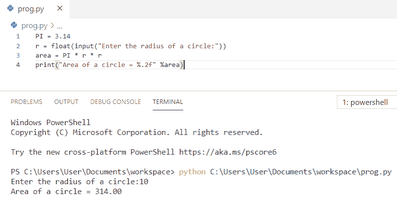
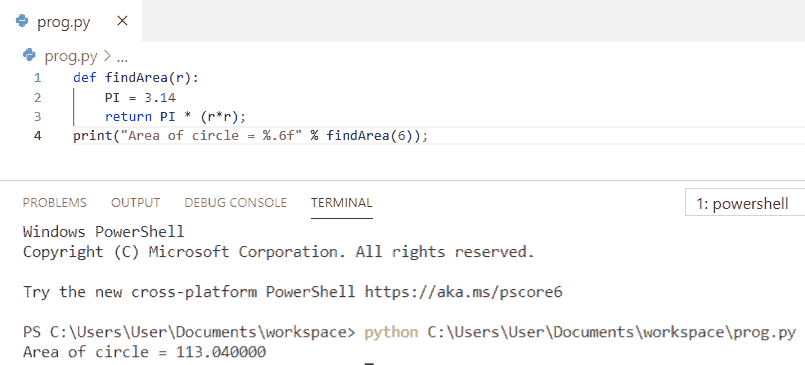
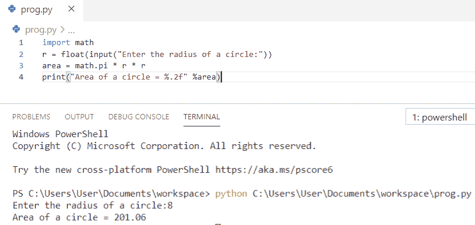
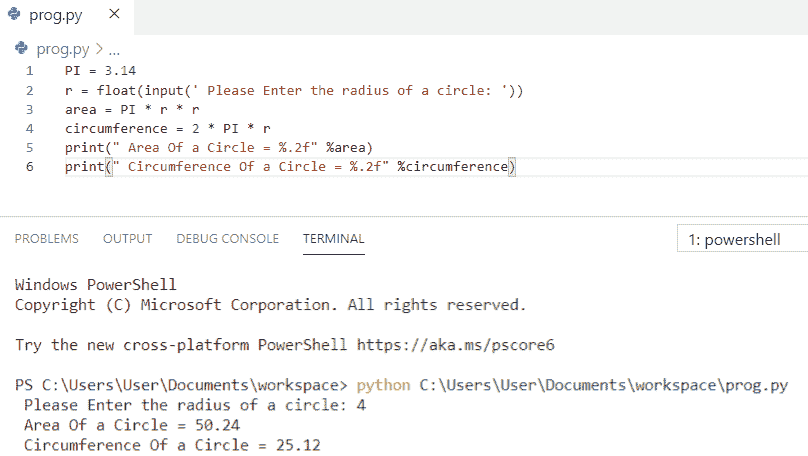
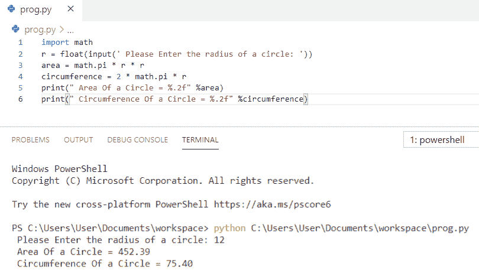
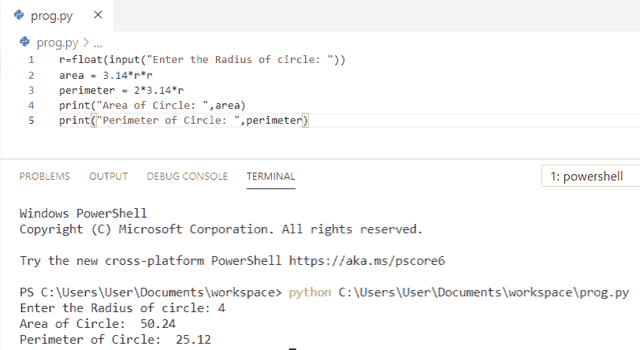
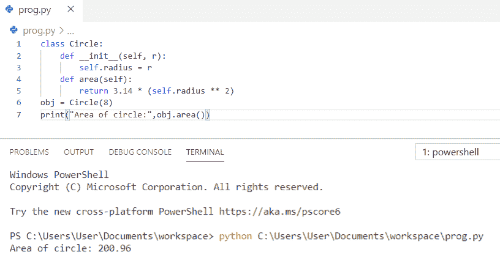
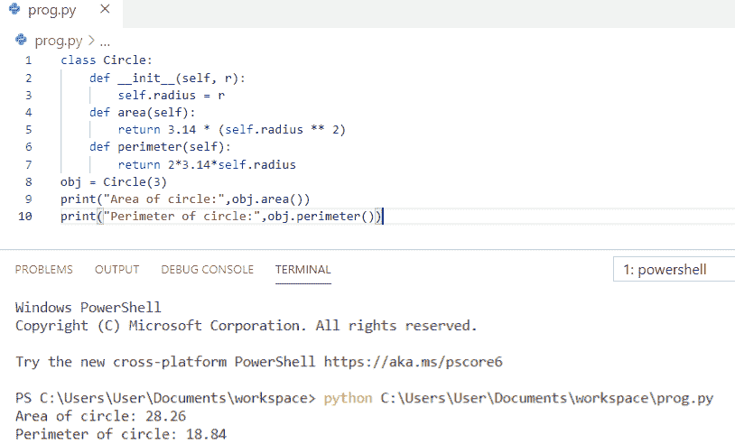

# 如何用 Python 计算圆的面积

> 原文：<https://pythonguides.com/calculate-area-of-a-circle-in-python/>

[](https://sharepointsky.teachable.com/p/python-and-machine-learning-training-course)

在这个 [python 教程中，](https://pythonguides.com/python-hello-world-program/)你将学习如何用 Python 中的**计算圆的面积，你可以查看 **Python 程序计算圆的面积**并且，我们还将查看 **:****

*   Python 程序计算圆的面积
*   Python 程序使用函数求圆的面积
*   Python 程序使用数学模块计算圆的面积
*   Python 程序计算圆的面积和周长
*   Python 程序使用内置的数学模块计算圆的面积和周长
*   Python 程序求圆的面积和周长
*   使用类计算圆的面积的 Python 程序
*   使用类计算圆的面积和周长的 Python 程序

目录

[](#)

*   [Python 程序计算圆的面积](#Python_program_to_calculate_area_of_a_circle "Python program to calculate area of a circle")
*   [Python 程序使用函数](#Python_program_to_find_area_of_a_circle_using_function "Python program to find area of a circle using function")求圆的面积
*   [使用 Python 数学模块](#Find_area_of_a_circle_using_Python_math_module "Find area of a circle using Python math module")求圆的面积
*   [Python 程序计算圆的面积和周长](#Python_program_to_calculate_area_and_circumference_of_a_circle "Python program to calculate area and circumference of a circle")
*   [使用内置数学模块计算圆的面积和周长的 Python 程序](#Python_program_to_calculate_the_area_and_circumference_of_a_circle_using_an_inbuilt_math_module "Python program to calculate the area and circumference of a circle using an inbuilt math module")
*   [Python 程序求圆的面积和周长](#Python_program_to_find_area_and_perimeter_of_a_circle "Python program to find area and perimeter of a circle")
*   [Python 程序使用类](#Python_program_to_calculate_area_of_a_circle_using_class "Python program to calculate area of a circle using class")计算圆的面积
*   [Python 程序使用类](#Python_program_to_calculate_area_and_perimeter_of_a_circle_using_class "Python program to calculate area and perimeter of a circle using class")计算圆的面积和周长

## Python 程序计算圆的面积

让我们看看 **python 程序计算圆的面积**。

*   首先，我们将使用半径的 `input()` 函数从用户处获取输入，并将其存储在一个变量中。
*   我们可以用常量来存储**【pi】**的值。
*   现在我们用公式**面积= PI * r * r** 来计算圆的面积。
*   最后，**打印**一个圆的面积得到输出。

**举例:**

```py
PI = 3.14
r = float(input("Enter the radius of a circle:"))
area = PI * r * r
print("Area of a circle = %.2f" %area)
```

你可以参考下面的截图来看看 python 程序计算圆的面积的输出



Python program to calculate the area of a circle

上面的代码，我们可以用 Python 中的来**计算圆的面积。**

还有，阅读， [Python 程序求矩形面积](https://pythonguides.com/python-program-to-find-an-area-of-a-rectangle/)和[如何在 Python 中求三角形面积](https://pythonguides.com/find-area-of-a-triangle-in-python/)？

## Python 程序使用函数求圆的面积

这里，我们将看到 **python 程序使用函数**求圆的面积。

*   在这个例子中，我定义了一个函数为 `def findArea(r)` 。
*   我们可以存储固定的值 `PI = 3.14` 。
*   该函数返回为 `return PI * (r * r)`
*   函数 findArea(6)被调用，它将打印输出。

**举例:**

```py
def findArea(r):
    PI = 3.14
    return PI * (r*r);
print("Area of circle = %.6f" % findArea(6));
```

你可以参考下面的截图，看看 python 程序使用函数求圆的面积的输出。



Python program to find the area of a circle using function

上面的 python 代码使用 Python 中的函数来**求圆的面积。**

*   [Python 匿名函数](https://pythonguides.com/python-anonymous-function/)
*   Python 中的[函数](https://pythonguides.com/function-in-python/)

## 使用 Python 数学模块求圆的面积

现在，我们将看到 **python 程序使用数学模块**求圆的面积。

*   在这个例子中，我们将**导入 math** 模块，这是一个内置模块。
*   我们将把**半径**作为用户的输入。
*   现在我们用公式 `area = math.pi * r * r` 来计算圆的面积。**【圆周率】**的值取自**【数学】**模块。
*   最后，**打印**一个圆的面积得到输出。

**举例:**

```py
import math
r = float(input("Enter the radius of a circle:"))
area = math.pi * r * r
print("Area of a circle = %.2f" %area)
```

你可以参考下面的截图，看看 python 程序使用数学模块求圆的面积的输出。



Python program to find the area of a circle using the math module

上面的代码，我们可以用 Python 数学模块来**求圆的面积。**

另请阅读，[如何使用 Python Tkinter](https://pythonguides.com/create-countdown-timer-using-python-tkinter/) 创建倒计时定时器。

## Python 程序计算圆的面积和周长

我们来看 **python 程序计算圆的面积和周长**。

*   首先，我们将使用半径的 `input()` 函数从用户处获取输入，并将其存储在一个变量中。
*   我们可以用常量来存储**【pi】**的值。
*   现在我们用公式**面积= PI * r * r** 来计算圆的面积。
*   为了计算圆的周长，我们将使用公式**周长= 2 *π* r**。
*   最后，**打印**圆的面积和周长得到输出。使用 **%.2f** 将该值格式化为两位小数。

**举例:**

```py
PI = 3.14
r = float(input(' Please Enter the radius of a circle: '))
area = PI * r * r
circumference = 2 * PI * r
print(" Area Of a Circle = %.2f" %area)
print(" Circumference Of a Circle = %.2f" %circumference)
```

你可以参考下面的截图，看看 python 程序计算圆的面积和周长的输出。



Python program to calculate the area and circumference of a circle

这是计算圆的面积和周长的 Python 程序。

你可能喜欢， [Python 程序求正方形](https://pythonguides.com/python-program-to-find-the-area-of-square/)的面积。

## 使用内置数学模块计算圆的面积和周长的 Python 程序

在这里，我们将看到使用内置数学模块计算圆的面积和周长的 **python 程序。**

*   首先，我们将**导入数学**模块，这是一个内置模块。
*   我们将使用半径的 `input()` 函数从用户处获取输入，并将其存储在一个变量中。
*   现在我们用公式**面积= math.pi * r * r** 来计算圆的**面积。**
*   为了计算圆周的周长**，我们将使用公式**周长= 2 * math.pi * r** 。**
*   最后，**打印**圆的面积和周长得到输出。使用 **%.2f** 将该值格式化为两位小数。

**举例:**

```py
import math
r = float(input(' Please Enter the radius of a circle: '))
area = math.pi * r * r
circumference = 2 * math.pi * r
print(" Area Of a Circle = %.2f" %area)
print(" Circumference Of a Circle = %.2f" %circumference)
```

你可以参考下面的截图，看看 python 程序使用内置的数学模块计算圆的面积和周长的输出。



Python program to calculate the area and circumference of a circle using an inbuilt math module

## Python 程序求圆的面积和周长

现在，我们将看到 **python 程序求圆的面积和周长**

*   首先，我们将使用**半径**的**输入()**函数从用户处获取输入，并将其存储在一个变量中。
*   我们在公式中使用了`3.14`**π**的值。
*   现在我们用公式**面积= 3.14* r * r** 来计算圆的**面积。**
*   为了计算圆的周长，我们将使用公式:周长= 2*3.14*r
*   最后，**打印**圆的面积和周长，得到输出。

**举例:**

```py
r=float(input("Enter the Radius of circle: "))
area = 3.14*r*r
perimeter = 2*3.14*r
print("Area of Circle: ",area)
print("Perimeter of Circle: ",perimeter)
```

你可以参考下面的截图来查看 python 程序的输出，以找到一个圆的面积和周长。



Python program to find the area and perimeter of a circle

上面的代码，我们可以用 Python 中的来**求圆的面积和周长。**

## Python 程序使用类计算圆的面积

让我们看看 **python 程序使用类**计算圆的面积。

*   在这个例子中，我们创建了一个名为**“圆”**的**类**，它的属性半径为 r
*   该类的构造函数使用 `__init__` 函数初始化属性。
*   我们在公式中使用了`3.14`**π**的值。
*   创建方法 `"area"` 来计算给定圆的面积。
*   类**“Circle”**的一个实例被创建为**“obj”**，并且调用该方法来显示输出。

**举例:**

```py
class Circle:
    def __init__(self, r):
        self.radius = r
    def area(self):
        return 3.14 * (self.radius ** 2)
obj = Circle(8)
print("Area of circle:",obj.area())
```

你可以参考下面的截图，看看 python 程序使用类计算圆的面积的输出。



Python program to calculate the area of a circle using class

上面的 Python 代码使用类来计算圆的面积。

## Python 程序使用类计算圆的面积和周长

在这里，我们将看到 **python 程序使用类**计算圆的面积和周长

*   在这个例子中，我们创建了一个名为**“圆”**的**类**，它的属性半径为 r
*   该类的构造函数使用 `__init__` 函数初始化属性。
*   我们在公式中使用了`3.14`**π**的值。
*   创建了两种方法**“面积”**和**“周长”**来计算给定圆的面积。
*   类**“Circle”**的一个实例被创建为**“obj”**，并且调用该方法来显示输出。

**举例:**

```py
class Circle:
    def __init__(self, r):
        self.radius = r
    def area(self):
        return 3.14 * (self.radius ** 2)
    def perimeter(self):
        return 2*3.14*self.radius
obj = Circle(3)
print("Area of circle:",obj.area())
print("Perimeter of circle:",obj.perimeter())
```

你可以参考下面的截图来查看 python 程序使用类计算圆的面积和周长的输出。



Python program to calculate the area and perimeter of a circle using class

您可能会喜欢以下 Python 教程:

*   [Python 中如何计算单利](https://pythonguides.com/calculate-simple-interest-in-python/)
*   [Python 程序打印图案](https://pythonguides.com/print-pattern-in-python/)
*   [如何在 Python 中打印一个数的阶乘](https://pythonguides.com/factorial-of-a-number-in-python/)
*   [如何在 Python 中交换两个数](https://pythonguides.com/swap-two-numbers-in-python/)
*   [如何在 Python 中减去两个数](https://pythonguides.com/subtract-two-numbers-in-python/)

在本 Python 教程中，我们学习了计算圆面积的 **Python 程序。此外，我们还讨论了以下主题:**

*   Python 中如何计算圆的面积
*   如何用 Python 中的函数求圆的面积
*   如何使用 Python 中的 math 模块求圆的面积？
*   Python 中如何计算圆的面积和周长？
*   Python 程序使用内置的数学模块计算圆的面积和周长
*   如何在 Python 中求圆的面积和周长
*   如何用 Python 中的类计算圆的面积
*   如何用 Python 中的 class 计算圆的面积和周长？

[Bijay Kumar](https://pythonguides.com/author/fewlines4biju/)

Python 是美国最流行的语言之一。我从事 Python 工作已经有很长时间了，我在与 Tkinter、Pandas、NumPy、Turtle、Django、Matplotlib、Tensorflow、Scipy、Scikit-Learn 等各种库合作方面拥有专业知识。我有与美国、加拿大、英国、澳大利亚、新西兰等国家的各种客户合作的经验。查看我的个人资料。

[enjoysharepoint.com/](https://enjoysharepoint.com/)[](https://www.facebook.com/fewlines4biju "Facebook")[](https://www.linkedin.com/in/fewlines4biju/ "Linkedin")[](https://twitter.com/fewlines4biju "Twitter")