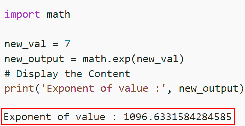
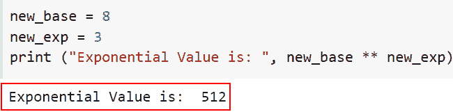
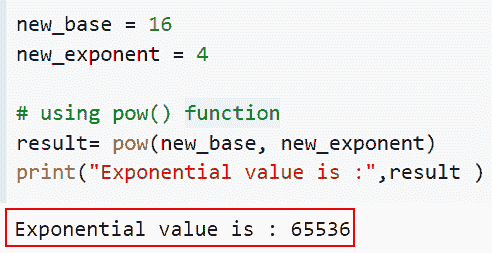
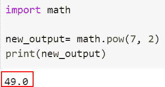

# 用 Python 计算一个数的指数值

> 原文：<https://pythonguides.com/calculate-exponential-value-of-a-number-in-python/>

[](https://sharepointsky.teachable.com/p/python-and-machine-learning-training-course)

在本 [Python 教程](https://pythonguides.com/python-programming-for-the-absolute-beginner/)中，我们将讨论如何在 Python 中计算一个数的指数值。此外，我们将看不同的例子来计算一个数的指数值。

最近一直在做一个[机器学习](https://pythonguides.com/machine-learning-using-python/)项目，发现它需要一个数的指数值。所以我研究了一下，发现我们必须使用 Python exp()方法。

在这里我们将学习

*   如何在 Python 中使用 exp()计算一个数的指数值
*   如何在 Python 中使用**运算符计算一个数的指数值？
*   Python 中如何用 pow()计算一个数的指数值？
*   如何在 Python 中使用 math.pow()计算一个数的指数值？

目录

[](#)

*   [如何在 Python 中使用 exp()](#How_to_calculate_the_exponential_value_of_a_number_in_Python_using_exp "How to calculate the exponential value of a number in Python using exp()") 计算一个数的指数值
*   [如何在 Python 中使用**运算符计算一个数的指数值](#How_to_calculate_the_exponential_value_of_a_number_in_Python_using_the_operator "How to calculate the exponential value of a number in Python using the ** operator")
*   [如何在 Python 中使用 pow()](#How_to_calculate_the_exponential_value_of_a_number_in_Python_using_pow "How to calculate the exponential value of a number in Python using pow()") 计算一个数的指数值
*   [如何在 Python 中使用 math.pow()](#How_to_calculate_the_exponential_value_of_a_number_in_Python_using_mathpow "How to calculate the exponential value of a number in Python using math.pow()") 计算一个数的指数值

### 如何在 Python 中使用 exp() 计算一个数的指数值

*   在这一节中，我们将讨论如何使用 exp()计算一个数的指数值。
*   Python 内置的 exp()函数可以用来确定任意数的 e 值的幂。表示 e^n，其中 n 是提供的数字。2.71828 大约等于 e 的值，exp()函数是数学库的一部分，所以在使用它之前，我们必须导入数学库。
*   `math.exp(x)` 函数返回 e 的 x 次方值，其中 e 是自然对数的底数。

**语法:**

让我们看一下语法并理解 Python 中的 `math.exp(x)` 的工作原理

```py
math.exp(x)
```

**举例:**

这里我们将举一个例子，检查如何使用 exp()计算一个数的指数值。

**源代码:**

```py
import math

new_val = 7
new_output = math.exp(new_val)
# Display the Content
print('Exponent of value :', new_output)
```

下面是以下代码的截图



How to calculate the exponential value of a number using exp()

阅读: [Python 程序打印质数](https://pythonguides.com/python-program-to-print-prime-numbers/)

### 如何在 Python 中使用**运算符计算一个数的指数值

*   现在让我们了解如何使用**运算符计算一个数的指数值。
*   我们在本例中使用了**运算符来计算指数值。

**举例:**

这里我们将举一个例子，检查如何使用**运算符计算一个数的指数值。

```py
new_base = 8
new_exp = 3
print ("Exponential Value is: ", new_base ** new_exp)
```

下面是以下给定代码的实现



How to calculate the exponential value of a number using ** operator

阅读: [Python 串联数组](https://pythonguides.com/python-concatenate-arrays/)

### 如何在 Python 中使用 pow() 计算一个数的指数值

*   Python 提供了一个内置的 pow()函数，除了**运算符之外，用户还可以使用它来计算指数值。
*   接受底数和指数作为输入后，该函数返回等值。
*   内置函数之一 pow()接受两到三个参数。当提供两个参数时，它有助于确定指数值；如果传递了第三个参数，则确定指数值的模数。

**举例:**

让我们举一个例子，检查如何使用 pow()计算一个数的指数值。

**源代码:**

```py
new_base = 16
new_exponent = 4

# using pow() function
result= pow(new_base, new_exponent)
print("Exponential value is :",result )
```

在下面的代码中，我们首先声明了两个变量‘new _ base’和 new_exponent。接下来，我们使用 pow()函数获取输入数字的指数值。

下面是以下给定代码的实现



How to calculate the exponential value of a number using pow()

阅读: [Python 程序求偶或奇](https://pythonguides.com/python-program-for-even-or-odd/)

### 如何在 Python 中使用 math.pow() 计算一个数的指数值

*   在本节中，我们将讨论如何使用 math.pow()计算一个数的指数值。
*   math.pow(x，y)函数返回 x 的 y 次方值，该函数需要两个输入。如果 x 为负且 y 不是整数，它将引发 ValueError。
*   使用 `math.pow()` 函数将两个参数都转换成浮点数，然后输出浮点数数据类型。

**举例:**

```py
import math

new_output= math.pow(7, 2)
print(new_output)
```

在上面的代码中，我们首先导入了数学库，然后使用了 `math.pow()` 函数，在这个函数中，我们传递了指数和幂值。

你可以参考下面的截图



How to calculate the exponential value of a number using math.pow()

您可能也喜欢阅读以下 Python 教程。

*   [如何在 Python 中寻找完全数](https://pythonguides.com/perfect-number-in-python/)
*   [如何在 Python 中反转一个数字](https://pythonguides.com/reverse-a-number-in-python/)
*   [如何在 Python 中交换两个数](https://pythonguides.com/swap-two-numbers-in-python/)
*   [生日祝福的 Python 程序](https://pythonguides.com/python-program-for-birthday-wishes/)

在本文中，我们讨论了如何计算一个数的指数值。此外，我们还讨论了以下主题。

*   如何在 Python 中使用 exp()计算一个数的指数值
*   如何在 Python 中使用**运算符计算一个数的指数值？
*   Python 中如何用 pow()计算一个数的指数值？
*   如何在 Python 中使用 math.pow()计算一个数的指数值？

[Bijay Kumar](https://pythonguides.com/author/fewlines4biju/)

Python 是美国最流行的语言之一。我从事 Python 工作已经有很长时间了，我在与 Tkinter、Pandas、NumPy、Turtle、Django、Matplotlib、Tensorflow、Scipy、Scikit-Learn 等各种库合作方面拥有专业知识。我有与美国、加拿大、英国、澳大利亚、新西兰等国家的各种客户合作的经验。查看我的个人资料。

[enjoysharepoint.com/](https://enjoysharepoint.com/)[](https://www.facebook.com/fewlines4biju "Facebook")[](https://www.linkedin.com/in/fewlines4biju/ "Linkedin")[](https://twitter.com/fewlines4biju "Twitter")