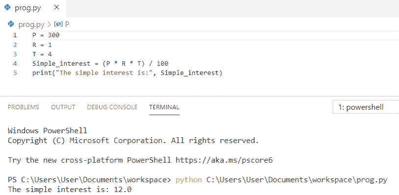
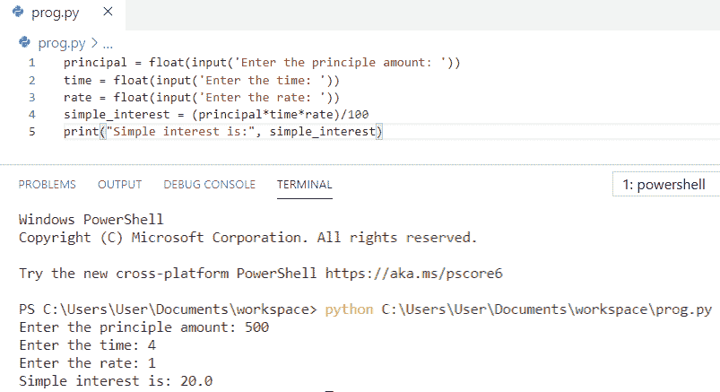
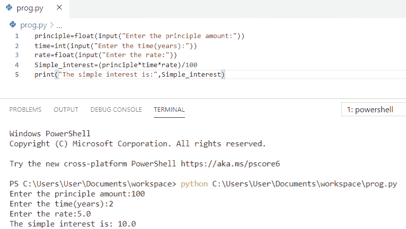
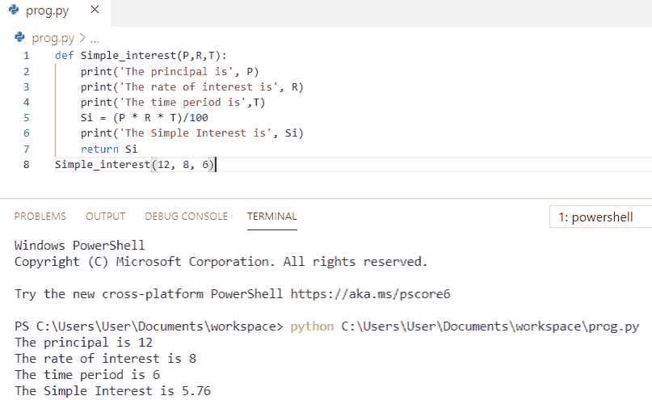
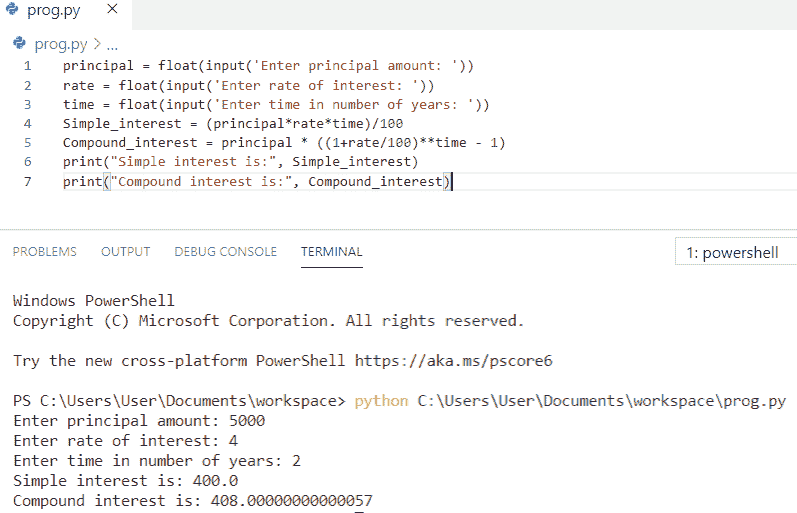

# Python 中如何计算单利

> 原文：<https://pythonguides.com/calculate-simple-interest-in-python/>

[](https://sharepointsky.teachable.com/p/python-and-machine-learning-training-course)

本 [Python 教程](https://pythonguides.com/learn-python/)讲解如何**计算 Python** 单利。除了计算单利的 **Python 程序**之外，我们将涉及以下主题:

*   从用户输入计算单利的 Python 程序
*   简单兴趣的 Python 程序
*   Python 程序计算单利
*   使用函数计算单利的 Python 程序
*   单利和复利的 Python 程序

目录

[](#)

*   [单利 Python 程序](#Python_Program_for_simple_interest "Python Program for simple interest")
*   [Python 程序从用户输入中计算单利](#Python_program_to_calculate_simple_interest_from_user_input "Python program to calculate simple interest from user input")
*   [Python 程序计算单利](#Python_Program_to_compute_simple_interest "Python Program to compute simple interest")
*   [Python 程序使用函数](#Python_program_to_calculate_simple_interest_using_function "Python program to calculate simple interest using function")计算单利
*   [单利和复利的 Python 程序](#Python_program_for_simple_interest_and_compound_interest "Python program for simple interest and compound interest")

## 单利 Python 程序

简单兴趣来看看 **python 程序。**

*   首先，我们将创建一个变量作为 **P，R，**和 `T` ，并将值赋给该变量。
*   我们将使用公式`Simple _ interest =(P * R * T)/100`计算单利。
*   最后，**打印**Simple _ interest 得到输出。

**举例:**

```py
P = 300
R = 1
T = 4
Simple_interest = (P * R * T) / 100
print("The simple interest is:", Simple_interest)
```

你可以参考下面的截图来看看 python 程序的输出。



Python Program for simple interest

这段代码我们可以用 Python 来计算单利。

阅读 [Python 从两个列表中创建了一个字典](https://pythonguides.com/python-creates-a-dictionary-from-two-lists/)

## Python 程序从用户输入中计算单利

让我们看看从用户输入计算单利的**程序。**

*   在这个例子中，我们将使用 `input()` 函数从用户处获取关于本金金额、时间和利率的**输入。**
*   为了计算**单利**我们将使用公式**单利=(本金*时间*利率)/100** 。
*   最后打印 `simple_interest` 得到输出。

**举例:**

```py
principal = float(input('Enter the principle amount: '))
time = float(input('Enter the time: '))
rate = float(input('Enter the rate: '))
simple_interest = (principal*time*rate)/100
print("Simple interest is:", simple_interest)
```

您可以参考下面的屏幕截图，查看 python 程序从用户输入计算单利的输出。



Python program to calculate simple interest from user input

上面的 Python 代码我们可以用来从用户输入中计算单利。

阅读 [Python 循环通过](https://pythonguides.com/python-loop-through-a-list/) [一](https://pythonguides.com/python-loop-through-a-list/) [列表](https://pythonguides.com/python-loop-through-a-list/)

## Python 程序计算单利

现在，我们将看到一个计算单利的 **python 程序。**

*   在这个例子中，我们将使用**`input()`函数从用户处获取**输入的本金金额、时间和利率。****
*   **为了计算**单利**我们将使用公式**单利=(本金*时间*利率)/100** 。**
*   **最后打印 `Simple_interest` 得到输出。**

 ****举例:**

```py
principle=float(input("Enter the principle amount:"))
time=int(input("Enter the time(years):"))
rate=float(input("Enter the rate:"))
Simple_interest=(principle*time*rate)/100
print("The simple interest is:",Simple_interest)
```

你可以参考下面的截图来查看 python 程序计算单利的输出。



Python Program to compute simple interest

阅读 [Matplotlib 绘图条形图](https://pythonguides.com/matplotlib-plot-bar-chart/)

## Python 程序使用函数计算单利

在这里，我们将看到 **python 程序使用函数**计算单利。

*   首先，我们将定义一个函数为 **def Simple_interest(P，R，T)**
*   我们会用简单的利息公式 `Si = (P * R * T)/100` 其中 P 是本金，R 是利率，T 是时间。
*   现在，调用带有特定参数的 `Simple_interest` 函数。
*   最后**打印** `Si` 得到输出。

**举例:**

```py
def Simple_interest(P,R,T):
    print('The principal is', P)
    print('The rate of interest is', R)
    print('The time period is',T)
    Si = (P * R * T)/100
    print('The Simple Interest is', Si)
    return Si
Simple_interest(12, 8, 6)
```

你可以参考下面的截图来查看 python 程序使用函数计算单利的输出。



Python program to calculate simple interest using function

上面的 Python 代码我们可以用 Python 中的函数来计算单利。

在 Python 中读取[的循环 vs while 循环](https://pythonguides.com/for-loop-vs-while-loop-in-python/)

## 单利和复利的 Python 程序

在这里，我们将看到单利和复利的 **python 程序。**

*   在这个例子中，我们将使用 `input()` 函数从用户处获取关于本金金额、利率和时间的**输入。**
*   我们将计算单利和复利。
*   使用的公式是**简单 _ 利息=(本金*利率*时间)/100** 、**复利=本金*(1+利率/100)* *时间–1)**。
*   为了显示结果，我们将**打印**单利和复利。

**举例:**

```py
principal = float(input('Enter principal amount: '))
rate = float(input('Enter rate of interest: '))
time = float(input('Enter time in number of years: '))
Simple_interest = (principal*rate*time)/100
Compound_interest = principal * ((1+rate/100)**time - 1)
print("Simple interest is:", Simple_interest)
print("Compound interest is:", Compound_interest)
```

你可以参考下面的截图来看看 python 程序的单利和复利的输出。



Python program for simple interest and compound interest

这是单利和复利的 **python 程序。**

您可能会喜欢以下 Python 教程:

*   [Python 程序打印图案](https://pythonguides.com/print-pattern-in-python/)
*   [如何在 Python 中打印一个数的阶乘](https://pythonguides.com/factorial-of-a-number-in-python/)
*   [如何在 Python 中交换两个数](https://pythonguides.com/swap-two-numbers-in-python/)
*   [如何打印 Python 斐波那契数列](https://pythonguides.com/python-fibonacci-series/)
*   [Python 程序反转字符串的例子](https://pythonguides.com/python-program-to-reverse-a-string/)

在本 Python 教程中，我们学习了计算单利的 **Python 程序。此外，我们还讨论了以下主题:**

*   从用户输入计算单利的 Python 程序
*   简单兴趣的 Python 程序
*   Python 程序计算单利
*   使用函数计算单利的 Python 程序
*   单利和复利的 Python 程序

[Bijay Kumar](https://pythonguides.com/author/fewlines4biju/)

Python 是美国最流行的语言之一。我从事 Python 工作已经有很长时间了，我在与 Tkinter、Pandas、NumPy、Turtle、Django、Matplotlib、Tensorflow、Scipy、Scikit-Learn 等各种库合作方面拥有专业知识。我有与美国、加拿大、英国、澳大利亚、新西兰等国家的各种客户合作的经验。查看我的个人资料。

[enjoysharepoint.com/](https://enjoysharepoint.com/)[](https://www.facebook.com/fewlines4biju "Facebook")[](https://www.linkedin.com/in/fewlines4biju/ "Linkedin")[](https://twitter.com/fewlines4biju "Twitter")**