# Python 中的 Case 语句

> 原文：<https://pythonguides.com/case-statement-in-python/>

[](https://sharepointsky.teachable.com/p/python-and-machine-learning-training-course)

在本 [Python 教程](https://pythonguides.com/python-hello-world-program/)中，我们将借助一些例子来讨论 Python 中的 **case 语句。此外，我们将讨论以下主题。**

*   Python 有 case 语句吗？
*   Python 中如何使用 case 语句？
*   Python 中的简单 case 语句
*   Python 中的 Switch case 示例
*   Python 开关大小写默认值
*   Case 语句字典 Python
*   Python switch case 语句默认值
*   使用函数切换 Python 中的大小写
*   使用类和对象切换 Python 中的大小写
*   使用用户输入切换 Python 中的大小写
*   Python 中使用大小写开关的计算器
*   Python 开关盒单线
*   Python 字符串中的大小写转换
*   Python 开关字母大小写
*   Python 切换大小写布尔值
*   Python 开关盒浮动
*   Python 开关大小写中断
*   带条件的 Python 开关案例
*   Python 开关盒数组
*   Python switch 语句最佳实践

目录

[](#)

*   [Python 有 case 语句吗？](#Does_Python_have_a_case_statement "Does Python have a case statement?")
*   [Python 中如何使用 case 语句？](#How_to_use_case_statement_in_Python "How to use case statement in Python?")
*   [Python 中的简单 case 语句](#Simple_case_statement_in_Python "Simple case statement in Python")
*   [Python 中的 Switch case 示例](#Switch_case_in_Python_with_example "Switch case in Python with example")
*   [Python 开关案例默认值](#Python_switch_case_default_value "Python switch case default value")
*   [Case 语句字典 Python](#Case_statement_dictionary_Python "Case statement dictionary Python")
*   [Python switch case 语句默认](#Python_switch_case_statement_default "Python switch case statement default")
*   [使用函数](#Switch_case_in_Python_using_function "Switch case in Python using function")在 Python 中切换大小写
*   [使用类和对象切换 Python 中的大小写](#Switch_case_in_Python_using_classes_and_objects "Switch case in Python using classes and objects")
*   [使用用户输入切换 Python 中的大小写](#Switch_case_in_Python_with_user_input "Switch case in Python with user input")
*   [使用 Python 中 switch case 的计算器](#Calculator_using_switch_case_in_Python "Calculator using switch case in Python")
*   [Python 开关案例一行](#Python_switch_case_one_line "Python switch case one line")
*   [切换 Python 字符串中的大小写](#Switch_case_in_Python_string "Switch case in Python string")
*   [Python 开关字母盒](#Python_switch_letter_case "Python switch letter case")
*   [Python 切换大小写布尔值](#Python_switch_case_boolean "Python switch case boolean")
*   [Python 开关盒浮动](#Python_switch_case_float "Python switch case float")
*   [Python 开关案例破解](#Python_switch_case_break "Python switch case break")
*   [带条件的 Python 开关案例](#Python_switch_case_with_condition "Python switch case with condition")
*   [Python 开关盒数组](#Python_switch_case_array "Python switch case array")
*   [Python switch 语句最佳实践](#Python_switch_statement_best_practices "Python switch statement best practices")

## Python 有 case 语句吗？

大多数语言都支持 case 语句。但是，在 Python 中，默认情况下没有 case 语句。但是，我们可以创建自己的函数来替代 case 语句。

因此，在本文中，我将解释如何在 Python 中创建可以用作 case 语句的函数。

阅读[删除非 ASCII 字符 Python](https://pythonguides.com/remove-non-ascii-characters-python/)

## Python 中如何使用 case 语句？

在 Python 中，可以用多种方式实现 case 语句。可以使用 if-else 语句。在这种情况下，您必须针对多种情况使用多个 if-else 语句。

第二种方法是使用 Python 中的字典将案例与一些函数进行映射。你可以做一个字典，做案例和函数的键值对。

这些键就是你的条件，相应的值就是你想根据条件调用的函数。

让我们讨论一些用 Python 实现 case 语句的方法和例子。

另外，请阅读: [Python 列表字典](https://pythonguides.com/python-dictionary-of-lists/)

## Python 中的简单 case 语句

如上所述，我们可以使用多个 if-else 块来实现 Python 中的 case 语句。这个方法背后的思想可以通过下面的例子来理解。

```py
if <case variable> == <case 1>:
    <function or statement for case 1>
elif <case variable> == <case 2>:
    <function or statement for case 2>
elif <case variable> == <case 3>:
    <function or statement for case 3>
.
.
.
elif <case variable> == <case n>:
    <function or statement for case n>
else:
    <default case statement or function>
```

## Python 中的 Switch case 示例

假设您想根据指定的数字打印一年中的月份名称。例如， **1 到 12** 代表一年中从**一月到十二月的月份。**

在这种情况下，您可能需要使用 case 语句。但是，让我们看看如何在 if-else 语句的帮助下实现它。

```py
def printMonth(num):
    if num == 1:
        month =' January'
    elif num == 2:
        month = 'February'
    elif num == 3:
        month = 'March'
    elif num == 4:
        month= 'April'
    elif num == 5:
        month= 'May'
    elif num == 6:
        month = 'June'
    elif num == 7:
        month = 'July'
    elif num == 8:
        month = 'August'
    elif num == 9:
        month= 'September'
    elif num == 10:
        month= 'October'
    elif num == 11:
        month= 'November'
    elif num == 12:
        month= 'December'
    return month

print('Month is:', printMonth(10))
```

*   在上面的函数中，我们根据指定的数字在每个 `if` 块中指定月份的名称。

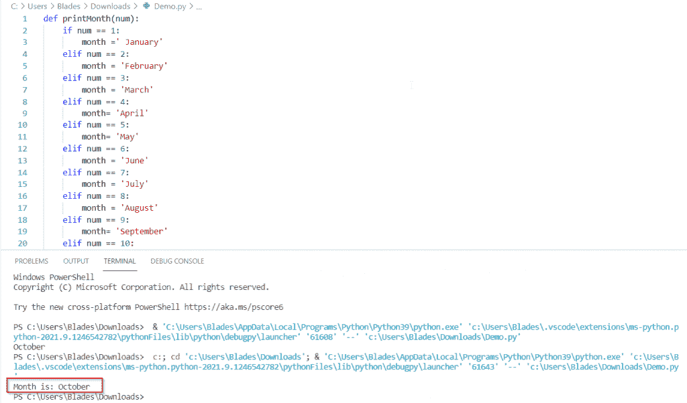

The function returned the expected month name

你可以看到我们提供了数字 `10` 作为输入，函数返回**十月**。同样，我们在函数中定义了从 1 到 12 的所有情况。

这样，就可以使用 if-else 语句在 Python 中实现 case 语句。

阅读: [Python 字典扩展](https://pythonguides.com/python-dictionary-extend/)

## Python 开关案例默认值

当使用 if-else 语句在 python 中实现 **switch case 语句时，可以在程序的最后一个 else 部分定义默认 case 值。**

以我们在上一节中执行的程序为例。如果一个人输入一个除了 1 到 12 以外的数字，程序将抛出一个错误。

但是，您可以在 else 部分中定义默认事例。我已经用默认情况实现了相同的程序:

```py
def printMonth(num):
    if num == 1:
        month =' January'
    elif num == 2:
        month = 'February'
    elif num == 3:
        month = 'March'
    elif num == 4:
        month= 'April'
    elif num == 5:
        month= 'May'
    elif num == 6:
        month = 'June'
    elif num == 7:
        month = 'July'
    elif num == 8:
        month = 'August'
    elif num == 9:
        month= 'September'
    elif num == 10:
        month= 'October'
    elif num == 11:
        month= 'November'
    elif num == 12:
        month= 'December'
    else:
        month= 'Invalid Month'
    return month

print('Month is:', printMonth(13))
```

这次我将传递 `13` 作为案例值。现在让我们看看输出。

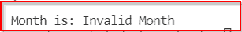

Default case value

您可以看到默认的 case 值被返回。这样，您可以使用 if-else 语句在 Python 中的 switch case 实现中定义一个默认 case。

阅读: [Python 字符串列表](https://pythonguides.com/python-string-to-list/)

## Case 语句字典 Python

还可以使用字典在 Python 中实现 **case 语句。让我们看看如何实现这一点。**

```py
 dict={
        <case 1>: <function or statement for case 1>,
        <case 2>: <function or statement for case 2>,
        <case 3>: <function or statement for case 3>,
        .
        .
        .
        <case n>: <function or statement for case n>
    } 
```

为了执行特定情况下的语句或函数，可以使用 [Python 字典](https://pythonguides.com/create-a-dictionary-in-python/)的 `get()` 方法。

```py
dict.get(<case value>), <default case value>)
```

现在让我们看一个例子。考虑下面的 python 代码。

```py
dict={
    1: 'Sunday',
    2: 'Monday',
    3: 'Tuesday',
    4: 'Wednesday',
    5: 'Thursday',
    6: 'Friday',
    7: 'Saturday'
}

print('Entered Number is 2\. Day of the week is:',dict.get(2))
```

我们创建了一个字典来使用 case 语句。从 **1 到 7** 的数字将是不同的情况，我们将打印与这些数字对应的星期几。

我们已经使用了 `get()` 函数来获取所提供的键的值。

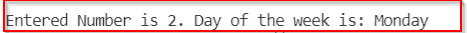

The output of the program

## Python switch case 语句默认

假设在上面的程序中，我们试图实现一个没有在字典中定义的 case 值。在这种情况下，我们将得到 `None` 作为输出。

但是，我们可以定义自己的默认大小写值，以防字典中不存在该值。

为此，我们可以在检索字典值时将默认值传递给 `get()` 方法。我们必须将默认值作为第二个参数传递给 `get()` 方法。

具有默认 case 值的上述程序可以重写为:

```py
dict={
    1: 'Sunday',
    2: 'Monday',
    3: 'Tuesday',
    4: 'Wednesday',
    5: 'Thursday',
    6: 'Friday',
    7: 'Saturday'
}

print('Entered Number is 9\. Day of the week is:',dict.get(9, 'Not Valid'))
```

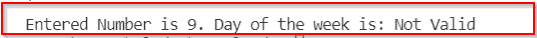

Default case output

`get()` 函数试图检索关键字 `9` 的值。但是，由于这个键值不在字典中，get()函数返回默认值，即**无效**。

因此。这样，您可以使用字典在 Python 中的 switch case 实现中定义默认的 case 值。

阅读: [Python 字典复制](https://pythonguides.com/python-dictionary-copy/)

## 使用函数在 Python 中切换大小写

现在让我们用一个函数执行同样的例子，使它更有用。

```py
def switch(num):
    dict={
        1: 'Sunday',
        2: 'Monday',
        3: 'Tuesday',
        4: 'Wednesday',
        5: 'Thursday',
        6: 'Friday',
        7: 'Saturday'
    }
    return dict.get(num, 'Invalid Day')
num= 5
print(' The number is:', num, 'and the day is:',switch(num))
```

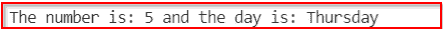

The output of the program

您可以看到我们的功能正在按预期工作。您可以在 `num` 变量中输入案例值。

## 使用类和对象切换 Python 中的大小写

您还可以使用类和对象在 Python 中实现切换大小写功能。

这种方法背后的思想是为 switch 函数创建一个类，并为每种情况定义该类中的所有方法或函数。

稍后，我们将创建该类的一个对象，并调用该类的一个函数，并将大小写值指定为参数。

```py
class Switch:
    # Defining a function for every case
    def case_1(self):
        print('January')
    def case_2(self):
        print('February')
    def case_3(self):
        print('March')
    def case_4(self):
        print('April')
    def case_5(self):
        print('May')
    def case_6(self):
        print('June')
    def case_7(self):
        print('July')
    def case_8(self):
        print('August')
    def case_9(self):
        print('September')
    def case_10(self):
        print('October')
    def case_11(self):
        print('November')
    def case_12(self):
        print('December')

    # Defining a function to decide which function to call
    def circle(self, cases):
        method = 'case_' + str(cases)
        return getattr(self, method)()

# Declaring an object
switcher= Switch()

# Calling the switch case method
switcher.circle(12)
```

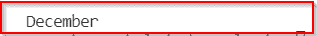

The expected function is called

在上面的代码中， `circle` 函数会决定调用哪个 case，调用哪个函数。

我们将两个字符串 `case_` 和 `str(cases)` 连接起来，组成函数名。然后我们将把这个字符串传递给 `getattr()` 函数。

`getattr()` 函数有两个参数。第一个是对象名，在我们的例子中是 `self` ，第二个是我们想要返回的对象的属性名。该属性名将被定义为字符串。

这样，您可以使用类和对象来实现 Python 中的 switch case 功能。

阅读: [Python 字典多键](https://pythonguides.com/python-dictionary-multiple-keys/)

## 使用用户输入切换 Python 中的大小写

让我们看一个例子，在这个例子中，我们将接受用户的输入，并相应地返回一个结果。看看下面的 Python 代码；

```py
def returnUserInfo(user_id):
    user_info={
        1001: 'James',
        1002: 'Rosy',
        1003: 'Ben',
        1004: 'John',
        1005: 'Mary'
    }
    return user_info.get(user_id, 'Invalid User ID')

user_id= int(input('Enter the user ID:'))
print(returnUserInfo(user_id))
```

*   在上面的代码中，可以将 `user_id` 变量与 case 语句的 case 变量进行比较。
*   `user_id` 被传递给一个函数，该函数是 switch 语句的替代。该函数根据 `user_id` 值返回结果。
*   您可以将 `get()` 函数的第二个参数与 `switch case` 语句中的默认情况进行比较。

## 使用 Python 中 switch case 的计算器

让我们创建一个计算器，以便更好地理解如何在 Python 中实现 **switch case 语句。我们可以使用各种方法，但是对于这个例子，我们将使用使用 Python 字典的映射方法。**

```py
# Defining the arithmetic functions

def addition(num1, num2):
    return num1 + num2
def subtraction(num1, num2):
    return num1 - num2
def multiply(num1, num2):
    return num1 * num2
def realDivision(num1, num2):
    return num1 / num2
def intDivision(num1, num2):
    return num1 // num2
def modulus(num1, num2):
    return num1 % num2

# Defining the switch function

def switch(operation, num1, num2):

    dict={
        1: addition(num1, num2),
        2: subtraction(num1, num2),
        3: multiply(num1, num2),
        4: realDivision(num1, num2),
        5: intDivision(num1, num2),
        6: modulus(num1, num2)
    }
    return dict.get(operation, 'Invalid Operation')

# Taking the operands from the users

num1= int(input('Enter the first number: '))
num2= int(input('Enter the second number: '))

# Taking user input to choose an operation

print('''Press 1 for Addition
Press 2 for Subtraction
Press 3 for Multiplication
Press 4 for real number Division
Press 5 for integer Division
Press 6 for finding the remainder after division''')
num= int(input('Enter a number of your choice: '))

# Calling the switch function
print('Result is: ', switch(num, num1, num2))
```

*   在上面的 Python 代码中，我们为各种算术运算定义了单独的函数。
*   然后，我们在 switch 函数中使用一个字典，将函数调用存储在一个键值对中。
*   这个开关函数有三个参数:
    *   **操作**:1 到 6 之间的值，决定要调用的函数。
    *   `num1` :执行运算的第一个操作数。
    *   `num2` :第二个操作数。

*   如果输入了有效数字，即 1 到 6 之间的数字，则开关函数将返回指定的算术函数。否则，开关功能将返回默认值，即**无效操作**。
*   这两个操作数将被传递给将被超过的函数，该函数将返回结果。

让我们看看不同情况下的输出:

情况 1 的输出，即加法:

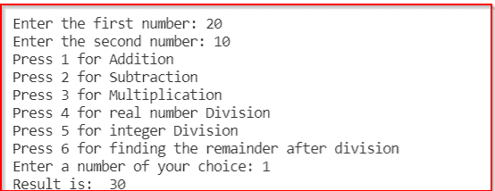

Valid Input

无效案例的输出:

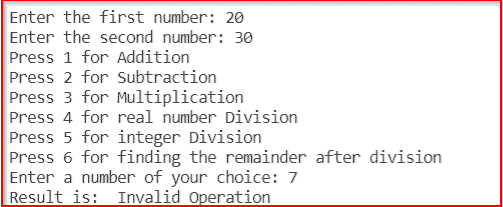

Invalid input

因此，您可能已经学习了如何通过将函数实现为 switch case 语句来用 Python 创建计算器。

阅读:[从字符串 Python 中删除字符](https://pythonguides.com/remove-character-from-string-python/)

## Python 开关案例一行

在本节中，我们将使用 [lambda 函数](https://pythonguides.com/python-anonymous-function/)来用 Python 实现上面的计算器程序。

我们将在一行中实现所有的算术函数。这意味着我们不会单独创建函数。相反，我们将在 switch case 字典中创建 lambda 函数，并用输入进行映射。

```py
# Defining the switch function

def switch(operation, num1, num2):

    dict={
        1: (lambda x, y : x + y),
        2: (lambda x, y : x - y),
        3: (lambda x, y : x * y),
        4: (lambda x, y : x / y),
        5: (lambda x, y : x // y),
        6: (lambda x, y : x % y)

    }
    return dict.get(operation, 'Invalid Operation')(num1, num2)

# Taking the operands from the users

num1= int(input('Enter the first number: '))
num2= int(input('Enter the second number: '))

# Taking user input to choose an operation

print('''Press 1 for Addition
Press 2 for Subtraction
Press 3 for Multiplication
Press 4 for real number Division
Press 5 for integer Division
Press 6 for finding the remainder after division''')
num= int(input('Enter a number of your choice: '))

# Calling the switch function
print('Result is: ', switch(num, num1, num2))
```

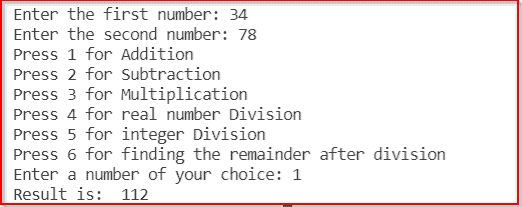

lambda function for addition is called

注意，在使用 `get()` 方法检索函数时，我们需要传递输入值，即 **(num1，num2)** 。

因此，您可能已经学会了如何使用 lambda 函数在 Python 中的 switch case 语句实现内的一行中完成调用函数。

阅读: [Python 在字典中查找最大值](https://pythonguides.com/python-find-max-value-in-a-dictionary/)

## 切换 Python 字符串中的大小写

在上面几节中，我只展示了只检查数值变量的例子。但有时您也需要检查任何字符串变量，如 case 语句中的情况。

我将把一些字符串值映射到字典中的一些函数。然后我将调用一个对应于所提供的键的函数，即字符串大小写。请看下面的例子:

```py
def area():
    radius = float(input('Enter the radius of circle:'))
    print('Area of circle is: ', 3.14 * radius * radius)
def circumference():
    radius = float(input('Enter the radius of circle:'))
    print('Circumference of circle is:', 2 * 3.14 * radius)
def default():
    print('Invalid Operation')

def switch(operation):
    dict={
        'area' : area,
        'circumference' : circumference
    }
    return dict.get(operation, default)()

operation = input('Enter an operation to perform on circle:')
switch(operation)
```

*   上面的程序有两种情况，即求圆的面积或求圆的周长。
*   我们向开关函数传递一个字符串值，开关函数根据给定的字符串值调用一个函数。
*   如果字典中没有字符串值，将调用默认函数。
*   请注意，在字典中，我们只是存储要执行的函数的引用，所需的函数在 return 语句中调用。
*   让我们看看输出:

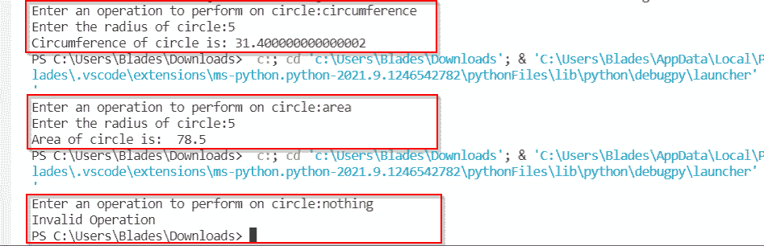

The output of every string case

您可以看到传递给 switch 函数的每个字符串的输出。

因此，您可能已经学会了如何在 Python 中实现字符串的大小写转换功能。

阅读:[如何创建一个空的 Python 字典](https://pythonguides.com/how-to-create-an-empty-python-dictionary/)

## Python 开关字母盒

在这一节中，我将向您展示一个例子，在这个例子中，您可以对字母使用 switch case 实现。

我创建了一个简单的例子来检查输入的字母是元音还是辅音。我已经用字符串'**元音**映射了所有的元音，表示这个字符是一个元音。

并且，如果我们给定一个辅音作为输入，将返回默认的大小写，即**‘辅音’**。

```py
def switch(alphabet):
    dict={
        'a': 'Vowel',
        'e': 'Vowel',
        'i': 'Vowel',
        'o': 'Vowel',
        'u': 'Vowel',
        'A': 'Vowel',
        'E': 'Vowel',
        'I': 'Vowel',
        'O': 'Vowel',
        'U': 'Vowel',
    }
    return dict.get(alphabet, 'Consonant')

alphabet= input('Enter an alphabet to check: ')
print('The entered alphabet is: ', switch(alphabet))
```

*   让我们给出一个元音字符作为输入。

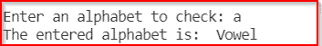

Output when a vowel is entered

*   现在让我们给出一个辅音作为输入。

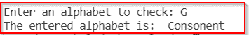

Output when a consonant is entered

因此，您可能已经学习了如何在 Python 中实现 switch case 语句并检查字母值的大小写。

阅读: [Python 字典转 CSV](https://pythonguides.com/python-dictionary-to-csv/)

## Python 切换大小写布尔值

如果您想要为布尔用例实现 switch case 语句，您可以简单地使用 if-else 语句。让我用一个例子来说明这一点。

```py
def switch(case):
    if case == True:
        print('You have excuted the True function')
    elif case == False:
        print('You have exected the False function')
    else:
        print('You have executed the default case function')

switch(False)
switch(True)
switch('Default String')
```

在上面的代码中，我们定义了三个布尔用例:

*   真实的
*   错误的
*   未指定 True 或 False 时的默认用例。

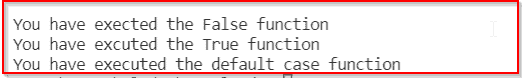

Switch case implementation for boolean use cases

这样，您可以在 Python 中为布尔用例实现 switch case 功能。

阅读: [Python 将字典转换为数组](https://pythonguides.com/python-convert-dictionary-to-an-array/)

## Python 开关盒浮动

如果你想像 switch-case 语句那样传递一个浮点值，你可以用和我们传递任何整数值一样的方法。让我用一个例子来说明这一点。

```py
def switch(case):
    dict={
        1.5 : 'You have choosen the case for 1.5',
        1.6 : 'You have choosen the case for 1.6',
        2.5 : 'You have choosen the case for 2.5',
        2.6 : 'You have choosen the case for 2.6',
        2.7 : 'You have choosen the case for 2.7',
    }
    return dict.get(case, ' Undefined Case ')

print(switch(2.5))
print(switch(5.6))
```

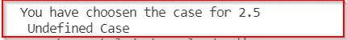

Switch case for the float values

我们将浮点值映射到我们想要打印的结果。我们使用 `get()` 方法返回对应于所提供的键的值，即一个浮动大小写值。

通过这种方式，您可以使用浮点值作为 Python 中 switch case 实现的 case 输入。

*   [如何创建一个空的 Python 字典](https://pythonguides.com/how-to-create-an-empty-python-dictionary/)

## Python 开关案例破解

在 Python 中，没有 switch case 语句，因此在 Python 的 switch case 中也没有 break 语句。然而，我们使用不同的方法来实现这种开关盒功能。

在其他编程语言中，您期望 break 语句会中断特定用例的流程。

换句话说，如果您已经在一个 case 下定义了一些语句，并且您想要在一些语句之后终止该 case，您将使用 break 语句，并且程序流将移动到下一个 case。

如果该案例是最后一个，开关案例结构将被终止。

但是，如果您使用任何方法实现 switch case 功能，您会发现不需要 break 语句。

因为函数是针对特定情况调用的。当所有语句都在函数内部执行时，程序的控制或流程会自动移到下一行。因此，不需要 break 语句。

阅读: [Python 元组字典](https://pythonguides.com/python-dictionary-of-tuples/)

## 带条件的 Python 开关案例

在这一节中，我将解释如何使用 case 语句来处理作为 case 值的一系列数字。

例如，如果事例值大于 10 且小于 2。在这种情况下，您可能希望编写 switch case 语句来处理一系列数字。

在这种情况下，您应该使用 if-else 方法来实现 switch case 功能。因为你要把 case 值和 if-else 语句进行比较。此外，就性能而言，这种方法是最快的方法。

让我给你看一个例子。

```py
def switch(marks):
    if marks >=91 and marks <=100:
        print("Your Grade is A")
    elif marks >=71 and marks <91:
        print("Your Grade is B")
    elif marks >=51 and marks <71:
        print("Your Grade is C")
    elif marks >=35 and marks <51:
        print("Your Grade is D")
    elif marks >=0 and marks <35:
        print("Your Grade is F")
    else:
        print("Invalid Marks Entered!")

switch(61)
```

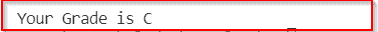

Switch case output for a range

通过这种方式，您可以针对一系列输入值在 Python 中实现切换大小写功能。

阅读: [Python 字典 pop](https://pythonguides.com/python-dictionary-pop/)

## Python 开关盒数组

当您想将一个数组传递给 case 语句时，可能会多次遇到这种情况。在 Python 中。我们在列表的帮助下实现了数组的概念。

因此，在这一节中，我将解释如何在 Python 中用数组实现 switch case 语句。我将用两种方式实现一个例子。

假设我们在 Python 中有一个布尔数组，我们想用它作为 switch case 语句中的一个案例。比如[1，0，1，0，1]或者[真，假，真，假，真]。

**实现 1:` `使用 if-else 结构**

看看下面写的代码:

```py
# defining the functions to execute
def case1():
    print('This is the function for the array [0, 1, 1, 0, 1] using if else')

def case2():
    print('This is the function for the array [0, 0, 0, 1, 1] using if else')

def case3():
    print('This is the function for the array [0, 0, 0, 1, 1] using if else')

# defining the switch function
def switch(arr):
    if arr == [0, 1, 1, 0, 1]:
        case1()
    elif arr == [0, 0, 0, 1, 1]:
        case2()
    elif arr == [1, 1, 1, 0, 0]:
        case3()
    else:
        print('Invalid Case')

# Calling the switch function

arr= [0, 0, 0, 1, 1]
switch(arr)
arr1= [0, 0, 0, 0, 0]
switch(arr1) 
```

在上面的代码中，您可以看到我们正在将一个列表传递给 switch 函数。然后 switch 函数根据指定的情况返回函数。

我已经为两种情况调用了 switch 函数，即有效和无效情况。您可以在下图中看到两种情况下的输出。

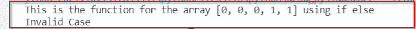

Switch case for array using if-else

**实现 1:` `使用字典映射方法**

现在我将创建相同的开关功能，但是这次使用字典映射方法。

```py
# defining the functions to execute
def case1():
    print('This is the function for the array [0, 1, 1, 0, 1] using dictionary mapping')

def case2():
    print('This is the function for the array [0, 0, 0, 1, 1] using dictionary mapping')

def case3():
    print('This is the function for the array [0, 0, 0, 1, 1] using dictionary mapping')

def default():
    print('Default Case')

# defining the switch function
def switch(arr):
    dict={
        '[0, 1, 1, 0, 1]': case1,
        '[0, 0, 0, 1, 1]': case2,
        '[0, 0, 0, 1, 1]': case3
    }
    return dict.get(arr, default)()

# Calling the switch function
arr = '[0, 1, 1, 0, 1]'
switch(arr)
arr1 = '[1, 1, 1, 1, 1]'
switch(arr1)
```

您可以注意到一件事，我已经将列表作为字符串传递给了 switch 函数。这是因为这个列表将是我们在字典中的键，而您不能在 Python 字典中将列表指定为键。因此，我们将列表转换成一个字符串。

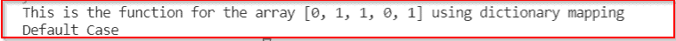

Switch case for an array using the dictionary mapping method

你可以选择一种你觉得更方便使用的方法。但是在决定之前，请看一下下一节，在这一节中，我解释了根据您的需求应该选择哪种方法。

阅读: [Python 循环遍历一个列表](https://pythonguides.com/python-loop-through-a-list/)

## Python switch 语句最佳实践

在这一节中，我将向您解释在 Python 中为我们上面讨论的各种技术实现 switch case 功能的最佳实践。

*   如果你有很少的情况要检查，你应该使用 if-else 方法来实现 switch case 函数。
*   这是因为，如果有一些 if-else 语句，这个方法在性能上非常快。此外，编写少量语句并不十分困难。
*   但是，如果您有大量的案例要检查，您应该使用字典映射方法。在许多情况下，它比 if else 方法更好。
*   如果您想将一个范围作为单个案例进行检查，则必须使用 if else 方法。
*   您应该避免使用类和对象方法来实现 switch case 功能。这是因为，这是一种困难而复杂的实现方法。此外，它在性能方面效率不高。

在选择合适的方法在 Python 中实现 switch case 功能时，您应该记住以下几点。

您可能会喜欢以下 Python 教程:

*   [Python 统计文件中的字数](https://pythonguides.com/python-count-words-in-file/)
*   [Python 列表字典](https://pythonguides.com/python-dictionary-of-lists/)
*   [Python 字典复制示例](https://pythonguides.com/python-dictionary-copy/)
*   [Python 字典扩展](https://pythonguides.com/python-dictionary-extend/)
*   [Python 在字典中查找最大值](https://pythonguides.com/python-find-max-value-in-a-dictionary/)

因此，在本文中，我们借助一些例子讨论了 Python 中的 **case 语句。此外，我们还讨论了以下主题。**

*   Python 有 case 语句吗？
*   Python 中如何使用 case 语句？
*   Python 中的简单 case 语句
*   Python 中的 Switch case 示例
*   Python 开关大小写默认值
*   Case 语句字典 python
*   Python switch case 语句默认值
*   使用函数切换 Python 中的大小写
*   使用类和对象切换 Python 中的大小写
*   使用用户输入切换 Python 中的大小写
*   Python 中使用大小写开关的计算器
*   Python 开关盒单线
*   Python 字符串中的大小写转换
*   Python 开关字母大小写
*   Python 切换大小写布尔值
*   Python 开关盒浮动
*   Python 开关大小写中断
*   带条件的 Python 开关案例
*   Python 开关盒数组
*   Python switch 语句最佳实践

[Bijay Kumar](https://pythonguides.com/author/fewlines4biju/)

Python 是美国最流行的语言之一。我从事 Python 工作已经有很长时间了，我在与 Tkinter、Pandas、NumPy、Turtle、Django、Matplotlib、Tensorflow、Scipy、Scikit-Learn 等各种库合作方面拥有专业知识。我有与美国、加拿大、英国、澳大利亚、新西兰等国家的各种客户合作的经验。查看我的个人资料。

[enjoysharepoint.com/](https://enjoysharepoint.com/)[](https://www.facebook.com/fewlines4biju "Facebook")[](https://www.linkedin.com/in/fewlines4biju/ "Linkedin")[](https://twitter.com/fewlines4biju "Twitter")