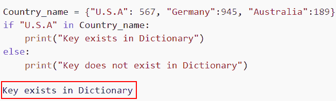
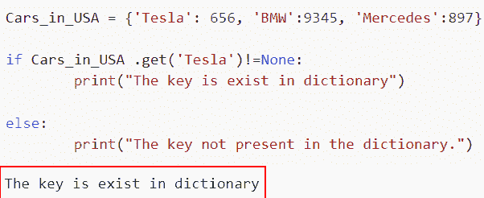
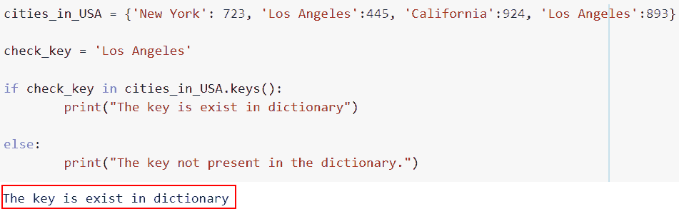
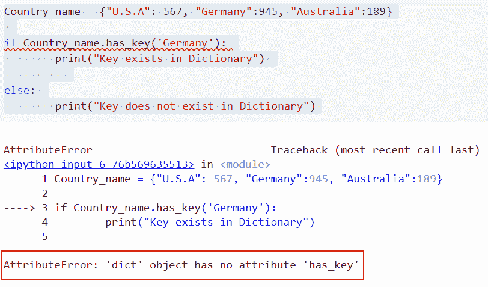
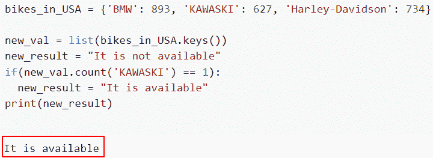

# 如何检查一个键是否存在于 Python 字典中

> 原文：<https://pythonguides.com/check-if-a-key-exists-in-a-python-dictionary/>

[](https://sharepointsky.teachable.com/p/python-and-machine-learning-training-course)

在这个 [Python 教程](https://pythonguides.com/python-programming-for-the-absolute-beginner/)中，我们将学习如何检查一个键是否存在于 [Python 字典](https://pythonguides.com/create-a-dictionary-in-python/)中。为了理解各种方法，我们将使用一些内置函数来检查 Python 字典中是否存在某个键。

作为一名开发人员，在开发 Python 项目时，我需要检查字典中是否有这个键。

在这里我们将看到:

*   如何使用 in 运算符检查 Python 字典中是否存在某个键
*   使用 get()检查 Python 字典中是否存在一个键
*   如何使用 keys()检查一个键是否存在于 Python 字典中
*   使用 has_key()检查 Python 字典中是否存在键
*   如何使用 count()检查一个键是否存在于 Python 字典中

目录

[](#)

*   [检查一个关键字是否存在于 Python 字典中](#Check_if_a_Key_Exists_in_a_Python_Dictionary "Check if a Key Exists in a Python Dictionary")
    *   [如何使用 in 操作符](#How_to_check_if_a_Key_Exists_in_a_Python_Dictionary_using_in_operator "How to check if a Key Exists in a Python Dictionary using in operator")检查一个键是否存在于 Python 字典中
    *   [使用 get()](#Check_if_a_Key_Exists_in_a_Python_Dictionary_using_get "Check if a Key Exists in a Python Dictionary using get()") 检查一个键是否存在于 Python 字典中
    *   [如何使用 keys()](#How_to_check_if_a_Key_Exists_in_a_Python_Dictionary_using_keys "How to check if a Key Exists in a Python Dictionary using keys()") 检查一个键是否存在于 Python 字典中
    *   [使用 has_key()](#Check_if_a_Key_Exists_in_a_Python_Dictionary_using_has_key "Check if a Key Exists in a Python Dictionary using has_key()") 检查 Python 字典中是否存在关键字
    *   [如何使用 count()](#How_to_check_if_a_Key_Exists_in_a_Python_Dictionary_using_count "How to check if a Key Exists in a Python Dictionary using count()") 检查一个键是否存在于 Python 字典中

## 检查一个关键字是否存在于 Python 字典中

在 Python 中，有许多方法可以检查一个键是否存在于 Python 字典中。我们将详细介绍如何使用操作符**‘in’和 keys()** 方法来检查 Python 字典中是否存在某个键。

### 如何使用 in 操作符检查一个键是否存在于 Python 字典中

*   在这一节中，我们将讨论如何使用 Python 中的'【T1]操作符中的' T0 '来检查字典中是否存在一个键。
*   我们可以很容易地使用 Python in 操作符和 if 语句来确定输入 Python 字典中是否存在特定的键。
*   在本例中，我们将创建一个字典，并设置该关键字在字典中是否可用的条件。

**语法:**

下面是 Python 中'操作符中的**的语法**

```py
if value in iterable:
```

**举例:**

让我们举一个例子，看看如何在 Python 中使用'【T1]中的' T0 ']操作符来检查字典中是否存在一个键。

源代码:

```py
Country_name = {"U.S.A": 567, "Germany":945, "Australia":189}
if "U.S.A" in Country_name:
    print("Key exists in Dictionary")
else:
    print("Key does not exist in Dictionary")
```

为了确定关键字“U.S.A .”是否出现在字典中，我们使用了 if 语句和 Python in 操作符

下面是下面给出的代码的截图。



How to check if a Key Exists in a Python Dictionary using in operator

这就是如何使用 in 操作符检查 Python 字典中是否存在一个键。

阅读: [Python 字典排序](https://pythonguides.com/python-dictionary-sort/)

### 使用 get() 检查一个键是否存在于 Python 字典中

*   现在让我们讨论如何使用 get()检查一个键是否存在于 Python 字典中。
*   如果在字典中找到了这个键，get()方法确实返回了与之关联的值；否则，返回**‘无’**。
*   使用这种方法，我们可以很容易地分配一个键，并检查 python 字典中是否存在一个键。

**语法:**

让我们看一下语法并理解 Python 中的 `get()` 方法的工作原理

```py
dict.get(key, default=None)
```

*   它由几个参数组成
    *   **key:** 该参数定义了我们希望被搜索的关键字。
    *   **默认值:**未找到给定键时返回的值。默认情况下，该值为 None。

**举例:**

让我们举一个例子，使用 `get()` 检查一个键是否存在于 Python 字典中。

**源代码:**

```py
Cars_in_USA = {'Tesla': 656, 'BMW':9345, 'Mercedes':897} 

if Cars_in_USA .get('Tesla')!=None: 
        print("The key is exist in dictionary") 

else: 
        print("The key not present in the dictionary.") 
```

在下面给出的代码中，我们使用了 dict.get()方法，在该方法中，我们分配了 key 元素，它将检查它是否包含在字典中。

你可以参考下面的截图



Check if a Key Exists in a Python Dictionary using get()

正如你在截图中看到的，我们已经讨论了如何使用 get()检查一个键是否存在于 Python 字典中。

阅读: [Python 字典索引](https://pythonguides.com/python-dictionary-index/)

### 如何使用 keys() 检查一个键是否存在于 Python 字典中

*   在本节中，我们将讨论如何使用 keys()来检查 Python 字典中是否存在某个键。
*   要从字典中提取所有的键，使用 Python 中的 `keys()` 函数。如果字典是空的，它产生一个空列表。此过程不需要任何参数。
*   因此，为了确定特定的键是否出现在 dict 中，我们使用 Python 中的 if 语句将搜索键与由 `keys()` 方法返回的键列表进行比较。

**语法:**

让我们看一下语法并理解 `dict.keys()` 方法的工作原理

```py
dict.keys()
```

**注意:**这个方法不接受任何参数，它将返回键的列表。

**举例:**

让我们举一个例子，使用 keys()检查一个键是否存在于 Python 字典中。

**源代码:**

```py
cities_in_USA = {'New York': 723, 'Los Angeles':445, 'California':924, 'Los Angeles':893} 

check_key = 'Los Angeles'

if check_key in cities_in_USA.keys(): 
        print("The key is exist in dictionary") 

else: 
        print("The key not present in the dictionary.") 
```

为了确定关键字 `"Los Angeles"` 是否出现在 dict 中，我们使用了一个 `dict.keys()` 方法。

下面是以下给定代码的实现。



How to check if a Key Exists in a Python Dictionary using keys

在这个例子中，我们已经了解了如何使用键来检查 Python 字典中是否存在键。

阅读: [Python 字典计数](https://pythonguides.com/python-dictionary-count/)

### 使用 has_key() 检查 Python 字典中是否存在关键字

*   在本节中，我们将讨论如何使用 `has_key()` 来检查一个键是否存在于 Python 字典中。
*   如果指定的键出现在字典中，该方法有一个返回 true 的`key()`；否则，它返回 false。
*   使用 if 语句，使用内置方法 `has_key()` 确定字典中是否存在该键。Python 3 中不再提供 `has_key()` 函数。因此，它仅限于 Python 2 使用。

**语法:**

下面是 Python 中 has_key()方法的语法

```py
dict.has_keys()
```

**举例:**

```py
Country_name = {"U.S.A": 567, "Germany":945, "Australia":189}

if Country_name.has_key('Germany'): 
        print("Key exists in Dictionary") 

else: 
        print("Key does not exist in Dictionary") 
```

你可以参考下面的截图



Check if a Key Exists in a Python Dictionary using has_key

这个错误的原因是在 Python 3 版本中已经删除了 has_key()函数。为了解决这个问题，我们必须安装 python 2.7 版本。

阅读: [Python 字典初始化](https://pythonguides.com/python-dictionary-initialize/)

### 如何使用 count() 检查一个键是否存在于 Python 字典中

*   现在让我们看看如何使用 `count()` 来检查一个键是否存在于 Python 字典中。
*   可以使用 `count()` 方法来确定字典中是否存在一个键；如果密钥的计数为 1，则密钥存在；否则，就不是。
*   Python 中的 `count()` 函数返回一个元素在列表中出现的次数。如果列表中没有该元素，则返回 0。

**举例:**

这里我们将举一个例子，使用 count()检查一个键是否存在于 Python 字典中。

**源代码:**

```py
bikes_in_USA = {'BMW': 893, 'KAWASKI': 627, 'Harley-Davidson': 734}

new_val = list(bikes_in_USA.keys())
new_result = "It is not available"
if(new_val.count('KAWASKI') == 1):
	new_result = "It is available"
print(new_result)
```

在上面的代码中，我们首先创建了名为 bikes_in_USA 的字典，然后使用它将它转换成列表。接下来，我们设置给定的键在字典中是否可用的条件。

下面是以下代码的截图



How to check if a Key Exists in a Python Dictionary using count

还有，查下 Python 字典相关教程。

*   [Python 字典包含](https://pythonguides.com/python-dictionary-contains/)
*   [Python 字典更新](https://pythonguides.com/python-dictionary-update/)
*   [Python 列表字典](https://pythonguides.com/python-dictionary-of-lists/)
*   [Python 字典复制](https://pythonguides.com/python-dictionary-copy/)

在本文中，我们讨论了如何检查一个键是否存在于 Python 字典中，我们还讨论了以下主题。

*   如何使用 in 运算符检查 Python 字典中是否存在某个键
*   使用 get()检查 Python 字典中是否存在一个键
*   如何使用 keys()检查一个键是否存在于 Python 字典中
*   使用 has_key()检查 Python 字典中是否存在键
*   如何使用 count()检查一个键是否存在于 Python 字典中

[Bijay Kumar](https://pythonguides.com/author/fewlines4biju/)

Python 是美国最流行的语言之一。我从事 Python 工作已经有很长时间了，我在与 Tkinter、Pandas、NumPy、Turtle、Django、Matplotlib、Tensorflow、Scipy、Scikit-Learn 等各种库合作方面拥有专业知识。我有与美国、加拿大、英国、澳大利亚、新西兰等国家的各种客户合作的经验。查看我的个人资料。

[enjoysharepoint.com/](https://enjoysharepoint.com/)[](https://www.facebook.com/fewlines4biju "Facebook")[](https://www.linkedin.com/in/fewlines4biju/ "Linkedin")[](https://twitter.com/fewlines4biju "Twitter")