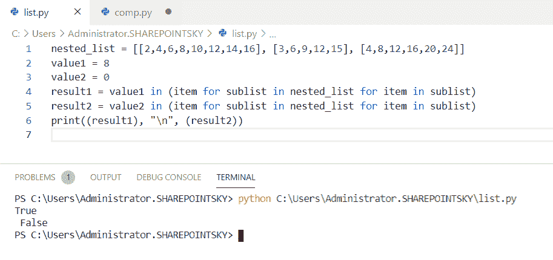
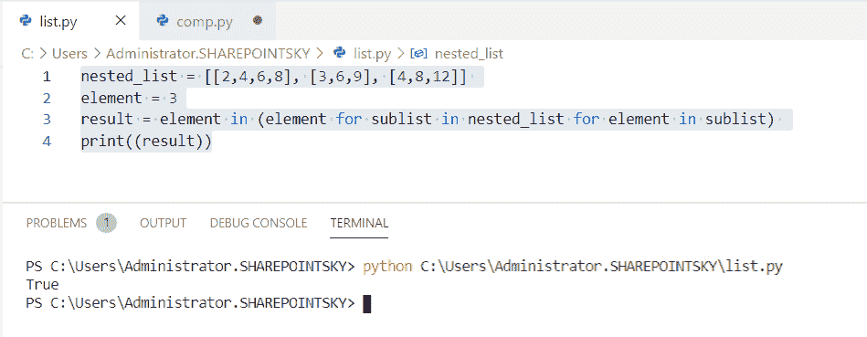

# 检查一个列表是否存在于另一个列表 Python 中

> 原文：<https://pythonguides.com/check-if-a-list-exists-in-another-list-python/>

[](https://sharepointsky.teachable.com/p/python-and-machine-learning-training-course)

在本 [Python 教程](https://pythonguides.com/python-programming-for-the-absolute-beginner/)中，我们将学习**检查一个列表是否存在于 python** 中的另一个列表中，我们还将涉及以下主题:

*   Python 检查所有元素是否都存在于另一个列表中
*   Python 检查列表中的任何元素是否在另一个列表中
*   Python 检查一个条目是否是另一个列表的子集
*   Python 检查值是否存在于列表列表中
*   Python 使用 itertools.chain()检查列表列表中是否存在值
*   检查元素是否存在于 list python 的列表中
*   检查一个列表是否包含另一个列表 python

目录

[](#)

*   [Python 检查一个列表是否存在于另一个列表中](#Python_check_if_a_list_exists_in_another_list "Python check if a list exists in another list")
*   [Python 检查所有元素是否存在于另一个列表中](#Python_check_if_all_elements_exist_in_another_list "Python check if all elements exist in another list")
*   [Python 检查列表中的任何元素是否在另一个列表中](#Python_check_if_any_elements_in_the_list_are_in_another_list "Python check if any elements in the list are in another list")
*   [Python 检查一个条目是否是另一个列表的子集](#Python_check_if_an_item_is_a_subset_of_another_list "Python check if an item is a subset of another list")
*   [Python 检查列表列表中是否存在值](#Python_check_if_a_value_exists_in_a_list_of_lists "Python check if a value exists in a list of lists")
*   [Python 使用 itertools.chain()](#Python_check_if_a_value_exists_in_a_list_of_lists_using_itertoolschain "Python check if a value exists in a list of lists using itertools.chain()") 检查列表列表中是否存在值
*   [检查列表 python 的列表中是否存在元素](#Check_if_an_element_is_present_in_the_list_of_list_python "Check if an element is present in the list of list python")
*   [检查一个列表是否包含另一个列表 python](#Check_if_a_list_contains_another_list_python "Check if a list contains another list python")

## Python 检查一个列表是否存在于另一个列表中

现在，我们可以看到**如何在 Python 中检查一个列表是否存在于另一个列表**中。

*   在这个例子中，我将一个变量作为**列表**，将另一个变量作为**检查列表**。
*   并且**如果使用条件**如果**检查 _ 列表**出现在**列表**中，那么输出将是**“列表存在”，**否则**“列表不存在”**。
*   为了获得输出，我使用了**print(" List present ")。**

示例:

```py
 list = [[1,5,7,], [2, 3, 4], [3, 6, 9], [4, 8, 12]] 
check_list = [2,3,4]
if check_list in list: 
	print("List is present") 
else: 
	print("List is not present") 
```

我们可以看到当**列表出现在**时的输出。您可以参考下面的输出截图。


Python check if a list exists in another list

> 你可能会喜欢[如何在 Turtle Python](https://pythonguides.com/attach-image-to-turtle-python/) 和[机器学习中使用 Python](https://pythonguides.com/machine-learning-using-python/) 附加图像

## Python 检查所有元素是否存在于另一个列表中

现在，我们可以看到**如何在 Python 中检查所有元素是否存在于另一个列表**中。

*   在这个例子中，我将两个变量作为**结果 1** 和**结果 2**
*   另一个名为 `new_list` 的变量被声明并且**如果条件**被使用，如果 new_list 条件被满足它返回**真**否则它返回**假。**

示例:

```py
fruits1 = ['Mango','orange','apple','jackfruit']
fruits2 = ['Mango','orange','apple','jackfruit']
new_list=  all(item in fruits1 for item in fruits2)
if new_list is True:
    print("True")    
else :
    print("False")
```

因为一个列表中的所有元素都出现在另一个列表中，所以它返回 `true` 作为输出。您可以参考下面的输出截图:


Python check if all elements exist in another list

## Python 检查列表中的任何元素是否在另一个列表中

在这里，我们可以看到**如何在 Python 中检查列表中的任何元素是否在另一个列表**中。

*   在本例中，我将变量作为**结果 1** 和**结果 2** 以及另一个名为 `new_list` 的列表，并赋值为 **new_list= any(结果 1 中的项目对应于结果 2 中的项目)**，使用了关键字 `any` 。
*   使用 if 条件，如果 fruits2 中的任何一项出现在 fruits1 中，则返回 true，否则返回 false。

示例:

```py
fruits1 = ['Mango','orange','apple','jackfruit']
fruits2 = ['Mango','orange','watermelon','custardapple']
new_list=  any(item in fruits1 for item in fruits2)
if new_list is True:
    print("True")    
else :
    print("False")
```

当条件为**真**时，我们可以看到输出为**真**。您可以参考下面的输出截图。

## Python 检查一个条目是否是另一个列表的子集

现在，我们可以看到**如何在 python 中检查一个条目是否是另一个列表**的子集

*   在这个例子中，我将一个变量作为一个**列表**并赋予 `search_item =` 16，如果条件被用作 **if search_item in(子列表中的项目在子列表中的项目的列表中)**，则使用关键字中的**。**
*   如果条件满足，则返回**“元素存在”**，否则返回**“元素不存在”**。

示例:

```py
list = [[2,4,6,8,10],[1,3,5,7,9],[4,8,12,16,20]]
search_item = 16
if search_item in (item for sublist in list for item in sublist):
   print("Element is Present")
else:
   print("Element Not Present")
```

当条件为**真**时，返回**“元素存在”**。您可以参考下面的输出截图。


Python check if an item is a subset of another list

## Python 检查列表列表中是否存在值

在这里，我们可以看到**如何在 Python 中检查一个列表**的列表中是否存在一个值。

*   在本例中，我采用了一个变量作为条件中的 `nested_list` 和 `value1=8` 和 `value2=0` 和**使用`result 1 = value 1 in(item for sublist in nested _ list for item in sublist)`。使用了关键字**中的**。**
*   为了获得输出，我使用了 **print((result1)，" \n "，(result2))。**

示例:

```py
nested_list = [[2,4,6,8,10,12,14,16], [3,6,9,12,15], [4,8,12,16,20,24]] 
value1 = 8
value2 = 0
result1 = value1 in (item for sublist in nested_list for item in sublist) 
result2 = value2 in (item for sublist in nested_list for item in sublist) 
print((result1), "\n", (result2)) 
```

当值出现在列表中时，它返回**真**，否则返回**假。**



Python check if a value exists in a list of lists

## Python 使用 itertools.chain() 检查列表列表中是否存在值

在这里，我们可以看到**如何使用 Python 中的 itertools.chain** 检查一个值是否存在于 lista 的列表中。

*   在这个例子中，我从 `itertools` 导入了一个模块。**链()**是 itertool 的函数，用于迭代列表。
*   要搜索的元素给定为 `element_search1 = 40` 和 `element_search2 = 35` 为了检查给定的数目，我在 chain(*list) 中使用了 **result1 = element_search1。**
*   如果该数字存在，它返回**真值**，否则返回**假值**。为了得到输出，我使用了 **print((结果 1)，" \n "，(结果 2))** 。

示例:

```py
from itertools import chain 
list = [[5,10,15,20,25], [10,20,30,40], [25,50,75,90]]
element_search1 = 40
element_search2 = 35
result1 = element_search1 in chain(*list) 
result2 = element_search2 in chain(*list) 
print((result1), "\n", (result2)) 
```

当数字出现在列表**中时，true** 作为输出返回。您可以参考下面的输出截图。


Python check if a value exists in a list of lists using itertools.chain()

## 检查列表 python 的列表中是否存在元素

在这里，我们可以看到**如何检查一个元素是否出现在 Python 中的 list**列表中。

*   在这个例子中，我采用了一个变量作为 `nested_list` 和element = 3 和 **in 条件**被使用`result = element in(element for sublist in nested _ list for element in sublist)`。使用了关键字中的**。**
*   为了获得输出，我使用了 **print((结果**))。

示例:

```py
nested_list = [[2,4,6,8], [3,6,9], [4,8,12]] 
element = 3
result = element in (element for sublist in nested_list for element in sublist) 
print((result))
```

由于元素出现在列表中，所以它返回 `true` 作为输出。您可以参考下面的输出截图。



Check if element is present in list of list

## 检查一个列表是否包含另一个列表 python

现在，我们可以看到**如何在 Python 中检查一个列表是否包含另一个列表**。

*   在这个例子中，我把一个变量作为一个**列表、**和**，如果条件**被用来检查。
*   如果 **check_list =["orange"]** 出现在列表中，则返回**“列表存在”**否则返回**“列表不存在”**。

示例:

```py
list = [["watermelon"], ["mango"], ["orange"], ["apple"]] 
check_list = ["orange"]
if check_list in list: 
	print("List is present") 
else: 
	print("List is not present") 
```

因为 check_list 出现在列表中，所以它返回 true 作为输出。您可以参考下面的输出截图。


Check if a list contain another list python

您可能会喜欢以下 Python 列表教程:

*   [Python 向 CSV 写列表](https://pythonguides.com/python-write-a-list-to-csv/)
*   [使用 if-else 理解 Python 列表](https://pythonguides.com/python-list-comprehension-using-if-else/)
*   [Python 从列表中选择](https://pythonguides.com/python-select-from-a-list/)
*   [Python 列表理解λ](https://pythonguides.com/python-list-comprehension/)
*   [Python 中的链表](https://pythonguides.com/linked-lists-in-python/)
*   [Python 将列表写入文件，并附有示例](https://pythonguides.com/python-write-list-to-file/)
*   [Python 类型错误:“列表”对象不可调用](https://pythonguides.com/python-typeerror-list-object-is-not-callable/)
*   [Python 将元组转换为列表](https://pythonguides.com/python-convert-tuple-to-list/)
*   [Python 元组排序列表](https://pythonguides.com/python-sort-list-of-tuples/)
*   [Python 将图像保存到文件](https://pythonguides.com/python-save-an-image-to-file/)
*   [如何使用 Python Tkinter 创建日期时间选择器](https://pythonguides.com/create-date-time-picker-using-python-tkinter/)

在本教程中，我们学习了 Python 中的**检查一个列表是否存在于另一个列表**中，并且我们也讨论了这些主题:

*   Python 检查所有元素是否都存在于另一个列表中
*   Python 检查列表中的任何元素是否在另一个列表中
*   Python 检查一个条目是否是另一个列表的子集
*   Python 检查值是否存在于列表列表中
*   Python 使用 itertools.chain()检查列表列表中是否存在值
*   检查列表中是否存在元素
*   检查一个列表是否包含另一个列表 python

[Bijay Kumar](https://pythonguides.com/author/fewlines4biju/)

Python 是美国最流行的语言之一。我从事 Python 工作已经有很长时间了，我在与 Tkinter、Pandas、NumPy、Turtle、Django、Matplotlib、Tensorflow、Scipy、Scikit-Learn 等各种库合作方面拥有专业知识。我有与美国、加拿大、英国、澳大利亚、新西兰等国家的各种客户合作的经验。查看我的个人资料。

[enjoysharepoint.com/](https://enjoysharepoint.com/)[](https://www.facebook.com/fewlines4biju "Facebook")[](https://www.linkedin.com/in/fewlines4biju/ "Linkedin")[](https://twitter.com/fewlines4biju "Twitter")