# 在 Python 中检查列表是否为空–39 个示例

> 原文：<https://pythonguides.com/check-if-a-list-is-empty-in-python/>

[](https://sharepointsky.teachable.com/p/python-and-machine-learning-training-course)

在本 [Python 教程](https://pythonguides.com/python-download-and-installation/)中，我们将讨论**如何在 Python** 中检查一个列表是否为空。我们还将检查:

*   检查 Python 中的列表是否为空
*   列表的 Python 大小
*   Python 从一个列表中返回多个值
*   从列表 Python 中移除重复项
*   遍历列表 python
*   使用 python 中的 range()方法遍历列表
*   列表索引超出范围 python
*   从列表 python 中删除元素
*   Python 从列表中移除最后一个元素
*   比较 python 中的两个列表
*   从列表 python 中移除第一个元素
*   替换列表 python 中的项目
*   Python 获取列表中的最后一个元素
*   python 结合了两个列表
*   python 中列表的总和
*   python 中的 Max()函数
*   python 中的 Min()函数
*   统计列表 python 中某个字符的出现次数
*   检查列表 python 中是否存在元素
*   从列表 python 中移除元素
*   Python 列表中的首字母大写
*   列表中的 Python 唯一值
*   Python 按字母顺序排序列表
*   将列表写入文件 python
*   列表 python 中的计数元素
*   Python 将文件读入列表
*   Python 列表包含一个字符串
*   Python 将元素从一个列表复制到另一个列表
*   Python 函数返回多个值
*   Python 在一个列表中找到所有出现的索引
*   Python 从列表中移除多个项目
*   合并两个列表 python
*   Python 列表追加到前面
*   在 python 中展平列表列表
*   列表 python 的含义
*   Python 将列表保存到文件
*   python 中的扩展与追加
*   Python 前置到列表
*   压缩两个列表 python

目录

[](#)

*   [在 Python 中检查列表是否为空](#Check_if_a_list_is_empty_in_Python "Check if a list is empty in Python")
*   [Python 大小的一个列表](#Python_size_of_a_list "Python size of a list")
*   [Python 从一个列表中返回多个值](#Python_return_multiple_values_from_a_list "Python return multiple values from a list")
*   [从列表中删除重复 Python](#Remove_duplicates_from_list_Python "Remove duplicates from list Python")
*   [遍历列表 python](#Loop_through_list_python "Loop through list python")
*   [使用 python 中的 range()方法遍历列表](#Iterate_through_a_list_using_range_method_in_python "Iterate through a list using range() method in python")
*   [列表索引超出范围 python](#List_Index_out_of_range_python "List Index out of range python")
*   [从列表 python 中删除一个元素](#Delete_an_element_from_list_python "Delete an element from list python")
*   [Python 从列表中移除最后一个元素](#Python_remove_last_element_from_the_list "Python remove last element from the list")
*   [比较 python 中的两个列表](#Compare_two_lists_in_python "Compare two lists in python")
*   [从列表 python 中删除第一个元素](#Remove_the_first_element_from_list_python "Remove the first element from list python")
*   [替换列表 python 中的项目](#Replace_item_in_list_python "Replace item in list python")
*   [Python 获取列表中的最后一个元素](#Python_get_last_element_in_the_list "Python get last element in the list")
*   [Python 组合了两个列表](#Python_combines_two_lists "Python combines two lists")
*   [python 中一个列表的总和](#Sum_of_a_list_in_python "Sum of a list in python")
*   [python 中的 Max()函数](#Max_function_in_python "Max() function in python")
*   [python 中的 Min()函数](#Min_function_in_python "Min() function in python")
*   [统计列表 python 中一个字符的出现次数](#Count_occurrences_of_a_character_in_list_python "Count occurrences of a character in list python")
*   [检查列表 python 中是否存在元素](#Check_if_element_exists_in_list_python "Check if element exists in list python")
*   [从列表中删除元素 python](#Remove_elements_from_list_python "Remove elements from list python")
*   [Python 列表中大写首字母](#Python_uppercase_first_letter_in_a_list "Python uppercase first letter in a list")
*   [Python 列表中的唯一值](#Python_unique_values_in_the_list "Python unique values in the list")
*   [Python 按字母顺序排序列表](#Python_sort_list_alphabetically "Python sort list alphabetically")
*   [写列表到文件 python](#Write_a_list_to_file_python "Write a list to file python")
*   [计数列表 python 中的元素](#Count_elements_in_list_python "Count elements in list python")
*   [Python 将文件读入列表](#Python_read_file_into_a_list "Python read file into a list")
*   [Python 列表包含一个字符串](#Python_list_contains_a_string "Python list contains a string")
*   [Python 将元素从一个列表复制到另一个列表](#Python_copy_elements_from_one_list_to_another "Python copy elements from one list to another")
*   [Python 函数返回多个值](#Python_function_return_multiple_values "Python function return multiple values")
*   [Python 在一个列表中找到所有事件的索引](#Python_find_an_index_of_all_occurrences_in_a_list "Python find an index of all occurrences in a list")
*   [Python 从列表中移除多个项目](#Python_remove_multiple_items_from_the_list "Python remove multiple items from the list")
*   [合并两个列表 python](#Merge_two_lists_python "Merge two lists python")
*   [Python 列表追加到前面](#Python_list_append_to_front "Python list append to front")
*   [在 python 中展平列表列表](#Flatten_a_list_of_lists_in_python "Flatten a list of lists in python")
*   [链表 python 的含义](#Mean_of_a_list_python "Mean of a list python")
*   [Python 保存列表到文件](#Python_save_list_to_file "Python save list to file")
*   [python 中的扩展 vs 追加](#Extend_vs_Append_in_python "Extend vs Append in python")
*   [Python 前置到列表](#Python_prepend_to_list "Python prepend to list")
*   [Zip 二列表 python](#Zip_two_lists_python "Zip two lists python")

## 在 Python 中检查列表是否为空

python 中的**空列表总是被评估为 false，而非空列表被评估为 true，这是布尔值。在 python 中，它使用 not 运算符来确定列表是否为空。**

**举例:**

```py
my_list = []
if not my_list:
print('List is empty')
else:
print('List is not empty')
```

在编写了上面的代码之后(检查 Python 中的列表是否为空)，一旦打印，输出将显示为**“List is empty”**。这里，列表没有元素，所以它是空的。

关于**在 Python** 中检查一个列表是否为空，可以参考下面的截图。

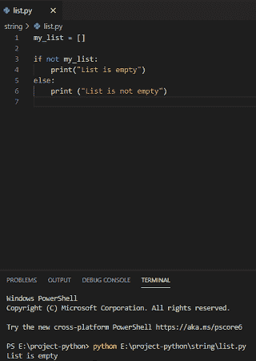

Check if a list is empty in Python

我们还可以使用 python 中内置的 length 函数来检查列表。我们将使用 **len()方法**来检查列表是否为空。

**举例:**

```py
my_list = []
if len(my_list)==0:
print('List is empty')
else:
print('List is not empty')
```

这里，如果列表为空，len()方法将返回零。关于**在 Python** 中检查一个列表是否为空，可以参考下面的截图。

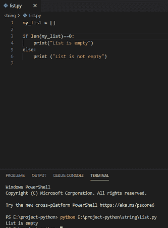

Python Check if list is empty

这样，我们可以**在 Python** 中检查一个列表是否为空。

读取 [Python 字符串以列出](https://pythonguides.com/python-string-to-list/)

## Python 大小的一个列表

为了在 python 中找到列表的**大小，我们有了 **len()方法**，它将给出任何对象的长度。**

**举例:**

```py
list1 = ["Python", "Tutorial", 12]
print("Size of list = ", len(list1))
```

写完上面的代码(Python 大小的列表)，你将打印出 `" len() "` ，然后输出将显示为 `" 3 "` 。这里，len()方法将给出列表中元素的大小。

你可以参考下面的列表的 Python 大小截图。

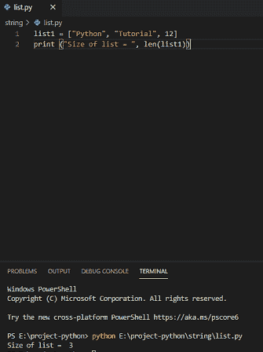

Python size of a list

这样，我们可以在 Python 中获得一个列表的**长度。**

阅读 [Python Tkinter 事件](https://pythonguides.com/python-tkinter-events/)

## Python 从一个列表中返回多个值

在 Python 中，函数可以返回多个值。只需使用 return 保存多个用逗号分隔的值。使用方括号[]将给出列表。

**举例:**

```py
def my_list1():
return ['Ani', 20]
result = my_list1()
print(result)
```

写完上面的代码(python 从一个列表中返回多个值)，你将打印出 `" result "` ，然后输出将显示为 **" [ 'Ani '，20 ] "** 。这里，返回将给出列表中的多个值。

你可以参考下面的列表的 Python 大小截图。

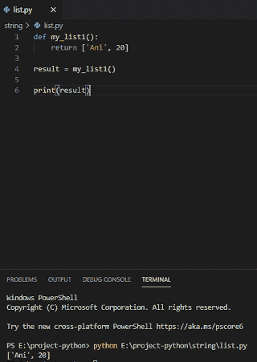

Python return multiple values from a list

这样，我们可以让 **python 从一个列表**中返回多个值。

*   [Python 将元组转换为列表](https://pythonguides.com/python-convert-tuple-to-list/)

## 从列表中删除重复 Python

在 Python 中，可以使用 list 方法移除列表中的重复元素，count()将给出值的出现次数，remove()用于消除列表中的重复元素。

**举例:**

```py
list1 = ["Ankita", "Sid", "Ankita", "Siya", "Sid"]
for v in list1:
if list1.count(v) > 1:
list1.remove(v)
print(list1)
```

写完上面的代码(从 list Python 中删除重复的)，一旦打印出 `" list1 "` ，那么输出将显示为 **" [ "Ankita "，" Sid "，" Siya"] "** 。这里，remove()方法将删除列表中的重复元素。

你可以参考下面的截图来**删除列表中的重复 Python** 。

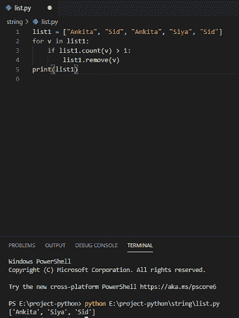

Remove duplicates from list Python

同样在 Python 中，可以通过使用名为 fromkeys()的字典方法来删除列表中的重复元素。它会自动删除重复项，因为关键字在字典中不能重复。

**举例:**

```py
list1 = ["Ankita", "Sid", "Ankita", "Siya", "Sid"]
list1 = list(dict.fromkeys(list1))
print(list1)
```

写完上面的代码(从 list Python 中删除重复的)，你将打印出 `" list1 "` ，然后输出将显示为 **" [ "Ankita "，" Sid "，" Siya"] "** 。这里，fromkeys()方法将删除列表中出现的重复元素。

您可以参考下面的截图，从列表 Python 中删除重复项。

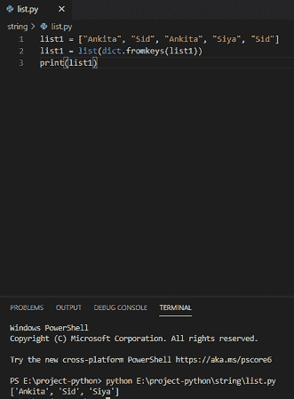

Python list remove duplicates

这样，我们可以**从列表 Python** 中删除重复项。

读取循环的 [Django](https://pythonguides.com/django-for-loop/)

## 遍历列表 python

python 中的**循环用于遍历一个列表。对序列进行迭代称为遍历。**

**举例:**

```py
my_value = [2, 4, 6, 8, 10]
for s in my_value:
print(s)
```

写完上面的代码(遍历 list python)，你将打印出 `" s "` ，然后输出将显示为 `" 2 4 6 8 10 "` 。这里，**“s”**是变量，它取序列中出现的项目的值，循环将继续，直到最后一个项目。

你可以参考下面的列表 python 的截图。

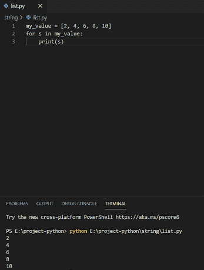

Loop through list python

这就是我们如何在 Python 中循环遍历列表的方法。

## 使用 python 中的 range()方法遍历列表

在 python 中，range()方法用于返回整数序列，它将遍历 python 中的一个列表。

**举例:**

```py
my_list = [30, 15, 45, 93, 38]
for a in range(len(my_list)):
print(my_list[a])
```

写完上面的代码后(在 python 中使用 range()方法遍历一个列表)，一旦打印出 **" my_list[a] "** ，那么输出将显示为 **" 30，15，45，93，38 "** 。在这里，**“range()”**方法与循环一起使用来遍历列表。

你可以参考下面**的截图，使用 python** 中的 range()方法遍历一个列表。

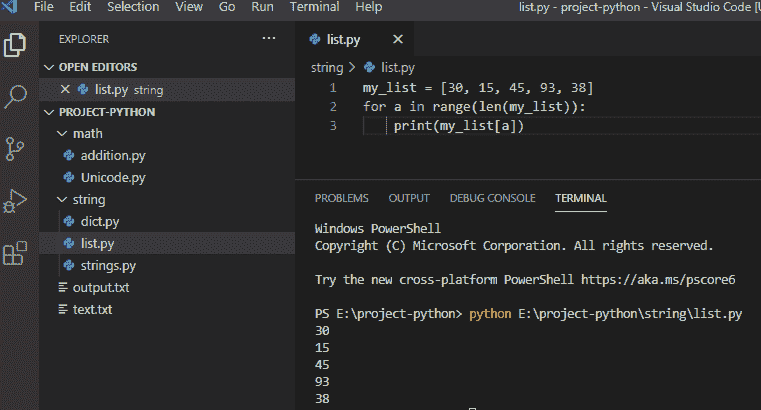

Iterate through a list using range() method in python

这就是我们如何使用 python 中的 range()方法**遍历列表。**

读取 [Matplotlib 日志日志图](https://pythonguides.com/matplotlib-log-log-plot/)

## 列表索引超出范围 python

在 Python 中，我们可以**通过索引**访问列表中的任何元素，如果我们给出列表中不存在的索引，那么它将给出一个错误消息，即列表索引超出范围。

**举例:**

```py
place = ['Delhi', 'Bangalore', 'Jaipur', 'Pune']
print(place[4])
```

写完上面的代码后，你将打印出 **" place[4] "** ，然后输出将显示为**"列表索引超出范围"**。这里，**“位置[4]”**不存在，所以它会给出一个错误消息，因为索引 4 不在列表中。

您可以参考下面的列表索引超出 python 范围的截图。

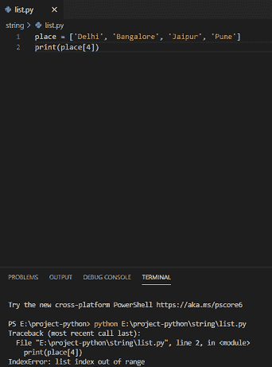

List Index out of range python

因此，如果给定的索引存在于列表中，就可以解决上述错误。

**举例:**

```py
place = ['Delhi', 'Bangalore', 'Jaipur', 'Pune']
print(place[2])
```

这里，我们将打印列表中的**“place[2]”**，输出将是**“斋浦尔”，**这个错误通过在范围中取索引来解决。

你可以参考下面的截图。

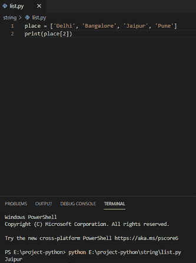

Python List Index out of range

这样，我们可以修复错误**列表索引超出 python** 的范围。

阅读 [Python 字典副本及示例](https://pythonguides.com/python-dictionary-copy/)

## 从列表 python 中删除一个元素

在 python 中，delete 用于从列表中删除特定的元素。它将从列表中删除指定的元素，并返回其余的元素。

**举例:**

```py
number = [10, 30, 50, 70, 90]
del number[2]
print(number)
```

写完上面的代码后，一旦打印出 `" number "` ，那么输出将显示为 **" [10，30，70，90] "** 。这里，**T5 将删除 `index 2` 元素，并返回剩余的元素。**

您可以参考下面的截图，从列表 python 中删除元素。

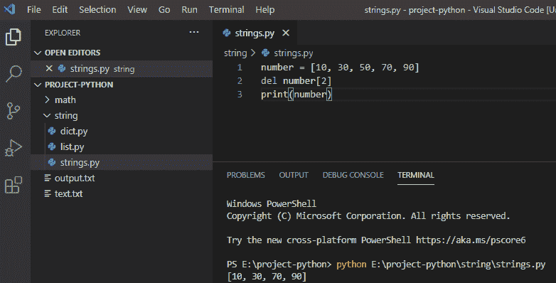

Delete an element from list python

这就是我们如何在 python 中从列表中删除一个元素。

阅读 [Python Tkinter 多窗口教程](https://pythonguides.com/python-tkinter-multiple-windows-tutorial/)

## Python 从列表中移除最后一个元素

在 python 中，为了从列表中移除最后一个元素，我们需要指定最后一个元素的索引，它将从列表中移除该元素。这里最后一个指标是**“-1”**。

**举例:**

```py
roll = [11, 22, 33, 44, 55]
my_list = roll[:-1]
print(my_list)
```

写完上面的代码后，一旦你打印出 `" my_list "` ，那么输出将显示为 **" [11，22，33，44] "** 。这里，它将从列表中删除最后一个元素，即**“55”**，并返回剩余的元素。

你可以参考下面的截图来**从 python** 的列表中删除最后一个元素。

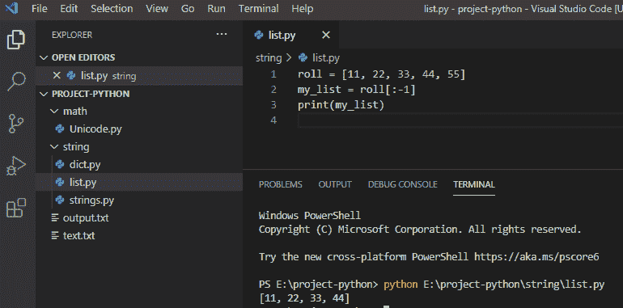

Python remove last element from the list

这就是我们如何在 python 中从列表中移除最后一个元素。

读取 [Python 复制文件](https://pythonguides.com/python-copy-file/)

## 比较 python 中的两个列表

在 python 中，为了比较两个列表，我们需要比较两个列表元素，如果元素匹配，那么将该元素附加到新变量中。

**举例:**

```py
list1 = [22, 32, 45, 56, 60]
list2 = [60, 45, 55, 34, 22, 35]
list3 = []
for number in list1:
if number in list2:
if number not in list3:
list3.append(number)
print(list3)
```

写完上面的代码后，一旦你打印出 `" list3 "` ，那么输出将显示为 **" [22，45，60] "** 。这里，我们有两个列表，它将比较列表，如果元素匹配，那么它将被追加到**“列表 3”**。

可以参考下面的截图来**对比 python** 中的两个列表。

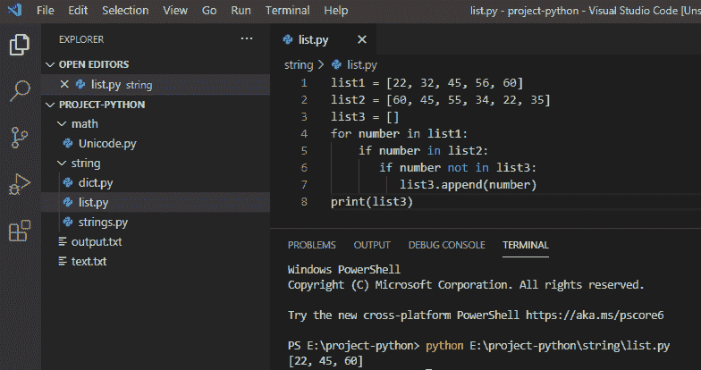

Compare two lists in python

这就是我们如何在 python 中比较两个列表的方法。

读取 [Python 文件方法](https://pythonguides.com/python-file-methods/)

## 从列表 python 中删除第一个元素

在 python 中，remove()方法用于从列表中移除匹配的元素。它将在列表中搜索给定的第一个元素，如果给定的元素匹配，那么它将被删除。

**举例:**

```py
my_list = [30, 15, 45, 93, 38]
my_list.remove(30)
print(my_list)
```

写完上面的代码后，你将打印出 `" my_list "` ，然后输出将显示为 **" [ 15，45，93，38] "** 。这里， `remove()` 方法将删除列表中的第一个元素 `" 30 "` 。

可以参考下面的截图来**从列表 python** 中移除第一个元素。

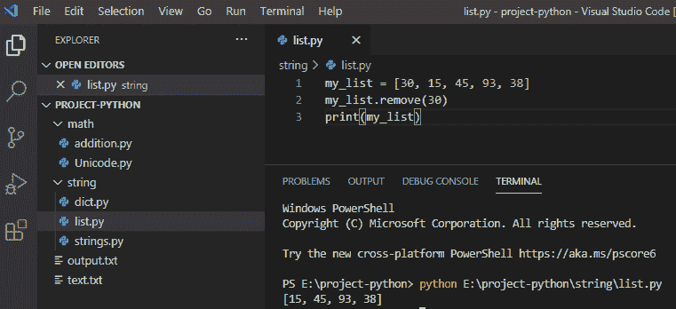

Remove the first element from list python

这就是我们如何从 list python 中移除第一个元素。

阅读[检查一个数是否是素数 Python](https://pythonguides.com/check-if-a-number-is-a-prime-python/)

## 替换列表 python 中的项目

在 python 中，要替换列表中的项目，我们必须提到索引号和替换它的值，它将给出替换项目的列表。

**举例:**

```py
my_list = [20, 34, 39, 'Apple', 'Mango', 'Orange']
my_list[1] = 55
print(my_list)
```

写完上面的代码后，你将打印出 `" my_list "` 然后输出将显示为**【20，55，39，'苹果'，'芒果'，'桔子'] "** 。这里，**索引 1** 值将被替换为 `55` ，结果将是一个列表。

你可以参考下面的截图来替换列表 python 中的项目。

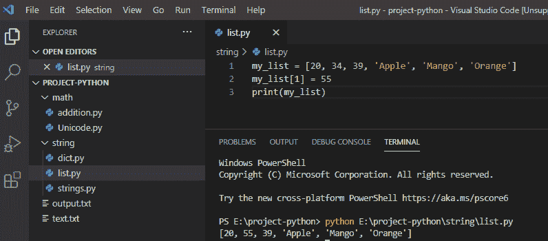

Replace item in list python

这就是我们如何**替换列表 python 中的项目。**

阅读[集合的联合 Python +示例](https://pythonguides.com/union-of-sets-python/)

## Python 获取列表中的最后一个元素

在 python 中，为了从列表中获得最后一个元素，我们可以使用负索引，因为我们希望从列表中获得最后一个元素，所以计数将通过使用 **-1 作为` `索引**从末尾开始。

**举例:**

```py
my_list = [10,22,30,43,55]
last_item = my_list[-1]
print('Last Element: ', last_item)
```

写完上面的代码后，你将打印出 `" last_item "` ，然后输出将显示为 `" 55 "` 。这里，您将获得最后一个元素，即 **55、**和 `-1` 是从最后一个开始的索引。

你可以参考下面的截图 python 获取列表中的最后一个元素。

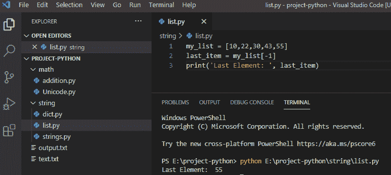

Python get last element in the list

这就是我们如何**获得列表 python 中的最后一个元素。**

## Python 组合了两个列表

在 python 中，要合并 python 中的两个列表，我们可以简单地使用 `" + "` 运算符来合并两个列表。

**举例:**

```py
my_list1 = [2, 4, 5]
my_list2 = [7, 8, 9, 10]
combine = my_list1 + my_list2
print(combine)
```

写完上面的代码后，一旦你打印出 `" combine "` ，那么输出将显示为 **" [2，4，5，7，8，9，10] "** 。这里，通过使用 `" + "` 操作符，两个列表元素被合并，结果将是一个包含所有元素的列表。

可以参考下面截图 **python 合并了两个列表**。

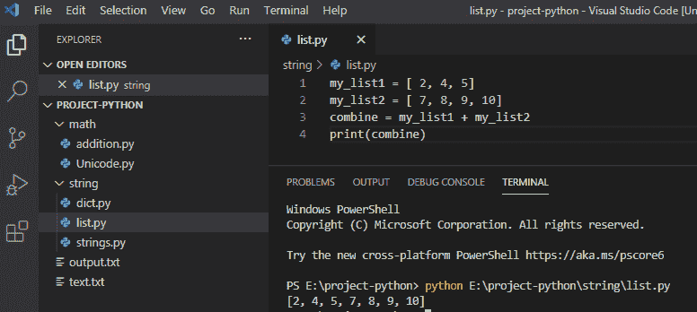

Python combines two lists

这就是我们如何在 python 中组合两个列表。

阅读[如何用 Python 将字符串转换成日期时间](https://pythonguides.com/convert-a-string-to-datetime-in-python/)

## python 中一个列表的总和

在 python 中，我们有 `sum()` 方法来添加列表中的所有元素。

**举例:**

```py
my_list1 = [ 2, 4, 5, 7, 8, 9, 10]
my_list2 = sum(my_list1)
print(my_list2)
```

写完上面的代码后，一旦你打印出 `" my_list2 "` ，那么输出将显示为 `" 45 "` 。这里，通过使用 `sum()` 方法，列表中出现的元素将被相加，并给出结果的总和。

你可以参考下面 python 中一个列表的截图 sum。

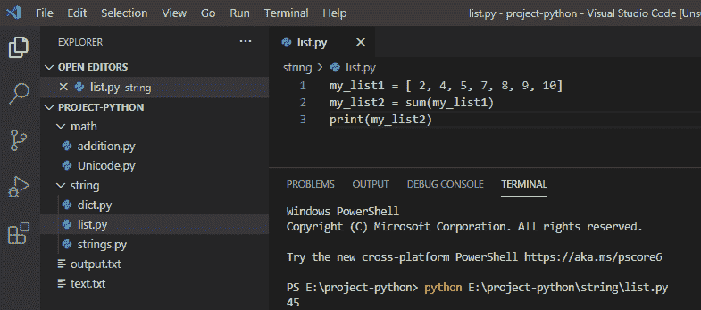

Sum of a list in python

这就是我们如何在 python 中做列表求和的方法

读取 Python 中的[转义序列](https://pythonguides.com/escape-sequence-in-python/)

## python 中的 Max()函数

在 python 中，我们有一个名为 max()的内置函数，它将返回列表中具有最高值的项。

**举例:**

```py
my_list = [ 2, 4, 52, 7, 88, 99, 10]
value = max(my_list)
print(value)
```

写完上面的代码后，你将打印出**【值】**，然后输出将显示为**【99】**。这里，通过使用 `max()` 函数，它将返回列表中最大的元素。

可以参考 python 中的截图 **max()函数。**

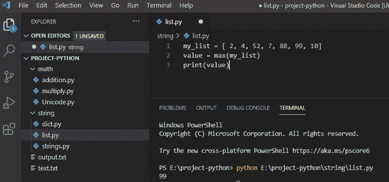

Max() function in python

这就是我们如何在 python 中执行 **Max()函数。**

## python 中的 Min()函数

在 python 中，我们有一个名为 min()函数的内置函数，它将返回列表中具有最小值的项。

**举例:**

```py
my_list = [ 2, 4, 52, 7, 88, 99, 10]
value = min(my_list)
print(value)
```

写完上面的代码后，一旦打印出 `" value "` ，那么输出将显示为 `" 2 "` 。这里，通过使用 `min()` 函数，它将返回列表中的最小元素。

可以参考 python 中的截图 **min()函数。**

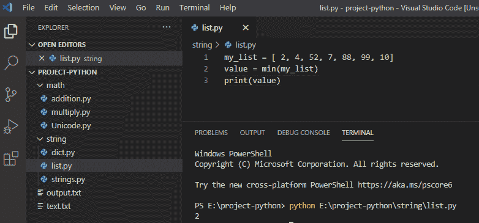

Min() function in python

这就是我们如何在 python 中实现 **Min()函数。**

阅读 [Python 列表理解λ](https://pythonguides.com/python-list-comprehension/)

## 统计列表 python 中一个字符的出现次数

在 python 中，为了计算一个字符的出现次数，我们可以使用 list.count()来计算列表中指定值的多次出现次数。

**举例:**

```py
my_list = ['u', 'v', 'u', 'x', 'z']
value = my_list.count('u')
print('Occurrences of character is: ',value)
```

写完上面的代码后，一旦打印出 `" value "` ，那么输出将显示为 `" 2 "` 。这里，通过使用 **my_list.count('u')** 我们将从列表中获得值' u '的出现次数。

你可以参考下面列表 python 中某个角色出现次数的截图。

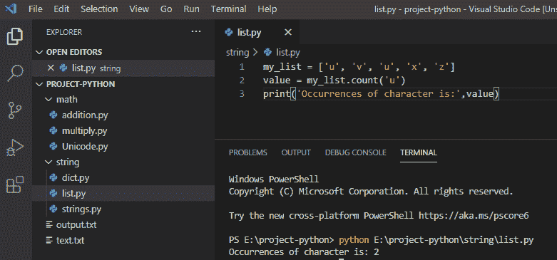

Count occurrences of a character in list python

这就是我们如何**计算一个字符在 list python** 中的出现次数

## 检查列表 python 中是否存在元素

在 python 中，为了检查元素是否存在于列表 python 中，我们可以在"操作中使用**"来检查元素是否存在于列表中，如果元素存在，则条件为真，否则为假。**

**举例:**

```py
my_list = ['Tom', 'Jack', 'Harry', 'Edyona']
if 'Jack' in my_list:
print("Yes, 'Jack' is present in list")
```

写完上面的代码后，你将打印出，然后输出将显示为**“是的，‘杰克’出现在列表中”**。这里，通过使用带有 if 条件的运算符中的**，我们可以找到列表中是否存在的元素。**

您可以参考下面的截图来检查元素是否存在于列表 python 中。

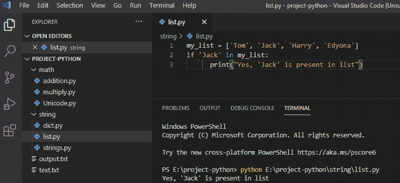

Check if element exists in list python

这就是我们如何**检查元素是否存在于列表 python** 中

阅读 [Python 线程和多线程](https://pythonguides.com/python-threading-and-multithreading/)

## 从列表中删除元素 python

在 python 中，要从列表中移除元素，我们可以使用带参数的 `remove()` 方法从列表中移除指定的元素。

**举例:**

```py
my_list = ['Tom', 'Jack', 'Harry', 'Edyona']
my_list.remove('Jack')
print('Updated list: ', my_list)
```

写完上面的代码后，一旦你打印出 `" my_list "` ，那么输出将显示为 **" ['Tom '，' Harry '，' Edyona'] "** 。这里， `remove()` 方法将从列表中删除**“杰克”**。

可以参考下面的截图来**从列表 python** 中移除元素。

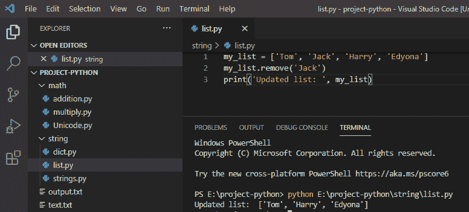

Remove elements from list python

这就是我们如何从列表 python 中移除 lemon 的方法

## Python 列表中大写首字母

在 python 中，对于列表中的大写首字母，我们将使用`capital()`方法，该方法将只大写列表中给定单词的首字母。

**举例:**

```py
my_list = ['fivestar', 'gems', 'kitkat']
capital = my_list[0].capitalize()
print(capital)
```

写完上面的代码后，你将打印出**【大写】**，然后输出将显示为**【五星】**。这里，`capital()`方法会将第一个字母**“five star”**大写，因为索引是“[0]”。可以参考下面截图 python 大写首字母列表。

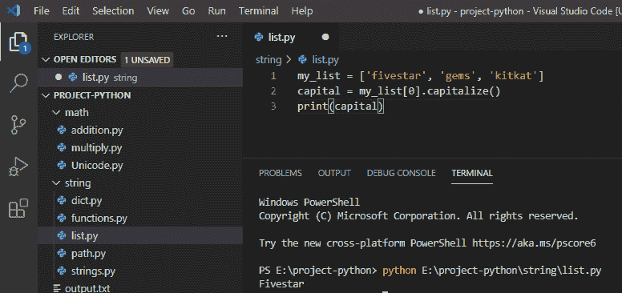

Python uppercase first letter in a list

这就是我们如何做 **python 大写列表中的第一个字母**

阅读[使用蟒蛇龟绘制彩色填充形状](https://pythonguides.com/draw-colored-filled-shapes-using-python-turtle/)

## Python 列表中的唯一值

在 python 中，为了获得列表中的唯一值，我们可以使用 `set()` 方法，它被转换为带有一个副本的 set，然后我们必须将其转换回 list。

**举例:**

```py
my_list1 = [50, 30, 20, 60, 30, 50]
my_set = set(my_list1)
my_list2 = list(my_set)
print("Unique number is: ",my_list2)
```

写完上面的代码(python 列表中唯一的值)，你将打印出 `" my_list2 "` ，然后输出将显示为 **" [50，20，30，60] "** 。在这里，set()方法将删除其中存在的重复元素，我们必须再次将其转换为 list。

您可以参考下面列表中 python 唯一值的截图。

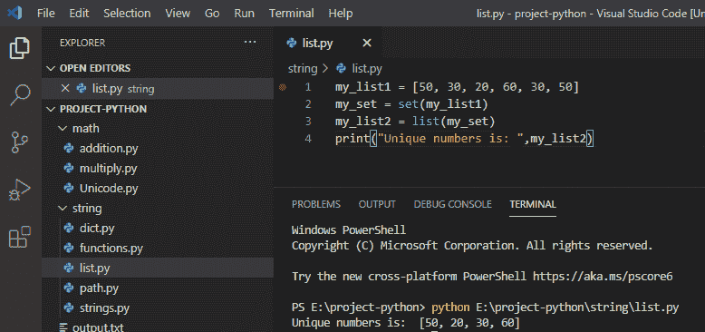

Python unique values in the list

这就是我们如何在列表中处理 **python 唯一值。**

## Python 按字母顺序排序列表

在 python 中，为了按字母顺序对列表进行排序，我们将使用 `sorted()` 函数，以便按照字母的位置对条目进行排序。大写字母在小写字母之前。

**举例:**

```py
my_list = ['ahana', 'Aarushi', 'Vivek', 'john']
to_sort = sorted(my_list)
print(to_sort)
```

在编写了上面的代码(python 按字母顺序排序列表)之后，您将打印“to_sort”，然后输出将显示为“' Aarushi '，' Vivek '，' ahana '，' john']”。在这里，sorted()函数将按字母顺序对项目进行排序，这就是输出列表中大写字母在小写字母之前的原因。

关于 **python 按字母顺序排序的列表**，可以参考下面的截图。

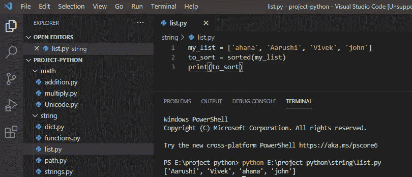

Python sort list alphabetically

这就是我们如何做 **python 按字母顺序排序列表**

读取 [Python 读取二进制文件(示例)](https://pythonguides.com/python-read-a-binary-file/)

## 写列表到文件 python

在 python 中，我们可以通过将列表的内容打印到文件来将列表写入文件，列表项将被添加到输出文件的新行中。打印命令将元素写入打开的文件。

**举例:**

```py
My_list1 = ['welcome', 'to', 'python']
My_file = open('output.txt', 'w')
for value in My_list1:
print(My_file, value)
My_file.close()
```

写完上面的代码(写一个列表到文件 python)，你会打印出**(My _ file，value)**然后输出就会出现。这里，列表项被一行一行地写入输出文件，循环被用来迭代列表中的每个元素。

关于 **python 按字母顺序排序的列表**，可以参考下面的截图。

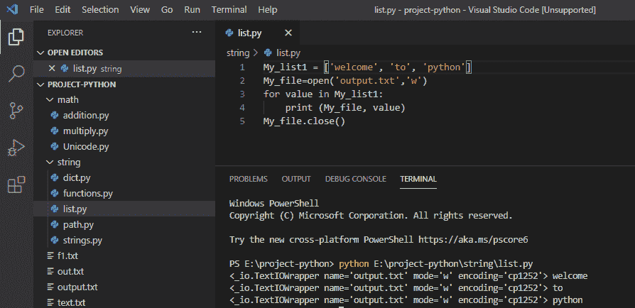

Write a list to file python

这就是我们如何**写一个列表到文件 python**

## 计数列表 python 中的元素

在 python 中，为了计算列表中的元素总数，我们可以使用 **len()函数**，因为它返回列表中的元素总数。

**举例:**

```py
My_list = [10, 11, 12, 13, 14, 15]
element = len(My_list)
print(element)
```

写完上面的代码后，你将打印出**"元素"**，然后输出将显示为 `" 6 "` 。这里，通过使用 `len()` 函数，我们将得到列表中元素的总数。你可以参考下面的截图来统计列表 python 中的元素。

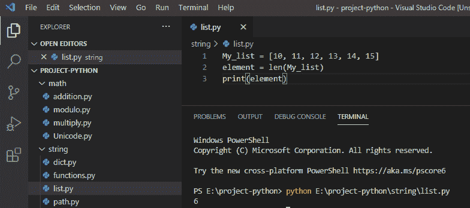

Python count elements in list

这就是我们如何在列表 python 中计数柠檬的方法

阅读 [Python 请求用户输入](https://pythonguides.com/python-ask-for-user-input/)

## Python 将文件读入列表

在 python 中，要将文件读入一个列表，我们将首先使用 `open()` 方法打开文件，该方法将文件路径作为一个参数，它将读取文件，分割线将去除所有字符，并给出列表。

**举例:**

```py
my_file = open("out.txt")
my_line = my_file.read().splitlines()
my_file.close()
print(my_line)
```

写完上面的代码(python 把文件读入一个列表)，你会打印出`(my _ line)`然后输出就会出现。在这里，它将读取文件并拆分行，然后返回包含文件行的列表。

关于 **python 将文件读入列表**，可以参考下面的截图。

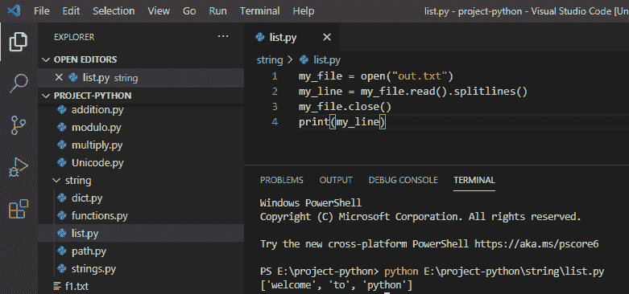

Python read file into a list

这就是我们如何在 python 中将文件读入列表

## Python 列表包含一个字符串

在 python 中，为了发现列表是否包含一个字符串，我们在中使用**操作符来检查列表是否包含给定的字符串。**

**举例:**

```py
my_list = ['S', 'W', 'I', 'F', 'T']
if 'F' in my_list:
print('F is present in the list')
else:
print('F is not in the list')
```

写完上面的代码(python 列表包含一个字符串)后，你将打印这些代码，然后输出将会出现。这里，操作符中的**将检查字符串是否在列表中。你可以参考下面的截图，因为 python 列表包含一个字符串。**

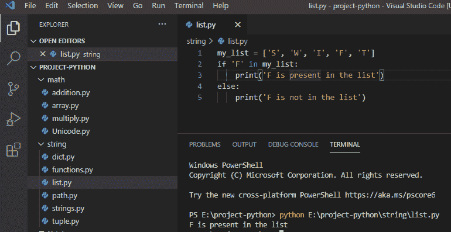

Python list contains a string

这就是我们如何找到包含字符串的 **python 列表**

阅读[如何将 Python 字符串转换成字节数组并举例](https://pythonguides.com/python-string-to-byte-array/)

## Python 将元素从一个列表复制到另一个列表

在 python 中，我们可以使用内置的 `copy()` 方法将元素从一个列表复制到另一个列表。

**举例:**

```py
first_list = []
second_list = [5, 8, 10, 18]
first_list = second_list.copy()
print(first_list)
```

写完上面的代码后(python 将元素从一个列表复制到另一个列表)，你将打印出 `" first_list"` ，然后输出将显示为 **" [5，8，10，18] "** 。这里，copy()方法用于复制元素，因为它从第二个列表引用到第一个列表。

你可以参考下面的截图，从一个列表到另一个列表的 **python 复制元素。**

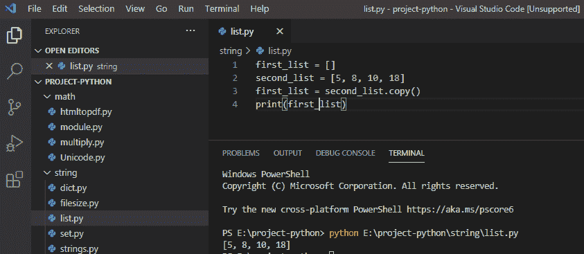

Copy elements from one list to another in Python

这就是我们如何在 python 中把元素从一个列表复制到另一个列表

阅读 [Python 通过引用或值传递示例](https://pythonguides.com/python-pass-by-reference-or-value/)

## Python 函数返回多个值

在 python 中，函数可以返回多个值，并且所有值都存储在变量中，一个函数可以返回两个或多个值。

**举例:**

```py
def function():
str = "Python Guides"
i = 13098
return [str, i];
my_list = function()
print(my_list)
```

写完上面的代码(python 函数返回多个值)，你会打印出`(my _ list)`然后输出会显示为 **"['Python Guides '，13098]"** 。这里，函数将返回多个值。

你可以参考下面的 python 函数返回多个值的截图。

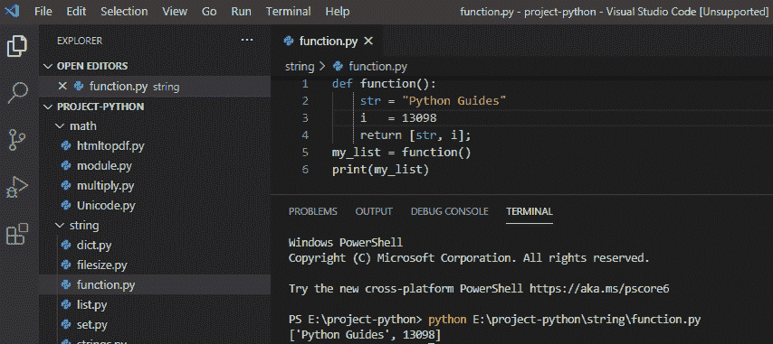

这就是 **python 函数如何返回多个值**

## Python 在一个列表中找到所有事件的索引

在 python 中，为了找到列表中所有元素的索引，我们将使用 for-loop 迭代列表中的每个元素，并将其索引追加到空列表中。

**举例:**

```py
my_list = [11, 12, 13, 11]
index = []
for x in range(len(my_list)):
if my_list[x] == 11:
index.append(x)
print(index)
```

写完上面的代码(python 在一个列表中找到所有事件的索引)，你将打印出 `"index"` ，然后输出将显示为 **"[0，3]"** 。这里，循环将进行迭代，所需元素的所有出现都将其索引追加到一个空列表中。

你可以参考下面的 python 截图来查找列表中所有事件的索引。

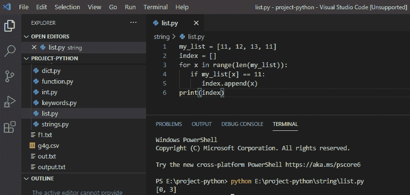

Python find an index of all occurrences in a list

这就是我们如何在 list python 中找到所有事件的索引。

读取 [Python pip 不被识别为内部或外部命令](https://pythonguides.com/python-pip-is-not-recognized/)

## Python 从列表中移除多个项目

在 python 中，为了从列表中删除多个条目，我们将使用 `for-loop` 遍历列表，并使用 `list.append(object)` 在空列表中添加对象。

**举例:**

```py
my_list = [12, 13, 14, 15]
remove_element = [13, 15]
new_list = []
for element in my_list:
if element not in remove_element:
new_list.append(element)
print(new_list)
```

写完上面的代码(python 从列表中删除多个条目)，你将打印出 `"new_list"` ，然后输出将显示为 **"[12，14]"** 。这里，for 循环将遍历列表，并从新列表中删除[13，14]。

您可以参考下面的 **python 截图，从列表**中删除多个项目。

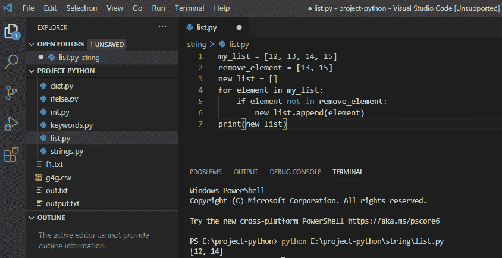

Python remove multiple items from the list

读取 [Python 从列表中选择](https://pythonguides.com/python-select-from-a-list/)

## 合并两个列表 python

在 python 中，为了合并两个列表，我们将使用 `extend()` 方法，在 python 中将一个列表合并到另一个列表。

**举例:**

```py
my_list1 = [12, 13, 14, 15]
my_list2 = ["x", "y", "z"]
my_list1.extend(my_list2)
print(my_list1)
```

写完上面的代码(python 合并两个列表 python)，你会打印出 `"my_list1"` 然后输出会显示为**"【12，13，14，15，' x '，' y '，' z']"** 。这里，extend()方法将合并两个列表。

可以参考下面的截图 python 合并两个列表。

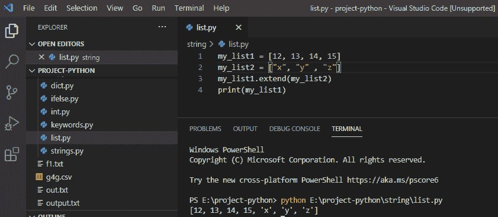

Merge two lists python

## Python 列表追加到前面

在 python 中，为了将元素添加到列表的字体中，我们将使用带有 `"0"` 的 `list.insert()` 作为索引，并将指定的对象插入到列表的前面。

**举例:**

```py
my_list = ['y', 'z']
my_list.insert(0, 'x')
print(my_list)
```

写完上面的代码(python list 追加到前面)，你将打印出 `"my_list"` ，然后输出将显示为 **"['x '，' y '，' z']"** 。这里，list.insert()会将指定的元素追加到列表的前面。

可以参考截图 **python 列表追加到前面**。

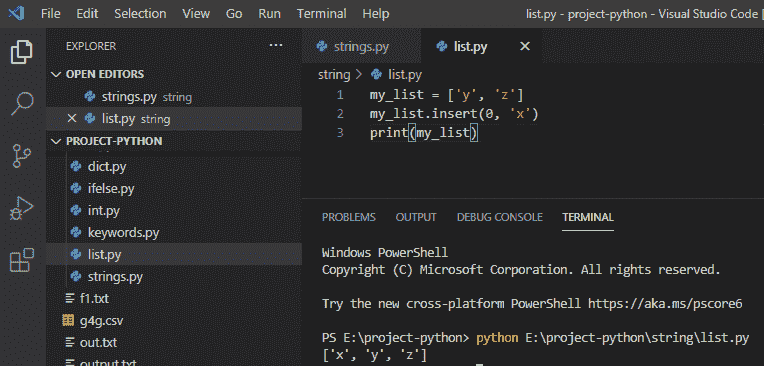

Python list append to front

读取[检查一个列表是否存在于另一个列表 Python 中](https://pythonguides.com/check-if-a-list-exists-in-another-list-python/)

## 在 python 中展平列表列表

**展平列表列表**将所有子列表合并成一个列表。列表理解是将要使用的方法之一。

**举例:**

```py
my_list = [[1,2], [3], [4,5,6]]
new_list = [item for items in my_list for item in items]
print(new_list)
```

写完上面的代码(在 python 中展平一个列表列表)，你将打印出 `"new_list"` ，然后输出将显示为 **"[1，2，3，4，5，6]"** 。在这里，list comprehension 遍历每个列表，每个值都被添加到打印的主列表中。

你可以参考下面的截图，在 python 中扁平化一个列表列表。

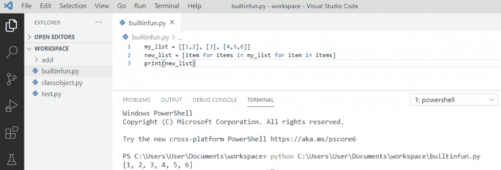

读取 [Python 将元组转换为列表](https://pythonguides.com/python-convert-tuple-to-list/)

## 链表 python 的含义

列表的**均值**可以通过使用列表的 `sum()` 和 `len()` 函数来计算。 `sum()` 将返回列表中的所有值，这些值将除以 `len()` 返回的元素数。

**举例:**

```py
def Avg(list):
return sum(list)/len(list)
list = [5, 10, 15, 20]
a = Avg(list)
print("Average of the list =",round(a,2))
```

写完上面的代码(python 中列表的意思)后，一旦打印，输出将显示为“列表的平均值= 12.5”。这里，列表的值将被相加，然后除以总数。

关于 python 中列表的**含义，可以参考下面的截图。**

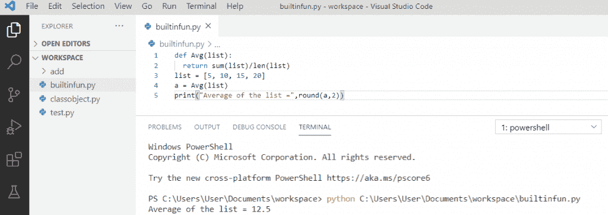

Mean of a list python

读取 [Python 写列表到 CSV](https://pythonguides.com/python-write-a-list-to-csv/)

## Python 保存列表到文件

在 python 中，为了将列表保存到文件中，我们将使用**写方法**和**循环**来迭代列表。

**举例:**

```py
fruits = ['Apple', 'Avocado', 'Banana', 'Blueberries']
with open('lfile.txt', 'w') as filehandle:
    for items in fruits:
        filehandle.write('%s\n' % items)
```

在编写完上面的代码(python 保存列表到文件)之后，我们必须打开保存列表项的文件。这里，使用了 `"w"` write 方法和循环来迭代条目。运行程序后，**“lfile . txt”**将包含列表项目。

你可以参考下面的 python 保存列表到文件的截图

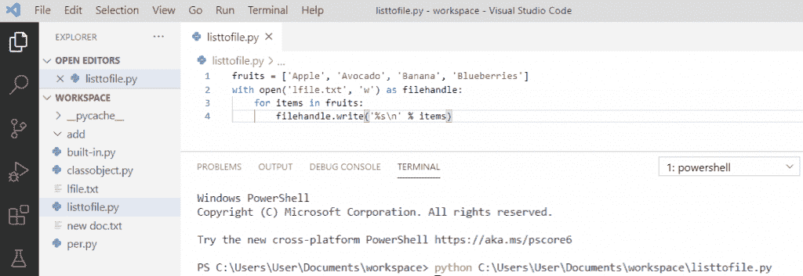

Python save list to file

**输出:**

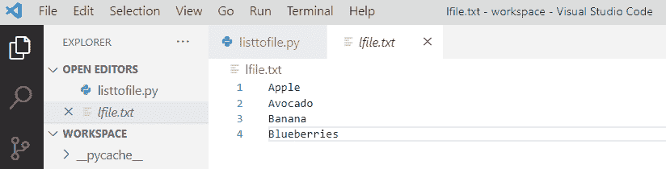

Python save list to file

阅读[如何将 Python 数组写入 CSV](https://pythonguides.com/python-write-array-to-csv/)

## python 中的扩展 vs 追加

| `Extend()` | `Append()` |
| 它遍历它的参数，将每个元素添加到列表中会扩展列表。 | 将其参数作为单个元素添加到列表末尾。 |
| 列表的长度随着元素数量的增加而增加。 | 列表的长度增加一。 |
| 语法:n_list.extend(iterable) | 语法:n_list.append(object) |

## Python 前置到列表

在 Python 中，在列表的开头添加值称为 prepend。我们可以在所选列表的开头添加值。

**举例:**

```py
a = 10
my_list = [6, 8, 9]
p = [a] + my_list
print(p)
```

写完上面的代码(python 前置到 list)，你将打印出 `" p "` ，然后输出将显示为 **" [10，6，8，9] "** 。这里，值“10”被添加到列表的开头。你可以参考下面的 python 前置列表截图。

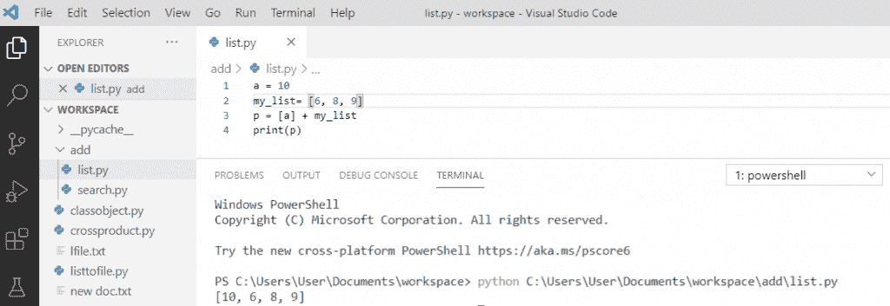

Python prepend to list

阅读 [Python Tkinter Canvas 教程](https://pythonguides.com/python-tkinter-canvas/)

## Zip 二列表 python

我们将使用 `zip()` 来压缩列表。然后我们将使用 `list()` 将 zip 对象转换为包含原始列表中压缩对的列表。

**举例:**

```py
l1 = [5, 2, 4]
l2 = [1, 3, 2]
zip_x = zip(l1, l2)
zip_lst = list(zip_x)
print(zip_lst)
```

写完上面的代码(zip two lists python)之后，一旦你将打印 `" zip_lst "` 那么输出会出现为 **" [(5，1)，(2，3)，(4，2)] "** 。这里，我们将第一个列表中的两个列表元素对与第二个列表中的元素进行压缩。

可以参考下面截图 zip 二列表 python

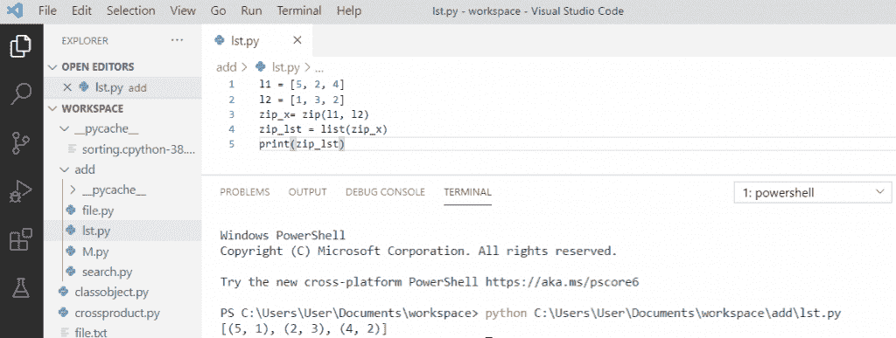

Zip two lists python

您可能会喜欢以下 Python 教程:

*   [如何在 python 中使用正则表达式拆分字符串](https://pythonguides.com/python-split-string-regex/)
*   [如何在 Python 中创建字符串](https://pythonguides.com/create-a-string-in-python/)
*   [如何在 python 中创建变量](https://pythonguides.com/create-python-variable/)
*   [Python 将列表转换成字符串](https://pythonguides.com/python-convert-list-to-string/)
*   [Python 方块一号](https://pythonguides.com/python-square-a-number/)
*   [什么是 Python 字典+用 Python 创建字典](https://pythonguides.com/create-a-dictionary-in-python/)
*   [无换行符的 Python 打印](https://pythonguides.com/python-print-without-newline/)
*   [Python 访问修饰符+示例](https://pythonguides.com/python-access-modifiers/)
*   [面向对象编程 python](https://pythonguides.com/object-oriented-programming-python/)
*   [Python 匿名函数](https://pythonguides.com/python-anonymous-function/)

在本教程中，我们学习了如何在 Python 中**检查列表是否为空。**

*   检查 Python 中的列表是否为空
*   获取 Python 中列表的大小
*   Python 从一个列表中返回多个值
*   从列表 Python 中移除重复项
*   遍历列表 python
*   使用 python 中的 range()方法遍历列表
*   列表索引超出范围 python
*   从列表 python 中删除元素
*   Python 从列表中移除最后一个元素
*   比较 python 中的两个列表
*   从列表 python 中移除第一个元素
*   替换列表 python 中的项目
*   Python 获取列表中的最后一个元素
*   python 结合了两个列表
*   python 中列表的总和
*   python 中的 Max()函数
*   python 中的 Min()函数
*   统计列表 python 中某个字符的出现次数
*   检查列表 python 中是否存在元素
*   从列表 python 中移除元素
*   Python 列表中的首字母大写
*   列表中的 Python 唯一值
*   Python 按字母顺序排序列表
*   将列表写入文件 python
*   列表 python 中的计数元素
*   Python 将文件读入列表
*   Python 列表包含一个字符串
*   Python 将元素从一个列表复制到另一个列表
*   Python 函数返回多个值
*   Python 在一个列表中找到所有出现的索引
*   Python 从列表中移除多个项目
*   合并两个列表 python
*   Python 列表追加到前面
*   在 python 中展平列表列表
*   列表 python 的含义
*   Python 将列表保存到文件
*   python 中的扩展与追加
*   Python 前置到列表
*   压缩两个列表 python

[Bijay Kumar](https://pythonguides.com/author/fewlines4biju/)

Python 是美国最流行的语言之一。我从事 Python 工作已经有很长时间了，我在与 Tkinter、Pandas、NumPy、Turtle、Django、Matplotlib、Tensorflow、Scipy、Scikit-Learn 等各种库合作方面拥有专业知识。我有与美国、加拿大、英国、澳大利亚、新西兰等国家的各种客户合作的经验。查看我的个人资料。

[enjoysharepoint.com/](https://enjoysharepoint.com/)[](https://www.facebook.com/fewlines4biju "Facebook")[](https://www.linkedin.com/in/fewlines4biju/ "Linkedin")[](https://twitter.com/fewlines4biju "Twitter")