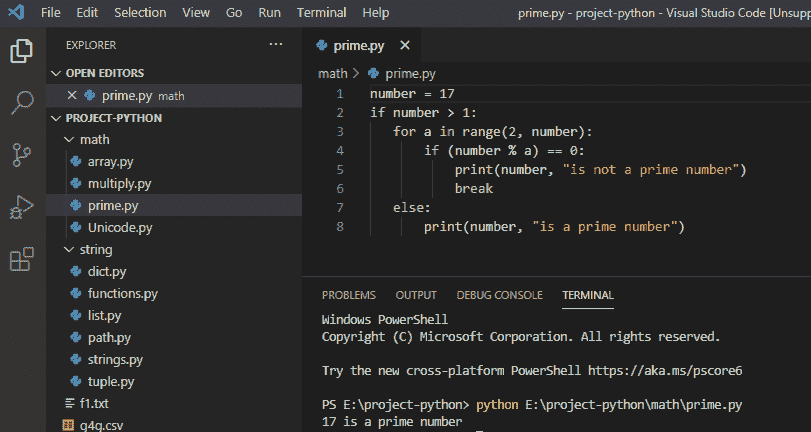
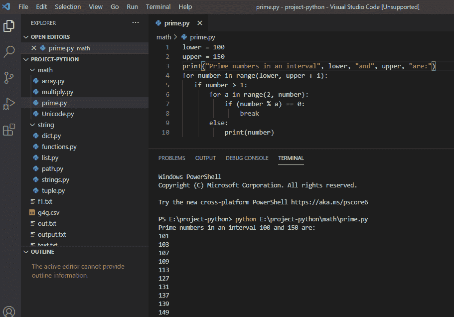

# 检查一个数是否是素数 Python

> 原文：<https://pythonguides.com/check-if-a-number-is-a-prime-python/>

[](https://sharepointsky.teachable.com/p/python-and-machine-learning-training-course)

在这个 [Python 教程](https://pythonguides.com/python-programming-for-the-absolute-beginner/)中，我们将**在 python** 中检查一个数是否是质数，并且我们还将在区间 Python 中打印所有质数。

目录

[](#)

*   [检查一个数是否是素数 python](#Check_if_a_number_is_a_prime_python "Check if a number is a prime python")
*   [打印一个区间 python 中的所有素数](#Print_all_prime_numbers_in_an_interval_python "Print all prime numbers in an interval python")

## 检查一个数是否是素数 python

现在，让我们看看如何在 Python 中**检查一个数是否是质数。质数是能被 1 和它本身整除的整数。**

**举例:**

```py
number = 17
if number > 1:
for a in range(2, number):
if (number % a)==0:
print(number, "is not a prime number")
break
else:
print(number, "is a prime number")
```

写完上面的代码后(检查一个数字是否是质数)，你将打印出**“数字**”，然后输出将显示为**“17 是质数**”。这里，range()将从 2 搜索到编号 `-1` 。

可以参考下面的截图来**检查一个数字是否是素数 python** 。



Check if a number is a prime python

这就是我们如何**检查一个数是否是素数 python**

## 打印一个区间 python 中的所有素数

在 python 中，为了**打印区间**中的所有素数，我们使用范围并显示该区间中的所有素数。

**举例:**

```py
lower = 100
upper = 150
print("print number in an interval", lower, "and", upper, "are:")
for number in range(lower, upper + 1):
if number > 1:
for a in range(2,number):
if (number % a) == 0:
break
else:
print(number) 
```

写完上面的代码(在一个区间 python 中打印所有的质数)，你会打印出 `"number` "然后输出会显示为`" 101 103 107 109 113 127 131 137 139 149 "`。

这里，范围()将从 100 开始，一直检查到 150，并打印它们之间的所有质数。

可以参考下面的截图，用区间 python 打印所有素数。



这就是我们如何**在一个区间 python** 中打印所有素数。

您可能会喜欢以下 Python 教程:

*   [Python pip 不被识别为内部或外部命令](https://pythonguides.com/python-pip-is-not-recognized/)
*   [Python 将元组转换为列表](https://pythonguides.com/python-convert-tuple-to-list/)
*   [python 中的百分号是什么意思](https://pythonguides.com/percent-sign-mean-in-python/)
*   [Python 内置函数示例](https://pythonguides.com/python-built-in-functions/)
*   [获取当前目录 Python](https://pythonguides.com/get-current-directory-python/)
*   [语法错误返回外部函数 python](https://pythonguides.com/syntaxerror-return-outside-function-python/)
*   [从字符串 Python 中删除字符](https://pythonguides.com/remove-character-from-string-python/)
*   [Python if else with examples](https://pythonguides.com/python-if-else/)
*   [Python 类型错误:“列表”对象不可调用](https://pythonguides.com/python-typeerror-list-object-is-not-callable/)
*   [Python 数组与示例](https://pythonguides.com/python-array/)
*   Python 中的[函数](https://pythonguides.com/function-in-python/)
*   [Python 退出命令](https://pythonguides.com/python-exit-command/)

在本教程中，我们讨论了在 python 中**检查一个数是否是质数，我们也看到了如何在 python** 中**打印所有的质数。**

[Bijay Kumar](https://pythonguides.com/author/fewlines4biju/)

Python 是美国最流行的语言之一。我从事 Python 工作已经有很长时间了，我在与 Tkinter、Pandas、NumPy、Turtle、Django、Matplotlib、Tensorflow、Scipy、Scikit-Learn 等各种库合作方面拥有专业知识。我有与美国、加拿大、英国、澳大利亚、新西兰等国家的各种客户合作的经验。查看我的个人资料。

[enjoysharepoint.com/](https://enjoysharepoint.com/)[](https://www.facebook.com/fewlines4biju "Facebook")[](https://www.linkedin.com/in/fewlines4biju/ "Linkedin")[](https://twitter.com/fewlines4biju "Twitter")