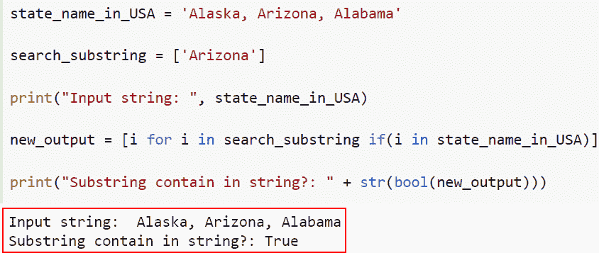

# 如何在 Python 中检查一个字符串是否包含子串

> 原文：<https://pythonguides.com/check-if-a-string-contains-a-substring-in-python/>

[](https://sharepointsky.teachable.com/p/python-and-machine-learning-training-course)

在本 [Python 教程](https://pythonguides.com/python-programming-for-the-absolute-beginner/)中，我们将讨论几种在 Python 中如何检查字符串是否包含子串的方法。此外，我们将查看各种示例，在 Python 中检查字符串是否包含子串。

最近，我在做一个机器学习项目，我发现它需要一些子字符串元素，并检查它是否在字符串中可用。所以，我做了一些研究，发现我们必须在 Python 中检查一个字符串是否包含子串。

在这里，我们将学习:

*   如何在 Python 中使用 in 运算符检查一个字符串是否包含子串？
*   使用 find()在 Python 中检查一个字符串是否包含子串
*   如何在 Python 中使用 count()检查一个字符串是否包含子串
*   使用索引方法在 Python 中检查字符串是否包含子串
*   如何使用正则表达式在 Python 中检查一个字符串是否包含子串
*   使用 operator.contains()在 python 中检查字符串是否包含子字符串
*   如何使用列表理解在 python 中检查一个字符串是否包含子串
*   如何在 python 中使用 split()检查一个字符串是否包含子串

目录

[](#)

*   [Python 检查一个字符串是否包含子字符串](#Python_checks_if_a_string_contains_sub-string "Python checks if a string contains sub-string")
    *   [如何在 Python 中使用 in 运算符](#How_to_Check_if_a_String_contains_a_Substring_in_Python_using_IN_operator "How to Check if a String contains a Substring in Python using IN operator")检查一个字符串是否包含子串
    *   [如何在 Python 中使用 find()](#How_to_Check_if_a_String_contains_a_Substring_in_Python_using_find "How to Check if a String contains a Substring in Python using find()") 检查字符串是否包含子串
    *   [如何在 Python 中使用 count()](#How_to_Check_if_a_String_contains_a_Substring_in_Python_using_count "How to Check if a String contains a Substring in Python using count()") 检查字符串是否包含子串
    *   [如何使用索引方法在 Python 中检查一个字符串是否包含子串](#How_to_Check_if_a_String_contains_a_Substring_in_Python_using_index_method "How to Check if a String contains a Substring in Python using index method")
    *   [如何在 Python 中使用正则表达式检查字符串是否包含子串](#How_to_Check_if_a_String_contains_a_Substring_in_Python_using_regular_expression "How to Check if a String contains a Substring in Python using regular expression")
    *   [如何在 python 中使用 operator.contains()](#How_to_check_if_a_string_contains_a_substring_in_python_using_operatorcontains "How to check if a string contains a substring in python using operator.contains()") 检查字符串是否包含子串
    *   [如何使用列表理解在 python 中检查一个字符串是否包含子串](#How_to_check_if_a_string_contains_a_substring_in_python_using_list_comprehension "How to check if a string contains a substring in python using list comprehension")
    *   [如何在 python 中使用 split()](#How_to_check_if_a_string_contains_a_substring_in_python_using_split "How to check if a string contains a substring in python using split()") 检查字符串是否包含子串

## Python 检查一个字符串是否包含子字符串

在字符串中，子字符串是一组字符。在 Python 中，检查字符串是否包含子字符串时，主要有八种常用的方法，理解这些方法非常重要。

### 如何在 Python 中使用 in 运算符检查一个字符串是否包含子串

*   在本节中，我们将讨论如何在 Python 中使用操作符中的**来检查一个字符串是否包含子串。**
*   Python 支持字符串的操作符中的**。因此，我们可以用它来确定一个字符串是否是另一个字符串的一部分。**
*   如果子字符串包含 in 字符串，此方法将返回 true，否则将返回 false。

**语法:**

让我们看看语法，理解 Python 中操作符中**的工作原理。**

```py
sub in str
```

**举例:**

这里我们将举一个例子，以及如何在 Python 中使用运算符中的**来检查一个字符串是否包含子串。**

**源代码:**

```py
Country_name=" 'U.S.A', 'Germany' ,'Australia' "
sub_string="U.S.A"
# Using in operator
result= sub_string in Country_name
# Display the Content
print("Check substring is availabe or not :", result)
```

在下面的代码中，我们首先创建了一个名为 Country_name 的字符串。接下来，我们定义了一个变量“sub_string ”,然后使用“in”操作符来检查子字符串是否存在于给定的字典中。

下面是以下给定代码的实现。


How to Check if a String contains a Substring in Python using in operator

这就是如何在 Python 中使用 运算符中的 ***来检查一个字符串是否包含子串。***

阅读: [Python 命名约定](https://pythonguides.com/python-naming-conventions/)

### 如何在 Python 中使用 find() 检查字符串是否包含子串

*   现在让我们看看如何使用 find()在 Python 中检查一个字符串是否包含子串。
*   要确定一个字符串是否包含子字符串，可以使用其他方法，如 string.find()。字符串中子串的索引由 string.find(substring)返回。
*   如果子字符串存在于原始字符串中，string.find()函数将返回一个非负数。这可以用作检查字符串是否包含子字符串的条件。

**语法:**

下面是 Python 中 `string.find()` 函数的语法

```py
string.find(substring)
```

**注意:**这个函数只接受一个子串参数。

**举例:**

这里我们举个例子，用 find()在 Python 中检查字符串是否包含子串。

**源代码:**

```py
new_str = "U.S.A, Australia, Germany"
new_sub_str = 'Australia'
if new_str.find(new_sub_str) > -1:
    print('It contains substring.')
else :
    print('sub-String does not contain.')
```

在上面的代码中，我们首先定义了字符串并使用了 `str.find()` 函数，并设置了条件如果给定的子字符串小于-1 那么它将显示子字符串不包含在字符串中。

下面是以下给定代码的实现


How to Check if a string contains a Substring in Python using find

正如你在截图中看到的，我们已经讨论了如何使用 find()在 Python 中检查一个字符串是否包含子串。

阅读:[用 Python 询问用户输入](https://pythonguides.com/python-ask-for-user-input/)

### 如何在 Python 中使用 count() 检查字符串是否包含子串

*   在本节中，我们将讨论如何使用 count()在 Python 中检查一个字符串是否包含子串。
*   count()方法在字符串中搜索子字符串的实例。如果子串不在字符串中，它给出 0。
*   子串的长度将由方法的返回值来指示。这意味着如果子串不存在，过程将返回 0。

**语法:**

让我们看一下语法并理解 Python 中 count()函数的工作原理

```py
string.count(substring)
```

**注意:**这个函数只接受一个子串参数。

**举例:**

我们举个例子，用 count()检查一个字符串在 Python 中是否包含子串。

**源代码:**

```py
cars_name = 'BMW, Volkswagen, Ford-150'

if cars_name.count('Volkswagen'):
    print('String contains the substring')
else:
    print("String doesn't contain substring")
```

在下面的代码中，我们使用了 count()函数，并在这个函数中设置了子字符串。接下来，我们使用 if-else 条件并设置输入子串是否包含字符串。

你可以参考下面的截图


How to Check if a String contains a Substring in Python using count

在这个例子中，我们已经了解了如何使用 count 在 Python 中检查一个字符串是否包含子串。

阅读:[检查一个数是否是素数 Python](https://pythonguides.com/check-if-a-number-is-a-prime-python/)

### 如何使用索引方法在 Python 中检查一个字符串是否包含子串

*   在这一节中，我们将讨论如何使用索引在 Python 中检查一个字符串是否包含子串。
*   使用过程识别字符串中的子字符串。如果字符串中缺少子字符串，函数将生成 ValueError，而不是返回任何内容。

**语法:**

下面是 Python 中 index 方法的语法

```py
string.index(substring)
```

**注意:**这个函数只接受一个子串参数。

**举例:**

我们举个例子，用 count()检查一个字符串在 Python 中是否包含子串。

**源代码:**

```py
cities_in_USA = "NewYork,  Los Angeles, Chicago"
try :  
    result = cities_in_USA.index("Los Angeles") 
    print ("Los Angeles contains in the string.") 
except : 
    print ("Los Angeles does not contain in the string.") 
```

下面是以下代码的截图


How to Check if a String contains a Substring in Python using index method

正如你在截图中看到的，我们已经讨论了如何使用索引方法在 Python 中检查一个字符串是否包含子串。

阅读:[如何在 Python 中添加两个变量](https://pythonguides.com/add-two-variables-in-python/)

### 如何在 Python 中使用正则表达式检查字符串是否包含子串

*   现在让我们讨论一下如何在 Python 中使用正则表达式检查一个字符串是否包含子串。
*   正则表达式提供了一种更加通用的字符串模式匹配方法。
*   使用 `re.search()` 函数将找到正则表达式序列的第一个实例，然后返回它。将检查所提供字符串的所有行。
*   `re.search()` 方法将很容易匹配一个子串模式。

**举例:**

我们举个例子，用正则表达式在 Python 中检查一个字符串是否包含子串。

**源代码:**

```py
from re import search

Country_name = "U.S.A , Germany, Australia"
substring = "Australia"

if search(substring, Country_name):
    print (" Substring exist in string!")
else:
    print (" Substring does not exist in string!")
```

在上面的代码中，我们使用了“re”模块来应用 re.search()函数，并设置输入子字符串在字符串中是否可用的条件。

你可以参考下面的截图


How to Check if a String contains a Substring in Python using regular expression

这是如何使用正则表达式在 Python 中检查一个字符串是否包含子串。

阅读:[如何用 Python 制作矩阵](https://pythonguides.com/make-a-matrix-in-python/)

### 如何在 python 中使用 operator.contains() 检查字符串是否包含子串

*   在本节中，我们将讨论如何使用**操作符. contains()** 在 python 中检查一个字符串是否包含子串。
*   根据 string 对象是否包含特定的 string 对象，Python String 类中的 `contains` ()方法返回布尔值 True 或 False。

**语法:**

下面是 Python 中一个**运算符. contains()** 的语法。

```py
operator.contains(string,substring)
```

> **注意:**这个函数带两个参数 string 和 substring。

**举例:**

这里我们举个例子，用 python 中的`*operator . contains()*`检查一个字符串是否包含子串。

**源代码:**

```py
import operator 

new_str = "Python is a programming language"

if operator.contains(new_str, "programming"): 
    print ("programming exists in the string.") 
else : 
    print ("programming does not exist in the string.") 
```

在上面的代码中，我们使用了 operator.contains()函数，并将 string 和 substring 指定为参数。

下面是以下给定代码的执行。


How to check if a string contains a substring in python using operator.contains()

这是如何在 python 中使用 operator.contains()检查一个字符串是否包含子串。

阅读: [Python 程序求 n 个数之和](https://pythonguides.com/python-program-to-find-sum-of-n-numbers/)

### 如何使用列表理解在 python 中检查一个字符串是否包含子串

*   这里我们将讨论如何使用列表理解在 python 中检查一个字符串是否包含子串。
*   为了确定一个字符串是否包含列表中的子串，列表理解经常被用作一种解决方案。为了确定在这个实例中是否能找到匹配，我们搜索列表和字符串项，如果找到了，结果为真。

**举例:**

我们举个例子，用 list comprehension 检查一个字符串在 python 中是否包含子串。

**源代码:**

```py
state_name_in_USA = 'Alaska, Arizona, Alabama'

search_substring = ['Arizona']

print("Input string: ", state_name_in_USA)

new_output = [i for i in search_substring if(i in state_name_in_USA)]

print("Substring contain in string?: " + str(bool(new_output))) 
```

上面的代码显示了如何使用列表理解来确定文本是否包含列表元素。首先，字符串在美国的名称 state name 下初始化。

接下来，测试列表(称为搜索子串)也被初始化。在运行该函数之前，我们打印了初始字符串和列表。然后，我们使用 list comprehension 检查字符串是否包含列表元素，并报告结果。

下面是以下代码的截图



How to check if a string contains a substring in python using list comprehension.

阅读: [Python 程序求偶或奇](https://pythonguides.com/python-program-for-even-or-odd/)

### 如何在 python 中使用 split() 检查字符串是否包含子串

*   现在让我们了解一下在 python 中如何使用 split()检查一个字符串是否包含子串。
*   这个函数用于在给定的字符串被指定的分隔符分割后，将字符串分割成子字符串。
*   要确定一个子字符串是否包含在所提供的字符串中，首先，将给定的字符串分成单词，并将它们存储在一个名为 result 的变量中。

**举例:**

这里我们举个例子，用 split()在 python 中检查一个字符串是否包含子串。

**源代码:**

```py
Bikes_in_USA = 'Aprilia Kawasaki Ducati'
substring = "Kawasaki" 

result = Bikes_in_USA.split()
if substring in result:
	print("substring contain in string")
else:
	print("It does not contain in string")
```

在下面给出的代码中，我们首先使用了 split()函数，它会分解成子串。接下来，我们设置子字符串是否包含字符串的条件。

下面是以下给定代码的实现


How to check if a string contains a substring in python using split

另外，看看更多的 Python 教程。

*   [钻石图案的 Python 程序](https://pythonguides.com/python-program-for-a-diamond-pattern/)
*   [当前日期和时间的 Python 程序](https://pythonguides.com/python-program-for-current-date-and-time/)
*   [Python 中如何在数字前加零](https://pythonguides.com/add-zeros-before-a-number-in-python/)
*   [在 Python 中计算一个数的指数值](https://pythonguides.com/calculate-exponential-value-of-a-number-in-python/)
*   [如何在 Python 中打印一个数的阶乘](https://pythonguides.com/factorial-of-a-number-in-python/)

在本文中，我们讨论了几种关于 ***如何在 Python*** 中检查一个字符串是否包含子串的方法。此外，我们还讨论了以下主题

*   如何在 Python 中使用 in 运算符检查一个字符串是否包含子串？
*   如何在 Python 中使用 find()检查一个字符串是否包含子串
*   如何在 Python 中使用 count()检查一个字符串是否包含子串
*   如何在 Python 中使用 index 方法检查一个字符串是否包含子串
*   如何使用正则表达式在 Python 中检查一个字符串是否包含子串
*   如何在 python 中使用 operator.contains()检查字符串是否包含子字符串
*   如何使用列表理解在 python 中检查一个字符串是否包含子串
*   如何在 python 中使用 split()检查一个字符串是否包含子串

[Bijay Kumar](https://pythonguides.com/author/fewlines4biju/)

Python 是美国最流行的语言之一。我从事 Python 工作已经有很长时间了，我在与 Tkinter、Pandas、NumPy、Turtle、Django、Matplotlib、Tensorflow、Scipy、Scikit-Learn 等各种库合作方面拥有专业知识。我有与美国、加拿大、英国、澳大利亚、新西兰等国家的各种客户合作的经验。查看我的个人资料。

[enjoysharepoint.com/](https://enjoysharepoint.com/)[](https://www.facebook.com/fewlines4biju "Facebook")[](https://www.linkedin.com/in/fewlines4biju/ "Linkedin")[](https://twitter.com/fewlines4biju "Twitter")