# 在 Python + Examples 中检查 NumPy 数组是否为空

> 原文：<https://pythonguides.com/check-if-numpy-array-is-empty/>

[](https://sharepointsky.teachable.com/p/python-and-machine-learning-training-course)

在本 Python 教程中，我们将讨论如何在 Python 中**检查 NumPy 数组是否为空**，我们还将讨论以下几点:

1.  检查 Numpy 数组是否为空
2.  检查 Numpy 数组在 Python 中是否为数字
3.  检查 Numpy 数组是否全为零
4.  检查 Numpy 数组是否是另一个数组的子集
5.  检查 Python 中的 Numpy 数组是否都是相同的值
6.  检查 Numpy 数组是否是视图
7.  检查 Numpy 数组在 Python 中是否是浮点型
8.  检查 Numpy 数组是否在列表中
9.  检查 Numpy 数组是否已排序
10.  检查 Numpy 数组是否有负值
11.  检查 Numpy 数组是否被连接()
12.  检查 Numpy 数组中是否存在值
13.  检查 Numpy 数组是否为 Nan
14.  检查 Numpy 数组是否有重复项
15.  检查 NumPy 数组是 1d 还是 2d

目录

[](#)

*   [检查 Numpy 数组是否为空](#Check_if_Numpy_Array_is_Empty "Check if Numpy Array is Empty")
*   [Python 检查 Numpy 数组是否为数值](#Python_Check_if_Numpy_Array_is_Numeric "Python Check if Numpy Array is Numeric")
*   [检查 Python 中的 Numpy 数组是否全为零](#Check_if_Numpy_Array_is_all_zeroes_in_Python "Check if Numpy Array is all zeroes in Python")
*   [检查 Numpy 数组是否是另一个数组的子集](#Check_if_Numpy_Array_is_a_Subset_of_another_array "Check if Numpy Array is a Subset of another array")
*   [在 Python 中检查 Numpy 数组是否都是相同的值](#Check_if_Numpy_Array_is_all_same_value_in_Python "Check if Numpy Array is all same value in Python")
*   [检查 Numpy 数组是否是视图](#Check_if_Numpy_Array_is_a_view "Check if Numpy Array is a view")
*   [检查 NumPy 数组在 Python 中是否是浮点型的](#Check_if_NumPy_Array_is_Float_in_Python "Check if NumPy Array is Float in Python")
*   [检查 Numpy 数组是否在列表中](#Check_if_Numpy_Array_is_in_list "Check if Numpy Array is in list")
*   [Python 检查 Numpy 数组是否排序](#Python_Check_if_Numpy_Array_is_sorted "Python Check if Numpy Array is sorted")
*   [检查 Numpy 数组是否有负值](#Check_if_the_Numpy_array_has_negative_values "Check if the Numpy array has negative values")
*   [检查 Numpy 数组在 Python 中是否是 Concatenate()](#Check_if_Numpy_array_is_Concatenate_in_Python "Check if Numpy array is Concatenate() in Python")
*   [检查 Numpy 数组中是否有值](#Check_if_a_value_exists_in_a_Numpy_array "Check if a value exists in a Numpy array")
*   [检查 Numpy 数组在 Python 中是否为 Nan](#Check_if_the_Numpy_array_is_Nan_in_Python "Check if the Numpy array is Nan in Python")
*   [检查 Numpy 数组是否有重复](#Check_if_Numpy_array_has_Duplicates "Check if Numpy array has Duplicates")
*   [检查 NumPy 数组是一维还是二维](#Check_if_the_NumPy_array_is_1d_or_2d "Check if the NumPy array is 1d or 2d")

## 检查 Numpy 数组是否为空

**[Numpy](https://pythonguides.com/numpy/)** 是 Python 中用来处理数组的流行库。数组可以是一维、二维或多维的。Numpy 广泛用于执行科学计算、矩阵运算，是机器学习和数据科学的主要组成部分。

*   在这一节中，我们将学习如何使用 Numpy 来检查数组是否为空。
*   Numpy 提供了多种方法，使用这些方法我们可以识别数组是否为空。以下是方法列表:
    *   numpy.any()
    *   array.shape()

`numpy.any()`

*   `numpy.any()` 是一个检查给定数组是否为空的方法。
*   numpy.any()接受一个数组作为参数，然后为空数组返回 `True` ，为非空数组返回 `False` 。

**语法:**

下面是 numpy 中使用 Python 的 `numpy.any()` 的语法。

```py
any(
    a, 
    axis=None, 
    out=None, 
    keepdims=<no value>, 
    *, 
    where=<no value>
    )
```

**代码:**

在这段代码中，我们用 Python 创建了一个数组。

我们举个例子，用 numpy.any 方法检查一个数组是否为空。

```py
import numpy as np 

arr1 = np.array([])
ran = not np.any(arr1)

if ran:
    print('Array is empty')
else:
    print('Array is not empty') 
```

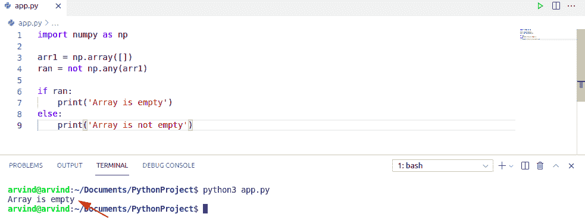

Check if numpy array is empty numpy.any

`Arr.shape` ():这是 NumPy 展示的一个属性，它利用一个元组给出数组的状态。我们可以利用这个来检查 NumPy 是否是一个数组。

现在举个例子，用 Arr。属性，然后检查数组是否为空。

```py
import numpy as np 

arr2 = np.array([])
if arr2.shape[0] == 0:
   print("Array is Empty")
```

以下是给定代码的截图

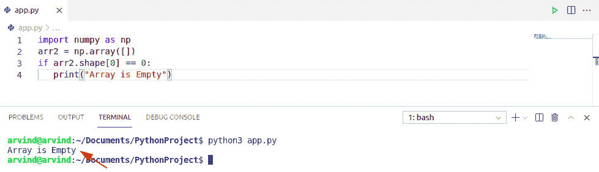

check if numpy array is empty arr.shape

上面的代码我们可以用来检查 NumPy 数组是否为空。

阅读: [Python NumPy 数组+示例](https://pythonguides.com/python-numpy-array/)

## Python 检查 Numpy 数组是否为数值

*   在这一节中，我们将学习如何在 Python 中检查 Numpy 数组是否为数值。
*   `numeric()` 函数检查字符串中的字符是否为数字字符。

*举个例子，用 isnumeric()方法检查数字字符*:

以下是给定代码的屏幕截图:

```py
import numpy as np

y = np.char.isnumeric('1')
def isnumeric(y):
    try:
        float(y)
        return True #if it is numeric value it returns true
    except ValueError:
        return False #if it is not numeric value it returns false
print(y)
```

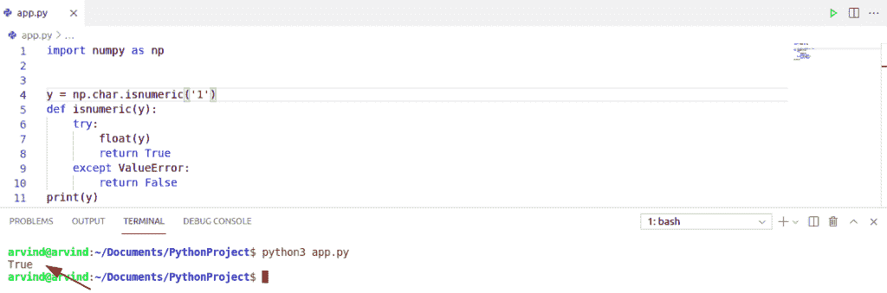

Check if numpy array is numeric

这就是如何**检查 Numpy 数组是否为数值型**。

用 Python 读[平方根](https://pythonguides.com/square-root-in-python/)

## 检查 Python 中的 Numpy 数组是否全为零

*   在这一节中，我们将学习如何检查 Numpy 数组是否全是零。
*   Numpy Np.all()函数显示给定数组中的元素是否全为零。

在这个函数中，将数组作为参数传递。如果其中一个元素为零，则返回 false，否则返回 true。

```py
import numpy as np
dt = np.array([0, 0, 0, 0, 0, 0])
all_zero = not np.any(dt)
if all_zero:
    print('Array contains only 0')
else:
    print('Array has non-zero items ')
```

你可以参考下面的截图来查看**的输出，检查 Numpy 数组是否全为零**

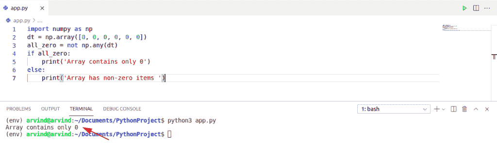

Check if numpy array is all zeroes

这就是如何检查 Numpy 数组是否全是零。

阅读: [Python 程序打印数组中的元素](https://pythonguides.com/python-program-to-print-element-in-an-array/)

## 检查 Numpy 数组是否是另一个数组的子集

**数组的子集**

*   假设我们有两个数组，当数组 A 的所有元素都包含在数组 B 中时，数组 A 被称为数组 B 的子集。

我们举个例子。a 是由元素[2，4，6，7，8]组成的数组。数组 B 由元素[2，4，6]组成。现在我们可以说 B 是数组 a 的子集。因为它包含了数组 a 的所有元素。

```py
import Numpy as Np
p = int(input("Enter the length of an array:-"))
a=[]
for i in range(p):
   a.append(int(input("ELEMENTS:-")))
a=Np.array(a)

m=int(input("Enter the length of the sub array:-"))
b=[]
for j in range(m):
    b.append(int(input("ELEMENTS:-")))
b=Np.array(b)
if m>p:
   print("NOT SUB ARRAY ")
else:
    count=0
    for i in b:
        for j in a:
            for i ==j:
                 count+=1
    if count ==m:
        print("It is subset array")
    else:
    print("NOT sub array") 
```

您可以参考下面的截图来查看**的输出，检查 Numpy 数组是否是另一个数组**的子集

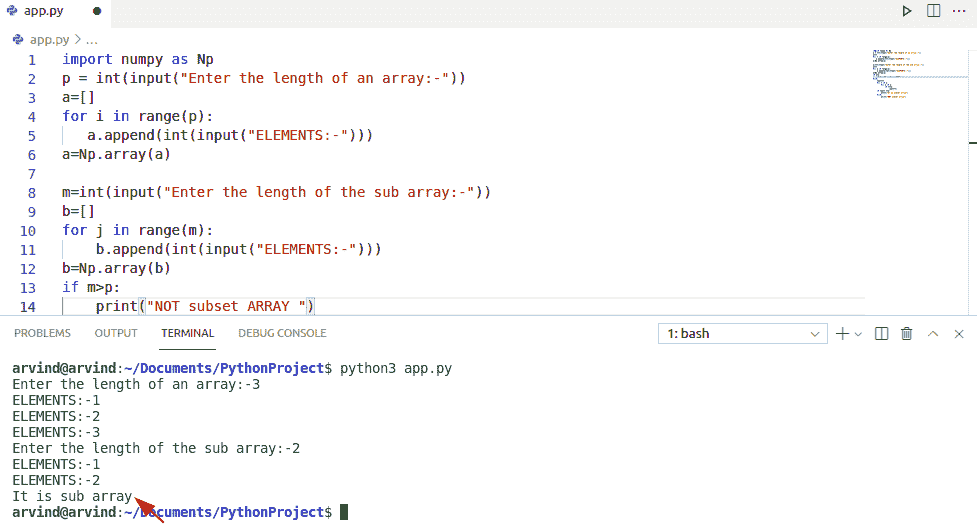

Check if numpy array is subset

上面的 python 代码，我们可以用来检查 NumPy 数组是否是另一个数组的子集。

阅读: [Python 串联数组](https://pythonguides.com/python-concatenate-arrays/)

## 在 Python 中检查 Numpy 数组是否都是相同的值

*   在这一节中，我们将学习如何检查 Numpy 数组是否都是相同的值。
*   使用 Np.all()函数检查所有元素是否相同。因为我们的 Numpy 数组只包含整数。

让我们举一个例子来说明 Numpy 数组是否都是相同的值

```py
import numpy as Np
arr1 = Np.array([3,3,3,3,3])
res = Np.all(arr1 == arr1[0])
if res:
      print('All values in Array are same')
else:
      print('All values in Array are not same') 
```

你可以参考下面的截图来查看**的输出，检查 Numpy 数组是否都是相同的值**

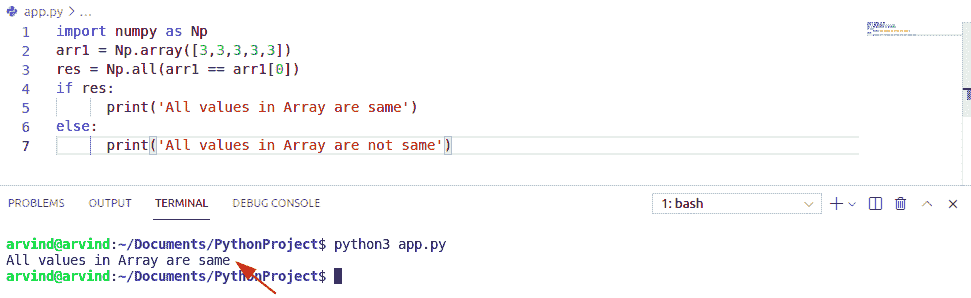

Check if numpy array is all same values

这就是如何在 Python 中检查 Numpy 数组是否都是相同的值。

## 检查 Numpy 数组是否是视图

*   在这一节中，我们将学习如何检查 Numpy 数组是否是一个视图。
*   在 Numpy 数组中，视图不拥有数据，对视图的任何更改都会影响原始数组，对原始数组的任何更改都会影响视图

让我们举个例子来检查 Numpy 数组是否是 Python 中的一个视图，

```py
import numpy as Np 

arr = Np.array([2,4,6,8])

y = arr.view()
arr[0] = 32

print(arr)
print(y) 
```

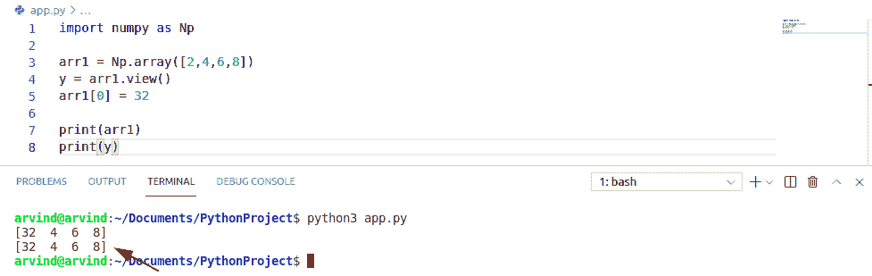

Check if numpy array is a view

上面的 Python 代码，我们可以用来检查 Numpy 数组是否是 Python 中的一个视图。

阅读:[如何将 Python 数组写入 CSV](https://pythonguides.com/python-write-array-to-csv/)

## 检查 NumPy 数组在 Python 中是否是浮点型的

`Float` 用于表示实数，例如 1.1、2.3。可以使用类似 F 的字符串来指定数据类型。

让我们举一个例子来说明数组的数据类型

```py
import numpy as np

arr = np.array([1.1, 2.1, 3.1])
arr2 = np.array([2,3,4,5])

newarr = arr.astype('i')
if arr:
    print('Array is Float')
else:
    print('Array is not Float ')
print(newarr)
print(newarr.dtype)
```

你可以参考下面的截图来查看**的输出，检查 NumPy 数组是否是 Float**

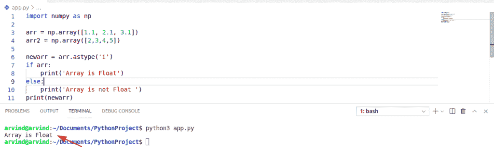

这就是如何**检查 NumPy 数组是否是 float** 。

## 检查 Numpy 数组是否在列表中

*   在本节中，我们将学习如何检查 Numpy 数组是否在列表中。
*   在一个列表中创建一个 Numpy 数组，我们必须将列表对象传递给 Numpy 数组

让我们举一个例子来说明如何在数组中创建一个列表。

```py
import numpy as np
arr =([2,3,4,5])
def inList(array, list):
    for element in list:
        if np.array_equal(element, array):
            return True
    return False
```

你可以参考下面的截图来查看**的输出，检查 Numpy 数组是否在列表**中

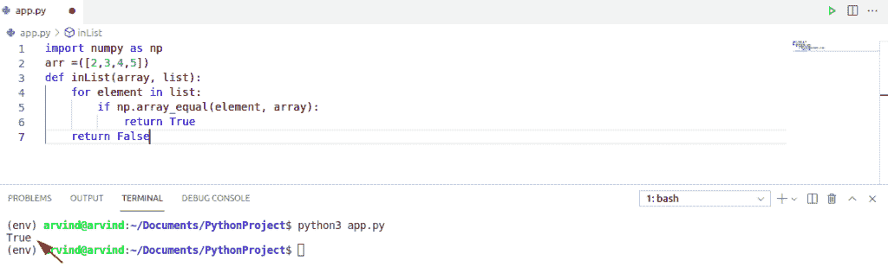

Check if numpy array is in list

这是**如何在 Python** 中检查 NumPy 数组是否在列表中。

阅读 [Python 字典更新示例](https://pythonguides.com/python-dictionary-update/)

## Python 检查 Numpy 数组是否排序

**排序**是指将元素放入有序的序列中。Numpy 数组有一个名为。sort()，它将按顺序排列元素

*   在这一节中，我们将学习如何检查 Numpy 数组是否排序
*   在列表中创建一个 Numpy 数组我们有一个函数。sort()，它将按顺序排列元素

让我们举一个例子来说明数组是如何排序的

```py
import numpy as np

arr1= np.array([6, 9, 2, 0]) # array is not sorted 
arr2 = np.arange(4,5,6) # array is sorted 

def sorted(x):
    return (np.arange(len(x)) == np.argsort(x)).all()
print(sorted(arr1))
print(sorted(arr2))
```

你可以参考下面的截图来查看**检查 Numpy 数组是否排序的输出**

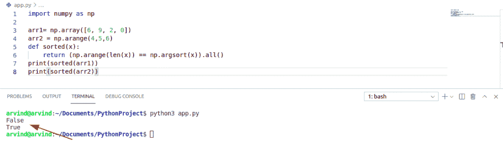

Check if numpy array is sorted

这就是如何在 Python 中检查 NumPy 数组是否排序。

阅读: [Python 数组的形状](https://pythonguides.com/python-shape-of-an-array/)

## 检查 Numpy 数组是否有负值

*   在这一节中，我们将学习如何检查 Numpy 数组是否有负值
*   在列表中创建一个 Numpy 数组，然后使用函数 Np.negative()。

Numpy 数组有一个函数叫做 **Np.negative()。**当我们需要处理数组元素的负值时

让我们举一个例子来说明一个正元素是如何转化为负元素的

```py
import numpy as np

arr1= np.array([6, 9, 2, 0])
b = np.any(arr1<0) #check for negative
print(b)
```

你可以参考下面的截图来查看**的输出，检查 Numpy 数组是否有负值**

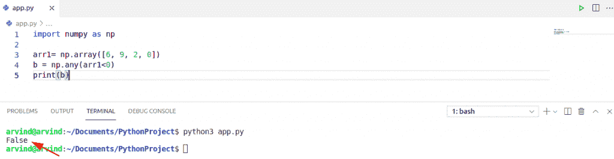

Check if the numpy array has negative values

上面的代码，我们可以用 Python 中的来**检查 Numpy 数组是否有负值。**

## 检查 Python 中 Numpy 数组是否为 Concatenate()

*   在这一节中，我们将学习如何检查 Numpy 数组是否是 Concatenate。
*   在列表中创建一个 Numpy 数组，并使用函数 Np.concatenate()。它将组合两个给定的数组

Numpy Concatenate 函数可用于按行或按列组合两个给定的数组。首先，我们创建一个包含所有数组的元组，然后使用函数 Np.concatenate()。

让我们举一个例子来说明给定的数组是如何追加的

```py
import Numpy as Np

arr = Np.array([2,6,7,4,8,9])
arr 2 = Np.array([4,6,7,2,3,5])
a = Np.concatenate((arr,arr 2))
print(a)
```

您可以参考下面的截图来查看**检查 Numpy 数组是否为 Concatenate()** 的输出

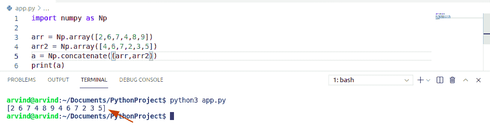

Check if Numpy array is Concatenate

阅读:[如何将 Python 字符串转换成字节数组并举例](https://pythonguides.com/python-string-to-byte-array/)

## 检查 Numpy 数组中是否有值

*   如果数组或数组的任何元素包含值，则检查数组测试中是否存在该值:

让我们举一个例子来测试 num 是否出现在 Numpy 数组中，在 arr 中使用 num，它的值为 true，否则为 false

```py
import Numpy as Np

num = 40
arr = Np.array([[1, 30],[4, 40]])
if num in arr:
    print(True)
else:
    print(False) 
```

您可以参考下面的截图来查看**检查 Numpy 数组**中是否存在值的输出

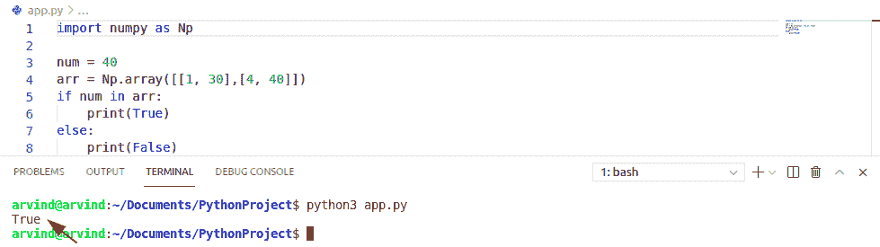

Check if value exists in numpy array

这就是如何在 Python 中**检查一个值是否存在于 Numpy 数组中。**

## 检查 Numpy 数组在 Python 中是否为 Nan

*   要检查 Numpy 数组中的 Nan 值，我们可以使用函数 Np.isNan()。对于原始数组中为 Nan 的索引，输出数组为 true，对于其余的索引，输出数组为 false。

让我们举一个例子来检查给定数组中的 Nan 值

```py
import Numpy as Np

num = 40
arr = Np.isNan([[1, 30],[4, 40]])
if num in arr:
    print(True)
else:
    print(False)
```

您可以参考下面的截图来查看**检查是否为 Numpy 数组是否为 Nan** 的输出

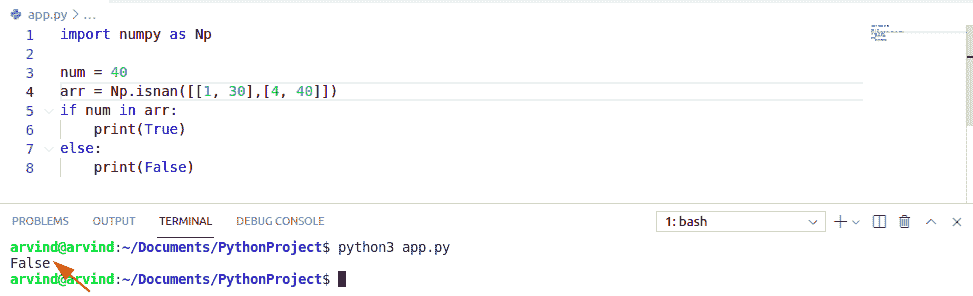

Check if the Numpy array is Nan

上面的 Python 代码我们可以用来**检查 Numpy 数组在 Python** 中是否为 Nan。

## 检查 Numpy 数组是否有重复

检查数组是否包含任何重复的元素。我们使用方法 np.unique()

```py
import numpy as np

a=np.array([1,2,2,2,2,3])

n = np.zeros_like(a, dtype=bool)
n[np.unique(a, return_index=True)[1]] = True 
a[~n] 
print(n)
```

您可以参考下面的截图来查看**检查 Numpy 数组是否有重复**的输出

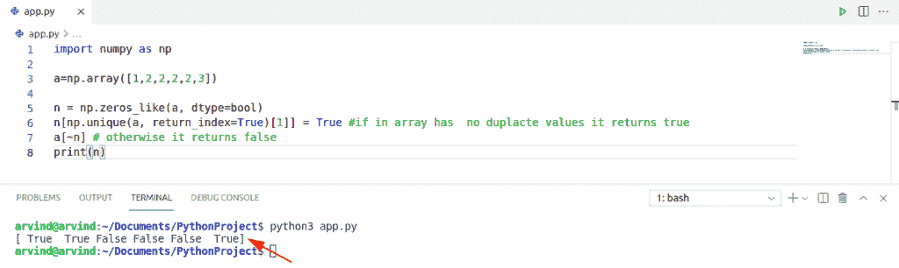

Check if numpy array has duplicates

这就是如何**在 Python** 中检查 Numpy 数组是否有重复。

## 检查 NumPy 数组是一维还是二维

**一维 Numpy 数组**是指单行中同质数据的集合。它也被称为矢量。当它是单行或 1D 阵列时，你只需要使用一个方括号。

**二维 Numpy 数组**指的是一个列表的列表中同质数据的集合。它也被称为矩阵。在 2D 数组中，你必须使用两个方括号，这就是为什么它表示列表的列表。

让我们看看，如何检查 Numpy 数组是 1d 还是 2d。

```py
import numpy as np
b = np.array([2,5,6,7,1,7])
print(b)
print("Dimension:",b.ndim) 
```

您可以参考下面的截图来查看输出

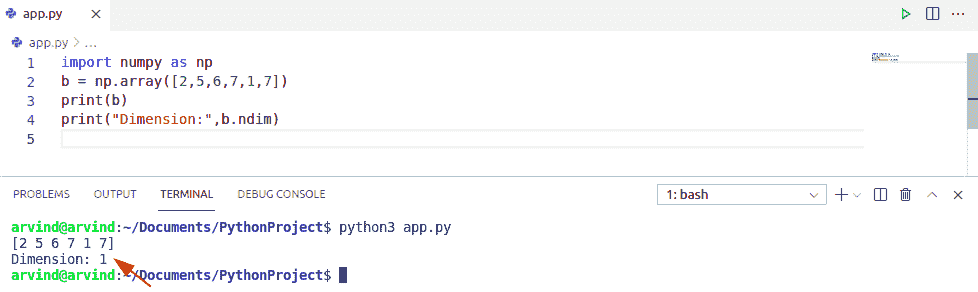

Check if the numpy array is 1d or 2d

这就是在 Python 中检查 numpy 数组是 1d 还是 2d 的方法。

您可能会喜欢以下 Python 教程:

*   [Python 数组与示例](https://pythonguides.com/python-array/)
*   [在 Python 中创建一个空数组](https://pythonguides.com/create-an-empty-array-in-python/)
*   [Python 3 的 string replace()方法](https://pythonguides.com/python-3-string-replace/)
*   [Python NumPy Random +示例](https://pythonguides.com/python-numpy-random/)
*   [Python 从字符串中移除子串+示例](https://pythonguides.com/python-remove-substring-from-a-string/)
*   [Python NumPy 零](https://pythonguides.com/python-numpy-zeros/)

在本 Python 教程中，我们学习了如何在 Python 中检查 NumPy 数组是否为空，并涵盖了以下示例:

*   检查 Numpy 数组是否为空
*   如何检查 Numpy 数组是否为数字
*   检查 Numpy 数组是否全为零
*   如何检查 Numpy 数组是否是另一个数组的子集
*   检查 Numpy 数组是否都是相同的值
*   如何检查 Numpy 数组是否是视图
*   检查 NumPy 数组是否为浮点型
*   如何检查 Numpy 数组是否在列表中
*   检查 Numpy 数组是否已排序
*   Python 检查 Numpy 数组是否有负值
*   检查 Numpy 数组是否被连接()
*   如何检查 Numpy 数组中是否存在值
*   检查 Numpy 数组在 Python 中是否是 Nan
*   检查 Numpy 数组是否有重复项
*   如何检查 NumPy 数组是一维还是二维

[Bijay Kumar](https://pythonguides.com/author/fewlines4biju/)

Python 是美国最流行的语言之一。我从事 Python 工作已经有很长时间了，我在与 Tkinter、Pandas、NumPy、Turtle、Django、Matplotlib、Tensorflow、Scipy、Scikit-Learn 等各种库合作方面拥有专业知识。我有与美国、加拿大、英国、澳大利亚、新西兰等国家的各种客户合作的经验。查看我的个人资料。

[enjoysharepoint.com/](https://enjoysharepoint.com/)[](https://www.facebook.com/fewlines4biju "Facebook")[](https://www.linkedin.com/in/fewlines4biju/ "Linkedin")[](https://twitter.com/fewlines4biju "Twitter")