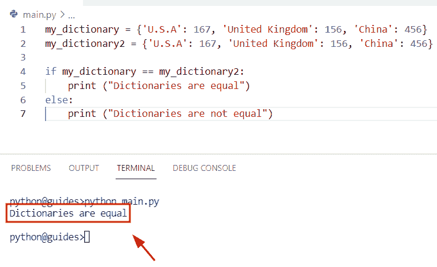
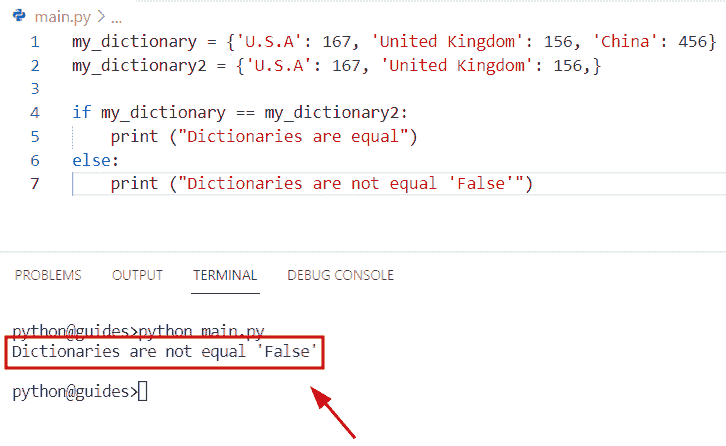
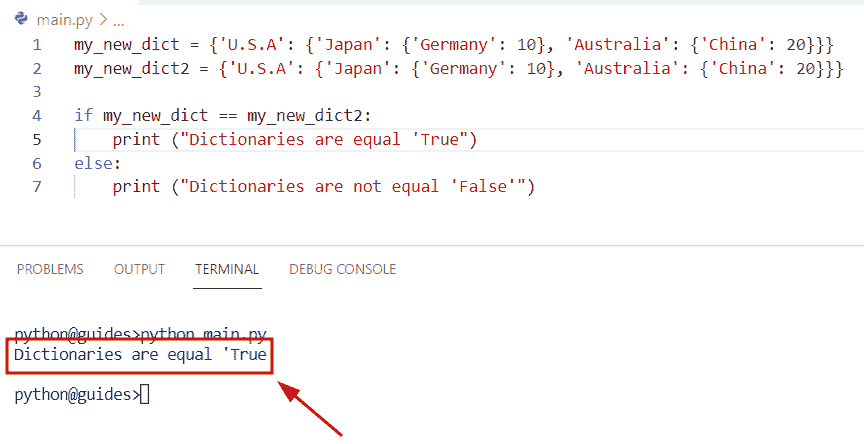
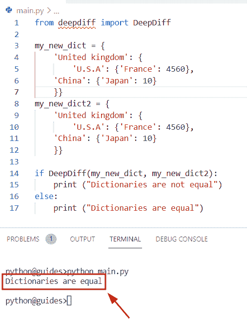
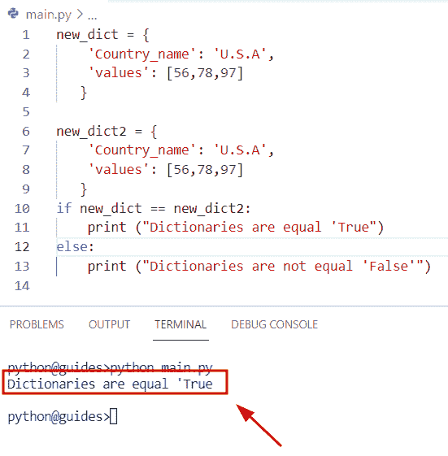

# 在 Python 中检查两个字典是否相等

> 原文：<https://pythonguides.com/check-if-two-dictionaries-are-equal-in-python/>

[](https://sharepointsky.teachable.com/p/python-and-machine-learning-training-course)

在本 [Python 教程](https://pythonguides.com/learn-python/)中，我们将讨论**如何在 Python** 中检查两个字典是否相等。此外，我们还将讨论以下主题:

*   在 Python 中检查两个字典是否相等
*   在 Python 中检查两个嵌套字典是否相等
*   在 Python 中检查两个字典列表是否相等

另外，查看最近的 Python 教程:[如何检查一个键是否存在于 Python 字典中](https://pythonguides.com/check-if-a-key-exists-in-a-python-dictionary/)

目录

[](#)

*   [在 Python 中检查两个字典是否相等](#Check_if_two_dictionaries_are_equal_in_Python "Check if two dictionaries are equal in Python")
*   [在 Python 中检查两个嵌套的字典是否相等](#Check_if_two_nested_dictionaries_are_equal_in_Python "Check if two nested dictionaries are equal in Python")
*   [检查两个字典列表是否相等 Python](#Check_if_two_lists_of_dictionaries_are_equal_Python "Check if two lists of dictionaries are equal Python")

## 在 Python 中检查两个字典是否相等

*   在这一节中，我们将学习如何在 Python 中检查两个[字典](https://pythonguides.com/create-a-dictionary-in-python/)是否相等。
*   为了执行这个特定的任务，我们将使用 `==` 操作符，这个操作数在 Python 包中是可用的。在 Python 中，该函数将始终返回布尔值，该值指示值是假还是真。它将检查条件，如果给定值相等，则返回**‘真’**，否则返回**‘假’**。
*   在这个程序中，我们要检查两个字典在 Python 中是否相等。为了完成这个任务，首先，我们将创建名为**‘my _ dictionary’**、**‘my _ dictionary 2’**的字典，并分配键值对元素。
*   接下来，我们将应用 if-else 条件，如果给定的字典相等，则显示**“字典相等”**。如果给定的字典不相等，则显示**“字典不相等”**。

**举例:**

```py
my_dictionary = {'U.S.A': 167, 'United Kingdom': 156, 'China': 456}
my_dictionary2 = {'U.S.A': 167, 'United Kingdom': 156, 'China': 456}

if my_dictionary == my_dictionary2:
    print ("Dictionaries are equal")
else:
    print ("Dictionaries are not equal")
```

下面是下面给出的代码的截图。



Check if two dictionaries are equal in Python

正如您在截图中看到的，输出显示了**“字典相等”**。

现在，当给定的字典不相等时，可能还有一种情况。让我们举一个例子，看看如何使用 `==` 操作符来检查 Python 中两个相等的字典。

**源代码:**

```py
my_dictionary = {'U.S.A': 167, 'United Kingdom': 156, 'China': 456}
my_dictionary2 = {'U.S.A': 167, 'United Kingdom': 156,}

if my_dictionary == my_dictionary2:
    print ("Dictionaries are equal")
else:
    print ("Dictionaries are not equal 'False'")
```

*   在上面的代码中，我们创建了相同的字典，但是在本例中，第二个字典**‘my _ dictionary 2’**只有键-值对形式的 `2` 元素。
*   一旦执行了这段代码，输出显示**“字典不相等”**。
*   这背后的原因是第一个字典**‘我的 _ 字典’**包含 `3` 元素，而第二个字典包含 `2` 元素。

下面是以下给定代码的执行。



Check if two dictionaries are equal in Python

> **注:**在 Python 字典中的方法 cmp()是根据[官方文档](https://docs.python.org/3.0/whatsnew/3.0.html#ordering-comparisons)对 `Python 3.x` 的损耗。

阅读:[如何用 Python 从一个列表创建字典](https://pythonguides.com/create-a-dictionary-from-one-list-in-python/)

## 在 Python 中检查两个嵌套的字典是否相等

*   在这个例子中，我们将学习**如何在 Python** 中检查两个嵌套的字典是否相等。
*   为了完成这个任务，我们将使用 `==` 操作符，这个方法将帮助用户检查两个给定的字典是否相等。
*   在 Python 字典中，数据以**键-值**对的形式存储，嵌套字典表示字典内部的字典，并以结构化的方式存储信息。
*   在这个例子中，首先，我们将创建一个嵌套字典，并分配国家名称及其随机值。接下来，我们将使用 `if-els` e 条件并检查嵌套的字典是否相等。

**举例:**

我们举个例子，看看 Python 中如何检查两个嵌套的字典是否相等。

**源代码:**

```py
my_new_dict = {'U.S.A': {'Japan': {'Germany': 10}, 'Australia': {'China': 20}}}
my_new_dict2 = {'U.S.A': {'Japan': {'Germany': 10}, 'Australia': {'China': 20}}}

if my_new_dict == my_new_dict2:
    print ("Dictionaries are equal 'True")
else:
    print ("Dictionaries are not equal 'False'")
```

下面是以下给定代码的实现。



Check if two nested dictionaries are equal Python

正如您在屏幕截图中看到的，输出显示字典是相等的。

如何检查两个嵌套字典是否相等 Python 另一种方法

*   在这个程序中，我们可以很容易地使用 `Deepdiff` 库来检查两个嵌套的字典是否相等。首先，您已经使用 `pip install DeepDiff` 命令在您的机器上安装了这个包。这个方法将检查字典之间的差异。
*   假设您有两个包含键值对形式元素的字典。现在，在第一个字典中，您插入了值 `10` ，在另一个字典中，您插入了 `11` 。
*   一旦你使用了这个函数**‘deepDiff’**，然后比较两个字典，检查有多少对是相同的。如果不相等，则显示**‘新值’和‘旧值’**。

**源代码:**

```py
from deepdiff import DeepDiff

my_new_dict = {
    'United kingdom': {
        'U.S.A': {'France': 4560}, 
    'China': {'Japan': 10}
    }}
my_new_dict2 = {
    'United kingdom': {
        'U.S.A': {'France': 4560}, 
    'China': {'Japan': 10}
    }}

if DeepDiff(my_new_dict, my_new_dict2):
    print ("Dictionaries are not equal")
else:
    print ("Dictionaries are equal")
```

在上面的代码中，我们刚刚使用了 `if-else` 条件，并检查了字典是否相等。如果字典相等，则显示**“字典相等”**，否则返回**“字典不相等”**。

你可以参考下面的截图。



How to check if two nested dictionaries are equal Python

阅读: [Python 列表字典](https://pythonguides.com/python-dictionary-of-lists/)

## 检查两个字典列表是否相等 Python

*   在这一节中，我们将学习如何检查两个字典列表是否相等。
*   在这个例子中，我们将创建一个字典，并以键值对的形式分配元素。现在，键将被视为国家名称，值将被视为列表中的**‘值’**。
*   接下来，我们将使用 `==` 操作符，它比较两个给定的字典，并检查字典元素是否相等。

**举例:**

让我们看一下例子，了解如何在 Python 中使用 `==` 操作符。

**源代码:**

```py
new_dict = {
    'Country_name': 'U.S.A',
    'values': [56,78,97]
   }

new_dict2 = {
    'Country_name': 'U.S.A',
    'values': [56,78,97]
   }
if new_dict == new_dict2:
    print ("Dictionaries are equal 'True")
else:
    print ("Dictionaries are not equal 'False'") 
```

下面是下面给出的代码的截图。



Check if two lists of dictionaries are equal Python

您可能也喜欢阅读以下 Python 教程。

*   [Python 字典增量值](https://pythonguides.com/python-dictionary-increment-value/)
*   [Python 字典复制示例](https://pythonguides.com/python-dictionary-copy/)
*   [Python 字典多键](https://pythonguides.com/python-dictionary-multiple-keys/)
*   [Python 字典包含+个例子](https://pythonguides.com/python-dictionary-contains/)

在这个 Python 教程中，我们学习了**如何在 Python** 中检查两个字典是否相等。

*   在 Python 中检查两个字典是否相等
*   在 Python 中检查两个嵌套字典是否相等
*   在 Python 中检查两个字典列表是否相等

[Bijay Kumar](https://pythonguides.com/author/fewlines4biju/)

Python 是美国最流行的语言之一。我从事 Python 工作已经有很长时间了，我在与 Tkinter、Pandas、NumPy、Turtle、Django、Matplotlib、Tensorflow、Scipy、Scikit-Learn 等各种库合作方面拥有专业知识。我有与美国、加拿大、英国、澳大利亚、新西兰等国家的各种客户合作的经验。查看我的个人资料。

[enjoysharepoint.com/](https://enjoysharepoint.com/)[](https://www.facebook.com/fewlines4biju "Facebook")[](https://www.linkedin.com/in/fewlines4biju/ "Linkedin")[](https://twitter.com/fewlines4biju "Twitter")