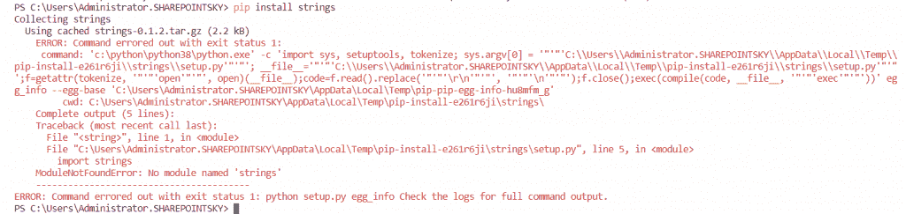
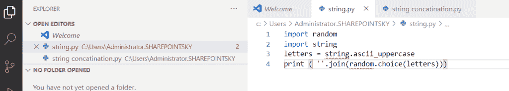

# 命令出错，退出状态为 1 python

> 原文：<https://pythonguides.com/command-errored-out-with-exit-status-1-python/>

[](https://sharepointsky.teachable.com/p/python-and-machine-learning-training-course)

在这个 [Python 教程](https://pythonguides.com/python-programming-for-the-absolute-beginner/)中，我们将看到如何修复错误，Python 中的**命令出错，退出状态为 1。**

当我试图通过运行以下命令来安装 **Python 字符串模块**时，错误出现了:

```py
pip install strings
```

完整的错误如下所示:

错误:命令出错，退出状态为 1:
命令:' c:\ python \ python 38 \ python . exe '-c ' import sys，setuptools，tokenize。sys . argv[0]= ' " ' " ' C:\ Users \ Administrator。SharePoint sky \ AppData \ Local \ Temp \ pip-install-e 261 r 6 Ji \ strings \ setup . py““”；**文件**= ' " ' " ' C:\ Users \ Administrator。SharePoint sky \ AppData \ Local \ Temp \ pip-install-e 261 r 6 Ji \ strings \ setup . py““”；f=getattr(tokenize，' " ' " ' " ' " ' " '，open)( **文件**)；code=f.read()。替换(“”“”“\ r \ n”“”“”“”“”“\ n”“”)；f . close()；exec(compile(code， `file` ，' " ' " ' exec ' " ' " ')' egg _ info–egg-base ' C:\ Users \ Administrator。SharePoint sky \ AppData \ Local \ Temp \ pip-pip-egg-info-Hu 8 mfm _ g '
CWD:C:\ Users \ Administrator。SharePoint sky \ AppData \ Local \ Temp \ pip-install-e 261 r 6 Ji \ strings \
完整输出(5 行):
Traceback(最近一次调用 last):
File " "，第 1 行，在
文件“C:\Users\Administrator。SharePoint sky \ AppData \ Local \ Temp \ pip-install-e 261 r 6 Ji \ strings \ setup . py "，第 5 行，在
导入字符串
ModuleNotFoundError:没有名为“strings”的模块
——————————————
错误:命令出错，退出状态为 1: python setup.py egg_info 检查日志以获取完整的命令输出。

下图显示了错误的屏幕截图:



Command errored out with exit status 1

目录

[](#)

*   [命令出错，退出状态为 1 python](#Command_errored_out_with_exit_status_1_python "Command errored out with exit status 1 python")
*   [属性错误:部分初始化的模块“random”没有属性“randint”](#AttributeError_partially_initialized_module_random_has_no_attribute_randint "AttributeError: partially initialized module ‘random’ has no attribute ‘randint’")

## 命令出错，退出状态为 1 python

命令没有问题，一个名为 `string.py` 的文件导致了问题。

正如你在下面看到的，在导致问题的同一个文件夹中有 filename `string.py` 。

要解决这个问题，我们需要简单地从文件夹中删除 string.py 文件。

理想情况下，我们不应该创建任何文件名为 `string.py` 的文件。



Command errored out with exit status 1 python

## **属性错误:**部分初始化的模块‘random’没有属性‘randint’

上面的相同文件名(string.py)问题也可能会产生下面的错误，

**AttributeError:** 部分初始化的模块“random”没有属性“randint”(很可能是由于循环导入)。

按照同样的**删除文件解决方案**来修复这个问题。

您可能会喜欢以下 python 教程:

*   [Python 历元到日期时间+示例](https://pythonguides.com/python-epoch-to-datetime/)
*   [Python 中的优先级队列](https://pythonguides.com/priority-queue-in-python/)
*   [Python 3 pickle typeerror 需要一个类似字节的对象，而不是“str”](https://pythonguides.com/python-3-pickle-typeerror-a-bytes-like-object-is-required-not-str/)
*   [Python 二分搜索法和线性搜索](https://pythonguides.com/python-binary-search/)
*   [Python 中的排序算法](https://pythonguides.com/sorting-algorithms-in-python/)
*   [在 Python 中使用 JSON 数据](https://pythonguides.com/json-data-in-python/)
*   [Python GUI 编程](https://pythonguides.com/python-gui-programming/)
*   [Python 中的递增和递减运算符](https://pythonguides.com/increment-and-decrement-operators-in-python/)
*   [Python 中的构造函数](https://pythonguides.com/constructor-in-python/)
*   [如何在 Python 中将 dictionary 转换成 JSON](https://pythonguides.com/convert-dictionary-to-json-python/)

在这里，我们学习了如何修复 Python 中的以下两个错误:

*   命令出错，退出状态为 1 python
*   **属性错误:**部分初始化的模块“random”没有属性“randint”

[Bijay Kumar](https://pythonguides.com/author/fewlines4biju/)

Python 是美国最流行的语言之一。我从事 Python 工作已经有很长时间了，我在与 Tkinter、Pandas、NumPy、Turtle、Django、Matplotlib、Tensorflow、Scipy、Scikit-Learn 等各种库合作方面拥有专业知识。我有与美国、加拿大、英国、澳大利亚、新西兰等国家的各种客户合作的经验。查看我的个人资料。

[enjoysharepoint.com/](https://enjoysharepoint.com/)[](https://www.facebook.com/fewlines4biju "Facebook")[](https://www.linkedin.com/in/fewlines4biju/ "Linkedin")[](https://twitter.com/fewlines4biju "Twitter")