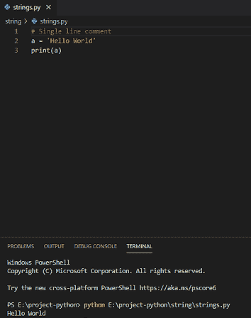
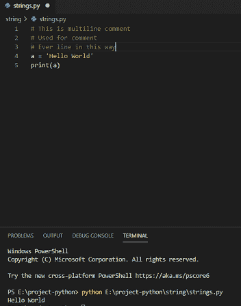

# Python 中的注释行

> 原文：<https://pythonguides.com/comment-lines-in-python/>

[](https://sharepointsky.teachable.com/p/python-and-machine-learning-training-course)

在本 [Python 教程](https://pythonguides.com/python-download-and-installation/)中，我们将讨论如何在 python 中**注释行。此外，我们还将讨论:**

*   python 中的注释单行
*   注释多行 python

目录

[](#)

*   [Python 中的注释行](#Comment_lines_in_Python "Comment lines in Python")
    *   [评论单行 python](#Comment_Single_line_python "Comment Single line python")
    *   [注释多行 python](#Comment_multiple_lines_python "Comment multiple lines python")

## Python 中的注释行

在用 Python 进行[编程时，我们需要用 Python 注释行。](https://pythonguides.com/python-programming-for-the-absolute-beginner/)

### 评论单行 python

在 Python 中，**单行注释**以这个 **" # "** 开始，它会忽略用这个写的所有东西。在测试代码的时候，注释被用来阻止代码的执行，同时注释也被用来解释代码，这使得代码更具可读性。

**举例:**

```py
# Single line comment
a = 'Hello World'
print(a)
```

写完上面的代码(注释单行 python)。在这里，你可以看到在编写代码之前，我使用了 **" # "** 来注释那一行。所以这样一来，注释在处理代码的同时也能工作。你可以参考下面的截图来评论单线 python。



Comment lines in Python

### 注释多行 python

为了在 python 中注释多行，我们将使用这个“#”，我们必须单独注释每一行，这非常单调。

**举例:**

```py
# This is multiline comment
# Used for comment
# Every line in this way
a = 'Hello World'
print(a)
```

写完上面的代码(用 python 注释多行)。在这里，你可以看到在编写代码之前，我使用了 **" # "** 来注释每一行，所以这是在 python 中注释 multiline 的方法。所以这样一来，注释在处理代码的同时也能工作。你可以参考下面的截图来评论多行 python。



Comment multiple lines python

您可能会喜欢以下 Python 教程:

*   [Python Hello World 程序(使用 Pycharm)](https://pythonguides.com/python-hello-world-program/)
*   [Python 字典追加示例](https://pythonguides.com/python-dictionary-append/)
*   [在 Python 中检查列表是否为空](https://pythonguides.com/check-if-a-list-is-empty-in-python/)
*   [Python 将列表转换成字符串](https://pythonguides.com/python-convert-list-to-string/)
*   [Python 方块一号](https://pythonguides.com/python-square-a-number/)
*   [什么是 Python 字典+用 Python 创建字典](https://pythonguides.com/create-a-dictionary-in-python/)
*   [不带换行符的 Python 打印](https://pythonguides.com/python-print-without-newline/)
*   [Python 字典方法+示例](https://pythonguides.com/python-dictionary-methods/)
*   [Python 访问修饰符+示例](https://pythonguides.com/python-access-modifiers/)
*   [Python 3 pickle typeerror 需要一个类似字节的对象，而不是“str”](https://pythonguides.com/python-3-pickle-typeerror-a-bytes-like-object-is-required-not-str/)
*   [用 Python 创建和修改 PDF 文件](https://pythonguides.com/create-and-modify-pdf-file-in-python/)

在本教程中，我们已经看到了**如何在 python** 中注释行。此外，我们还讨论了如何在 python 中**注释单行**和**多重注释。**

[Bijay Kumar](https://pythonguides.com/author/fewlines4biju/)

Python 是美国最流行的语言之一。我从事 Python 工作已经有很长时间了，我在与 Tkinter、Pandas、NumPy、Turtle、Django、Matplotlib、Tensorflow、Scipy、Scikit-Learn 等各种库合作方面拥有专业知识。我有与美国、加拿大、英国、澳大利亚、新西兰等国家的各种客户合作的经验。查看我的个人资料。

[enjoysharepoint.com/](https://enjoysharepoint.com/)[](https://www.facebook.com/fewlines4biju "Facebook")[](https://www.linkedin.com/in/fewlines4biju/ "Linkedin")[](https://twitter.com/fewlines4biju "Twitter")