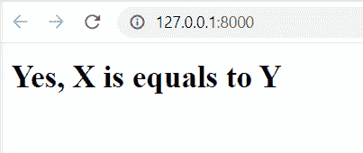
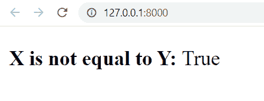
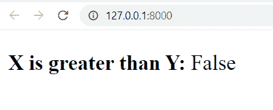
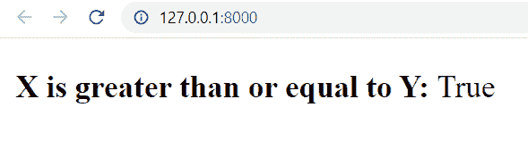
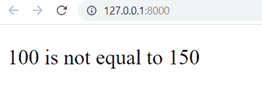
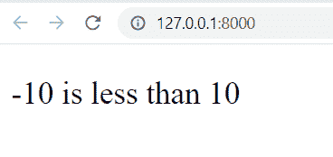
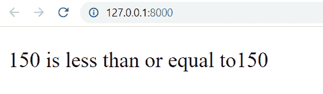

# 比较 Python Django 中的两个整数

> 原文：<https://pythonguides.com/compare-two-integers-in-python-django/>

[](https://sharepointsky.teachable.com/p/python-and-machine-learning-training-course)

在这个 [Python Django 教程](https://pythonguides.com/how-to-install-django/)中，我们将学习**如何在 Python Django** 中比较两个整数。我们还会看到与此相关的不同例子。这些是我们将在本教程中讨论的以下主题。

*   Python 中的比较运算符
*   如何在 Python Django 中比较两个整数
*   比较视图中的两个整数
*   比较模板中的两个整数

目录

[](#)

*   [Python 中的比较运算符](#Comparison_Operators_in_Python "Comparison Operators in Python")
*   [如何在 python Django 中比较两个整数](#How_to_compare_two_integers_in_python_Django "How to compare two integers in python Django")
*   [比较视图中的两个整数](#Compare_two_integers_in_view "Compare two integers in view")
*   [比较模板中的两个整数](#Compare_two_integer_in_template "Compare two integer in template")

## Python 中的比较运算符

在这一节中，我们将探索什么是比较运算符，以及 Python 中可用的不同种类的比较运算符。

在 [Python](https://pythonguides.com/learn-python/) 中，比较运算符也被称为**关系运算符**。**比较运算符**用于比较两个操作数的值，根据条件是否满足返回真或假。

下面列出了 Python 中可用的比较运算符。

| 操作员 | 操作员名 | 描述 |
| --- | --- | --- |
| == | 平等 | 如果两个操作数的值相等，则该条件为真。 |
| ！= | 不平等 | 当两个操作数的值不同时，条件为真。 |
| > | 大于 | 如果左操作数的值大于右操作数的值，则条件为真。 |
| >= | 大于或等于 | 如果左操作数的值大于或等于右操作数的值，则该条件为真。 |
| < | 不到 | 如果左操作数的值小于右操作数的值，则条件为真。 |
| <= | 小于或等于 | 如果左操作数的值小于或等于右操作数的值，则该条件为真。 |

Operators

阅读:[Django 模板中的 If 语句](https://pythonguides.com/if-statement-in-django-template/)

## 如何在 python Django 中比较两个整数

是时候学习如何使用 Django 在 HTML 页面上显示 Python 程序的输出了。到目前为止，我们只知道如何在控制台或终端上显示它。所以在这一节，我们将学习使用 Django 在 python 中比较两个整数。

使用 Django 比较两个整数有两种方法:

*   使用视图
*   使用模板

**使用视图:**视图是在 Django 框架中接收和响应 web 请求的 Python 函数或类。普通的 HTTP 响应、HTML 模板响应或者将用户发送到另一个页面的 HTTP 重定向响应都可以用作响应。

**使用模板:** Django 模板使用标签和过滤器来定义一种类似于 Python 的语言——但不是 Python。标签类似于模板语言中的关键字和函数。Python 中的关键字和函数提供了控制流和构建代码的工具。继承、条件操作、循环、注释和文本处理都由 Django 的内置标签提供。

## 比较视图中的两个整数

在这一节中，我们将学习如何使用 Django 的视图来比较两个整数。让我们，用各种例子来阐明我们的概念。

在开始演示之前，我将向您展示**项目的 urls.py 和 app 的 urls.py 文件**。因为它在所有的例子中保持不变。

`PythonGuides urls.py` 文件:

```py
from django.contrib import admin
from django.urls import path, include

urlpatterns = [
    path('admin/', admin.site.urls),
    path('', include('home.urls'))
] 
```

这意味着当您在浏览器中打开项目时，它会将您带到 home.urls。

现在，请看 `home urls.py` 文件:

```py
from django.urls import path, include
from home import views

urlpatterns = [
    path('', views.home, name='home')
]
```

它会移动到 home 应用程序的 `views.py` 文件。

**例#1**

在这个例子中，我们使用相等运算符来比较两个整数。

`views.py` 文件:

```py
from django.http import HttpResponse

# Create your views here.

def home(request):
    x = 6
    y = 6
    if(x == y):
        html = "<html><body><b>Yes, X is equals to Y </b></body></html>"
        return HttpResponse(html)
    else:
        html = "<html><body><b>No, X is not equal to Y</b></body></html>"
        return HttpResponse(html) 
```

我们定义两个整数，x & y，然后使用等式运算符来比较它们。我们使用 Python 中的 if-else 语句在 HTML 页面上呈现输出。

现在，如果我们运行开发服务器并移动到映射的 URL，我们将得到以下输出。



Equality Operator

**例 2**

在这个例子中，我们使用不等式运算符来比较两个整数。

`views.py` 文件:

```py
from django.shortcuts import render

# Create your views here.

def home(request):
    x = 10
    y = 12
    result = (x != y)
    return render(request, 'home.html', {'result':result})
```

我们定义两个整数，x & y，然后用不等式运算符进行比较。我们将结果呈现在 HTML 页面上。

`home.html`页面:

```py
<!DOCTYPE html>
<html lang="en">
<head>
    <meta charset="UTF-8">
    <meta http-equiv="X-UA-Compatible" content="IE=edge">
    <meta name="viewport" content="width=device-width, initial-scale=1.0">
    <title>PythonGuides</title>
</head>
<body>
    <p>
        <b> X is not equal to Y: </b>{{result}}
    </p>
</body
</html>
```

在`home.html`文件中，我们只是使用变量来得到结果。最终，我们将获得以下输出。



Inequality Operator

**例 3**

在这个例子中，我们使用大于运算符来比较两个整数。

`views.py` 文件:

```py
from django.shortcuts import render

# Create your views here.

def home(request):
    x = 10
    y = 12
    result = (x > y)
    return render(request, 'home.html', {'result':result})
```

我们定义两个整数，x 和 y，然后使用大于运算符来比较它们。我们将结果呈现在 HTML 页面上。

`home.html`页面:

```py
<!DOCTYPE html>
<html lang="en">
<head>
    <meta charset="UTF-8">
    <meta http-equiv="X-UA-Compatible" content="IE=edge">
    <meta name="viewport" content="width=device-width, initial-scale=1.0">
    <title>PythonGuides</title>
</head>
<body>
    <p>
        <b> X is greater than Y: </b>{{result}}
    </p>
</body
</html>
```

在`home.html`文件中，我们只是使用变量来得到结果。最终，我们将获得以下输出。



Greater Than Operator

**例#4**

在这个例子中，我们使用大于或等于运算符来比较两个整数。

`views.py` 文件:

```py
from django.shortcuts import render

# Create your views here.

def home(request):
    x = 1500
    y = 1500
    result = (x >= y)
    return render(request, 'home.html', {'result':result})
```

我们定义两个整数 x & y，然后使用大于或等于运算符来比较它们。我们将结果呈现在 HTML 页面上。

`home.html`文件:

```py
<!DOCTYPE html>
<html lang="en">
<head>
    <meta charset="UTF-8">
    <meta http-equiv="X-UA-Compatible" content="IE=edge">
    <meta name="viewport" content="width=device-width, initial-scale=1.0">
    <title>PythonGuides</title>
</head>
<body>
    <p>
        <b> X is greater than or equal to Y: </b>{{result}}
    </p>
</body
</html>
```

在`home.html`文件中，我们只是使用结果变量来获得输出。最终，我们将获得以下输出。



Greater than or Equal to

阅读:[使用 Python 中的 Django 将 HTML 页面转换为 PDF](https://pythonguides.com/convert-html-page-to-pdf-using-django/)

## 比较模板中的两个整数

在这一节中，我们将学习如何使用 Django 的模板标签来比较两个整数。让我们，用各种例子来阐明我们的概念。

**语法:**

```py


        Statement To Print


```

在开始演示之前，我将向您展示**项目的 urls.py 和 app 的 urls.py 文件**。因为它在所有的例子中保持不变。

**项目的 urls.py** 文件:

这里我们的项目名称是 PythonGuides。

```py
from django.contrib import admin
from django.urls import path, include

urlpatterns = [
    path('admin/', admin.site.urls),
    path('', include('home.urls'))
] 
```

这意味着当你在浏览器中打开你的项目时，它会把你带到你的 `home.urls` 。

现在，请看 `home urls.py` 文件:

```py
from django.urls import path, include
from home import views

urlpatterns = [
    path('', views.home, name='home')
]
```

它会移动到 home 应用程序的 `views.py` 文件。

**例#1**

在这个例子中，我们使用等式模板标签来比较两个整数。

`views.py` 文件:

```py
from django.shortcuts import render

# Create your views here.

def home(request):
    x = 100
    y = 150
    return render(request, 'home.html', {'x':x, 'y':y})
```

首先，我们将创建一个重定向到 HTML 页面的视图。在 views.py 文件中，我们定义了数字并将数字重定向到`home.html`页面。

`home.html`文件:

```py
<!DOCTYPE html>
<html lang="en">
<head>
    <meta charset="UTF-8">
    <meta http-equiv="X-UA-Compatible" content="IE=edge">
    <meta name="viewport" content="width=device-width, initial-scale=1.0">
    <title>PythonGuides</title>
</head>
<body>
    <p>
        
        {{ x }} is equal to {{ y }}
        
        {{ x }} is not equal to {{ y }}
        
    </p>
</body
</html>
```

这里，我们使用标签在模板中添加一个等式布尔操作符。标签评估变量，如果条件为“真”,则输出块的内容。

**输出如下:**



Equality Template Tag

**例#** 2

在这个例子中，我们使用小于模板标签来比较两个整数。

`views.py` 文件:

```py
from django.shortcuts import render

# Create your views here.

def home(request):
    x = -10
    y =  10
    return render(request, 'home.html', {'x':x, 'y':y})
```

首先，我们将创建一个重定向到 HTML 页面的视图。我们在 views.py 文件中声明这些数字，并将它们重定向到 home.html 页面。

`home.html`文件:

```py
<!DOCTYPE html>
<html lang="en">
<head>
    <meta charset="UTF-8">
    <meta http-equiv="X-UA-Compatible" content="IE=edge">
    <meta name="viewport" content="width=device-width, initial-scale=1.0">
    <title>PythonGuides</title>
</head>
<body>
    <p>
        
        {{ x }} is less than {{ y }}
        
        {{ x }} is greater than {{ y }}
        
    </p>
</body
</html>
```

这里，我们使用和标记在模板中添加小于布尔运算符。如果标签对变量求值，如果条件为“真”,则输出块的内容，否则输出标签内容块。



Less Than Template Tag

**例#** 3

在这个例子中，我们使用小于或等于模板标签来比较两个整数。

`views.py` 文件:

```py
from django.shortcuts import render

# Create your views here.

def home(request):
    x = 150
    y = 150
    return render(request, 'home.html', {'x':x, 'y':y}) 
```

首先，我们将创建一个重定向到 HTML 页面的视图。我们在 views.py 文件中声明这些数字，并将它们重定向到 home.html 页面。

`home.html`文件:

```py
<!DOCTYPE html>
<html lang="en">
<head>
    <meta charset="UTF-8">
    <meta http-equiv="X-UA-Compatible" content="IE=edge">
    <meta name="viewport" content="width=device-width, initial-scale=1.0">
    <title>PythonGuides</title>
</head>
<body>
    <p>
        
        {{ x }} is less than or equal to{{ y }}
        
        {{ x }} is greater than or equal to {{ y }}
        
    </p>
</body
</html>
```

以下是输出:



Less Than or Equal To Template Tag

另外，看看更多的 Django 教程。

*   [获取 Django 中的 URL 参数](https://pythonguides.com/get-url-parameters-in-django/)
*   [Python Django app 上传文件](https://pythonguides.com/django-app-upload-files/)
*   [Python Django 长度过滤器](https://pythonguides.com/python-django-length-filter/)
*   [在 Django 中创建模型](https://pythonguides.com/create-model-in-django/)
*   [获取姜戈的当前时间](https://pythonguides.com/how-to-get-current-time-in-django/)

在本 Django 教程中，我们讨论了如何在 Python Django 中比较两个整数。此外，我们还讨论了以下主题列表:

*   比较运算符
*   如何在 python Django 中比较两个整数
*   比较视图中的两个整数
*   比较模板中的两个整数

[Bijay Kumar](https://pythonguides.com/author/fewlines4biju/)

Python 是美国最流行的语言之一。我从事 Python 工作已经有很长时间了，我在与 Tkinter、Pandas、NumPy、Turtle、Django、Matplotlib、Tensorflow、Scipy、Scikit-Learn 等各种库合作方面拥有专业知识。我有与美国、加拿大、英国、澳大利亚、新西兰等国家的各种客户合作的经验。查看我的个人资料。

[enjoysharepoint.com/](https://enjoysharepoint.com/)[](https://www.facebook.com/fewlines4biju "Facebook")[](https://www.linkedin.com/in/fewlines4biju/ "Linkedin")[](https://twitter.com/fewlines4biju "Twitter")