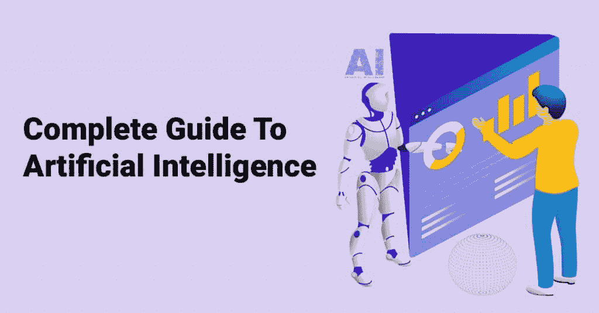
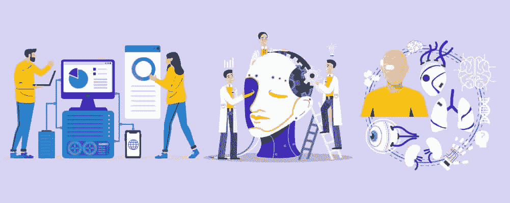
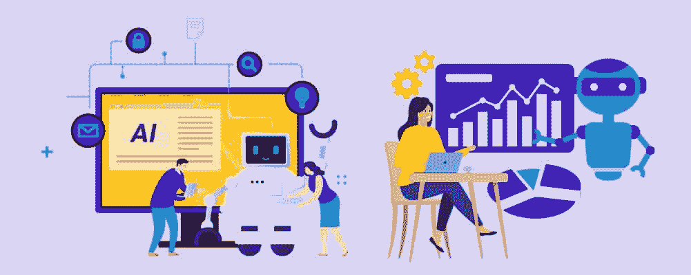
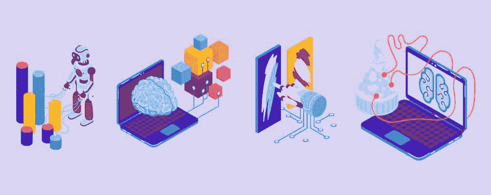

# 人工智能完全指南

> 原文：<https://pythonguides.com/complete-guide-to-artificial-intelligence/>

虽然人工智能被视为一种未来的科学技术，我们现在才刚刚进入这一领域，但它实际上从 20 世纪中期就已经存在了。

为了让人工智能(或 AI)成为一个概念，人们需要能够执行算术运算的数字电子机器——或我们所知的计算机。

要理解 AI，你需要知道它是如何工作的。但是要看到人工智能如何影响未来，你需要打破过去。今天我们将解释你需要知道的关于人工智能的一切，包括它的基本功能、进化、用法和好处。

目录

*   [什么是人工智能？](#What_Is_Artificial_Intelligence "What Is Artificial Intelligence?")
    *   [人工智能是如何工作的？](#How_Does_AI_Work "How Does AI Work?")
    *   [人工智能的种类](#Types_Of_AI "Types Of AI")
        *   [有限的内存](#Limited_Memory "Limited Memory")
        *   [无功机](#Reactive_Machines "Reactive Machines")
        *   [心理理论](#Theory_Of_Mind "Theory Of Mind")
        *   [自我意识](#Self-Awareness "Self-Awareness")
*   [人工智能的进化](#Evolution_Of_Artificial_Intelligence "Evolution Of Artificial Intelligence")
    *   [1943 年](#1943 "1943")
    *   [1949 年](#1949 "1949")
    *   [1950 年](#1950 "1950")
    *   [1951 年](#1951 "1951")
    *   [1956 年](#1956 "1956")
    *   [1958 年](#1958 "1958")
    *   [1959 年](#1959 "1959")
    *   [1964 年](#1964 "1964")
    *   [1965 年](#1965 "1965")
    *   [1969 年](#1969 "1969")
    *   [1973 年](#1973 "1973")
    *   [1974 年](#1974 "1974")
    *   [1980 年](#1980 "1980")
    *   [1991](#1991 "1991")
    *   [2005 年](#2005 "2005")
    *   [2008 年](#2008 "2008")
    *   [2011 年](#2011 "2011")
    *   [2014 年](#2014 "2014")
    *   [2016 年](#2016 "2016")
    *   [2018](#2018 "2018")
    *   [2020 年](#2020 "2020")
*   [人工智能什么时候用？](#When_Is_Artificial_Intelligence_Used "When Is Artificial Intelligence Used?")
    *   [窄 AI](#Narrow_AI "Narrow AI")
    *   [AGI](#AGI "AGI")
*   [使用人工智能的好处](#Benefits_Of_Using_Artificial_Intelligence "Benefits Of Using Artificial Intelligence")
    *   [时间效率](#Time_Efficiency "Time Efficiency")
    *   [多任务处理](#Multi-Tasking "Multi-Tasking")
    *   [减轻了工作量](#Eased_Workload "Eased Workload")
    *   [复杂任务的执行](#Execution_Of_Complex_Tasks "Execution Of Complex Tasks")
    *   [全天候运行](#Operates_247 "Operates 24/7")
    *   [提供更快、更智能的决策](#Provides_Faster_And_Smarter_Decision_Making "Provides Faster And Smarter Decision Making")
*   [总结](#Summary "Summary")

## **什么是人工智能？**

将人工智能分解为简单的元素，人工智能是一种能够像人类一样思考的程序。这意味着它可以模拟人类的智能，甚至模仿我们的行动。

人工智能计算机可能表现出的最普遍的特征是学习或解决问题的能力。这意味着你可以给机器一个问题，它可以在尝试和失败后克服它。

例如，一个机器人吸尘器可以在打扫时绘制你的平面图，知道墙壁在哪里，不会撞到它们。理解布局需要几次尝试，但很快就会了解你的平面图。

然而，大多数购物者和未来学家在谈论人工智能时考虑的概念是计算机的合理化能力。这意味着接受多个正确答案，并选择一个能够最好地完成目标或产生最少问题的答案。

例如，在电影《我是机器人》中，有一次撞车事故伤害了主角德尔·史普纳和一个有孩子的家庭。机器人救了斯布纳，因为他生还的可能性更大，而斯布纳认为道义上的选择是救那个孩子。

在这种科幻场景中，人工智能机器人可以合理选择最佳拯救对象。

### **AI 是如何工作的？**

但当然，那是一部电影，并没有展示 AI 目前在我们的世界中是如何工作的。

在现实中，人工智能系统将获得数据，大量的数据，并被告知扫描它并找到模式。该程序需要时间来理解数据，然后它会产生自己的版本。之后，它会将其创建与原始数据进行比较，然后创建一个比较测试。

例如，如果你给一台人工智能计算机输入泰勒·斯威夫特的歌曲，然后让它写一首歌，你最终会得到类似于泰勒·斯威夫特风格的音乐。

没有人工智能计算机处理的原始数据，它就无法创造最终目标。这意味着没有好的原始数据，AI 无法工作。它拥有的数据越多，就越准确。

这意味着仍然需要人类的互动来创造最终结果，人工智能无法形成尚未向其建议的概念。

### **AI 的种类**

一般来说，AI 有[四种。](https://www.linkedin.com/pulse/understanding-4-types-artificial-intelligence-ai-bernard-marr)

#### **有限的记忆**

有限记忆 AI 可能已经活跃在你的生活中了。这是一个人工智能系统，它从过去的经验中学习，并像百科全书一样积累知识。然后，人工智能使用这些历史数据来创建预测。

许多写作程序，如 Microsoft Word，会有工具为你提示句子的其余部分。这是一种有限记忆人工智能。

其“有限”名称的原因来自于存储的不足。为了确保快速响应，数据或历史不会存储在计算机的长期内存中。

#### **无功机**

反应式机器是第一种成功的人工智能，正因为如此，它们也是最基本的。这个人工智能程序不会从过去学习。如果你给它一个问题，它每次都会以同样的方式回应。

反应式机器的一个简单例子是计算器。它可以把你的计算加起来，每次都会给你同样的回答。但最近的一项发展向你展示了我们如何继续使用这项技术，这可以在流媒体公司的推荐系统中找到。

例如，[网飞](https://research.netflix.com/research-area/machine-learning)使用反应式机器学习来记录你看了哪些电视节目，从而推荐哪些节目。只需观看一场表演或一部电影，程序就会做出反应，并根据这些信息为您提供新的建议。

#### **论心性**

心智理论人工智能是人工智能世界中最有趣的概念之一——“我思故我在”。

在这个概念中，计算机能够与人类进行情感交流，甚至进行有意义的对话。为此，计算机需要理解人类语言的复杂性，包括语气、习语和抽象思维。它还需要像人类一样快速地创造决策思路，以保持对话速度。

最成功的心智理论 AI 系统是一个叫做[索菲亚](https://www.hansonrobotics.com/sophia/)的机器人。她可以识别面孔，有自己的面部表情，并且可以像和人说话一样自然地交谈。

#### **自我意识**

最高级的人工智能是有自我意识的。这是一个我们在科学界还没有成功创造的概念。

一个成功的有自我意识的人工智能会有欲望、情感和需求，就像人类一样。他们会意识到自己的情绪状态，并据此做出反应。

为了实现这一目标，科学家需要在机器人身上植入一种情感，然后让他们在这种情感、他们的欲望以及刺激如何影响这两者之间建立联系。

例如，“我没能完成一项工作，这让我觉得没有效率，没人要。”或者“我让人们笑了，所以我很开心。”

阅读[Python 编码指南](https://pythonguides.com/guide-to-python-coding/)

## **人工智能的进化**

人工生命并不是一个新概念。其实在[希腊神话](https://news.stanford.edu/2019/02/28/ancient-myths-reveal-early-fantasies-artificial-life/#:~:text=According%20to%20Homer's%20recounting%20of,moral%20implications%20of%20Hephaestus'%20creations.)中，有一个关于一个叫塔罗斯的青铜人的故事。塔洛斯是由希腊发明之神赫菲斯托斯建造的。塔罗斯被设计用来向敌舰投掷巨石，预测他们的行动，并找到最好的武器制造最大的伤害。

这个概念比第一台计算机早几个世纪就诞生了，但它显示了人类总是如何看待使用机器来为我们做事。

你可以说人工智能的开端始于使小说成为现实的技术成功，但我们不能忽视将概念带入生活的理论化和抽象的想法。

### **1943 年**

正如我们所知，人工智能可能源于几个世纪的创造性思维，但你可以说，走向人工智能的第一步来自沃尔特·皮茨和沃伦·麦卡洛。1943 年 12 月，两人发表了一篇名为《神经活动内在思想的逻辑演算》的论文。他们一起展示了大脑如何工作的理论公式。

沃尔特·皮茨是神经生理学家，沃伦·麦卡洛克是控制论专家。他们将各自的知识结合起来，产生了一个数学公式，展示了人工神经元如何像大脑的生物神经元一样工作，从而诞生了神经信息的概念。

### **1949 年**

仅 6 年后，心理学家唐纳德·赫布出版了《行为的组织:神经心理学理论》一书。

这本书侧重于神经科学和神经心理学。它进行了多年的研究，表明大脑既是一个控制身体的功能性器官，又包含高级情感和智力概念。

在这本书之前，这个想法无法得到证实。在书中，他展示了大脑中使用频率较高的神经元变得比其他神经元更强。现在被称为赫布定律的这本书指出:

当细胞 A 的一个轴突足够靠近并刺激细胞 B，并反复或持续参与 B 的放电时，一个或两个细胞就会发生一些生长过程或代谢变化，从而使 A 作为 B 放电细胞之一的效率增加。

或者“一起放电的神经元，连在一起”。

意思是说，我们在身体上做某件事的时候，往往同时设定了一个记忆或者学习经历。力学现在使用这个系统来复制人类的思想和反应。

同年，克劳德·香农在他的论文“[为下棋的计算机编程](https://www.tandfonline.com/doi/abs/10.1080/14786445008521796?journalCode=tphm18)中创建了一个允许计算机下棋的理论。

### **1950 年**

艾伦·图灵是历史课中第一个超越心理学和解剖学，将这些概念与计算机联系起来的人。从他的论文“[计算机械和智能](https://link.springer.com/chapter/10.1007/978-1-4020-6710-5_3)”开始，“图灵测试”诞生了。这个测试是用来看机器是否可以被认为是智能的。

这个测试很简单——你能说出一个问题的答案是计算机创造的吗？例如，如果你给某人 5 首诗，并要求他们挑出由 AI 创作的那首，而他们没有挑出 AI 生成的诗，那么可以认为 AI 是智能的。

同年，艾萨克·阿西莫夫出版了一本名为《我，机器人》的书，该书于 2004 年被改编成电影。在这本书里，有“机器人三定律”。虽然这是一部科幻小说，但许多在机器人行业工作的人认为这些法律是标准。他们是:

“第一定律——机器人不能伤害人类，也不能坐视人类受到伤害。

第二定律——机器人必须服从人类的命令，除非这些命令与第一定律相冲突。

第三定律——机器人必须保护自己的存在，只要这种保护不与第一或第二定律相冲突。"

### **一九五一年**

利用克劳德·香农的国际象棋理论，由迪恩·埃德蒙兹和马文·明克斯组成的哈佛大学本科生团队创造了第一台神经网络计算机。这意味着计算机像大脑一样工作，能够解决问题。

### **1956 年**

虽然在 1951 年到 1956 年之间发生了很多变化，但它们都重复了创始科学家已经知道的东西。直到约翰·麦卡锡发表了论文“[达特茅斯人工智能夏季研究项目](https://ojs.aaai.org/index.php/aimagazine/article/view/1904)”，我们才看到了另一个重大进展。

这篇论文创造了人工智能这个术语。这篇论文是基于一个 6 到 8 周的头脑风暴项目，在这个项目中数学家和科学家联合起来研究人工智能。在两个月的时间内，该小组创建了自然语言处理理论和计算理论。

### **1958 年**

利用这个研究项目，麦卡锡撰写了一篇名为“具有常识的程序”的研究论文。在这篇论文中，他开发了 Lisp 编程语言，这种语言允许计算机将语法与意义分开。这使得计算机能够跟随人类语言。

它还包含了一个关于计算机如何像我们一样从经验中学习的理论。麦卡锡创造了一种几乎是情感上的联系，而不是一种通过和失败的系统。

### **1959 年**

1959 年，约翰·麦卡锡和马文·明克斯创立了麻省理工学院人工智能项目。现在被称为[麻省理工学院思维机器项目](https://mindmachineproject.org/)，直到今天，麻省理工学院的这一领域创造了模拟思维的人工智能，可以将记忆作为学习体验，并可以像自然人体一样创造运动。

该项目的设立是为了让更多的科学家和学生从事人工智能领域的工作。

### **一九六四年**

美国政府于 1964 年成立了 ALPAC(自动语言处理咨询委员会)。该委员会由 7 名科学家组成，他们的目标是创造一台翻译机，帮助政府官员与世界各地的人们交流。无论如何，这是公开的解释，事实上，冷战倡议意味着翻译俄语变得势在必行。

该委员会一直持续到 1966 年，当时它自己的报告认为，在试图创造一台翻译机器之前，需要对计算语言学进行更多的基础研究。从根本上说，该委员会成立得太早了。

不幸的是，美国没有首先创建一个基础团队，而是决定彻底废除 ALPAC。这反过来导致所有政府资助的人工智能项目被取消。

### **一九六五年**

想要继续扩展人工智能学习，麦卡锡在斯坦福大学创办了[人工智能实验室](https://hai.stanford.edu/news/stanford-ais-legacy-through-decades)。

从这所大学颁发了人工智能奖学金，这创造了一个允许计算机生成的音乐和艺术发展的变革浪潮。斯坦福大学甚至创造了第一批早期机械臂。

早期的人工智能音乐不包含人声，但他们能够创建一致的基线音乐，这种音乐今天仍可以在键盘上找到。

### **一九六九年**

斯坦福大学继续扩张，1969 年，一个专家小组开发了一个使用人工智能诊断血液感染的系统。在爱德华·肖特利弗的领导下，发明了一种叫做[霉素](https://history-computer.com/mycin-expert-system-the-first-ai-medical-diagnosis/)的系统。它使用了[反向链接](https://www.techtarget.com/whatis/definition/backward-chaining#:~:text=Backward%20chaining%20is%20the%20logical,with%20its%20counterpart%2C%20forward%20chaining.)，这是一个使用逻辑寻找未知真相的过程。例如，计算机将拥有所有药物信息(也称为解决方案),并遵循药物的规则，使用排除过程来查看哪种药物可以治愈疾病，从而确定疾病是什么。

该系统能够比普通医生更快、更准确地提供准确的医疗建议。

### `1973`

1973 年，一份名为[莱特希尔报告](https://aitopics.org/doc/classics:D8235CF9/)的谴责性报告告知英国政府，对人工智能的学术研究进展不顺利。这份报告是由英国科学研究委员会进行的，它指出“迄今为止，该领域的任何发现都没有产生当时承诺的重大影响”。

这导致政府从大多数英国大学的人工智能研究中撤出资金。由于缺乏从事人工智能研究的聪明人，英国在人工智能技术方面落后于中国等顶尖高手。

该报告的最大问题是大型现实世界问题无法由人工智能程序解决。相反，他们只擅长解决小层次的问题。尽管这意味着进步正朝着正确的方向发展，但这对英国政府来说还不够。

### **1974 年**

这段时间被称为第一个人工智能冬天，因为莱特希尔的报告在西方世界产生了多米诺骨牌效应。由于给领先研究人员的资金减少，人工智能的进展出现了 6 年的干旱。

### **1980 年**

在人工智能领域五年毫无进展之后，R1 诞生了。现在被称为 XCON 的 R1 是由约翰·麦克德莫特创建的一个程序。这个系统创造了一种新型的自动化，允许制造商订购新的计算机系统并得到正确的部件。

举个例子，在科技行业，卖家对技术不在行，所有东西都要分开卖。如果你今天买了一台电脑，所有的东西都已经连接上了，但是从前，每一根电线都是单独给你的。销售人员经常会给客户错误的电缆，导致客户沮丧和额外的时间。

XCON 程序将项目与符合客户需求的订单同步。这减少了发送额外零件所浪费的时间和金钱。对这个软件有一个即时的投资，我们现在认为这是标准的做法。

你甚至可以说 XCON 是进入电子商务的第一步。

在 80 年代的剩余时间里，新的系统被制造出来，所有这些都需要更新和维护。由于更新需要额外的成本，许多公司又回到了纸笔管理模式。

### `1991`

由美国军方创建的一个名为 DART 的新人工智能程序诞生了。DART 代表动态分析和重新规划工具。该工具使用数据来处理和管理系统，以创建一个规划者。该计划可以通过多个访问点快速编辑，以确保军队官员可以看到每次行动的成本和移动，从而通过创建更合理的时间框架来降低成本。

尽管这项技术今天仍在使用，但它不足以赶走第二个人工智能冬天。

### `2005`

2005 年，无人驾驶汽车得到大力推广。为了让这些汽车正常工作，他们必须使用人工智能。从技术上来说，第一辆自动驾驶汽车出现在 1939 年的，但它使用磁力而不是人工智能来跟随道路。

美国国防部高级研究计划局(DARPA)希望建立一支无人驾驶军用车辆车队，并需要对这项技术进行研究。为此，谁能赢得大挑战比赛，谁就能获得 200 万美元的奖金。

昵称为斯坦德利的汽车赢得了比赛。它可以在地图上导航，并利用其人工推理技能实时穿越地图上的地形。斯坦福大学和大众电子研究实验室的 100 名研究人员、学生和机械师创造了斯坦德利。

完成全程有 10 个小时的限制，这场比赛有急转弯、许多障碍和陡峭的悬崖。在参赛的 22 辆车中，只有 4 辆能跑完全程。

### `2008`

从这一点开始，谷歌、苹果和亚马逊开始引领人工智能技术。大学或政府不再资助人工智能——而是由企业负责。

2008 年，谷歌成功开发了语音识别技术，让免提用户和盲人用户更容易获得技术。

### `2011`

2011 年，苹果发布了有史以来第一款 Siri——一款可以通过他们的 iOS 系统操作的人工智能助手。

谷歌紧随其后，通过 YouTube 创建了一种深度学习算法。神经网络系统能够在不知道猫是什么的情况下找到猫。这显示了深度学习的新水平。

它可以通过随机观看 YouTube 视频来做到这一点，其中一些视频包含猫。然后，当视频提到猫和它看到的图像时，它可以分离出来。在足够多的视频之后，在没有人类干预的情况下，它学会了什么被归类为猫。

### `2014`

2014 年，亚马逊将 Siri 系统开发成虚拟家庭助手 Alexa。允许用户通过语音激活来听音乐、开灯和搜索互联网。

谷歌还创造了有史以来第一辆可以通过美国驾驶考试的无人驾驶汽车。

### `2016`

2016 年，第一个机器人公民索菲亚被创造出来。她可以回应正常的对话，就好像她只是一个真人说话的扬声器。她有幽默感，能判断另一个人的情绪状态。

### `2018`

谷歌设法创造了一个自然语言处理器，使语言之间的翻译更容易。

### `2020`

在全球疫情期间，人工智能算法 LinearFold 被引入，以帮助预测病毒将如何变化和适应，从而使疫苗的制造速度比以前快 120 倍。

## **人工智能什么时候用？**

正如你从我们的人工智能简史中所看到的，人工智能工具有多种发展方式。从了解大脑功能的方式开始，到使工作生活富有成效，目前它正处于帮助人类完成日常任务的阶段——比如搜索 1 磅奶酪的克数，当你的手沾满面粉时使用语音命令。

一般来说，人工智能有两种使用方式:狭义人工智能系统和 AGI。

### **狭义艾**

狭义 AI 因其狭义用法而得名。这个程序可以很好地完成一项任务，但是它不能做其他任何事情。

事实上，它很好地完成了任务，以至于它看起来很聪明，然而，它的小技能意味着它有更多的限制。

我们日常使用的常见狭义 AI 系统包括搜索引擎和虚拟助手，如 Siri 和 Alexa。这些系统是商业上最成功的人工智能类型，通常由机器学习提供动力。

比如你的 Alexa，你用的越多，它就越能听懂你的口音。你用得越多，它就越能理解你的需求和问题。

所有这些系统都倾向于遵循一个真正的目标，比如找到某样东西。搜索引擎会找到含有你想要的信息的网站，虚拟助手也是如此。

### `AGI`

 **AGI 代表人工智能。也被称为“强人工智能”，这个术语指的是我们从科幻节目中期待的人工智能类型。机器人、超级计算机和可以解决几乎所有问题的技术。

AGIs 是人工智能研究社区正在瞄准但尚未达到的工具。索菲亚是最接近 AGI 点的技术，但没有其他技术可以声称是 AGI。

## **使用人工智能的好处**

随着人工智能的不断进步，你可能想知道这种假智能的意义何在。嗯，让我们的计算机进行更人性化的学习有很多好处，包括我们下面的 6 点。

### **时间效率**

让计算机承担平凡的任务让我们变得更有效率。自动化后，需要完成的重复性任务可以在更短的时间内完成。计算机不需要休息，可以完成无聊的任务而不会分心。他们每次也会以同样的标准完成任务。

### **多任务**

尽管许多人愿意相信，人类不能一心多用。这是因为当我们认为我们正在进行多任务处理时，我们实际上正在做一个小任务，然后切换到另一个小任务，然后又回来。我们没有同时做这些任务。

然而，计算机可以表现得好像它们同时有多个大脑。如果一个系统正在处理任务 A，另一个系统可以处理任务 B 来成功地进行多任务处理。然而，如果系统不够强大，不足以同时承担两项任务，它至少可以比我们更快地在两项任务之间切换。

这又创造了更高的效率。

### **减轻了工作量**

人工智能中最好的工具之一是能够将工作甚至整个任务分成更实际的工作负载。例如，执法部门可以根据他们发现的事实，使用人工智能来缩小嫌疑人名单。与没有这项技术相比，人工智能工具可以更快、更准确地从名单中排除嫌疑人。

一般来说，随着算法带走你工作中的平凡元素，比如将文件分类为“紧急”、“下周到期”等等，你的工作量将会增加。这意味着你不必花一上午的时间整理行政工作，就可以开始工作了。

### **执行复杂任务**

虽然人工智能可以高效率地完成简单的任务，但我们不能忽视它如何处理复杂的任务。例如，你可以有一个人工智能系统，它可以为你阅读大量的文书工作，并创建文件的摘要——本质上就像一个助手，告诉你在什么场合需要什么文件。

你的人工智能也可以比人类更快地找到模式并突出显示给你。这有助于更快地标记潜在问题，让您有更多的时间来解决问题。

### **全天候运转**

当然，与人类不同，计算机不需要休息。当然，你应该时不时地打开和关闭你的电脑，但这与人类正常工作和快乐所需的时间相比是微不足道的。

你的人工智能系统可以一年 365 天，一周 7 天，一天 24 小时都在运行，让你的系统保持有序，并对任何错误或问题保持高度警惕。

### **提供更快更智能的决策**

人类需要几小时或几分钟才能完成的事情，计算机几秒钟就能完成。普通任务和复杂任务由计算机完成比由人完成要快得多。

在纠正了打字错误、语法错误和口语误解后，即使像写作这样简单的事情也可能需要几分钟才能完成。对于一台计算机来说，“手指的滑动”不是一件事。他们不会浪费时间去纠正错误，因为根本没有错误。

## **汇总**

人工智能每年都有更多的发展。我们目前正在经历另一轮开发，因为虚拟助手、自动驾驶汽车和像索菲亚这样的创作正在不断地进行。

在人工智能的历史上，这种生产开始于大学，由世界各地的政府承担，现在在商业世界蓬勃发展。谷歌、苹果和亚马逊正在竞争，看谁能开发出下一个最好的东西。

你也可以跟随下面的人工智能教程:

*   [在熊猫中把整数转换成日期时间](https://pythonguides.com/convert-integers-to-datetime-in-pandas/)
*   [如何在 Python 中获得前 N 行熊猫数据帧](https://pythonguides.com/get-first-n-rows-of-pandas-dataframe/)
*   [如何在 Python Pandas 中向数据帧添加列](https://pythonguides.com/add-a-column-to-a-dataframe-in-python-pandas/)

[Bijay Kumar](https://pythonguides.com/author/fewlines4biju/)

Python 是美国最流行的语言之一。我从事 Python 工作已经有很长时间了，我在与 Tkinter、Pandas、NumPy、Turtle、Django、Matplotlib、Tensorflow、Scipy、Scikit-Learn 等各种库合作方面拥有专业知识。我有与美国、加拿大、英国、澳大利亚、新西兰等国家的各种客户合作的经验。查看我的个人资料。

[enjoysharepoint.com/](https://enjoysharepoint.com/)**