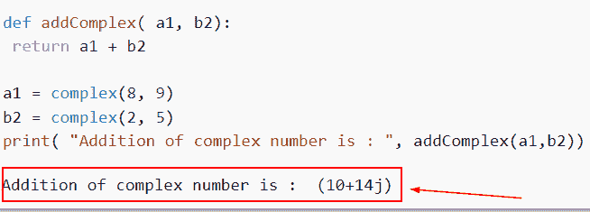

# Python 中的复数

> 原文：<https://pythonguides.com/complex-numbers-in-python/>

[](https://sharepointsky.teachable.com/p/python-and-machine-learning-training-course)

我们通常需要对数字数据类型执行计算，包括复数，无论是在[机器学习](https://pythonguides.com/machine-learning-using-python/)上工作，还是科学计算。所以在本教程中，我们将讨论如何用 Python 写一个 [Python](https://pythonguides.com/python-hello-world-program/) 程序来创建一个复数。我们还将讨论以下主题。

*   Python NumPy 中的复数
*   Python Scipy 中的复数
*   Python matplotlib 中的复数
*   Python 类中的复数
*   Python 中的复数虚数
*   Python 用户输入中的复数
*   复数 Python 实部
*   Python 中复数的加法
*   复数的 Python 幂
*   字符串 Python 中的复数
*   复数除法 Python
*   如何在 Python 中进行复数乘法
*   如何在 Python 中比较复数
*   如何在 Python 中对复数进行舍入

目录

[](#)

*   [Python 中的复数](#Complex_Numbers_in_Python "Complex Numbers in Python")
*   [Python NumPy 中的复数](#Complex_numbers_in_Python_NumPy "Complex numbers in Python NumPy")
*   [Python matplotlib 中的复数](#Complex_numbers_in_Python_matplotlib "Complex numbers in Python matplotlib")
*   [Python 中的复数虚数](#Complex_numbers_in_Python_imaginary "Complex numbers in Python imaginary")
*   [Python 用户输入的复数](#Complex_numbers_in_Python_user_input "Complex numbers in Python user input")
*   [复数 Python 实部](#Complex_number_Python_real_part "Complex number Python real part")
*   [Python 中复数的加法](#Addition_of_complex_numbers_in_Python "Addition of complex numbers in Python")
*   [Python 复数的幂](#Python_power_of_a_complex_number "Python power of a complex number")
*   [字符串 Python 中的复数](#Complex_number_in_string_Python "Complex number in string Python")
*   [复数除法 Python](#Complex_number_division_Python "Complex number division Python")
*   [如何在 Python 中进行复数乘法](#How_to_multiply_complex_numbers_in_Python "How to multiply complex numbers in Python")
*   [如何在 Python 中比较复数](#How_to_compare_complex_numbers_in_Python "How to compare complex numbers in Python")
*   [如何在 Python 中舍入复数](#How_to_round_complex_numbers_in_Python "How to round complex numbers in Python")

## Python 中的复数

*   当实部和虚部都给定时，complex()方法产生一个复数；否则，它将字符串转换为复数。
*   任何可以表示为 `(a+b j)` 的整数，其中 a 和 b 是实数，称为复数。在这种情况下，虚数 j 被定义为等于 `-1` 的平方根。
*   负数的平方根经常在涉及复数的计算中使用，复数通常成对出现。
*   通过简单地声明一个变量并分配一个(a+bj)类型的表达式，我们可以在 Python 中定义复数。这里，**“a”和“b”**应该是文字数字，而“j”可以是字母表中的任意字母。

**语法**:

下面是 Python 中的 `complex()` 函数的语法

```py
complex([real[, imag]])
```

示例:

让我们举个例子，看看如何用 Python 创建一个复数

```py
complex_number = 7+5j
print('Type of complex number is',type(complex_number))
```

如果不使用 complex()方法，可以产生一个复数。为此，您必须在数字后面加上“j”或“j”

下面是以下代码的截图


Complex Numbers in Python

这就是我们如何用 Python 创建一个复数程序，并且我们已经检查了数据类型。

阅读:[蟒蛇皮里的熊猫](https://pythonguides.com/pandas-in-python/)

## Python NumPy 中的复数

*   这里我们将讨论如何使用 NumPy Python 创建一个复数。
*   为了执行这个特定的任务，我们将使用 `np.zeros()` 函数 `numpy.zeros()` 函数是机器学习程序中经常使用的最重要的函数之一。为了创建一个零数组，使用这个函数。
*   函数的作用是:创建一个完全由零组成的指定类型和形式的新数组。

**举例**:

```py
import numpy as np
# Creation of complex number
Z = np.zeros(8, dtype=complex)
# Display the Result
print(Z)
```

你可以参考下面的截图


Complex numbers in Python NumPy

在这个例子中，我们已经讨论了如何使用 NumPy 库创建一个复数。

阅读:[什么是 Matplotlib](https://pythonguides.com/what-is-matplotlib/)

## Python matplotlib 中的复数

*   **“x+易”**用来表示复数。使用复杂函数，Python 将实数 x 和 y 转换为复数(x，y)。函数 *`real()`* 可以用来检索实部，imag 可以用来表示虚部()。
*   您可以在极坐标图上绘制复数。如果你有一个复数列表。

**举例**:

```py
import matplotlib.pyplot as plt
import numpy as np

# Creating of array by assigning complex numbers
numbers = np.array([2+6j, 5+9j, 1-2j, -4+9j, 7+2j, 1+9j])

# Real part
real = numbers .real
# Imaginary part
imag = numbers .imag

# plot the complex numbers
plt.plot(real, imag, 'g*')
plt.ylabel('Imaginary')
plt.xlabel('Real')
plt.show()
```

下面是以下给定代码的实现。


Complex numbers in Python matplotlib

这就是我们如何通过使用 matplotlib 在 Python 中创建复数。

阅读:[什么是 Python Django，用于](https://pythonguides.com/what-is-python-django/)

## Python 中的复数虚数

*   复数的虚部等于实数乘以 I。
*   对于困难的数字数学任务，Python 包括一个内置模块，您可以轻松地使用 cmath 模块。
*   这个模块的方法接受 int、float 和 complex 值作为输入。它甚至支持 Python 对象的**复杂**()和**浮动**()方法。
*   这个模块中的函数通常总是返回一个复数。如果返回值可以写成实整数，返回值的虚部等于 0。cmath 模块中提供了几个方法和常数。

**举例**:

```py
import cmath
# Declaring integer numbers
m = 8
n = 7

# converting m and n into complex number by using complex() function
z = complex(m,n);
print(z)
# Displaying imaginary part
print ("The imaginary part of complex number is : ",z.imag)
```

下面是以下给定代码的实现


Complex numbers in Python imaginary

正如你在截图中看到的，我们已经讨论了如何提取复数中的虚部。

阅读:[Python 中的 tensor flow](https://pythonguides.com/tensorflow/)

## Python 用户输入的复数

*   用户可以使用 Python 输入数据。因此，我们可以请求用户输入。
*   在本例中，我们刚刚使用了输入函数。在 Python 中， `input()` 和 print()函数用于接收用户的输入，并产生显示在屏幕上的输出。
*   用户可以通过使用 `input()` 功能以文本或数字的形式向应用程序提供任何信息。

**举例**:

让我们举一个例子，看看如何从输入值使用输入函数，得到复数。

```py
complx = complex(input("Enter the value:-"));
print(complx)
```

下面是下面给出的代码的截图。


Complex numbers in Python user input

这就是我们如何通过接受用户的输入来创建一个复数程序

阅读:[Python 中的 Scikit 学的是什么](https://pythonguides.com/what-is-scikit-learn-in-python/)

## 复数 Python 实部

*   在本节中，我们将讨论如何提取 Python 复数中的实数部分。
*   要找到复数的实部我们可以很容易地使用 *`real()`* 函数的概念。
*   这个模块中的函数通常总是返回一个复数。如果返回值可以写成实整数，返回值的虚部等于 0。cmath 模块中提供了几个方法和常数。

**举例**:

```py
import cmath
# Declaring integer numbers
z = 4
x = 9

# converting m and n into complex number by using complex() function
y = complex(z,x);
print(y)
# Displaying imaginary part
print ("The real part of complex number is : ",y.real)
```

在本例中，我们声明了两个变量并为它们分配了整数值，然后使用了 *`complex()`* 函数。在该函数中，我们传递了两个输入变量，它将显示复数。

现在我们想从复数中提取实数部分，为此我们使用了 *`real()`* 函数。

下面是以下给定代码的实现。


Complex number Python real part

这就是我们如何在 Python 中从复数中得到实部。

阅读:[py torch 是什么以及如何使用它](https://pythonguides.com/what-is-pytorch/)

## Python 中复数的加法

*   复数就是那些表达式写成 a+bi 的数，其中 a 和 b 是实数，I 是虚数。
*   为了执行这个特定的任务，我们首先定义了函数 `addcomplex()` ，在这个函数中，我们分配了两个变量，在这两个变量中我们分配了整数。

**举例**:

```py
def addComplex( a1, b2):
 return a1 + b2

a1 = complex(8, 9)
b2 = complex(2, 5)
print( "Addition of complex number is : ", addComplex(a1,b2))
```

现在，为了添加两个复数，我们使用了+运算符，它将添加两个输入变量。

你可以参考下面的截图。



Addition of complex numbers in Python

这就是我们如何在 Python 中将两个输入复数相加。

阅读:[如何使用 Turtle 在 Python 中绘制形状](https://pythonguides.com/turtle-programming-in-python/)

## Python 复数的幂

*   内置的 `pow()` 或二进制取幂运算符 `(`)** 都可以用于对复数进行幂运算，但不能用于 math 模块的版本，它只支持浮点值。
*   一个数的幂表示它应该乘以多少倍。幂的其他名称包括指数和指数。例如，6^2 可以被称为“6 的平方”，“6 的 2 次方”
*   在本例中，我们声明了两个变量并为它们分配了整数值，然后使用了 complex()函数。在该函数中，我们传递了两个输入变量，它将显示复数。

**举例**:

```py
import cmath
# Declaring integer numbers
p = 4
q = 9

# converting m and n into complex number by using complex() function
y = complex(p,q);
print(y)
# Displaying the power of a complex number
print ("power of complex number is : ",y**2)
```

你可以参考下面的截图。


Python power of a complex number

正如你在截图中看到的，我们在 Python 中得到一个复数的幂。

阅读: [Python 字典方法+示例](https://pythonguides.com/python-dictionary-methods/)

## 字符串 Python 中的复数

*   这里我们将讨论如何使用 Python 字符串格式的复数。
*   要执行此任务，我们将使用 complex()函数，并且要从数字或字符串创建复数，请使用 Python 中的 complex()函数。该函数返回一个复数，并接受两个可选参数。第一个参数称为实部，第二个参数称为虚部。

**例**:

```py
complex_number = ('7+5j')
print('Type of complex number is',type(complex_number))
```

如果不使用 complex()方法，可以产生一个复数。为此，您必须在数字后面加上“j”。在本例中，我们将使用字符串复数，然后使用 type()函数获取输入数字的数据类型。

下面是以下给定代码的执行。


Complex number in string Python

正如你在截图中看到的，我们已经讨论了如何使用 Python 字符串格式的复数。

阅读:[如何在 Python 中创建列表](https://pythonguides.com/create-list-in-python/)

## 复数除法 Python

*   在 Python 中，复数可以使用/运算符进行除法运算，它将第一个操作数除以第二个元素。
*   在本例中，我们使用了两个变量，并通过使用 complex()函数将它们转换为一个复数。接下来，我们将对给定的复数进行除法运算。

**举例**:

让我们举个例子，了解一下 Python 中复数的除法。

**源代码**:

```py
def complex( y1, y2):
 return y1 / y2

y1 = complex(3, 6)
y2 = complex(2, 3)

print( "Division of given complex number :", (complex(y1, y2))) 
```

你可以参考下面的截图


Complex number division Python

在这个例子中，我们了解了如何在 Python 中划分复数输入。

阅读: [Python 字典追加](https://pythonguides.com/python-dictionary-append/)

## 如何在 Python 中进行复数乘法

*   在这一节中，我们将讨论如何在 Python 中进行复数乘法。
*   这里我们将使用*运算符来计算两个复数的乘积。在 Python 乘法中，我们使用星号运算符将两个数相乘。

**举例**:

让我们举个例子，了解一下 Python 中的复数乘法。

```py
def complex( y1, y2):
 return y1 * y2

y1 = complex(3, 6)
print(y1)
y2 = complex(2, 3)
print(y2)

print( "Multiplication of given complex number :", (complex(y1, y2)))
```

在本例中，我们通过使用 complex()函数使用了两个复数，然后使用*运算符来计算两个输入数字的乘积。

下面是以下给定代码的实现。


How to multiply complex numbers in Python

这就是我们如何通过使用*运算符在 Python 中乘以复数。

阅读:[如何在 Python 中反转一个数字](https://pythonguides.com/reverse-a-number-in-python/)

## 如何在 Python 中比较复数

*   让我们讨论一下如何在 Python 中比较两个复数。
*   为了执行这个特定的任务，首先我们将声明两个变量并分配复数，然后为了比较复数，我们将使用==运算符。
*   关系运算符通常称为比较运算符，其目的是根据操作数的值返回 true 或 false。

**举例**:

```py
complex_num1 = 10+3j
complex_num2 = 40+6j
print(complex_num1 == complex_num2)
```

下面是以下代码的截图


How to compare complex numbers in Python

在这个例子中，我们已经理解了如何在 Python 中比较复数。

阅读: [Python 方块一号](https://pythonguides.com/python-square-a-number/)

## 如何在 Python 中舍入复数

*   在这一节中，我们将讨论如何在 Python 中对复数进行舍入。
*   为了完成这个任务，我们将使用 round()函数，Python 自带了一个名为 round()的内置函数。它将为您提供一个浮点数作为回报，四舍五入到输入的小数点。
*   如果未提供要舍入的小数位数，它将舍入到最接近的整数，该整数被视为 0。

**举例**:

我们举个例子，看看在复数的情况下，如何得到四舍五入的数字。

**源代码**:

```py
m = 8.45 + 7.56j
round(m.real, 1) + round(m.imag, 1) * 1j
```

下面是以下给定代码的实现


How to round complex numbers in Python

这就是我们如何在 Python 中获得复数数据类型的整数。

您可能也喜欢阅读以下 Python 教程。

*   [Python 内置函数](https://pythonguides.com/python-built-in-functions/)
*   [获取当前目录 Python](https://pythonguides.com/get-current-directory-python/)
*   [Python 加法示例](https://pythonguides.com/python-addition/)
*   [Python 中的乘法与例题](https://pythonguides.com/multiply-in-python/)

在本文中，我们讨论了如何以不同的方式和方法在 Python 中创建复数程序。此外，我们还讨论了以下主题。

*   Python NumPy 中的复数
*   Python Scipy 中的复数
*   Python matplotlib 中的复数
*   Python 类中的复数
*   Python 中的复数虚数
*   Python 用户输入中的复数
*   复数 Python 实部
*   Python 中复数的加法
*   复数的 Python 幂
*   字符串 Python 中的复数
*   复数除法 Python
*   如何在 Python 中进行复数乘法
*   如何在 Python 中比较复数
*   如何在 Python 中对复数进行舍入

[Arvind](https://pythonguides.com/author/arvind/)

Arvind 目前是 TSInfo Technologies 的高级 Python 开发人员。他精通 Python 库，如 NumPy 和 Tensorflow。