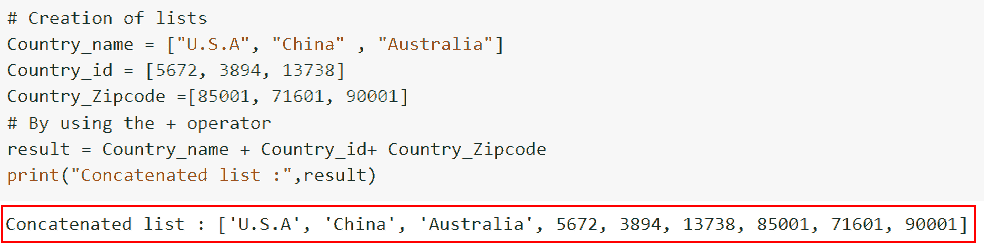
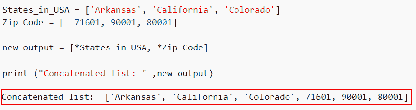
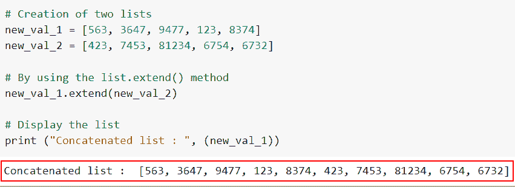
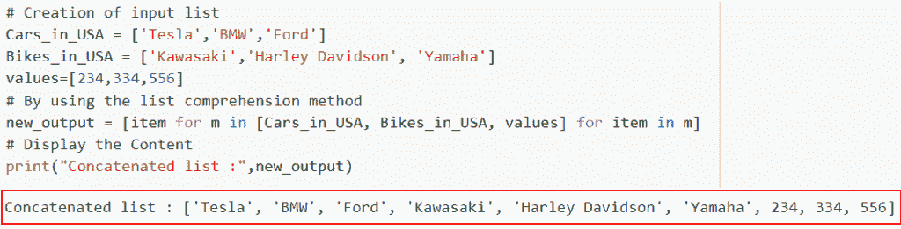
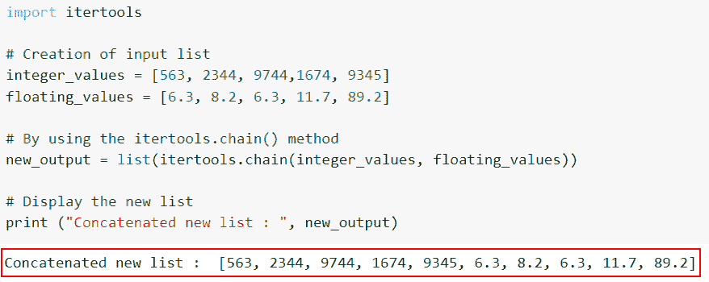
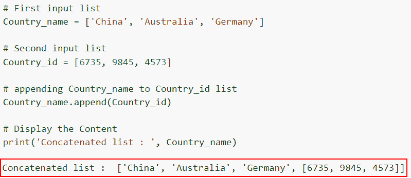

# 在 Python 中连接多个列表

> 原文：<https://pythonguides.com/concatenate-multiple-lists-in-python/>

[](https://sharepointsky.teachable.com/p/python-and-machine-learning-training-course)

在这个 [Python 教程](https://pythonguides.com/beginners-guide-to-programming/)中，我们将探索如何在 Python 中组合两个或多个列表，并且我们还将了解在 Python 中连接多个列表的几种技术。

作为一名开发人员，在制作 Python 项目时，我得到了在 Python 中组合两个或更多列表的需求。

在这里我们将看到:

*   如何在 Python 中使用+运算符连接多个列表
*   在 Python 中使用*运算符连接多个列表
*   如何在 Python 中使用 extend()连接多个列表
*   使用列表理解方法在 Python 中连接多个列表
*   如何使用 itertools.chain()在 Python 中连接多个列表
*   如何在 Python 中使用 append()连接多个列表

将一个列表的组件连接到另一个列表的末尾的过程称为串联。让我们看看如何使用 Python 中的不同技术连接两个或多个列表。

目录

[](#)

*   [Python 中连接多个列表的方法](#Methods_to_Concatenate_multiple_lists_in_Python "Methods to Concatenate multiple lists in Python")
    *   [如何在 Python 中使用+运算符连接多个列表](#How_to_Concatenate_multiple_lists_in_Python_using_operator "How to Concatenate multiple lists in Python using + operator")
    *   [使用*操作符](#Concatenate_multiple_lists_in_Python_using_operator " Concatenate multiple lists in Python using * operator")在 Python 中连接多个列表
    *   [如何在 Python 中使用 extend()](#How_to_Concatenate_multiple_lists_in_Python_using_extend "How to Concatenate multiple lists in Python using extend()") 连接多个列表
    *   [使用列表理解方法在 Python 中连接多个列表](#Concatenated_multiple_lists_in_Python_using_list_comprehension_method "Concatenated multiple lists in Python using list comprehension method")
    *   [如何使用 itertools.chain()](#How_to_Concatenate_multiple_lists_in_Python_using_itertoolschain "How to Concatenate multiple lists in Python using itertools.chain() ") 在 Python 中连接多个列表
    *   [如何在 Python 中使用 append()](#How_to_Concatenate_multiple_lists_in_Python_using_append "How to Concatenate multiple lists in Python using append()") 连接多个列表

## Python 中连接多个列表的方法

在 Python 中，有许多将列表连接在一起的方法。我们将介绍如何在 Python 中使用加号操作符、列表理解和乘法操作符连接两个列表。

### 如何在 Python 中使用+运算符连接多个列表

*   在这一节中，我们将讨论如何使用 `+` 操作符在 Python 中连接多个列表。
*   这是最简单的连接方法。在这个过程中，创建了两个或更多列表的连接，然后将输出放在一个新的变量中。
*   两个列表可以用 `"+"` 操作符连接在一起。它通过将一个列表附加到另一个列表的末尾来创建一个新的列表作为输出。

**语法**:

以下是+运算符的语法。

```py
List1 + List2 + .... + ListN
```

**举例:**

让我们看一个例子，并检查如何使用 `+` 操作符在 Python 中连接多个列表。

**源代码:**

```py
**# Creation of lists** 
Country_name = ["U.S.A", "China" , "Australia"]
Country_id = [5672, 3894, 13738]
Country_Zipcode =[85001, 71601, 90001]

**# By using the + operator** 
result = Country_name + Country_id+ Country_Zipcode

**# Display the Content**
print("Concatenated list :",result)
```

在下面给出的代码中，我们首先用[]括号初始化了三个输入列表。接下来，我们通过使用 **'+'** 操作符来连接给定的列表。

下面是以下给定代码的实现。



Concatenated three lists by using the + operator

这就是如何在 Python 中使用+运算符连接多个列表。

阅读: [Python 列表方法](https://pythonguides.com/python-list-methods/)

### 使用*操作符在 Python 中连接多个列表

*   这里，我们将讨论如何使用 Python 中的 `*` 操作符在 Python 中连接多个列表。
*   Python **'*'** 运算符使得提取任何数据类型的一组对象变得更加容易。当您使用 `"*"` 操作符连接任意数量的列表时，将返回结果列表。

**举例**:

让我们举一个例子，看看如何使用 Python 中的 `*` 操作符在 Python 中连接多个列表。

**源代码:**

```py
States_in_USA = ['Arkansas', 'California', 'Colorado'] 
Zip_Code = [71601, 90001, 80001] 

new_output = [*States_in_USA, *Zip_Code] 

print ("Concatenated list: " ,new_output) 
```

在上面的代码中，我们首先声明了两个列表，然后用 `*` 操作符将这些列表组合起来，结果将返回连接的列表。

你可以参考下面的截图。



Concatenated three lists by using the * operator

在这个例子中，我们已经理解了如何使用 `*` 操作符在 Python 中连接多个列表。

阅读: [Python 连接列表](https://pythonguides.com/python-concatenate-list/)

### 如何在 Python 中使用 extend() 连接多个列表

*   Python 中的两个列表可以使用 `extend()` 技术连接起来。 `extend()` 函数在遍历提供的参数后将元素添加到列表中。
*   这个方法是 Python 中的一个内置函数，这个函数很容易迭代一个可迭代的**(字符串、元组、列表、集合或字典)**，并通过使用 `list.extend()` 方法将每个条目添加到输入列表的末尾。

**语法:**

让我们看看语法，理解 Python 中 extend()方法的工作原理。

```py
list.extend(iterable)
```

**注意:**提供一个 iterable 参数是必不可少的，可以是集合、元组、列表。List `extend()` 将元素添加到已经存在的列表中，但不返回任何值。

**举例**:

这里我们将举一个例子，并理解如何使用 extend 方法在 Python 中连接多个列表。

**源代码**:

```py
**# Creation of two lists** 
new_val_1 = [563, 3647, 9477, 123, 8374]
new_val_2 = [423, 7453, 81234, 6754, 6732]

**# By using the list.extend() method**
new_val_1.extend(new_val_2)

**# Display the list**
print ("Concatenated list : ", (new_val_1))
```

在上面的代码中，我们首先创建了两个输入列表，然后使用 `extend()` 函数连接两个输入列表。

下面是以下给定代码的执行。



Concatenated three lists by using the extend method

正如你在截图中看到的，我们已经讨论了如何使用 extend 方法在 Python 中连接多个列表。

阅读:[如何在 Python 中反转一个列表](https://pythonguides.com/reverse-a-list-in-python/)

### 使用列表理解方法在 Python 中连接多个列表

*   列表理解是 Python 中连接两个列表的不同方式。基本上，列表理解包括基于已经存在的列表创建一个元素列表。
*   使用 list comprehension 可以从任何现有的 iterable 对象以简单的方式生成一个列表，并以不同的方式使用`for`循环创建列表。

**语法:**

下面是 Python 中连接列表的列表理解方法的语法。

```py
n for m in [list1, even_numbers] for n in m
```

**举例:**

让我们举一个例子，检查如何使用 list comprehension 方法在 Python 中连接多个列表。

**源代码:**

```py
**# Creation of input list**
Cars_in_USA = ['Tesla','BMW','Ford']
Bikes_in_USA = ['Kawasaki','Harley Davidson', 'Yamaha']
values=[234,334,556]
**# By using the list comprehension method**
new_output = [item for m in [Cars_in_USA, Bikes_in_USA, values] for item in m]
**# Display the Content**
print("Concatenated list :",new_output)
```

在上面的代码中，我们首先创建了一个名为“Cars_in_USA”、“Bikes_in_USA”和“values”的输入列表。接下来，我们组合这些输入列表，并将它们存储在一个“new_output”变量中。

下面是下面给出的代码的截图。



By using the list comprehension method we can easily combine multiple lists

这就是如何使用列表理解方法在 Python 中连接多个列表。

阅读:[如何在列表中添加字符串 Python](https://pythonguides.com/add-string-to-list-python/)

### 如何使用 itertools.chain() 在 Python 中连接多个列表

*   在这一节中，我们将讨论如何使用 `itertools.chain()` 方法在 Python 中连接多个列表。
*   `itertools.chain()` 方法从各种可迭代的数据中提取线性的项目序列，比如列表、字符串、元组等。
*   它基本上从所有的可迭代对象中创建一个序列，并向该序列返回一个迭代器。

**语法:**

让我们看一下语法并理解 Python 中 itertools.chain()方法的工作原理。

```py
itertools.chain(list1, list2, ...., listN)
```

> **注意:**在这个例子中，iterable 将是输入列表。

**举例:**

这里我们将举一个例子，检查如何使用`*ITER tools . chain()*`方法在 Python 中连接多个列表。

**源代码:**

```py
 import itertools

**# Creation of input list** 
integer_values = [563, 2344, 9744,1674, 9345]
floating_values = [6.3, 8.2, 6.3, 11.7, 89.2]

**# By using the itertools.chain() method**
new_output = list(itertools.chain(integer_values, floating_values))

**# Display the new list**
print ("Concatenated new list : ", new_output)
```

在下面给出的代码中，我们首先导入 itertools 模块，然后创建输入列表，然后使用 **itertools.chain()方法**，在这个方法中，我们将输入列表作为参数传递。

你可以参考下面的截图。



How to Concatenate multiple lists in Python by using the itertools chain method

阅读:[如何将列表追加到另一个列表中](https://pythonguides.com/python-append-list-to-another-list/)

### 如何在 Python 中使用 append() 连接多个列表

*   在这个例子中，我们将讨论如何使用 Python 中的 `append()` 方法连接多个列表。
*   Python 中的 `append()` 方法向列表的末尾添加一个新项目。通过更新列表，它添加了一个元素。方法不会自动返回。

**语法:**

下面是 Python 中 `list.append()` 方法的语法。

```py
list.append(item)
```

> **注意:**item 参数定义了要添加到列表末尾的元素。

**举例:**

```py
**# First input list** 
Country_name = ['China', 'Australia', 'Germany']

**# Second input list** 
Country_id = [6735, 9845, 4573]

**# appending Country_name to Country_id list**
Country_name.append(Country_id)

**# Display the Content** 
print('Concatenated list : ', Country_name)
```

在下面给出的代码中，我们创建了两个输入列表，然后为了连接列表，我们使用了 `list1.append(list2)` 方法，它将显示组合列表。

下面是以下给定代码的实现。



How to Concatenate multiple lists in Python by using the append method

您可能也喜欢阅读以下 Python 教程。

*   [如何在 Python 列表的末尾插入项目](https://pythonguides.com/insert-item-at-end-of-python-list/)
*   [如何在 Python 列表中找到最小的数字](https://pythonguides.com/find-smallest-number-in-a-python-list/)
*   [如何在 Python 中从列表中获取字符串值](https://pythonguides.com/how-to-get-string-values-from-list-in-python/)
*   [如何在 Python 中从列表中获取唯一值](https://pythonguides.com/get-unique-values-from-list-python/)

在本 Python 教程中，我们介绍了在 Python 中连接两个列表的六种方法:**加**、**列表理解方法**、**乘**、**追加()**、 `itertools.chain()` 和**扩展()**。

*   如何在 Python 中使用+运算符连接多个列表
*   在 Python 中使用*运算符连接多个列表
*   如何在 Python 中使用 extend()连接多个列表
*   使用列表理解方法在 Python 中连接多个列表
*   如何使用 itertools.chain()在 Python 中连接多个列表
*   如何在 Python 中使用 append()连接多个列表

[Arvind](https://pythonguides.com/author/arvind/)

Arvind 目前是 TSInfo Technologies 的高级 Python 开发人员。他精通 Python 库，如 NumPy 和 Tensorflow。