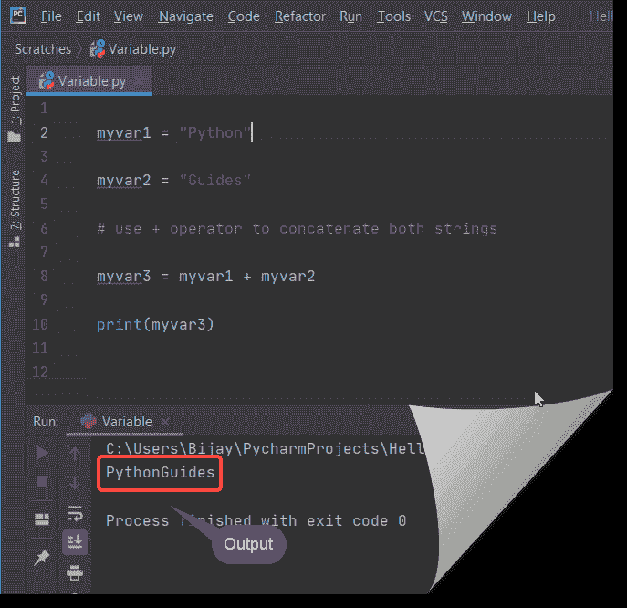
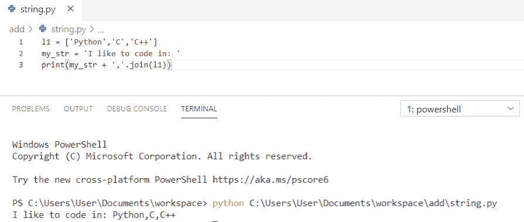

# 如何在 python 中连接字符串

> 原文：<https://pythonguides.com/concatenate-strings-in-python/>

[](https://sharepointsky.teachable.com/p/python-and-machine-learning-training-course)

在这个 python 教程中，我们将讨论**如何在 python** 中连接字符串。

我们还将在这里讨论以下主题

*   如何在 python 中连接两个字符串？python 里可以加两个字符串吗？
*   如何在 python 中连接字符串和 int
*   如何在 python 中连接列表或连接字符串 python 列表
*   Python 在列表中连接字符串
*   Python 在 for 循环中连接字符串
*   Python 在 print 语句中连接字符串
*   Python 用分隔符连接字符串
*   Python 用空格连接字符串
*   Python 将字符串连接成多行
*   Python 连接字符串和数字
*   Python 连接字符串和浮点
*   Python 连接字符串和列表
*   Python 连接字符串和字节
*   Python 连接字符串数组
*   Python 通过逗号连接字符串
*   Python 添加字符串开头
*   Python 字符串添加反斜杠
*   Python 字符串串联最佳实践
*   如何在 python 中连接两个列表
*   如何用 python 连接两个字典
*   如何用 python 连接字典
*   如何在 python 中连接字符串和变量

你是 Python 新手吗？查看基本的两个教程 [Python 下载和安装步骤](https://pythonguides.com/python-download-and-installation/)和 [Python Hello World 程序](https://pythonguides.com/python-hello-world-program/)

目录

[](#)

*   [如何在 python 中连接字符串](#How_to_concatenate_strings_in_python "How to concatenate strings in python")
    *   [1-使用+运算符](#1-_Using_operator "1- Using + operator")
    *   [2-使用 join()方法](#2-_Using_join_method "2- Using join() method")
    *   [3-使用%运算符](#3-_Using_Operator "3- Using % Operator")
    *   [4-使用 format()函数](#4-_Using_format_function "4- Using format() function")
*   [如何在 python 中连接字符串和 int](#How_to_concatenate_strings_and_int_in_python "How to concatenate strings and int in python")
    *   [1-使用 str()函数](#1-_Using_str_function "1- Using str() function")
    *   [2-使用%运算符](#2-_Using_Operator "2- Using % Operator")
    *   [3-使用 format()函数](#3-_Using_format_function "3- Using format() function")
    *   [4-使用 f 弦](#4-_Using_f_strings "4- Using f strings")
*   如何在 python 中连接列表，或者如何将多个列表合并到一个 python 中？
    *   [1-使用 for 循环](#1-_Using_for_loop "1- Using for loop")
    *   [2-使用+运算符](#2-_Using_operator "2- Using + operator")
    *   [4-使用*运算符](#4-_Using_operator "4- Using * operator")
*   [Python 将字符串串联成一个列表](#Python_concatenate_strings_in_a_list "Python concatenate strings in a list")
*   [Python 在 for 循环中串联字符串](#Python_concatenate_strings_in_for_loop "Python concatenate strings in for loop")
*   [Python 在打印语句中连接字符串](#Python_concatenate_strings_in_the_print_statement "Python concatenate strings in the print statement")
*   [Python 用分隔符连接字符串](#Python_concatenate_strings_with_a_separator "Python concatenate strings with a separator")
*   [Python 用空格连接字符串](#Python_concatenate_strings_with_space "Python concatenate strings with space")
*   [Python 串联多行字符串](#Python_concatenate_strings_multiple_lines "Python concatenate strings multiple lines")
*   [Python 连接字符串和数字](#Python_concatenate_strings_and_numbers "Python concatenate strings and numbers")
*   [Python 连接字符串和浮点数](#Python_concatenate_string_and_float "Python concatenate string and float")
*   [Python 连接字符串和列表](#Python_concatenate_strings_and_list "Python concatenate strings and list")
*   [Python 连接字符串和字节](#Python_concatenate_strings_and_bytes "Python concatenate strings and bytes")
*   [Python 串接字符串数组](#Python_concatenate_strings_array "Python concatenate strings array")
*   [Python 通过逗号连接字符串](#Python_join_strings_by_comma "Python join strings by comma")
*   [Python 添加字符串开头](#Python_add_string_beginning "Python add string beginning")
*   [Python 字符串加一个反斜杠](#Python_string_add_a_backslash "Python string add a backslash")
*   [Python 字符串串联最佳实践](#Python_string_concatenation_best_practice "Python string concatenation best practice")
*   [如何用 python 连接两个字典](#How_to_concatenate_two_dictionaries_in_python "How to concatenate two dictionaries in python")

## 如何在 python 中连接字符串

现在，让我们看看**如何在 python 中串联字符串**，如何在 python 中串联两个字符串。python 里可以加两个字符串吗？

是的，我们可以添加或连接字符串。有多种方法来连接字符串。所有方法见下文。

### 1-使用+运算符

使用 **+操作符是**在 python 中**连接字符串最常见的方式。您可以使用此运算符连接两个字符串。**

如果使用 **+运算符**进行连接，参数应该是字符串。

**举例:**

```py
myvar1 = "Python"

myvar2 = "Guides"

# use + operator to concatenate both strings

myvar3 = myvar1 + myvar2

print(myvar3)
```

输出将是

```py
PythonGuides
```

让我们运行上面的代码，看看输出



How to concatenate strings in python

这里需要注意的一点是 python 不支持隐式字符串转换。如果您试图将一个**字符串与一个非字符串类型**连接起来，那么它将抛出一个错误

让我们检查一下这个

```py
myvar1 = 3

myvar2 = "Python"

myvar3 = myvar1 + myvar2 

print(myvar3)
```

输出将是一个错误**"类型错误:不支持+: 'int '和' str '的操作数类型"。**

```py
myvar3 = myvar1 + myvar2
TypeError: unsupported operand type(s) for +: 'int' and 'str'
```

看这里


### 2-使用 join()方法

您可以使用 `join()` 方法连接字符串。

示例:

```py
myvar1 = "Python"

myvar2 = "Guides"

# use join() to concatenate both strings

myvar3 = "".join([myvar1, myvar2])

print(myvar3)
```

输出将是

```py
PythonGuides
```

看这里


你可能会喜欢，[如何在 Python 中加两个数](https://pythonguides.com/add-two-numbers-in-python/)和[如何在 Python 中加两个变量](https://pythonguides.com/add-two-variables-in-python/)。

### 3-使用%运算符

我们也可以使用 **%操作符**连接字符串

%运算符也可用于格式化字符串。

例如:

```py
myvar1 = "Python"

myvar2 = "Guides"

# use % operator to concatenate both strings

print("% s % s"%(myvar1,myvar2))
```

在上面的示例中，我们使用了两个%s，这表明 myvar1 和 myvar2 包含字符串数据类型。

输出将是

```py
Python Guides
```

看这里


### 4-使用 format()函数

我们还可以使用 **format()函数**连接字符串。它允许我们使用位置格式连接字符串。

{ }(花括号)与这个 **format()函数**一起使用来定位字符串。每个字符串都有一个{ }(花括号)。

示例:

```py
myvar1 = "Python"

myvar2 = "Guides"

# use format() to concatenate both strings

print("{}{}".format(myvar1, myvar2))
```

输出将是

```py
PythonGuides
```

看这里


## 如何在 python 中连接字符串和 int

在 Python 中，我们不能使用+运算符来连接一个字符串和 int 类型。我们不能将字符串与非字符串类型连接在一起。它将抛出一个错误**“type error:不支持+: 'int '和' str '的操作数类型”。**

下面是我们可以用来连接一个字符串和一个 int 类型的方法。

你可能喜欢， [Python 程序求 n 个数之和](https://pythonguides.com/python-program-to-find-sum-of-n-numbers/)。

### 1-使用 str()函数

我们可以使用 str()连接一个字符串和一个 int 类型。

示例:

```py
myvar1 = "Python"

myvar2 = 3

# use str() to concatenate an int with a string

print(myvar1 + str(myvar2))
```

输出将是

```py
Python3
```

看这里


### 2-使用%运算符

我们可以使用 **%操作符**连接一个字符串和一个 int 类型。

'示例:'

```py
myvar1 = "Python"

myvar2 = 3

# use % operator to concatenate string with int

print("% s % s"%(myvar1,myvar2))
```

输出将是

```py
Python 3
```


### 3-使用 format()函数

我们可以使用 `format()` 函数连接一个字符串和一个 int 类型。

format()的另一个好处是在连接数据之前不需要将整数转换成字符串。

示例:

```py
myvar1 = "PythonGuides"

myvar2 = 2020

# use format() to concatenate string with int

print("{}{}".format(myvar1, myvar2))
```

输出将是

```py
PythonGuides2020
```

在此查看输出


### 4-使用 f 弦

我们可以用 f 字符串连接一个字符串和一个 int 类型。

注意:f strings 仅支持 python 3.6 及以上版本。

示例:

```py
myvar1 = "PythonGuides"

myvar2 = 2020

# use format() to concatenate string with int

print(f"{myvar1} {myvar2}")
```

输出将是

```py
PythonGuides 2020
```

在这里查看输出


## 如何在 python 中连接列表，或者如何将多个列表合并到一个 python 中？

在 python 中有多种方法来连接多个列表。

### 1-使用 for 循环

我们可以在 python 中使用 **for 循环**来连接**多个列表**。

我们可以遍历第二个列表，并使用 for 循环继续追加第一个列表中的元素。

示例:

```py
myvar1 = [11, 13, 15, 17, 19]

myvar2 = [23, 25, 27, 29, 31]

# using for loop to concatenate lists

for i in myvar2 :
	myvar1.append(i)
# Printing my concatenated list
print("My concatenated list using for loop : "
      + str(myvar1))
```

输出将是

```py
My concatenated list using for loop : [11, 13, 15, 17, 19, 23, 25, 27, 29, 31]
```

在这里查看输出


### 2-使用+运算符

在 python 中，可以使用 **+操作符**来连接多个列表。

这是在 python 中连接多个列表的一种简单易行的方法。

示例:

```py
myvar1 = [11, 13, 15, 17, 19]

myvar2 = [23, 25, 27, 29, 31]

# using + operator to concatenate lists

myvar3 = myvar1 + myvar2
# Printing my concatenated list
print("My concatenated list using + operator : "
      + str(myvar3))
```

输出将是

```py
My concatenated list using + operator : [11, 13, 15, 17, 19, 23, 25, 27, 29, 31]
```

在这里查看输出


3-使用 extend()函数

在 python 中可以使用 `extend()` 来连接多个列表。

示例:

```py
mylist1 = [11, 13, 15, 17, 19]

mylist2 = [23, 25, 27, 29, 31]

# using extend() to concatenate lists

mylist1.extend(mylist2)

# Printing my concatenated list
print("My concatenated list using extend() : "
      + str(mylist1))
```

输出将是

```py
My concatenated list using extend() : [11, 13, 15, 17, 19, 23, 25, 27, 29, 31]
```

在这里查看输出


### 4-使用*运算符

使用 ***操作符**我们还可以在 python 中连接多个列表。

该操作符将仅适用于 python **3.6 及以上版本**。

示例:

```py
mylist1 = [11, 13, 15, 17, 19]

mylist2 = [23, 25, 27, 29, 31]

# using * operator to concatenate lists

mylist3 = [*mylist1, *mylist2]

# Printing my concatenated list
print("My concatenated list using * operator : "
      + str(mylist3))
```

输出将是

```py
My concatenated list using * operator : [11, 13, 15, 17, 19, 23, 25, 27, 29, 31]
```

查看这里的输出


5-使用列表理解

我们还可以使用**列表理解**来连接多个列表。

示例:

```py
mylist1 = [11, 13, 15, 17, 19]

mylist2 = [23, 25, 27, 29, 31]

# using list comprehension to concatenate lists

mylist3 = [b for a in [mylist1, mylist2] for b in a]

# Printing my concatenated list
print("My concatenated list using list comprehension : "
      + str(mylist3))
```

输出将是

```py
My concatenated list using list comprehension : [11, 13, 15, 17, 19, 23, 25, 27, 29, 31]
```

在这里查看输出


6-使用 itertools.chain()方法

我们还可以连接多个列表 **itertools.chain()方法**。

注意:我们需要**导入 itertools** 名称空间。

示例:

```py
import itertools

mylist1 = [11, 13, 15, 17, 19]

mylist2 = [23, 25, 27, 29, 31]

# using itertools.chain() method to concatenate lists

mylist3 = list(itertools.chain(mylist1, mylist2))

# Printing my concatenated list
print("My concatenated list using itertools.chain() method : "
      + str(mylist3))
```

输出将是

```py
My concatenated list using itertools.chain() method : [11, 13, 15, 17, 19, 23, 25, 27, 29, 31]
```

在这里查看输出


## Python 将字符串串联成一个列表

为了在列表中**连接字符串，我们将使用**进行循环**，并且**“+”操作符**是在列表 python** 中**连接字符串的最常见方式。**

**举例:**

```py
l = ['This','is','python']
my_str = ""
for i in l:
    my_str += str(i)
str = my_str[0:]
print(my_str)
```

为了得到输出，我使用了 `print(my_str)` 。您可以参考下面的输出截图。


Python concatenate strings in a list

## Python 在 for 循环中串联字符串

现在，让我们看看**如何在 for 循环**中连接字符串

为了**连接字符串**，我们将使用**进行循环**，并且**“+”操作符**是 python 中最常见的**连接字符串的方式。**

**举例:**

```py
v = ['Welcome', 'to', 'Python']
my_str = ""
for item in v:
    my_str += item
print(my_str)
```

为了得到输出，我使用了 `print(my_str)` 。您可以参考下面的输出截图。


Python concatenate strings in for loop

## Python 在打印语句中连接字符串

在这里，我们可以看到如何在打印语句中**连接字符串**

为了**连接字符串**，我们将在打印语句中使用**“+”操作符**。

**举例:**

```py
S_name = "Tom"
print ("Welcome" + S_name)
```

为了获得输出，我使用了**(“Welcome”+S _ name)**。您可以参考下面的输出截图。


Python concatenate strings in the print statement

## Python 用分隔符连接字符串

现在，我们将看到如何用分隔符将字符串**连接起来**

我们还可以通过在两个字符串之间使用****、**分隔符**来连接字符串**，并且使用 **"+"运算符**来连接字符串，并使用逗号作为分隔符。**

 ****举例:**

```py
s1 = 'Python'
s2 = 'Guides'
str = s1 + ',' + s2
print(str)
```

为了得到输出，我使用了 `print(str)` 。您可以参考下面的输出截图。


Python concatenate strings with a separator

## Python 用空格连接字符串

在这里，我们将看到如何**用空格**连接字符串

我们还可以通过在两个字符串之间使用****空格“】**来**连接字符串**，并且使用**“+”运算符**来连接带有空格的字符串。**

 ****举例:**

```py
s1 = 'Pizza'
s2 = 'Burger'
str = s1 + ' ' + s2
print(str)
```

为了得到输出，我使用了 `print(my_str)` 。您可以参考下面的输出截图。


Python concatenate strings with space

## Python 串联多行字符串

现在，我们将看到 **python 连接多行字符串**

在 Python 中，我们可以通过断开括号中的行来**连接多行字符串**。这里，我们使用了 `"()"` 来连接多行字符串。

**举例:**

```py
my_str = ('Welcome to Python tutorial.'
     ' Python is one of the most famous language'
     ' and everyone enjoy coding in python ')
print(my_str)
```

为了得到输出，我使用了 `print(my_str)` 。您可以参考下面的输出截图。


Python concatenate strings multiple lines

## Python 连接字符串和数字

现在，我们将看到**如何连接字符串和数字**

在 Python 中，我们不能使用 **+操作符**来连接一个字符串和数字类型。我们不能将字符串与非字符串类型连接在一起。我们将使用 `str()` 将数字转换为字符串类型，然后将它连接起来。

**举例:**

```py
f = 'Pizza'
a = 150
print(f + str(a))
```

为了得到输出，我使用了 `print(f + str(a))` 。您可以参考下面的输出截图。


Python concatenate strings and numbers

## Python 连接字符串和浮点数

让我们看看**如何连接字符串和浮动**

在 Python 中，我们不能使用 **+操作符**来连接一个字符串和浮点类型。我们不能将字符串与非字符串类型连接在一起。我们将使用 `str()` 将 float 转换为 string 类型，然后将它连接起来。

**举例:**

```py
s= 'Python'
f = 3.5
c = str(f)
print(s + c)
```

为了得到输出，我使用了 `print(s + c)` 。您可以参考下面的输出截图。


Python concatenate string and float

## Python 连接字符串和列表

现在，我们将看到**如何连接字符串和列表**

为了**连接字符串和列表**，我们将使用****+操作符**和**。join()** 用于连接 python 中的字符串和列表。**

 ****举例:**

```py
l1 = ['Python','C','C++']
my_str = 'I like to code in: '
print(my_str + ','.join(l1))
```

为了得到输出，我使用了 **print(my_str +'，'。加入(l1))** 。您可以参考下面的输出截图。



Python concatenate strings and list

## Python 连接字符串和字节

让我们看看**如何连接字符串和字节**

为了**连接字符串和字节**，我们将使用****+运算符**进行连接，并且我们还使用 `str()` 将字节转换为字符串类型，然后它将被连接。**

 ****举例:**

```py
my_str = 'XXXYYYZZZ '
bytes = b'\xee\xba\xf3\xca'
print(my_str + str(bytes))
```

为了得到输出，我使用了 `print(my_str + str(bytes))` 。您可以参考下面的输出截图。


Python concatenate strings and bytes

## Python 串接字符串数组

让我们看看**如何连接字符串数组**

为了**连接字符串数组**，我们将**将 numpy 作为 np** 导入。这里， `a1` 和 `a2` 是两个字符串数组，它们将使用 **"np.char.add(a1，a2)"** 连接在一起。

**举例:**

```py
import numpy as np
a1 = np.array(['Mango', 'Orange'])
a2 = np.array([' Apple', ' Grapes'])
n_arr = np.char.add(a1, a2)
print(n_arr)
```

为了得到输出，我使用了 `print(n_arr)` 。您可以参考下面的输出截图。


Python concatenate strings array

阅读:[Python 中的 NumPy 是什么](https://pythonguides.com/numpy/)

## Python 通过逗号连接字符串

现在，我们将看到 **python 通过逗号**连接字符串

为了用逗号连接字符串，我们将使用**逗号分隔符**和 `join()` 方法作为**'，'。加入(my_str)** 。

**举例:**

```py
my_str = 'Python' 'Guides'
res = ','.join(my_str)
print(res)
```

为了得到输出，我使用了 `print(res)` 。您可以参考下面的输出截图。


Python join strings by comma

## Python 添加字符串开头

在这里，我们将看到 **python 添加字符串开始**

在 python 中，要在**开头添加字符串**我们将使用**进行循环**进行迭代，它将在所有条目的开头插入给定的字符串。

**举例:**

```py
val = [101,102,103]
print(['student{0}'.format(i) for i in val])
```

为了获得输出，我使用了 **print(['student{0})。format(i) for i in val])** 。您可以参考下面的输出截图。


Python add string beginning

## Python 字符串加一个反斜杠

让我们看看 **python 字符串加一个反斜杠**

在 python 中，**到` `在一个字符串中添加一个反斜杠**我们会使用 **"my_str.replace(" ' "，" \ \ ' ")**然后将这个单反斜杠添加到字符串中。

**举例:**

```py
my_str = "Python Guide's Tutorial"
res = my_str.replace("'", "\\'")
print(res)
```

为了得到输出，我使用了 `print(res)` 。您可以参考下面的输出截图。


Python string add a backslash

## Python 字符串串联最佳实践

Python 中**字符串连接的最佳实践是使用简单的连接 **+操作符**。这是因为它可读性强，速度快。同样，如果你使用两个字符串，那么 `append()` 也是最佳实践。如果您要连接一个列表和字符串，那么首选的方法是使用 `join()` ，因为这样可读性更好。**

## 如何用 python 连接两个字典

这里，我们将讨论如何在 python 中连接两个字典或合并两个字典。

python 中有几种连接两个字典的方法。

1-使用 update()函数

我们可以使用 `update()` 方法在 python 中连接两个字典。

示例:

```py
mydict1 = {'a': 10, 'b': 8}
mydict2 = {'d': 6, 'c': 4}
# Python code to concatenate dict using update() method
def Merge(mydict1, mydict2):
    return (mydict2.update(mydict1))

print(Merge(mydict1, mydict2))

# changes made in dict2
print(mydict2)
```

输出将是

```py
None
{'d': 6, 'c': 4, 'a': 10, 'b': 8}
```

在这里查看输出


2-使用**(双星形)

在 python 中可以使用 ****(双星)**连接两个字典。

示例:

```py
mydict1 = {'a': 10, 'b': 8}
mydict2 = {'d': 6, 'c': 4}

def Merge(mydict1, mydict2):
    output = {**mydict1, **mydict2}
    return output

mydict3 = Merge(mydict1, mydict2)
print(mydict3)
```

输出将是

```py
{'a': 10, 'b': 8, 'd': 6, 'c': 4}
```

在这里查看输出


您可能会喜欢以下 Python 教程:

*   [如何在 python 中创建变量](https://pythonguides.com/create-python-variable/) ？
*   [如何在 python 中使用正则表达式拆分字符串](https://pythonguides.com/python-split-string-regex/)
*   [如何在 python 中把整数转换成字符串](https://pythonguides.com/convert-an-integer-to-string-in-python/)
*   [Python 字符串函数](https://pythonguides.com/string-methods-in-python/)
*   [11 Python 列表方法](https://pythonguides.com/python-list-methods/)
*   [如何在 Python 中创建列表](https://pythonguides.com/create-list-in-python/)
*   [Python For 循环示例](https://pythonguides.com/python-for-loop/)

**结论:**

Python 是最流行的开源面向对象编程语言，易于学习，语法也非常简单。

本 python 教程解释了以下几点:

*   如何在 python 中连接字符串
*   如何在 python 中连接两个字符串？python 里可以加两个字符串吗？
*   如何在 python 中连接字符串和 int
*   Python 在列表中连接字符串
*   Python 在 for 循环中连接字符串
*   Python 在 print 语句中连接字符串
*   Python 用分隔符连接字符串
*   Python 用空格连接字符串
*   Python 将字符串连接成多行
*   Python 连接字符串和数字
*   Python 连接字符串和浮点
*   Python 连接字符串和列表
*   Python 连接字符串和字节
*   Python 连接字符串数组
*   Python 通过逗号连接字符串
*   Python 添加字符串开头
*   Python 字符串添加反斜杠
*   Python 字符串串联最佳实践
*   如何在 python 中连接列表或连接字符串 python 列表
*   如何在 python 中连接两个列表
*   如何用 python 连接两个字典
*   如何用 python 连接字典
*   如何在 python 中连接字符串和变量

[Bijay Kumar](https://pythonguides.com/author/fewlines4biju/)

Python 是美国最流行的语言之一。我从事 Python 工作已经有很长时间了，我在与 Tkinter、Pandas、NumPy、Turtle、Django、Matplotlib、Tensorflow、Scipy、Scikit-Learn 等各种库合作方面拥有专业知识。我有与美国、加拿大、英国、澳大利亚、新西兰等国家的各种客户合作的经验。查看我的个人资料。

[enjoysharepoint.com/](https://enjoysharepoint.com/)[](https://www.facebook.com/fewlines4biju "Facebook")[](https://www.linkedin.com/in/fewlines4biju/ "Linkedin")[](https://twitter.com/fewlines4biju "Twitter")`****`