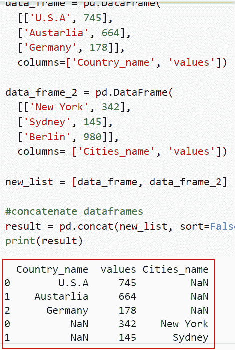
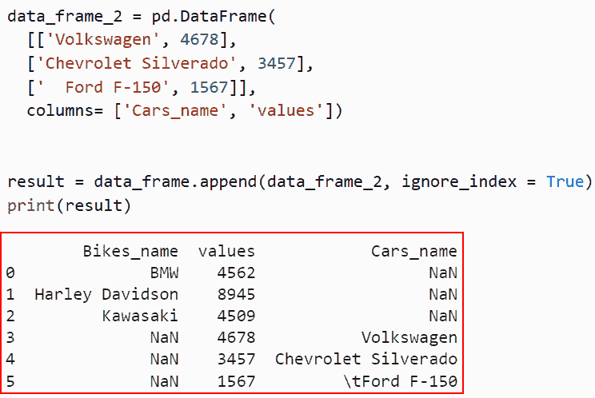
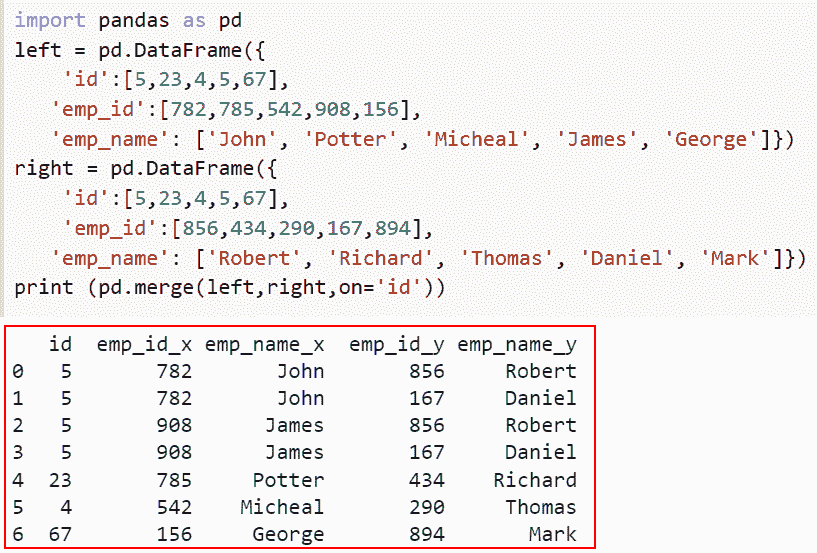

# 如何在 Python 中连接两个数据帧

> 原文：<https://pythonguides.com/concatenate-two-dataframes-in-python/>

[](https://sharepointsky.teachable.com/p/python-and-machine-learning-training-course)

在本 [Python 教程](https://pythonguides.com/python-programming-for-the-absolute-beginner/)中，我们将讨论几种在 Python 中 ***连接两个数据帧的方法。此外，我们还将看看用 Python 连接两个数据帧的各种例子。***

最近，我一直在从事一个机器学习项目，我发现它需要输入两个数据帧，并将它们组合成一个数据帧。所以我研究了一下，发现我们必须在 Python 中 ***连接两个数据帧。***

在这里我们将学习

*   如何在 Python 中使用 concat()连接两个数据帧
*   如何在 Python 中使用 dataframe.append()连接两个数据帧
*   如何在 Python 中使用 dataframe.merge()连接两个数据帧

目录

[](#)

*   [用 Python 连接两个数据帧](#Concatenate_two_Dataframes_in_Python "Concatenate two Dataframes in Python")
    *   [如何在 Python 中使用 concat()函数连接两个数据帧](#How_to_concatenate_two_Dataframes_in_Python_using_concat_function "How to concatenate two Dataframes in Python using concat() function")
    *   [如何使用 dataframe.append()](#How_to_concatenate_two_Dataframes_in_Python_using_dataframeappend "How to concatenate two Dataframes in Python using dataframe.append() ") 在 Python 中连接两个数据帧
    *   [如何使用 dataframe.merge()](#How_to_concatenate_two_Dataframes_in_Python_using_dataframemerge "How to concatenate two Dataframes in Python using dataframe.merge()") 在 Python 中连接两个数据帧

## 用 Python 连接两个数据帧

在 Python 中，当在 Python 中连接两个数据帧时，主要有三种常用且重要的理解方法。

### 如何在 Python 中使用 concat()函数连接两个数据帧

*   在本节中，我们将讨论如何使用 *`concat()`* 函数在 Python 中连接两个数据帧。
*   要跨行或列组合/连接两个或多个 pandas 数据帧，请使用 `pandas.concat()` 。当您 `concat()` 两个熊猫数据帧的行时，它会生成一个新的数据帧，其中包含两个数据帧中的所有行；换句话说，它将一个数据帧附加到另一个数据帧上。
*   该功能在合并一个轴**(行或列)(另一个索引)上的数据时，在不同的轴上执行设置逻辑。**

**语法:**

让我们看一下语法，了解一下 Python 中 `pandas.concat()` 的工作原理。

```py
pandas.concat
                     (
                      objs,
                      axis=0, 
                      join='outer', 
                      join_axes=None, 
                      ignore_index=False, 
                      keys=None, 
                      levels=None,
                      names=None, 
                      verify_integrity=False,
                      sort=None,
                      copy=True
                    )
```

*   它由几个参数组成
    *   连接一系列熊猫对象。
    *   **轴:**默认情况下，它取 0 值，并指定另一个轴上的索引的适当处理。
    *   **join:** 默认取外层值。
    *   **ignore_index:** 默认情况下，取 false 值，如果为 True，将使用一组索引代替源对象的索引。
    *   **keys:** 一系列更新结果索引的标识符。它有助于识别输出中的源项。
    *   **级别:**构建多索引所需的各种级别的列表。
    *   **名称:**为生成的层次索引的级别名称。
    *   **verify_integrity:** 验证新连接的轴中是否有重复项。
    *   **排序:**默认情况下，如果连接是“外部的”并且还没有对齐，则取 none 值。
    *   **复制:**如果数据是假的，不要过度复制。

**举例:**

这里我们将举一个例子，检查如何在 Python 中使用 *`concat()`* 函数连接两个数据帧。

**源代码:**

```py
import pandas as pd

data_frame = pd.DataFrame(
	[['U.S.A', 745],
	['Austarlia', 664],
	['Germany', 178]],
	columns=['Country_name', 'values'])

data_frame_2 = pd.DataFrame(
	[['New York', 342],
	['Sydney', 145],
	['Berlin', 980]],
	columns= ['Cities_name', 'values'])

new_list = [data_frame, data_frame_2]

#concatenate dataframes
result = pd.concat(new_list, sort=False)
print(result)
```

在下面的代码中，我们首先导入了 Pandas 库，然后使用 `pd.dataframe()` 函数创建了第一个 dataframe，在这个函数中，我们为 country_name 赋值。

接下来，我们将使用 `pd.dataframe()` 函数创建另一个数据帧，在这个函数中，我们将元素指定为特定国家名称的城市名称。在那之后，我们使用了 `pd.concat()` 函数，并用 sort 参数给列表赋值。

下面是以下代码的截图



How to concatenate two Dataframes in Python using concat function

这就是如何在 Python 中使用 concat()连接两个数据帧。

阅读:[如何在 Python 中把字典转换成字符串](https://pythonguides.com/how-to-convert-a-dictionary-into-a-string-in-python/)

### 如何使用 dataframe.append() 在 Python 中连接两个数据帧

*   现在让我们讨论如何使用 dataframe.append()在 Python 中连接两个数据帧。
*   要将另一个 dataframe 中的行添加到所提供的 dataframe 的末尾，可以使用 Pandas append()函数，该函数会创建一个新的 data frame 对象。原始数据框架用具有 NaN 值的新列和单元格更新。
*   使用 DataFrame 的 append()方法，让我们将元素从一个 DataFrame 追加到另一个 data frame。它将创建一个新的数据帧，并将所有元素作为新行追加到末尾。

**语法:**

让我们看一下语法并理解 Python 中 dataframe.append()的工作原理。

```py
DataFrame.append
                           (
                            other,
                            ignore_index=False,
                            verify_integrity=False,
                            sort=None
                           ) 
```

*   它由几个参数组成
    *   **其他**:我们想要追加的数据。
    *   `ignore_index` :如果为 true，则不使用索引标签，默认情况下，取 false 值。
    *   `verify_integrity` :默认取 false 值。如果这是真的，那么它会；创建包含重复项的索引时出现提升值错误。
    *   **排序:**如果 self 和 others 的列没有对齐，则对这些列进行排序，默认情况下，取 none 值。

**举例:**

让我们举一个例子，看看如何使用 dataframe.append()在 Python 中连接两个数据帧。

**源代码:**

```py
import pandas as pd

data_frame = pd.DataFrame(
	[['BMW', 4562],
	['Harley Davidson', 8945],
	['Kawasaki', 4509]],
	columns=['Bikes_name', 'values'])

data_frame_2 = pd.DataFrame(
	[['Volkswagen', 4678],
	['Chevrolet Silverado', 3457],
	['	Ford F-150', 1567]],
	columns= ['Cars_name', 'values'])

result = data_frame.append(data_frame_2, ignore_index = True)
print(result) 
```

在上面的代码中，我们首先导入了 Pandas 库，然后使用了 pd.dataframe()函数，在这个函数中，我们将元素指定为字符串和整数以及我们提到的列名。

下面是以下给定代码的实现。



How to concatenate two Dataframes in Python using dataframe.append

正如你在截图中看到的，我们已经讨论了如何使用 dataframe.append()在 Python 中连接两个数据帧。

阅读:[如何在 Python 中检查一个字符串是否包含子串](https://pythonguides.com/check-if-a-string-contains-a-substring-in-python/)

### 如何使用 dataframe.merge() 在 Python 中连接两个数据帧

*   在本节中，我们将讨论如何使用 dataframe.merge()在 Python 中连接两个数据帧。
*   Pandas merge()函数描述了将两个数据集合并成一个数据集并根据共享属性或列对齐行的过程。
*   Pandas merge()是将两个数据集合并成一个数据集并根据共享属性或列对齐行的过程。它是使用 DataFrame 对象的所有常见数据库连接操作的起点。

语法:

以下是 Python 中 dataframe.merge()函数的语法

```py
pd.merge
             (
              left,
              right,
              how='inner',
              on=None, 
              left_on=None,
              right_on=None,  
              left_index=False, 
              right_index=False,
              sort=True
             ) 
```

*   它由几个参数组成
    *   `left` :该参数表示只使用左帧的关键点。
    *   **right:** 类似于 SQL right outer join，它只使用右框架中的键，并保持键的顺序。
    *   **如何:**默认情况下，它采用‘inner’值。最关键地定义合并操作类型的参数是这个。它们类似于 SQL 的左外连接、右外连接、全外连接和内连接操作。
    *   **on:** 要联接的列或索引的级别名称。在两个数据帧中，这些列都必须存在。在没有特定交集的情况下，使用两个数据帧中的列的交集。
    *   `left_on` :要联接的左侧数据帧列或索引级别的名称。
    *   **right_on:** 默认情况下，右边的数据帧列或索引级别不需要任何值名来连接。
    *   **left_index:** 作为连接键，使用左侧数据帧的索引。
    *   **right_index:** 默认情况下，它采用一个 false 值作为连接键，使用右边数据帧的索引。
    *   **sort:** 默认情况下，它取 true 值，将其改为 False 通常会显著提高性能。

**举例:**

让我们举一个例子，看看如何使用 dataframe.merge()在 Python 中连接两个数据帧。

**源代码:**

```py
import pandas as pd
left = pd.DataFrame({
    'id':[5,23,4,5,67],
   'emp_id':[782,785,542,908,156],
   'emp_name': ['John', 'Potter', 'Micheal', 'James', 'George']})
right = pd.DataFrame({
    'id':[5,23,4,5,67],
	  'emp_id':[856,434,290,167,894],
   'emp_name': ['Robert', 'Richard', 'Thomas', 'Daniel', 'Mark']})
print (pd.merge(left,right,on='id'))
```

下面是以下代码的截图



How to concatenate two Dataframes in Python using dataframe.merge

这就是如何在 Python 中使用 dataframe.merge()连接两个数据帧。

您可能也喜欢阅读以下 Python 教程。

*   [Python 中的递增和递减运算符](https://pythonguides.com/increment-and-decrement-operators-in-python/)
*   [Python 点积和叉积](https://pythonguides.com/python-dot-product/)
*   [如何在 Python 中减去两个数](https://pythonguides.com/subtract-two-numbers-in-python/)
*   [Python 中两个数如何除法](https://pythonguides.com/divide-two-numbers-in-python/)

在本文中，我们将讨论在 Python 中连接两个数据帧的几种方法。我们还讨论了以下主题。

*   如何在 Python 中使用 concat()连接两个数据帧
*   如何在 Python 中使用 dataframe.append()连接两个数据帧
*   如何在 Python 中使用 dataframe.merge()连接两个数据帧

[Arvind](https://pythonguides.com/author/arvind/)

Arvind 目前是 TSInfo Technologies 的高级 Python 开发人员。他精通 Python 库，如 NumPy 和 Tensorflow。