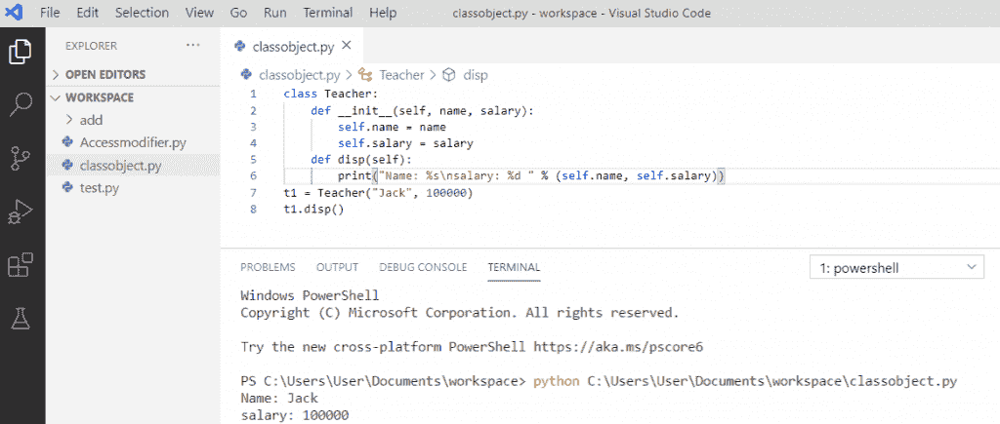
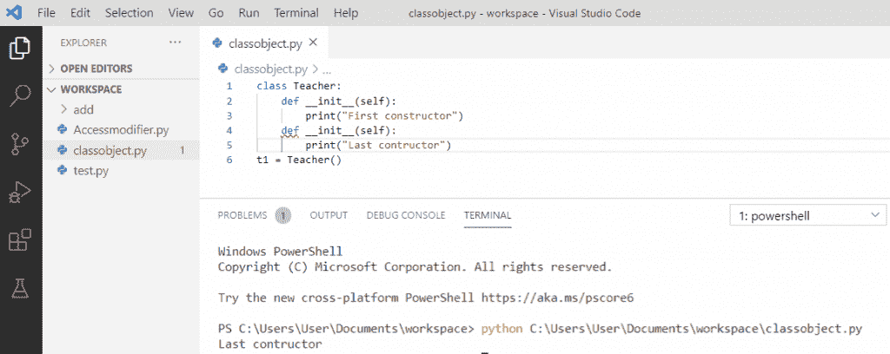

# Python 中的构造函数

> 原文：<https://pythonguides.com/constructor-in-python/>

[](https://sharepointsky.teachable.com/p/python-and-machine-learning-training-course)

在本 [Python 教程](https://pythonguides.com/python-programming-for-the-absolute-beginner/)中，我们将讨论 Python 中的**构造函数，我们将借助例子来学习这个概念。**

*   python 中的构造函数是什么？
*   如何在 python 中创建构造函数
*   python 中的非参数化构造函数
*   python 中的参数化构造函数
*   python 中的默认构造函数
*   多构造器 python
*   python 中的析构函数
*   计算 python 中创建的对象数量的程序
*   Python 构造函数重载
*   Python 构造函数覆盖
*   Python 构造函数继承
*   Python 构造函数备选
*   python 中的垃圾收集是什么

目录

[](#)

*   [python 中什么是构造函数？](#What_is_a_constructor_in_python "What is a constructor in python?")
*   [如何在 python 中创建构造函数](#How_to_create_a_constructor_in_python "How to create a constructor in python")
*   [python 中的非参数化构造函数](#Non-parameterized_constructor_in_python "Non-parameterized constructor in python")
*   [python 中的参数化构造函数](#Parameterized_constructor_in_python "Parameterized constructor in python")
*   [python 中的默认构造函数](#Default_constructor_in_python "Default constructor in python")
*   [多重构造器 python](#Multiple_constructors_python "Multiple constructors python")
*   [python 中的析构函数](#Destructors_in_python "Destructors in python")
*   [计算 python 中创建的对象数量的程序](#Program_to_count_the_number_of_objects_created_in_python "Program to count the number of objects created in python")
*   [Python 构造函数重载](#Python_constructor_overloading "Python constructor overloading")
*   [Python 构造器覆盖](#Python_constructor_overriding "Python constructor overriding")
*   [Python 构造函数继承](#Python_constructor_inheritance "Python constructor inheritance")
*   [Python 构造函数备选](#Python_Constructor_alternate "Python Constructor alternate")
*   [python 中的垃圾收集是什么](#What_is_Garbage_collection_in_python "What is Garbage collection in python")
    *   [参考计数](#Reference_Counting "Reference Counting")
    *   [python 中的自动垃圾收集](#Automatic_Garbage_collection_in_python "Automatic Garbage collection in python")
    *   [python 中的强制垃圾收集](#Forced_Garbage_Collection_in_python "Forced Garbage Collection in python")

## python 中什么是构造函数？

**Python 中什么是构造函数？**在 python 中，**构造函数**用于初始化类的实例成员，也是一种特殊类型的方法。 **Python 构造函数**用于创建对象。在 python 中，有两种类型的构造函数。

*   参数化构造函数
*   非参数化构造函数

## 如何在 python 中创建构造函数

*   为了在 Python 中**创建一个构造函数，我们可以使用一个类的 `__init__ ()` 方法。**
*   当启动类时，调用此方法。
*   它将关键字**“self”**作为第一个参数，允许访问类的属性。

**举例:**

```py
class Teacher:
def __init__(self, name, salary):
self.name = name
self.salary = salary
def disp(self):
print("Name: %s\nsalary: %d " % (self.name, self.salary))
t1 = Teacher("Jack", 100000)
t1.disp()
```

写完上面的代码(用 python 创建一个构造函数)后，输出将显示为 **" Name: Jack salary: 100000 "** 。在这里，类被初始化，它有属性**名字**和**薪水**。访问 `" disp() "` 方法打印 `" t1 "` 信息。

可以参考下面的截图来**用 python** 创建一个构造函数。



How to create a constructor in python

## python 中的非参数化构造函数

在 Python 的**非参数化构造函数中，我们不想操纵值或构造函数，它只有**自身**作为参数。**

**举例:**

```py
class Teacher:
def __init__(self):
print("Non-parameterized constructor")
def disp(self,name):
print("Welcome", name)
t1 = Teacher()
t1.disp("Jonny")
```

*   在编写上述代码(python 中的非参数化构造函数)之后，输出将显示为**“非参数化构造函数 Welcome Jonny”**。
*   这里，我的构造函数只有**“self”**作为参数，而在对象创建期间，它没有参数，这就是所谓的**非参数化构造函数**。

关于 python 中的非参数化构造函数，可以参考下面的截图。


Non-parameterized constructor in python

阅读 [Python if else with examples](https://pythonguides.com/python-if-else/)

## python 中的参数化构造函数

*   Python 中的**参数化构造函数，是有多个参数的构造函数。**
*   以这样一种方式声明一个构造函数，它在对象创建期间接受实参，那么这种类型的构造函数被称为**参数化构造函数。**
*   它将第一个参数作为对被构造的实例的引用，该实例被称为**“self”**。

**举例:**

```py
class Teacher:
def __init__(self, name):
print("Parameterized constructor")
self.name = name
def disp(self):
print("Welcome", self.name)
t1 = Teacher("Jack")
t1.disp()
```

编写上述代码(python 中的参数化构造函数)后，输出将显示为**“参数化构造函数欢迎杰克”**。这里，当创建类的对象时，立即调用构造函数。

你可以参考下面 python 中参数化构造函数的截图。


Parameterized constructor in python

## python 中的默认构造函数

*   Python 中的**默认构造函数，是当我们没有在类中添加构造函数或者有时我们忘记声明它时的构造函数，那么我们可以说它是**默认构造函数**。**
*   即使我们没有构造函数，我们仍然可以为类创建一个对象，因为 python 代码中隐式注入了一个默认的构造函数。

**举例:**

```py
class Teacher:
roll = 10
def disp(self):
print(self.roll)
t1 = Teacher()
t1.disp()
```

编写上述代码(python 中的默认构造函数)后，输出将显示为一个 `" 10 "` 。这里，默认构造函数不接受任何参数，但它仍然初始化对象并打印卷。

python 中的**默认构造函数可以参考下面的截图。**


Default constructor in python

阅读 [Python For 循环示例](https://pythonguides.com/python-for-loop/)

## 多重构造器 python

为了在 Python 中创建**多个构造函数，同一类中的**那么最后定义的 `init` 方法将被认为是主 init 方法。

**举例:**

```py
class Teacher:
def __init__(self):
print("First constructor")
def __init__(self):
print("Last constructor")
t1 = Teacher()
```

*   编写上述代码(python 中的多个构造函数)后，输出将显示为**“最后一个构造函数”**。
*   这里，对象**“T1”**调用了**“最后一个构造函数”**，而两个 init 是相同的。
*   第一个不能被对象访问，因为如果一个类中有多个构造函数，它总是调用最后一个构造函数。

关于 python 中的多个构造函数，可以参考下面的截图。



Multiple constructors python

## python 中的析构函数

*   在 python 中，**析构函数**用于销毁对象。在 python 中，我们也有一个垃圾收集器来清理内存。
*   在 python 中， `__del__` 方法被称为**析构函数**方法。

**举例:**

```py
class Teacher:
def __init__(self):
print('Constructor is called')
def __del__(self):
print('Destructor is called')
obj1 = Teacher()
```

*   写完上面的代码(python 中的析构函数)后，输出将显示为**“构造函数被调用，析构函数被调用”**。这里， `__del__` 方法充当析构函数。
*   当程序结束时，析构函数被调用。当程序结束时，对象的引用也被删除。

可以参考下面 python 中**析构函数的截图。**


Destructors in python

读取 [Python 读取 excel 文件并在 Python 中写入 Excel](https://pythonguides.com/python-read-excel-file/)

## 计算 python 中创建的对象数量的程序

为了对创建的对象数量进行计数，我们将创建一个类变量和一个方法，在构造函数方法中，该值将递增。

**举例:**

```py
class Teacher:
count = 0
def __init__(self,name,age):
self.name = name
self.age = age
Teacher.count = Teacher.count + 1
def disp(self):
print(self.name, self.age)
t1 = Teacher('John',45)
t2 = Teacher('Simon',55)
t3 = Teacher('Angelica',52)
print("The number of objects created: ",Teacher.count)
```

*   写完上面的代码后(用 python 编程来计算创建的对象数)，输出将显示为**“创建的对象数:****3”**。
*   在构造函数方法中，我们将类变量**“count”**加 1，当这个类的对象被创建时，构造函数方法会自动调用，并增加值。

你可以参考下面的程序截图来统计用 python 创建的对象的数量。


Program to count the number of objects created in python

## Python 构造函数重载

**重载一个构造函数在 Python 中，**对于一个类是允许的，它应该用不同数量的参数来实例化。

**举例:**

```py
class Flowers:
def __init__(self, first_parameter1, second_parameter2 = None):
self.first_parameter1 = first_parameter1
self.second_parameter2 = second_parameter2
print(Flowers("rose").__dict__)
print(Flowers("rose", "tulips").__dict__)
```

*   编写上述代码(python 构造函数重载)后，输出将显示为 **" {'first_parameter1': 'rose '，' second _ parameter 2 ':None } { ' first _ parameter 1 ':' rose '，' second _ parameter 2 ':' tulips ' } "**。
*   这里，我们将使用 `__init__()` 方法的默认参数来重载构造函数。一个类的实例是用不同数量的参数创建的。

可以参考下面截图 **python 构造函数重载**。


Python constructor overloading

## Python 构造器覆盖

**Python 构造函数覆盖**意味着一个方法将覆盖另一个方法。父类和子类都有构造函数，子类将重写父构造函数。

**举例:**

```py
class Mother:
def __init__(self):
self.money = 23000
print("This is mother class constructor")
def show(self):
print("Mother class instance method")
class Son(Mother):
def __init__(self):
self.money = 12500
print("This is Son class constructor")
def display(self):
print("Son class instance method")
s = Son()
```

编写上述代码(python 构造函数覆盖)后，输出将显示为**“这是子类构造函数”。**这里，子类构造函数覆盖了父类构造函数，并打印子类的消息。

可以参考下面截图 **python 构造函数重写**。


Python constructor overriding

## Python 构造函数继承

在 python 中，默认情况下父类的构造函数对子类是可用的，这被称为**构造函数继承**。

**举例:**

```py
class Mother:
def __init__(self):
self.money = 23000
print("This is mother class constructor")
def show(self):
print("Mother class instance method")
class Son(Mother):
def display(self):
print("Son class instance method")
s = Son()
```

编写上述代码(python 构造函数继承)后，输出将显示为**“这是母类构造函数”。**这里，子类继承了父类的构造函数，对象是为子类创建的，但它会打印父类的消息。

可以参考下面截图 **python 构造函数继承**。


Python constructor inheritance

## Python 构造函数备选

在 python 中，我们使用 **"@classmethod"** decorator，这对于可选的构造函数来说非常有效。

**举例:**

```py
class Teacher:
def __init__(self,name,age,salary):
self.name = name
self.age = age
self.salary = salary
def details(self):
return f"name is {self.name} age is {self.age} and salary is {self.salary} "
@classmethod
def from_string(cls,string):
new = string.split(",")
print(new)
return cls(new[0],new[1],new[2])
t1 = Teacher("akhil","35", 26000)
t2 = Teacher.from_string("naksh,38, 27000")
print(t2.age)
```

在编写了上述代码(python 构造函数替换)之后，输出将显示为一个 **" ['naksh '，' 38 '，' 27000'] "** 。这里， **"@classmethod"** 被用作替代，它将返回列表。使用了 split 方法，当我们创建对象**“T2”**时，返回的 cls()将在各自的位置添加值。

可以参考下面截图 python 构造函数备选。


Python Constructor alternate

阅读[在 Python 中创建元组](https://pythonguides.com/create-a-tuple-in-python/)

## python 中的垃圾收集是什么

*   **Python 垃圾收集**就是内存管理机制。
*   在 python 中，内存分配和释放方法是自动的。
*   Python 会自动删除不需要的对象来释放空间。
*   python 定期释放和回收不再使用的内存块的过程称为垃圾收集。
*   **Python 垃圾收集器**在程序执行期间运行，当对象引用计数达到零时触发。
*   Python 使用两种策略进行内存分配引用计数和垃圾收集。

### 参考计数

1.  引用计数是一种简单的技术，当程序中没有对对象的引用时，对象被释放。
2.  引用计数的工作原理是计算一个对象被系统中其他对象引用的次数。
3.  当对对象的引用被移除时，对象的引用计数被递减。
4.  引用计数变为零，然后对象被释放。

**举例:**

```py
val = 10
val = 12
print(val)
```

编写上述代码(引用计数)后，输出将显示为**“12”。**在这里，对象 10 的引用计数将随着其解引用而变为 0。所以垃圾回收器释放该对象。

您可以参考下面的截图进行参考计数。


Reference Counting

**注意:**当对象的引用计数无法到达时，创建一个引用循环。创建参照循环的最简单方法是创建一个参照自身的对象。

### python 中的自动垃圾收集

python 中的**自动垃圾收集自动工作。当没有留下对变量或对象的引用时，由该对象占用的内存被垃圾收集机制释放。此外，它还提供了良好的内存管理，防止内存浪费。**

**举例:**

```py
class Obj:
    def __init__(self):
        print('Object is created.')
    def __del__(self):
        print('Object is destroyed.')
obj1 = Obj()
obj2 = obj1
obj3 = obj1
print("Set obj1 to None")
obj1 = None
print("Set obj2 to None")
obj2 = None
print("Set obj3 to None")
obj3 = None
```

*   在编写了上面的代码(python 中的自动垃圾收集)之后，输出将会出现。
*   这里，Obj 被 obj1 和 obj2 引用，obj3 也引用相同的内存位置。
*   对象创建后，调用 __init__()方法，当对象由于垃圾收集而被销毁时，调用 __del__()方法。
*   当变量被赋值为 None 时，对象的引用将被删除。
*   当没有对象的引用时，它将被自动销毁并执行 __del__ method()。

python 中的**自动垃圾收集可以参考下面的截图。**


Automatic Garbage collection in python

### python 中的强制垃圾收集

用户可能需要明确地为内存管理进行垃圾收集，以释放一些内存。因此，我们将**导入允许显式垃圾收集的 gc** 模块。垃圾收集可以通过使用 gc 模块的 `collect()` 函数来强制完成。

**举例:**

```py
import gc
class Obj:
    def __del__(self):
        print('Object is destroyed.')
obj1 = Obj()
obj2 = obj1
obj1 = None
obj2 = None
for i in range(5):
    dic = {}
    dic[0] = dic
print('Collecting')
n = gc.collect()
print('Unreachable objects:', n)
```

*   在编写了上面的代码(python 中的强制垃圾收集)之后，输出将会出现。
*   这里，对象被创建，Obj 类被隐式垃圾收集器销毁。
*   但是对象 dic 的情况就不一样了，它是一个字典，再次指向自己，形成一个循环，不能被破坏。
*   因此，为了销毁由循环创建的对象，我们将使用 collect()方法。
*   collect()方法运行垃圾收集并销毁引用计数为 0 的未使用的对象。
*   collect 方法返回无法到达的对象的数量。不可达对象是指计数为 0 的对象。

关于 python 中的强制垃圾收集，可以参考下面的截图。


Forced Garbage Collection in python

您可能会喜欢以下 Python 教程:

*   [python 中的哈希表](https://pythonguides.com/hash-table-in-python/)
*   [如何在 Python 中从路径中获取文件名](https://pythonguides.com/python-get-filename-from-the-path/)
*   [Python 中的块缩进](https://pythonguides.com/block-indentation-in-python/)
*   [Python while loop 多条件](https://pythonguides.com/python-while-loop-multiple-conditions/)
*   [Python Tkinter 测验–完整教程](https://pythonguides.com/python-tkinter-quiz/)

在本教程中，我们学习了 python 中的**构造函数，也通过一个例子了解了如何使用它:**

*   python 中的构造函数是什么？
*   如何在 python 中创建构造函数
*   python 中的非参数化构造函数
*   python 中的参数化构造函数
*   python 中的默认构造函数
*   多构造器 python
*   python 中的析构函数
*   计算 python 中创建的对象数量的程序
*   Python 构造函数重载
*   Python 构造函数覆盖
*   Python 构造函数继承
*   Python 构造函数备选
*   python 中的垃圾收集是什么

[Bijay Kumar](https://pythonguides.com/author/fewlines4biju/)

Python 是美国最流行的语言之一。我从事 Python 工作已经有很长时间了，我在与 Tkinter、Pandas、NumPy、Turtle、Django、Matplotlib、Tensorflow、Scipy、Scikit-Learn 等各种库合作方面拥有专业知识。我有与美国、加拿大、英国、澳大利亚、新西兰等国家的各种客户合作的经验。查看我的个人资料。

[enjoysharepoint.com/](https://enjoysharepoint.com/)[](https://www.facebook.com/fewlines4biju "Facebook")[](https://www.linkedin.com/in/fewlines4biju/ "Linkedin")[](https://twitter.com/fewlines4biju "Twitter")