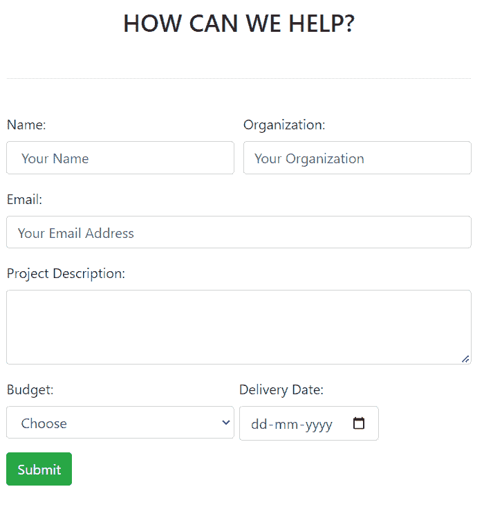
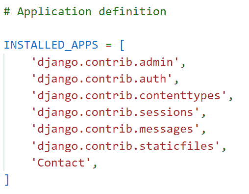
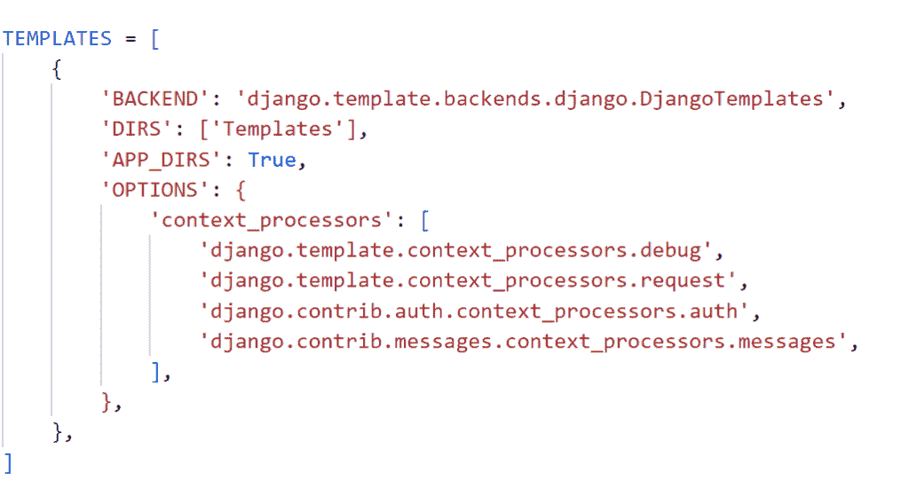
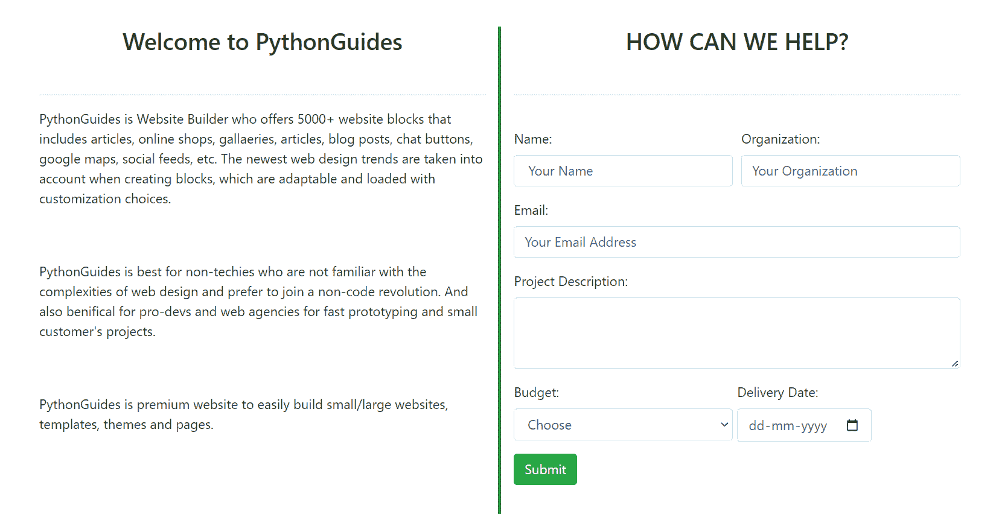
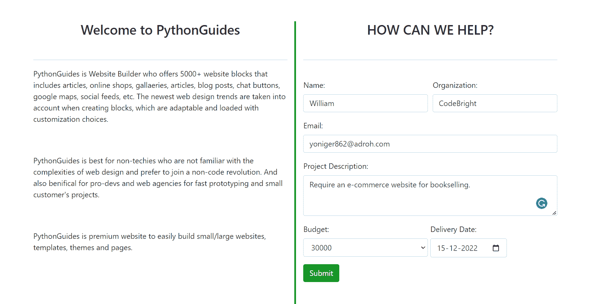
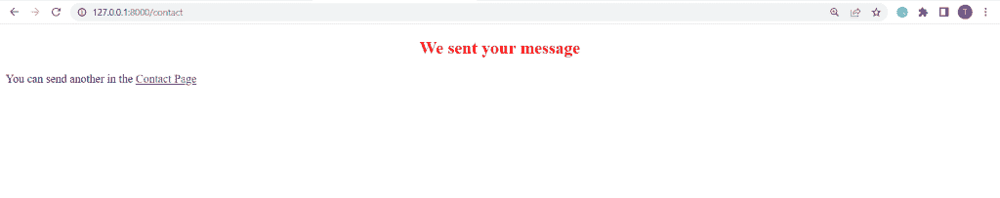
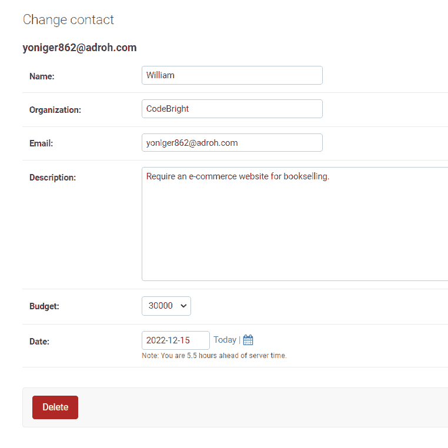

# 如何使用 bootstrap 在 Django 中构建联系人表单

> 原文：<https://pythonguides.com/contact-form-in-django-using-bootstrap/>

[](https://sharepointsky.teachable.com/p/python-and-machine-learning-training-course)

最近，我接到一个要求，要在 Django 中创建一个[联系表单，并将数据保存到数据库中。在这里，我将一步一步地解释**如何使用 bootstrap** 在 Django 中构建联系人表单。](https://pythonguides.com/contact-form-with-django-and-sqlite/)

我目前正在为一个项目建设者网站的 Django 项目工作，那里需要一个自举联系表格，所以我做了一些研究，并决定写一篇关于它的文章。

在这里我们将看到:

*   如何使用 bootstrap 在 Django 中构建联系人表单
*   如何在 Django 中使用各种控件，如文本框，文本区，下拉菜单，日期选择器
*   将联系人表单数据保存到 SQLite 数据库
*   如何从 Django 管理界面查看提交的数据

有不同的方法，我们可以在 Django 中创建联系表单，比如使用表单、脆表单、HTML 等。但是我们将集中使用 bootstrap 在 Django 中创建一个联系表单。

在本文的最后，你也可以下载代码:**使用 bootstrap** 在 Django 中构建一个联系人表单。

这是我们将在这里建造的。



Contact form in Django using bootstrap example

目录

[](#)

*   [使用 bootstrap 的 Django 联系表](#Contact_form_in_Django_using_bootstrap "Contact form in Django using bootstrap")
    *   [设置项目](#Set_up_project "Set up project")
    *   [在 Django 中创建模型](#Create_model_in_Django "Create model in Django")
    *   [创建模板](#Create_Templates "Create Templates")
    *   [定义视图](#Define_View "Define View")
    *   [执行 Django 应用程序](#Execute_Django_Application "Execute Django Application")
    *   [从 Django 管理界面查看提交的数据](#View_submitted_data_from_the_Django_admin_interface "View submitted data from the Django admin interface")
*   [使用 bootstrap 完整代码在 Django 下载联系表](#Download_Contact_form_in_Django_using_bootstrap_complete_code "Download Contact form in Django using bootstrap complete code")
*   [结论](#Conclusion "Conclusion")

## 使用 bootstrap 的 Django 联系表

现在，让我们一步一步地看看如何使用 bootstrap 在 Django 中构建联系人表单。

### 设置项目

项目是基于 Django 的 web 应用程序。总是只有一个项目，里面有各种应用程序。因此，我们需要首先为我们的联系人表单建立一个项目和一个 app。

首先，使用下面给出的命令在 Django 中创建一个名为 `ProjectGuides` 的项目。

```py
django-admin startproject ProjectGuides
```

通过在终端键入下面的命令，在 Django 项目中创建一个名为 `Contact` 的 Django 应用程序。

```py
python manage.py startapp Contact
```

将**联系人**应用添加到位于 `settings.py` 文件中的已安装应用列表中。



settings.py

Django 默认在项目目录中包含一个 `urls.py` 文件。它将新构建的应用程序**联系人**映射到其中。

```py
from django.contrib import admin
from django.urls import path,include

urlpatterns = [
    path('admin/', admin.site.urls),
    path('',include('Contact.urls')),
]
```

### 在 Django 中创建模型

Django 模型是数据库中用来存储项目数据的表。

要在 Django 中创建模型，打开 app 目录中的 `models.py` 文件，并添加下面给出的代码。

```py
from django.db import models

# Create your models here.

select_budget = (
    ("1", "45000"),
    ("2", "30000"),
    ("3", "20000"),
    ("4", "15000"),
    ("5", "10000"),
)

class Contact(models.Model):
    name = models.CharField(max_length=250)
    organization = models.CharField(max_length=400),
    email = models.EmailField()
    description = models.TextField(max_length=1200)
    budget = models.IntegerField(choices=select_budget,default='3')
    date = models.DateField()

    def __str__(self):
        return self.email
```

在这里，我们创建一个模型类 `Contact` ，它具有以下字段。

1.  **名称**是 Django CharFields，用于接收用户输入的名称。这个字符字段有 250 个字符的限制。
2.  **组织**是 Django CharFields，用于从用户处获取组织名称输入。这个字符字段有 400 个字符的限制。
3.  **电子邮件**是 Django EmailField，允许用户保存电子邮件地址。
4.  **描述**字段是 Django 文本字段。它有 1200 个字符的限制。
5.  预算是 Django IntegerField。有一个**选择**选项，它们是可用作字段选项的序列，由项目的可重复项组成，我们为此定义了一个名为 `select_budget` 的元组。
6.  **日期**是 Django 日期字段，用于接收用户输入的日期。

并使用 `def __str__(self)` 来更改 Django 模型中对象的显示名称。当我们返回 `self.email` 时，它会将项目名称显示为电子邮件。

将**联系人**模型注册到管理站点，以便用户可以在管理应用程序中查看它。打开 `admin.py` 文件，添加下面给出的代码。

```py
from django.contrib import admin
from .models import Contact

# Register your models here.

admin.site.register(Contact)
```

### 创建模板

我们的主要目标是使用 bootstrap 在 Django 中建立一个联系表单。在 Django HTML 中，CSS、Javascript 和 Bootstrap 应该在一个模板中创建，我们就这么做吧。

在主项目目录中创建一个名为 `Templates` 的子目录来存储所有的项目模板。

之后，打开 `settings.py` 文件来配置 Django 模板系统，然后更新 `DIRS` 来引用模板文件夹的位置。



settings.py

要使用 bootstrap 在 Django 中创建联系人表单，我们需要创建一个 HTML 文件。这个文件定义了联系表单字段，所以我们在**模板**文件夹中创建`contact.html`，并包含下面给出的代码。

```py
<!DOCTYPE html>
<html lang="en">

<head>
    <meta charset="UTF-8">
    <meta http-equiv="X-UA-Compatible" content="IE=edge">
    <meta name="viewport" content="width=device-width, initial-scale=1.0">
    <title>Contact Us</title>
    <style>
        .vl {
            border-left: 4px solid green;
            height: 600px;
        }
    </style>
</head>

<!-- Bootstrap CSS -->
<link rel="stylesheet" href="https://cdn.jsdelivr.net/npm/bootstrap@4.0.0/dist/css/bootstrap.min.css"
    integrity="sha384-Gn5384xqQ1aoWXA+058RXPxPg6fy4IWvTNh0E263XmFcJlSAwiGgFAW/dAiS6JXm" crossorigin="anonymous">

</head>

<body>
    <div class="mt-md-5">
        <div class="container">
            <div class="row">
                <div class="col-sm">
                    <h3 align="center">Welcome to PythonGuides</h3>
                    <br>
                    <hr>
                    <p> PythonGuides is Website Builder who offers 5000+ website blocks that includes articles,
                        online shops, gallaeries, articles, blog posts, chat buttons, google maps, social feeds, etc.
                        The newest web design trends are taken into account when creating blocks, which are adaptable
                        and loaded with customization choices. </p>
                    <br> <br>
                    <p> PythonGuides is best for non-techies who are not familiar with the complexities of web design
                        and prefer to join a non-code revolution. And also benifical for pro-devs and web agencies for
                        fast prototyping and small customer's projects. </p>
                    <br><br>
                    <p> PythonGuides is premium website to easily build small/large websites, templates, themes and
                        pages.</p>
                </div>
                <div class="vl">
                </div>
                <div class="col-sm">
                    <h3 align="center">HOW CAN WE HELP?</h3>
                    <br>
                    <hr>
                    <br>
                    <form method="POST" class="post-form" enctype="multipart/form-data">
                        
                        <div class="form-row">
                            <div class="form-group col-md-6">
                                <label for="name">Name:</label>
                                <input type="text" class="form-control" id="name" name="name" placeholder=" Your Name">
                            </div>
                            <div class="form-group col-md-6">
                                <label for="organization">Organization:</label>
                                <input type="text" class="form-control" id="organization" name="organization"
                                    placeholder="Your Organization">
                            </div>
                        </div>
                        <div class="form-group">
                            <label for="email">Email:</label>
                            <input type="email" class="form-control" id="email" name="email"
                                placeholder="Your Email Address">
                        </div>
                        <div class="form-group">
                            <label for="description">Project Description:</label>
                            <textarea class="form-control" id="description" name="description" rows="3"></textarea>
                        </div>
                        <div class="form-row">
                            <div class="form-group col-md-6">
                                <label for="budget">Budget:</label>
                                <select id="budget" name='budget' class="form-control">
                                    <option selected>Choose</option>
                                    <option value="1">45000</option>
                                    <option value="2">30000</option>
                                    <option value="3">20000</option>
                                    <option value="4">15000</option>
                                    <option value="5">10000</option>
                                </select>
                            </div>
                            <div id="date" class="md-form md-outline input-with-post-icon datepicker" inline="true">
                                <label for="date">Delivery Date:</label>
                                <input placeholder="Select date" type="date" id="date" name="date" class="form-control">

                            </div>
                        </div>
                        <button type="submit" class="btn btn-success">Submit</button>
                    </form>
                </div>

            </div>
        </div>

    </div>

    <!-- jQuery first, then Popper.js, then Bootstrap JS -->
    <script src="https://code.jquery.com/jquery-3.2.1.slim.min.js"
        integrity="sha384-KJ3o2DKtIkvYIK3UENzmM7KCkRr/rE9/Qpg6aAZGJwFDMVNA/GpGFF93hXpG5KkN"
        crossorigin="anonymous"></script>
    <script src="https://cdn.jsdelivr.net/npm/popper.js@1.12.9/dist/umd/popper.min.js"
        integrity="sha384-ApNbgh9B+Y1QKtv3Rn7W3mgPxhU9K/ScQsAP7hUibX39j7fakFPskvXusvfa0b4Q"
        crossorigin="anonymous"></script>
    <script src="https://cdn.jsdelivr.net/npm/bootstrap@4.0.0/dist/js/bootstrap.min.js"
        integrity="sha384-JZR6Spejh4U02d8jOt6vLEHfe/JQGiRRSQQxSfFWpi1MquVdAyjUar5+76PVCmYl"
        crossorigin="anonymous"></script>
</body>

</html>
```

首先，通过在任何其他样式表之前添加样式表到页面标题的链接来加载 CSS。然后，使用 **div 类 mt-md-5** 添加引导填充。

之后，为了提供一个响应固定宽度的容器，使用 **div 类容器**，并在其中使用 **div 类行**和 **div 类 col-sm 类**在单行小设备上创建两个等宽的列。

为了在联系表单的左侧描述我们的网站，我们在第一列中使用了 `h3` 、 `br` 、 `hr` 和 `p` 标签。

现在，我们在**标题**标签内的**样式**元素中利用 **div 类 v1** ，在两列之间画一条垂直线。

为了使用 bootstrap 构建联系人表单，我们在第二列中使用了表单标签 `h3` 、 `br` 、 `hr` 和**。**

下面是我们使用 bootstrap **div 类 form-group** 定义的联系人表单字段。

*   对于**名称**和**组织**字段，我们使用**输入 type="text"** ，它定义了一个单行文本。
*   我们利用**输入 type="email"** 标签在 `email` 字段中定义一个电子邮件地址。
*   在表单中使用 `textarea` 元素，收集用户输入的**描述**。
*   **选择名称**属性为下拉列表指定**预算**。
*   **输入 type="date"** 用于定义用于输入日期的**日期**字段。
*   最后，添加一个**提交**按钮来提交表单。

我们的一些组件的功能依赖于 JavaScript。为此，他们特别需要我们的 JavaScript 插件、Popper.js 和 jQuery，为了启用下面的脚本，我们将它们添加到结束的 `body` 标签之前。

成功提交联系表单后，我们希望将其呈现到其他页面，因此我们再次获得成功消息和联系表单链接。为此，我们在模板文件夹中再创建一个名为`success.html`的 HTML 文件。

```py
<!DOCTYPE html>
<html lang="en">

<head>
    <meta charset="UTF-8">
    <meta http-equiv="X-UA-Compatible" content="IE=edge">
    <meta name="viewport" content="width=device-width, initial-scale=1.0">
    <title>Document</title>
</head>

<body>
    <h2 style="text-align: center; color: red;" "></h2style>We sent your message</h2>
    <p> You can send another in the <a href=" ">Contact Page</a></p>
</body>

</html>
```

在这里， `h2` 标签用于创建标题并在中间对齐文本，并将其颜色设置为红色。我们使用了**文本对齐**和**颜色**属性。然后，为了将它连接回联系人表单，我们在 `p` 标签中使用了 `a href` 标签。

阅读:[点击 Django 中的 HTML 按钮运行 Python 函数](https://pythonguides.com/run-python-function-by-clicking-on-html-button-in-django/)

### 定义视图

Django view 是一个 Python 函数，我们在其中放置应用程序的业务逻辑，并向用户返回一个响应。

为了创建使用 bootstrap 创建联系人表单的主要逻辑，我们打开 `views.py` 文件并添加下面给出的代码。

```py
from django.shortcuts import render
from .models import Contact

# Create your views here.

def contact(request):
    if request.method == 'POST':
        name = request.POST['name']
        organization = request.POST['organization']
        email = request.POST['email']
        description = request.POST['description']
        budget = request.POST['budget']
        date = request.POST['date']
        data = Contact(name=name,organization=organization, email=email, description=description, budget=budget, date=date)
        data.save()
        return render(request, 'success.html')
    else:
        return render(request,'contact.html') 
```

首先从 `models.py` 中导入**联系人**，然后调用 `if` 语句，检查请求方式是否为 `POST` 。

如果是，我们使用**请求获取**名称**、**组织**、**电子邮件**、**描述**、**预算**和**日期**。POST['字段名']** 方法。然后， `Contact()` 方法接收所有字段作为输入，并将其初始化为一个**数据**变量。然后，我们使用 `save()` 方法将数据保存到模型中，并将用户呈现给`success.html`。

如果否，用户将得到一个空的联系人表单，通过 `render()` 函数中的`contact.html`显示。

为了调用视图，我们必须用 URL 映射它，所以我们必须在 app 目录下创建一个 `urls.py` 文件。在其中添加下面的代码。

```py
from django.urls import path
from Contact import views

urlpatterns = [
    path("contact", views.contact, name="contact"),   
]
```

阅读: [Python Django 获取管理员密码](https://pythonguides.com/python-django-get-admin-password/)

### 执行 Django 应用程序

当我们使用模型时，我们首先需要为指定的模型生成一个迁移。在终端中运行以下命令。

```py
python manage.py makemigartions
```

为了反映数据库，我们需要迁移它。下面给出了迁移命令。

```py
python manage.py migrate
```

为了为这个特定的 Django 项目启动一个开发服务器，我们在终端中运行下面的命令。

```py
python manage.py runserver
```

要打开联系人表单，请展开 URL，如下所示。

```py
127.1.1.0/contact
```

它成功地打开了我们使用 bootstrap 创建的 Django 联系人表单，如下所示。



Contact Form in Django using bootstrap

现在，填写这张联系表，并点击**提交**按钮，如下所示。



Contact Form In Django using bootstrap

点击**提交**后，会移至成功页面。如果我们单击联系页面链接，我们将再次重定向到空白联系表单。



Success Page

阅读: [Python 改 Django 版本](https://pythonguides.com/python-change-django-version/)

### 从 Django 管理界面查看提交的数据

Django 为其用户提供了一个管理面板，我们可以通过它查看我们从表单保存到数据库的数据。首先，我们必须通过下面给出的命令为它创建一个超级用户。

```py
python manage.py createsuperuser
```

点击**联系人** app 下的**联系人**。我们会将数据保存在数据库中。这是样品。



Admin Panel with save data from contact form

这就是如何使用 bootstrap4 在 Django 中创建联系人表单。

阅读: [Python Django 设置时区](https://pythonguides.com/python-django-set-timezone/)

## 使用引导程序下载 Django 中的**联系表完整代码**

代码如下:

[Build a contact form using bootstrap](https://pythonguides.com/wp-content/uploads/2022/11/ProjectGuides.zip)

## 结论

这样，我们在 Django 项目中使用 bootstrap 成功地创建了一个工作联系表单。我们还学会了利用数据库，保存联系表格中的数据，并在管理面板中查看数据。

此外，我们还讨论了以下主题。

*   如何使用 bootstrap 在 Django 中构建联系人表单
*   如何在 Django 中使用各种控件，如文本框，文本区，下拉菜单，日期选择器
*   将联系人表单数据保存到 SQLite 数据库
*   如何从 Django 管理界面查看提交的数据

您可能也喜欢阅读下面的 Python Django 教程。

*   [Python Django 表单验证](https://pythonguides.com/django-form-validation/)
*   [如何在 Django 中创建模型](https://pythonguides.com/create-model-in-django/)
*   [Python Django app 上传文件](https://pythonguides.com/django-app-upload-files/)
*   [Python Django MySQL CRUD](https://pythonguides.com/python-django-mysql-crud/)

[Bijay Kumar](https://pythonguides.com/author/fewlines4biju/)

Python 是美国最流行的语言之一。我从事 Python 工作已经有很长时间了，我在与 Tkinter、Pandas、NumPy、Turtle、Django、Matplotlib、Tensorflow、Scipy、Scikit-Learn 等各种库合作方面拥有专业知识。我有与美国、加拿大、英国、澳大利亚、新西兰等国家的各种客户合作的经验。查看我的个人资料。

[enjoysharepoint.com/](https://enjoysharepoint.com/)[](https://www.facebook.com/fewlines4biju "Facebook")[](https://www.linkedin.com/in/fewlines4biju/ "Linkedin")[](https://twitter.com/fewlines4biju "Twitter")