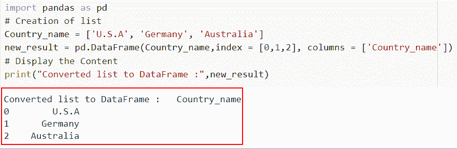

# 如何在 Python 中将列表转换成数据帧

> 原文：<https://pythonguides.com/convert-a-list-to-dataframe-in-python/>

[](https://sharepointsky.teachable.com/p/python-and-machine-learning-training-course)

在这个 [Python 教程](https://pythonguides.com/python-programming-for-the-absolute-beginner/)中，我们将讨论几种在 Python 中将列表**转换为数据帧的方法。此外，我们将查看各种例子来将元组列表转换成 Python 中的字符串。**

最近，我在做一个机器学习项目，我发现它需要一些列和行元素，而不是 Python 列表。所以我做了一些研究，发现我们必须用 Python 把列表转换成数据帧。

在这里我们将学习

*   如何使用 DataFrame()在 Python 中将列表转换为数据帧
*   使用 zip()在 Python 中将列表转换为数据帧
*   如何在 Python 中使用多维列表将列表转换为数据帧
*   使用字典中的列表将列表转换为 Python 中的数据帧
*   如何在 Python 中使用带有索引和列名的列表将列表转换为数据帧

目录

[](#)

*   [用 Python 将列表转换成数据帧](#Convert_a_list_to_DataFrame_in_Python "Convert a list to DataFrame in Python")
    *   [如何使用 dataframe()](#How_to_convert_a_list_to_DataFrame_in_Python_using_dataframe "How to convert a list to DataFrame in Python using dataframe()") 在 Python 中将列表转换为数据帧
    *   [使用 zip()](#Convert_a_list_to_DataFrame_in_Python_using_zip "Convert a list to DataFrame in Python using zip()") 在 Python 中将列表转换为数据帧
    *   [如何使用多维列表在 Python 中将列表转换为数据帧](#How_to_convert_a_list_to_DataFrame_in_Python_using_a_multidimensional_list "How to convert a list to DataFrame in Python using a multidimensional list")
    *   [使用字典中的列表将列表转换成 Python 中的数据帧](#Convert_a_list_to_DataFrame_in_Python_using_lists_in_the_dictionary "Convert a list to DataFrame in Python using lists in the dictionary")
    *   [如何在 Python 中使用带有索引和列名的列表将列表转换为数据帧](#How_to_convert_a_list_to_DataFrame_in_Python_using_Using_list_with_index_and_column_names "How to convert a list to DataFrame in Python using Using list with index and column names ")

## 用 Python 将列表转换成数据帧

在 Python 中，将列表转换为数据帧时，主要有六种常用且重要的理解方法。

### 如何使用 dataframe() 在 Python 中将列表转换为数据帧

*   在这一节中，我们将讨论如何使用 DataFrame()在 Python 中将列表转换为 dataframe。
*   使用 Python 的 `pd.dataframe()` 方法将列表转换为 dataframe。一个名为 pandas dataframe()的内置库函数接受一个列表作为参数，并从中创建一个 dataframe。

**语法:**

让我们看一下语法，了解一下 Python 中 `pd.dataframe()` 的工作原理。

```py
pandas.DataFrame( data, index, columns, dtype, copy)
```

*   它由几个参数组成
    *   **数据:**数据可以是多种不同的格式，包括数据帧、数据数组、系列、地图、列表、字典、常量等等。
    *   **index:** 如果没有提供索引，np.arange(n)将被用作结果帧中行标签的默认索引。
    *   **列:**如果没有传递索引，则仅显示 true

**举例:**

```py
import pandas as pd  
**# Creating the list**

Country_name = ['U.S.A','Germany','Australia','China']  
**# Using the pd.dataframe()**
new_result = pd.DataFrame(Country_name)  
**# Display the Content**
print("Converted list to dataframe :",new_result) 
```

在上面的代码中，我们首先导入 Pandas 库，然后创建一个名为“Country_name”的列表并分配元素。

接下来，我们使用 `pd.dataframe()` 并将列表作为参数传递，它以 dataframe 的形式显示输出。

下面是以下代码的截图


Converting a list to DataFrame in Python using dataframe

这是如何在 Python 中使用 DataFrame 将列表转换为 dataframe。

阅读:[在 Python 中把字符串转换成浮点数](https://pythonguides.com/convert-string-to-float-in-python/)

### 使用 zip() 在 Python 中将列表转换为数据帧

*   现在让我们看看如何使用 zip()在 Python 中将列表转换为 DataFrame。
*   Python 中内置的 zip()函数允许用户组合任意数量的 iterables (list、str 等。)从作为输入传递的每个 iterable 中获取项目。
*   这里我们将创建两个列表第一个是字符串列表，而第二个是整数列表。然后，我们的列表被传递给 dataframe 函数。

**语法:**

下面是 Python 中的 `zip()` 函数的语法

```py
zip(*iterables)
```

**举例:**

让我们举个例子，看看如何使用 zip()在 Python 中将一个列表转换成 DataFrame。

**源代码:**

```py
import pandas as pd

Cars_in_USA = ['BMW', 'Tesla', 'Volkswagen']

new_values = [674, 723, 178]

new_result = pd.DataFrame(list(zip( Cars_in_USA, new_values)), columns = ['Cars_name', 'value'])

print(new_result)
```

在下面给出的代码中，我们首先创建了一个列表，然后使用 pd.dataframe()方法内的 zip()函数将两个列表按照列的顺序组合起来。

下面是以下代码的截图


Converting a list to DataFrame in Python using a zip

正如你在截图中看到的，我们已经讨论了如何在 Python 中使用 zip 将列表转换为数据帧。

阅读: [Python 将二进制转换成十进制](https://pythonguides.com/python-convert-binary-to-decimal/)

### 如何使用多维列表在 Python 中将列表转换为数据帧

*   在本节中，我们将讨论如何使用多维列表在 Python 中将列表转换为数据帧。
*   在这个例子中，我们将创建一个多维列表，看看如何将它们转换成一个列表。为此，我们将使用 `pd.dataframe()` ，它会将一个列表转换成一个数据帧。

**举例:**

这里我们将举一个例子，并检查如何使用多维列表在 Python 中将列表转换为数据帧。

**源代码:**

```py
import pandas as pd  
#list contains integer and string values 
Bikes_in_USA = [['Harley Davidson', 7453], ['BMW', 4532], ['Sports bike', 9123]]  
new_output = pd.DataFrame(Bikes_in_USA, columns = ['Bikes_name', 'bike_number'])  
# Display the Content
print("Converted list into dataframe :",new_output) 
```

在下面给出的代码中，我们首先导入 Pandas 库，然后创建多维列表，并为其分配 pd.dataframe()函数以及我们提到的列名。

你可以参考下面的截图。


Converting a list to DataFrame in Python using a multidimensional list

在这个例子中，我们已经理解了如何使用多维列表在 Python 中将列表转换为数据帧。

阅读:[在 Python 中把元组转换成字符串](https://pythonguides.com/convert-tuple-to-string-in-python/)

### 使用字典中的列表将列表转换成 Python 中的数据帧

*   这里我们将讨论如何使用字典中的列表将 Python 中的列表转换为数据帧。
*   在这个例子中，对于字典的键值，我们使用输入列表，然后将它们转换成 dataframe。

**举例:**

让我们举一个例子，看看如何使用字典中的列表将 Python 中的列表转换为 DataFrame。

**源代码:**

```py
import pandas as pd  
#list_values having strings  
States_in_USA = ['Alabama', 'Alaska', 'Arizona']  
zip_code = [35242,36117,36695]    
new_dict = {'U.S.A states':States_in_USA, 'Zip_code':zip_code}  
new_output = pd.DataFrame(new_dict)  
print("Converted list into dictionary :",new_output) 
```

在上面的代码中，我们首先创建了列表并将它们分配给一个字典。接下来，我们使用了 `pd.dataframe()` 函数，在这个函数中，我们将字典传递到一个列表中，该列表将被转换为 dataframe。

下面是以下给定代码的实现。


Converting a list to DataFrame in Python using lists in the dictionary

阅读: [Python 将字典转换为数组](https://pythonguides.com/python-convert-dictionary-to-an-array/)

### 如何在 Python 中使用带有索引和列名的列表将列表转换为数据帧

*   在本节中，我们将讨论如何在 Python 中使用带有索引和列名的 list 将 list 转换为 DataFrame。
*   这里，我们首先创建一个具有索引值和列名的数据框架，我们还将使用 `pd.dataframe()` 函数。

**举例:**

让我们举一个例子，看看如何在 Python 中使用带有索引和列名的 list 将 list 转换成 DataFrame。

**源代码:**

```py
 import pandas as pd  
# Creation of list 
Country_name = ['U.S.A', 'Germany', 'Australia']  
new_result = pd.DataFrame(Country_name,index = [0,1,2], columns = ['Country_name'])  
# Display the Content 
print("Converted list to DataFrame :",new_result) 
```

下面是下面给出的代码的截图。



Converting a list to DataFrame in Python using a list with index and column names

另外，看看更多的 Python 教程。

*   [如何在 Python 中把字符串转换成日期时间](https://pythonguides.com/convert-a-string-to-datetime-in-python/)
*   [如何在 Python 中将 dictionary 转换成 JSON](https://pythonguides.com/convert-dictionary-to-json-python/)
*   [如何用 Python 把 DateTime 转换成 UNIX 时间戳](https://pythonguides.com/convert-datetime-to-unix-timestamp-in-python/)
*   [如何将 Python 字符串转换成字节数组并举例](https://pythonguides.com/python-string-to-byte-array/)

在本文中，我们已经讨论了如何在 Python 中将列表转换为数据帧，并且还讨论了以下主题。

*   如何使用 DataFrame()在 Python 中将列表转换为数据帧
*   使用 zip()在 Python 中将列表转换为数据帧
*   如何在 Python 中使用多维列表将列表转换为数据帧
*   使用字典中的列表将列表转换为 Python 中的数据帧
*   如何在 Python 中使用带有索引和列名的列表将列表转换为数据帧

[Bijay Kumar](https://pythonguides.com/author/fewlines4biju/)

Python 是美国最流行的语言之一。我从事 Python 工作已经有很长时间了，我在与 Tkinter、Pandas、NumPy、Turtle、Django、Matplotlib、Tensorflow、Scipy、Scikit-Learn 等各种库合作方面拥有专业知识。我有与美国、加拿大、英国、澳大利亚、新西兰等国家的各种客户合作的经验。查看我的个人资料。

[enjoysharepoint.com/](https://enjoysharepoint.com/)[](https://www.facebook.com/fewlines4biju "Facebook")[](https://www.linkedin.com/in/fewlines4biju/ "Linkedin")[](https://twitter.com/fewlines4biju "Twitter")