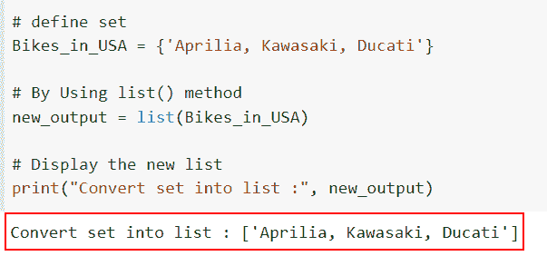
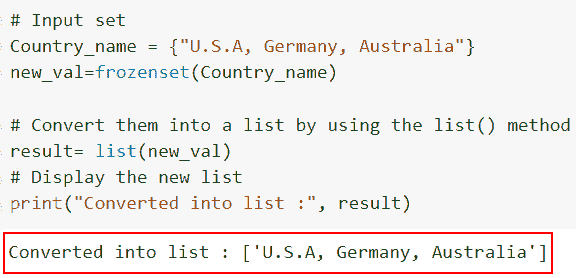
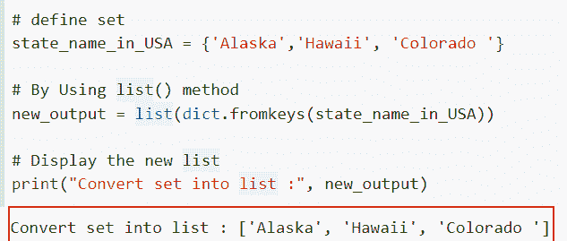
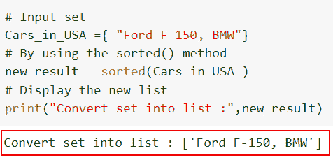
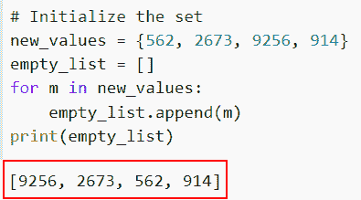
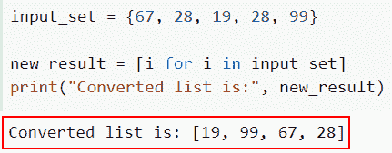
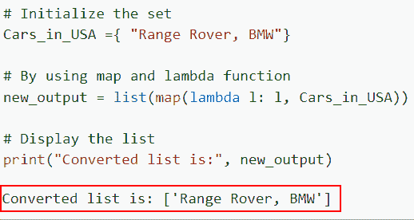
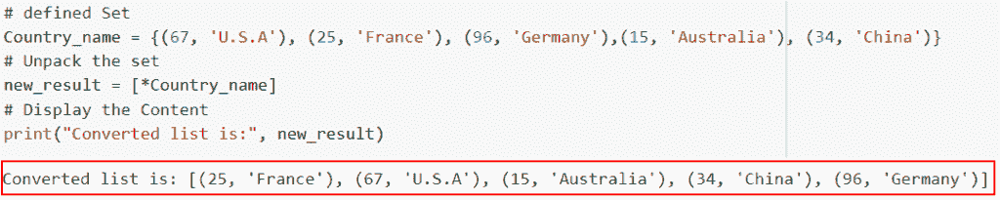

# 如何在 Python 中将集合转换成列表

> 原文：<https://pythonguides.com/convert-a-set-to-a-list-in-python/>

[](https://sharepointsky.teachable.com/p/python-and-machine-learning-training-course)

在本 [Python 教程](https://pythonguides.com/beginners-guide-to-programming/)中，我们将讨论如何在 Python 中将集合转换为列表。我们将讨论在 Python 中将集合转换成列表所需的过程和技术。

最近，我在做一个 Python 项目，我们得到一个要求，我们必须存储唯一的数字，这就是我们使用 Python set 的原因..但是在某些情况下，如果我们想要改变这个数字，我们需要 [Python 列表](https://pythonguides.com/create-list-in-python/)。

我们将讨论一些简单的技术，这些技术可以很容易地将 Python 的 set 对象转换成 List 对象。

在这里我们将看到:

*   如何在 Python 中使用 list()将集合转换为列表
*   使用 frozenset()将 set 对象转换为 Python 列表
*   如何在 Python 中使用 dict.fromkeys()将集合转换为列表
*   使用 frozenset()将 set 对象转换为 Python 列表
*   如何在 Python 中使用 for 循环将集合转换为列表
*   使用列表理解将集合对象转换为 Python 列表
*   如何使用 map 和 lambda 在 Python 中将集合转换为列表
*   使用 unpack 将 set 对象转换为 Python 列表

目录

[](#)

*   [在 Python 中把集合转换成列表](#Convert_set_into_a_list_in_Python "Convert set into a list in Python")
    *   [如何在 Python 中使用 list()](#How_to_convert_a_set_to_a_list_in_Python_using_list "How to convert a set to a list in Python using list() ") 将集合转换为列表
    *   [使用 frozenset()](#Convert_a_set_object_to_a_Python_list_using_frozenset "Convert a set object to a Python list using frozenset()") 将集合对象转换为 Python 列表
    *   [如何在 Python 中使用 dict.fromkeys()](#How_to_convert_a_set_to_a_list_in_Python_using_dictfromkeys "How to convert a set to a list in Python using dict.fromkeys()") 将集合转换为列表
    *   [使用 frozenset()](#Convert_a_set_object_to_a_Python_list_using_frozenset-2 "Convert a set object to a Python list using frozenset()") 将集合对象转换为 Python 列表
    *   [如何在 Python 中使用 for 循环将集合转换为列表](#How_to_convert_a_set_to_a_list_in_Python_using_for_loop "How to convert a set to a list in Python using for loop")
    *   [使用列表理解将集合对象转换为 Python 列表](#Convert_a_set_object_to_a_Python_list_using_list_comprehension "Convert a set object to a Python list using list comprehension")
    *   [如何使用 map 和 lambda 在 Python 中将集合转换为列表](#How_to_convert_a_set_to_a_list_in_Python_using_map_and_lambda "How to convert a set to a list in Python using map and lambda")
    *   [使用 unpack](#Convert_a_set_object_to_a_Python_list_using_unpack "Convert a set object to a Python list using unpack") 将 set 对象转换为 Python 列表

## 在 Python 中把集合转换成列表

有许多方法可以将集合转换成列表。但是首先，让我们快速解释一下 Python 集合和列表。

**集合**是 Python 中数据类型的可迭代和可变的无序集合。

Python 使用**列表**来存储不同种类数据的顺序。因为 Python 列表是可变的类型，我们可以在它们生成后改变它们的元素。

### 如何在 Python 中使用 list() 将集合转换为列表

*   在本节中，我们将讨论如何使用 `list()` 方法在 Python 中将集合转换为列表。
*   像**集合、元组或字典**这样的迭代器被 list()方法转换成列表。这个方法可以很容易地将 Python 集合转换成列表。
*   如果您在 `list()` 函数中提供 Python 集合作为参数， `list()` 函数的输出将是一个具有相同元素的列表。

**语法:**

下面是 Python 中 `list()` 方法的语法。

```py
list(iterator)
```

**注意:**这个方法只有一个参数，它定义了集合、元组等迭代器。

**举例:**

让我们举一个例子，检查如何使用 `list()` 方法在 Python 中将集合转换为列表。

**源代码:**

```py
# define set
Bikes_in_USA = {'Aprilia, Kawasaki, Ducati'}

# By Using list() method 
new_output = list(Bikes_in_USA)

# Display the new list
print("Convert set into list :", new_output)
```

在下面的代码中，我们首先创建了名为‘Bikes _ in _ USA’的集合。接下来，我们想将输入集转换成一个列表。为此，我们使用了 list()方法，在这个方法中，我们将输入 iterable 作为参数传递。

下面是以下给定代码的实现



convert a set into a list in Python by using the list method

这是如何在 Python 中通过使用 list 方法将集合转换成列表。

阅读: [Python 将元组转换为列表](https://pythonguides.com/python-convert-tuple-to-list/)

### 使用 frozenset() 将集合对象转换为 Python 列表

*   现在让我们讨论如何使用 frozen()将 set 对象转换为 Python 列表。
*   函数 `frozenset()` 返回一个带有迭代元素选项的新 frozenset 对象，它是一个不可变的无序数据项集合。
*   使用 list 函数将该集合转换为一个列表，并提供该集合作为一个参数，以接收 list 对象作为输出。

**语法:**

让我们看一下语法并理解 Python 中的 `frozenset()` 方法的工作原理。

```py
frozenset([iterable])
```

**注意:**这个方法只有一个参数，它定义了集合、元组等迭代器。

**举例:**

让我们举一个例子，检查如何使用 `frozenset()` 方法在 Python 中将 set 对象转换为 list。

**源代码:**

```py
# Input set
Country_name = {"U.S.A, Germany, Australia"}
new_val=frozenset(Country_name)

# Convert them into a list by using the list() method
result= list(new_val)
# Display the new list
print("Converted into list :", result)
```

在上面的代码中，我们首先使用花括号{}初始化集合。接下来，我们使用了 *`frozenset()`* 方法，在方法内部，我们传递了输入集。

之后，我们使用 `list()` 方法将输入集转换成一个列表。

下面是以下代码的截图



Convert a set object to a list in Python by using the frozenset method

正如你在截图中看到的，我们已经讨论了如何使用 frozenset 方法在 Python 中将 set 对象转换为 list。

阅读: [Python 字符串列表](https://pythonguides.com/python-string-to-list/)

### 如何在 Python 中使用 dict.fromkeys() 将集合转换为列表

*   在本节中，我们将讨论如何使用 `dict.fromkeys()` 方法在 Python 中将集合转换为列表。
*   `dict.fromkeys()` 方法使用作为键提供的 iterable **(字符串、列表、集合或元组)**和指定的值构建一个新字典，然后使用 list 方法将它们转换成列表。

**语法:**

下面是 Python 中 `dict.fromkeys()` 方法的语法。

```py
dictionary.fromkeys(sequence, value)
```

*   它由几个参数组成
    *   **sequence:** 一个名为 sequence 的可迭代对象将作为新字典的键。
    *   **value:** 默认取 none 值，是每个键的值。

**举例:**

让我们举一个例子，检查如何使用 `dict.fromkeys()` 方法在 Python 中将集合转换为列表。

源代码:

```py
# define set
state_name_in_USA = {'Alaska','Hawaii', 'Colorado '}

# By Using list() method 
new_output = list(dict.fromkeys(state_name_in_USA))

# Display the new list
print("Convert set into list :", new_output)
```

在给定的示例中，我们定义了名为“美国州名”的输入集。接下来，我们使用 list()方法，在这个方法中，我们使用了 dict.fromkeys()方法的概念来获取值并将它们存储在一个列表中。

你可以参考下面的截图。



How to convert a set to a list in Python by using the dict.fromkeys method

在这个例子中，我们已经了解了如何在 Python 中使用 *`dict.fromkeys()`* 方法将集合转换为列表。

阅读: [Python 字典值列表](https://pythonguides.com/python-dictionary-values-to-list/)

### 使用 frozenset() 将集合对象转换为 Python 列表

*   在这个例子中，我们将讨论如何使用 sorted 方法在 Python 中将集合转换成列表。
*   内置的 Python 函数 `sorted()` 从给定的列表中产生一个排序列表。它接受字符串、整数和两种对象类型。
*   在 python 中，我们可以很容易地使用 `sorted()` 方法将集合转换为列表。在这个方法中，我们不能同时存储整数值和字符串。

**语法:**

下面是 Python 中的 `sorted()` 方法的语法。

```py
sorted(iterable, key, reverse)
```

**举例:**

这里我们将举一个例子，并检查如何使用 sorted 方法在 Python 中将集合转换为列表。

**源代码:**

```py
# Input set
Cars_in_USA ={ "Ford F-150, BMW"}

# By using the sorted() method
new_result = sorted(Cars_in_USA )

# Display the new list
print("Convert set into list :",new_result)
```

在下面给定的代码中，我们使用了 *`sorted()`* 方法将给定的集合转换成一个列表。执行代码后，输出显示一个新列表。

下面是以下给定代码的执行。



Converted a set object to a list in Python by using the sorted method

这是如何在 Python 中使用 sorted 方法将 set 对象转换为 list。

阅读:[如何在 Python 中反转一个列表](https://pythonguides.com/reverse-a-list-in-python/)

### 如何在 Python 中使用 for 循环将集合转换为列表

*   将使用 for 循环对集合进行迭代，并使用 `append()` 方法将每个元素添加到列表中。
*   Python 中的 `append()` 方法在列表的末尾添加一个新项目。通过更新列表，它添加了一个元素。方法不会自动返回。

**语法:**

下面是 Python 中的 `list.append()` 方法的语法

```py
list.append(item)
```

**注意:**item 参数定义了要添加到列表末尾的元素。

**举例:**

让我们举一个例子，看看如何使用 for 循环在 Python 中将集合转换为列表。

```py
# Initialize the set
new_values = {562, 2673, 9256, 914}
empty_list = []
for m in new_values:
    empty_list.append(m)
print(empty_list)
```

在上面的代码中，我们初始化输入集，然后创建一个空列表来存储结果。接下来，我们使用 for 循环迭代这些值，并使用 append()函数将这些值存储在一个列表中。

你可以参考下面的截图。



Convert a set to a list in Python by using the for loop

这是如何在 Python 中使用 for 循环将集合转换为列表。

阅读:[如何在列表中添加字符串 Python](https://pythonguides.com/add-string-to-list-python/)

### 使用列表理解将集合对象转换为 Python 列表

*   在本节中，我们将讨论如何使用 list comprehension 方法在 Python 中将 set 对象转换为 list。
*   列表理解是 Python 中连接两个列表的不同方式。基本上，列表理解包括基于已经存在的列表创建一个元素列表。
*   使用 list comprehension 可以从任何现有的 iterable 对象以简单的方式生成一个列表，并以不同的方式使用`for`循环创建列表。

**举例:**

这里我们将举一个例子，并检查如何使用 list comprehension 方法在 Python 中将 set 对象转换为 list。

```py
input_set = {67, 28, 19, 28, 99}

new_result = [i for i in input_set]
print("Converted list is:", new_result)
```

在上面的代码中，我们定义了输入集，然后使用 list comprehension 方法将它们转换成一个列表。

下面是下面给出的代码的截图。



Converted a set object to a list in Python by using the list comprehension method

在这个例子中，我们已经知道我们通过使用 list comprehension 方法将一个 set 对象转换为 Python 中的一个 list。

阅读: [Python 程序循环遍历一个列表](https://pythonguides.com/python-loop-through-a-list/)

### 如何使用 map 和 lambda 在 Python 中将集合转换为列表

*   这里我们将讨论如何使用 Python 中的 map 和 lambda 函数将集合转换为列表。
*   Python 中的 lambda 函数是一个匿名函数，这意味着它没有名字。这是一个简单的函数，只有一个表达式和任意数量的输入。
*   不直接使用 for 循环，您可以使用 Python 的**内置 map()** 函数处理和转换 iterable 中的每一项。

**语法:**

下面是 Python 中 lambda 函数的语法

```py
lambda argument(s): expression
```

**举例:**

让我们举个例子，看看如何使用 map 和 lambda 函数在 Python 中将集合转换成列表。

**源代码:**

```py
# Initialize the set 
Cars_in_USA ={ "Range Rover, BMW"}

# By using map and lambda function
new_output = list(map(lambda l: l, Cars_in_USA))

# Display the list
print("Converted list is:", new_output)
```

在下面的代码中，我们初始化了名为 **'Cars_in_USA'** 的集合，然后使用了 map 和 lambda 函数。

下面是以下代码的截图



How to convert a set to a list in Python by using the map and lambda function

这是如何在 Python 中使用 map 和 lambda 函数将集合转换为列表。

阅读:[如何在 Python 中从列表中获取字符串值](https://pythonguides.com/how-to-get-string-values-from-list-in-python/)

### 使用 unpack 将 set 对象转换为 Python 列表

*   在这个例子中，我们将讨论如何使用 Python 中的 unpack 方法将集合转换为列表。
*   在这个方法中，我们提取列表文字中的集合，以便将它转换成一个列表。必须使用代表集合中每个元素的符号 `*` 。
*   在这种情况下， `*` 运算符也被称为**集合(或可迭代)**解包运算符。它增强了解包功能，使我们能够将大量的值收集或打包到一个变量中。

**举例:**

这里我们将举一个例子，并检查如何通过使用 Python 中的 unpack 方法将集合转换为列表。

**源代码:**

```py
**# defined Set**
Country_name = {(67, 'U.S.A'), (25, 'France'), (96, 'Germany'),(15, 'Australia'), (34, 'China')}

**# Unpack the set**
new_result = [*Country_name]

**# Display the Content**
print("Converted list is:", new_result)
```

你可以参考下面的截图。



Converted a set object to a list in Python by using the unpack method

您可能也喜欢阅读以下 Python 教程。

*   [从列表中选择的 Python 程序](https://pythonguides.com/python-select-from-a-list/)
*   [如何用 Python 将列表转换成数据帧](https://pythonguides.com/convert-a-list-to-dataframe-in-python/)
*   [用于列表理解的 Python 程序λ](https://pythonguides.com/python-list-comprehension/)
*   [如何在 Python 中将字典转换成字符串](https://pythonguides.com/how-to-convert-a-dictionary-into-a-string-in-python/)
*   [使用 if-else 进行列表理解的 Python 程序](https://pythonguides.com/python-list-comprehension-using-if-else/)
*   [检查一个列表是否存在于另一个列表中 Python](https://pythonguides.com/check-if-a-list-exists-in-another-list-python/)

在本 Python 教程中，我们讨论了如何在 Python 中将集合转换为列表。我们还介绍了以下给定的方法

*   如何在 Python 中使用 list()将集合转换为列表
*   使用 frozenset()将 set 对象转换为 Python 列表
*   如何在 Python 中使用 dict.fromkeys()将集合转换为列表
*   使用 frozenset()将 set 对象转换为 Python 列表
*   如何在 Python 中使用 for 循环将集合转换为列表
*   使用列表理解将集合对象转换为 Python 列表
*   如何使用 map 和 lambda 在 Python 中将集合转换为列表
*   使用 unpack 将 set 对象转换为 Python 列表

[Arvind](https://pythonguides.com/author/arvind/)

Arvind 目前是 TSInfo Technologies 的高级 Python 开发人员。他精通 Python 库，如 NumPy 和 Tensorflow。