# 如何在 Python 中将字符串转换为日期时间

> 原文：<https://pythonguides.com/convert-a-string-to-datetime-in-python/>

[](https://sharepointsky.teachable.com/p/python-and-machine-learning-training-course)

在这个 [python 教程中，](https://pythonguides.com/python-hello-world-program/)我们将讨论 **Python 将字符串转换成日期时间**。我们还将检查:

*   Python 将字符串转换为日期时间对象
*   如何在 Python 中将字符串转换为时区为的日期时间
*   Python 将一个字符串转换成不带格式日期时间
*   Python 将字符串转换为日期时间熊猫
*   Python 将字符串转换为 datetime iso 格式
*   Python 将字符串转换为毫秒级的日期时间
*   Python 将字符串转换为日期时间 yyyy-mm-dd
*   Python 将字符串转换为时间戳
*   Python 将字符串转换为 datetime.date
*   Python 将日期时间转换为字符串
*   如何在 Python 中将字符串转换为 datetime UTC

目录

[](#)

*   [在 Python 中把字符串转换成日期时间](#Convert_a_String_to_DateTime_in_Python "Convert a String to DateTime in Python")
*   [如何在 Python 中把字符串转换成 datetime 对象](#How_to_convert_a_string_to_datetime_object_in_Python "How to convert a string to datetime object in Python")
*   [用 Python 把一个字符串转换成日期时间熊猫](#Convert_a_string_to_datetime_pandas_in_Python "Convert a string to datetime pandas in Python")
*   [Python 将字符串转换为时区为](#Python_convert_a_string_to_datetime_with_timezone "Python convert a string to datetime with timezone")的日期时间
*   [Python 将一个字符串转换成以毫秒为单位的日期时间](#Python_convert_a_string_to_datetime_with_milliseconds "Python convert a string to datetime with milliseconds")
*   [Python 将字符串转换为不带格式的日期时间](#Python_converting_a_string_to_datetime_without_format "Python converting a string to datetime without format")
*   [Python 将字符串转换为 datetime iso 格式](#Python_converting_a_string_to_datetime_iso_format "Python converting a string to datetime iso format")
*   [Python 将字符串转换为日期时间 yyyy-mm-dd](#Python_convert_a_string_to_datetime_yyyy-mm-dd "Python convert a string to datetime yyyy-mm-dd")
*   [如何在 Python 中把字符串转换成时间戳](#How_to_convert_a_string_to_timestamp_in_Python "How to convert a string to timestamp in Python")
*   [Python 将字符串转换为 datetime.date](#Python_converting_a_string_to_datetimedate "Python converting a string to datetime.date")
*   [Python 将日期时间转换为字符串](#Python_converting_a_datetime_to_string "Python converting a datetime to string")
*   [如何在 Python 中把一个字符串转换成 datetime UTC](#How_to_convert_a_string_to_datetime_UTC_in_Python "How to convert a string to datetime UTC in Python")

## 在 Python 中把字符串转换成日期时间

让我们看看，**如何用 python 把一个字符串转换成 datetime** 。

在这个例子中，我导入了一个名为 `datetime` 的模块。

示例:

```py
import datetime
print((datetime.datetime.now()))
```

为了得到输出，我们将打印((datetime.datetime.now())) 。您可以参考下面的输出截图:

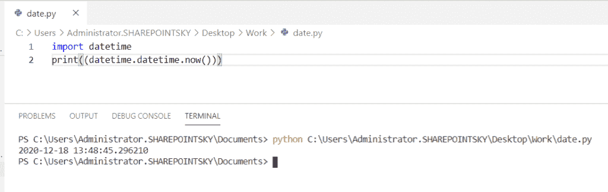

Python Converting a string to DateTime

阅读[如何将 Python 数据帧转换成 JSON](https://pythonguides.com/how-to-convert-python-dataframe-to-json/)

## 如何在 Python 中把字符串转换成 datetime 对象

让我们看看，**如何在 python 中将一个字符串转换成 datetime 对象**。

*   在这个例子中，我已经导入了一个名为 `datetime` 的模块，将一个变量作为**dt _ string = " 2020-12-18 3:11:09**传递，并将 format =**" % Y-% M-% d % H:% M:% S "**。
*   我已经使用了 `strptime` 字符串。这个字符串根据格式表示一个**时间。**
*   **dt _ object = datetime . datetime . strptime(dt _ string，format)** 用于创建日期时间对象。

示例:

```py
import datetime
dt_string = "2020-12-18 3:11:09" 
format = "%Y-%m-%d %H:%M:%S"
dt_object = datetime.datetime.strptime(dt_string, format)
print("Datetime: ", dt_object)
print("Minute: ", dt_object.minute)
print("Hour: ", dt_object.hour)
print("Second: ", dt_object.second)
```

获取日期时间对象 **print("Datetime:"，dt_object)** ，获取分钟对象 **print("Minute:"，dt_object.minute)** ，获取小时对象 **print("Hour:"，dt_object.hour)** ，获取第二个对象 **print("Second:"，dt_object.second)** 。

您可以参考下面的输出截图:

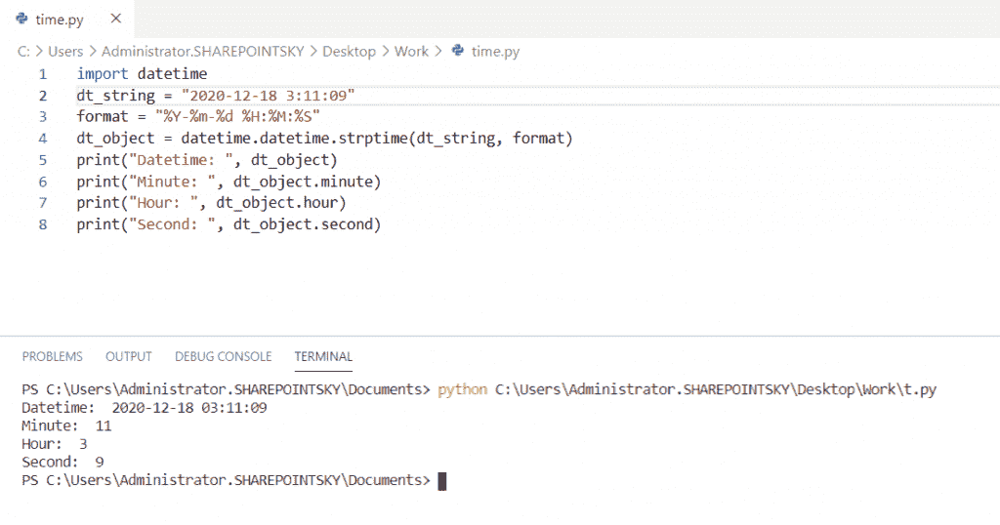

Python converting a string to datetime object

读取 [Python 龟写函数](https://pythonguides.com/python-turtle-write-function/)

## 用 Python 把一个字符串转换成日期时间熊猫

现在，我们可以看到**如何在 python 中将字符串转换成日期时间熊猫**。

在这个例子中，我有一个模块叫做**熊猫**。Pandas 是一个用于数据科学的图书馆。在这里，我们将**进口熊猫作为 pd** 。 `pd.to_datetime(dt)` 方法用于使用 python 中的熊猫将字符串 datetime 转换为 datetime 对象。

示例:

```py
import pandas as pd
dt = ['21-12-2020 8:40:00 Am']
print(pd.to_datetime(dt))
print(dt)
```

使用 print(pd.to_datetime(dt)) 将输出作为 datetime 对象**。**

您可以参考下面的输出截图:

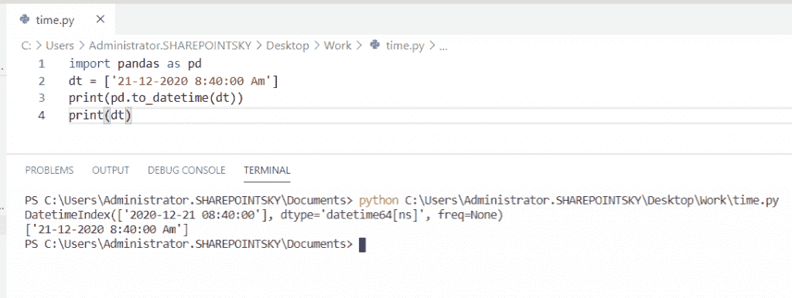

Python converting a string to datetime pandas

阅读 [Matplotlib 另存为 pdf](https://pythonguides.com/matplotlib-save-as-pdf/)

## Python 将一个字符串转换成时区为的日期时间

现在，我们可以看到**如何在 python 中将一个字符串转换成时区为**的 datetime。

在这个例子中，我导入了一个名为**时区**的模块。**datetime . now(time zone(' UTC '))**用于获取时区的当前时间。格式被指定为 **time = "%Y-%m-%d %H:%M:%S%Z%z "。****% z**用于获取**时区**以及日期时间。****

示例:

```py
from datetime import datetime
from pytz import timezone
time = "%Y-%m-%d %H:%M:%S %Z%z"
time = datetime.now(timezone('UTC'))
print('UTC :', time)
```

为了得到输出**，使用了 print('UTC:'，time)** 。在下面的截图中，我们可以看到输出。

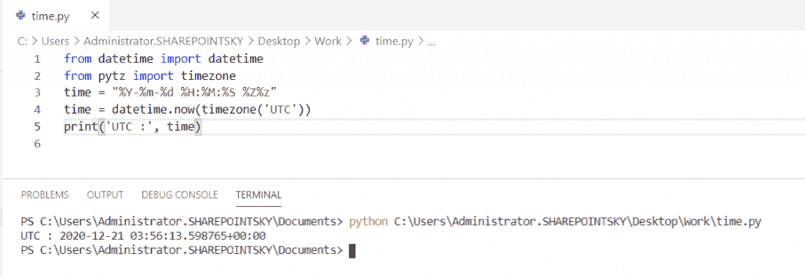

Python converting a string to datetime with timezone

阅读[如何在 Pandas 中把浮点数转换成整数](https://pythonguides.com/convert-floats-to-integer-in-pandas/)

## Python 将一个字符串转换成以毫秒为单位的日期时间

让我们看看**如何在 python 中将一个字符串转换成毫秒级的日期时间**。

在这个例子中，我导入了一个名为 `datetime` 的模块。`dt = datetime . datetime . now()`用于获取当前时间**。**在这里， **%f** 用于获取以毫秒为单位的时间。

示例:

```py
import datetime
dt = datetime.datetime.now()
dt.strftime('%Y/%m/%d %H:%M:%S.%f')
print(dt)
```

要获得以毫秒为单位的日期时间输出，请打印(dt) 。您可以参考下面的输出截图:

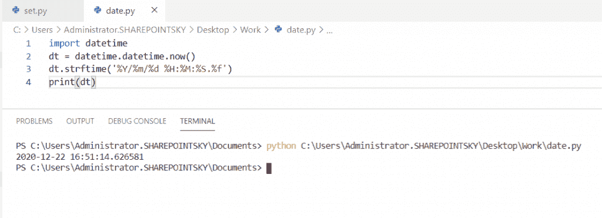

Python converting a string to datetime with milliseconds

阅读[如何在 Python 中获得前 N 行熊猫数据帧](https://pythonguides.com/get-first-n-rows-of-pandas-dataframe/)

## Python 将字符串转换为不带格式的日期时间

现在我们可以看到，**在 python 中如何在没有格式**的情况下将 string 转换成 datetime。

在这个例子中，我导入了一个名为**解析器**的模块。解析函数将自动解析 `dt` 变量中的字符串。 `dateutil` 模块是标准日期时间模块的扩展。传递的日期时间字符串没有格式。

示例:

```py
from dateutil import parser
dt = parser.parse("Dec 21 2020  1:01PM")
print(dt)
```

为了得到最终结果**，使用 print(dt)** 。下面的屏幕截图显示了输出:

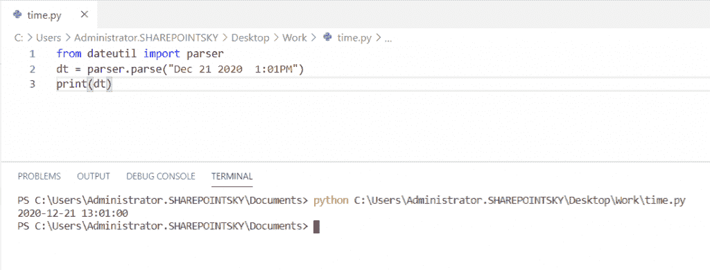

Python converting a string to datetime without format

## Python 将字符串转换为 datetime iso 格式

在这里，我们可以看到**如何在 python 中将一个字符串转换成 datetime iso 格式**

在这个例子中，我导入了一个名为 `datetime` 的模块，并使用了**。isoformat** 将当前时间转换为 iso 格式。

示例:

```py
from datetime import datetime
dt = datetime.now()
print(dt.isoformat())
```

为了得到 iso 格式的输出，这里我使用了 `print(dt.isoformat())` 。您可以看到下面的输出截图:

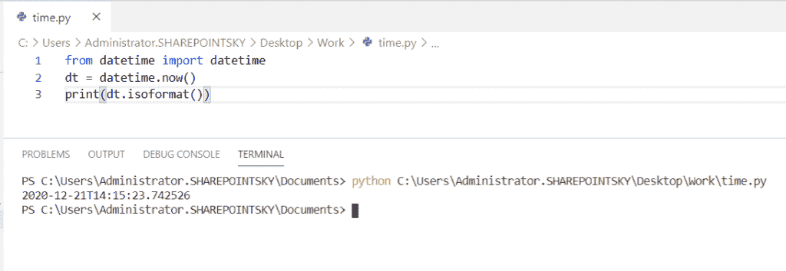

Python converting a string to datetime iso format

阅读 [Python 将二进制转换成十进制](https://pythonguides.com/python-convert-binary-to-decimal/)

## Python 将字符串转换为日期时间 yyyy-mm-dd

现在我们可以看到，**如何用 python 把一个字符串转换成 datetime yyyy-mm-dd** 。

*   在这个例子中，我导入了一个名为 `datetime` 的模块。并将输入作为**“2020-12-21**”赋给变量作为 **dt_string，**，格式作为 **format = "%Y-%m-%d "。**
*   `strptime` 是根据格式表示时间的字符串。
*   **dt _ object = datetime . datetime . strptime(dt _ string，format)** 在这两个参数中传递的一个是 `dt_string` 另一个是 `format` 。

示例:

```py
import datetime
dt_string = "2020-12-21" 
format = "%Y-%m-%d" 
dt_object = datetime.datetime.strptime(dt_string, format)
print(dt_object)
```

为了获得输出**，本例中使用了 print(dt_object)** 。您可以参考下面的输出截图:

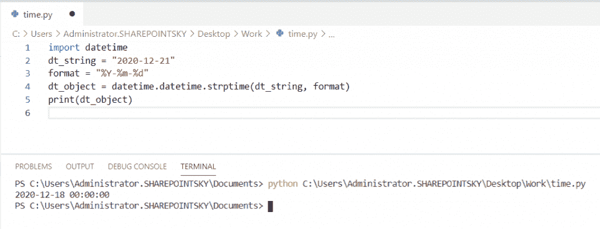

Python converting a string to datetime yyyy-mm-dd

## 如何在 Python 中把字符串转换成时间戳

在这里，我们可以看到**如何在 Python** 中将一个字符串转换成时间戳。

在这个例子中，我已经导入了一个名为 datetime 的**模块，并分配了一个输入字符串作为日期，而 `strptime` 字符串用于获取格式中的时间。 `Timestamp()` 是一个以秒的形式返回时间的函数。**

示例:

```py
import datetime 
date = "21/12/2020"
time = datetime.datetime.strptime(date,"%d/%m/%Y") 
ts = datetime.datetime.timestamp(time) 
print(ts) 
```

为了得到输出**，使用打印(ts)** 。在下面的屏幕截图中，您可以看到时间以秒为单位的输出。

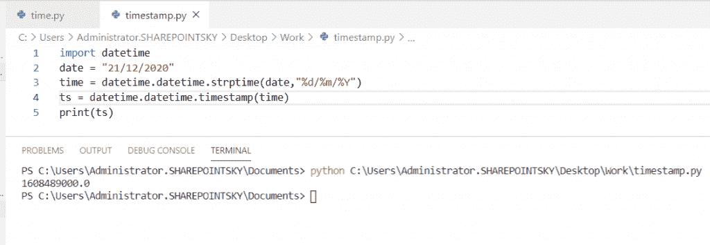

Python converting a string to timestamp

## Python 将字符串转换为 datetime.date

*   在这里，我们可以看到**如何在 python 中将一个字符串转换成 datetime.date** 。
*   在这个例子中，我导入了一个名为 datetime 的**模块，并传递了一个输入字符串作为`2020/12/21**`
*   为了只获取日期格式作为输出，我们必须手动分割并传递输入字符串的分割字符串。并使用 `int` 数据类型对其进行转换，同时为输入字符串分配索引值。

示例:

```py
import datetime
month = '2020/12/21'
date = datetime.date(int(month.split('/')[0]),int(month.split('/')[1]),int( month.split('/')[2]))
print(date)
```

使用打印(日期)以获得输出**。你可以参考下面的输出截图。**

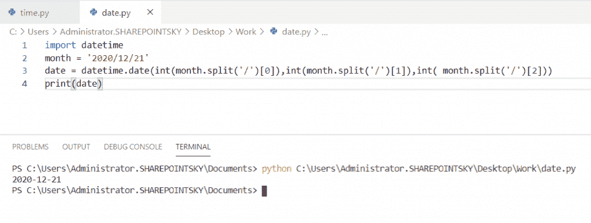

Python converting a string to datetime.date

## Python 将日期时间转换为字符串

在这里，我们可以看到**如何在 python 中将日期时间转换为字符串**。

在这个例子中，我导入了一个名为 `datetime` 的模块。 `datetime.now()` 用于获取当前日期时间。在这里， `strftime` 是一个用于获取时间正确格式的字符串， **"%d"** 仅用于获取日期字符串。

示例:

```py
 from datetime import datetime
result = datetime.now()
date = result.strftime("%d")
print(date)
```

为了得到日期输出，我使用了 `print(date)` 。下面的屏幕截图显示了输出:

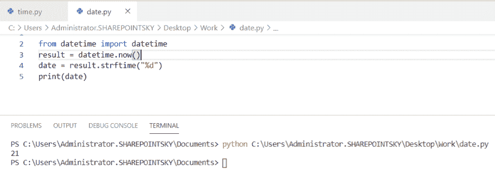

Python converting a datetime to string

## 如何在 Python 中把一个字符串转换成 datetime UTC

在这里，我们可以看到**如何在 Python 中将一个字符串转换成 datetime utc 格式**。

*   在这个例子中，我导入了名为 **pytz 和 datetime** 的模块。并将时区指定为 **pytz.timezone("亚洲/加尔各答**")。
*   `Pytz` 是一个用于时区计算的库， `lc.localize()` 用于创建一个简单的时区。一个简单的 datetime 对象称为 timezone naive， `lc_datetime.astimezone()` 是一个用于根据所需时区设置时间的函数。

示例:

```py
import pytz, datetime
lc = pytz.timezone ("Asia/kolkata")
datetime = datetime.datetime.strptime ("2020-12-22 10:11:12", "%Y-%m-%d %H:%M:%S")
lc_datetime = lc.localize(datetime)
utc_date_time = lc_datetime.astimezone(pytz.utc)
print(utc_date_time)
```

为了得到 UTC 格式的时间输出 `print(utc_date_time)` ，它将返回**日期**和**时间**。您可以参考下面的输出截图。

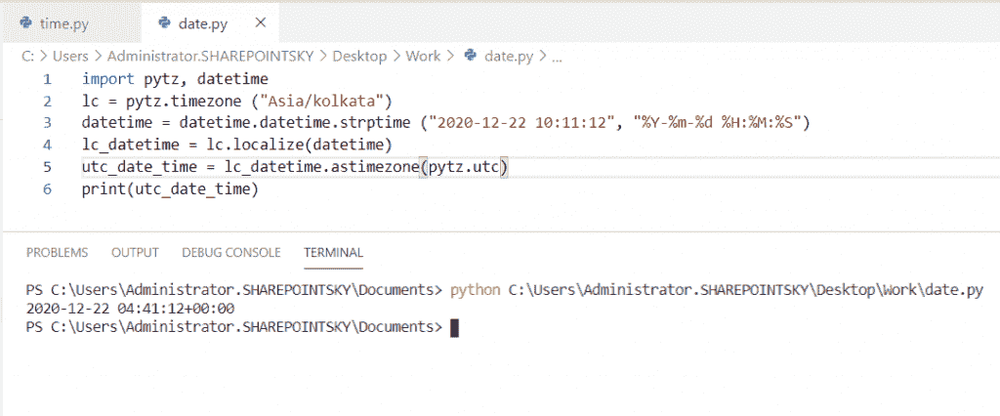

Python converting a string to datetime utc

您可能会喜欢以下 Python 教程:

*   [Python 中的转义序列](https://pythonguides.com/escape-sequence-in-python/)
*   [Python 列表理解λ](https://pythonguides.com/python-list-comprehension/)
*   [Python 线程和多线程](https://pythonguides.com/python-threading-and-multithreading/)
*   [如何将 Python 角度转换为弧度](https://pythonguides.com/python-degrees-to-radians/)
*   [Python 比较运算符](https://pythonguides.com/python-comparison-operators/)
*   [Python 命名空间教程](https://pythonguides.com/python-namespace-tutorial/)
*   [Python Tkinter 帧](https://pythonguides.com/python-tkinter-frame/)
*   [如何用 Python 制作矩阵](https://pythonguides.com/make-a-matrix-in-python/)
*   [Python 中的链表](https://pythonguides.com/linked-lists-in-python/)
*   [如何用 Python 显示日历](https://pythonguides.com/display-calendar-in-python/)
*   [如何将 Python 字符串转换成字节数组并举例](https://pythonguides.com/python-string-to-byte-array/)

在这篇 Python 教程中，我们学习了如何在 Python 中将字符串**转换成日期时间。此外，我们还讨论了以下主题:**

*   Python 将字符串转换为日期时间对象
*   Python 将字符串转换为时区为的日期时间
*   Python 将一个字符串转换成不带格式日期时间
*   Python 将字符串转换为日期时间熊猫
*   Python 将字符串转换为 datetime iso 格式
*   Python 将字符串转换成以毫秒为单位的日期时间
*   Python 将字符串转换为日期时间 yyyy-mm-dd
*   Python 将字符串转换为时间戳
*   如何在 Python 中将字符串转换为 datetime.date
*   Python 将日期时间转换为字符串
*   Python 将字符串转换为日期时间 UTC

[Bijay Kumar](https://pythonguides.com/author/fewlines4biju/)

Python 是美国最流行的语言之一。我从事 Python 工作已经有很长时间了，我在与 Tkinter、Pandas、NumPy、Turtle、Django、Matplotlib、Tensorflow、Scipy、Scikit-Learn 等各种库合作方面拥有专业知识。我有与美国、加拿大、英国、澳大利亚、新西兰等国家的各种客户合作的经验。查看我的个人资料。

[enjoysharepoint.com/](https://enjoysharepoint.com/)[](https://www.facebook.com/fewlines4biju "Facebook")[](https://www.linkedin.com/in/fewlines4biju/ "Linkedin")[](https://twitter.com/fewlines4biju "Twitter")