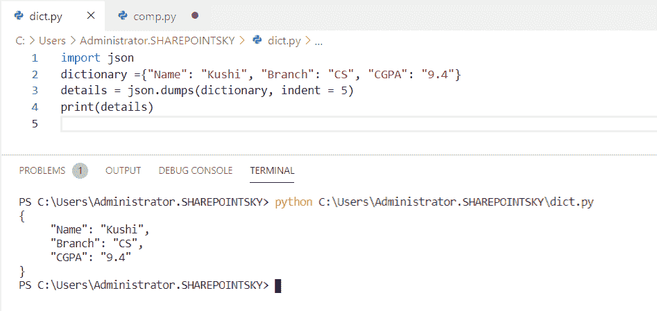
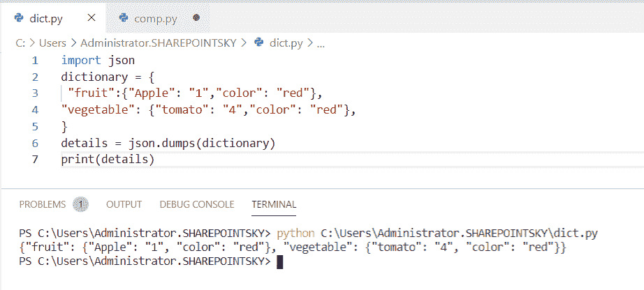
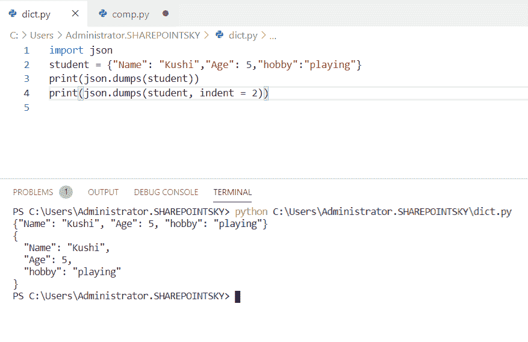
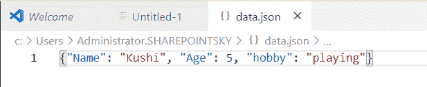
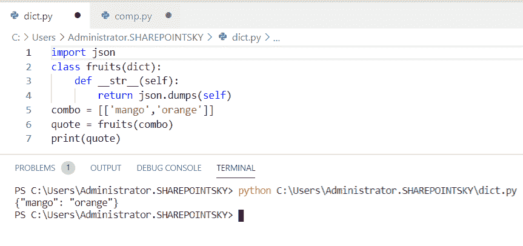
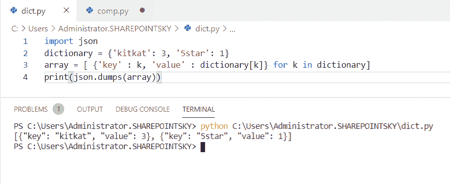
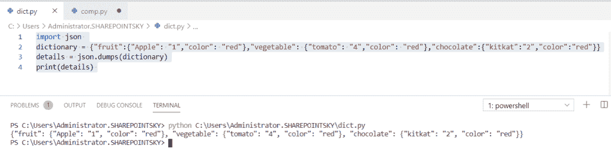
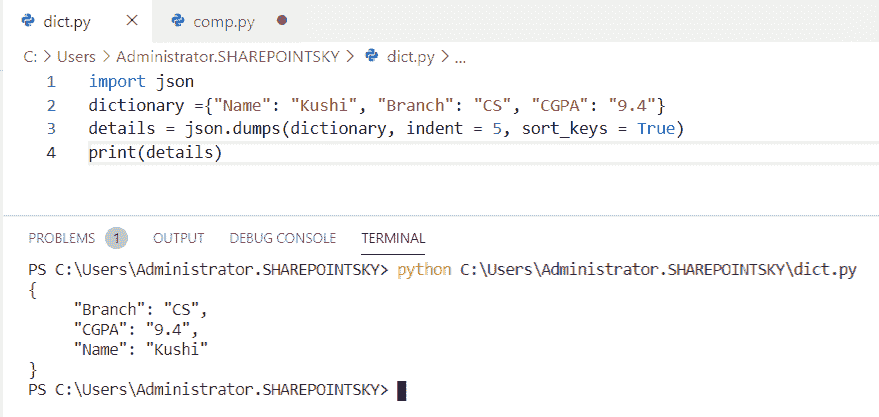

# 如何在 Python 中将字典转换成 JSON

> 原文：<https://pythonguides.com/convert-dictionary-to-json-python/>

[](https://sharepointsky.teachable.com/p/python-and-machine-learning-training-course)

在这个 [Python 教程](https://pythonguides.com/python-programming-for-the-absolute-beginner/)中，我们将学习如何用 python 将字典**转换成 JSON，我们还将涉及以下主题:**

*   如何在 Python 中将嵌套字典转换成 JSON
*   如何在 Python 中将字典转换成 JSON 字符串
*   如何用 Python 将字典转换成 JSON 文件
*   Python 字典到 JSON 引用
*   在 python 中将字典转换为 JSON 数组
*   将多个字典转换为 JSON python
*   使用 sort_key python 将字典转换为 JSON

你可能喜欢在 Python 和 [Python 连接字典](https://pythonguides.com/python-concatenate-dictionary/)中使用 JSON 数据

目录

[](#)

*   [将字典转换成 JSON Python](#Convert_dictionary_to_JSON_Python "Convert dictionary to JSON Python")
*   [将嵌套字典转换为 JSON python](#Convert_nested_dictionary_to_JSON_python "Convert nested dictionary to JSON python")
*   [将字典转换成 JSON 字符串 python](#Convert_dictionary_to_JSON_string_python "Convert dictionary to JSON string python")
*   [将字典转换成 JSON 文件 Python](#Convert_dictionary_to_JSON_file_Python "Convert dictionary to JSON file Python")
*   [Python 将字典转换成 JSON 引号](#Python_convert_dictionary_to_JSON_quotes "Python convert dictionary to JSON quotes")
*   [转换字典为 JSON 数组 Python](#Convert_dictionary_to_JSON_array_Python "Convert dictionary to JSON array Python")
*   [将多个字典转换成 JSON Python](#Convert_multiple_dictionaries_to_JSON_Python "Convert multiple dictionaries to JSON Python")
*   [使用 sort_keys Python 将字典转换为 JSON】](#Convert_dictionary_to_JSON_using_sort_keys_Python "Convert dictionary to JSON using sort_keys Python")

## 将字典转换成 JSON Python

这里可以看到**如何在 python 中将 dictionary 转换成 Json** 。

*   在这个例子中，我导入了一个名为 `json` 的模块，并将一个变量声明为一个**字典、**，并分配了**键**和**值**对。
*   另一个变量 `details` 被声明使用 `json.dumps()` 将字典存储到 json 中，并使用了 `indent = 5` 。缩进是指代码行开头的**空格**。

示例:

```py
import json 
dictionary ={"Name": "Kushi", "Branch": "CS", "CGPA": "9.4"} 
details = json.dumps(dictionary, indent = 5) 
print(details) 
```

转储的字典可以在输出中看到。您可以参考下面的输出截图。



Convert dictionary to JSON python

这就是如何在 Python 中**将 dictionary 转换成 JSON。**

## 将嵌套字典转换为 JSON python

这里可以看到**如何在 python 中将嵌套字典转换成 Json** 。

*   在这个例子中，我已经导入了一个名为 `json` 的模块，并将一个变量声明为一个**字典、**，并分配了键和值对。在这里，我拿了两本字典作为**水果**和**蔬菜**。
*   另一个变量 `details` 被声明使用 `json.dumps()` 将字典存储到 json 中，并使用了 `indent = 5` 。缩进是指代码行开头的**空格**。

示例:

```py
import json 
dictionary = {
 "fruit":{"Apple": "1","color": "red"},
"vegetable": {"tomato": "4","color": "red"},
}
details = json.dumps(dictionary)
print(details) 
```

输出将以**嵌套字典**的格式在下面截图显示输出。



Convert nested dictionary to JSON python

## 将字典转换成 JSON 字符串 python

现在，我们可以**如何在 python 中将 dictionary 转换成 JSON 字符串**。

*   在这个例子中，我已经导入了一个名为 `json` 的模块，并将一个 [Python 字典](https://pythonguides.com/create-a-dictionary-in-python/)声明为**学生**，并且使用 `json.dumps()` 来存储字典。 `indent = 2` 用于获取代码行中的空格。
*   这里，我使用了两个打印语句，一个没有缩进，一个有缩进。

示例:

```py
import json
student = {"Name": "Kushi","Age": 5,"hobby":"playing"}
print(json.dumps(student))
print(json.dumps(student, indent = 2))
```

在输出中可以看到两个字符串，一个有缩进，另一个没有缩进。下面的截图显示了输出。



Convert dictionary to json string python

## 将字典转换成 JSON 文件 Python

在这里，我们可以看到**如何用 python 将` `转换成 JSON 文件**。

*   在这个例子中，我已经导入了一个名为 `json` 的模块，并将一个字典声明为一个**学生**，并且为了打开 json 文件，我使用了**，其中 open('data.json '，' w ')为 f** 。
*   `data.json` 是文件名，使用**‘w’**模式写入文件。存储文件 `json.dump()` 用于存储字典。
*   为了首先打开 **json 文件**，我们必须检查文件的位置，然后我们必须在 **visual studio 代码**中通过给**文件名**来打开它。

示例:

```py
import json
student = {"Name": "Kushi","Age": 5,"hobby":"playing"}
with open('data.json', 'w') as f:
    json.dump(student, f) 
```

下面的截图显示了在 **visual studio 代码中存储在 **json 文件**中的输出值。**



Convert dictionary to JSON file python

这是如何在 Python 中将字典转换成 JSON 文件。

## Python 将字典转换成 JSON 引号

在这里，我们可以**如何在 python 中将 dictionary 转换成 JSON 引号**。

*   在这个例子中，我导入了一个名为 json 的模块。
*   **类水果**声明定义为 `def__str__(self)` 。
*   用于字符串表示的 `__str__(self)` 方法，声明了一个名为 `combo` 的变量， `quote` 变量被赋予类 fruits。
*   通过传递**组合**参数，我使用了 **print(引用**)来获得输出。

示例:

```py
 import json
class fruits(dict):
    def __str__(self):
        return json.dumps(self)
combo = [['mango','orange']]
quote = fruits(combo)
print(quote)
```

我们可以把这个输出看作带双引号的键值对。您可以参考下面的输出截图。



Python dictionary to JSON quotes

这是如何在 Python 中将 dictionary 转换成 JSON 引号。

## 将字典转换为 JSON 数组 Python

现在，我们可以看到**如何在 python 中将 dictionary 转换成 JSON 数组**。

*   在这个例子中，我导入了一个名为 `json` 的模块。
*   作为**字典**的变量和分配的键值对。
*   另一个变量被声明为一个数组，用来检查哪个是键，哪个是值。for 循环用于存储值，而 `json.dumps()` 用于存储字典。

示例:

```py
import json
dictionary = {'kitkat': 3, '5star': 1}
array = [ {'key' : k, 'value' : dictionary[k]} for k in dictionary]
print(json.dumps(array))
```

在输出中，我们可以清楚地看到哪个是关键，哪个是价值。您可以参考下面的输出截图。



Convert dictionary to JSON array in python

这是**如何用 Python** 把字典转换成 JSON 数组。

## 将多个字典转换成 JSON Python

在这里，我们可以看到**如何在 python 中将多个字典转换成 json** 。

*   在这个例子中，我导入了一个名为 **json，**的模块，并将一个变量声明为一个**字典。**
*   然后我们给它分配了多个字典，并使用 `json.dumps()` 来存储字典，以获得我使用过的 `print(details)` 的输出。

示例:

```py
import json 
dictionary = {"fruit":{"Apple": "1","color": "red"},"vegetable": {"tomato": "4","color": "red"},"chocolate":{"kitkat":"2","color":"red"}}
details = json.dumps(dictionary)
print(details) 
```

下面的截图显示了输出。



Convert multiple dictionary to JSON python

这是**如何用 Python** 把多个字典转换成 JSON。

## 使用 sort_keys Python 将字典转换为 JSON】

现在，我们可以看到**如何在 python 中使用 sort_keys** 将 dictionary 转换成 JSON。

*   在这个例子中，我导入了一个名为 **json、**的模块，声明了一个名为**字典、**的变量，并分配了键和值对。
*   为了存储这个值，我使用了 `json.dumps` 和 `indent = 5` 。 `sort_keys = true` 用于对字典进行排序，如果我们给值 `False` ，那么字典将不会被排序。

示例:

```py
import json 
dictionary ={"Name": "Kushi", "Branch": "CS", "CGPA": "9.4"} 
details = json.dumps(dictionary, indent = 5, sort_keys = True) 
print(details) 
```

在下面的截图中，我们可以看到排序后的字典的输出。



Convert dictionary to JSON using sort_keys python

这是**如何在 Python** 中使用 sort_keys 将 dictionary 转换成 JSON。

您可能会喜欢以下 Python 教程:

*   [如何在 Turtle Python 中附加图像](https://pythonguides.com/attach-image-to-turtle-python/)
*   [检查一个列表是否存在于另一个列表中 Python](https://pythonguides.com/check-if-a-list-exists-in-another-list-python/)
*   [Python 向 CSV 写列表](https://pythonguides.com/python-write-a-list-to-csv/)
*   [Python Tkinter 待办事项列表](https://pythonguides.com/python-tkinter-todo-list/)
*   [Python Tkinter 窗口大小](https://pythonguides.com/python-tkinter-window-size/)
*   [如何将 Python 数组写入 CSV](https://pythonguides.com/python-write-array-to-csv/)
*   [Python 形状的一个数组](https://pythonguides.com/python-shape-of-an-array/)
*   [Python 将图像保存到文件](https://pythonguides.com/python-save-an-image-to-file/)
*   [如何使用 Python Tkinter 创建日期时间选择器](https://pythonguides.com/create-date-time-picker-using-python-tkinter/)
*   [Python Pygame 教程](https://pythonguides.com/python-pygame-tutorial/)

在本教程中，我们学习了如何用 Python 将 dictionary 转换成 JSON，我们也讨论了以下主题:

*   将嵌套字典转换为 JSON python
*   将字典转换为 JSON 字符串 python
*   将字典转换为 JSON 文件 python
*   Python 字典到 JSON 引用
*   在 python 中将字典转换为 JSON 数组
*   将多个字典转换为 JSON python
*   使用 sort_key python 将字典转换为 JSON

[Bijay Kumar](https://pythonguides.com/author/fewlines4biju/)

Python 是美国最流行的语言之一。我从事 Python 工作已经有很长时间了，我在与 Tkinter、Pandas、NumPy、Turtle、Django、Matplotlib、Tensorflow、Scipy、Scikit-Learn 等各种库合作方面拥有专业知识。我有与美国、加拿大、英国、澳大利亚、新西兰等国家的各种客户合作的经验。查看我的个人资料。

[enjoysharepoint.com/](https://enjoysharepoint.com/)[](https://www.facebook.com/fewlines4biju "Facebook")[](https://www.linkedin.com/in/fewlines4biju/ "Linkedin")[](https://twitter.com/fewlines4biju "Twitter")