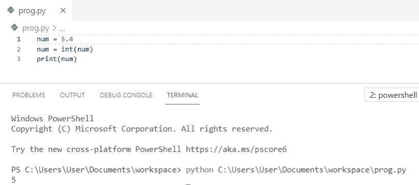
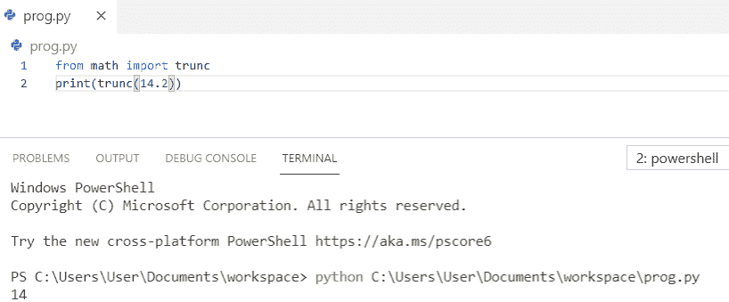
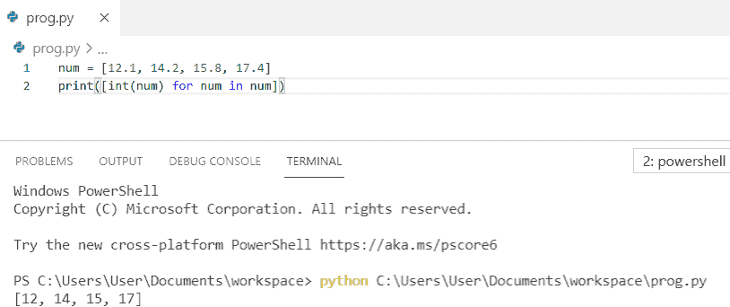
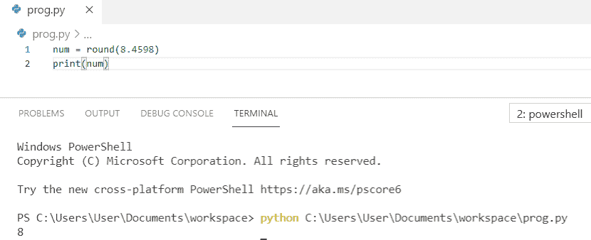
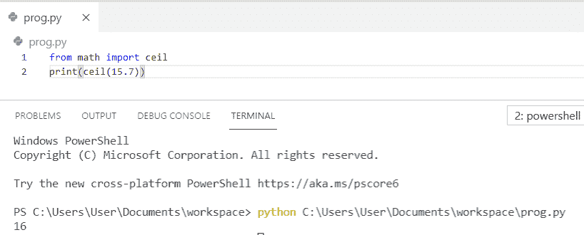
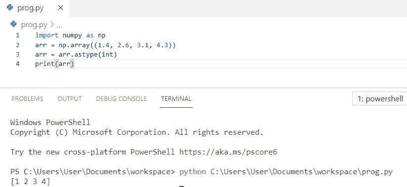
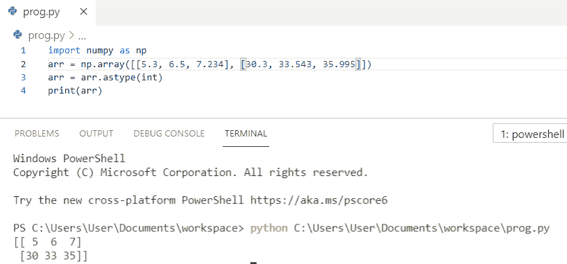
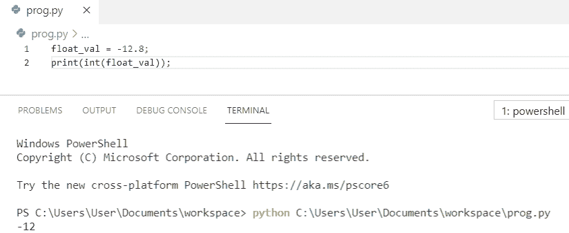
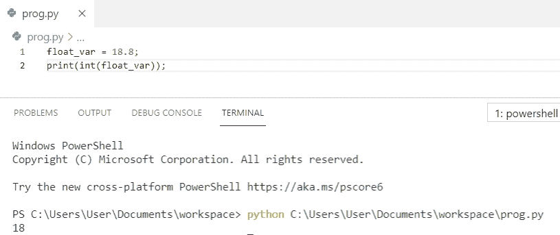

# 将 float 转换为 int Python +示例

> 原文：<https://pythonguides.com/convert-float-to-int-python/>

[](https://sharepointsky.teachable.com/p/python-and-machine-learning-training-course)

在这个 [python 教程中，](https://pythonguides.com/python-hello-world-program/)你将学习如何在 python 中**转换 float 为 int，我们也将检查 **:****

*   如何将 float 转换为 int python
*   如何将 float 转换成 int python
*   如何在 python 中将浮点列表转换为 int
*   如何将浮点数转换为整数 python
*   Python 将 float 转换为 int ceil
*   在 python 中将浮点数组转换为整数
*   将 float 转换为 int [python numpy](https://pythonguides.com/numpy/)
*   python 中如何将负浮点值转换为 int
*   如何在 python 中将 float 变量转换成 int

目录

[](#)

*   [如何将 float 转换成 int python](#How_to_convert_float_to_int_python "How to convert float to int python")
*   [如何将 float 转换成 int Python](#How_to_transform_float_to_int_Python "How to transform float to int Python")
*   [如何在 Python 中将 float list 转换成 int](#How_to_convert_float_list_to_int_in_Python "How to convert float list to int in Python")
*   [如何将浮点数转换成整数 python](#How_to_convert_float_to_whole_number_python "How to convert float to whole number python")
*   [Python 将 float 转换为 int ceil](#Python_convert_float_to_int_ceil "Python convert float to int ceil")
*   [在 python 中把浮点数组转换成 int](#Convert_float_array_to_int_in_python "Convert float array to int in python")
*   [将 float 转换为 int Python numpy](#Convert_float_to_int_Python_numpy "Convert float to int Python numpy")
*   [python 中如何将负浮点值转换为 int](#How_to_convert_negative_float_value_to_int_in_python "How to convert negative float value to int in python")
*   [如何在 python 中把 float 变量转换成 int](#How_to_convert_float_variable_to_int_in_python "How to convert float variable to int in python")

## 如何将 float 转换成 int python

让我们看看如何**如何将 float 转换成 int python**

为了在 python 中将 float 转换成 int，我们将使用内置的 `int()` 函数。该函数将返回整数部分。

**举例:**

```py
num = 5.4
num = int(num)
print(num)
```

你可以参考下面的截图来看看**如何将 float 转换成 int python** 的输出。



How to convert float to int python

这是如何在 Python 中将 float 转换为 int。

阅读:[如何在 Python 中把 string 转换成 float](https://pythonguides.com/convert-string-to-float-in-python/)

## 如何将 float 转换成 int Python

现在，我们将看到**如何将 float 转换成 int python**

在这个例子中，我们将使用 `trunc()` 函数。 `trunc()` 函数返回数字的整数部分。它忽略小数点后的所有内容。

**举例:**

```py
from math import trunc
print(trunc(14.2))
```

你可以参考下面的截图来看看**如何将 float 转换成 int python** 的输出。



How to transform float to int python

上面的 Python 代码我们可以用来在 Python 中**将 float 转换成 int。**

阅读 [Python 将二进制转换成十进制](https://pythonguides.com/python-convert-binary-to-decimal/)

## 如何在 Python 中将 float list 转换成 int

在这里，我们将看到**如何在 python** 中将 float list 转换成 int

为了在 python 中将浮点列表转换为 int，我们将使用内置函数 `int` ，它将返回一个整数列表。

**举例:**

```py
num = [12.1, 14.2, 15.8, 17.4]
print([int(num) for num in num])
```

你可以参考下面的截图来看看**如何在 python** 中将 float list 转换成 int 的输出。



How to convert float list to int in python

上面的代码，我们可以用 Python 把 float list 转换成 int。

读取 [Python 文件中的字数](https://pythonguides.com/python-count-words-in-file/)

## 如何将浮点数转换成整数 python

让我们看看如何**将 float 转换成整数 python**

在本例中，我们将使用内置的 `round()` 函数，该函数将值向上舍入并返回整数值。

**举例:**

```py
num = round(8.4598)
print(num)
```

你可以参考下面的截图来看看**如何将 float 转换成整数 python** 的输出。



How to convert float to whole number python

上面的代码，我们可以用 Python 中的来**转换浮点数为整数。**

## Python 将 float 转换为 int ceil

让我们看看**如何将 float 转换成 int ceil** 。

在本例中，我们将使用 `ceil()` 函数，该函数将向上舍入下一个整数值。

**举例:**

```py
from math import ceil
print(ceil(15.7))
```

你可以参考下面的截图来看看`python convert float to int ceil`的输出。



Python convert float to int ceil

这是如何在 Python 中将 float 转换为 int ceil。

## 在 python 中把浮点数组转换成 int

现在，我们将看到如何在 python 中**将 float 数组转换成 int。**

为了在 python 中将浮点数组转换为 int，我们将首先**将 numpy 作为 np** 导入，然后我们将使用函数 `astype()` ，它将返回整数。

**举例:**

```py
import numpy as np
arr = np.array((1.4, 2.6, 3.1, 4.3))
arr = arr.astype(int)
print(arr)
```

你可以参考下面的截图来看看 python 中**将浮点数组转换成 int 的输出。**



Convert float array to int in python

上面的代码，我们可以用 python 中的来**转换 float 数组为 int。**

## 将 float 转换为 int Python numpy

在这里，我们将看到如何**将 float 转换成 int python numpy** 。

在这个例子中，我们将**将 numpy 作为 np** 导入，**内置**函数 `astype()` 用于将 float 转换为 int python numpy。

**举例:**

```py
import numpy as np
arr = np.array([[5.3, 6.5, 7.234], [30.3, 33.543, 35.995]])
arr = arr.astype(int)
print(arr)
```

你可以参考下面的截图来看看`convert float to int python numpy`的输出。



Convert float to int python numpy

上面的 Python 代码，我们可以用来**将 float 转换成 int Python numpy** 。

## python 中如何将负浮点值转换为 int

我们来看看**如何在 python** 中将负的 **浮点值转换成 int。**

为了在 python 中把负浮点值转换成整数，我们必须使用 T2 函数 int() 。此外，我们必须将 float 变量作为 python 中的 `int()` 的参数来传递。

**举例:**

```py
float_val = -12.8;
print(int(float_val));
```

你可以参考下面的截图，看看**如何在 python** 中将**负**浮点值转换成 int 的输出。



How to convert negative float value to int in python

这就是如何在 python 中**将负浮点值转换为 int。**

## 如何在 python 中把 float 变量转换成 int

现在，我们将看到**如何在 python** 中将 float 变量转换成 int。

为了在 python 中**将 float 变量转换成 int** ，我们将使用 `int()` 函数。此外，我们必须将 float 变量作为 python 中的 `int()` 的参数传递，并使用 `print()` 函数获得输出。

**举例:**

```py
float_var = 18.8;
print(int(float_var));
```

你可以参考下面的截图来看看**如何在 python** 中将 float 变量转换成 int 的输出。



How to convert float variable to int in python

上面的代码，我们可以用 python 把 float 变量转换成 int。

您可能会喜欢以下 Python 教程:

*   [Python 将字典转换成列表](https://pythonguides.com/python-convert-dictionary-to-list/)
*   [如何在 Python 中求三角形的面积](https://pythonguides.com/find-area-of-a-triangle-in-python/)
*   [Python 程序求矩形的面积](https://pythonguides.com/python-program-to-find-an-area-of-a-rectangle/)
*   [如何在 Python 中计算圆的面积](https://pythonguides.com/calculate-area-of-a-circle-in-python/)
*   [添加字符串到列表 Python](https://pythonguides.com/add-string-to-list-python/)

在这篇 Python 教程中，我们学习了如何**将 float 转换成 int python** 。此外，我们还讨论了以下主题:

*   如何将 float 转换为 int python
*   如何将 float 转换成 int python
*   如何在 python 中将浮点列表转换为 int
*   如何将浮点数转换为整数 python
*   Python 将 float 转换为 int ceil
*   在 python 中将浮点数组转换为整数
*   将 float 转换为 int python numpy
*   python 中如何将负浮点值转换为 int
*   如何在 python 中将 float 变量转换成 int

[Bijay Kumar](https://pythonguides.com/author/fewlines4biju/)

Python 是美国最流行的语言之一。我从事 Python 工作已经有很长时间了，我在与 Tkinter、Pandas、NumPy、Turtle、Django、Matplotlib、Tensorflow、Scipy、Scikit-Learn 等各种库合作方面拥有专业知识。我有与美国、加拿大、英国、澳大利亚、新西兰等国家的各种客户合作的经验。查看我的个人资料。

[enjoysharepoint.com/](https://enjoysharepoint.com/)[](https://www.facebook.com/fewlines4biju "Facebook")[](https://www.linkedin.com/in/fewlines4biju/ "Linkedin")[](https://twitter.com/fewlines4biju "Twitter")