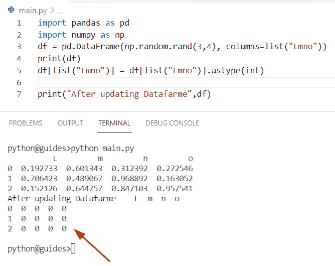

# 如何在 Pandas 中将浮点数转换成整数

> 原文：<https://pythonguides.com/convert-floats-to-integer-in-pandas/>

[](https://sharepointsky.teachable.com/p/python-and-machine-learning-training-course)

在这个 [Python 熊猫教程](https://pythonguides.com/pandas-in-python/)中，将学习**如何使用熊猫将浮点数转换成数据帧**的整数。此外，我们将涵盖这些主题。

*   如何在 Pandas 中将浮点值转换为整数
*   如何将 nan 中的浮点数转换为整数
*   如何在 Pandas 中将 float 转换为整数而不使用 decimal
*   如何在 Pandas read_csv 中将 float 转换成整数
*   如何在 Pandas 中将一个列从浮点数转换成整数

目录

[](#)

*   [如何将熊猫数据帧中的浮点数转换成整数](#How_to_convert_Floats_to_integer_in_Pandas_DataFrame "How to convert Floats to integer in Pandas DataFrame")
*   [如何使用 apply()方法将 Pandas 数据帧中的浮点值转换为整数](#How_to_convert_floats_value_to_an_integer_in_Pandas_DataFrame_using_apply_method "How to convert floats value to an integer in Pandas DataFrame using apply() method")
*   [在 Pandas 中把浮点值转换成整数](#Convert_float_value_to_an_integer_in_Pandas "Convert float value to an integer in Pandas")
*   [如何将 nan 熊猫中的 float 转换成整数](#How_to_convert_float_to_an_integer_in_Pandas_with_nan "How to convert float to an integer in Pandas with nan")
*   [如何在没有小数的熊猫中把 float 转换成整数](#How_to_convert_float_to_an_integer_in_Pandas_without_decimal "How to convert float to an integer in Pandas without decimal")
*   [如何在熊猫 read_csv 中把 float 转换成整数](#How_to_convert_float_to_an_integer_in_Pandas_read_csv "How to convert float to an integer in Pandas read_csv")
*   [如何在 Pandas 中把一个列从浮点数转换成整数](#How_to_convert_a_column_from_float_to_an_integer_in_Pandas "How to convert a column from float to an integer in Pandas")

## 如何将熊猫数据帧中的浮点数转换成整数

*   在这个程序中，我们将讨论如何在 Pandas DataFrame 中将 float 数据类型转换为整数。
*   在 Python Pandas 中要将浮点值转换成整数，我们可以使用 `DataFrame.astype()` 方法。此方法用于设置 DataFrame 中现有数据列的数据类型。
*   为了完成这个任务，我们还可以使用字典的输入来更改多个列，这个指定的类型允许我们将数据类型从一种类型转换为另一种类型。

**语法:**

下面是 DataFrame.astype()方法的语法

```py
DataFrame.astype
                (
                 dtype,
                 copy=True,
                 errors='raise'
                )
```

*   它由几个参数组成
    *   **dtype:** 此参数指定要应用于将整个 dataframe 对象转换为相同类型的数据类型。
    *   **copy:** 默认情况下，它接受**‘True’**值，当 copy=true 时，它返回一个副本。如果 copy=False，那么对值的更改可能不会返回到另一个对象。
    *   **错误:**默认为**‘提高’**，包括**‘提高’**和【T6’‘忽略’。如果是**‘提高’**，那么它将允许一个异常。类似地，如果它被忽略，那么该数据类型就不是一个集合。

**举例:**

让我们举个例子，检查一下**如何在 Pandas DataFrame** 中将浮点数转换成整数。

**源代码:**

```py
import pandas as pd

new_lis = [[1782.3, 224.5, 100.22], [66.2, 118.5, 457.21], 
        [276.2, 918.2, 645.55], [554.6, 5178.8, 956.86], 
        [49.7, 22.3, 9762.99], [41.36, 367.4, 900.25], 
        [37.8, 23.32, 213.90]]
df = pd.DataFrame(new_lis, columns = ['col1', 'col2', 'col3'])

print(df.astype(int))
```

在上面的程序中，我们首先创建了一个列表**‘new _ lis’**，然后给它赋值。

现在创建一个 dataframe 对象，并将列名列表作为参数传递。一旦您打印了 **'df.astype'** ，那么输出将只显示整数值。

下面是以下给定代码的输出


How to convert Floats to integer in Pandas DataFrame

另请参阅，[如何在 Python 中获得前 N 行熊猫数据帧](https://pythonguides.com/get-first-n-rows-of-pandas-dataframe/)

## 如何使用 apply()方法将 Pandas 数据帧中的浮点值转换为整数

通过使用 Pandas.apply()方法，我们可以很容易地将 Pandas 数据帧中的 float 数据类型转换为 integer 数据类型。

**语法:**

下面是 DataFrame.apply()方法的语法

```py
DataFrame.apply
               (
                func,
                axis=0,
                raw=False,
                result_type=None,
                args=(),
               )
```

**源代码:**

```py
import pandas as pd
import numpy as np

new_lis = [[1782.3, 224.5, 100.22], [66.2, 118.5, 457.21], 
        [276.2, 918.2, 645.55], [554.6, 5178.8, 956.86], 
        [49.7, 22.3, 9762.99], [41.36, 367.4, 900.25], 
        [37.8, 23.32, 213.90]]
df = pd.DataFrame(new_lis, columns = ['col1', 'col2', 'col3'])
df['col2'] = df['col2'].apply(np.int64)
df['col1'] = df['col1'].apply(np.int64)
df['col3'] = df['col3'].apply(np.int64)
print(df)
```

在上面的代码中，我们已经选择了列表中所有可用的列，为了将 float 类型的值转换成 integer 值，我们可以很容易地使用 df。apply()方法。

下面是以下给定代码的实现


How to convert Floats to integer in Pandas DataFrame

阅读[熊猫用 0 替换 nan](https://pythonguides.com/pandas-replace-nan-with-0/)

## 在 Pandas 中把浮点值转换成整数

*   这里我们可以看到如何在 Pandas 中将浮点值转换成整数。
*   为了执行这个特定的任务，我们可以应用方法 `DataFrame.astype()` 。此方法将帮助用户将浮点值转换为整数。在 Python 中，该方法用于将 Pandas 数据帧中的对象转换为不同的数据类型，如 integer，并且该函数还将 DataFrame 对象的数据类型更改为特定的数据类型。

**源代码:**

```py
import pandas as pd
import numpy as np
df = pd.DataFrame(np.random.rand(3,4), columns=list("Lmno"))
print(df)
df[list("Lmno")] = df[list("Lmno")].astype(int)

print("After updating Datafarme",df)
```

在上面的程序中，我们导入了 pandas 和 numpy 库，然后创建了一个 dataframe 对象**‘df’**，其中我们使用了 random()函数来创建浮点值。与此同时，我们分配了 **df。astype()** 将浮点值转换为整数值的方法。

下面是以下代码的截图



Convert float value to an integer in Pandas

阅读[如何在 Python Pandas 中向数据帧添加列](https://pythonguides.com/add-a-column-to-a-dataframe-in-python-pandas/)

## 如何将 nan 熊猫中的 float 转换成整数

*   让我们看看如何在 Pandas DataFrame 中用整数转换浮点 nan 值。
*   通过使用 `Dataframe.astype()` 方法我们可以解决这个问题。在本例中，我们创建了一个熊猫系列，并为其分配 nan 和 floating 值。现在声明一个变量**‘结果’**，并使用 `df.astype()` 函数将浮点 nan 值转换为整数。

**源代码:**

```py
import pandas as pd
import numpy as np

new_val = pd.Series([78.0, 49.0, np.nan, 26.0,np.nan,72.0])
result = new_val.astype('Int32')
print(result)
```

下面是以下给定代码的执行过程


How to convert float to an integer in Pandas with nan

正如您在截图中看到的，输出将只显示一个整数值

阅读[如何用 Python 将 Pandas 数据帧转换成 NumPy 数组](https://pythonguides.com/convert-pandas-dataframe-to-numpy-array/)

## 如何在没有小数的熊猫中把 float 转换成整数

*   在这个程序中，我们将讨论如何将 Pandas dataframe 中的浮点值转换成不带小数的整数。
*   在本例中，我们首先创建了一个数据帧，并为其分配了一个字符串值。现在我们想把这些字符串转换成浮点数。为此，我们使用了 `df.astype(float)` 方法来获取整数。
*   现在使用 **df.astype(float)。sum** 方法用于设置 DataFrame 中现有数据列的数据类型。

**举例:**

```py
import pandas as pd
import numpy as np
df = pd.DataFrame([
        ['9', '3', '897'],
        ['28', '67', '91'],
        ['67', '567', '43']
    ])
df.astype(float).sum().astype(str)
pd.options.display.float_format = '{:,.0f}'.format
df.astype(float).sum()
print (df)
```

下面是以下给定代码的执行过程


How to convert float to an integer in Pandas without decimal

阅读[获取索引熊猫 Python](https://pythonguides.com/get-index-pandas-python/)

## 如何在熊猫 read_csv 中把 float 转换成整数

*   在这里，我们可以看到如何使用 read_csv 模式将 Pandas 数据帧中的 float 转换为 integer。
*   在这个例子中，我们首先创建了一个 CSV 文件，并在其中分配了一个浮点值。现在使用 `df.astype()` 方法将浮点值转换为整数。

**源代码:**

```py
import pandas as pd
import numpy as np

df = pd.read_csv('test1.csv')
result = df.astype(int)
print(result)
```

在上面的程序中，我们导入了 Python 库，然后创建了一个变量**‘df’**，在这个变量中，我们读取了 CSV 文件，文件名称中的分隔符是逗号。

您可以创建您的 CSV 文件，并将浮点值放入其中。之后应用 `df.astype()` 方法来解决这个问题。

这是 CSV 文件的截图


How to convert float to an integer in Pandas read_csv

**实施:**


How to convert float to an integer in Pandas read_csv

读取 [Python 熊猫将数据帧写入 Excel](https://pythonguides.com/python-pandas-write-dataframe-to-excel/)

## 如何在 Pandas 中把一个列从浮点数转换成整数

*   在这个程序中，我们将讨论如何在 Pandas DataFrame 中将一个列从 float 转换为 Integer 值。
*   通过使用 `Pandas.apply()` 方法，我们可以允许用户传递一个方法并将其应用于 Pandas 数据帧的值。

**语法:**

下面是熊猫的句法。apply()方法

```py
DataFrame.apply
               (
                func,
                axis=0,
                raw=False,
                result_type=None,
                args=(),
               )
```

**源代码:**

```py
import pandas as pd
import numpy as np

new_lis = [[6732.3, 224.5, 100.22], [66.2, 118.5, 457.21], 
        [3489.2, 918.2, 645.55], [554.6, 5178.8, 956.86], 
        [883.7, 22.3, 9762.99], [41.36, 367.4, 900.25], 
        [189.8, 23.32, 213.90]]
df = pd.DataFrame(new_lis, columns = ['val1', 'val2', 'val3'])
df['val2'] = df['val2'].apply(np.int64)
df['val1'] = df['val1'].apply(np.int64)
df['val3'] = df['val3'].apply(np.int64)
print(df)
```

在上面的代码中，我们已经选择了列表中所有可用的列，为了将 float 类型的值转换成 integer 值，我们可以很容易地使用 df。apply()方法。一旦您将打印**‘df’**，那么输出将显示所有列的值。

你可以参考下面的截图


How to convert a column from float to an integer in Pandas

您可能会喜欢以下 Python 熊猫教程:

*   [计算熊猫数据帧中的行数](https://pythonguides.com/count-rows-in-pandas-dataframe/)
*   [Python 熊猫数据帧 Iterrows](https://pythonguides.com/pandas-dataframe-iterrows/)
*   [Python 将数据帧转换为列表](https://pythonguides.com/python-convert-dataframe-to-list/)
*   [熊猫删除栏目](https://pythonguides.com/pandas-delete-column/)
*   [Python 截屏](https://pythonguides.com/python-screen-capture/)
*   [如何将熊猫数据帧转换成字典](https://pythonguides.com/how-to-convert-pandas-dataframe-to-a-dictionary/)

在这个 Python Pandas 教程中，将学习如何使用 Pandas 将浮点数转换成数据帧的整数。此外，我们将涵盖这些主题。

*   如何在 Pandas 中将浮点值转换为整数
*   如何将 nan 中的浮点数转换为整数
*   如何在 Pandas 中将 float 转换为整数而不使用 decimal
*   如何在 Pandas read_csv 中将 float 转换成整数
*   如何在 Pandas 中将一个列从浮点数转换成整数

[Bijay Kumar](https://pythonguides.com/author/fewlines4biju/)

Python 是美国最流行的语言之一。我从事 Python 工作已经有很长时间了，我在与 Tkinter、Pandas、NumPy、Turtle、Django、Matplotlib、Tensorflow、Scipy、Scikit-Learn 等各种库合作方面拥有专业知识。我有与美国、加拿大、英国、澳大利亚、新西兰等国家的各种客户合作的经验。查看我的个人资料。

[enjoysharepoint.com/](https://enjoysharepoint.com/)[](https://www.facebook.com/fewlines4biju "Facebook")[](https://www.linkedin.com/in/fewlines4biju/ "Linkedin")[](https://twitter.com/fewlines4biju "Twitter")