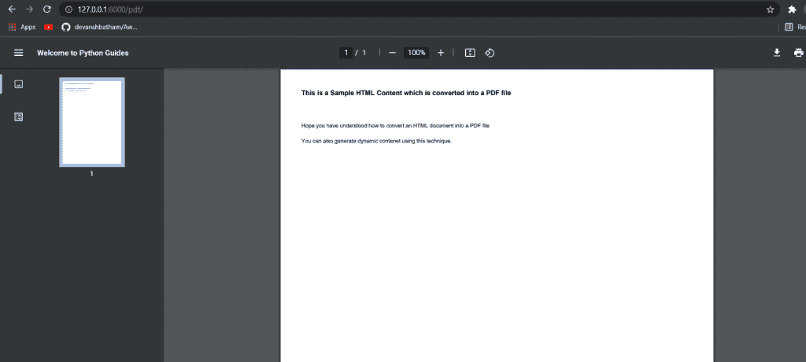
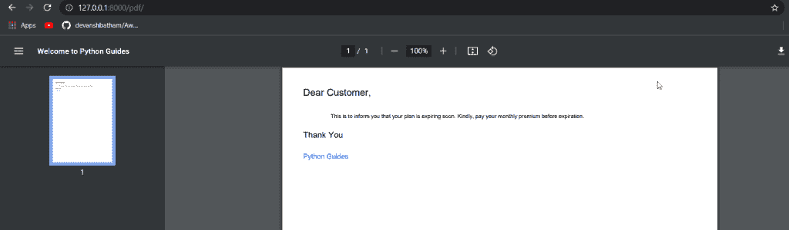
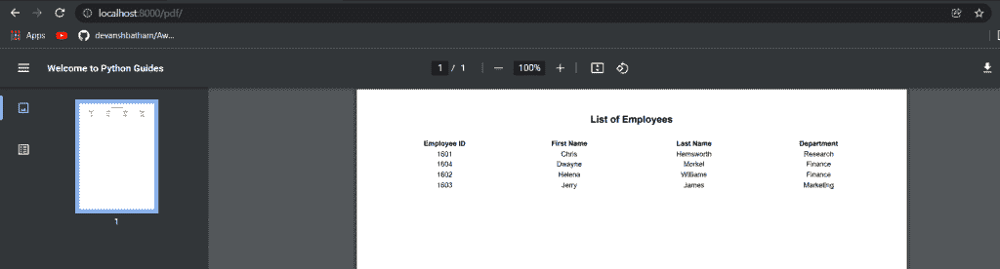
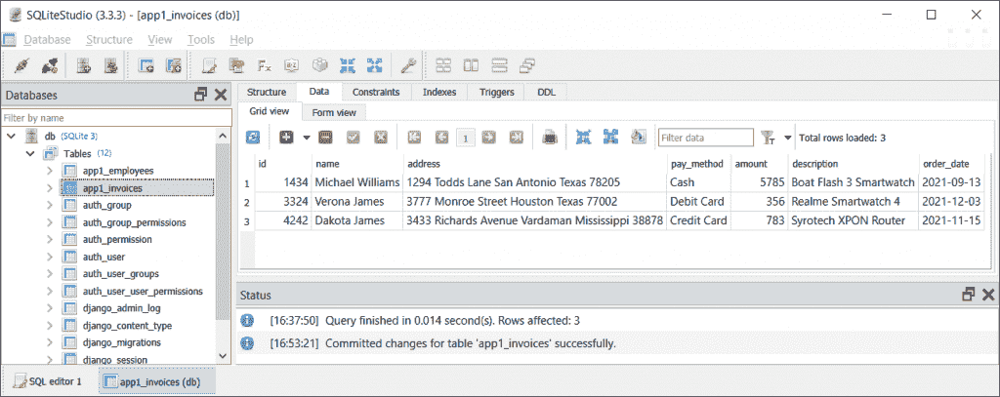
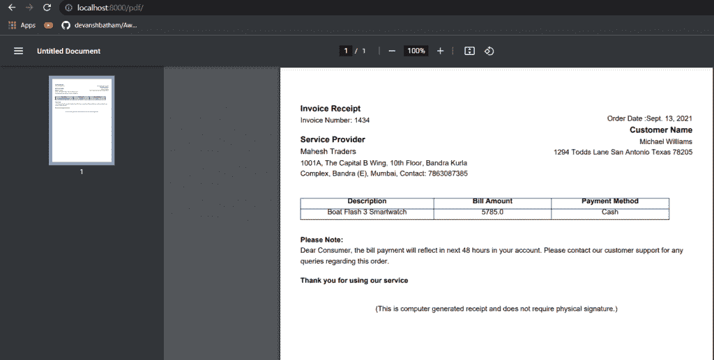

# 在 Python + PDF 发票中使用 Django 将 HTML 页面转换为 PDF

> 原文：<https://pythonguides.com/convert-html-page-to-pdf-using-django/>

[](https://sharepointsky.teachable.com/p/python-and-machine-learning-training-course)

当您需要使用 [Django](https://pythonguides.com/how-to-install-django/) 将 HTML 文档转换成 Python 中的 PDF 文件时，您可能会遇到各种场景。在 Django 中，您可以通过使用我们将在本文中讨论的一些库来实现这个特性。

在本文中，您将学习使用 [Django](https://pythonguides.com/what-is-python-django/) 将 HTML 页面转换成 PDF。你会看到一些例子，这样你就能更好地理解这个概念。

*   如何将 HTML 转换成 PDF Django
*   Django HTML 到 PDF 示例
*   用 CSS 将 Django HTML 转换成 PDF
*   在 Django 中动态转换 HTML 为 PDF
*   Django 生成 PDF 发票

目录

[](#)

*   [如何将 HTML 转换成 PDF Django](#How_to_Convert_HTML_to_PDF_Django "How to Convert HTML to PDF Django")
*   [Django HTML 到 PDF 示例](#Django_HTML_to_PDF_example "Django HTML to PDF example")
*   [用 CSS 将 Django HTML 转换成 PDF](#Django_HTML_to_PDF_with_CSS "Django HTML to PDF with CSS")
*   [在 Django 中动态转换 HTML 为 PDF](#Dynamically_convert_HTML_to_PDF_in_Django "Dynamically convert HTML to PDF in Django")
*   [Django 生成 PDF 发票](#Django_generate_PDF_invoice "Django generate PDF invoice")

## 如何将 HTML 转换成 PDF Django

您可以使用 Django 中的 [`xhtml2pdf` 库](https://xhtml2pdf.readthedocs.io/en/latest/usage.html)将 html 文档转换为 pdf 文件。让我们看看如何使用这个库。

首先，您需要使用如下所示的 `pip` 命令安装 xhtml2pdf 库:

```py
pip install xhtml2pdf
```

安装后，您可以使用这个库将 HTML 文档转换成 Python 中的 PDF 文件。让我们借助一个例子来讨论进一步的步骤。

## Django HTML 到 PDF 示例

首先，您必须在您的 [Django 应用程序](https://pythonguides.com/setup-django-project/)中创建一个新的 python 文件。假设我们创建了一个名为 process.py 的

在这个文件中，您将导入 xhtml2pdf 库，并创建一个将 html 文档转换为 pdf 文件的函数。

```py
# importing the necessary libraries
from io import BytesIO
from django.http import HttpResponse
from django.template.loader import get_template
from xhtml2pdf import pisa  

# defining the function to convert an HTML file to a PDF file
def html_to_pdf(template_src, context_dict={}):
     template = get_template(template_src)
     html  = template.render(context_dict)
     result = BytesIO()
     pdf = pisa.pisaDocument(BytesIO(html.encode("ISO-8859-1")), result)
     if not pdf.err:
         return HttpResponse(result.getvalue(), content_type='application/pdf')
     return None
```

现在我们将把这个 `process.py` 文件导入到我们的 views.py 文件中。在 views.py 文件中，我们将创建一个基于类的视图。在视图类中，我们将定义一个函数，该函数将调用 process.py 文件中的函数。

在 views.py 文件中，我们还将指定要转换为 PDF 文件的 HTML 模板。views.py 文件将如下所示:

```py
# importing the necessary libraries
from django.http import HttpResponse
from django.views.generic import View
from .process import html_to_pdf 

#Creating a class based view
class GeneratePdf(View):
     def get(self, request, *args, **kwargs):

        # getting the template
        pdf = html_to_pdf('result.html')

         # rendering the template
        return HttpResponse(pdf, content_type='application/pdf')
```

出于演示的目的，我创建了一个样本 HTML 模板，它将被转换成 PDF 文件。HTML 模板是:

```py
<!DOCTYPE html>
<html lang="en">
<head>
    <meta charset="UTF-8">
    <meta http-equiv="X-UA-Compatible" content="IE=edge">
    <meta name="viewport" content="width=device-width, initial-scale=1.0">
    <title>Welcome to Python Guides</title>
</head>
<body>
    <h2>This is a Sample HTML Content which is converted into a PDF file</h2><br>
    <p>Hope you have understood how to convert an HTML document into a PDF file</p>
    <p>You can also generate dynamic contenet using this technique.</p>
</body>
</html>
```

最后一步是在 url.py 文件中定义您想要查看 PDF 文件的 URL 端点。在我的例子中，urls.py 文件是:

```py
from django.contrib import admin
from django.urls import path

#This will import our view that we have already created
from .views import GeneratePdf

urlpatterns = [
    path('admin/', admin.site.urls),
    path('pdf/', GeneratePdf.as_view()), 
]
```

在这个 urls.py 文件中，我定义了一个 URL 端点“pdf/”。当一个请求将被发送到这个 URL 端点时，我们在 views.py 文件中创建的基于类的视图将被调用。

现在让我们启动 Django 服务器并向/pdf/ endpoint 发送一个请求。



Convert HTML page to PDF using Django

您可以看到 HTML 模板中的内容呈现为 PDF 文件。通过这种方式，您可以将 HTML 文档转换为 PDF 文件。

读取[获取 Django 中的 URL 参数](https://pythonguides.com/get-url-parameters-in-django/)

## 用 CSS 将 Django HTML 转换成 PDF

在上面的例子中，我们简单地使用 Python Django 将一个 HTML 页面转换成一个 PDF 文件。我们还可以将一些 CSS 应用到 HTML 模板中，并使用 Django 将这个模板转换成 Python 中的 PDF 文件。

该方法几乎与上一节中解释的方法相同。在我的例子中， `process.py` 文件将是:

```py
# importing the necessary libraries
from io import BytesIO
from django.http import HttpResponse
from django.template.loader import get_template
from xhtml2pdf import pisa  

# defining the function to convert an HTML file to a PDF file
def html_to_pdf(template_src, context_dict={}):
     template = get_template(template_src)
     html  = template.render(context_dict)
     result = BytesIO()
     pdf = pisa.pisaDocument(BytesIO(html.encode("ISO-8859-1")), result)
     if not pdf.err:
         return HttpResponse(result.getvalue(), content_type='application/pdf')
     return None
```

我将把这个文件导入到 `views.py` 文件中。也可以直接在 views.py 文件中编写这段代码。但是将这段代码作为一个单独的模块来编写是一个很好的方法。

现在， `views.py` 文件将如下所示:

```py
# importing the necessary libraries
from django.http import HttpResponse
from django.views.generic import View
from .process import html_to_pdf 

#Creating a class based view
class GeneratePdf(View):
     def get(self, request, *args, **kwargs):

        # getting the template
        pdf = html_to_pdf('result.html')

         # rendering the template
        return HttpResponse(pdf, content_type='application/pdf')
```

我已经创建了一个带有一些随机文本的 HTML 模板。在这个演示中，我还使用了一些 CSS 属性。这个 HTML 模板以名称`results.html`保存:

```py
<!DOCTYPE html>
<html lang="en">
<head>
    <meta charset="UTF-8">
    <meta http-equiv="X-UA-Compatible" content="IE=edge">
    <meta name="viewport" content="width=device-width, initial-scale=1.0">
    <title>Welcome to Python Guides</title>
</head>
<body>
    <p style="color: black; font-size: xx-large; font-family:Arial, Helvetica, sans-serif, Geneva, Tahoma, sans-serif;"> Dear Customer,</p>
    <p style="padding-left: 5em;">This is to inform you that your plan is expiring soon. Kindly, pay your monthly premium before expiration.</p>
    <p style="font-size: x-large;">Thank You</p>
    <p style="font-size: large; color: blue;"> Python Guides</p>
</body>
</html>
```

现在让我们用 view.py 文件中创建的函数映射 URL 端点。这将在 urls.py 文件中完成，该文件为:

```py
from django.contrib import admin
from django.urls import path

#This will import our view that we have already created
from .views import GeneratePdf

urlpatterns = [
    path('admin/', admin.site.urls),
    path('pdf/', GeneratePdf.as_view()), 
]
```

保存以上所有文件并启动 Django 服务器。让我们看看输出:



Converted HTML to PDF with CSS

您可以看到 PDF 文件中的内容就像在 HTML 文件中一样，即我们的 CSS 反映在 PDF 文件中。

这样就可以在 Django 中**将一个带 CSS 的 HTML 文件转换成 PDF 文件。**

另请参阅，[如何从 Django 的 get 请求中获取数据](https://pythonguides.com/get-data-from-get-request-in-django/)

## 在 Django 中动态转换 HTML 为 PDF

在现实生活中，您可能需要使用 PDF 文件向用户显示动态数据。例如，从数据库中检索一些数据，并将其呈现在 HTML 模板中，然后将其转换为 PDF 文件。

一些常见的用例是生成文档，如电子商务网站的发票、应用程序数据、表单、简历等。

在这一节中，我将演示如何从数据库中检索数据，并将其呈现在 HTML 模板中。然后我会把这个 HTML 模板转换成 PDF 文档。

在 Django，你有可以一起工作的模型。我已经将我的 `models.py` 文件创建为:

```py
from django.db import models

class Employees(models.Model):
    emp_id = models.AutoField
    first_name = models.CharField(max_length=20)
    last_name = models.CharField(max_length=20)
    department= models.CharField(max_length=20)
```

上面的模型相当于一张桌子。我使用的是 SQLite 数据库。因此，我使用 SQLite Studio 用一些数据填充了这个表。现在表格变成了:

| 身份证明（identification） | 名字 | 姓氏 | 部门 |
| --- | --- | --- | --- |
| One thousand six hundred and one | 克莉丝 | 海姆斯沃斯 | 研究 |
| One thousand six hundred and two | 赫勒纳 | 威廉姆斯 | 金融 |
| One thousand six hundred and three | 尿壶 | 詹姆斯 | 营销 |
| One thousand six hundred and four | 督尼 | 莫克尔 | 金融 |

Employees Table

现在我将在一个单独的 python 文件中创建一个将 HTML 文档转换为 PDF 文件的函数，比如说 `process.py.` 你也可以直接将其写入 `views.py` 文件中。但是我将把它导入 views.py 文件。

```py
# importing the necessary libraries
from io import BytesIO
from django.http import HttpResponse
from django.template.loader import get_template
from xhtml2pdf import pisa  

# defining the function to convert an HTML file to a PDF file
def html_to_pdf(template_src, context_dict={}):
     template = get_template(template_src)
     html  = template.render(context_dict)
     result = BytesIO()
     pdf = pisa.pisaDocument(BytesIO(html.encode("ISO-8859-1")), result)
     if not pdf.err:
         return HttpResponse(result.getvalue(), content_type='application/pdf')
     return None
```

现在我将从这个表中检索数据。这将在 `views.py` 文件中完成。您可以看到，我还在这里导入了 process.py 文件:

```py
# importing the necessary libraries
from django.http import HttpResponse
from django.views.generic import View
from app1 import models
from .process import html_to_pdf 
from django.template.loader import render_to_string

#Creating a class based view
class GeneratePdf(View):
     def get(self, request, *args, **kwargs):
        data = models.Employees.objects.all().order_by('first_name')
        open('templates/temp.html', "w").write(render_to_string('result.html', {'data': data}))

        # Converting the HTML template into a PDF file
        pdf = html_to_pdf('temp.html')

         # rendering the template
        return HttpResponse(pdf, content_type='application/pdf')
```

在上面的视图中，我从模型中检索数据。**雇员**是数据库中的表名。

`objects()` 函数用于从表中检索记录，而 `all()` 函数指定必须检索所有记录。

然后，数据呈现在 HTML 模板中，并写入临时文件。

原来的 HTML 模板即`result.html`是:

```py
<!DOCTYPE html>
<html lang="en">
<head>
    <meta charset="UTF-8">
    <meta http-equiv="X-UA-Compatible" content="IE=edge">
    <meta name="viewport" content="width=device-width, initial-scale=1.0">
    <title>Welcome to Python Guides</title>
    <style>
        h1 {
          text-align: center;
        }
        td, th {
          text-align: center;
        }
      </style>
</head>
<body>

      <h1>List of Employees</h1>
      <table>
        <thead>
          <tr>
            <th>Employee ID</th>
            <th>First Name</th>
            <th>Last Name</th>
            <th>Department</th>
          </tr>
        </thead>
        <tbody>
          
            <tr>
              <td>{{ person.id }}</td>
              <td>{{ person.first_name }}</td>
              <td>{{ person.last_name }}</td>
              <td>{{ person.department }}</td>
            </tr>
              
        </tbody>
      </table>
</body>
</html>
```

在上面的模板中，我们使用一个循环来迭代从数据库中获取的记录。

当这个 HTML 模板被呈现并写入一个临时文件时，它看起来像这样:

```py
<!DOCTYPE html>
<html lang="en">
<head>
    <meta charset="UTF-8">
    <meta http-equiv="X-UA-Compatible" content="IE=edge">
    <meta name="viewport" content="width=device-width, initial-scale=1.0">
    <title>Welcome to Python Guides</title>
    <style>
        h1 {
          text-align: center;
        }
        td, th {
          text-align: center;
        }
      </style>
</head>
<body>

      <h1>List of Employees</h1>
      <table>
        <thead>
          <tr>
            <th>Employee ID</th>
            <th>First Name</th>
            <th>Last Name</th>
            <th>Department</th>
          </tr>
        </thead>
        <tbody>

            <tr>
              <td>1601</td>
              <td>Chris</td>
              <td>Hemsworth</td>
              <td>Research</td>
            </tr>

            <tr>
              <td>1604</td>
              <td>Dwayne</td>
              <td>Morkel</td>
              <td>Finance</td>
            </tr>

            <tr>
              <td>1602</td>
              <td>Helena</td>
              <td>Williams</td>
              <td>Finance</td>
            </tr>

            <tr>
              <td>1603</td>
              <td>Jerry</td>
              <td>James</td>
              <td>Marketing</td>
            </tr>

        </tbody>
      </table>
</body>
</html>
```

之后，新的临时 HTML 文件被转换成 PDF 文件，并返回响应。

但是我们还需要完成一个步骤，即在 `urls.py` 文件中定义一个路径，并将其与视图中的函数进行映射:

```py
from django.contrib import admin
from django.urls import path

#This will import our view that we have already created
from .views import GeneratePdf

urlpatterns = [
    path('admin/', admin.site.urls),
    path('pdf/', GeneratePdf.as_view()), 
]
```

现在让我们在浏览器中向这个端点发送一个请求。



How to Convert HTML to PDF Django

您可以在上面的图像中看到，存储在数据库中的记录呈现在一个 PDF 文档中。

因此，通过这种方式，您可以动态生成 HTML 内容，并使用 `xhtml2pdf` 库将其转换为 PDF 文件。

阅读 [Python Django 长度过滤器](https://pythonguides.com/python-django-length-filter/)

## Django 生成 PDF 发票

生成 PDF 发票是最常见的应用之一，我们需要使用 Django 将 HTML 文档转换成 PDF 文档。

在这一节中，我将演示如何在 Django 应用程序中实现这一功能。

*   首先，我将创建一个函数，将 HTML 文件转换为 PDF 文件，并将其导入到项目的 `views.py` 文件中。
*   假设我在一个名为 `process.py` 的文件中创建了这个函数。该文件将如下所示:

```py
# importing the necessary libraries
from io import BytesIO
from django.http import HttpResponse
from django.template.loader import get_template
from xhtml2pdf import pisa  

# defining the function to convert an HTML file to a PDF file
def html_to_pdf(template_src, context_dict={}):
     template = get_template(template_src)
     html  = template.render(context_dict)
     result = BytesIO()
     pdf = pisa.pisaDocument(BytesIO(html.encode("ISO-8859-1")), result)
     if not pdf.err:
         return HttpResponse(result.getvalue(), content_type='application/pdf')
     return None
```

*   之后，我将把这个文件导入到 views.py 文件中，如下所示:

```py
# importing the necessary libraries
from django.http import HttpResponse
from django.views.generic import View
from app1 import models
from .process import html_to_pdf 
from django.template.loader import render_to_string

#Creating a class based view
class GeneratePdf(View):
   def get(self, request, *args, **kwargs):
      data = models.invoices.objects.get(id= 1434)
      open('templates/temp.html', "w").write(render_to_string('result.html',{'data': data} ))

        # Converting the HTML template into a PDF file
      pdf = html_to_pdf('temp.html')

         # rendering the template
      return HttpResponse(pdf, content_type='application/pdf')
```

在上面的代码中，您可以看到我正在使用 Django 模型从数据库中加载发票数据。让我给你看一下 `models.py` 文件，在这里你可以看到我的数据库的结构:

```py
from django.db import models
from django.db.models.base import Model

class invoices(models.Model):
    name = models.CharField(max_length= 20)
    address = models.CharField(max_length = 100)
    pay_method = models.CharField(max_length = 15)
    amount = models.FloatField(max_length=10)
    description = models.CharField(max_length=50)
    order_date = models.DateField()
```

我已经使用 SQLite studio 用一些示例记录填充了这个表，因为我使用的是 SQLite 数据库。该表如下图所示:



Invoices Table

此外，在 views.py 文件中，您可以看到我正在将数据传递给一个名为`results.html`的 Django 模板。该模板的内容包括:

```py
 <!DOCTYPE html PUBLIC "-//W3C//DTD XHTML 1.0 Transitional//EN" "http://www.w3.org/TR/xhtml1/DTD/xhtml1-transitional.dtd">
<html >
<head>
<meta http-equiv="Content-Type" content="text/html; charset=utf-8" />
<title>Untitled Document</title>
</head>

<body>
<table width="100%" border="0" cellspacing="0" cellpadding="0">
  <tr>
    <td colspan="2"></td>
  </tr>
  <tr>
    <td colspan="2">&nbsp;</td>
  </tr>
  <tr>
    <td width="49%"><table width="100%" border="0" cellspacing="0" cellpadding="0">
      <tr>
        <td><table width="100%" border="0" cellspacing="0" cellpadding="0">
          <tr>
            <td style="font-family:Verdana, Geneva, sans-serif; font-weight:600; font-size:15px;">Invoice Receipt</td>
          </tr>
          <tr>
            <td style="font-family:Verdana, Geneva, sans-serif; font-weight:300; font-size:13px;">Invoice Number: {{data.id}}</td>
          </tr>
          <tr>
            <td>&nbsp;</td>
          </tr>
          <tr>
            <td style="font-family:Verdana, Geneva, sans-serif; font-weight:600; font-size:15px;">Service Provider </td>
          </tr>
          <tr>
            <td style="font-family:Verdana, Geneva, sans-serif; font-weight:400; font-size:14px;">Mahesh Traders</td>
          </tr>

            <td style="font-family:Verdana, Geneva, sans-serif; font-weight:300; font-size:13px;">1001A, The Capital B Wing, 10th Floor, Bandra Kurla Complex, Bandra (E), Mumbai, Contact: 7863087385  </td>
          </tr>
          <tr>
            <td>&nbsp;</td>
          </tr>
          </table></td>
      </tr>
    </table></td>
    <td width="51%" valign="top"><table width="100%" border="0" cellspacing="0" cellpadding="0">
      <tr>
        <td align="right"></td>
      </tr>
      <tr>
        <td style="font-family:Verdana, Geneva, sans-serif; font-weight:300; font-size:13px;" align="right"></td>
      </tr>
      <tr>
        <td style="font-family:Verdana, Geneva, sans-serif; font-weight:300; font-size:13px;"  align="right">&nbsp;</td>
      </tr>
      <tr>
        <td style="font-family:Verdana, Geneva, sans-serif; font-weight:300; font-size:13px;"  align="right">Order Date :{{data.order_date}}</td>
      </tr>
      <tr>
        <td style="font-family:Verdana, Geneva, sans-serif; font-weight:600; font-size:15px;" align="right">Customer Name</td>
      </tr>
      <tr>
        <td style="font-family:Verdana, Geneva, sans-serif; font-weight:300; font-size:13px;" align="right">{{data.name}}</td>
      </tr>
      <tr>
        <td style="font-family:Verdana, Geneva, sans-serif; font-weight:300; font-size:13px;" align="right">{{data.address}}</td>
      </tr>

    </table></td>
  </tr>
  <tr>
    <td colspan="2">&nbsp;</td>
  </tr>
  <tr>
    <td colspan="2"><table width="100%" border="0" cellspacing="0" cellpadding="0">
      <tr>
        <td style="font-family:Verdana, Geneva, sans-serif; font-weight:600; font-size:13px; border-top:1px solid #333; border-bottom:1px solid #333; border-left:1px solid #333; border-right:1px solid #333;" width="34%" height="32" align="center">Description</td>
        <td style="font-family:Verdana, Geneva, sans-serif; font-weight:600; font-size:13px; border-top:1px solid #333; border-bottom:1px solid #333; border-right:1px solid #333;" width="30%" align="center">Bill Amount</td>
        <td style="font-family:Verdana, Geneva, sans-serif; font-weight:600; font-size:13px; border-top:1px solid #333; border-bottom:1px solid #333; border-right:1px solid #333;" width="30%" align="center">Payment Method</td>
      </tr>
      <tr>
        <td style="font-family:Verdana, Geneva, sans-serif; font-weight:300; font-size:13px; border-bottom:1px solid #333; border-left:1px solid #333; border-right:1px solid #333;" height="32" align="center">{{data.description}}</td>
        <td style="font-family:Verdana, Geneva, sans-serif; font-weight:300; font-size:13px; border-bottom:1px solid #333; border-right:1px solid #333;" align="center">{{data.amount}}</td>
        <td style="font-family:Verdana, Geneva, sans-serif; font-weight:300; font-size:13px; border-bottom:1px solid #333; border-right:1px solid #333;" align="center">{{data.pay_method}}</td>
      </tr>
    </table></td>
  </tr>
  <tr>
    <td colspan="2">&nbsp;</td>
  </tr> 
  <tr>
    <td colspan="2">&nbsp;</td>
  </tr>
  <tr>
    <td style="font-family:Verdana, Geneva, sans-serif; font-weight:600; font-size:13px;" colspan="2">Please Note:</td>
  </tr>
  <tr>
    <td style="font-family:Verdana, Geneva, sans-serif; font-weight:300; font-size:13px;" colspan="2">Dear Consumer, the bill payment will reflect in next 48 hours in your account. Please  contact our customer support for any queries regarding this order.</td>
  </tr>
  <tr>
    <td colspan="2">&nbsp;</td>
  </tr>
  <tr>
    <td style="font-family:Verdana, Geneva, sans-serif; font-weight:600; font-size:13px;" colspan="2">Thank you for using our service</td>
  </tr>
    <td colspan="2">&nbsp;</td>
  </tr>
  <tr>
    <td colspan="2">&nbsp;</td>
  </tr>
  <tr>
    <td style="font-family:Verdana, Geneva, sans-serif; font-weight:300; font-size:13px;" colspan="2" align="center">(This is computer generated receipt and does not require physical signature.) </td>
  </tr>
  <tr>
    <td colspan="2">&nbsp;</td>
  </tr>
  <tr>
    <td colspan="2">&nbsp;</td>
  </tr>
  <tr>
    <td colspan="2">&nbsp;</td>
  </tr>
</table>
</body>
</html> 
```

现在，最后一步是用我们的代码映射一个 URL 端点，即在 `urls.py` 文件中创建一个路径。在我的例子中，urls.py 文件将是:

```py
from django.contrib import admin
from django.urls import path

#This will import our view that we have already created
from .views import GeneratePdf

urlpatterns = [
    path('admin/', admin.site.urls),
    path('pdf/', GeneratePdf.as_view()), 
]
```

完成上述所有步骤后，就可以向 urls.py 文件中定义的 URL 端点发送请求了。

```py
http://localhost:8000/pdf/
```



Generating a PDF invoice in Django

您可以看到数据库中的值被加载到这个 PDF 发票中。您还可以通过使用支持的 CSS 添加一些样式来定制您的 Django 模板(并非所有 CSS 都受支持)。

因此，您可能已经对如何在 Django 中生成 PDF 发票有了基本的了解。

相关 Python Django 教程:

*   [Django for loop](https://pythonguides.com/django-for-loop/)
*   [Django 模板中的 If 语句](https://pythonguides.com/if-statement-in-django-template/)
*   [Python Django 获取管理员密码](https://pythonguides.com/python-django-get-admin-password/)
*   [Python Django vs Flask](https://pythonguides.com/python-django-vs-flask/)
*   [Python Django group by](https://pythonguides.com/python-django-group-by/)
*   [Python Django get](https://pythonguides.com/python-django-get/)
*   [与 Django 和 SQLite 的联系表](https://pythonguides.com/contact-form-with-django-and-sqlite/)

因此，使用上述方法，您可以使用 Python 中的 Django 将 HTML 文档转换成 PDF 文档。

*   如何将 HTML 转换成 PDF Django
*   Django HTML 到 PDF 示例
*   用 CSS 将 Django HTML 转换成 PDF
*   在 Django 中动态转换 HTML 为 PDF
*   Django 生成 PDF 发票

[Bijay Kumar](https://pythonguides.com/author/fewlines4biju/)

Python 是美国最流行的语言之一。我从事 Python 工作已经有很长时间了，我在与 Tkinter、Pandas、NumPy、Turtle、Django、Matplotlib、Tensorflow、Scipy、Scikit-Learn 等各种库合作方面拥有专业知识。我有与美国、加拿大、英国、澳大利亚、新西兰等国家的各种客户合作的经验。查看我的个人资料。

[enjoysharepoint.com/](https://enjoysharepoint.com/)[](https://www.facebook.com/fewlines4biju "Facebook")[](https://www.linkedin.com/in/fewlines4biju/ "Linkedin")[](https://twitter.com/fewlines4biju "Twitter")