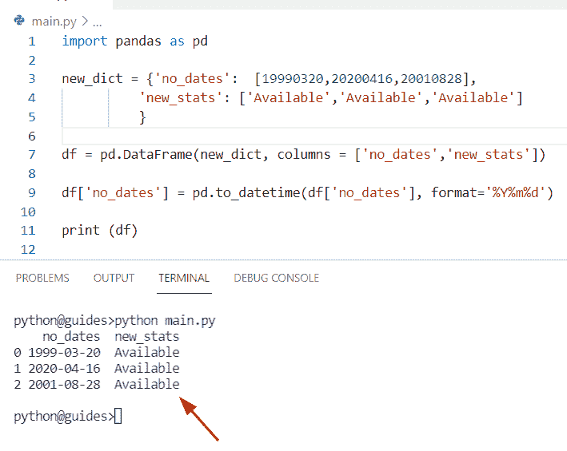
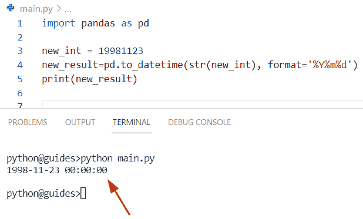
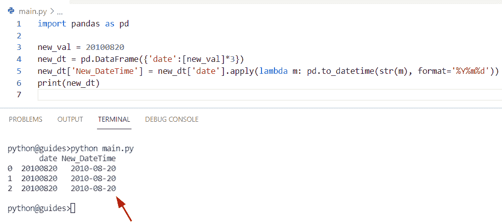
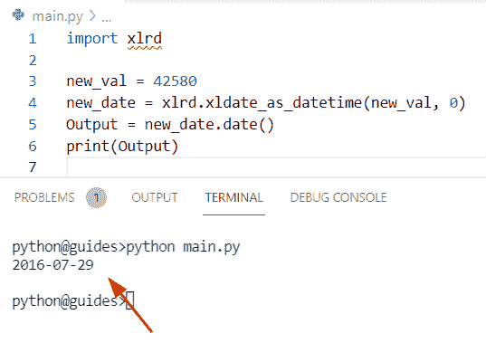
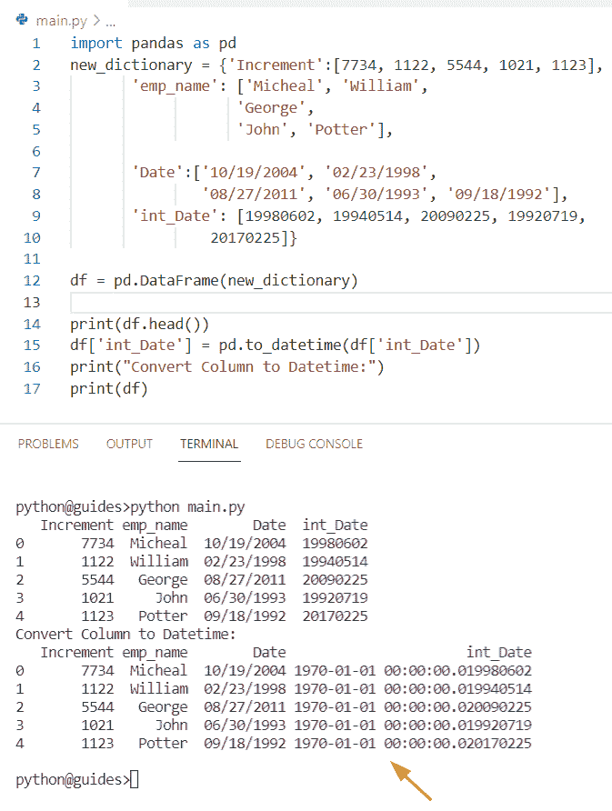
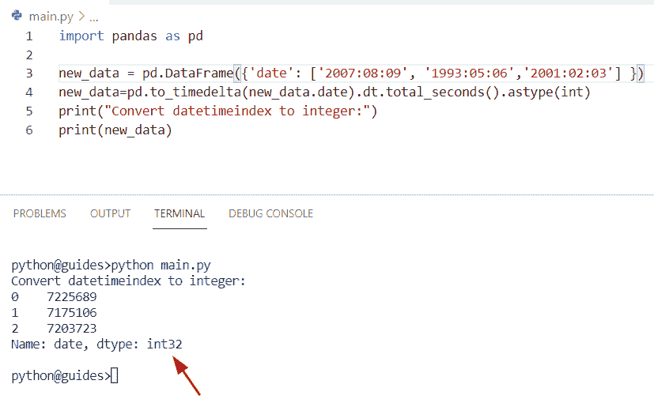
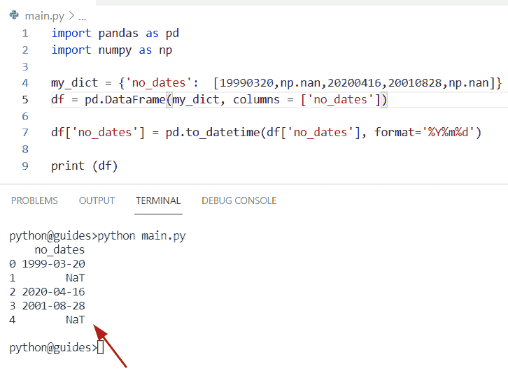
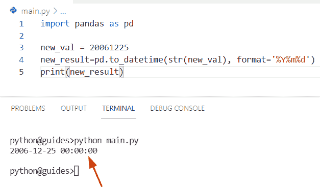
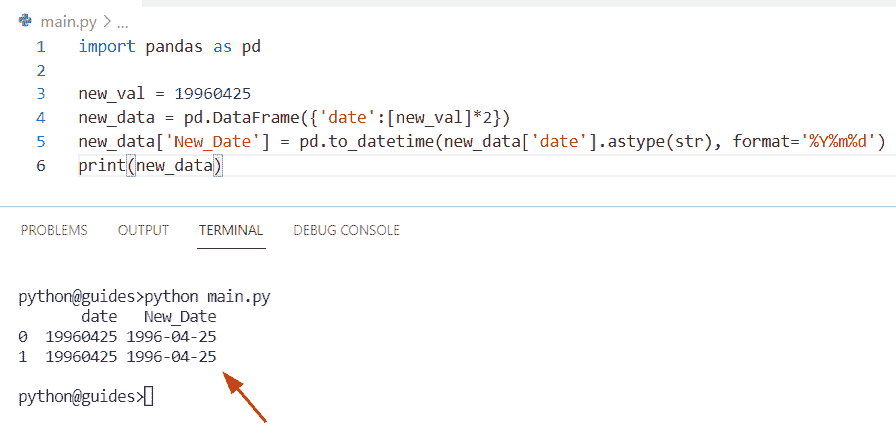

# Python 中熊猫如何把整数转换成 Datetime

> 原文：<https://pythonguides.com/convert-integers-to-datetime-in-pandas/>

[](https://sharepointsky.teachable.com/p/python-and-machine-learning-training-course)

在这个 Python 教程中，我们将学习如何在 Pandas DataFrame 中将整数转换成日期时间。此外，我们将涵盖这些主题。

*   在 Pandas 中将 int 转换为 datetime
*   在熊猫中将数字转换为日期
*   在 Pandas 中将 excel 数字转换为日期
*   将 int 列转换为 datetime Pandas
*   熊猫将 datetimeindex 转换为整数
*   用 nan 将熊猫中的 int 转换为 datetime
*   在 Pandas 中将 int 转换为 datetime，不带小数
*   将熊猫字符串中的 int 转换为 datetime

目录

[](#)

*   [在熊猫中把整数转换成日期时间](#Convert_Integers_to_Datetime_in_Pandas "Convert Integers to Datetime in Pandas")
*   [在熊猫中把 int 转换成 datetime](#Convert_int_to_datetime_in_Pandas "Convert int to datetime in Pandas")
*   [将熊猫的数字转换为日期](#Convert_number_to_date_in_Pandas "Convert number to date in Pandas")
*   [将 excel 数字转换为熊猫的日期](#Convert_excel_number_to_date_in_Pandas "Convert excel number to date in Pandas")
*   [将 int 列转换为 datetime Pandas](#Convert_int_column_to_datetime_Pandas "Convert int column to datetime Pandas")
*   [熊猫将 datetimeindex 转换为整数](#Pandas_convert_datetimeindex_to_integer "Pandas convert datetimeindex to integer")
*   [将 int 转换为 datetime 在熊猫与 nan](#Convert_int_to_datetime_in_Pandas_with_nan "Convert int to datetime in Pandas with nan")
*   [转换 int 为 datetime 在熊猫没有小数](#Convert_int_to_datetime_in_Pandas_without_decimal "Convert int to datetime in Pandas without decimal")
*   [将熊猫字符串中的 int 转换成 datetime](#Convert_int_to_datetime_in_Pandas_string "Convert int to datetime in Pandas string")

## 在熊猫中把整数转换成日期时间

*   在这个程序中，我们将讨论如何使用 Python 将 Pandas DataFrame 中的整数转换为 Datetime。
*   通过使用熊猫。Datetime() 方法我们可以执行这个特定的任务，要执行这个任务，首先必须检查整数数据必须与指定的格式匹配。

**语法:**

下面是熊猫的句法。日期时间()方法

```py
Pandas.to_datetime
                  (
                   arg,
                   errors='raise',
                   dayfirst='False',
                   yearfirst='False',
                   utc=None,
                   format=None,
                   exact=True,
                   unit=None,
                   infer_datetime_format=false,
                   origin='unix',
                   cache=True
                  )
```

**举例:**

让我们举一个例子，并检查如何使用 Python 将 Pandas Dataframe 中的整数转换为 datetime

```py
import pandas as pd

new_dict = {'no_dates':  [19990320,20200416,20010828],
          'new_stats': ['Available','Available','Available']
          }

df = pd.DataFrame(new_dict, columns = ['no_dates','new_stats'])

df['no_dates'] = pd.to_datetime(df['no_dates'], format='%Y%m%d')

print (df)
```

在上面的代码中，我们创建了三个不同的日期，格式为 `(yyy-mm-dd)` 。现在我们将声明 dataframe 对象，并在列表中指定字典**‘new _ dict’**和列名。现在使用 `Pandas.to_Datetime()` 方法将整数转换为日期时间。

下面是以下给定代码的执行过程



Convert Integers to Datetime in Pandas

另外，检查: [Python 熊猫替换多个值](https://pythonguides.com/pandas-replace-multiple-values/)

## 在熊猫中把 int 转换成 datetime

*   让我们看看如何使用 Python 将 Pandas 数据帧中的 int 转换为 datetime。
*   这里我们可以使用 `pd.to_datetime()` 方法，这个函数将把你的整数数据转换成日期格式。

**语法:**

下面是 pd.to_datetime()方法的语法

```py
Pandas.to_datetime
                  (
                   arg,
                   errors='raise',
                   dayfirst='False',
                   yearfirst='False',
                   utc=None,
                   format=None,
                   exact=True,
                   unit=None,
                   infer_datetime_format=false,
                   origin='unix',
                   cache=True
                  )
```

*   它由几个参数组成
    *   **arg:** 此参数指定要转换为日期时间的对象，对象必须是整数、字符串或浮点数。
    *   **错误:**默认情况下，其值为**‘引发’**，表示无效解析会引发异常。
    *   **dayfirst:** 该参数将帮助您了解您的**‘日’**是否在您的格式中处于第一位，默认情况下，其值为**‘假’**。
    *   **yearfirst:** 表示如果您的年份是第一年，则首先尝试格式代码选项，默认情况下，它采用**‘false’**值。
    *   **utc:** 如果您想用时区转换您的日期时间，可以使用这个参数。
    *   **格式:**该参数用于显示日期时间的格式代码。

**源代码:**

```py
import pandas as pd

new_int = 19981123
new_result=pd.to_datetime(str(new_int), format='%Y%m%d')
print(new_result)
```

在上面的程序中，我们已经导入了 Pandas 库，然后用变量名**‘new _ int’**初始化一个整数值。现在使用 `pd.to_datetime()` 方法，并将 str 数据类型与**‘new _ int’**一起赋值。一旦您打印了【T6’new _ result’，输出将显示日期时间格式。

你可以参考下面的截图



Convert int to datetime in Pandas

阅读: [Python 数据帧到 CSV](https://pythonguides.com/python-dataframe-to-csv/)

## 将熊猫的数字转换为日期

*   在这一节中，我们将讨论如何使用 Python 将 Pandas 数据帧中的数字转换为日期。
*   在这个例子中，我们必须将一个整数转换成熊猫数据帧中的日期。为了执行这个任务，我们首先要使用 `pd.to_datetime()` 方法，这将帮助用户转换 Dataframe 中带有日期的数字。

**举例:**

```py
import pandas as pd

new_val = 20100820
new_dt = pd.DataFrame({'date':[new_val]*3})
new_dt['New_DateTime'] = new_dt['date'].apply(lambda m: pd.to_datetime(str(m), format='%Y%m%d'))
print(new_dt)
```

在上面的代码中，我们创建了一个 dataframe 对象 **'new_dt'** ，然后传递整数变量名 **'new_val'** 和 *`3` ，这意味着它将显示三次。现在使用 lambda 函数，它计算给定参数的表达式。

下面是以下给定代码的实现



Convert number to date in Pandas

阅读:[获取索引熊猫 Python](https://pythonguides.com/get-index-pandas-python/)

## 将 excel 数字转换为熊猫的日期

*   在这个程序中，我们将讨论如何使用 Python 将熊猫数据框架中的 excel 数字转换为日期。
*   在这里，我们可以使用一个 excel 数字的例子来完成这项任务，在内部使用一个名为 xlrd 的库，它可以用于读取输入文件。
*   要在 Python 中安装 xlrd 包，您必须使用 pip install xlrd 命令，该模块允许用户从 excel 数字或文件中读取数据。

**语法:**

以下是 xldate_as_datetime 的语法

```py
xlrd.xldate_as_datetime()
```

**源代码:**

```py
import xlrd

new_val = 42580
new_date = xlrd.xldate_as_datetime(new_val, 0)
Output = new_date.date()
print(Output)
```

安装“xlrd”包后，您必须导入示例中的 xlrd 库，现在使用 `xldate_as_datetime()` 方法将 excel 数字转换为 datetime 对象。

下面是以下给定代码的输出



Convert excel number to date in Pandas

阅读:[计算熊猫数据帧中的行数](https://pythonguides.com/count-rows-in-pandas-dataframe/)

## 将 int 列转换为 datetime Pandas

*   让我们看看如何使用 Python Pandas 将整数列转换为 datetime。
*   在 Python 中，如果您想将一个列转换成 datetime，那么您可以很容易地应用 `pd.to_datetime()` 方法。要执行此任务，首先从字典创建一个 dataframe，然后使用 pd.dataframe 类将字典作为输入。
*   现在，要将 integer 列转换为 datetime，请使用括号中的 data frame**‘df’**，并在这个括号中注明要转换为 datetime 的列名。

**源代码:**

```py
import pandas as pd
new_dictionary = {'Increment':[7734, 1122, 5544, 1021, 1123],
       'emp_name': ['Micheal', 'William',
                   'George',
                   'John', 'Potter'],

       'Date':['10/19/2004', '02/23/1998', 
               '08/27/2011', '06/30/1993', '09/18/1992'],
       'int_Date': [19980602, 19940514, 20090225, 19920719,
                20170225]}

df = pd.DataFrame(new_dictionary)

print(df.head())
df['int_Date'] = pd.to_datetime(df['int_Date'])
print("Convert Column to Datetime:")
print(df)
```

下面是以下代码的截图



Convert int column to datetime Pandas

阅读: [Python 熊猫数据帧 Iterrows](https://pythonguides.com/pandas-dataframe-iterrows/)

## 熊猫将 datetimeindex 转换为整数

*   在本节中，我们将讨论如何使用 Python 在 Pandas Dataframe 中将 datetimeindex 转换为整数。
*   通过使用 `pd.to_timedelta()` 和 `dt.total_seconds()` 方法的组合，我们可以轻松地执行这个特定的任务。在 Pandas 中，timedelta 格式用于添加日期和时间部分，而 `total_seconds()` 方法可直接用于 Timedeltaindex 和 timedelta 值。

**语法:**

下面是 Pandas.to_delta()方法的语法

```py
Pandas.to_delta
               (
                arg,
                unit=None,
                errors='raise'
               )
```

*   它由几个参数组成
    *   **arg:** 该参数指定要用时间增量转换的数据对象。
    *   **单位:**默认为无，取值为' Y '，' M '，' W '，' D '。
    *   **错误:**在这个例子中，我们将设置 errors =‘ignore’。

**举例:**

```py
import pandas as pd

new_data = pd.DataFrame({'date': ['2007:08:09', '1993:05:06','2001:02:03'] })
new_data=pd.to_timedelta(new_data.date).dt.total_seconds().astype(int)
print("Convert datetimeindex to integer:")
print(new_data)
```

下面是以下给定代码的执行过程



Pandas convert datetimeindex to integer

阅读: [Python 将数据帧转换为列表](https://pythonguides.com/python-convert-dataframe-to-list/)

## 将 int 转换为 datetime 在熊猫与 nan

*   在这个程序中，我们将讨论如何将 nan 值的 Pandas 数据帧中的整数转换为 datetime。
*   这里我们可以使用 `Pandas.to_datetime()` 方法来执行这个任务。首先，我们必须导入 pandas 和 numpy 库，然后创建一个包含键值对的字典**‘my _ dict’**。在这个例子中，键被认为是列名，列表值被认为是整数。
*   在给定的列表中，我们指定了一些整数和 nan 值。现在我们想用 datetime 和 nan 一起转换整数。

**源代码:**

```py
import pandas as pd
import numpy as np

my_dict = {'no_dates':  [19990320,np.nan,20200416,20010828,np.nan]}
df = pd.DataFrame(my_dict, columns = ['no_dates'])

df['no_dates'] = pd.to_datetime(df['no_dates'], format='%Y%m%d')

print (df)
```

你可以参考下面的截图



Convert int to datetime in Pandas with nan

正如您在屏幕截图中看到的，输出显示 nan 值已被**“NAT”**替换。在 Python 中，NAT 表示缺少的值。

阅读: [Python 熊猫掉行](https://pythonguides.com/python-pandas-drop-rows-example/)

## 转换 int 为 datetime 在熊猫没有小数

*   在本节中，我们将讨论如何在 Pandas DataFrame 中将 integer 转换为 datetime。
*   我们在开始时已经讨论过这个主题，所以你可以更好地理解这个例子。在本例中，我们应用了相同的方法 Pandas.to_datetime。

**举例:**

```py
import pandas as pd

new_val = 20061225
new_result=pd.to_datetime(str(new_val), format='%Y%m%d')
print(new_result)
```

下面是以下代码的截图



Convert int to datetime in Pandas without decimal

阅读:[如何将熊猫数据帧转换成字典](https://pythonguides.com/how-to-convert-pandas-dataframe-to-a-dictionary/)

## 将熊猫字符串中的 int 转换成 datetime

*   在这个程序中，我们将讨论如何在熊猫字符串中将整数转换为日期时间。
*   通过使用 `astype(str)` 方法，我们可以改变一个系列的数据类型，这个函数还提供了将现有列转换为不同类型的功能。

**语法:**

下面是 df.astype()方法的语法

```py
DataFrame.astype
                (
                 dtype,
                 copy=True,
                 errors='raise'
                )
```

*   它由几个参数组成。
    *   **dtype:** 此参数指定数列与整数或字符串的转换。
    *   **copy:** 默认情况下，它采用“True”值并复制数据帧。
    *   **错误:**该参数指示如果数据类型无效，则出现错误‘引发’。

**举例:**

```py
import pandas as pd

new_val = 19960425
new_data = pd.DataFrame({'date':[new_val]*2})
new_data['New_Date'] = pd.to_datetime(new_data['date'].astype(str), format='%Y%m%d')
print(new_data)
```

下面是以下给定代码的执行过程



Convert int to datetime in Pandas string

你可能也喜欢阅读下面的教程。

*   [如何在 Pandas 中把浮点数转换成整数](https://pythonguides.com/convert-floats-to-integer-in-pandas/)
*   [如何将 Python 数据帧转换成 JSON](https://pythonguides.com/how-to-convert-python-dataframe-to-json/)
*   [如何在 Python 数据帧中找到重复项](https://pythonguides.com/how-to-find-duplicates-in-python-dataframe/)
*   [检查 Python Pandas 中的数据帧是否为空](https://pythonguides.com/check-if-dataframe-is-empty-in-python-pandas/)

在这篇 Python 教程中，我们学习了如何在 Pandas DataFrame 中将整数转换成日期时间。此外，我们已经讨论了这些主题。

*   在 Pandas 中将 int 转换为 datetime
*   在熊猫中将数字转换为日期
*   在 Pandas 中将 excel 数字转换为日期
*   将 int 列转换为 datetime Pandas
*   熊猫将 datetimeindex 转换为整数
*   用 nan 将熊猫中的 int 转换为 datetime
*   在 Pandas 中将 int 转换为 datetime，不带小数
*   将熊猫字符串中的 int 转换为 datetime

[Bijay Kumar](https://pythonguides.com/author/fewlines4biju/)

Python 是美国最流行的语言之一。我从事 Python 工作已经有很长时间了，我在与 Tkinter、Pandas、NumPy、Turtle、Django、Matplotlib、Tensorflow、Scipy、Scikit-Learn 等各种库合作方面拥有专业知识。我有与美国、加拿大、英国、澳大利亚、新西兰等国家的各种客户合作的经验。查看我的个人资料。

[enjoysharepoint.com/](https://enjoysharepoint.com/)[](https://www.facebook.com/fewlines4biju "Facebook")[](https://www.linkedin.com/in/fewlines4biju/ "Linkedin")[](https://twitter.com/fewlines4biju "Twitter")