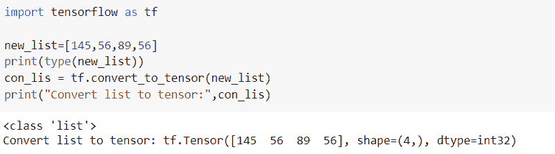
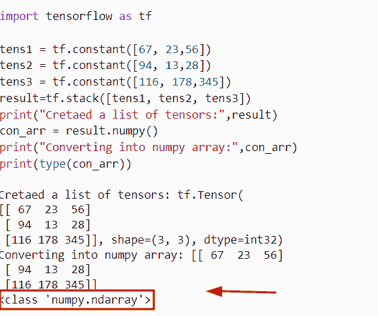
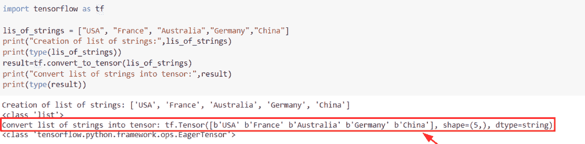
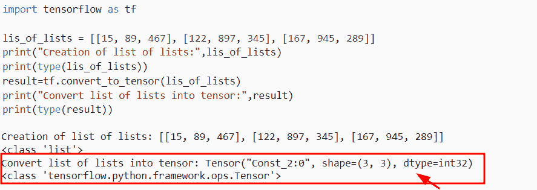
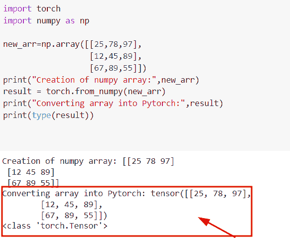

# 将列表转换为张量张量流

> 原文：<https://pythonguides.com/convert-list-to-tensor-tensorflow/>

[](https://sharepointsky.teachable.com/p/python-and-machine-learning-training-course)

在本 [Python 教程](https://pythonguides.com/learn-python/)中，我们将学习**如何在 Python TensorFlow 中将列表转换为张量**。此外，我们将讨论以下主题。

*   将列表转换为张量张量流
*   将张量列表转换为 numpy 数组张量流
*   将字符串列表转换为张量张量流
*   将列表列表转换为张量流张量
*   将数组转换为张量 Pytorch

目录

[](#)

*   [将列表转换为张量张量流](#Convert_list_to_tensor_TensorFlow "Convert list to tensor TensorFlow")
*   [将张量列表转换为 numpy 数组张量流](#Convert_list_of_tensor_to_numpy_array_TensorFlow "Convert list of tensor to numpy array TensorFlow")
*   [将字符串列表转换为张量张量流](#Convert_list_of_strings_to_tensor_TensorFlow "Convert list of strings to tensor TensorFlow")
*   [将列表列表转换为张量流张量](#Convert_list_of_lists_to_tensorflow_tensor "Convert list of lists to tensorflow tensor ")
*   [将数组转换为张量 Pytorch](#Convert_array_to_tensor_Pytorch "Convert array to tensor Pytorch")

## 将列表转换为张量张量流

*   在本节中，我们将讨论如何使用 [TensorFlow Python](https://pythonguides.com/tensorflow/) 将列表转换为张量。
*   为了将 Python 列表转换为张量，我们将使用 `tf.convert_to_tensor()` 函数，该函数将帮助用户将给定的对象转换为张量。
*   在这个例子中，对象可以是一个 Python 列表，通过使用函数将返回一个张量。

**语法:**

让我们看一下语法，了解一下 Python TensorFlow 中的 `tf.convert_to_tensor()` 函数的工作原理。

```py
tf.convert_to_tensor
                   (
                    value,
                    dtype=None,
                    dtype_hint=None,
                    name=None
                   )
```

*   它由几个参数组成
    *   **值:**该参数表示我们要将张量转换成的对象。
    *   **dtype:** 可选参数，指定值的类型。
    *   **名称:**该参数表示操作的名称，也是可选参数。

**举例:**

让我们举一个例子，看看如何在 Python TensorFlow 中将列表转换成张量。

**源代码:**

```py
import tensorflow as tf

new_list=[145,56,89,56]
print(type(new_list))
con_lis = tf.convert_to_tensor(new_list)
print("Convert list to tensor:",con_lis)
```

在下面的代码中，我们首先导入 TensorFlow 库，然后声明一个变量**‘new _ list’**，并在 list 对象中赋值。要检查它是 list 还是 NumPy，可以使用语法类型 `(obj_name)` 。

之后，我们使用了 `tf.convert_to_tensor()` 函数，在这个函数中，我们分配了列表对象**‘new _ list’**。一旦执行了这段代码，输出将显示张量对象。

下面是下面给出的代码的截图。



Python Convert list to tensor TensorFlow

阅读: [TensorFlow Tensor to numpy](https://pythonguides.com/tensorflow-tensor-to-numpy/)

## 将张量列表转换为 numpy 数组张量流

*   这里我们将讨论如何在 Python TensorFlow 中将一个张量列表转换成一个 numpy 数组。
*   为了执行这个任务，我们将使用 `tf.stack()` 函数来创建一个张量列表。在 Python 中，这个函数用于将一列张量与一个新的张量组合起来。在这个例子中，我们将首先使用 `tf.constant()` 函数创建三个张量，然后我们将使用 `tf.stack()` 函数来组合列表中的这些张量。
*   接下来，我们将使用 `tensor.numpy()` 函数，该函数将帮助用户将张量转换为 numpy 数组，它是 TensorFlow 中的内置函数。

**语法:**

下面是 Python TensorFlow 中 `tf.stack()` 函数的语法。

```py
tf.stack
        (
         values,
         axis=0,
         name='stack'
        )
```

*   它由几个参数组成
    *   **值:**该参数表示具有相同大小和形状的张量对象列表。
    *   **轴:**默认取 `0` 值，定义第一个尺寸。
    *   name:该参数表示操作的名称，默认情况下取**‘Stack’**值。

**举例:**

让我们举一个例子，看看如何在 Python TensorFlow 中将张量列表转换为 numpy 数组。

**源代码:**

```py
import tensorflow as tf

tens1 = tf.constant([67, 23,56])
tens2 = tf.constant([94, 13,28])
tens3 = tf.constant([116, 178,345])
result=tf.stack([tens1, tens2, tens3])
print("Cretaed a list of tensors:",result)
con_arr = result.numpy()
print("Converting into numpy array:",con_arr)
print(type(con_arr))
```

在上面的代码中，我们已经导入了 Tensorflow 库，然后使用 `tf.constant()` 函数创建了一个张量。创建张量后，我们已经通过使用 `tf.stack()` 函数组合了张量列表，然后我们使用 `tensor.numpy()` 函数将张量转换为 numpy 数组。

下面是以下给定代码的执行。



Python Convert list of tensor to numpy array TensorFlow

阅读:[张量流得到形状](https://pythonguides.com/tensorflow-get-shape/)

## 将字符串列表转换为张量张量流

*   在本节中，我们将讨论如何在 Python TensorFlow 中将字符串列表转换为张量。
*   为了执行这个特定的任务，我们将使用 `tf.convert_to_tensor()` 函数，这个函数用于将给定的对象转换成张量。在这个例子中，输入对象将是一个字符串列表。
*   接下来，我们将使用 `tf.convert_to_tensor()` 函数，并将字符串列表作为参数传递。

**语法:**

下面是 Python TensorFlow 中 `tf.convert_to_tensor()` 函数的语法。

```py
tf.convert_to_tensor
                   (
                    value,
                    dtype=None,
                    dtype_hint=None,
                    name=None
                   )
```

**举例:**

让我们举一个例子，检查如何在 Python TensorFlow 中将字符串列表转换为张量。

**源代码:**

```py
import tensorflow as tf

lis_of_strings = ["USA", "France", "Australia","Germany","China"]
print("Creation of list of strings:",lis_of_strings)
print(type(lis_of_strings))
result=tf.convert_to_tensor(lis_of_strings)
print("Convert list of strings into tensor:",result)
print(type(result))
```

在下面的代码中，我们首先创建了一个字符串列表，并使用 type(object_name)检查了数据类型。

在本例中，对象名为 `lis_of_strings` ，然后我们使用了 `tf.convert_to_tensor()` 函数，并将 `lis_of_strings` 指定为参数。一旦执行了这段代码，输出就会显示张量。

下面是以下给定代码的实现。



Python Convert list of strings to tensor TensorFlow

阅读:[Python tensor flow reduce _ sum](https://pythonguides.com/python-tensorflow-reduce_sum/)

## 将列表列表转换为张量流张量

*   在这一节中，我们将讨论如何在 Python TensorFlow 中将列表转换为张量。
*   通过使用 `tf.convert_to_tensor()` 函数，我们可以很容易地将列表的列表转换成张量。首先，我们将创建一个嵌套列表，这意味着一个列表列表，然后我们将分配整数值。
*   接下来，我们将使用 `tf.convert_to_tensor()` 函数将列表列表转换为张量。

**语法:**

下面是 Python 中 `tf.convert_to_tensor()` 函数的语法。

```py
tf.convert_to_tensor
                   (
                    value,
                    dtype=None,
                    dtype_hint=None,
                    name=None
                   )
```

**举例:**

让我们举个例子，检查一下如何在 Python TensorFlow 中把一列列表转换成张量。

**源代码:**

```py
import tensorflow as tf

lis_of_lists = [[15, 89, 467], [122, 897, 345], [167, 945, 289]]
print("Creation of list of lists:",lis_of_lists)
print(type(lis_of_lists))
result=tf.convert_to_tensor(lis_of_lists)
print("Convert list of lists into tensor:",result)
print(type(result)) 
```

下面是下面给出的代码的截图。



Python Convert list of lists to TensorFlow tensor

阅读:[Python tensor flow reduce _ mean](https://pythonguides.com/python-tensorflow-reduce_mean/)

## 将数组转换为张量 Pytorch

*   这里我们将讨论如何在 Python 中将 numpy 数组转换成 Pytorch 张量。
*   为了完成这项任务，我们将使用 `torch.fromnumpy()` 函数，该函数用于将给定的 numpy 数组转换为 pytorch 张量。
*   在 Python **中，torch.tensor** 与包含单一数据类型元素的 numpy 数组相同。

**语法:**

让我们看一下语法，理解一下 `torch.from numpy()` 函数的工作原理。

```py
torch.fromnumpy(ndarray)
```

**举例:**

让我们举个例子，看看如何将 numpy 数组转换成 Pytorch 张量。

**源代码:**

```py
import torch
import numpy as np

new_arr=np.array([[25,78,97],
                  [12,45,89],
                  [67,89,55]])
print("Creation of numpy array:",new_arr)
result = torch.from_numpy(new_arr)
print("Converting array into Pytorch:",result)
print(type(result))
```

在下面给定的代码中，我们导入了 numpy 库，然后使用 `np.array()` 函数创建了一个 numpy 数组。在创建了一个数组之后，我们使用了 `torch.from_numpy()` 函数，在这个函数中，我们将数组指定为一个参数。

下面是以下给定代码的输出



Python Convert array to tensor Pytorch

正如你在截图中看到的，输出显示火炬张量。

还有，多看看 TensorFlow 里的一些教程。

*   [Tensorflow 迭代张量](https://pythonguides.com/tensorflow-iterate-over-tensor/)
*   [张量流图-详细指南](https://pythonguides.com/tensorflow-graph/)
*   [TensorFlow 获取变量+示例](https://pythonguides.com/tensorflow-get-variable/)
*   [导入错误没有名为 TensorFlow 的模块](https://pythonguides.com/import-error-no-module-named-tensorflow/)
*   [模块“张量流”没有属性“会话”](https://pythonguides.com/module-tensorflow-has-no-attribute-session/)

在这个 Python 教程中，我们学习了**如何在 Python 中将 list 转换为 tensor TensorFlow** 。此外，我们还讨论了以下主题。

*   将列表转换为张量张量流
*   将张量列表转换为 numpy 数组张量流
*   将字符串列表转换为张量张量流
*   将列表列表转换为张量流张量
*   将数组转换为张量 Pytorch

[Bijay Kumar](https://pythonguides.com/author/fewlines4biju/)

Python 是美国最流行的语言之一。我从事 Python 工作已经有很长时间了，我在与 Tkinter、Pandas、NumPy、Turtle、Django、Matplotlib、Tensorflow、Scipy、Scikit-Learn 等各种库合作方面拥有专业知识。我有与美国、加拿大、英国、澳大利亚、新西兰等国家的各种客户合作的经验。查看我的个人资料。

[enjoysharepoint.com/](https://enjoysharepoint.com/)[](https://www.facebook.com/fewlines4biju "Facebook")[](https://www.linkedin.com/in/fewlines4biju/ "Linkedin")[](https://twitter.com/fewlines4biju "Twitter")