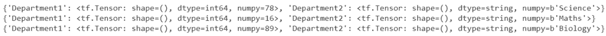
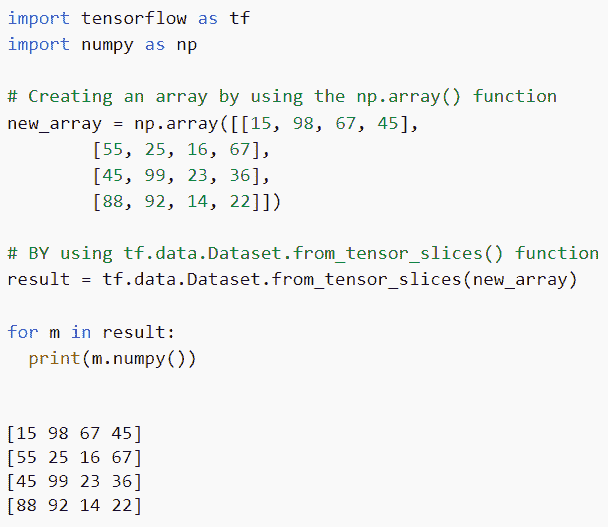
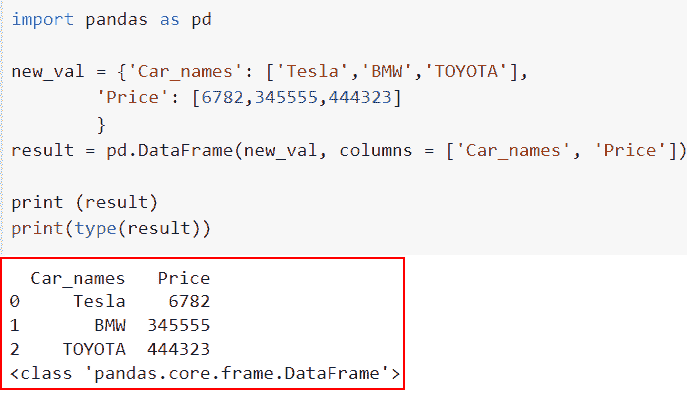
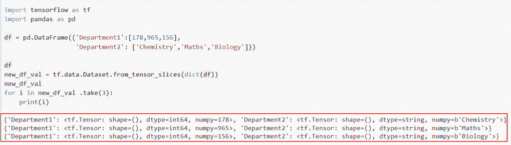

# 将 pandas 数据框架转换为 tensorflow 数据集

> 原文：<https://pythonguides.com/convert-pandas-dataframe-to-tensorflow-dataset/>

[](https://sharepointsky.teachable.com/p/python-and-machine-learning-training-course)

TensorFlow 数据集用于许多 [TensorFlow](https://pythonguides.com/tensorflow/) 示例中。那么，你到底如何**将熊猫数据帧转换成张量流数据集**？在这种情况下，我们将首先生成一个 pandas 数据框，然后使用 TensorFlow 加载它。

*   将 pandas 数据框架转换为 TensorFlow 数据集
*   将 NumPy 数组转换为 TensorFlow 数据集
*   如何将字典转换成熊猫数据框架
*   熊猫级数到张量流张量
*   熊猫数据框 vs 张量流

目录

[](#)

*   [将熊猫数据帧转换为 TensorFlow 数据集](#Convert_pandas_data_frame_to_TensorFlow_dataset "Convert pandas data frame to TensorFlow dataset")
*   [将 NumPy 数组转换为 TensorFlow 数据集](#Convert_NumPy_array_to_TensorFlow_dataset "Convert NumPy array to TensorFlow dataset")
*   [如何将字典转换成熊猫数据框架](#How_to_convert_the_dictionary_into_a_Pandas_DataFrame "How to convert the dictionary into a Pandas DataFrame ")
*   [熊猫级数到张量流张量](#Pandas_series_to_TensorFlow_tensor "Pandas series to TensorFlow tensor")
*   [熊猫 DataFrame vs TensorFlow](#Pandas_DataFrame_vs_TensorFlow "Pandas DataFrame vs TensorFlow")

## 将 pandas 数据框转换为 TensorFlow 数据集

*   这里我们将讨论如何在 Python TensorFlow 中将 [pandas](https://pythonguides.com/pandas-in-python/) dataframe 转换为 Tensorflow 数据集。
*   在本例中，我们将创建一个虚拟熊猫数据框，并将其转换为 TensorFlow 数据集。为此，我们将使用`TF . data . dataset . from _ tensor _ slices()`函数。
*   来自张量的每个输入张量创建一个类似于数据集的一行的数据集，而来自张量切片的每个输入张量创建一个类似于数据的一列的数据集。因此，在这种情况下，所有张量的长度必须相同，结果数据集的元素(行)是每个元素一个的元组。
*   使用 tf.data 作为资源，数组的切片可以通过使用`dataset . from tensor slices()`函数和 TF . data . using dataset . from tensor slices()函数作为对象获得。

**语法**:

我们先来看看语法，了解一下`TF . data . dataset . from _ tensor _ slices()`函数在 Python TensorFlow 中的工作原理。

```py
tf.data.Dataset.from_tensor_slices(list)
```

**举例**:

```py
import tensorflow as tf
import pandas as pd

df = pd.DataFrame({'Department1':[78,16,89],
                   'Department2': ['Science','Maths','Biology']})

df
new_df_val = tf.data.Dataset.from_tensor_slices(dict(df))
new_df_val 
for i in new_df_val .take(3):
    print(i)
```

在下面的代码中，我们首先导入了 tensorflow 和 pandas 库，然后使用 pd 创建了一个 dataframe。DataFrame()函数，其中我们分配了两列**‘部门 1’，‘部门 2’**。

接下来，我们通过使用`TF . data . dataset . from _ tensor _ slices()`将给定的数据帧转换为张量数据集，然后迭代张量中的所有列值。

下面是以下代码的截图



Convert pandas dataframe to TensorFlow dataset

这就是如何在 Python TensorFlow 中将 Pandas 数据帧转换为 TensorFlow 数据集。

阅读: [TensorFlow Tensor to numpy](https://pythonguides.com/tensorflow-tensor-to-numpy/)

## 将 NumPy 数组转换为 TensorFlow 数据集

*   在本节中，我们将讨论如何将 [Numpy](https://pythonguides.com/numpy/) 数组转换为 TensorFlow 数据集。
*   为了执行这项任务，我们将使用`TF . data . dataset . from _ tensor _ slices()`函数，该函数可以轻松地将 numpy 数组转换为数据集。

**举例**:

```py
import tensorflow as tf
import numpy as np

# Creating an array by using the np.array() function
new_array = np.array([[15, 98, 67, 45],
				[55, 25, 16, 67],
				[45, 99, 23, 36],
				[88, 92, 14, 22]])

# BY using tf.data.Dataset.from_tensor_slices() function
result = tf.data.Dataset.from_tensor_slices(new_array)

for m in result:
	print(m.numpy())
```

在这个例子中，我们使用了 `np.array()` 函数来创建一个数组，然后将整数值赋给它。接下来，我们通过使用`TF . data . dataset . from _ tensor _ slices()`函数将数组转换为数据集。

下面是以下给定代码的执行过程



Convert NumPy array to TensorFlow dataset

正如您在截图中看到的，我们已经将 numpy 数组转换为 TensorFlow 数据集。

阅读:[Python tensor flow reduce _ sum](https://pythonguides.com/python-tensorflow-reduce_sum/)

## 如何将字典转换成熊猫数据框架

*   要将 [Python 字典](https://pythonguides.com/create-a-dictionary-in-python/)转换成 DataFrame (dict)对象，请使用**熊猫。DataFrame.to dict()** 方法。如果要将 DataFrame 转换成 Python dictionary (dict)对象，可以使用这种方法，方法是将每行的列数据转换成键，将列名转换成值。
*   这些参数定义了字典的结构以及键值对的连接方式。使用 to-dict 函数实现简单的数据帧到字典的转换。

**语法**:

下面是 DataFrame.to_dict()函数的语法

```py
DataFrame.to_dict(orient='dict’, into=)
```

*   它由几个参数组成
    *   **orient:** 定义结果 dict 的键值对结构。输入参数、创建 dict 的格式以及生成的 dict 的键值对都会显示出来，默认情况下，它采用‘dict’值。
    *   **into:** 用于定义结果字典的类型。我们可以给出一个实际的类或者一个空的实例。

**举例**:

```py
import pandas as pd

new_val = {'Car_names': ['Tesla','BMW','TOYOTA'],
        'Price': [6782,345555,444323]
        }
result = pd.DataFrame(new_val, columns = ['Car_names', 'Price'])

print (result)
print(type(result))
```

你可以参考下面的截图



How to convert the dictionary into a Pandas DataFrame

这就是我们如何将字典转换成熊猫数据框架的方法。

阅读:[Python tensor flow reduce _ mean](https://pythonguides.com/python-tensorflow-reduce_mean/)

## 熊猫级数到张量流张量

*   让我们看看如何将 pandas 系列数据转换为 TensorFlow 张量。
*   为了完成这项任务，我们将使用`TF . data . dataset . from _ tensor _ slices()`函数，该函数从张量中提取每个输入张量，以创建一个类似于数据集中一行的数据集，而张量切片中的每个输入张量创建一个类似于数据列的数据集。

**举例**:

```py
import tensorflow as tf
import pandas as pd

df = pd.DataFrame({'Department1':[178,965,156],
                   'Department2': ['Chemistry','Maths','Biology']})

df
new_df_val = tf.data.Dataset.from_tensor_slices(dict(df))
new_df_val 
for i in new_df_val .take(3):
    print(i)
```

在下面的代码中，我们首先导入了 tensorflow 和 pandas 库，然后使用 pd 创建了一个 dataframe。DataFrame()函数，其中我们分配了两列“部门 1”和“部门 2”。

接下来，我们使用 TF . data . dataset . from _ tensor _ slices()将给定的数据帧转换为张量数据集，然后迭代张量中的所有列值。

下面是以下给定代码的实现



Pandas series to TensorFlow tensor

阅读:[Python tensor flow expand _ dims](https://pythonguides.com/tensorflow-expand_dims/)

## 熊猫 DataFrame vs TensorFlow

*   二维数据及其相关标签存储在一个称为熊猫数据帧的结构中。在数据科学、机器学习、科学计算和许多其他处理大量数据的领域中，经常使用数据帧。
*   张量是一个 n 维向量或矩阵，可以表示任何类型的数据。张量的值都具有相同的数据类型和已知(或至少部分已知)的形状。矩阵或数组的维数对应于数据的形状。
*   列可以是不同的类型，例如 int、bool 等，它可以与列和行都被索引的系列结构字典相比较。对于列，它被定义为“列”，对于行，它被定义为“索引”
*   计算的输入数据和输出都会产生张量。在 TensorFlow 中，每个操作都发生在一个图形中。该图表示按顺序发生的一系列计算。每个操作之间的连接称为 op 节点。

在本主题中，我们讨论了熊猫数据框架和张量流之间的主要区别

你可能也喜欢阅读下面的 Tensorflow 教程。

*   [TensorFlow 全连通层](https://pythonguides.com/tensorflow-fully-connected-layer/)
*   [TensorFlow 学习率调度器](https://pythonguides.com/tensorflow-learning-rate-scheduler/)
*   [批量归一化张量流](https://pythonguides.com/batch-normalization-tensorflow/)
*   [TensorFlow 自然语言处理](https://pythonguides.com/tensorflow-natural-language-processing/)

在本文中，我们已经讨论了如何 ***将 pandas 数据帧转换为 tensorflow 数据集*** ，并且我们已经涵盖了以下给定主题

*   将 pandas 数据框架转换为 TensorFlow 数据集
*   将 NumPy 数组转换为 TensorFlow 数据集
*   如何将字典转换成熊猫数据框架
*   熊猫级数到张量流张量
*   熊猫数据框 vs 张量流

[Bijay Kumar](https://pythonguides.com/author/fewlines4biju/)

Python 是美国最流行的语言之一。我从事 Python 工作已经有很长时间了，我在与 Tkinter、Pandas、NumPy、Turtle、Django、Matplotlib、Tensorflow、Scipy、Scikit-Learn 等各种库合作方面拥有专业知识。我有与美国、加拿大、英国、澳大利亚、新西兰等国家的各种客户合作的经验。查看我的个人资料。

[enjoysharepoint.com/](https://enjoysharepoint.com/)[](https://www.facebook.com/fewlines4biju "Facebook")[](https://www.linkedin.com/in/fewlines4biju/ "Linkedin")[](https://twitter.com/fewlines4biju "Twitter")