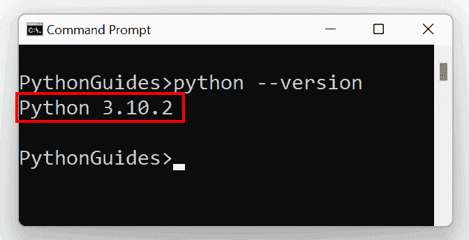
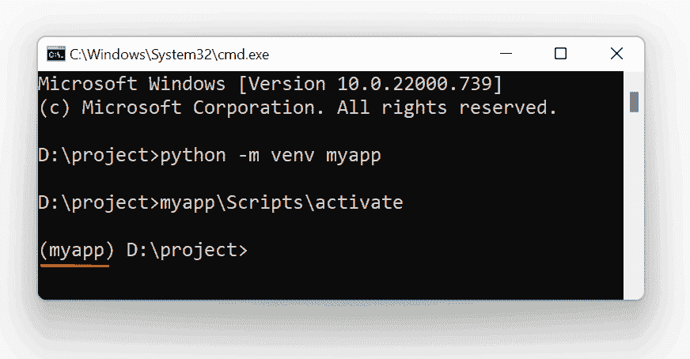
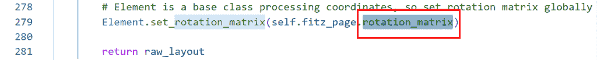
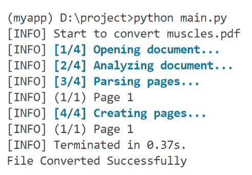

# 用 Python 将 PDF 文件转换成 Docx

> 原文：<https://pythonguides.com/convert-pdf-file-to-docx-in-python/>

[](https://sharepointsky.teachable.com/p/python-and-machine-learning-training-course)

最近，我们接到一个需求，需要构建一个 Python 应用程序，将 PDF 文件转换为 word 文档(Docx 文件)。现在，对于 Python 中的这个任务，我们利用 Python 中的 *`pdf2docx`* 包。但是在实现中，我们得到一个错误，说明“***”attribute error:“页面”对象没有属性“旋转矩阵”。你是说‘旋转矩阵’吗？*** ”。

所以，在这个 [Python 教程](https://pythonguides.com/learn-python/)中，我们将了解如何解决这个错误以及 ***在 Python*** 中将 PDF 文件转换为 Docx。这是我们将要讨论的话题清单。

*   “将 PDF 文件转换为 Python 中的 Docx”的先决条件
*   Python 中的将 PDF 文件转换为 Docx 错误
*   使用 Converter()将 PDF 文件转换为 Python 中的 Docx
*   使用 parse()在 Python 中将 PDF 文件转换为 Docx

目录

[](#)

*   [“用 Python 将 PDF 文件转换成 Docx”的先决条件](#Prerequisite_for_Convert_PDF_file_to_Docx_in_Python "Prerequisite for “Convert PDF file to Docx in Python”")
    *   [检查 Python 版本](#Checking_Python_Version "Checking Python Version")
    *   [安装 pdf2docx 包](#Installing_pdf2docx_package "Installing pdf2docx package")
*   [用 Python 把 PDF 文件转换成 Docx](#Convert_PDF_file_to_Docx_in_Python "Convert PDF file to Docx in Python ")
    *   [使用转换器()类](#Using_Converter_class "Using Converter() class")
    *   [在 Python 中将 PDF 文件转换为 Docx 错误](#Convert_PDF_file_to_Docx_in_Python_Error "Convert PDF file to Docx in Python Error")
    *   [使用 parse()函数](#Using_parse_function "Using parse() function")

## “用 Python 将 PDF 文件转换成 Docx”的先决条件

### 检查 Python 版本

在我们开始实现 PDF 到 Docx 的转换之前，我们需要确保 python 正确地安装在我们的系统中。现在，我们可以通过在命令提示符或终端中使用以下命令来检查 python 的版本。

```py
python --version
```

但是，对于当前实例，我们使用的是 Windows 操作系统，因此我们将使用 Windows 命令提示符。下面是上面命令的结果。



Check the Python version in CMD

所以，从输出中，你可以观察到我们使用的是 Python 版本***3 . 10 . 2*T3。**

另外，检查:[什么是 Python 字典](https://pythonguides.com/create-a-dictionary-in-python/)

### 安装 *`pdf2docx`* 包

在这之后，下一个先决条件是 *`pdf2docx`* 包。这个 Python 库利用 Python 绑定的 *`PyMuPDF`* 从 PDF 文件中提取数据并解释其布局。然后它使用 `*python-docx*` 库创建 word 文档文件。

这里的 `*python-docx*` 是另一个有用的库，通常用于生成和编辑 Microsoft Word ( ***)。docx*** )文件。

现在，这个 *`pdf2docx`* 包是第三方包，所以在使用它之前，我们需要将它安装在我们的系统或虚拟环境中。

下面是我们将创建一个虚拟环境，然后使用 pip 命令在其中安装 *`pdf2docx`* 包的基本步骤。

用 Python 创建虚拟环境的命令。

```py
python -m venv myapp
```

在上面的命令中， *`myapp`* 是虚拟环境的名称。但是，您也可以指定任何其他环境名称。

下一步是激活虚拟环境，我们将使用以下命令来完成此任务。

```py
myapp\Scripts\activate
```

一旦虚拟环境被激活，虚拟环境的名称将出现在终端的启动处。



Convert PDF file to Docx in Python Example

现在，我们准备在我们的 *`myapp`* 虚拟环境中安装 *`pdf2docx`* 包。对于这个任务，我们将使用下面的 *`pip`* 命令。

```py
pip install pdf2docx
```

一旦我们运行上面的命令，它将安装与这个 *`pdf2docx`* 包相关的所有必需的包。

> **重要:**
> 
> In our case, it has install the *`pdf2docx`* version *`0.5.3`*. And the error wheich we are goining to resolve will also come in the same version. If you have installed some other version there is a possibility that you don’t recieve any or same error.

阅读: [Python 命名约定](https://pythonguides.com/python-naming-conventions/)

## 用 Python 把 PDF 文件转换成 Docx

一旦我们安装了 *`pdf2docx`* 包，我们就可以使用 Python 中的这个包将 pdf 文件转换成扩展名为. docx 的 word 文档。对于这个任务，我们在 pdf2docx 中有 2 个不同的方法。第一种方法包括使用包中的 Converter()类，第二种方法包括使用 *`parse()`* 函数。

让我们用 Python 中的一个例子来讨论每种方法。

### 使用转换器()类

*   *`Converter()`* 类利用 *`PyMuPDF`* 读取指定的 PDF 文件并逐页获取原始布局数据，包括文本、图像及其相关属性。
*   之后，它在页眉、页脚和页边距级别检查文档的布局。
*   接下来，它将把页面布局解析为 docx 结构。最后，使用“***”python-docx***”生成一个 docx 文件作为结果。

让我们了解一下在 Python 中如何使用这个 *`Converter()`* 类将 PDF 转换成 word 文档。

```py
# Importing the Converter() class
from pdf2docx import Converter

# Specifying the pdf & docx files
pdf_file = 'muscles.pdf'
docx_file = 'muscles.docx'

try:
    # Converting PDF to Docx
    cv_obj = Converter(pdf_file)
    cv_obj.convert(docx_file)
    cv_obj.close()

except:
    print('Conversion Failed')

else:
    print('File Converted Successfully')
```

在上面的代码中，首先，我们从 *`pdf2docx`* 模块中导入了 *`Converter()`* 类。在这之后，我们定义了两个变量来指定我们想要转换的 pdf 文件和结果 word 文件的文件和路径。对于当前实例，我们将*`muscles.pdf`*文件保存在保存 python 文件的同一个工作目录中。

接下来，我们创建了一个名为 *`cv_obj`* 的 *`Converter()`* 类的对象，我们在其中传递了 pdf_file 变量作为参数。然后对象利用***【convert()***方法转换文件。而且，在 *`convert()`* 方法内，我们传递了 *`docx_file`* 变量作为参数。

最后，我们利用 *`close()`* 方法关闭文件。接下来，运行 python 程序，它将创建一个名为 *`muscles.docx`* 的新 docx 文件，该文件也将包含 pdf 文件中的所有数据。

### 在 Python 中将 PDF 文件转换为 Docx 错误

现在，这里如果你也安装了 *`pdf2docx`* 版本 *`0.5.3`* 那么很有可能你这边的转换也失败了，它返回 **" *转换失败*** "。发生这种情况是由于 `*try-except*` 块在执行时引发了异常。

这里，如果我们去掉 `*try-except*` 块，然后执行程序，就会返回如下错误。

> ***attribute 错误:“页面”对象没有属性“rotationMatrix”。你是说‘旋转矩阵’吗？***

现在，要解决 Python 中的上述错误，我们需要遵循以下步骤。

*   首先，进入虚拟环境目录并转到以下文件夹。这里是我们这边的路径:“D:\ project \ myapp \ Lib \ site-packages”。除此之外，如果你没有使用过虚拟环境，你需要转到以下路径:***C:\ users \ UserName \ appdata \ roaming \ python \ python 310 \ site-packages***。

在第二个路径中，请正确插入您的用户名和 python 目录。

*   接下来，打开 *`pdf2docx`* 目录，转到 *`page`* 目录，打开 *`RawPage.py`* 文件。

*   在文件中，转到行号为 *`279`* 的行，在那里显示 element . set _ rotation _ matrix(self . fitz _ page。**旋转矩阵**。
*   现在，我们需要用 `rotation_matrix` 替换 `rotationMatrix` ，然后保存并关闭文件。



Convert PDF file to Docx in Python Error

实现上述步骤后，我们可以利用前面的例子将 muscles.docx 文件转换成 `muscles.docx` 文件。这是我们实现 python 程序时，命令提示符的示例结果。



Example of Convert PDF file to Docx in Python

阅读:[如何在 Python 中创建列表](https://pythonguides.com/create-list-in-python/)

### 使用 parse()函数

与 *`Converter()`* 类不同，我们还可以利用 pdf2docx 模块中的 *`parse()`* 函数。而且我们可以直接用这个功能把 pdf 文件转换成 word 文档。

为了实现，我们可能需要使用以下语法的 *`parse()`* 函数。

```py
parse(pdf_file_path, docx_file_path, start=page_no, end=page_no) 
```

*`parse()`* 方法接受 4 个参数值，下面给出了与每个参数相关的解释。

*   *`pdf_file_path`* 参数用于定义我们要转换的 pdf 文件的文件名和路径。
*   *`docx_file_path`* 参数用于定义我们希望在结果中出现的 word 文件的文件名和路径。
*   start 参数将用于指定 pdf 文件的起始页码，我们希望从这里开始转换。
*   最后，有一个 end 参数可以用来指定 pdf 文件的结束页码，该方法将转换指定范围内的页面。

接下来，为了理解上面的语法，让我们用 Python 执行一个示例。下面给出了该示例的代码。

```py
# Importing the parse() function
from pdf2docx import parse

# Specifying the pdf & docx files
pdf_file = 'muscles.pdf'
docx_file = 'new_muscles.docx'

try:
    # Converting PDF to Docx
    parse(pdf_file, docx_file)

except:
    print('Conversion Failed')

else:
    print('File Converted Successfully')
```

在上面的例子中，首先我们从 *`pdf2docx`* 包中导入了 *`parse()`* 函数。之后，我们定义了两个变量，就像前面的例子一样，为 pdf 和 docx 文件指定文件名和路径。

接下来，我们利用了 *`parse()`* 函数，其中第一个参数是代表 pdf 文件的 pdf_file 变量，第二个参数是代表 docx 文件的 *`docx_file`* 。

此外，我们将这段代码保存在 `*try-except-else*` 块中，以处理任何时候出现的异常。但是，最后它会转换 muscles.pdf 的*文件，生成`*new _ muscles . pdf*`文件。*

 *你可能也喜欢阅读下面的 Python 教程。

*   [在 Python 中检查列表是否为空](https://pythonguides.com/check-if-a-list-is-empty-in-python/)
*   [使用 For 循环对 Python 中的列表元素求和](https://pythonguides.com/sum-elements-in-list-in-python-using-for-loop/)
*   [Python 中的乘法与例题](https://pythonguides.com/multiply-in-python/)
*   [Python 内置函数示例](https://pythonguides.com/python-built-in-functions/)
*   [解析 Python 时出现意外的 EOF](https://pythonguides.com/unexpected-eof-python/)

所以，在这个 Python 教程中，我们了解了如何在 Python 中**将 PDF 文件转换成 docx。以下是我们在本教程中涉及的主题列表。**

*   “将 PDF 文件转换为 Python 中的 Docx”的先决条件
*   Python 中的将 PDF 文件转换为 Docx 错误
*   使用 Converter()将 PDF 文件转换为 Python 中的 Docx
*   使用 parse()在 Python 中将 PDF 文件转换为 Docx

[Bijay Kumar](https://pythonguides.com/author/fewlines4biju/)

Python 是美国最流行的语言之一。我从事 Python 工作已经有很长时间了，我在与 Tkinter、Pandas、NumPy、Turtle、Django、Matplotlib、Tensorflow、Scipy、Scikit-Learn 等各种库合作方面拥有专业知识。我有与美国、加拿大、英国、澳大利亚、新西兰等国家的各种客户合作的经验。查看我的个人资料。

[enjoysharepoint.com/](https://enjoysharepoint.com/)[](https://www.facebook.com/fewlines4biju "Facebook")[](https://www.linkedin.com/in/fewlines4biju/ "Linkedin")[](https://twitter.com/fewlines4biju "Twitter")*