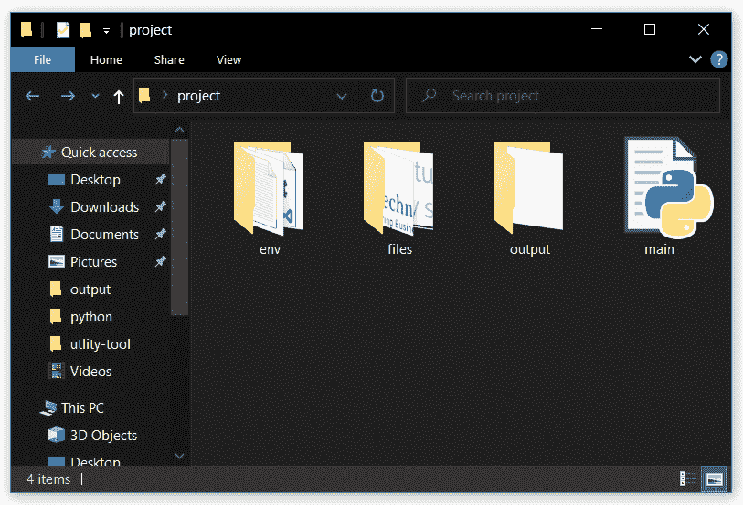
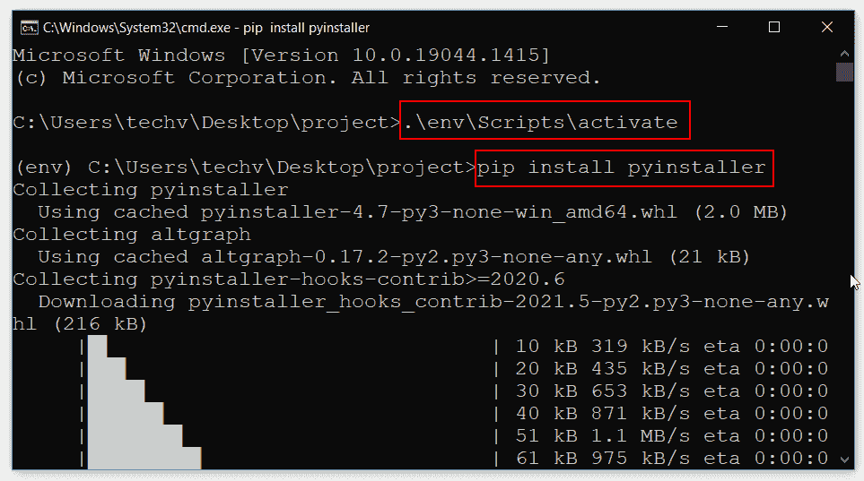
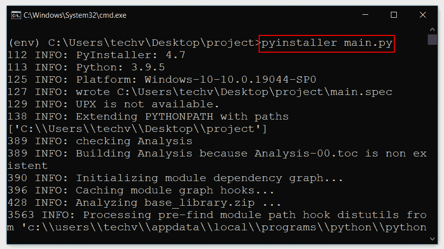
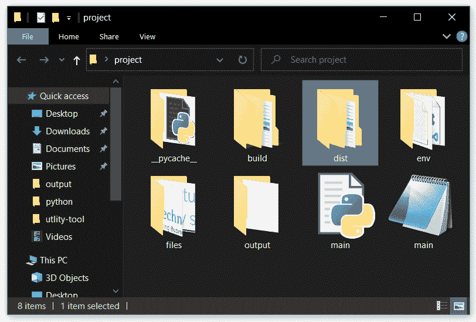
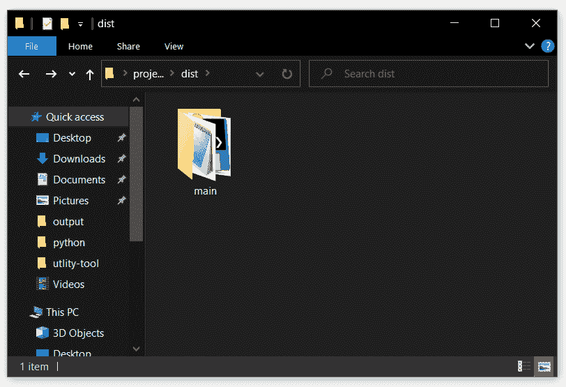
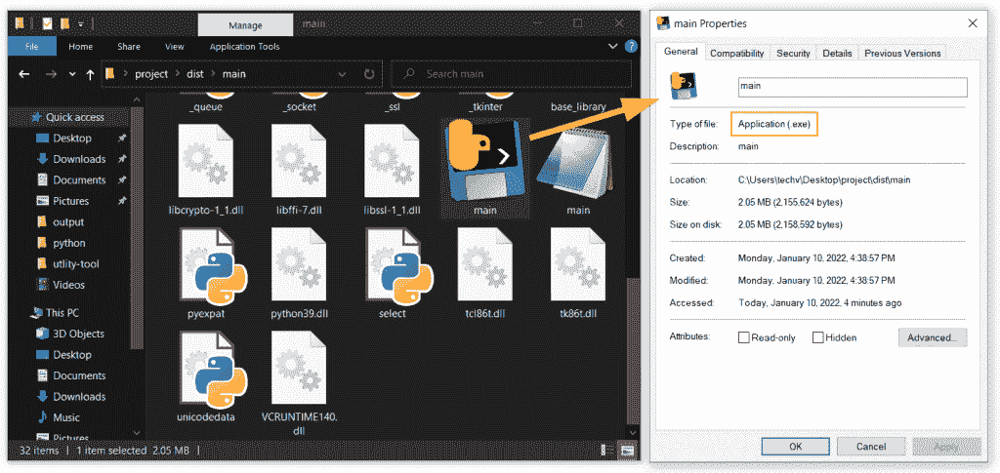
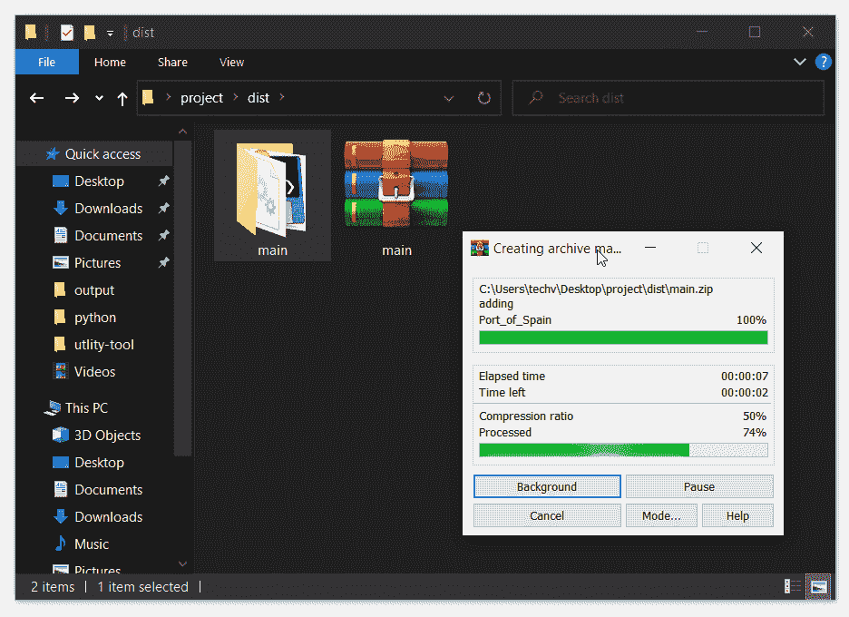
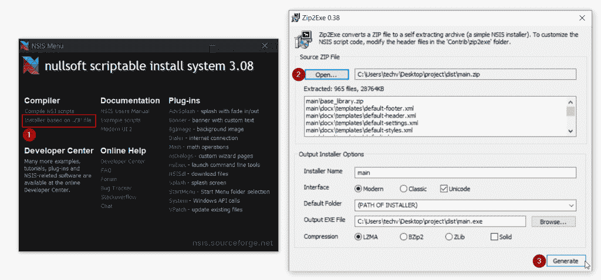
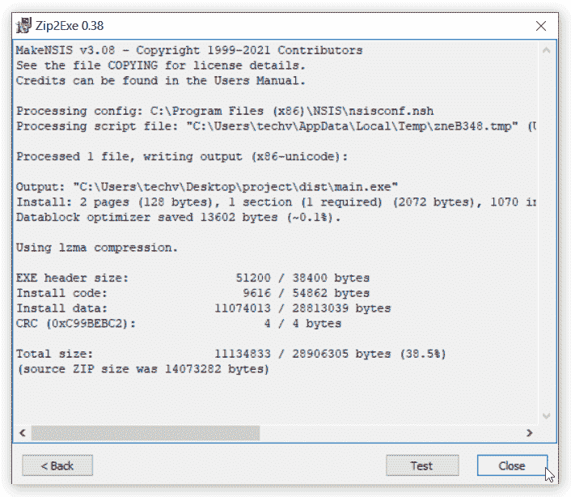
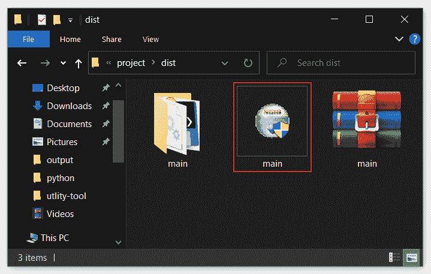

# 如何使用 Pyinstaller 将 Python 文件转换成 exe

> 原文：<https://pythonguides.com/convert-python-file-to-exe-using-pyinstaller/>

[](https://sharepointsky.teachable.com/p/python-and-machine-learning-training-course)

在这个 Python 教程中，我们将一步一步地看到如何使用 Pyinstaller 将 Python 文件转换成 exe。如果你想**把 python 文件转换成 exe** ，那么这篇文章会对你很有帮助。

目录

[](#)

*   [使用 pyinstaller 将 python 文件转换为 exe 文件](#Convert_python_file_to_exe_using_pyinstaller "Convert python file to exe using pyinstaller")
    *   [将 Python 文件转换成 exe windows](#Convert_Python_file_to_exe_windows "Convert Python file to exe windows")
    *   [按照步骤从 python 创建 exe 文件(。py)文件【详细】](#Follow_the_steps_to_create_exe_file_from_python_py_file_in_detail "Follow the steps to create exe file from python (.py) file [in detail]")
    *   使用 NSIS 工具创建一个可安装包
    *   [python 创建设置文件【一步一步】](#python_create_setup_file_Step_by_Step "python create setup file [Step by Step]")

## 使用 pyinstaller 将 python 文件转换为 exe 文件

最近，我们创建了一个应用程序，为即将离开组织的员工生成体验信。为此，我们使用 Python Tkinter 来创建表单。可以看看，[用 Python Tkinter](https://pythonguides.com/create-word-document-in-python-tkinter/) 创建 Word 文档。您也可以获得完整的源代码

我们已经创建了应用程序，但我们不能交付它，因为客户不知道 python 和其他编程相关的术语。对他们来说，创建并激活环境并每次运行应用程序并不容易。

所以我们决定给他们一个可以安装在系统上的程序的安装文件。在本教程中，我们将讨论如何将 python 转换为 exe 文件，然后创建一个可以安装的设置。

阅读 [Python 数字猜谜游戏](https://pythonguides.com/python-number-guessing-game/)

### 将 Python 文件转换成 exe windows

[Pyinstaller](https://pypi.org/project/pyinstaller/) 是一个 python 模块。py)可以转换成可执行文件(。exe)。

*   使用下面的命令在默认环境中直接安装 pyinstaller。

```py
pip install pyinstaller
```

*   在虚拟环境中，使用相同的命令在虚拟环境中再次安装 pyinstaller。
*   这听起来可能有点混乱，但是在基本环境和虚拟环境中都安装 pyinstaller 是很重要的。
*   我们假设您已经按照我们博客中的建议准备好了应用程序文件夹—**使用 python tkinter** 创建 word 文件。
*   按照下面的命令来转换 python(。py)到可执行文件(。exe)在 python 中。

```py
**# conversion with cmd console**
pyinstaller filename.py

**# conversion without cmd console**
pyinstaller --noconsole filename.py
```

*   一旦文件处理完成，你会看到新的文件夹创建。导航到 `dist` 文件夹- >项目文件夹- >点击应用程序(。exe)文件。
*   起初，应用程序可能不会像预期的那样工作，粘贴所有的依赖关系，如图像、文本文件等。在项目文件夹中。
*   运行程序，你会看到程序是作为一个独立的应用程序运行。即使没有 python 的系统也能够执行这个程序。
*   如果你无法按照目前给出的说明操作，请按照下面的说明操作图片。

阅读 [Python Tkinter messagebox](https://pythonguides.com/python-tkinter-messagebox/)

### 按照步骤从 python 创建 exe 文件(。py)文件【详细】

下图显示了生成体验信的应用程序文件。要了解我们是如何创建这个应用程序的，请访问我们的博客—**使用 Python Tkinter** 创建 Word 文件。



Step 1: Python project directory that we want to convert into exe

激活虚拟环境并在其中安装 pyinstaller。必须在通用环境和虚拟环境中安装 pyinstaller。否则，您的应用程序将无法访问安装在虚拟环境中的模块。



Step 2: Install Python Pyinstaller inside the virtual environment

使用 pyinstaller，您可以将 python 文件转换为 exe。键入**py installer<python-file-name>**，这将转换。py to。带控制台的 exe 文件。在 pyinstaller 后添加**–no-console**关键字，将 python 文件转换为可执行文件，无需命令提示符。



Step3: Convert python file to exe using pyinstaller

执行上面的命令后，你会在同一个目录下创建几个新文件夹。这些文件夹中有关于转换的信息，打开 `dist` 文件夹访问转换后的文件。



Step 4: Move dependencies inside the dist folder

在 `dist` 文件夹中，有另一个文件夹与那个 py 文件同名。假设在转换时 python 文件名是 main.py，那么这个文件夹名将是 main。

在下一节中，我们将使用这个文件夹来创建一个安装文件使用 NSIS 工具。



Step 5: Exe file is created inside the main folder

在主文件夹中，您将看到该应用程序中使用的所有文件和依赖项。在那里，您将看到一个与 python 文件同名的. exe 文件。在执行程序之前，在这个主文件夹中添加**文件**和**输出**文件夹。



Step 6: Python file converted to exe file

阅读 [Python Tkinter Spinbox](https://pythonguides.com/python-tkinter-spinbox/)

### 使用 NSIS 工具创建一个可安装包

这部分是关于 [NSIS 工具](https://nsis.sourceforge.io/Download)的，使用它我们可以在一个文件下创建一个所有依赖项的包。

*   从上面提到的链接下载软件并启动软件。
*   将我们在上一节准备的文件夹转换成 zip 文件。
*   在 NSIS 工具上点击*安装程序。zip 文件*，在提示符下从您的计算机中选择 ZIP 文件，然后点击左下角的生成按钮。
*   等待一段时间，一旦完成关闭软件，导航到文件夹，你会看到一个磁盘形状的文件。
*   您的文件已准备好，您可以与其他人共享。
*   如果这些步骤的总结对你没有帮助，下面我们用图片详细解释了每个步骤。

### python 创建设置文件【一步一步】

在上一节中，我们已经提到了主文件夹。此文件夹将用于创建 Python 中的应用程序-体验信函生成器的设置文件。

如果你遵循了上面的部分，这意味着你已经在这个主文件夹中添加了**文件**和**输出**文件夹。现在将它们转换成 zip 文件。



Step 7: Convert the python software folder into a zip file

打开 NSIS 软件，点击‘安装程序基于’。zip 文件'-->在提示中，通过单击打开按钮选择 zip 文件，选择 ZIP 文件后，单击生成按钮。我们已经标出了每一步的顺序。



Step 8: Convert exe to installable package using NSIS tool

单击“生成”按钮后，需要一些时间来创建可安装的安装文件。完成后，您将看到如下窗口。单击关闭按钮关闭窗口。



Step 8: Exe converted to installable package with all dependencies

恭喜成功转换 python(。py)文件转换为可执行文件(。exe)。以及将可执行文件打包成可安装的安装文件。在下图中，标记的图像显示了安装文件。你可以在你的系统中安装这个文件。



Setup file ready for installation on windows

至此，我们完成了将 python 文件转换成可执行文件的项目。该文件已准备好与朋友、家人和客户共享。

相关 Python 教程:

*   [Python Tkinter Validation](https://pythonguides.com/python-tkinter-validation/)
*   [Python Tkinter Scale](https://pythonguides.com/python-tkinter-scale/)
*   [Python Tkinter 通断开关](https://pythonguides.com/python-tkinter-on-off-switch/)
*   [Python Tkinter 多窗口教程](https://pythonguides.com/python-tkinter-multiple-windows-tutorial/)
*   [Python Tkinter 动画](https://pythonguides.com/python-tkinter-animation/)
*   [Python Tkinter 表教程](https://pythonguides.com/python-tkinter-table-tutorial/)

我们希望这个教程，能帮助你把 python 文件转换成 exe 文件。这就是如何**使用 Pyinstaller** 将 Python 文件转换成 exe。如果您遇到任何问题，请写信告诉我们确切的错误信息。

[Bijay Kumar](https://pythonguides.com/author/fewlines4biju/)

Python 是美国最流行的语言之一。我从事 Python 工作已经有很长时间了，我在与 Tkinter、Pandas、NumPy、Turtle、Django、Matplotlib、Tensorflow、Scipy、Scikit-Learn 等各种库合作方面拥有专业知识。我有与美国、加拿大、英国、澳大利亚、新西兰等国家的各种客户合作的经验。查看我的个人资料。

[enjoysharepoint.com/](https://enjoysharepoint.com/)[](https://www.facebook.com/fewlines4biju "Facebook")[](https://www.linkedin.com/in/fewlines4biju/ "Linkedin")[](https://twitter.com/fewlines4biju "Twitter")