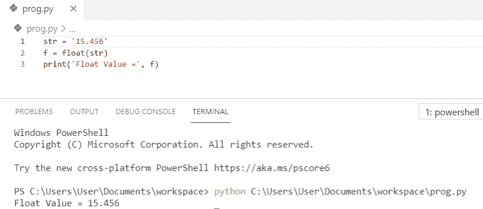
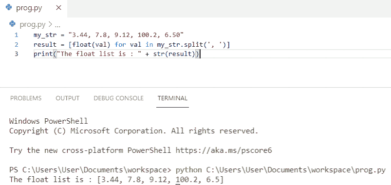
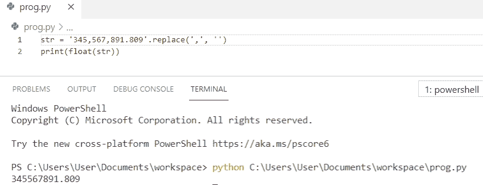
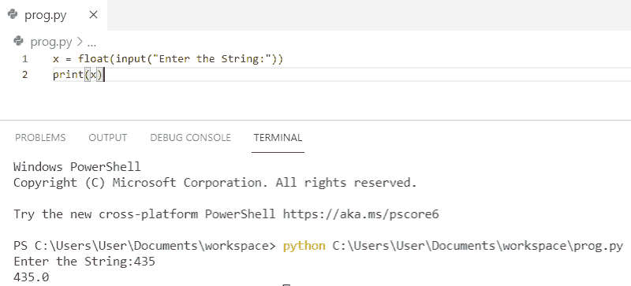
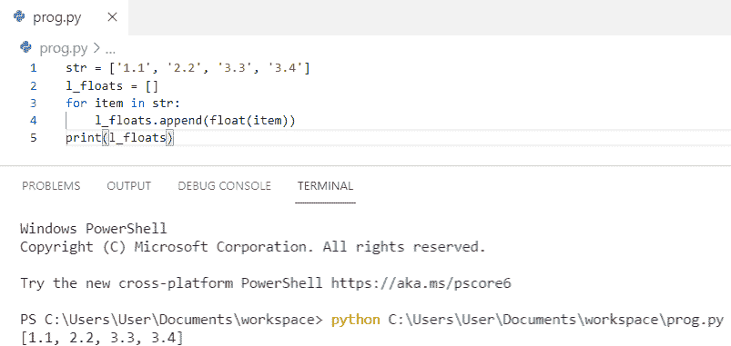
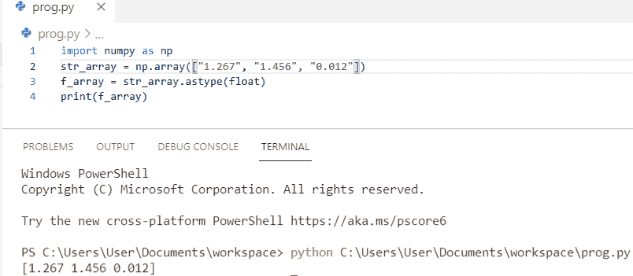
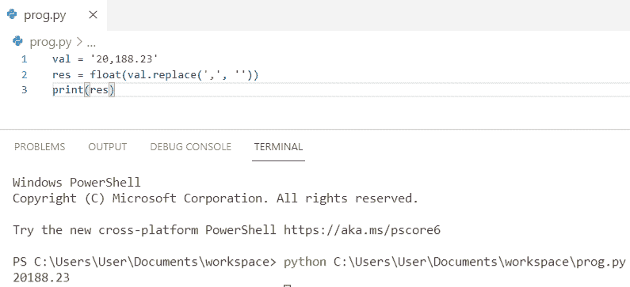
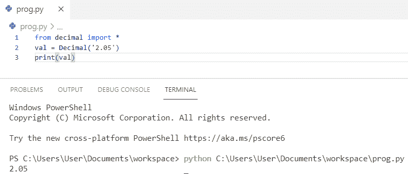
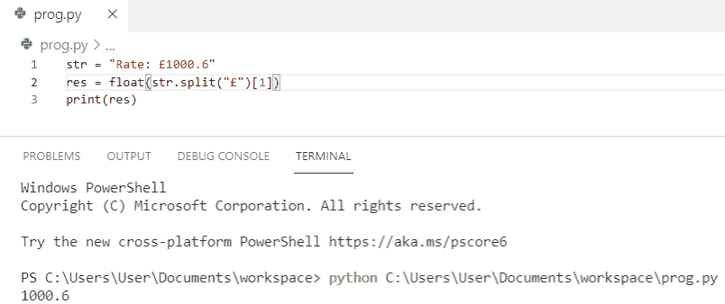

# 在 Python 中把字符串转换成浮点数+各种例子

> 原文：<https://pythonguides.com/convert-string-to-float-in-python/>

[](https://sharepointsky.teachable.com/p/python-and-machine-learning-training-course)

在这个 [python 教程中，](https://pythonguides.com/python-hello-world-program/)你将学习如何在 python 中**转换字符串为浮点数**，我们还将检查 **:**

*   如何将字符串转换为浮点 python
*   如何在 python 中将字符串转换成浮点列表
*   如何将逗号分隔的字符串转换为浮点 python
*   如何在 python 中将输入字符串转换成浮点数
*   将字符串列表转换为浮点 python
*   python 中如何将字符串数组转换为浮点数组
*   如何在 python 中使用 [NumPy](https://pythonguides.com/numpy/) 将字符串转换为浮点
*   如何在 python 中将带逗号的字符串转换成浮点数
*   如何在 python 中将带小数的字符串转换成浮点数
*   如何在 python 中将带字母的字符串转换成浮点数
*   如何在 python 中将空字符串转换为浮点数

目录

[](#)

*   [如何将 string 转换成 float python](#How_to_convert_string_to_float_python "How to convert string to float python")
*   [如何在 python 中把字符串转换成浮点列表](#How_to_convert_string_to_float_list_in_python "How to convert string to float list in python")
*   [如何将逗号分隔的字符串转换成浮点 python](#How_to_convert_comma_separated_string_to_float_python "How to convert comma separated string to float python")
*   [如何在 python 中把输入字符串转换成浮点数](#How_to_convert_input_string_to_float_in_python "How to convert input string to float in python")
*   [将字符串列表转换为浮点 python](#Convert_list_of_string_to_float_python "Convert list of string to float python")
*   [python 中如何将字符串数组转换成浮点数组](#How_to_convert_string_array_to_float_array_in_python "How to convert string array to float array in python")
*   [如何在 python 中使用 numpy 将 string 转换为 float](#How_to_convert_string_to_float_in_python_using_numpy "How to convert string to float in python using numpy")
*   [如何在 python 中将带逗号的字符串转换成浮点数](#How_to_convert_a_string_with_commas_to_a_float_in_python "How to convert a string with commas to a float in python")
*   [如何在 python 中把带小数的字符串转换成浮点数](#How_to_convert_string_with_decimal_to_float_in_python "How to convert string with decimal to float in python")
*   [如何在 python 中把带字母的字符串转换成浮点数](#How_to_convert_string_with_letters_to_float_in_python "How to convert string with letters to float in python")

## 如何将 string 转换成 float python

让我们看看**如何在 python** 中将 string 转换成 float。

在这个例子中，我们将使用 python 中内置的 `float()` 函数将 string 转换为 float。

**举例:**

```py
str = '15.456'
f = float(str)
print('Float Value =', f)
```

你可以参考下面的截图来看看**如何将 string 转换成 float python** 的输出。



How to convert string to float python

上面的代码我们可以用 python 把 string 转换成 float。

阅读:[如何在 Python 中创建字符串](https://pythonguides.com/create-a-string-in-python/)

## 如何在 python 中把字符串转换成浮点列表

在这里，你将看到**如何在 python** 中将字符串转换成浮点列表。

首先，我们需要初始化字符串，然后我们将使用 `float()` 和 `split()` 方法来执行任务。在下面的例子中，我们已经将字符串转换成了一个浮点列表。

**举例:**

```py
my_str = "3.44, 7.8, 9.12, 100.2, 6.50"
result = [float(val) for val in my_str.split(', ')]
print("The float list is : " + str(result))
```

你可以参考下面的截图来看看**如何在 python** 中将字符串转换成浮点列表的输出。



How to convert string to float list in python

这是如何在 python 中将字符串转换为浮点列表。

读取: [Python 将字符串写入文件](https://pythonguides.com/python-write-string-to-a-file/)

## 如何将逗号分隔的字符串转换成浮点 python

在这里，我们将看到**如何将逗号分隔的字符串转换成浮点 python** 。

在这个例子中，我们有一个字符串 **'345，567，891.809'** ，它包含数字，并且我们还有一些额外的逗号。在这里，我们将使用**。在将字符串传递给浮点函数之前，替换('，'，" ")**以删除字符串中的所有逗号。

**举例:**

```py
str = '345,567,891.809'.replace(',', '')
print(float(str))
```

你可以参考下面的截图来看看**如何将逗号分隔的字符串转换成浮点 python** 的输出。



How to convert comma separated string to float python

在这里，我们知道，如何将逗号分隔的字符串转换为浮点 python。

阅读:[Python 中的字符串方法及示例](https://pythonguides.com/string-methods-in-python/)

## 如何在 python 中把输入字符串转换成浮点数

现在，我们将看到**如何在 python** 中将输入字符串转换成浮点数。

为了在 python 中将输入字符串转换为 float，我们将首先从用户处获取输入，并使用 `float()` 方法进行转换。

**举例:**

```py
x = float(input("Enter the String:")) 
print(x)
```

你可以参考下面的截图来看看**如何在 python 中将输入字符串转换成浮点型的输出。**



How to convert input string to float in python

上面的 python 代码，我们可以用 Python 把输入的字符串转换成浮点数。

阅读: [Python 生成随机数和字符串](https://pythonguides.com/python-generate-random-number/)

## 将字符串列表转换为浮点 python

让我们看看**如何将字符串列表转换成浮点 python** 。

在这个例子中，我们将**将一个字符串列表转换为 float** ，并且我们将使用一个 **for 循环**来遍历整个列表。此外，我们将把转换后的项目追加到一个新列表中。

**举例:**

```py
str = ['1.1', '2.2', '3.3', '3.4']
l_floats = []
for item in str:
    l_floats.append(float(item))
print(l_floats)
```

你可以参考下面的截图来看看**如何将字符串列表转换成浮动 python** 的输出。



Convert list of string to float python

这就是如何**将字符串列表转换成浮点 python** 。

阅读:[添加字符串到列表 Python](https://pythonguides.com/add-string-to-list-python/)

## python 中如何将字符串数组转换成浮点数组

现在，我们将看到**如何在 python** 中将字符串数组转换成浮点数组

首先，我们需要**将 numpy 作为 np** 导入。 `asarray()` 是一个 numpy 函数，它将字符串数组转换成 python 中指定类型的浮点数组。

**举例:**

```py
import numpy as np
str_array = np.array(["10.22", "11.23", "20.55", "89.67"])
f_array = np.asarray(str_array, dtype = float)
print(f_array)
```

你可以参考下面的截图来看看**如何在 python** 中将字符串数组转换成浮点数组的输出


How to convert string array to float array in python

上面的 python 代码，我们可以用 python 把字符串数组转换成浮点数组。

阅读:[追加到一个字符串 Python +示例](https://pythonguides.com/append-to-a-string-python/)

## 如何在 python 中使用 numpy 将 string 转换为 float

在这里，我们将看到**如何使用 numpy** 在 python 中将 string 转换为 float。

首先，我们需要**将 numpy 作为 np** 导入。 `astype` 是 numpy 的内置类函数，用于使用 numpy 将 python 中的 string 转换为 float。

**举例:**

```py
import numpy as np
str_array = np.array(["1.267", "1.456", "0.012"])
f_array = str_array.astype(float)
print(f_array)
```

你可以参考下面的截图来看看**如何使用 numpy** 在 python 中将 string 转换成 float 的输出。



How to convert string to float in python using numpy

上面的 python 代码我们可以用 numpy 在 python 中用**把 string 转换成 float。**

阅读: [Python 程序反转字符串示例](https://pythonguides.com/python-program-to-reverse-a-string/)

## 如何在 python 中将带逗号的字符串转换成浮点数

现在，我们将看到**如何在 python** 中将带逗号的字符串转换成浮点数

在这个例子中，我们有一个字符串 **'20，188.23'** ，它包含数字，并且我们还有单个逗号。在这里，我们将使用**。替换('，'，" ")**以在将字符串传递给浮点函数之前删除字符串中的逗号。

```py
val = '20,188.23'
res = float(val.replace(',', ''))
print(res)
```

你可以参考下面的截图来看看**如何在 python** 中将带逗号的字符串转换成浮点数的输出。



How to convert a string with comas to a float in python

这就是如何在 python 中**将带逗号的字符串转换成浮点数。**

阅读: [Python 字符串格式化示例](https://pythonguides.com/python-string-formatting/)

## 如何在 python 中把带小数的字符串转换成浮点数

让我们看看**如何在 python** 中将带小数的字符串转换成浮点数。

首先，我们需要从 decimal import * 中导入**，然后我们将使用 `Decimal()` 模块。为了得到输出，我们将使用**打印(val)** 。**

**举例:**

```py
from decimal import *
val = Decimal('2.05')
print(val)
```

你可以参考下面的截图来看看**如何在 python** 中将带小数的字符串转换成浮点数的输出。



How to convert string with decimal to float in python

上面的代码是用来在 python 中将带十进制的 string 转换成 float 的。

阅读 [Python 字典扩展](https://pythonguides.com/python-dictionary-extend/)

## 如何在 python 中把带字母的字符串转换成浮点数

现在，我们将看到**如何在 python** 中将带字母的字符串转换成 float。

为了在 python 中将带有字母的字符串转换为浮点型，我们将使用**在**T5 分割**字符串，然后我们必须将第二个子字符串转换为浮点型。**

**举例:**

```py
str = "Rate: £1000.6"
res = float(str.split("£")[1])
print(res)
```

你可以参考下面的截图来看看**如何在 python** 中将带字母的字符串转换成浮点数的输出。



How to convert string with letters to float in python

这是在 python 中将带字母的字符串转换为浮点数的 python 代码。

您可能会喜欢以下 Python 教程:

*   [如何在 python 中连接字符串](https://pythonguides.com/concatenate-strings-in-python/)
*   [如何在 Python 中将字典转换成字符串](https://pythonguides.com/how-to-convert-a-dictionary-into-a-string-in-python/)
*   [如何将 Python 字符串转换成字节数组并举例](https://pythonguides.com/python-string-to-byte-array/)
*   [如何在 Python 中把字符串转换成日期时间](https://pythonguides.com/convert-a-string-to-datetime-in-python/)
*   [无法将字符串转换为浮点 Python](https://pythonguides.com/could-not-convert-string-to-float-python/)
*   [Python 将字典转换为列表](https://pythonguides.com/python-convert-dictionary-to-list/)

在这篇 Python 教程中，我们学习了如何**将 string 转换成 float python** 。此外，我们还讨论了以下主题:

*   如何将字符串转换为浮点 python
*   如何在 python 中将字符串转换成浮点列表
*   如何将逗号分隔的字符串转换为浮点 python
*   如何在 python 中将输入字符串转换成浮点数
*   将字符串列表转换为浮点 python
*   python 中如何将字符串数组转换为浮点数组
*   如何在 python 中使用 numpy 将字符串转换为浮点数
*   如何在 python 中将带逗号的字符串转换成浮点数
*   如何在 python 中将带小数的字符串转换成浮点数
*   如何在 python 中将带字母的字符串转换成浮点数
*   如何在 python 中将空字符串转换为浮点数

[Bijay Kumar](https://pythonguides.com/author/fewlines4biju/)

Python 是美国最流行的语言之一。我从事 Python 工作已经有很长时间了，我在与 Tkinter、Pandas、NumPy、Turtle、Django、Matplotlib、Tensorflow、Scipy、Scikit-Learn 等各种库合作方面拥有专业知识。我有与美国、加拿大、英国、澳大利亚、新西兰等国家的各种客户合作的经验。查看我的个人资料。

[enjoysharepoint.com/](https://enjoysharepoint.com/)[](https://www.facebook.com/fewlines4biju "Facebook")[](https://www.linkedin.com/in/fewlines4biju/ "Linkedin")[](https://twitter.com/fewlines4biju "Twitter")