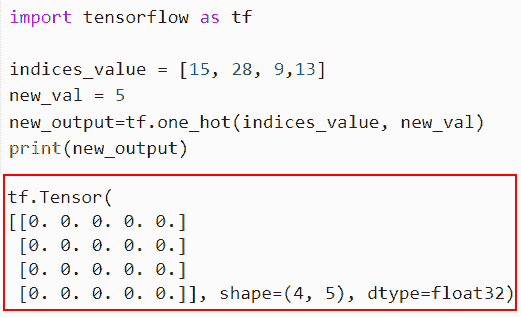
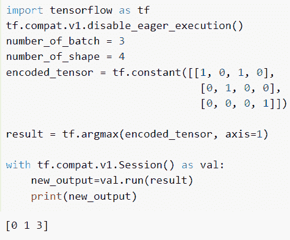
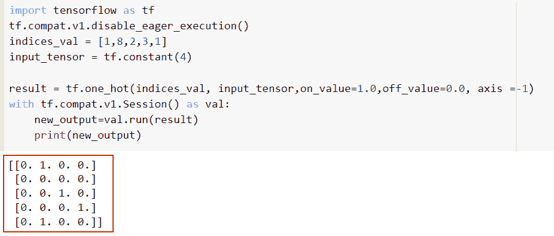
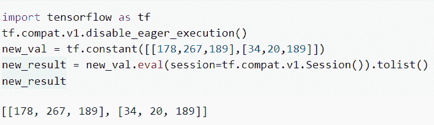
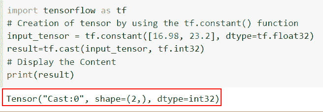

# 如何将张量流转换为一个热|一个热编码张量流示例

> 原文：<https://pythonguides.com/convert-tensorflow-to-one-hot/>

[](https://sharepointsky.teachable.com/p/python-and-machine-learning-training-course)

你知道**怎么把 TensorFlow 转换成 one hot** 吗？让我们讨论和理解张量流张量将如何转化为一个热点。我们还将介绍**一个热编码张量流示例**。

*   转换成一个热张量流
*   如何将一个 hot 转换成整数 TensorFlow？
*   一个热编码张量流示例
*   将张量转换为列表张量流
*   将张量转换为 int 张量流

目录

[](#)

*   [转换成一个热张量流](#Convert_to_one_hot_tensorflow "Convert to one hot tensorflow")
*   [如何将一个 hot 转换成整数 TensorFlow](#How_to_Convert_one_hot_to_integer_TensorFlow "How to Convert one hot to integer TensorFlow")
*   [一个热编码张量流示例](#One_hot_encoding_tensorflow_example "One hot encoding tensorflow example")
*   [将张量转换为列表张量流](#Convert_tensor_to_list_tensorflow "Convert tensor to list tensorflow")
*   [将张量转换为 int tensorflow](#Convert_tensor_to_int_tensorflow "Convert tensor to int tensorflow")

## 转换成一个热张量流

*   这里我们将讨论把输入张量转换成一个热张量流。
*   一个热编码是将分类数据中的变量转换为机器和深度学习算法的关键过程，可以提高预测和模型分类的准确性。
*   在一键编码中，用二进制变量(或者更准确地说，向量)代替只能取值为 0 或 1 的类别变量。
*   本质上，我们是在陈述特定类别的特定项目是否存在。对于每个数据条目和反映其分类的列，都会创建新行。1 和 0 用来表示他们的存在或不存在。

**语法**:

让我们看一下语法并理解 Python TensorFlow 中的 `tf.one_hot()` 函数的工作原理

```py
tf.one_hot(
    indices,
    depth,
    on_value=None,
    off_value=None,
    axis=None,
    dtype=None,
    name=None
)
```

*   它由几个参数组成
    *   **指标**:该参数定义了指标的张量。
    *   **深度**:指示热尺寸深度的标量。
    *   `on_value` :默认情况下，它采用 none value 一个标量，指定当**索引[j] = i** 时使用的输出值。
    *   `off_value` :默认情况下，它采用 none value 一个标量，指定当**索引[j] = i** 时使用的输出值。
    *   **轴**:该参数定义填充内外零件的轴。
    *   `dtype` :默认情况下，不取值，指定输出张量的数据类型。
    *   `name` :该参数指定操作的名称，默认情况下，取值为 none。

**举例**:

```py
import tensorflow as tf

indices_value = [15, 28, 9,13]
new_val = 5
new_output=tf.one_hot(indices_value, new_val)
print(new_output)
```

在上面的代码中，我们导入了 TensorFlow 库，然后初始化了一个列表，在其中我们分配了索引号。

之后，我们使用了 `tf.one_hot()` 函数，在这个函数中，我们将索引和深度作为参数传递。它将返回列表和索引的形状。

下面是以下代码的截图



Convert to one hot tensorflow

这就是如何将张量转换为 TensorFlow 中的一个 hot。

阅读[如何将字典转换为张量张量流](https://pythonguides.com/how-to-convert-dictionary-to-tensor-tensorflow/)

## 如何将一个 hot 转换成整数 TensorFlow

*   在本节中，我们将讨论如何在 Tensorflow 中将一个 hot 转换为整数张量。
*   为了执行这个特定的任务，我们将使用 `tf.argmax()` 函数，它将返回张量元素集中最大元素的索引。如果张量是二维的，则有可能返回跨行和列的最大值的索引。

**语法**:

下面是 Python TensorFlow 中 `tf.argmax()` 函数的语法

```py
tf.math.argmax(
    input,
    axis=None,
    output_type=tf.dtypes.int64,
    name=None
)
```

*   它由几个参数组成
    *   **输入**:该参数定义了输入张量。
    *   **轴**:默认为 0，是我们要减少的轴的整数。
    *   `output_type` :默认取 `tf.dtypes.int64()` ，可选数据类型。
    *   `name` :该参数指定操作的名称，默认情况下，取值为 none。

**举例**:

```py
import tensorflow as tf
tf.compat.v1.disable_eager_execution()
number_of_batch = 3
number_of_shape = 4
encoded_tensor = tf.constant([[1, 0, 1, 0],
                               [0, 1, 0, 0],
                               [0, 0, 0, 1]])

result = tf.argmax(encoded_tensor, axis=1)

with tf.compat.v1.Session() as val:
    new_output=val.run(result)
    print(new_output)
```

首先，我们在下面的代码中创建了一个具有批量大小和类的 one_hot 张量。接下来，我们使用了 `tf.argmax()` 函数，并沿着轴分配编码的张量。它将返回张量元素集中最大元素的索引。

下面是以下给定代码的实现



How to Convert one hot to integer tensorflow

正如你在截图中看到的，我们已经在 TensorFlow 中将一个 hot 转换为一个整数。

读取 [Tensorflow 转换字符串为 int](https://pythonguides.com/tensorflow-convert-string-to-int/)

## 一个热编码张量流示例

*   让我们讨论一下如何在 Python TensorFlow 中使用 one-hot 编码函数。
*   为了完成这个任务，我们将使用 `tf.one_hot()` 函数，它将把随机数转换成二进制整数。
*   在本例中，我们通过导入`TF . compat . v1 . disable _ eager _ execution()`函数创建了会话。
*   接下来，我们将在列表中声明索引号，然后我们将使用 `tf.one_hot()` 函数，并将**索引和深度**轴指定为参数。

**举例**:

```py
import tensorflow as tf
tf.compat.v1.disable_eager_execution()
indices_val = [1,8,2,3,1]
input_tensor = tf.constant(4)

result = tf.one_hot(indices_val, input_tensor,on_value=1.0,off_value=0.0, axis =-1)
with tf.compat.v1.Session() as val:
    new_output=val.run(result)
    print(new_output)
```

你可以参考下面的截图



One hot encoding tensorflow example

## 将张量转换为列表张量流

*   在本节中，我们将讨论如何在 Python TensorFlow 中将张量转换为列表。
*   在本例中，我们将使用`TF . compat . v1 . disable _ eager _ execution()`来运行会话。为了将张量转换成一个列表，首先我们将导入 eager_execution 函数和 TensorFlow 库。
*   接下来，我们将使用 `tf.constant()` 函数创建常量值，然后我们将使用 `eval()` 函数中的语法`session = TF . compat . v1 . session()`运行会话。

**举例**:

```py
import tensorflow as tf
tf.compat.v1.disable_eager_execution()
new_val = tf.constant([[178,267,189],[34,20,189]])
new_result = new_val.eval(session=tf.compat.v1.Session()).tolist()
new_result
```

下面是以下给定代码的执行过程



Convert tensor to list tensorflow

这就是如何在 TensorFlow 中将张量转换成 Python 列表

读取[模块“张量流”没有属性“函数”](https://pythonguides.com/module-tensorflow-has-no-attribute-function/)

## 将张量转换为 int tensorflow

*   在本节中，我们将讨论如何在 Python TensorFlow 中将张量转换为整数。
*   为了完成这项任务，我们将使用 `tf.cast()` 函数，该函数用于将输入数据类型转换为不同的数据类型。
*   例如，您已经创建了一个输入张量，并按照浮点的顺序分配了元素，现在您想将浮点转换为十进制。为此，我们将使用 `tf.cast()` 函数。

**举例**:

```py
import tensorflow as tf
# Creation of tensor by using the tf.constant() function
input_tensor = tf.constant([16.98, 23.2], dtype=tf.float32)
result=tf.cast(input_tensor, tf.int32)
# Display the Content
print(result)
```

下面是以下给定代码的实现



Convert tensor to int tensorflow

正如你在截图中看到的，我们已经在 TensorFlow 中将张量转换为整数。

在本文中，我们讨论了如何将 TensorFlow 转换为 one hot。让我们讨论和理解张量流张量将如何转化为一个热点。我们还讨论了以下主题。

*   转换成一个热张量流
*   如何将一个 hot 转换成整数 tensorflow？
*   一个热编码张量流示例
*   将张量转换为列表张量流
*   将张量转换为 int 张量流

您可能还会喜欢以下 Tensorflow 教程:

*   [将 pandas 数据帧转换为 tensorflow 数据集](https://pythonguides.com/convert-pandas-dataframe-to-tensorflow-dataset/)
*   [Tensorflow 将稀疏张量转换为张量](https://pythonguides.com/tensorflow-convert-sparse-tensor-to-tensor/)
*   [模块“tensorflow”没有属性“optimizer”](https://pythonguides.com/module-tensorflow-has-no-attribute-optimizers/)
*   [模块“tensorflow”没有属性“div”](https://pythonguides.com/module-tensorflow-has-no-attribute-div/)
*   [模块“tensorflow”没有属性“sparse _ placeholder”](https://pythonguides.com/module-tensorflow-has-no-attribute-sparse_placeholder/)

[Bijay Kumar](https://pythonguides.com/author/fewlines4biju/)

Python 是美国最流行的语言之一。我从事 Python 工作已经有很长时间了，我在与 Tkinter、Pandas、NumPy、Turtle、Django、Matplotlib、Tensorflow、Scipy、Scikit-Learn 等各种库合作方面拥有专业知识。我有与美国、加拿大、英国、澳大利亚、新西兰等国家的各种客户合作的经验。查看我的个人资料。

[enjoysharepoint.com/](https://enjoysharepoint.com/)[](https://www.facebook.com/fewlines4biju "Facebook")[](https://www.linkedin.com/in/fewlines4biju/ "Linkedin")[](https://twitter.com/fewlines4biju "Twitter")