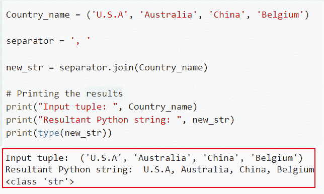
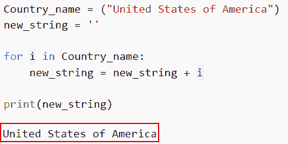
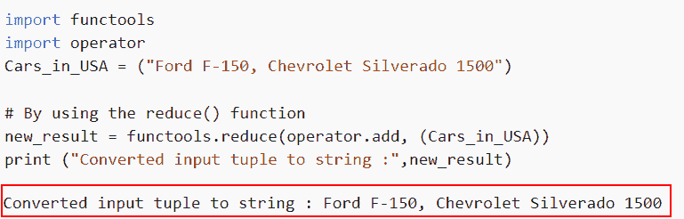
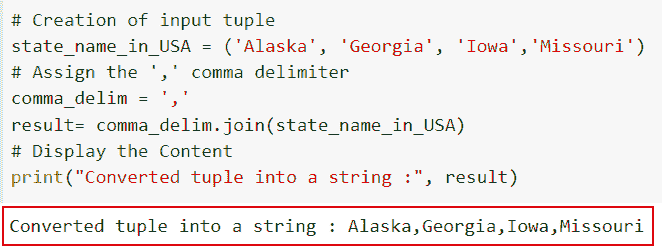
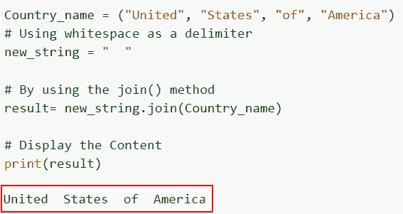

# 在 Python 中将元组转换为字符串

> 原文：<https://pythonguides.com/convert-tuple-to-string-in-python/>

[](https://sharepointsky.teachable.com/p/python-and-machine-learning-training-course)

在本 [Python 教程](https://pythonguides.com/python-hello-world-program/)中，我们将讨论在 Python 中 ***将 tuple 转换为 string 的不同方法。我们都知道一个元组在一个变量中存储几个条目。它也是一个固定的、组织良好的数据集合。***

而字符串是用单方括号或双方括号括起来的一组字符。

*   如何使用 join()方法在 Python 中将元组转换为字符串
*   使用 for 循环将元组转换为 Python 中的字符串
*   如何使用 reduce()方法在 Python 中将 tuple 转换成 string
*   如何在 Python 中用逗号将元组转换成字符串
*   Python 中带空格的元组到字符串的转换

目录

[](#)

*   [在 Python 中把元组转换成字符串](#Convert_tuple_to_string_in_Python "Convert tuple to string in Python")
*   [如何使用 join()方法在 Python 中将 tuple 转换成 string](#How_to_convert_tuple_to_string_in_Python_by_using_the_join_method "How to convert tuple to string in Python by using the join() method")
*   [使用 for 循环](#Convert_the_tuple_to_a_string_in_Python_by_using_the_for_loop "Convert the tuple to a string in Python by using the for loop")将元组转换成 Python 中的字符串
*   [通过使用 reduce()方法](#By_using_the_reduce_method "By using the reduce() method")
*   [如何在 Python 中用逗号将元组转换成字符串](#How_to_convert_a_tuple_to_string_in_Python_with_a_comma "How to convert a tuple to string in Python with a comma")
*   [在 Python 中将元组转换成带空格的字符串](#Conversion_of_a_tuple_to_string_in_Python_with_spaces "Conversion of a tuple to string in Python with spaces")

## 在 Python 中把元组转换成字符串

术语**“将元组转换成 Python 中的字符串”**指的是将所有元素连接在一起以创建单个字符串的过程。

在 Python 中，在将元组转换为字符串时，主要有三种常用且重要的理解方法。下面给出的方法将用于将元组转换为字符串。

*   通过使用 join()方法
*   Reduce()方法
*   for 循环方法

## 如何使用 join()方法在 Python 中将 tuple 转换成 string

*   使用 `str.join()` 函数，我们可以将一个 Python 元组变成一个 Python 字符串。string `join()` 方法将一个 iterable 中的字符串连接起来，比如一个**元组、列表、字典或集合**，并返回一个字符串。
*   由于这个实例中的 iterable 是一个元组，返回字符串的 `join()` 方法将接受元组作为参数。

**语法**:

让我们看一下语法，了解一下 Python 中 `str.join()` 的工作原理。

```py
str.join(iterable)
```

如果 iterable 中存在任何非字符串值，join()方法将产生 TypeError。

> ***注意:**该参数定义了类似元组的可迭代对象。*

**举例**:

让我们举一个例子，检查如何使用 `join()` 方法在 Python 中将元组转换为字符串。

```py
Country_name = ('U.S.A', 'Australia', 'China', 'Belgium')

separator = ', '

new_str = separator.join(Country_name)

# Printing the results
print("Input tuple: ", Country_name)
print("Resultant Python string: ", new_str)
print(type(new_str))
```

下面是以下给定代码的实现



By using the join method converted tuple to list

这就是如何使用 join()方法在 Python 中将元组转换为字符串。

阅读:[寻找 3 个数最大值的 Python 程序](https://pythonguides.com/python-program-for-finding-greatest-of-3-numbers/)

## 使用 for 循环将元组转换成 Python 中的字符串

*   在这里，我们将讨论如何使用 for 循环将元组转换为 Python 中的字符串
*   可以使用简单的 for 循环迭代整个元组的元素，然后将元素追加到字符串中。
*   使用了元组和空字符串。此外，空字符串被遍历以包含元组的每个元素。

**举例:**

让我们举一个例子，看看如何使用 for 循环在 Python 中将元组转换成字符串。

```py
Country_name = ("United States of America")
new_string = ''

for i in Country_name:
    new_string = new_string + i

print(new_string)
```

你可以参考下面的截图



Iterating values for tuples and converting them into a string

正如你在截图中看到的，我们已经讨论了如何迭代元组的值，并将它们转换成字符串。

阅读:[如何在 Python 中修剪字符串](https://pythonguides.com/trim-a-string-in-python/)

## 通过使用 reduce()方法

*   在 Python 中，函数和 iterable(如 tuple)分别是 reduce()函数的第一个和第二个参数。
*   然后，在返回由该函数取出的操作的输出之前，将该函数应用于 iterable 对象的每个元素。
*   由于 functools 模块，高阶函数可以与其他函数交互。

**举例:**

这里我们将举一个例子，并检查如何使用 reduce()方法在 Python 中将元组转换为字符串。

**源代码:**

```py
import functools
import operator
Cars_in_USA = ("Ford F-150, Chevrolet Silverado 1500")

# By using the reduce() function
new_result = functools.reduce(operator.add, (Cars_in_USA))
print ("Converted input tuple to string :",new_result)
```

下面是下面给出的代码的截图。



How to convert tuple to string in Python by using the reduce method

这就是我们如何通过使用 Python 中的 reduce 方法将元组转换为字符串。

阅读: [Python 扩展 Vs 追加【主要区别】](https://pythonguides.com/python-extend-vs-append/)

## 如何在 Python 中用逗号将元组转换成字符串

*   在这一节中，我们将讨论如何在 Python 中将元组转换为带有逗号分隔符的字符串。
*   为了执行这个特定的任务，我们将使用 join 方法和 string `join()` 方法的概念，将一个 iterable 中的字符串连接起来，比如一个**元组、列表、字典或集合**，并返回一个字符串。
*   Python 的 join()函数通过将给定 iterable 中的其他字符串连接在一起来生成一个新字符串，它返回该字符串并将接受元组作为参数。

**举例**:

```py
**# Creation of input tuple**
state_name_in_USA = ('Alaska', 'Georgia', 'Iowa','Missouri')

**# Assign the ',' comma delimiter**
comma_delim = ','
result= comma_delim.join(state_name_in_USA)

**# Display the Content**
print("Converted tuple into a string :", result)
```

在下面给出的代码中，我们首先创建了一个输入元组，并在括号内分配元素。输入字符串被命名为“美国州名”。

现在，我们希望在将元组转换为字符串时使用逗号作为分隔符。为此，我们声明了一个变量，并将分隔符存储为逗号。

下面是以下给定代码的执行。



How to convert tuple to string in Python with a comma

在这个例子中，我们已经理解了如何在 Python 中将元组转换成带逗号的字符串。

阅读:[二分搜索法的 Python 程序](https://pythonguides.com/python-program-for-binary-search/)

## 在 Python 中将元组转换成带空格的字符串

*   这里我们将讨论如何在 Python 中将元组转换成带空格的字符串。
*   通过使用 join()，我们可以将元组的字符追加到字符串中，在本例中，我们将把空格放入输入字符串中。
*   首先，我们将获取一个输入元组，并将字符串元素分配给它。现在，通过使用空格作为分隔符和 join()方法，我们可以很容易地将元组转换成字符串。

**举例:**

让我们举个例子，看看如何在 Python 中将 tuple 转换成带空格的字符串。

```py
Country_name = ("United", "States", "of", "America")
# Using whitespace as a delimiter
new_string = "  "

# By using the join() method
result= new_string.join(Country_name)

# Display the Content
print(result)
```

下面是下面给出的代码的截图。



Use white spaces as a delimiter to convert the tuple into a string

你可能也喜欢阅读下面的 Python 教程。

*   [如何在 Python 中将元组列表转换成字符串](https://pythonguides.com/convert-list-of-tuples-to-string-in-python/)
*   [如何用 Python 将列表追加到另一个列表中](https://pythonguides.com/python-append-list-to-another-list/)
*   [如何在 Python 中从列表中找到一个字符串](https://pythonguides.com/find-a-string-from-a-list-in-python/)
*   [使用 For 循环对 Python 中的列表元素求和](https://pythonguides.com/sum-elements-in-list-in-python-using-for-loop/)
*   [在 Python 中的数据帧中添加空列](https://pythonguides.com/add-empty-column-dataframe-python/)
*   [如何在 Python 中寻找完全数](https://pythonguides.com/perfect-number-in-python/)

在本教程中，我们讨论了如何在 Python 中将元组转换为字符串。我们还讨论了以下给定的主题

*   如何使用 join()方法在 Python 中将元组转换为字符串
*   使用 for 循环将元组转换为 Python 中的字符串
*   如何使用 reduce()方法在 Python 中将 tuple 转换成 string
*   如何在 Python 中用逗号将元组转换成字符串
*   Python 中带空格的元组到字符串的转换

[Arvind](https://pythonguides.com/author/arvind/)

Arvind 目前是 TSInfo Technologies 的高级 Python 开发人员。他精通 Python 库，如 NumPy 和 Tensorflow。