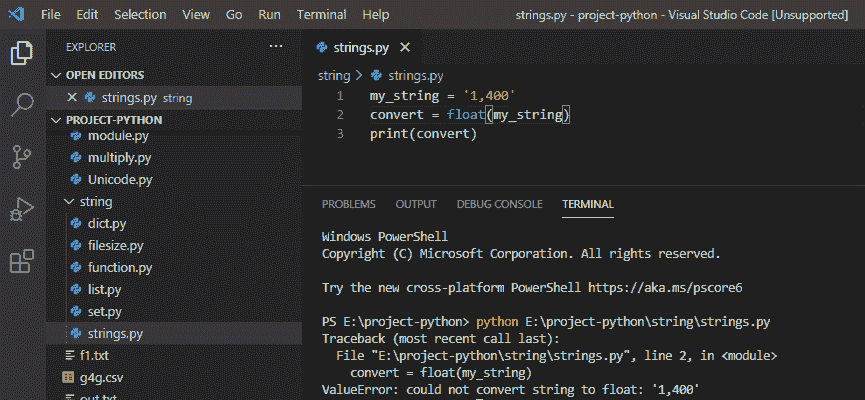
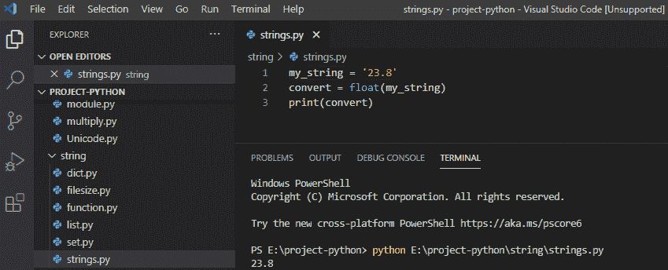
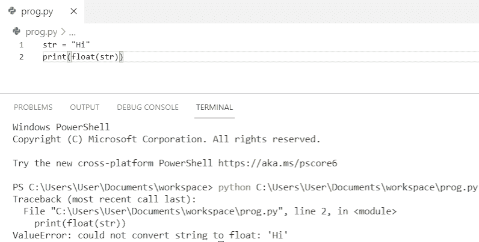
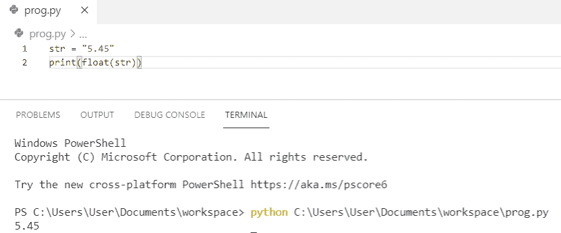

# 无法将字符串转换为浮点型 Python

> 原文：<https://pythonguides.com/could-not-convert-string-to-float-python/>

[](https://sharepointsky.teachable.com/p/python-and-machine-learning-training-course)

在本 Python 教程中，我们将讨论如何修复一个错误，“**无法将字符串转换为浮点型 Python** ”。

目录

[](#)

*   [无法将字符串转换为浮点 python](#Could_not_convert_string_to_float_python "Could not convert string to float python")
*   [如何修复无法将字符串转换为浮点型 python](#How_to_fix_could_not_convert_string_to_float_python "How to fix could not convert string to float python")

## 无法将字符串转换为浮点 python

在 python 中，要将字符串转换成浮点型，我们可以使用 `float()` 方法。它只能将有效的数值转换为浮点值，否则会抛出错误。

**举例:**

```py
my_string = '1,400'
convert = float(my_string)
print(convert)
```

写完上面的代码(无法将字符串转换为浮点 python)，你将打印出 `" convert "` ，然后输出将显示为 **" ValueError:无法将字符串转换为浮点:' 1，400' "** 。

在这里，我们得到了错误，因为该值是无效的，我们使用了逗号。你可以参考下面的截图无法将字符串转换为浮点型 python。



Could not convert string to float python

要解决这个**值错误:无法将字符串转换为浮点型**我们需要使用 `float()` 方法给出有效的数值来将我的字符串转换为浮点型。

**举例:**

```py
my_string = '23.8'
convert = float(my_string)
print(convert)
```

写完上面的代码(无法将 string 转换成 float python)，你将打印出**“convert”**，然后输出将显示为**“23.8”**。这里，float()方法将字符串转换为浮点型。你可以参考下面的截图无法将字符串转换为浮点型 python。



Could not convert string to float python

这是**如何修复无法将字符串转换为浮点 python** 的问题。

阅读: [Python 在字符串](https://pythonguides.com/python-find-substring-in-string/)中查找子串

## 如何修复无法将字符串转换为浮点型 python

让我们看看**如何修复无法将字符串转换为浮点型 python**

在这个例子中，我们得到了一个 `ValueError` ，因为函数参数的类型不合适。因此，当我们试图对一个字符串值进行类型转换时，它会抛出 ValueError。

**举例:**

```py
str = "Hi"
print(float(str))
```

python 中的 `float()` 函数不支持普通文本。关于**错误**，可以参考下面的截图。



How to fix could not convert string to float python

要修复**值错误:` `无法将字符串转换为浮点型 python** ，我们必须给出数字文本值才能将其成功转换为浮点型。我们可以使用下面的代码来解决上面的**错误**。

**举例:**

```py
str = "5.45"
print(float(str))
```

你可以参考下面的截图来查看**如何修复无法将字符串转换为浮点 python** 的输出。



How to fix could not convert string to float python

您可能会喜欢以下 Python 教程:

*   [如何在 Python 中处理 indexerror:字符串索引超出范围](https://pythonguides.com/indexerror-string-index-out-of-range-python/)
*   [如何在 python 中把整数转换成字符串](https://pythonguides.com/convert-an-integer-to-string-in-python/)
*   [在 Python 中切片字符串+示例](https://pythonguides.com/slicing-string-in-python/)
*   [在 Python 中把字符串转换成浮点数](https://pythonguides.com/convert-string-to-float-in-python/)

这里我们检查了如何修复错误，**无法将字符串转换为浮点 python** 。

[Bijay Kumar](https://pythonguides.com/author/fewlines4biju/)

Python 是美国最流行的语言之一。我从事 Python 工作已经有很长时间了，我在与 Tkinter、Pandas、NumPy、Turtle、Django、Matplotlib、Tensorflow、Scipy、Scikit-Learn 等各种库合作方面拥有专业知识。我有与美国、加拿大、英国、澳大利亚、新西兰等国家的各种客户合作的经验。查看我的个人资料。

[enjoysharepoint.com/](https://enjoysharepoint.com/)[](https://www.facebook.com/fewlines4biju "Facebook")[](https://www.linkedin.com/in/fewlines4biju/ "Linkedin")[](https://twitter.com/fewlines4biju "Twitter")