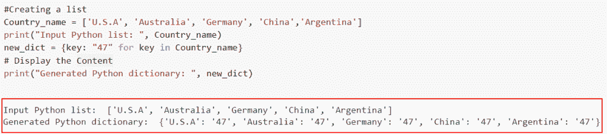
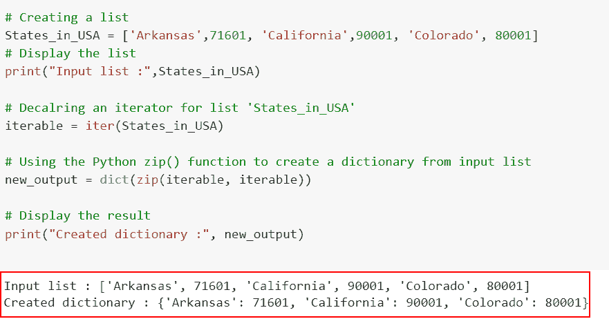
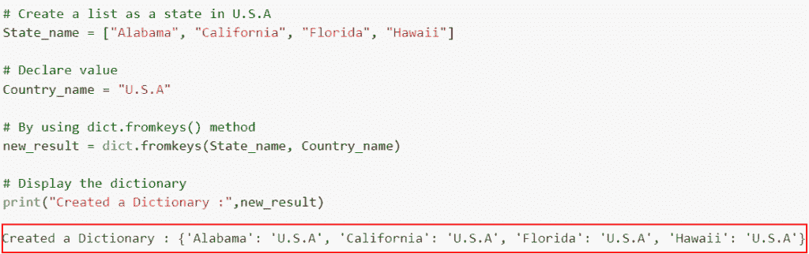
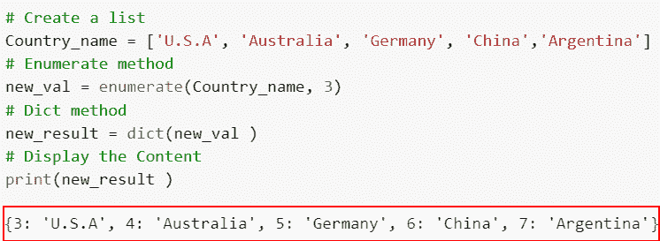
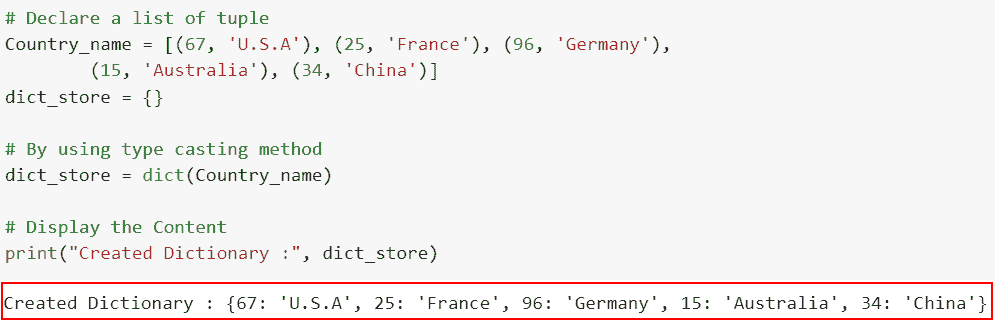
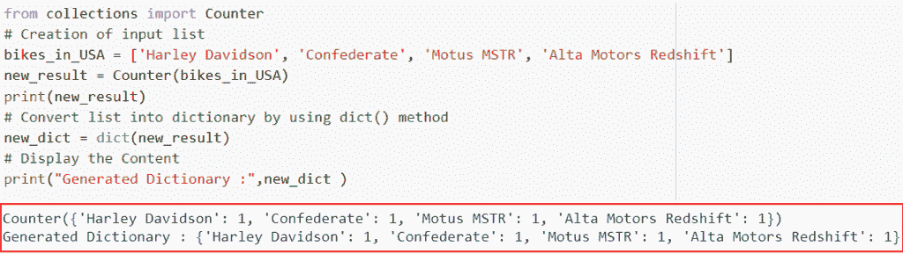

# 如何用 Python 从一个列表创建一个字典

> 原文：<https://pythonguides.com/create-a-dictionary-from-one-list-in-python/>

[](https://sharepointsky.teachable.com/p/python-and-machine-learning-training-course)

在这个 [Python 教程](https://pythonguides.com/python-programming-for-the-absolute-beginner/)中，我们将学习如何从一个列表中创建一个 Python 字典。为了理解各种方法，我们将使用一些内置函数从一个 Python 列表创建一个字典。

作为一名开发人员，在制作 Python 项目时，我需要从一个 [Python 列表](https://pythonguides.com/create-list-in-python/)中创建一个[字典](https://pythonguides.com/create-a-dictionary-in-python/)。

在这里我们将看到:

*   如何使用字典理解从 Python 中的一个列表创建一个字典
*   使用 zip()从 Python 中的一个列表创建一个字典
*   如何使用 dict.fromkeys()在 Python 中从一个列表创建一个字典
*   使用枚举器()从 Python 中的一个列表创建一个字典
*   如何使用元组从 Python 中的一个列表创建字典
*   使用计数器()从 Python 中的一个列表创建一个字典

目录

[](#)

*   [用 Python 从一个列表中创建一个字典](#Create_a_Dictionary_from_one_list_in_Python "Create a Dictionary from one list in Python")
    *   [如何使用字典理解从 Python 中的一个列表创建字典](#How_to_create_a_dictionary_from_one_list_in_Python_using_dictionary_comprehension "How to create a dictionary from one list in Python using dictionary comprehension")
    *   [使用 zip()](#Create_a_Dictionary_from_one_list_in_Python_using_zip "Create a Dictionary from one list in Python using zip()") 从 Python 中的一个列表创建一个字典
    *   [如何使用 dict.fromkeys()](#How_to_create_a_dictionary_from_one_list_in_Python_using_dictfromkeys "How to create a dictionary from one list in Python using dict.fromkeys()") 在 Python 中从一个列表创建字典
    *   [使用枚举器()从 Python 中的一个列表创建一个字典](#Create_a_Dictionary_from_one_list_in_Python_using_an_enumerator "Create a Dictionary from one list in Python using an enumerator()")
    *   [如何使用元组从 Python 中的一个列表创建字典](#How_to_create_a_dictionary_from_one_list_in_Python_using_a_tuple "How to create a dictionary from one list in Python using a tuple")
    *   [使用 counter()从 Python 中的一个列表创建一个字典](#Create_a_Dictionary_from_one_list_in_Python_using_a_counter "Create a Dictionary from one list in Python using a counter()")

## 用 Python 从一个列表中创建一个字典

在 Python 中，有许多创建字典的方法。我们将详细介绍如何利用字典理解方法和 zip 方法从 Python 中的一个列表创建字典。

### 如何使用字典理解从 Python 中的一个列表创建字典

*   在这一节中，我们将讨论如何使用字典理解从 Python 中的一个列表创建一个字典。
*   使用这种技术，我们遍历提供的 Python 列表，并在花括号内创建相应的 key: value。每个列表元素都变成了一个字典键，基于字典的理解，我们可以为每个键生成值。
*   用户可以像使用列表理解一样使用 Python 中的字典理解。通过使用内置技术的简单表达式，用户可以生成字典。

**语法:**

让我们来看看句法，了解字典理解的工作原理

```py
{key: 'value' (value for (key, value) in iterable form) 
```

**举例:**

让我们举一个例子，看看如何使用字典理解从 Python 中的一个列表创建一个字典。

**源代码:**

```py
**#Creating a list**
Country_name = ['U.S.A', 'Australia', 'Germany', 'China','Argentina']  
print("Input Python list: ", Country_name)

**#Dictionary Comprehension**
new_dict = {key: "47" for key in Country_name}
**# Display the Content**
print("Generated Python dictionary: ", new_dict)
```

在下面的代码中，我们首先创建了一个名为“Country_name”的列表，然后使用了字典理解方法。

下面是以下给定代码的实现



How to create a dictionary from one list in Python using dictionary comprehension

阅读: [Python 字典方法](https://pythonguides.com/python-dictionary-methods/)

### 使用 zip() 从 Python 中的一个列表创建一个字典

*   现在让我们看看如何使用 zip()从 Python 中的一个列表创建一个字典。
*   这两个迭代器使用 zip()函数组合在一起。我们必须首先创建一个迭代器，将其初始化为任何变量，然后将其类型转换为 dict()方法。
*   首先在这个例子中，我们将使用 iter()方法声明一个迭代器，它将迭代列表中的值。
*   之后，我们将利用 Python zip()函数通过实际压缩两个对象来创建相应的 key: value。

**语法:**

下面是 Python 中 zip()方法的语法

```py
zip(*iterables)
```

**注意:** Zip 可以接受各种 iterable 作为参数，用*表示，iterable 可以是一个列表。

**举例:**

这里我们将举一个例子，看看如何使用 zip()从 Python 中的一个列表创建一个字典。

**源代码:**

```py
# Creating a list
States_in_USA = ['Arkansas',71601, 'California',90001, 'Colorado', 80001]
# Display the list
print("Input list :",States_in_USA) 

# Decalring an iterator for list 'States_in_USA'
iterable = iter(States_in_USA)

# Using the Python zip() function to create a dictionary from input list
new_output = dict(zip(iterable, iterable))

# Display the result
print("Created dictionary :", new_output)
```

在上面的代码中，我们首先创建了一个输入列表，然后使用 iter()方法迭代列表中的值。之后，我们使用 zip()方法组合迭代器，并通过使用 dict()方法将它们转换成字典。

下面是下面给出的代码的截图。



Create a Dictionary from one list in Python using a zip

阅读: [Python 集合字典](https://pythonguides.com/python-dictionary-of-sets/)

### 如何使用 dict.fromkeys() 在 Python 中从一个列表创建字典

*   这里我们将讨论如何使用 `dict.fromkeys()` 在 Python 中从一个列表创建一个字典。
*   `dict.fromkeys()` 方法使用作为键提供的 iterable(字符串、列表、集合或元组)和指定的值构建一个新的字典。
*   它将接受一个序列(列表)作为输入，以及一个值，这将使我们能够映射序列与值。如果没有给它赋值，它将返回一个值为“None”的字典

**语法:**

让我们看一下语法并理解 dict.fromkeys()方法的工作原理。

```py
dictionary.fromkeys(sequence, value)
```

*   它由几个参数组成
    *   **sequence:** 一个序列或 iterable，其元素将作为新字典的键。
    *   **value:** 可选参数，默认不取值。

**举例:**

让我们举一个例子，看看如何使用 `dict.fromkeys()` 在 Python 中从一个列表创建一个字典。

**源代码:**

```py
**# Create a list as a state in U.S.A**
State_name = ["Alabama", "California", "Florida", "Hawaii"]

**# Declare value**
Country_name = "U.S.A"

**# By using dict.fromkeys() method**
new_result = dict.fromkeys(State_name, Country_name)

**# Display the dictionary**
print("Created a Dictionary :",new_result)
```

在这个例子中，我们使用了 dict.fromkeys()方法的概念，把输入列表转换成一个字典。

你可以参考下面的截图。



How to create a dictionary from one list in Python using dict.fromkeys

阅读: [Python 字典多值](https://pythonguides.com/python-dictionary-multiple-values/)

### 使用枚举器()从 Python 中的一个列表创建一个字典

*   在本节中，我们将讨论如何使用枚举器()从 Python 中的一个列表创建一个字典。
*   `Enumerate()` 是一个内置的 Python 函数，通过 Python 库访问。它接受一个集合或元组作为输入，并将其作为枚举对象返回。
*   这个 enumerate()函数可以在循环中立即使用，使用 dict 方法将我们的列表转换成字典。

**语法:**

下面是 Python 中 `enumerate()` 方法的语法

```py
enumerate(iterable, start=0)
```

*   它由几个参数组成
    *   **iterable:** 可以循环的对象。
    *   **start:** 默认情况下，循环中的第一项取 0 值，计数将从 startIndex 中指定的值开始，随后每增加一项，直到循环结束。

**举例:**

这里我们将举一个例子，看看如何使用枚举器()从 Python 中的一个列表创建一个字典。

**源代码:**

```py
**# Create a list**
Country_name = ['U.S.A', 'Australia', 'Germany', 'China','Argentina'] 

**# Enumerate method**
new_val = enumerate(Country_name, 3)

**# Dict method**
new_result = dict(new_val )

**# Display the Content**
print(new_result )
```

在上面的代码中，我们首先创建了名为的输入列表，在生成枚举对象后，我们必须将其转换为字典，以便将列表转换为字典。我们可以利用类型转换函数将枚举对象转换成字典。

下面是以下给定代码的实现。



Create a Dictionary from one list in Python using an enumerator

阅读: [Python 列表字典](https://pythonguides.com/python-dictionary-of-lists/)

### 如何使用元组从 Python 中的一个列表创建字典

*   现在让我们看看如何使用元组从 Python 中的一个列表创建一个字典。
*   这里，我们将首先生成一个元组列表，其中每个元组都有(key，value)元素，然后使用 dict 函数将元组列表转换为一个字典。

**举例:**

让我们举一个例子，看看如何使用元组从 Python 中的一个列表创建一个字典。

**源代码:**

```py
 **# Declare a list of tuple** 
Country_name = [(67, 'U.S.A'), (25, 'France'), (96, 'Germany'),
        (15, 'Australia'), (34, 'China')]
dict_store = {}

**# By using type casting method**
dict_store = dict(Country_name)

**# Display the Content** 
print("Created Dictionary :", dict_store)
```

在上面的代码中，我们首先声明了一个元组列表，然后使用 dict()方法将它们转换成一个字典。执行代码后，输出显示字典。

你可以参考下面的截图



How to create a dictionary from one list in Python using a tuple

阅读:[获取字典 Python 中的第一个键](https://pythonguides.com/get-first-key-in-dictionary-python/)

### 使用 counter()从 Python 中的一个列表创建一个字典

*   在这一节中，我们将讨论如何使用 `counter()` 从 Python 中的一个列表创建一个字典。
*   使用 Python 集合模块中的 `Counter()` 方法，我们将使用该方法将列表转换为字典。
*   **计数器**是一个无序的集合，其中的元素存储为 Dict 键，计数存储为 Dict 值。计数器项目的计数可以是正、零或负的整数。

**举例:**

这里我们将举一个例子，并检查使用计数器()从 Python 中的一个列表创建一个字典。

**源代码:**

```py
from collections import Counter
# Creation of input list
bikes_in_USA = ['Harley Davidson', 'Confederate', 'Motus MSTR', 'Alta Motors Redshift']
new_result = Counter(bikes_in_USA)
print(new_result)
# Convert list into dictionary by using dict() method
new_dict = dict(new_result)
# Display the Content
print("Generated Dictionary :",new_dict )
```

下面是以下代码的截图



Create a Dictionary from one list in Python using a counter

另外，看看更多的 Python 教程。

*   [如何在 Python 中从字典中移除密钥](https://pythonguides.com/python-dictionary-remove/)
*   [如何用 python 从两个列表创建字典](https://pythonguides.com/python-creates-a-dictionary-from-two-lists/)
*   [如何检查一个键是否存在于 Python 字典中](https://pythonguides.com/check-if-a-key-exists-in-a-python-dictionary/)
*   [Python 获取目录下所有文件+各种例子](https://pythonguides.com/python-get-all-files-in-directory/)

在本文中，我们已经了解了如何用 Python 从一个列表创建一个字典。我们还讨论了以下给定的主题。

*   如何使用字典理解从 Python 中的一个列表创建一个字典
*   使用 zip()从 Python 中的一个列表创建一个字典
*   如何使用 dict.fromkeys()在 Python 中从一个列表创建一个字典
*   使用枚举器()从 Python 中的一个列表创建一个字典
*   如何使用元组从 Python 中的一个列表创建字典
*   使用计数器()从 Python 中的一个列表创建一个字典

[Bijay Kumar](https://pythonguides.com/author/fewlines4biju/)

Python 是美国最流行的语言之一。我从事 Python 工作已经有很长时间了，我在与 Tkinter、Pandas、NumPy、Turtle、Django、Matplotlib、Tensorflow、Scipy、Scikit-Learn 等各种库合作方面拥有专业知识。我有与美国、加拿大、英国、澳大利亚、新西兰等国家的各种客户合作的经验。查看我的个人资料。

[enjoysharepoint.com/](https://enjoysharepoint.com/)[](https://www.facebook.com/fewlines4biju "Facebook")[](https://www.linkedin.com/in/fewlines4biju/ "Linkedin")[](https://twitter.com/fewlines4biju "Twitter")