# 什么是 Python 字典+用 Python 创建字典

> 原文：<https://pythonguides.com/create-a-dictionary-in-python/>

[](https://sharepointsky.teachable.com/p/python-and-machine-learning-training-course)

在这个 python 教程中，我们将讨论**什么是 Python 字典**以及用 Python 创建字典的不同方法**。我们将检查:**

*   什么是 Python 字典
*   用 Python 创建字典
*   python 中的花括号
*   从字典中访问元素
*   用键和值创建字典 python
*   从列表创建字典 python
*   为循环创建字典 python
*   创建包含两个列表的字典 python
*   Python 从键和值的列表中创建字典
*   Python 按值排序字典
*   初始化空字典 python
*   检查一个值是否在 Python 的字典中
*   Python 按值降序排序字典
*   Python 字典 vs 列表
*   python 中的花括号

目录

[](#)

*   [什么是 Python 字典](#What_is_a_Python_dictionary "What is a Python dictionary")
*   [用 Python 创建字典](#Create_a_dictionary_in_Python "Create a dictionary in Python")
*   [python 中的花括号](#Curly_braces_in_python "Curly braces in python")
*   [从 Python 字典中访问元素](#Accessing_elements_from_a_Python_dictionary "Accessing elements from a Python dictionary")
*   [用键和值创建字典 python](#Create_dictionary_python_with_keys_and_values "Create dictionary python with keys and values")
*   [从列表中创建字典 Python](#Create_dictionary_Python_from_list "Create dictionary Python from list")
*   [为循环创建字典 python](#Create_dictionary_python_for_loop "Create dictionary python for loop")
*   [用两个列表创建字典 Python](#Create_dictionary_Python_with_two_lists "Create dictionary Python with two lists")
*   [Python 从键和值的列表中创建字典](#Python_create_a_dictionary_from_list_of_keys_and_values "Python create a dictionary from list of keys and values")
*   [Python 按值排序字典](#Python_sort_dictionary_by_value "Python sort dictionary by value")
*   [初始化空字典 python](#Initialize_empty_dictionary_python "Initialize empty dictionary python")
*   [检查一个值是否在 Python 的字典中](#Check_if_a_value_is_in_a_dictionary_in_Python "Check if a value is in a dictionary in Python")
*   [Python 按值降序排列字典](#Python_sort_dictionary_by_value_descending "Python sort dictionary by value descending")
*   [Python 字典 vs 列表](#Python_dictionary_vs_list "Python dictionary vs list")

## 什么是 Python 字典

现在，首先让我们看看**什么是 python 字典**，python 字典是一个无序的条目集合，每个条目都在一个键值对中。

现在，让我们看看如何用 Python 创建字典。

如果你是 Python 新手，可以查看一下， [Python 下载安装步骤](https://pythonguides.com/python-download-and-installation/)和 [Python Hello World 程序](https://pythonguides.com/python-hello-world-program/)。

## 用 Python 创建字典

现在，我们将看到**如何用 Python** 创建字典。

python 中的**字典是可变数据类型。它是由冒号(:)分隔的键-值对的集合，用花括号{}括起来。一个键在字典中应该是唯一的。**

**举例:**

```py
dict1 = {'EmpName': 'Tiyasha', 'EmpId': 2043 }
print(dict1)
```

写完上面的代码(用 python 创建一个字典)，一旦你将打印出 `" dict1"` ，那么输出将显示为 **" {'EmpName': 'Tiyasha '，' EmpId': 2043 } "** 。您可以参考下面的截图来访问字典中的元素。

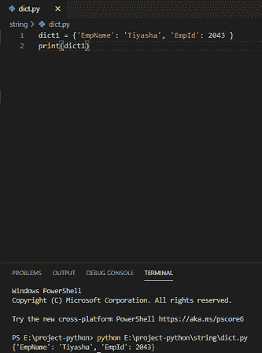

Create a dictionary in python

这就是如何用 Python 创建字典。

读取 [Python 字典重复键](https://pythonguides.com/python-dictionary-duplicate-keys/)

## python 中的花括号

**python 中的花括号**用来定义一个**字典**。Python 字典是一种将一个值映射到另一个值的数据结构。在 python 中，花括号不用于表示控制级别。相反，Python 使用缩进来实现这个目的。

下面给出的是 python 中花括号的**例子。**

```py
dictionary = {
"r" : "Red",
"b" : "Black"}
```

## 从 Python 字典中访问元素

要访问 Python 字典中的元素，请在方括号[]中指定键名。

```py
dict1 = {'EmpName': 'Tiyasha', 'EmpId': 2043 }
value = dict1['EmpId']
print(value)
```

写完上面的代码(从字典中访问元素)，你将打印出 `" value "` ，然后输出将显示为 `" 2043 "` 。这里，EmpID 值是 2043。您可以参考下面的截图来访问字典中的元素。

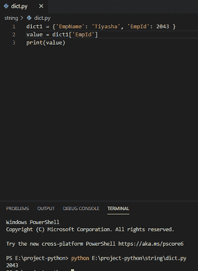

Accessing elements from a dictionary

这是如何从 Python 字典中提取元素。

读取 [Python 字典增量值](https://pythonguides.com/python-dictionary-increment-value/)

## 用键和值创建字典 python

python 中的字典将对象存储为键值对，它将所有数据和对象存储在无序集合中。

**举例:**

```py
food = {'Burger': 2, 'Sandwich': 5, 'Pizza': 10 }
print('My key-value is:', food)
```

写完上面的代码(用键和值创建字典 python)，你将打印出 `"food"` ，然后输出将显示为**"我的键值是:{'Burger': 2，' Sandwich': 5，' Pizza': 10 }"** 。这里，将使用所有的键值创建字典。你可以参考下面的截图来创建一个带有键和值的字典 python。

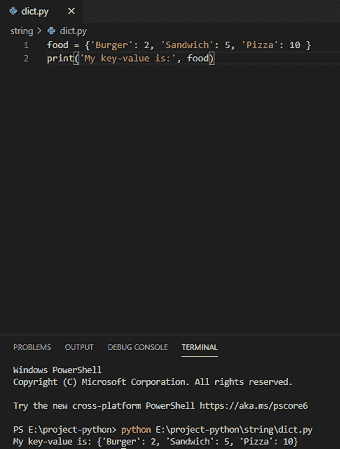

Create dictionary python with keys and values

这就是如何创建一个带有键和值的字典 python。

阅读 [Python 列表字典](https://pythonguides.com/python-dictionary-of-lists/)

## 从列表中创建字典 Python

为了在 Python 中从列表中创建字典，我们需要创建一个包含值的列表。

**举例:**

```py
food = [('Burger', 2), ('Sandwich', 5), ('Pizza', 10)]
dictionary = dict((k,v) for (k,v) in food)
print(f'dictionary: {dictionary}')
```

写完上面的代码(从 list 创建 dictionary python)，你将打印出 **"{dictionary}"** ，然后输出将显示为 **"dictionary: {'Burger': 2，' Sandwich': 5，' Pizza': 10 }"** 。在这里，字典将被创建。你可以参考下面的截图从列表中创建字典 python。

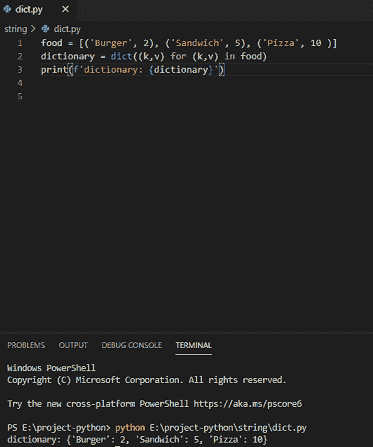

Create dictionary Python from list

这是如何从列表创建字典 Python。

阅读 [Python 字典扩展](https://pythonguides.com/python-dictionary-extend/)

## 为循环创建字典 python

使用 for 循环创建字典是 python 中一种非常高效的方式。**遍历字典**将返回键和值

**举例:**

```py
employee = {201: 'Cyrus', 202: 'Kathilin', 203: 'Mishal'}
for r in employee:
print(r, ':',employee[r])
```

写完上面的代码(为循环创建字典 python)，你将打印出**(r，':'，employee[r]) "** 然后输出将显示为**" 201:Cyrus 202:kath ilin 203:Mishal "**。这里，for 循环将在字典中迭代键值。

创建字典 python for loop 可以参考下面的截图。

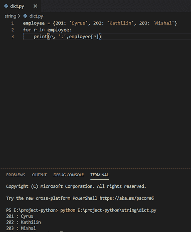

Create dictionary python for loop

这是一个创建字典 python for 循环的例子。

阅读 [Python 字典副本及示例](https://pythonguides.com/python-dictionary-copy/)

## 用两个列表创建字典 Python

为了**创建一个具有两个列表**的字典 python，我们可以使用 **zip()方法**。这里，一个列表元素与其他列表元素配对，结果将是一个字典。

**举例:**

```py
list1 = ['Red', 'Blue', 'Pink', 'Green']
list2 = ['4', '5', '8', '12', '10']
color_dictionary = dict(list1,list2)
print(color_dictionary)
```

写完上面的代码后(用两个列表创建 dictionary python)，你将打印出`(color _ dictionary)`然后输出将显示为**“错误:dict 期望最多 1 个参数，它得到了 2 个”**。

你可以参考下面的截图来创建一个包含两个列表的字典 python。

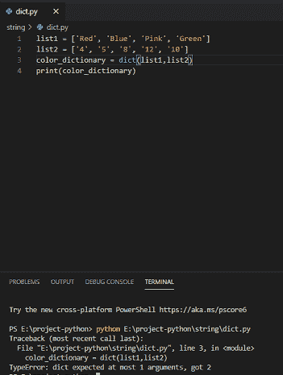

Create dictionary python with two lists

**举例:**

```py
list1 = ['Red', 'Blue', 'Pink', 'Green']
list2 = ['4', '5', '8', '12', '10']
color_dictionary = dict(zip(list1,list2))
print(color_dictionary)
```

写完上面的代码(用两个列表创建 dictionary python)，你将打印出`(color _ dictionary)`，然后输出将显示为 **"{'Red': '4 '，' Blue': '5 '，' Pink': '12 '，' Green': '10'} "** 。这里，两个列表通过使用 zip 转换成一个字典，它将配对在一起，并且它将创建一个两个列表的字典。

你可以参考下面的截图来创建一个包含两个列表的字典 python。

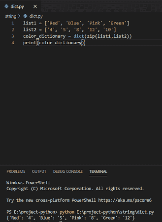

Create dictionary Python with two lists

这就是如何创建一个包含两个列表的字典 Python。

阅读 [Python 字典多个键](https://pythonguides.com/python-dictionary-multiple-keys/)

## Python 从键和值的列表中创建字典

字典是从键和相应值的列表中创建的。通过使用 python 字典理解，我们在 python 中得到一个具有键值对的字典。

**举例:**

```py
my_key = ["Paras", "Jain", "Cyware"]
my_value = ["101", "102", "103"]
result = {k:v for k,v in zip(my_key,my_value)}
print(result)
```

写完上面的代码(从一列键和值中创建一个字典)，你将打印出 `"result"` ，然后输出将显示为**" { ' params ':' 101 '，' Jain': '102 '，' Cyware': '103'} "** 。这里，字典将从键和值的列表中创建。

你可以参考下面的截图，从键和值的列表中创建一个字典。

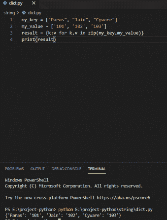

create a Python dictionary from list of keys and values

这就是如何用 Python 从键和值的列表中创建字典。

阅读[如何创建一个空的 Python 字典](https://pythonguides.com/how-to-create-an-empty-python-dictionary/)

## Python 按值排序字典

内置的 **sorted()方法**用于根据值对字典进行排序，我们可以一起使用两个函数 items()和 sorted()来根据值对元素进行排序，lambda 函数将返回值。

**举例:**

```py
my_value = {30: 'Tom', 18: 'Anisha', 20: 'Jim'}
store = dict(sorted(my_value.items(), key=lambda x: x[1]))
print("sorting by value: ", store)
```

写完上面的代码(Python 按值排序字典)，你将打印出 `" store "` ，然后输出将显示为 **" {18: 'Anisha '，20: 'Jim '，30: 'Tom'} "** 。在这里，字典将根据其值进行排序。

你可以参考下面的截图来创建一个按值排序的 python 字典。

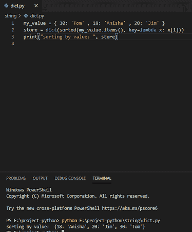

Python sort dictionary by value

这就是如何按值对 Python 字典进行排序。

将 [Python 字典读成 CSV](https://pythonguides.com/python-dictionary-to-csv/)

## 初始化空字典 python

在 python 中，我们可以通过在赋值语句中不给花括号内的任何元素来初始化一个空字典。如果键和值不在花括号中，那么在 python 中它将是一个空字典。

**举例:**

```py
name = {}
print(name)
```

写完上面的代码(初始化空字典 python)，你将打印出 `" name "` ，然后输出将显示为 **" { } "** 。这里，空字典被初始化，它将返回一个空字典。

你可以参考下面的截图来初始化空字典 python

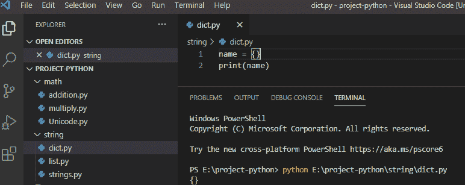

Initialize empty dictionary python

我们也可以在 python 中通过使用不带参数的内置函数**“dict()”**来初始化空字典。

**举例:**

```py
name = dict()
print(name)
```

写完上面的代码(初始化空字典 python)，你将打印出 `" name "` ，然后输出将显示为 **" { } "** 。这里，使用内置的 `dict()` 函数，不带参数地创建 python 中的空字典。

你可以参考下面的截图来初始化空字典 python

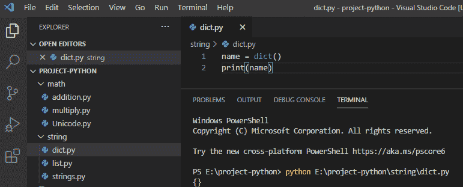

Initialize empty dictionary python

这是如何在 Python 中初始化空字典。

阅读 [Python 元组字典](https://pythonguides.com/python-dictionary-of-tuples/)

## 检查一个值是否在 Python 的字典中

在 python 中，为了检查一个值是否存在于字典中，我们将使用 `"dictionary.values()"` 来获取值，如果它存在，那么它将返回 true，否则返回 false。

**举例:**

```py
my_dictionary = {"avinav": 111, "john": 222, "nick": 223}
check = 111 in my_dictionary.values()
print(check)
```

写完上面的代码后(检查一个值是否在 Python 的字典中)，你将打印出**“check”**，然后输出将显示为**“真”**。这里， `dictionary.values()` 将检查指定的值是否存在于字典中。

你可以参考下面的截图检查一个值是否在 Python 的字典中

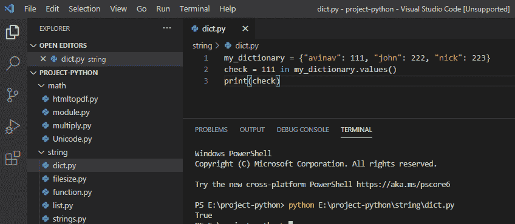

Check if a value is in a dictionary in Python

这是如何在 Python 中检查一个值是否在字典中。

还有，读， [Python 字典 pop](https://pythonguides.com/python-dictionary-pop/)

## Python 按值降序排列字典

让我们检查一下**如何在 Python** 中按值降序排列字典。

Python 中内置的 **sorted()方法**用于对字典进行降序排序。我们可以一起使用两个函数 items()和 sorted()来按照降序对元素进行排序，lambda 函数将返回降序排序的值。

```py
food = {
    'cheese sandwich': 22,
    'Butter sandwich': 15,
    'Paneer sandwich': 19
}
des_orders = sorted(food.items(), key=lambda x: x[1], reverse=True)
for i in des_orders:
    print(i[0], i[1])
```

写完上面的代码(Python 按值排序字典)，你将打印出 `" store "` ，然后输出将显示为 **" {18: 'Anisha '，20: 'Jim '，30: 'Tom'} "** 。这里， `reverse=True` 声明我们希望我们的数据按照**降序**排序。for 循环遍历在我们的 `des_orders` 方法中创建的每一项，并按排序顺序打印**键**和**值**。

你可以参考下面的截图来创建一个按值排序的 python 字典。

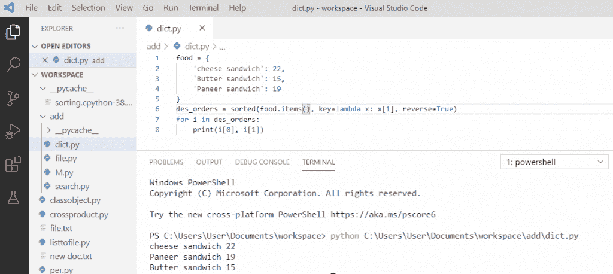

Python sort dictionary by value descending

这就是如何在 Python 中按值降序对字典进行排序。

阅读 [Python 字典包含](https://pythonguides.com/python-dictionary-contains/)

## Python 字典 vs 列表

| **字典** | **列表** |
| 字典是一个粗糙的键和值对结构。 | 列表是数组形式的索引值对的集合。 |
| 字典的键可以是任何数据类型。 | 列表的索引是从 0 开始的整数。 |
| 在字典里，维持秩序是没有保证的。 | 列表中输入元素的顺序保持不变 |
| 该元素通过字典中的键值来访问。 | 通过列表中的索引来访问元素。 |

您可能会喜欢以下 Python 教程:

*   [Python 字典理解](https://pythonguides.com/python-dictionary-comprehension/)
*   [Python 字典按值查找键](https://pythonguides.com/python-dictionary-find-a-key-by-value/)
*   [用 Python 把 PDF 文件转换成 Docx](https://pythonguides.com/convert-pdf-file-to-docx-in-python/)
*   [Python 字典删除](https://pythonguides.com/python-dictionary-remove/)
*   [Python 字典索引](https://pythonguides.com/python-dictionary-index/)
*   [Python 字典长度](https://pythonguides.com/python-dictionary-length/)
*   [Python 字典初始化](https://pythonguides.com/python-dictionary-initialize/)

在本 [Python 教程](https://www.learnpython.org)中，我们学习了**什么是 Python 字典**和**如何用 Python 创建字典**。和

*   python 中的花括号
*   从字典中访问元素
*   用键和值创建字典 python
*   从列表创建字典 python
*   为循环创建字典 python
*   创建包含两个列表的字典 python
*   Python 从键和值的列表中创建字典
*   Python 按值排序字典
*   初始化空字典 python
*   检查一个值是否在 Python 的字典中
*   Python 按值降序排序字典
*   Python 字典 vs 列表
*   python 中的花括号

[Bijay Kumar](https://pythonguides.com/author/fewlines4biju/)

Python 是美国最流行的语言之一。我从事 Python 工作已经有很长时间了，我在与 Tkinter、Pandas、NumPy、Turtle、Django、Matplotlib、Tensorflow、Scipy、Scikit-Learn 等各种库合作方面拥有专业知识。我有与美国、加拿大、英国、澳大利亚、新西兰等国家的各种客户合作的经验。查看我的个人资料。

[enjoysharepoint.com/](https://enjoysharepoint.com/)[](https://www.facebook.com/fewlines4biju "Facebook")[](https://www.linkedin.com/in/fewlines4biju/ "Linkedin")[](https://twitter.com/fewlines4biju "Twitter")