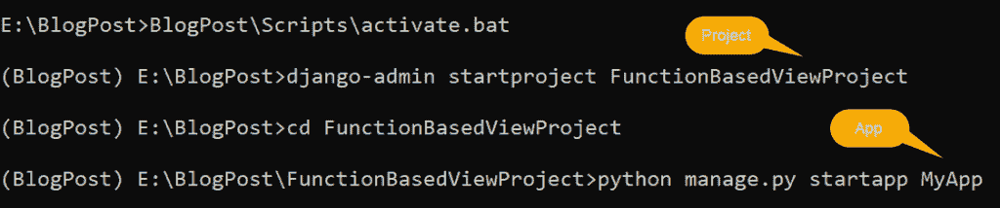
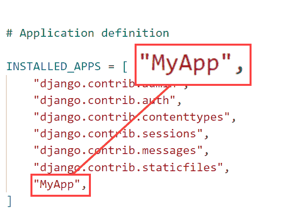
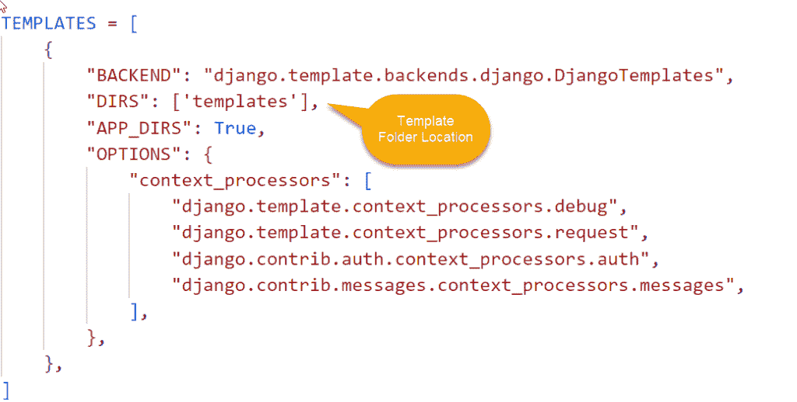
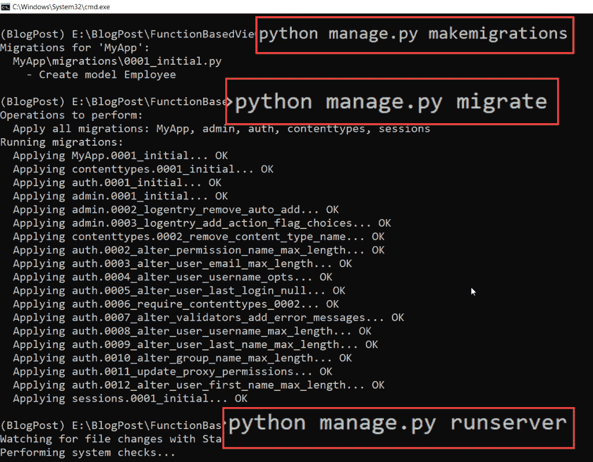
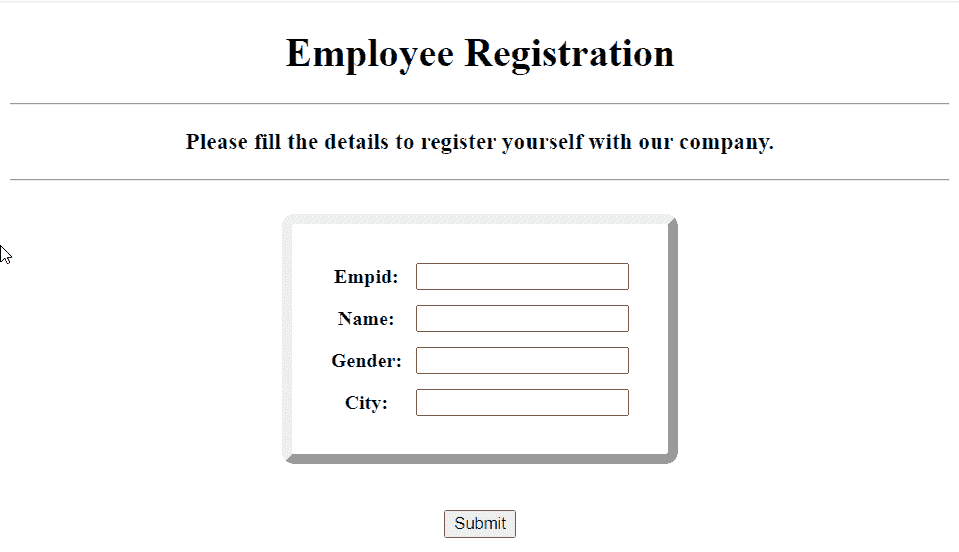
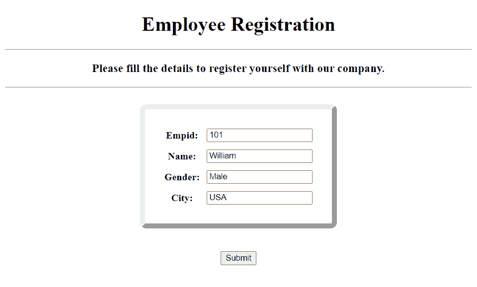
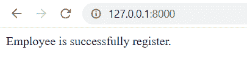

# 如何在 Django 中创建基于函数的视图

> 原文：<https://pythonguides.com/create-a-function-based-view-in-django/>

[](https://sharepointsky.teachable.com/p/python-and-machine-learning-training-course)

在这个 [Python Django 教程](https://pythonguides.com/what-is-python-django/)中，我将解释**如何用简单的步骤在 Django** 中创建一个基于函数的视图。

视图是一个接受 web 请求并返回 web 响应的函数。因此，在处理任何 Django 项目时，我们总是需要一个视图，因为它包含了主要的逻辑。

所以，在这里我们会看到:

*   Django 中什么是基于函数的视图？
*   如何在 Django 中创建基于函数的视图
*   如何在 Django 中创建模型
*   如何在 Django 中从模型创建表单
*   如何在 Django 中创建基于函数的视图来创建记录

在本文的最后，您还可以下载 Django 中基于函数的视图的代码。

目录

[](#)

*   [在 Django 中创建一个基于函数的视图](#Create_a_Function-based_view_in_Django "Create a Function-based view in Django")
    *   [Django 基于函数的视图](#Django_Function-Based_View "Django Function-Based View")
    *   [Django 基于功能的视图优势](#Django_Function-Based_View_Advantages "Django Function-Based View Advantages")
    *   [Django 基于函数的视图缺点](#Django_Function-Based_View_Disadvantages "Django Function-Based View Disadvantages")
    *   [Django 基于函数的视图语法](#Django_Function-Based_View_Syntax "Django Function-Based View Syntax")
    *   [如何在 Django 中创建基于函数的视图来创建记录](#How_to_create_a_function-based_view_in_Django_to_create_a_record "How to create a function-based view in Django to create a record")
        *   [建立 Django 项目](#Set_up_Django_Project "Set up Django Project")
        *   [创建 Django 模型](#Create_Django_Model "Create Django Model")
        *   [来自模型的 Django 表单](#Django_form_from_the_model "Django form from the model")
        *   [渲染 Django 模型表单](#Render_the_Django_ModelForm "Render the Django ModelForm")
        *   [Django 创建操作的基于函数的视图](#Django_Function-Based_View_for_create_operation "Django Function-Based View for create operation")
        *   [执行 Django 应用程序](#Execute_Django_Application "Execute Django Application")
*   [下载 Django 基于函数的视图完整代码](#Download_the_Django_Function-Based_View_complete_code "Download the Django Function-Based View complete code")
*   [结论](#Conclusion "Conclusion")

## 在 Django 中创建一个基于函数的视图

现在，让我们先了解什么是 Django 基于函数的视图，一步一步学习创建 Django 基于函数的视图来创建记录。

### Django 基于函数的视图

> 视图是编写应用程序逻辑的地方。

基于**函数的**视图基本上是一个 python 函数，它接受 web 请求并返回 web 响应。响应可以是任何内容，包括 XML 文件、图像、错误、重定向或 HTML 文本。

我们一般将这些功能称为应用程序的**视图功能**，或者**视图功能**，或者**视图功能**。

### Django 基于功能的视图优势

初学者可以很容易理解基于功能的视图，因为它们对他们来说是用户友好的。

*   使用和理解都很简单。
*   提供了显式代码流。
*   提供了装饰器的简单使用。
*   非常适合专业功能。

### Django 基于函数的视图缺点

代码的长度是基于函数的视图的最大缺点。

*   代码的重复和难以扩展。
*   HTTP 方法将由条件分支来处理。

### Django 基于函数的视图语法

Django 中每个基于函数的视图都接受一个 `HttpRequest` **对象**作为它的第一个参数。此外，基于功能的视图被写入应用程序的 `views.py` 文件中，因为它包含应用程序的业务逻辑。

后来，需要在项目/app 的 `urls.py` 文件中为基于函数的视图指定一个 URL 名称。

下面是创建基于函数的视图的**语法。**

```py
def function_name (request):
      return HttpResponse('html/variable/text')
```

这里的**请求**是一个 **HttpRequest 对象**，而 `HTML/text` 是一个 **HttpResponse 对象**。

阅读: [Python Django vs 金字塔](https://pythonguides.com/python-django-vs-pyramid/)

### 如何在 Django 中创建基于函数的视图来创建记录

现在，我们将看到一个与在 Django 中创建基于函数的视图相关的例子，该视图用于执行创建操作。

#### 建立 Django 项目

在 Django 中，总有一个项目包含各种应用程序。所以我们需要先为我们的项目建立一个项目和一个 app。这里 `FunctionBasedViewProject` 是项目的名称。

```py
django-admin startproject FunctionBasedViewProject
```

在 Django 项目中，使用如下命令创建一个名为 `MyApp` 的 Django 应用程序。

```py
python manage.py startapp MyApp
```



Django Project and App

打开项目目录下的 `settings.py` 文件，将 `MyApp` 添加到 `INSTALLED_APP` 列表中。



Install App

在 Django 中，一个请求首先被发送到**项目目录**中的 `urls.py` ，然后被转发到 **app 目录**中 `urls.py` 中的相应 URL。

```py
from django.contrib import admin
from django.urls import path,include

urlpatterns = [
    path('admin/', admin.site.urls),
    path('',include('MyApp.urls')),
]
```

阅读: [Python Django vs ReactJS](https://pythonguides.com/django-vs-reactjs/)

#### 创建 Django 模型

该项目的数据存储在 Django 模型中，这些模型基本上是我们数据库中的表。此外，打开位于 app 目录中的 `models.py` 文件，并添加以下代码以在 Django 中构建模型。

```py
from django.db import models

class Employee(models.Model):
    empid = models.IntegerField()
    name = models.CharField(max_length=200)
    gender = models.CharField(max_length=10)
    city = models.CharField(max_length=100)
    def __str__(self):
        return self.name
```

在这里，我们使用 Django **模型**类创建一个名为**雇员**的模型，它有以下字段。

*   empid 是 Django IntegerField。
*   **姓名**、**性别**、**城市**为 Django CharFields。这些字符字段分别有 200、10 和 100 个字符的限制。
*   并使用 `def __str__(self)` 来更改 Django 模型中对象的显示名称。当我们返回**自己的名字**时，它会将项目名称渲染为名称。

要在管理应用程序中查看模型，请在管理站点上注册它。为此，打开 `admin.py` 文件并添加下面给出的代码。

```py
from django.contrib import admin
from .models import Employee

admin.site.register(Employee)
```

阅读: [Python Django 过滤器](https://pythonguides.com/python-django-filter/)

#### 来自模型的 Django 表单

为了从模型中创建一个表单，将下面的代码添加到我们在 app 目录中创建的 `forms.py` 文件中。

```py
from django import forms
from .models import Employee

class EmployeeForm(forms.ModelForm):
    class Meta:
        model = Employee
        fields = '__all__'
```

这里，我们使用**表单创建一个表单。名为 `EmployeeForm` 的 ModelForm** 类。它拥有**雇员**模型的所有字段。

#### 渲染 Django 模型表单

在主项目目录中创建一个名为 `Templates` 的子目录来存储所有的项目模板，因为 Django 应用程序的前端是在 Templates 中指定的。

为了引用**模板**目录位置，打开 `settings.py` 文件，更新 `DIRS` 。



Location of Template Folder

在**模板**中创建一个名为`form.html`的 HTML 文件，向其中添加 HTML 代码。这个 HTML 代码充当 web 响应对象。

```py
<!DOCTYPE html>
<html lang="en">

<head>
    <meta charset="UTF-8">
    <meta http-equiv="X-UA-Compatible" content="IE=edge">
    <meta name="viewport" content="width=device-width, initial-scale=1.0">
    <title>Employee Registration</title>
    <style>
        table {
            border: 8px outset;
            border-radius: 10px;
            border-spacing: 10px;
            padding: 20px;
            margin-left: auto;
            margin-right: auto;
        }
    </style>
</head>

<body>
    <h1 align="center">Employee Registration</h1>
    <hr>
    <h3 align="center">Please fill the details to register yourself with our company.</h3>
    <hr>
    <br>
    <form method="post">
        
        <table>
            {{form.as_table}}
        </table>
        <br><br>
        <div style="text-align:center">
            <input type="submit" />
        </div>
    </form>
</body>

</html>
```

*   **表格的样式**首先在**头**标签中定义。
*   HTML 标签 `h1` 和 `h4` 然后被用来在**主体**标签内添加表单的标题。
*   它将通过使用 `POST` 方法调用 `form` 标签来呈现表单。
*   为了保护表单免受黑客攻击，并能够安全地发送数据，请在表单元素中包含 `csrf_token` 。
*   之后，使用 `form.as_table` 标签将表单呈现为表格。
*   添加一个**提交**按钮作为最后一步。

阅读: [Python Django group by](https://pythonguides.com/python-django-group-by/)

#### Django 创建操作的基于函数的视图

创建基于函数的视图，该视图对员工模型执行创建操作。打开 `views.py` 文件，添加下面给出的代码。

```py
from django.shortcuts import render,HttpResponse
from .forms import EmployeeForm

# Create your views here.

def empregistration(request):
    if request.method == 'POST':
        form = EmployeeForm(request.POST)
        if form.is_valid():
            form.save()
            return HttpResponse('Employee is successfully register.')
    else:
        form = EmployeeForm()
        context = {
            'form':form,
        }
    return render(request, 'form.html', context)
```

*   创建一个名为 `empregistration` 的视图，首先从 `forms.py` 文件中导入 `EmployeeForm` 。
*   之后，执行 **if 语句**确定请求方法是否为 `POST` 。
    *   如果是这样，只需包含一个**请求。POST** 表单方法。
    *   调用 `is_valid` 方法来验证用户的输入。如果验证成功，调用 `save()` 方法保存用户数据并返回 `HttpResponse` 。
*   如果请求方式为**获取**，则 `render()` 函数向用户显示一张空白的注册申请表。

现在，我们必须用 URL 映射视图以便调用它，因此我们必须在 app 目录中创建一个名为 `urls.py` 的文件。包括下面的代码。

```py
from django.urls import path
from . import views

urlpatterns = [
path('', views.empregistration, name='employeeregistration'),
]
```

阅读: [Python 过滤器不在 Django 中](https://pythonguides.com/filter-not-in-django/)

#### 执行 Django 应用程序

要创建包含模型表格模式代码的迁移文件，请在终端中键入以下命令。

```py
python manage.py makemigrations
```

要根据迁移文件的模式构建表，请执行以下命令。

```py
python manage.py migrate
```

要启动开发服务器，请在终端中键入下面给出的命令。

```py
python manage.py runserver
```



Execute Django Project

它成功地打开了 Django 员工注册表单，这是我们使用 ModelForm 和基于函数的视图创建的，如下所示。



Employee Registration using Django

现在，填写表格并点击提交按钮，如下所示。



Submit Employee Registration Form in Django

成功提交表单后，我们将得到如下所示的 HttpResponse。



Successfully Submitting the Employee Registration Form in Django

这就是我们如何在 Django 中创建基于函数的视图来执行创建操作。

## 下载 **Django 基于函数的视图**完整代码

代码如下:

[Django Function-Based View](https://pythonguides.com/wp-content/uploads/2022/12/FunctionBasedViewProject.zip)

## 结论

这样，我们就成功地在 Django 中创建了一个基于函数的视图。我们还学习了如何在 Django 中创建基于函数的视图，它的优点和缺点，以及它的语法。

此外，我们还讨论了以下主题。

*   Django 中什么是基于函数的视图？
*   如何在 Django 中创建基于函数的视图
*   如何在 Django 中创建模型
*   如何在 Django 中从模型创建表单
*   如何在 Django 中创建基于函数的视图来创建记录

您可能也喜欢阅读下面的 Python Django 教程。

*   [获取 Django 中的 URL 参数](https://pythonguides.com/get-url-parameters-in-django/)
*   [Django 从 POST 请求中获取所有数据](https://pythonguides.com/django-get-all-data-from-post-request/)
*   [Django 模板中的 If 语句](https://pythonguides.com/if-statement-in-django-template/)
*   [Python Django 随机数](https://pythonguides.com/django-random-number/)

[Bijay Kumar](https://pythonguides.com/author/fewlines4biju/)

Python 是美国最流行的语言之一。我从事 Python 工作已经有很长时间了，我在与 Tkinter、Pandas、NumPy、Turtle、Django、Matplotlib、Tensorflow、Scipy、Scikit-Learn 等各种库合作方面拥有专业知识。我有与美国、加拿大、英国、澳大利亚、新西兰等国家的各种客户合作的经验。查看我的个人资料。

[enjoysharepoint.com/](https://enjoysharepoint.com/)[](https://www.facebook.com/fewlines4biju "Facebook")[](https://www.linkedin.com/in/fewlines4biju/ "Linkedin")[](https://twitter.com/fewlines4biju "Twitter")