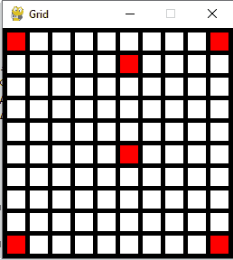
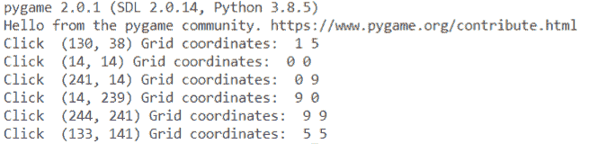
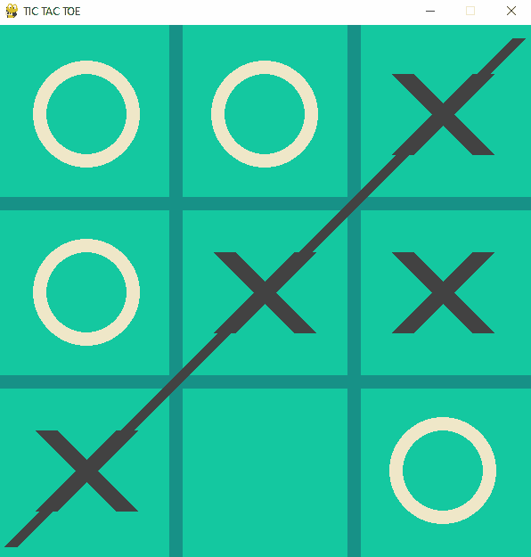
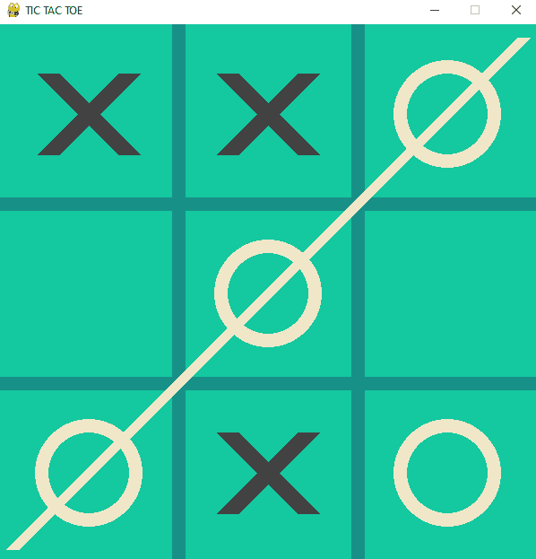
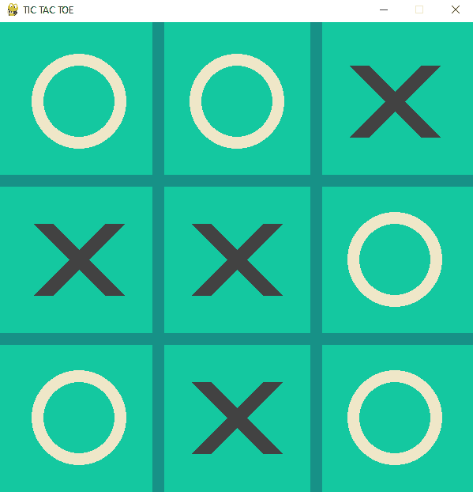

# 使用 Python Pygame(井字游戏)创建一个游戏

> 原文：<https://pythonguides.com/create-a-game-using-python-pygame/>

[](https://sharepointsky.teachable.com/p/python-and-machine-learning-training-course)

在这个 [Python 教程](https://pythonguides.com/learn-python/)中，我们将学习如何**使用 pygame** 在 Python 中创建一个游戏。使用 pygame 很容易在 Python 中创建一个游戏。我们将在这里看到，**如何使用 Python pygam** e 开发井字游戏。我们还将讨论以下主题:

*   python pygame 中的网格有什么用
*   Python pygame 网格游戏
*   关于井字游戏
*   使用 pygame 的 Python 井字游戏

目录

[](#)

*   [网格在 Python Pygame 中有什么用](#What_is_the_use_of_grid_in_Python_Pygame "What is the use of grid in Python Pygame")
*   [Python Pygame 网格](#Python_Pygame_grid "Python Pygame grid")
*   [关于井字游戏](#About_tic_tac_toe_game "About tic tac toe game")
*   [使用 Python Pygame 创建井字游戏](#Create_tic_tac_toe_game_using_Python_Pygame "Create tic tac toe game using Python Pygame")

## 网格在 Python Pygame 中有什么用

python pygame 中使用网格是为了像井字游戏、扫雷游戏等游戏。冒险游戏将数据保存在游戏网格中。数字网格也可以称为二维数组或矩阵。

你可能喜欢 [Python Pygame 教程](https://pythonguides.com/python-pygame-tutorial/)

## Python Pygame 网格

*   首先，我们将**导入 pygame** 。 `pygame.init()` 用于初始化 pygame 所有需要的**模块**。
*   之后，我们将定义一些颜色，如黑色、白色和红色。
*   现在，我们将设置每个网格位置的**宽度**和**高度**。**边距= 5** 将设置每个单元格之间的边距。
*   我们需要创建一个二维数组。二维数组只是一系列列表。
*   创建一个空列表 **grid = []** 。同样，对于每一行循环，创建一个代表整个行的列表。为了添加一个单元格，我们将使用**网格【行】。**追加(0)。
*   **网格[1][5] = 1** 会将行设置为 1，列设置为 5 对 1。
*   使用 **window_size = [255，255]** 设置屏幕的高度和宽度。
*   同样，使用`pygame . display . set _ caption(" Grid ")`设置屏幕的标题。循环，直到用户单击关闭按钮。
*   `pygame.time.Clock()` 用于管理屏幕更新的速度。
*   主循环用于 clicked 事件。如果用户点击鼠标，然后获得位置。
*   此外，将 x/y 屏幕坐标更改为网格坐标。
*   将屏幕背景设置为 **scr.fill(黑色)**。
*   **用于范围(10)中的行**用于绘制网格。 `clock.tick(50)` 是每秒帧数的极限。
*   这个 `pygame.display.flip()` 用于用我们绘制的内容更新屏幕。

**举例:**

```py
import pygame
black = (0, 0, 0)
white = (255, 255, 255)

red = (255, 0, 0)
WIDTH = 20
HEIGHT = 20
MARGIN = 5
grid = []
for row in range(10):
    grid.append([])
    for column in range(10):
        grid[row].append(0) 
grid[1][5] = 1
pygame.init()
window_size = [255, 255]
scr = pygame.display.set_mode(window_size)
pygame.display.set_caption("Grid")
done = False
clock = pygame.time.Clock()
while not done:
    for event in pygame.event.get(): 
        if event.type == pygame.QUIT: 
            done = True 
        elif event.type == pygame.MOUSEBUTTONDOWN:
            pos = pygame.mouse.get_pos()
            column = pos[0] // (WIDTH + MARGIN)
            row = pos[1] // (HEIGHT + MARGIN)
            grid[row][column] = 1
            print("Click ", pos, "Grid coordinates: ", row, column)
    scr.fill(black)
    for row in range(10):
        for column in range(10):
            color = white
            if grid[row][column] == 1:
                color = red
            pygame.draw.rect(scr,
                             color,
                             [(MARGIN + WIDTH) * column + MARGIN,
                              (MARGIN + HEIGHT) * row + MARGIN,
                              WIDTH,
                              HEIGHT])
    clock.tick(50)
    pygame.display.flip()
pygame.quit()
```

在这个输出中，我们可以看到新窗口和 python pygame 中的网格一起出现。红框是鼠标在网格中点击的位置。



Python Pygame grid

在下面的截图中，我们可以看到当点击屏幕时，鼠标的位置和坐标被点击。



Python pygame grid

## 关于井字游戏

*   井字游戏是最受欢迎的游戏之一。让我们了解一下这个游戏在 python pygame 中是如何工作的。
*   井字游戏基本上是两个人玩的游戏。它有表示为“O”和“X”的零号和十字。
*   x 和 O 轮流标记 3×3 网格中的空间。
*   成功在水平、垂直或对角线上放置三个标记的玩家赢得游戏，游戏结束。
*   我们将使用 Python 库来构建这个游戏。

阅读:[从 PDF Python 中提取文本](https://pythonguides.com/extract-text-from-pdf-python/)

## 使用 Python Pygame 创建井字游戏

在这里，我们将解释使用 pygame 用 python 编写**井字游戏` `游戏**的简单方法。建议去抛下面一步。

第一步。

*   首先我们会导入 `pygame` 、 `sys` 、 `NumPy` python 库用于构建这个游戏。
*   设置游戏窗口的**宽度**和**高度**。同样，设置背景颜色为 **BG_COLOR = (20，200，160)**
*   根据您的选择设置线条颜色、圆形颜色和十字颜色。
*   为了创建一个电路板，我们将使用 `np.zeros()` 。
*   `pygame.draw.line()` 用于绘制一条**水平**线和**垂直**线。

```py
import pygame, sys
import numpy as np
pygame.init()

WIDTH = 600
HEIGHT = 600
LINE_WIDTH = 15
WIN_LINE_WIDTH = 15
BOARD_ROWS = 3
BOARD_COLS = 3
SQUARE_SIZE = 200
CIRCLE_RADIUS = 60
CIRCLE_WIDTH = 15
CROSS_WIDTH = 25
SPACE = 55

BG_COLOR = (20, 200, 160)
LINE_COLOR = (23, 145, 135)
CIRCLE_COLOR = (239, 231, 200)
CROSS_COLOR = (66, 66, 66)

screen = pygame.display.set_mode( (WIDTH, HEIGHT) )
pygame.display.set_caption( 'TIC TAC TOE' )
screen.fill( BG_COLOR )

board = np.zeros( (BOARD_ROWS, BOARD_COLS) )

def draw_lines():

	pygame.draw.line( screen, LINE_COLOR, (0, SQUARE_SIZE), (WIDTH, SQUARE_SIZE), LINE_WIDTH )

	pygame.draw.line( screen, LINE_COLOR, (0, 2 * SQUARE_SIZE), (WIDTH, 2 * SQUARE_SIZE), LINE_WIDTH )

	pygame.draw.line( screen, LINE_COLOR, (SQUARE_SIZE, 0), (SQUARE_SIZE, HEIGHT), LINE_WIDTH )

	pygame.draw.line( screen, LINE_COLOR, (2 * SQUARE_SIZE, 0), (2 * SQUARE_SIZE, HEIGHT), LINE_WIDTH )
```

**第二步:**

*   `def draw_figures()` 用于绘制十字的圆和线。
*   `def mark_square()` 函数用于在板上进行标记，它有 3 个参数。
*   如果方块可用，def available_square() 将返回 true，如果不可用，将返回 false。
*   `def is_board_full()` 如果电路板已满，函数将返回 true，如果电路板未满，函数将返回 false。它将遍历行和列。
*   如果 board[row][col] == 0 这意味着我们找到了空方块，它将返回 false，如果我们没有找到空方块，它将返回 true。

```py
def draw_figures():
	for row in range(BOARD_ROWS):
		for col in range(BOARD_COLS):
			if board[row][col] == 1:
				pygame.draw.circle( screen, CIRCLE_COLOR, (int( col * SQUARE_SIZE + SQUARE_SIZE//2 ), int( row * SQUARE_SIZE + SQUARE_SIZE//2 )), CIRCLE_RADIUS, CIRCLE_WIDTH )
			elif board[row][col] == 2:
				pygame.draw.line( screen, CROSS_COLOR, (col * SQUARE_SIZE + SPACE, row * SQUARE_SIZE + SQUARE_SIZE - SPACE), (col * SQUARE_SIZE + SQUARE_SIZE - SPACE, row * SQUARE_SIZE + SPACE), CROSS_WIDTH )	
				pygame.draw.line( screen, CROSS_COLOR, (col * SQUARE_SIZE + SPACE, row * SQUARE_SIZE + SPACE), (col * SQUARE_SIZE + SQUARE_SIZE - SPACE, row * SQUARE_SIZE + SQUARE_SIZE - SPACE), CROSS_WIDTH )

def mark_square(row, col, player):
	board[row][col] = player

def available_square(row, col):
	return board[row][col] == 0

def is_board_full():
	for row in range(BOARD_ROWS):
		for col in range(BOARD_COLS):
			if board[row][col] == 0:
				return False

	return True
```

**第三步:**

*   这里使用了 `def check_win(player)` 函数。另外，范围内栏的`(BOARD _ COLS)`用于检查垂直赢线。
*   `for row in range(BOARD _ ROWS)`用于检查水平获奖线。
*   现在，我们将检查上升`draw _ ASC _ diagonal(player)`和下降`draw _ desc _ diagonal(player)`的对角赢。
*   **def draw _ vertical _ winning _ line(col，player)** 用于绘制一条垂直的赢线。
*   **如果 player == 1** 则圈色， `elif player == 2` 则跨色。

```py
def check_win(player):
	for col in range(BOARD_COLS):
		if board[0][col] == player and board[1][col] == player and board[2][col] == player:
			draw_vertical_winning_line(col, player)
			return True

	for row in range(BOARD_ROWS):
		if board[row][0] == player and board[row][1] == player and board[row][2] == player:
			draw_horizontal_winning_line(row, player)
			return True

	if board[2][0] == player and board[1][1] == player and board[0][2] == player:
		draw_asc_diagonal(player)
		return True

	if board[0][0] == player and board[1][1] == player and board[2][2] == player:
		draw_desc_diagonal(player)
		return True

	return False

def draw_vertical_winning_line(col, player):
	posX = col * SQUARE_SIZE + SQUARE_SIZE//2

	if player == 1:
		color = CIRCLE_COLOR
	elif player == 2:
		color = CROSS_COLOR

	pygame.draw.line( screen, color, (posX, 15), (posX, HEIGHT - 15), LINE_WIDTH ) 
```

**第四步:**

*   `def draw _ horizontal _ winning _ line()`该函数用于绘制水平赢线。
*   **如果 player == 1** 则圈色， `elif player == 2` 则跨色。
*   `def draw _ ASC _ diagonal(player)`用于绘制上升对角线的获胜线。
*   **如果 player == 1** 那么圈颜色，**如果 player == 2** 那么交叉颜色

```py
def draw_horizontal_winning_line(row, player):
	posY = row * SQUARE_SIZE + SQUARE_SIZE//2

	if player == 1:
		color = CIRCLE_COLOR
	elif player == 2:
		color = CROSS_COLOR

	pygame.draw.line( screen, color, (15, posY), (WIDTH - 15, posY), WIN_LINE_WIDTH )

def draw_asc_diagonal(player):
	if player == 1:
		color = CIRCLE_COLOR
	elif player == 2:
		color = CROSS_COLOR

	pygame.draw.line( screen, color, (15, HEIGHT - 15), (WIDTH - 15, 15), WIN_LINE_WIDTH ) 
```

**第五步:**

*   `def draw _ desc _ diagonal(player)`用于绘制一条降序排列的获胜对角线。
*   **如果 player == 1** 则圈色， `elif player == 2` 则跨色。
*   `pygame.draw.line()` 用于画线。
*   `def restart()` 当你的游戏结束，想再玩一次的时候调用这个函数。

```py
def draw_desc_diagonal(player):
	if player == 1:
		color = CIRCLE_COLOR
	elif player == 2:
		color = CROSS_COLOR

	pygame.draw.line( screen, color, (15, 15), (WIDTH - 15, HEIGHT - 15), WIN_LINE_WIDTH )

def restart():
	screen.fill( BG_COLOR )
	draw_lines()
	for row in range(BOARD_ROWS):
		for col in range(BOARD_COLS):
			board[row][col] = 0 
```

**第六步:**

*   现在，我们需要设置 `game_over = False` ，如果玩家赢了，则将其设置为 true，游戏结束。
*   **为真时**主循环开始。
*   在主循环中调用函数 `check win` 。
*   我们用 python 的 sys 库退出了游戏。
*   但如果按下鼠标， `event.get()` 会返回**“mouse button down”**并调用 `user_click()` 。以知道用户点击的板的精确坐标。
*   **if event.key == pygame。K_r** 然后**按下**【r】**重新启动**游戏并开始玩

```py
draw_lines()

player = 1
game_over = False

while True:
	for event in pygame.event.get():
		if event.type == pygame.QUIT:
			sys.exit()

		if event.type == pygame.MOUSEBUTTONDOWN and not game_over:

			mouseX = event.pos[0] 
			mouseY = event.pos[1] 

			clicked_row = int(mouseY // SQUARE_SIZE)
			clicked_col = int(mouseX // SQUARE_SIZE)

			if available_square( clicked_row, clicked_col ):

				mark_square( clicked_row, clicked_col, player )
				if check_win( player ):
					game_over = True
				player = player % 2 + 1

				draw_figures()

		if event.type == pygame.KEYDOWN:
			if event.key == pygame.K_r:
				restart()
				player = 1
				game_over = False

	pygame.display.update()
```

****使用 pygame 在 python 中完成井字游戏代码:****

```py
import pygame, sys
import numpy as np
pygame.init()

WIDTH = 600
HEIGHT = 600
LINE_WIDTH = 15
WIN_LINE_WIDTH = 15
BOARD_ROWS = 3
BOARD_COLS = 3
SQUARE_SIZE = 200
CIRCLE_RADIUS = 60
CIRCLE_WIDTH = 15
CROSS_WIDTH = 25
SPACE = 55

RED = (255, 0, 0)
BG_COLOR = (20, 200, 160)
LINE_COLOR = (23, 145, 135)
CIRCLE_COLOR = (239, 231, 200)
CROSS_COLOR = (66, 66, 66)

screen = pygame.display.set_mode( (WIDTH, HEIGHT) )
pygame.display.set_caption( 'TIC TAC TOE' )
screen.fill( BG_COLOR )

board = np.zeros( (BOARD_ROWS, BOARD_COLS) )

def draw_lines():

	pygame.draw.line( screen, LINE_COLOR, (0, SQUARE_SIZE), (WIDTH, SQUARE_SIZE), LINE_WIDTH )

	pygame.draw.line( screen, LINE_COLOR, (0, 2 * SQUARE_SIZE), (WIDTH, 2 * SQUARE_SIZE), LINE_WIDTH )

	pygame.draw.line( screen, LINE_COLOR, (SQUARE_SIZE, 0), (SQUARE_SIZE, HEIGHT), LINE_WIDTH )

	pygame.draw.line( screen, LINE_COLOR, (2 * SQUARE_SIZE, 0), (2 * SQUARE_SIZE, HEIGHT), LINE_WIDTH )

def draw_figures():
	for row in range(BOARD_ROWS):
		for col in range(BOARD_COLS):
			if board[row][col] == 1:
				pygame.draw.circle( screen, CIRCLE_COLOR, (int( col * SQUARE_SIZE + SQUARE_SIZE//2 ), int( row * SQUARE_SIZE + SQUARE_SIZE//2 )), CIRCLE_RADIUS, CIRCLE_WIDTH )
			elif board[row][col] == 2:
				pygame.draw.line( screen, CROSS_COLOR, (col * SQUARE_SIZE + SPACE, row * SQUARE_SIZE + SQUARE_SIZE - SPACE), (col * SQUARE_SIZE + SQUARE_SIZE - SPACE, row * SQUARE_SIZE + SPACE), CROSS_WIDTH )	
				pygame.draw.line( screen, CROSS_COLOR, (col * SQUARE_SIZE + SPACE, row * SQUARE_SIZE + SPACE), (col * SQUARE_SIZE + SQUARE_SIZE - SPACE, row * SQUARE_SIZE + SQUARE_SIZE - SPACE), CROSS_WIDTH )

def mark_square(row, col, player):
	board[row][col] = player

def available_square(row, col):
	return board[row][col] == 0

def is_board_full():
	for row in range(BOARD_ROWS):
		for col in range(BOARD_COLS):
			if board[row][col] == 0:
				return False

	return True

def check_win(player):
	for col in range(BOARD_COLS):
		if board[0][col] == player and board[1][col] == player and board[2][col] == player:
			draw_vertical_winning_line(col, player)
			return True

	for row in range(BOARD_ROWS):
		if board[row][0] == player and board[row][1] == player and board[row][2] == player:
			draw_horizontal_winning_line(row, player)
			return True

	if board[2][0] == player and board[1][1] == player and board[0][2] == player:
		draw_asc_diagonal(player)
		return True

	if board[0][0] == player and board[1][1] == player and board[2][2] == player:
		draw_desc_diagonal(player)
		return True

	return False

def draw_vertical_winning_line(col, player):
	posX = col * SQUARE_SIZE + SQUARE_SIZE//2

	if player == 1:
		color = CIRCLE_COLOR
	elif player == 2:
		color = CROSS_COLOR

	pygame.draw.line( screen, color, (posX, 15), (posX, HEIGHT - 15), LINE_WIDTH )

def draw_horizontal_winning_line(row, player):
	posY = row * SQUARE_SIZE + SQUARE_SIZE//2

	if player == 1:
		color = CIRCLE_COLOR
	elif player == 2:
		color = CROSS_COLOR

	pygame.draw.line( screen, color, (15, posY), (WIDTH - 15, posY), WIN_LINE_WIDTH )

def draw_asc_diagonal(player):
	if player == 1:
		color = CIRCLE_COLOR
	elif player == 2:
		color = CROSS_COLOR

	pygame.draw.line( screen, color, (15, HEIGHT - 15), (WIDTH - 15, 15), WIN_LINE_WIDTH )

def draw_desc_diagonal(player):
	if player == 1:
		color = CIRCLE_COLOR
	elif player == 2:
		color = CROSS_COLOR

	pygame.draw.line( screen, color, (15, 15), (WIDTH - 15, HEIGHT - 15), WIN_LINE_WIDTH )

def restart():
	screen.fill( BG_COLOR )
	draw_lines()
	for row in range(BOARD_ROWS):
		for col in range(BOARD_COLS):
			board[row][col] = 0

draw_lines()

player = 1
game_over = False

while True:
	for event in pygame.event.get():
		if event.type == pygame.QUIT:
			sys.exit()

		if event.type == pygame.MOUSEBUTTONDOWN and not game_over:

			mouseX = event.pos[0] 
			mouseY = event.pos[1] 

			clicked_row = int(mouseY // SQUARE_SIZE)
			clicked_col = int(mouseX // SQUARE_SIZE)

			if available_square( clicked_row, clicked_col ):

				mark_square( clicked_row, clicked_col, player )
				if check_win( player ):
					game_over = True
				player = player % 2 + 1

				draw_figures()

		if event.type == pygame.KEYDOWN:
			if event.key == pygame.K_r:
				restart()
				player = 1
				game_over = False

	pygame.display.update()
```

**输出 1** :

在下面的输出中，您可以看到“X”赢得了游戏。



Python tic tac toe game using pygame

**输出 2:**

在下面的输出中，您可以看到“O”赢得了游戏。



Python tic tac toe game using pygame

**输出 3:**

在下面的输出中，您可以看到没有人赢得游戏。



Python tic tac toe game using pygame

您可能会喜欢以下 Python 教程:

*   [Python 熊猫 CSV 教程](https://pythonguides.com/python-pandas-csv/)
*   [蟒蛇里的熊猫](https://pythonguides.com/pandas-in-python/)
*   [Python 捕捉多个异常](https://pythonguides.com/python-catch-multiple-exceptions/)
*   [Python Tkinter Map()函数](https://pythonguides.com/python-tkinter-map-function/)
*   [使用 Python Tkinter 创建日期时间选择器](https://pythonguides.com/create-date-time-picker-using-python-tkinter/)
*   [使用 Python 的机器学习](https://pythonguides.com/machine-learning-using-python/)

我希望现在你可以用 python 创建一个**网格游戏**像****井字游戏**，并且我们也学会了如何使用 pygame 和 sys 模块。在这里，我们学习了如何使用 Pygame 在 Python 中创建井字游戏，我们有完整的源代码和解释。**

**[Bijay Kumar](https://pythonguides.com/author/fewlines4biju/)

Python 是美国最流行的语言之一。我从事 Python 工作已经有很长时间了，我在与 Tkinter、Pandas、NumPy、Turtle、Django、Matplotlib、Tensorflow、Scipy、Scikit-Learn 等各种库合作方面拥有专业知识。我有与美国、加拿大、英国、澳大利亚、新西兰等国家的各种客户合作的经验。查看我的个人资料。

[enjoysharepoint.com/](https://enjoysharepoint.com/)[](https://www.facebook.com/fewlines4biju "Facebook")[](https://www.linkedin.com/in/fewlines4biju/ "Linkedin")[](https://twitter.com/fewlines4biju "Twitter")**