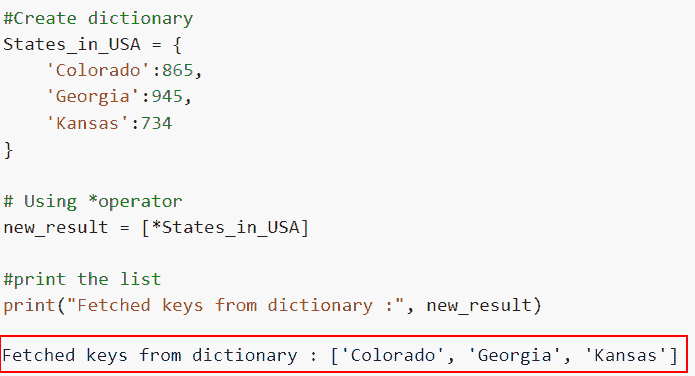
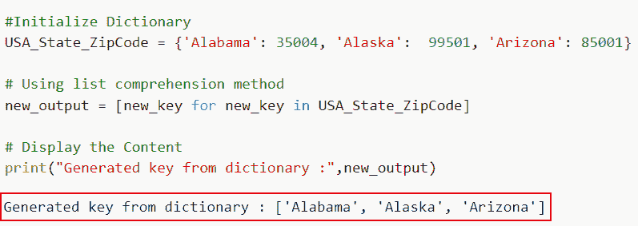
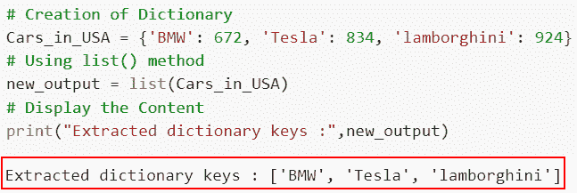

# 如何用 python 创建字典键列表

> 原文：<https://pythonguides.com/create-a-list-of-dictionary-keys-in-python/>

[](https://sharepointsky.teachable.com/p/python-and-machine-learning-training-course)

在本 [Python 教程](https://pythonguides.com/python-programming-for-the-absolute-beginner/)中，我们将讨论 ***如何在 python*** 中创建字典键列表。我们将讨论使用字典键在 Python 中创建列表所需的过程和技术。

最近，我在做一个 Python 项目，其中我们有一个需求，我们必须将字典中的惟一键元素存储在一个 Python 列表中。

这里我们将讨论

*   如何使用 dict.keys()在 Python 中创建字典键列表
*   使用*运算符在 Python 中创建字典键列表
*   如何使用列表理解在 Python 中创建字典键列表
*   使用 for 循环和 append()在 Python 中创建字典键列表
*   如何使用 list()在 Python 中创建字典键列表

目录

[](#)

*   [用 python 创建一个字典键列表](#Create_a_list_of_dictionary_keys_in_python "Create a list of dictionary keys in python")
    *   [如何使用 dict.keys()](#How_to_create_a_list_of_dictionary_keys_in_Python_using_dictkeys "How to create a list of dictionary keys in Python using dict.keys()") 在 Python 中创建字典键列表
    *   [使用*操作符](#Create_a_list_of_dictionary_keys_in_Python_using_operator "Create a list of dictionary keys in Python using * operator")在 Python 中创建一个字典键列表
    *   [如何使用列表理解在 Python 中创建字典键列表](#How_to_create_a_list_of_dictionary_keys_in_Python_using_list_comprehension "How to create a list of dictionary keys in Python using list comprehension")
    *   [使用 for 循环和 append()](#Create_a_list_of_dictionary_keys_in_Python_using_for_loop_and_append "Create a list of dictionary keys in Python using for loop and append()") 在 Python 中创建一个字典键列表
    *   [如何使用 list()](#How_to_create_a_list_of_dictionary_keys_in_Python_using_list "How to create a list of dictionary keys in Python using list()") 在 Python 中创建字典键列表

## 用 python 创建一个字典键列表

在 Python 中，当在 Python 中创建字典键列表时，主要有三种常用且重要的理解方法。

### 如何使用 dict.keys() 在 Python 中创建字典键列表

*   在这一节中，我们将讨论如何使用 dict.keys()在 Python 中创建字典键列表。
*   要从字典中提取所有的键，请使用 Python 中的 keys()函数。如果字典是空的，它产生一个空列表。此过程不需要任何参数。
*   在这个例子中，我们将使用 dict.keys()方法在列表中存储关键元素。

**语法:**

让我们来看看语法，了解一下 `dict.keys()` 的工作原理。

```py
dict.keys()
```

**注意:**这个方法不接受任何参数，它将返回键的列表。

**举例:**

让我们举个例子，看看如何使用 dict.keys()在 Python 中定义一个字典键列表。

```py
# Creation of Dictionary
Country_name = {'U.S.A': 783, 'Germany': 356, 'China': 924}

# Using dict.keys() method
new_output = list(Country_name.keys())

# Display the Content
print("Extract keys from Dictionary :",new_output)
```

在上面的代码中，我们首先创建了一个字典，并以键-值对的形式分配元素。为了获得对象字典键，我们使用了 dict.keys()方法。我们将 dict.keys()作为参数分配给 list()构造函数。list()返回键的列表。

下面是下面给出的代码的截图。


How to create a list of dictionary keys in Python using dict.keys()

这就是如何使用 dict.keys()在 Python 中创建和定义字典键列表。

阅读: [Python 列表方法](https://pythonguides.com/python-list-methods/)

### 使用*操作符在 Python 中创建一个字典键列表

*   这里我们将讨论如何使用*运算符在 Python 中构造一个字典键列表。
*   运算符分解一个序列。为了生成一个列表，我们将提取[]中的字典键。
*   为了首先执行这个任务，我们将创建一个字典，然后在一个列表中获取键，我们将在列表中使用*和字典名。

**举例:**

让我们举一个例子，看看如何使用*操作符在 Python 中创建一个字典键列表。

**源代码:**

```py
#Create dictionary
States_in_USA = {
    'Colorado':865,
    'Georgia':945,
    'Kansas':734
}

# Using *operator
new_result = [*States_in_USA]

#print the list
print("Fetched keys from dictionary :", new_result)
```

在下面给出的代码中，我们首先创建了一个名为“States_in_USA”的字典，并以键值对的形式分配元素。接下来，我们使用*操作符从字典中提取键。

你可以参考下面的截图。



Create a list of dictionary keys in Python using * operator

在这个例子中，我们已经了解了如何使用*运算符在 Python 中创建一个字典键列表。

阅读: [Python 扩展 Vs 追加](https://pythonguides.com/python-extend-vs-append/)

### 如何使用列表理解在 Python 中创建字典键列表

*   现在让我们看看如何使用 list comprehension 在 Python 中创建一个字典键列表。
*   列表理解是 Python 例程，可用于构建新序列(如列表、字典等)。)来自现有序列。它们有助于减少较大的环路。
*   在这个例子中，我们将使用列表理解从字典中提取关键字，并将它们存储在结果中。

**语法:**

下面是 Python 中列表理解方法的语法

```py
[expression for element in iterable if condition]
```

**注:**

list comprehension 语法有三个组成部分:一个表达式，一个或多个 for 循环，如果需要，还有一个或多个 if 条件。方括号[必须用于列表理解]。第一个表达式的结果将保存在新列表中。

**举例:**

这里我们将举一个例子，并检查如何使用 list comprehension 在 Python 中创建一个字典键列表。

**源代码:**

```py
#Initialize Dictionary
USA_State_ZipCode = {'Alabama': 35004, 'Alaska': 	99501, 'Arizona': 85001}

# Using list comprehension method
new_output = [new_key for new_key in USA_State_ZipCode]

# Display the Content
print("Generated key from dictionary :",new_output)
```

在上面的代码中，我们首先创建了名为**“USA _ State _ zip code”**的字典，然后使用了列表理解方法，其中 for 循环用于迭代 iterable 对象。

下面是以下给定代码的执行。



How to create a list of dictionary keys in Python using list comprehension

正如你在截图中看到的，我们已经讨论了如何使用 list comprehension 在 Python 中创建一个字典键列表。

阅读:[在 Python 中连接多个列表](https://pythonguides.com/concatenate-multiple-lists-in-python/)

### 使用 for 循环和 append() 在 Python 中创建一个字典键列表

*   在本节中，我们将讨论如何使用 for 循环和 append()在 Python 中创建字典键列表。
*   在本例中，我们将创建一个列表，并在遍历字典的键时一次添加一个字典键。
*   为了执行这项任务，我们首先将定义一个空列表来包含键，并在 for 循环的每次迭代中追加键。

**举例:**

让我们举一个例子，看看如何使用 for 循环和 append()在 Python 中创建一个字典键列表。

**源代码:**

```py
Country_name = {'U.S.A': 783, 'Germany': 356, 'China': 924}

new_lis = []
for new_key in Country_name:
    new_lis.append(new_key)

print(new_lis)
```

在下面给出的代码中，我们定义了空列表，然后使用 for 循环来迭代这些值。然后使用 append()函数在空列表中添加关键元素。

你可以参考下面的截图。


Create a list of dictionary keys in Python using for loop and append

这就是如何使用 for 循环和 append 在 Python 中创建字典键列表。

阅读:[如何在列表中添加字符串 Python](https://pythonguides.com/add-string-to-list-python/)

### 如何使用 list() 在 Python 中创建字典键列表

*   现在让我们看看如何使用 list()在 Python 中创建一个字典键列表。
*   list()构造函数返回一个列表作为输出。在没有参数的情况下，它返回一个空列表。如果 iterable 被指定为一个参数，那么它将从 iterable 项中创建一个列表。
*   在这个实例中，我们将创建一个包含几个值的字典，然后获取所有键的列表，然后将它存储在一个变量中。

**语法:**

下面是 Python 中 list()方法的语法

```py
list([iterable])
```

**举例:**

让我们举一个例子，看看如何使用 list()在 Python 中创建一个字典键列表。

**源代码:**

```py
# Creation of Dictionary
Cars_in_USA = {'BMW': 672, 'Tesla': 834, 'lamborghini': 924}
# Using list() method 
new_output = list(Cars_in_USA)
# Display the Content
print("Extracted dictionary keys :",new_output) 
```

在下面的代码中，我们首先创建了一个字典，然后使用 list()方法从字典中提取关键元素。

下面是下面给出的代码的截图。



How to create a list of dictionary keys in Python using list

您可能也喜欢阅读以下 Python 教程。

*   [如何用 Python 将列表追加到另一个列表中](https://pythonguides.com/python-append-list-to-another-list/)
*   [如何在 Python 列表的末尾插入项目](https://pythonguides.com/insert-item-at-end-of-python-list/)
*   [如何在 Python 中从列表中获取字符串值](https://pythonguides.com/how-to-get-string-values-from-list-in-python/)
*   [从列表中选择的 Python 程序](https://pythonguides.com/python-select-from-a-list/)

在本教程中，我们讨论了如何用 Python 创建字典键列表。我们介绍了用 Python 创建字典键列表的五种方法: `dict.keys()` 、**列表理解方法**、***操作符**、 `for loop and append()` 和 `list()` 。

*   如何使用 dict.keys()在 Python 中创建字典键列表
*   使用*运算符在 Python 中创建字典键列表
*   如何使用列表理解在 Python 中创建字典键列表
*   使用 for 循环和 append()在 Python 中创建字典键列表
*   如何使用 list()在 Python 中创建字典键列表

[Arvind](https://pythonguides.com/author/arvind/)

Arvind 目前是 TSInfo Technologies 的高级 Python 开发人员。他精通 Python 库，如 NumPy 和 Tensorflow。