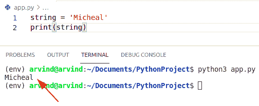

# 如何在 Python 中创建字符串

> 原文：<https://pythonguides.com/create-a-string-in-python/>

[](https://sharepointsky.teachable.com/p/python-and-machine-learning-training-course)

在本 [Python 教程](https://pythonguides.com/python-hello-world-program/)中，我们将讨论**如何在 python** 中创建一个字符串。在这里，我们还将看到 Python 创建字符串的示例:

*   用 Python 创建一个字符串
*   如何在 Python 中从列表创建字符串
*   在 Python 中创建一个 n 个字符的字符串
*   Python 用变量创建一个字符串
*   用 Python 中的换行符创建一个字符串
*   如何在 Python 中创建相同字符的字符串
*   从 Python 字典创建字符串
*   如何在 Python 中创建带双引号的字符串
*   Python 从字符列表创建字符串
*   Python 从带分隔符的列表创建字符串
*   如何在 Python 中创建带单引号的字符串
*   如何在 Python 中创建带有多个变量的字符串

目录

[](#)

*   [Python 字符串](#Python_String "Python String")
*   [在 Python 中创建一个字符串](#Create_a_string_in_Python "Create a string in Python")
*   [如何在 Python 中声明变量并将变量赋给字符串](#How_to_declare_and_assign_a_variable_to_a_string_in_Python "How to declare and assign a variable to a string in Python")
*   [python 中的多行字符串](#Multiline_strings_in_python "Multiline strings in python")
*   [Python 创建一个字符串](#Python_Create_a_string "Python Create a string")
*   [另一个用 Python 创建字符串的例子](#Another_example_to_create_a_string_in_Python "Another example to create a string in Python ")
*   [Python 从列表中创建一个字符串](#Python_create_a_string_from_a_list "Python create a string from a list")
*   [Python 创建了一个 n 字符的字符串](#Python_create_a_string_of_n_character "Python create a string of n character")
*   [创建 n 个字符的字符串的另一种方法](#Another_method_to_create_a_string_of_n_character "Another method to create a string of n character")
*   [Python 用变量创建字符串](#Python_create_a_string_with_variables "Python create a string with variables ")
*   [Python 创建一串相同的字符](#Python_create_a_string_of_same_character "Python create a string of same character")
*   [Python 用换行符创建字符串](#Python_create_a_string_with_newline "Python create a string with newline")
*   [用换行符创建字符串的另一种方法](#Another_method_to_create_a_string_with_newline "Another method to create a string with newline")
*   [Python 从字典中创建一个字符串](#Python_create_a_string_from_dictionary "Python create a string from dictionary")
*   [另一种方法从字典中创建一个字符串](#Another_method_create_a_string_from_dictionary "Another method create a string from dictionary")
*   [Python 用双引号创建一个字符串](#Python_create_a_string_from_double_quotes "Python create a string from double quotes")
*   [Python 从字符列表中创建字符串](#Python_create_string_from_list_of_characters "Python create string from list of characters")
*   [从字符列表创建字符串的另一个例子](#Another_example_to_create_string_from_list_of_characters "Another example to create string from list of characters")
*   [Python 用分隔符从列表中创建字符串](#Python_create_string_from_list_with_seperator "Python create string from list with seperator")
*   [Python 用单引号创建字符串](#Python_create_string_with_single_quotes "Python create string with single quotes")
*   [Python 用多个变量创建字符串](#Python_create_string_with_multiple_variables "Python create string with multiple variables")
*   [python 中的单引号与双引号](#Single_vs_double_quotes_in_python "Single vs double quotes in python")

## Python 字符串

字符串是一系列字符。字符可以是数字、字母、特殊字符等。字符串可以包含空格，并且不限制它应该包含多少个字符。

在 python 中，字符串是一种不可变的数据类型，一旦我们在程序中声明了它，就不能更改。

## 在 Python 中创建一个字符串

现在，我们将看到**如何在 python** 中创建一个字符串或者**如何在 python** 中声明一个字符串？

我们可以用三种方式在 python 中声明一个**字符串**

**1-使用单引号(')**

您可以使用单引号(')来声明一个字符串。让我们看一个例子

示例:

```py
print('Hello PythonGuides!')
```

输出将是

```py
Hello PythonGuides!
```

**2-使用双引号(" ")**

您可以使用双引号(" ")来声明字符串。让我们看一个例子

```py
print("Hello PythonGuides!!")
```

输出将是

```py
Hello PythonGuides!!
```

**3-使用三重引号(“”)**。

您可以使用三个**引号(“”)**来声明一个字符串。让我们看一个例子

```py
print("Hello PythonGuides!!!")
```

输出将是

```py
Hello PythonGuides!!!
```

现在让我们运行所有这三种格式，看看输出。


Create a string in Python

您可以通过在引号前保留一个**反斜杠(\)** 来将引号放入字符串中。

例如:

```py
print ("Hello, \"I love python!\"")
```

输出将是

```py
Hello, "I love python!"
```


How to Create a string in Python

上面的 Python 代码我们可以用来**在 Python** 中创建一个字符串。

你可能会喜欢 [Python 字符串格式化的例子](https://pythonguides.com/python-string-formatting/)。

## 如何在 Python 中声明变量并将变量赋给字符串

现在，让我们看看如何在 Python 中**声明一个变量并将它赋给一个字符串。**

将字符序列放在**单引号(' ')、双引号(" " " " ")或三引号(" " " ")或**、T2(" ' " ')中，以创建字符串，然后将其赋给变量。

要将它赋给一个变量，我们可以使用变量名和 **"= "运算符。**

例如:

```py
x = "Python Guides!"
y = 'Python Guides!!'
z = """ Python Guides!!! """

print(x)
print(y)
print(z)
```


declare and assign a variable to a string

通常单引号和双引号用于指定单行字符的字符串，而三引号用于指定多行字符的字符串。

这是如何在 Python 中声明变量并将变量赋给字符串。

阅读:[追加到一个字符串 Python](https://pythonguides.com/append-to-a-string-python/) 。

## python 中的多行字符串

我们可以使用三重引号**(" " " ")或(" ' ")**将多行字符串赋给一个变量。

例如:

```py
x = """ Python Guides,
        I love Python,
        Python is the best!!. """

y = ''' Python Guides,
        I love Python,
        Python is the best!. '''

print(x)

print(y)
```

输出

```py
Python Guides,
        I love Python,
        Python is the best!!. 
 Python Guides,
        I love Python,
        Python is the best!. 
```

在这里查看输出


Multiline strings in python

阅读 [Python 打印无换行符](https://pythonguides.com/python-print-without-newline/)

## Python 创建一个字符串

*   在这里我们将看到，如何在 Python 中**创建一个字符串。**
*   我们可以使用单引号或双引号来声明 python 中的字符串。
*   Python 没有字符数据类型，字符只是一个有长度的字符串。
*   在这个例子中，我们可以简单地使用单引号或双引号来创建一个字符串，并把一个字符串赋给一个变量，我们可以简单地使用等于运算符和一个字符串值。

**举例:**

让我们举一个例子来检查如何在 python 中创建一个字符串

```py
str = "John"
print(str)
```

*   在上面的例子中，我有一个变量将被命名为 str 并使用双引号。
*   我可以用 John 的名字创建字符串并打印结果。

下面是以下代码的截图


Python Create a string

## 另一个用 Python 创建字符串的例子

在这个方法中，我们必须创建一个字符串，并用单引号将一个字符赋值。

**举例:**

让我们举一个例子来检查如何在 Python 中创建一个字符串

```py
string = 'Micheal'
print(string)
```

下面是以下代码的截图



Create a string in python single

在 Python 中读取[检查一个列表是否为 e](https://pythonguides.com/check-if-a-list-is-empty-in-python/)[m](https://pythonguides.com/check-if-a-list-is-empty-in-python/)[pty](https://pythonguides.com/check-if-a-list-is-empty-in-python/)

## Python 从列表中创建一个字符串

*   让我们看看，如何从 Python 列表中**创建一个字符串。**
*   在这里，我们将执行一些操作，如长度和创建一个列表。
*   列表是 Python 中流行的数据结构之一。它基本上是某种物品或物体的贮藏处。某些项目由逗号[，]分隔，列表用方括号[]括起来。

示例:

让我们举一个例子来检查如何从一个列表中创建一个字符串

```py
str = ['Germany',1,'England',2]
print(len(str)) # display length of the string
#for displaying all the elements of string
print(str)
```

首先在上面的例子中，我们将创建一个列表形式的字符串，并分配一些字符和整数值。在字符串的显示长度之后，输出将显示列表中有多少个元素，并显示字符串的所有元素。

下面是以下代码的截图


Python creates a string from a list

## Python 创建了一个 n 字符的字符串

*   在这一节中，我们将讨论如何创建一个由 n 个字符组成的字符串。
*   这里，我们将创建一个多行字符串并添加一个换行符(\n)。
*   在这个例子中，我们可以很容易地使用换行符(\n)来显示一个新的行字符串。

**举例:**

让我们举一个例子来检查如何创建一个 n 个字符的字符串

```py
string = "Java is a programming language\n Sql is a database"
print(string)
```

在上面的例子中，我们可以简单地使用双引号来创建一个字符串，并将多行字符和换行符(\n)赋给字符串。

下面是以下代码的截图


Python creates a string of n character

阅读[如何用 Python 将列表转换成字符串](https://pythonguides.com/python-convert-list-to-string/)

## 创建 n 个字符的字符串的另一种方法

*   我们可以很容易地使用 **Python join()函数**来创建 n 个字符的字符串。
*   该方法获取序列中所有指定的项，并将它们连接成一个字符串。
*   在本例中，join()方法可用于在字符串中添加换行符(\n)。

**举例**:

```py
str1 =['Germany','France','Australia','England','Switzerland']
str2='\n'
print(str2.join(str1))
```

首先在上面的例子中，我们将创建一个字符串并分配一个元素。然后创建一个新的字符串，添加一个换行符(\n)并将它们连接成一个字符串。

下面是以下代码的截图


Python creates a string of n character join method

## Python 用变量创建字符串

*   让我们看看如何用 Python 创建一个带有变量的字符串
*   变量就像存储值的内存分配。现在这个值已经存储起来，你将来可能会改变它。
*   要创建一个变量，我们只需要给它赋值。
*   在这里创建一个字符串，无论是单引号还是双引号，都将 iterable 或字符项放在里面，然后将它赋给一个变量。

**举例:**

让我们举一个例子来检查如何创建一个带有变量的字符串。

```py
var = "Micheal"
print(var)
```

在上面的例子中，我们将创建一个变量，并给它们分配一个字符串，“**Micheal”**，并打印结果。

下面是以下代码的截图


Python creates a string with variables

阅读 Python 中的[注释行](https://pythonguides.com/comment-lines-in-python/)

## Python 创建一串相同的字符

*   在这一节中，我们将讨论 Python 创建一个相同字符的字符串。这里我们将使用 Python 中的重复操作符。
*   重复运算符使用*符号来表示乘法。
*   这对于将字符串重复到一定长度非常有用。

**举例:**

```py
str = "Micheal is a good programmer" * 3 

print(str)
```

首先在上面的例子中，我们将创建一个字符串，用双引号将一个多行字符串赋值，并应用乘法运算符。

下面是以下代码的截图


Python creates a string of the same character

## Python 用换行符创建一个字符串

*   在这一节中，我们将讨论 **Python 创建了一个带换行符的字符串**。
*   当打印函数在文本字符串中找到反斜杠(\n)时，它知道要开始新的一行，您可以在字符串中根据需要多次使用反斜杠 n。
*   在这个例子中，我们可以很容易地使用换行符(\n)表示当前行在该点结束，新的一行开始。

**举例:**

让我们举一个例子来检查如何创建一个带换行符的字符串

```py
str = "John is a\npython\ndeveloper" 

print(str)
```

首先在上面的例子中，我们将创建一个字符串，用双引号将多行字符赋值，并使用换行符(\n)。

下面是以下代码的截图


Python creates a string with a newline

阅读 [Python NumPy max 示例](https://pythonguides.com/python-numpy-max-with-examples/)

## 用换行符创建字符串的另一种方法

*   在这个方法中，我们可以很容易地使用函数 `print` 来显示新的字符串。
*   打印函数有默认值 `end` 参数，该参数分配一个反斜杠(\n)值。

**语法:**

下面是打印函数的语法

```py
print
     (
      object(s),
      sep=separator,
      end=end,
      file=file,
      flush=flush
     )
```

*   在这个方法中，我们只使用**结束**参数
*   **end:** 可选参数。它指定了最后打印的内容。默认情况下，其值为\n。

**举例:**

让我们举一个例子来检查如何创建一个带有换行符的字符串。

```py
print("Germany")
print("China")
print("England")
print("France")
```

下面是以下代码的截图


Python creates a string with the newline print method

## Python 从字典中创建一个字符串

*   现在让我们讨论一下，如何从 [Python 字典](https://pythonguides.com/create-a-dictionary-in-python/)创建一个字符串。
*   Python 中的字典也是可互换的，它有键值对，就像其他编程语言中的映射。
*   如果我们有一个字符串输入，我们希望类似于一个字典对象。
*   这里我们可以使用 `eval()` 函数。eval()方法传递表达式并在程序内部运行 python 表达式(代码)。

**举例:**

让我们举一个例子来检查如何从字典创建一个字符串

```py
str = "{'John':30,'smith':20,'George':80}"
my_dict= eval(str)
print(my_dict)
print(my_dict['John'])
print(my_dict['George'])
```

在上面的例子中，我们首先初始化一个字符串，并分配一个键值对元素。之后使用 eval()方法并打印结果。

下面是以下代码的截图


Python creates a string from a dictionary

阅读 [Python 字典附加示例](https://pythonguides.com/python-dictionary-append/)

## 另一种方法从字典中创建一个字符串

*   在这个方法中，我们可以很容易地使用 generator expression()方法。
*   生成器表达式类似于列表理解，意味着可迭代表达式被立即求值。
*   在这个例子中，我们将检查，如果我们有一个字符串输入，我们希望类似于一个字典对象，那么我们可以很容易地使用 generator)方法。

**语法:**

下面是生成器表达式()的语法

```py
generator_expression ::= "(" expression _for")"
```

**举例:**

让我们举一个例子来检查如何在字典中创建一个字符串

```py
str = "Australia - 60, France - 90, England - 80"
my_Dict = dict((m.strip(), n.strip())
             for m, n in (value.split('-') 
             for value in str.split(', ')))

print(my_Dict)
print(my_Dict['Australia'])
print(my_Dict['England'])
```

下面是以下代码的截图


Python creates a string from the dictionary generator method

阅读 [Python 字典更新](https://pythonguides.com/python-dictionary-update/)

## Python 用双引号创建一个字符串

*   在这一节中，我们将讨论 **Python 从双引号中创建字符串**。
*   双引号代表 python 中的字符串。要将字符串括起来，可以使用双引号，也可以使用单引号来结束字符串。
*   最重要的是 Python 不允许我们在双引号内提供双引号，单引号也是一样。

**例子:**

让我们举一个例子来看看如何用双引号创建一个字符串

```py
str = "Micheal is a python developer" # Double quotes
print(str)
```

在上面的代码中，您可以看到，首先，我们使用双引号创建一个字符串，然后在 print 函数中为变量 `str` 赋值。

下面是以下代码的截图


Python creates a string from double quotes

**而在双引号内的情况下**

让我们举一个例子，检查在 python 中双引号内的情况下是否正确

```py
str = ""Micheal is a python developer"" # Double quotes
print(str)
```

在上面的代码中，你可以看到我们在字符串中的双引号内使用了双引号。

下面是以下代码的截图


Python double quotes inside double quotes

正如您所看到的，代码没有成功运行，因为当我们创建一个字符串并在双引号内使用双引号时，它会显示一个无效的语法错误。所以在 Python 中，你只能在字符串中使用双引号。

## Python 从字符列表中创建字符串

*   在本节中，我们将讨论 **Python 从字符列表**中创建字符串。
*   这里，我们将使用 `Python join(iterable)` 函数将字符列表转换成字符串。
*   join(iterable)方法对于从 iterable 序列字符创建字符串很有用。
*   这个方法返回一个新的字符串，并连接给定列表中的每个字符。

**举例:**

让我们举一个例子来检查如何从字符列表中创建一个字符串

```py
list = ["john","is","a","good","boy"] # list of characters
str = "".join(list)
print(str)
```

在上面的代码中，你可以看到，首先我们创建了一个列表并给它们分配了字符。之后创建一个**字符串**变量并使用**连接()函数**。它将以**字符串**的形式显示结果。

下面是以下代码的截图


Python creates string from list of characters

阅读 python 中的[无效语法](https://pythonguides.com/invalid-syntax-in-python/)

## 从字符列表创建字符串的另一个例子

让我们举一个例子来检查如何通过使用遍历字符串方法从字符列表创建字符串的另一种方法

```py
list = ["Austrailia","Germany","France","England","Switzerland"] 
def char(list):
    str1=""
    for x in list:
        str1+= x
    return str1
print(char(list))
```

首先在上面的例子中，我们将创建一个列表并将 string 初始化为""，并使用 for 循环方法遍历一个字符串。它将返回一个新的字符串。

下面是以下代码的截图


Python create string from list of character by traversing method

## Python 用分隔符从列表中创建字符串

*   在这一节中，我们将讨论如何用 Python 中的分隔符从列表中创建字符串。
*   在这个方法中，我们可以很容易地使用 join()函数将列表分隔符转换为字符串。
*   该方法将每个列表字符或元素连接成一个逗号分隔的字符串。
*   通过使用。join(iterable)以逗号分隔的“*”作为字符串变量，以列表作为可迭代序列。
*   该方法使用逗号分隔符附加或连接列表中的每个元素，并且总是返回新的字符串形式。

**举例:**

让我们举一个例子，看看如何用分隔符从列表中创建一个字符串

```py
list = ["Jenkins","is","a","automation","tool"] # list of characters
str = "*".join(list)
print(str)
```

下面是以下代码的截图


Python create a string from the list with separator

检查如何用分隔符从列表中创建字符串的另一种方法。

让我们举一个例子，使用 loop+str()方法从带分隔符的列表中创建一个字符串

```py
list = ["mangoes","apple","Grapes","orange"] 

new_str = "&"  
out = '' 
for char in list:
    out = out + str(char) + new_str
print("Final string : " + str(out))
```

在上面的例子中，首先，我们初始化一个列表和分隔符。之后使用循环方法添加一个 `new_str` 变量。输出将显示给定列表中的所有元素都与作为连接者的**、&、**连接在一起。

下面是以下代码的截图


Python create string from list with separator by loop method

读取[语法错误标识符 python3](https://pythonguides.com/syntaxerror-invalid-character-in-identifier-python3/) 中的无效字符

## Python 用单引号创建字符串

*   让我们看看，如何用单引号创建字符串。
*   单引号表示 python 中的字符串。
*   要将字符串括起来，可以使用单引号，也可以使用双引号来结束字符串。

**举例:**

让我们举一个例子来检查如何在 Python 中用单引号创建一个字符串。

```py
str = 'James potter'
print(str)
```

下面是以下代码的截图


Python creates string with single quotes

## Python 用多个变量创建字符串

*   在这一节中，我们将讨论如何用多个变量来**创建字符串。**
*   这里我们将创建三个变量，并用单引号将一个字符串赋值。
*   它将显示所有的字符串。

**举例:**

让我们举一个例子来检查如何创建一个包含多个变量的字符串

```py
str = 'James potter'
str1 = 'Micheal lucifier'
str3 = 'Mathew hayden'
print(str,str1,str3)
```

下面是以下代码的截图


Python creates string with multiple variables

阅读:[在 Python 中切片字符串](https://pythonguides.com/slicing-string-in-python/)

## python 中的单引号与双引号

*   在 python 中，**单引号和双引号**这两种方式都是正确的，并给出相同的输出。然而，在某些情况下，这取决于我们可以在同一个字符串中一起使用引号的要求。
*   这两种类型之间的选择取决于程序员。
*   通常，双引号用于字符串表示，单引号用于正则表达式。

**例 1:**

```py
print('It's Python Guides')
```

**解**——上面的例子给出了一个错误，因为**【它】**后面的单引号被认为是字符串的结尾，其余部分不被认为是字符串，所以抛出了一个错误**无效语法**。正确的做法是**双引号**。因此，根据需要，我们可以使用引号。

```py
print("It's Python Guides")
```

所以从上面的例子中，我们能够区分单引号和双引号的使用。您可以参考下面的输出截图:


Single vs double quotes in python

**例 2:**

```py
print('You are "good"')
```

如果您想在 python 中用双引号打印输出，那么您必须给出单引号来打印字符串 `"good"` ，这是一个双引号。它需要两者同时使用。你可以参考下面的截图。


Single vs double quotes in python

下面是 python 中单引号和双引号的区别。

您可能会喜欢以下 Python 教程:

*   [Python 3 string replace()方法示例](https://pythonguides.com/python-3-string-replace/)
*   [Python 比较字符串](https://pythonguides.com/python-compare-strings/)
*   [Python 在字符串中查找子串](https://pythonguides.com/python-find-substring-in-string/)
*   [无法将字符串转换为浮点 Python](https://pythonguides.com/could-not-convert-string-to-float-python/)
*   [Python 中的乘法与例题](https://pythonguides.com/multiply-in-python/)
*   [如何在 Python 中处理 indexerror:字符串索引超出范围](https://pythonguides.com/indexerror-string-index-out-of-range-python/)

在这个 python 教程中，我们用几个例子来讨论 **Python 创建一个字符串**。

1.  Python 字符串
2.  用 Python 创建一个字符串
3.  如何在 Python 中声明变量并将其赋给字符串
4.  python 中的多行字符串
5.  Python 创建一个字符串
6.  如何在 Python 中创建字符串的示例
7.  Python 从列表中创建一个字符串
8.  Python 创建了一个 n 字符字符串
9.  Python 用变量创建一个字符串
10.  Python 创建了一串相同字符
11.  Python 用换行符创建一个字符串
12.  Python 从字典创建一个字符串
13.  Python 用双引号创建一个字符串
14.  Python 从字符列表创建字符串
15.  Python 使用分隔符从列表创建字符串
16.  Python 用单引号创建字符串
17.  Python 使用多个变量创建字符串
18.  python 中的单引号和双引号

[Bijay Kumar](https://pythonguides.com/author/fewlines4biju/)

Python 是美国最流行的语言之一。我从事 Python 工作已经有很长时间了，我在与 Tkinter、Pandas、NumPy、Turtle、Django、Matplotlib、Tensorflow、Scipy、Scikit-Learn 等各种库合作方面拥有专业知识。我有与美国、加拿大、英国、澳大利亚、新西兰等国家的各种客户合作的经验。查看我的个人资料。

[enjoysharepoint.com/](https://enjoysharepoint.com/)[](https://www.facebook.com/fewlines4biju "Facebook")[](https://www.linkedin.com/in/fewlines4biju/ "Linkedin")[](https://twitter.com/fewlines4biju "Twitter")