# 用 Python 创建一个元组

> 原文：<https://pythonguides.com/create-a-tuple-in-python/>

[](https://sharepointsky.teachable.com/p/python-and-machine-learning-training-course)

在本 [Python 教程](https://pythonguides.com/python-programming-for-the-absolute-beginner/)中，我们将讨论如何**在 Python** 中创建一个 tuple，我们将通过实例了解 **Python 中的 **Tuple。****

*   Python 中的元组是什么
*   如何在 python 中创建空元组
*   如何在 python 中访问元组项
*   在 tuple python 中添加项目
*   python 中元组的长度
*   从元组 python 中移除项目
*   在 Python 中更改元组值
*   Python 连接两个元组
*   Python 检查元素是否存在于元组中
*   在 python 中循环遍历一个元组
*   在 python 中反转一个元组
*   Python 元组与列表

如何用 Python 创建一个 tuple？**在 Python 中创建一个 tuple，用圆括号“()”添加项，像 my_tuple =(“红”、“蓝”、“绿”)创建一个空 tuple，用空圆括号“()”不加项。**

目录

[](#)

*   [Python 中的元组](#Tuple_in_Python "Tuple in Python")
*   [如何在 python 中创建空元组](#How_to_create_an_empty_tuple_in_python "How to create an empty tuple in python")
*   [访问 Python 中的元组项](#Access_tuple_items_in_Python "Access tuple items in Python")
*   [在元组 python 中添加条目](#Add_items_in_the_tuple_python "Add items in the tuple python")
*   [python 中元组的长度](#Length_of_a_tuple_in_python "Length of a tuple in python")
*   [从元组 python 中移除项目](#Remove_item_from_tuple_python "Remove item from tuple python ")
*   [在 Python 中更改元组值](#Change_tuple_values_in_Python "Change tuple values in Python")
*   [Python 连接两个元组](#Python_Join_two_tuple "Python Join two tuple ")
*   [Python 检查元素是否存在于元组中](#Python_check_if_element_exists_in_a_tuple "Python check if element exists in a tuple")
*   [在 python 中循环遍历一个元组](#Loop_through_a_tuple_in_python "Loop through a tuple in python")
*   [在 python 中反转一个元组](#Reverse_a_tuple_in_python "Reverse a tuple in python ")
*   [Python 元组 vs 列表](#Python_tuples_vs_lists "Python tuples vs lists")

## Python 中的元组

在 python 中，**元组是有序且不可变(不可改变)的项目**的集合，元组用圆括号 `"()"` 写成，可以包含混合数据类型。

**举例:**

```py
my_tuple = ("red", "blue", "green")
print(my_tuple)
```

写完上面的代码(Python 中的 tuple)，你将打印出 `"my_tuple"` ，然后输出将显示为**"('红色'，'蓝色'，'绿色')"**。这里，元组是用某个对象创建的。

可以参考下面的截图`Python`中的元组。

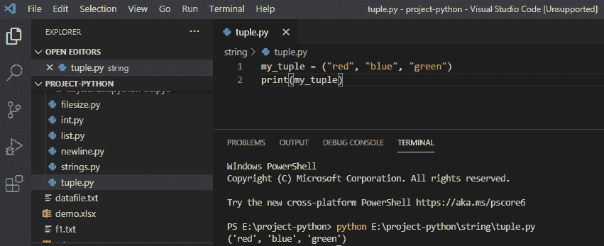

Tuple in Python

## 如何在 python 中创建空元组

为了**在 Python 中创建一个空元组，**使用一个空圆括号 `" () "` ，其中没有任何条目。

**举例:**

```py
my_tuple = ()
print(my_tuple)
```

写完上面的代码(在 python 中创建一个空元组)，你将打印出 `"my_tuple"` ，然后输出将显示为 `" () "` 。这里，创建了一个空元组，其中没有对象。

可以参考下面截图如何**在 python** 中创建空元组。

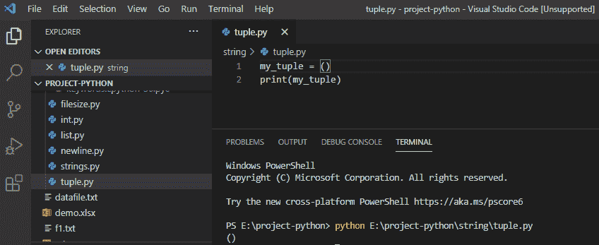

How to create an empty tuple in python

阅读:[如何在 Python 中访问元组的项目](https://pythonguides.com/access-items-of-a-tuple-in-python/)

## 访问 Python 中的元组项

在 python 中，为了访问元组项，我们可以使用**方括号**中的**索引号**从元组中获取指定的项。

**举例:**

```py
my_tuple = ("red", "blue", "green")
print(my_tuple[2])
```

写完上面的代码(python 中的访问元组项)，你将打印出**“my _ tuple[2]”**，然后输出将显示为**“绿色”**。在这里，我们希望打印元组中的第三项，因此绿色的索引号是“[2]”。

可以参考下面的截图访问 python 中的元组项。

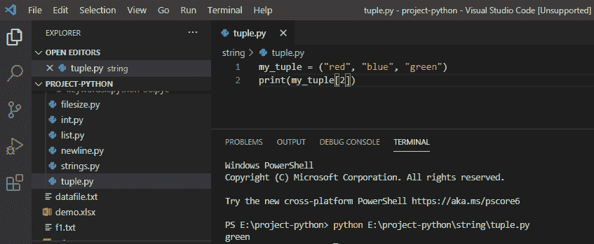

Access tuple items in python

## 在元组 python 中添加条目

在 python 中，**你不能在元组**中添加条目，它是被创建的，元组是不可改变的，这意味着我们不能改变。

**举例:**

```py
my_tuple = ("red", "blue", "green")
my_tuple[3] = "pink"
print(my_tuple)
```

写完上面的代码(在 tuple python 中添加条目)，你将打印出 `"my_tuple"` ，然后输出将显示为 **" TypeError: 'tuple '对象不支持条目赋值"**。在这里，我们不能在元组中添加项目，这将引发一个错误。

你可以参考下面的截图在 tuple python 中添加条目。

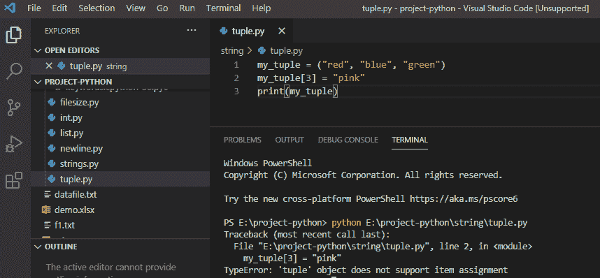

Add items in the tuple python

## python 中元组的长度

在 python 中，为了得到一个元组的长度，我们将使用 `len()` 方法，它将返回一个元组中的项数。

**举例:**

```py
my_tuple = ("red", "blue", "green")
print(len(my_tuple))
```

写完上面的代码(python 中一个元组的长度)，你将打印出 `"len(my_tuple)"` ，然后输出将显示为 `" 3 "` 。这里，len()方法将给出一个元组中一个项的长度。

可以参考下面 python 中一个元组的截图长度。

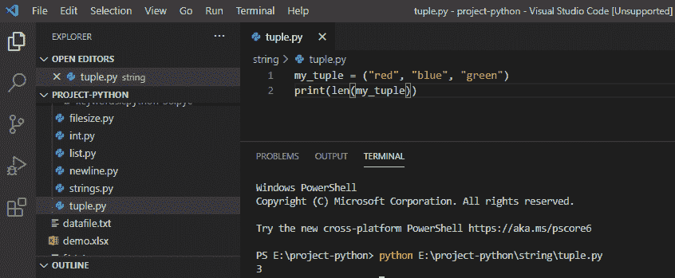

Length of a tuple in python

## 从元组 python 中移除项目

在 python 中，我们不能改变条目，因为元组是不可改变的，所以移除特定条目是不可能的，但是我们可以通过使用 python 中的 `del()` 方法来完全删除元组。

**举例:**

```py
my_tuple = ("red", "blue", "green")
del my_tuple
print(my_tuple)
```

在编写完上面的代码(从 tuple python 中移除该项)后，您将打印出`(my _ tuple)`然后输出将显示为**“name error:name‘my _ tuple’未定义”**。这里，del()方法将完全删除元组，并抛出一个错误。

可以参考下面的截图从 tuple python 中移除项目。

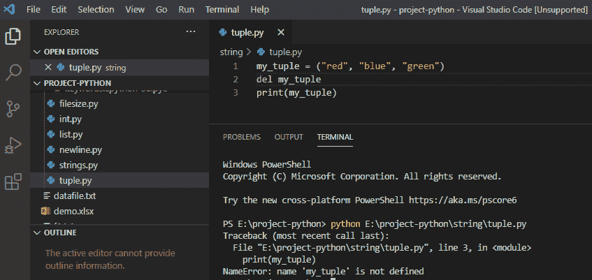

Remove item from tuple python

## 在 Python 中更改元组值

在 python 中，我们知道一个人的元组被创建，它不能改变它的值，因为**元组是不可变的**，但是我们可以通过将元组转换成列表并将列表转换回元组来改变。

**举例:**

```py
my_tuple = ("red", "blue", "green")
a = list(my_tuple)
a[1] = "black"
my_tuple = tuple(a)
print(my_tuple)
```

写完上面的代码(在 Python 中更改元组值)，你将打印出`(my _ tuple)`，然后输出将显示为**"('红色'，'黑色'，'绿色')"**。这里，元组的元素不能被改变，但是它可以将元组转换成列表，然后改变列表并将其转换回元组。

可以参考下面截图用 Python 修改元组值。

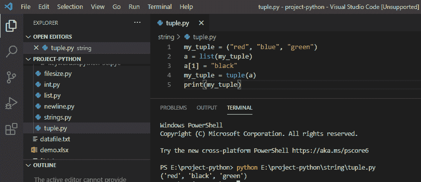

Change tuple values in Python

## Python 连接两个元组

在 python 中，我们将使用 **'+'** 运算符来连接两个或多个元组。

**举例:**

```py
my_tuple1 = ("red", "blue", "green")
my_tuple2 = (2, 4, 6)
my_tuple3 = my_tuple1 + my_tuple2
print(my_tuple3)
```

写完上面的代码(python Join two tuple)，你将打印出`(my _ tuple 3)`，然后输出将显示为 **"('red '，' blue '，' green '，2，4，6)**。这里，我们通过使用“+”运算符将两个现有元组的值赋给一个新元组。

你可以参考下面的 python 连接二元组的截图

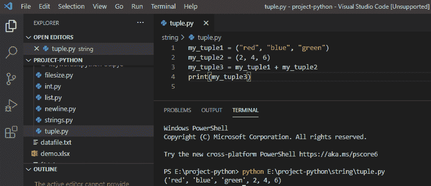

Python Join two tuple

## Python 检查元素是否存在于元组中

在 python 中，为了检查指定的元素是否存在于元组中，我们使用“中的**”关键字进行检查，如果元素不存在，则不会返回任何内容。**

**举例:**

```py
my_tuple = ("red", "blue", "green")
if "blue" in my_tuple:
print("Yes, blue is present")
```

在编写完上面的代码(python 检查元素是否存在于元组中)之后，您将打印这些代码，然后输出将显示为**“是的，蓝色存在”**。这里，如果指定的元素出现在元组中，那么它将返回输出。

你可以参考下面的截图 python 检查元素是否存在于元组中。

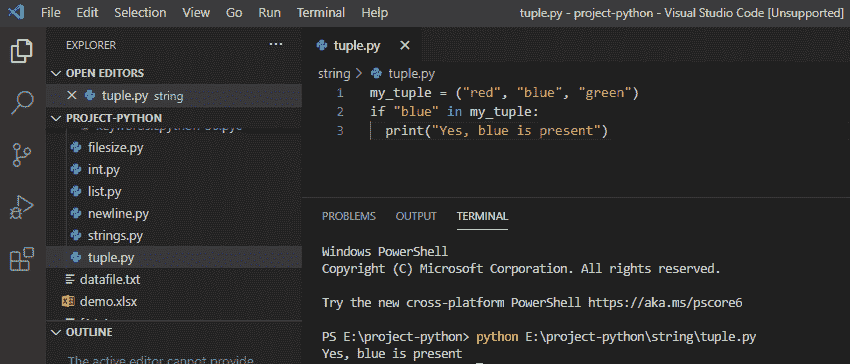

Python check if element exists in a tuple

## 在 python 中循环遍历一个元组

在 python 中，我们使用 **for 循环**来遍历元组元素以打印值。

**举例:**

```py
my_tuple = ("red", "blue", "green")
for a in my_tuple
print(a)
```

写完上面的代码(在 python 中循环遍历一个元组)，你将打印出`(a)`，然后输出将显示为**【红蓝绿】**。这里，通过使用 for 循环，它可以遍历元组项。

可以参考下面的截图 python 连接二元组。

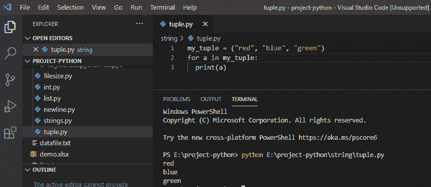

Loop through a tuple in python

## 在 python 中反转一个元组

在 python 中，我们将使用名为 `reversed()` 的内置方法对元组进行反转，反转后的元组在打印前转换为元组。

**举例:**

```py
my_tuple = ("red", "blue", "green")
reverse = reversed(my_tuple)
print(tuple(reverse))
```

写完上面的代码(在 python 中反转一个元组)，你将打印出 `"tuple(reverse)"` ，然后输出将显示为**"('绿色'，'蓝色'，'红色')"**。这里，通过使用 reversed()方法，元素被反转。

你可以参考下面的截图用 python 反转一个元组。

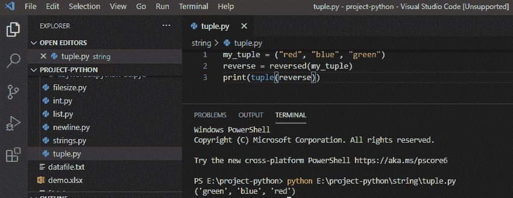

Reverse a tuple in python

阅读:[如何在 Python 中创建元组列表](https://pythonguides.com/list-of-tuples-in-python/)

## Python 元组 vs 列表

| **元组** | **列表** |
| 元组具有静态特征 | 该列表具有动态特征 |
| 元组的功能较少 | 列表比元组有更多的功能 |
| 元组是不可变的 | 列表是可变的 |
| 元组比列表消耗更少内存 | 列表消耗更多的内存 |
| 元组用圆括号()括起来 | 列表通常用方括号[]括起来 |
| 元组语法:
my_tuple=(1，2，3，4，5) | 列表语法:
my_list=[1，2，3，4，5] |

您可能会喜欢以下 Python 教程:

*   [Python 创建空集](https://pythonguides.com/python-create-empty-set/)
*   [Python 关键字与示例](https://pythonguides.com/python-keywords/)
*   [Python While 循环示例](https://pythonguides.com/python-while-loop/)
*   [Python 中的字符串方法及示例](https://pythonguides.com/string-methods-in-python/)
*   [Python 检查变量是否为整数](https://pythonguides.com/python-check-if-the-variable-is-an-integer/)
*   [检查一个数是否是素数 Python](https://pythonguides.com/check-if-a-number-is-a-prime-python/)
*   [Python 将元组转换为列表](https://pythonguides.com/python-convert-tuple-to-list/)
*   [Python 输入和 raw_input 函数](https://pythonguides.com/python-input-and-raw_input-function/)

在本 Python 教程中，我们学习了如何在 Python 中**创建一个元组，我们还看到了:**

*   Python 中的元组是什么
*   如何在 python 中创建空元组
*   如何在 python 中访问元组项
*   在 tuple python 中添加项目
*   python 中元组的长度
*   从元组 python 中移除项目
*   在 Python 中更改元组值
*   Python 连接两个元组
*   Python 检查元素是否存在于元组中
*   在 python 中循环遍历一个元组
*   在 python 中反转一个元组
*   Python 元组与列表

[Bijay Kumar](https://pythonguides.com/author/fewlines4biju/)

Python 是美国最流行的语言之一。我从事 Python 工作已经有很长时间了，我在与 Tkinter、Pandas、NumPy、Turtle、Django、Matplotlib、Tensorflow、Scipy、Scikit-Learn 等各种库合作方面拥有专业知识。我有与美国、加拿大、英国、澳大利亚、新西兰等国家的各种客户合作的经验。查看我的个人资料。

[enjoysharepoint.com/](https://enjoysharepoint.com/)[](https://www.facebook.com/fewlines4biju "Facebook")[](https://www.linkedin.com/in/fewlines4biju/ "Linkedin")[](https://twitter.com/fewlines4biju "Twitter")